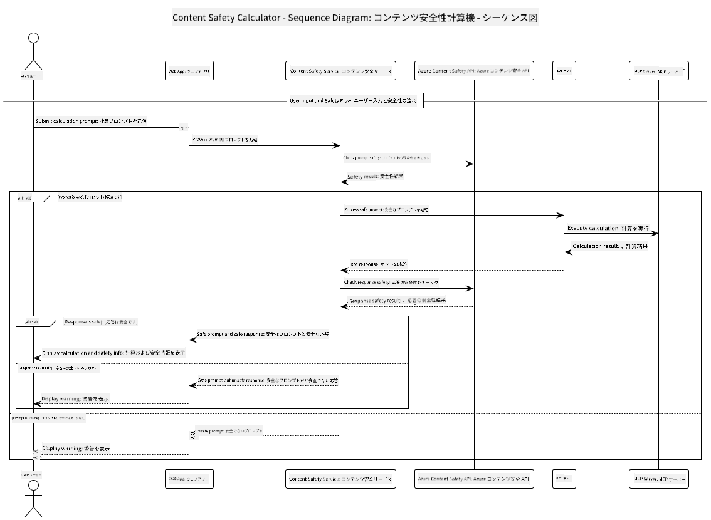

<!--
CO_OP_TRANSLATOR_METADATA:
{
  "original_hash": "e5ea5e7582f70008ea9bec3b3820f20a",
  "translation_date": "2025-05-16T15:38:32+00:00",
  "source_file": "04-PracticalImplementation/samples/java/containerapp/README.md",
  "language_code": "ja"
}
-->
## システムアーキテクチャ

このプロジェクトは、ユーザーの入力プロンプトを計算サービスに渡す前にコンテンツ安全性チェックを行うウェブアプリケーションを示しています。計算サービスとの通信はModel Context Protocol (MCP)を使用しています。



### 動作の流れ

1. **ユーザー入力**: ユーザーがウェブインターフェースに計算プロンプトを入力します  
2. **コンテンツ安全性チェック（入力）**: プロンプトはAzure Content Safety APIによって解析されます  
3. **安全性判定（入力）**:  
   - すべてのカテゴリで重大度が2未満の場合は計算機へ進みます  
   - 危険性が疑われる場合は処理を停止し、警告を返します  
4. **計算機連携**: 安全と判断された内容はLangChain4jによって処理され、MCP計算機サーバーと通信します  
5. **コンテンツ安全性チェック（出力）**: ボットの応答はAzure Content Safety APIで解析されます  
6. **安全性判定（出力）**:  
   - 応答が安全であればユーザーに表示されます  
   - 危険性が疑われる場合は警告に置き換えられます  
7. **応答表示**: 結果（安全な場合）はプロンプトと応答の両方の安全性分析と共にユーザーに表示されます  

## Model Context Protocol (MCP) を使った計算サービスの利用

このプロジェクトは、LangChain4jから計算用MCPサービスを呼び出す方法を示しています。実装では、ローカルのポート8080で動作するMCPサーバーを使って計算操作を提供しています。

### Azure Content Safetyサービスの設定

コンテンツ安全機能を使う前に、Azure Content Safetyサービスのリソースを作成する必要があります：

1. [Azure Portal](https://portal.azure.com) にサインイン  
2. 「リソースの作成」をクリックし、「Content Safety」で検索  
3. 「Content Safety」を選択して「作成」をクリック  
4. リソースの一意の名前を入力  
5. サブスクリプションとリソースグループを選択（または新規作成）  
6. 対応リージョンを選択（詳細は[リージョンの利用状況](https://azure.microsoft.com/en-us/global-infrastructure/services/?products=cognitive-services)を参照）  
7. 適切な料金プランを選択  
8. 「作成」をクリックしてリソースを展開  
9. 展開完了後、「リソースに移動」をクリック  
10. 左ペインの「リソース管理」から「キーとエンドポイント」を選択  
11. 次のステップで使用するため、キーのいずれかとエンドポイントURLをコピー  

### 環境変数の設定

GitHubモデル認証用に`GITHUB_TOKEN`環境変数を設定してください：  
```sh
export GITHUB_TOKEN=<your_github_token>
```

コンテンツ安全機能用には以下を設定します：  
```sh
export CONTENT_SAFETY_ENDPOINT=<your_content_safety_endpoint>
export CONTENT_SAFETY_KEY=<your_content_safety_key>
```

これらの環境変数はアプリケーションがAzure Content Safetyサービスに認証するために使用されます。設定されていない場合はデモ用のプレースホルダー値が使われますが、コンテンツ安全機能は正しく動作しません。

### 計算機MCPサーバーの起動

クライアントを実行する前に、localhost:8080でSSEモードの計算機MCPサーバーを起動する必要があります。

## プロジェクト概要

このプロジェクトは、LangChain4jとModel Context Protocol (MCP)を統合して計算サービスを呼び出す仕組みを示しています。主な特徴は以下の通りです：

- MCPを使って基本的な数学計算サービスに接続  
- ユーザープロンプトとボット応答の両方に対する二重のコンテンツ安全チェック  
- LangChain4jを介したGitHubのgpt-4.1-nanoモデルとの連携  
- MCPの通信にServer-Sent Events (SSE)を使用  

## コンテンツ安全性統合

本プロジェクトには、ユーザー入力とシステム応答の両方が有害な内容を含まないことを保証する包括的なコンテンツ安全機能が組み込まれています：

1. **入力チェック**: ユーザーの全プロンプトは、ヘイトスピーチ、暴力、自傷行為、性的内容などの有害カテゴリに対して解析されます。  
2. **出力チェック**: たとえ検閲されていない可能性のあるモデルを使用していても、生成されたすべての応答は同じコンテンツ安全フィルターで検査され、ユーザーに表示される前に確認されます。  

この二重のアプローチにより、どのAIモデルを使っていてもシステムの安全性が保たれ、ユーザーは有害な入力や問題のあるAI生成出力から守られます。

## ウェブクライアント

本アプリケーションには、ユーザーがContent Safety Calculatorシステムと対話できる使いやすいウェブインターフェースが含まれています：

### ウェブインターフェースの特徴

- 計算プロンプトを入力するシンプルで直感的なフォーム  
- 入力と出力の二重のコンテンツ安全性検証  
- プロンプトと応答の安全性に関するリアルタイムのフィードバック  
- わかりやすい色分けされた安全指標  
- 多様なデバイスで動作するクリーンでレスポンシブなデザイン  
- ユーザーを導く安全なプロンプトの例示  

### ウェブクライアントの使い方

1. アプリケーションを起動：  
   ```sh
   mvn spring-boot:run
   ```

2. ブラウザを開き、`http://localhost:8087` にアクセス  

3. 指定されたテキストエリアに計算プロンプトを入力（例：「24.5と17.3の合計を計算して」）  

4. 「Submit」をクリックしてリクエストを処理  

5. 結果を確認：  
   - プロンプトのコンテンツ安全性分析  
   - （安全な場合）計算結果  
   - ボット応答のコンテンツ安全性分析  
   - 入力または出力がフラグ付けされた場合の安全警告  

ウェブクライアントは両方のコンテンツ安全性検証を自動的に処理し、どのAIモデルを使っていてもすべてのやり取りが安全かつ適切であることを保証します。

**免責事項**:  
本書類はAI翻訳サービス[Co-op Translator](https://github.com/Azure/co-op-translator)を使用して翻訳されています。正確性を期しておりますが、自動翻訳には誤りや不正確な箇所が含まれる可能性があることをご承知おきください。原文の母国語版が正式な情報源とみなされます。重要な情報については、専門の人間による翻訳を推奨します。本翻訳の使用により生じたいかなる誤解や誤訳についても、当方は一切責任を負いかねます。