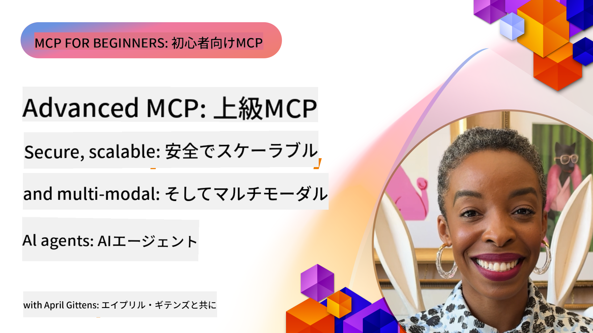

<!--
CO_OP_TRANSLATOR_METADATA:
{
  "original_hash": "d204bc94ea6027d06a703b21b711ca57",
  "translation_date": "2025-07-29T00:10:02+00:00",
  "source_file": "05-AdvancedTopics/README.md",
  "language_code": "ja"
}
-->
# MCPの高度なトピック

_(上の画像をクリックして、このレッスンのビデオをご覧ください)_

この章では、Model Context Protocol (MCP) の実装における高度なトピックを扱います。これには、マルチモーダル統合、スケーラビリティ、セキュリティのベストプラクティス、エンタープライズ統合が含まれます。これらのトピックは、現代のAIシステムの要求を満たす堅牢で本番環境対応のMCPアプリケーションを構築するために重要です。

## 概要

このレッスンでは、Model Context Protocolの実装における高度な概念を探ります。特に、マルチモーダル統合、スケーラビリティ、セキュリティのベストプラクティス、エンタープライズ統合に焦点を当てます。これらのトピックは、複雑な要件を持つエンタープライズ環境での本番対応MCPアプリケーションを構築するために不可欠です。

## 学習目標

このレッスンを終えるまでに、以下ができるようになります：

- MCPフレームワーク内でマルチモーダル機能を実装する
- 高需要シナリオに対応するスケーラブルなMCPアーキテクチャを設計する
- MCPのセキュリティ原則に沿ったセキュリティのベストプラクティスを適用する
- MCPをエンタープライズAIシステムやフレームワークと統合する
- 本番環境でのパフォーマンスと信頼性を最適化する

## レッスンとサンプルプロジェクト

| リンク | タイトル | 説明 |
|------|-------|-------------|
| [5.1 Azureとの統合](./mcp-integration/README.md) | Azureとの統合 | MCPサーバーをAzureに統合する方法を学びます |
| [5.2 マルチモーダルサンプル](./mcp-multi-modality/README.md) | MCPマルチモーダルサンプル | 音声、画像、マルチモーダル応答のサンプル |
| [5.3 MCP OAuth2サンプル](../../../05-AdvancedTopics/mcp-oauth2-demo) | MCP OAuth2デモ | OAuth2を使用したMCPの最小限のSpring Bootアプリ。認可サーバーおよびリソースサーバーとしてのセキュアなトークン発行、保護されたエンドポイント、Azure Container Appsへのデプロイ、API管理の統合を示します。 |
| [5.4 ルートコンテキスト](./mcp-root-contexts/README.md) | ルートコンテキスト | ルートコンテキストについて学び、それを実装する方法を学びます |
| [5.5 ルーティング](./mcp-routing/README.md) | ルーティング | さまざまな種類のルーティングを学びます |
| [5.6 サンプリング](./mcp-sampling/README.md) | サンプリング | サンプリングの操作方法を学びます |
| [5.7 スケーリング](./mcp-scaling/README.md) | スケーリング | スケーリングについて学びます |
| [5.8 セキュリティ](./mcp-security/README.md) | セキュリティ | MCPサーバーを保護します |
| [5.9 ウェブ検索サンプル](./web-search-mcp/README.md) | ウェブ検索MCP | SerpAPIを統合したPython MCPサーバーとクライアント。リアルタイムのウェブ、ニュース、製品検索、Q&Aを実現。マルチツールのオーケストレーション、外部API統合、堅牢なエラーハンドリングを示します。 |
| [5.10 リアルタイムストリーミング](./mcp-realtimestreaming/README.md) | ストリーミング | 今日のデータ駆動型の世界では、リアルタイムデータストリーミングが重要であり、即時の意思決定を可能にします。 |
| [5.11 リアルタイムウェブ検索](./mcp-realtimesearch/README.md) | ウェブ検索 | MCPがリアルタイムウェブ検索をどのように変革するかを学びます。AIモデル、検索エンジン、アプリケーション間でのコンテキスト管理の標準化アプローチを提供します。 |
| [5.12 Model Context ProtocolサーバーのEntra ID認証](./mcp-security-entra/README.md) | Entra ID認証 | Microsoft Entra IDは、クラウドベースの堅牢なIDおよびアクセス管理ソリューションを提供し、認可されたユーザーとアプリケーションのみがMCPサーバーとやり取りできるようにします。 |
| [5.13 Azure AI Foundryエージェント統合](./mcp-foundry-agent-integration/README.md) | Azure AI Foundry統合 | Model Context ProtocolサーバーをAzure AI Foundryエージェントと統合する方法を学びます。これにより、強力なツールオーケストレーションと標準化された外部データソース接続を備えたエンタープライズAI機能が可能になります。 |
| [5.14 コンテキストエンジニアリング](./mcp-contextengineering/README.md) | コンテキストエンジニアリング | MCPサーバーにおけるコンテキストエンジニアリング技術の未来の可能性を探ります。これには、コンテキストの最適化、動的コンテキスト管理、MCPフレームワーク内での効果的なプロンプトエンジニアリングの戦略が含まれます。 |

## 追加の参考資料

最新のMCPの高度なトピックに関する情報は以下を参照してください：
- [MCPドキュメント](https://modelcontextprotocol.io/)
- [MCP仕様](https://spec.modelcontextprotocol.io/)
- [GitHubリポジトリ](https://github.com/modelcontextprotocol)

## 重要なポイント

- マルチモーダルMCPの実装は、テキスト処理を超えたAIの能力を拡張します
- スケーラビリティはエンタープライズ展開に不可欠であり、水平および垂直スケーリングによって対応できます
- 包括的なセキュリティ対策はデータを保護し、適切なアクセス制御を確保します
- Azure OpenAIやMicrosoft AI Foundryなどのプラットフォームとのエンタープライズ統合は、MCPの能力を向上させます
- 高度なMCPの実装は、最適化されたアーキテクチャと慎重なリソース管理から恩恵を受けます

## 演習

特定のユースケースに対してエンタープライズ対応のMCP実装を設計してください：

1. ユースケースに必要なマルチモーダル要件を特定する
2. 機密データを保護するために必要なセキュリティコントロールを概説する
3. 変動する負荷に対応できるスケーラブルなアーキテクチャを設計する
4. エンタープライズAIシステムとの統合ポイントを計画する
5. 潜在的なパフォーマンスのボトルネックとその緩和戦略を文書化する

## 追加リソース

- [Azure OpenAIドキュメント](https://learn.microsoft.com/en-us/azure/ai-services/openai/)
- [Microsoft AI Foundryドキュメント](https://learn.microsoft.com/en-us/ai-services/)

---

## 次のステップ

- [5.1 MCP統合](./mcp-integration/README.md)

**免責事項**:  
この文書は、AI翻訳サービス [Co-op Translator](https://github.com/Azure/co-op-translator) を使用して翻訳されています。正確性を追求しておりますが、自動翻訳には誤りや不正確な部分が含まれる可能性があります。元の言語で記載された文書を正式な情報源としてお考えください。重要な情報については、専門の人間による翻訳を推奨します。この翻訳の使用に起因する誤解や誤解釈について、当社は責任を負いません。