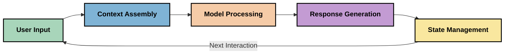
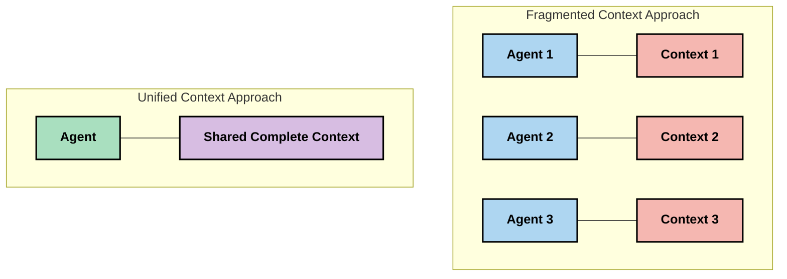
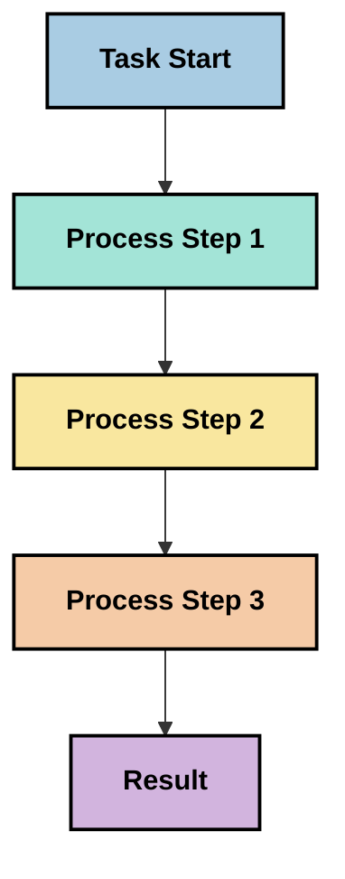
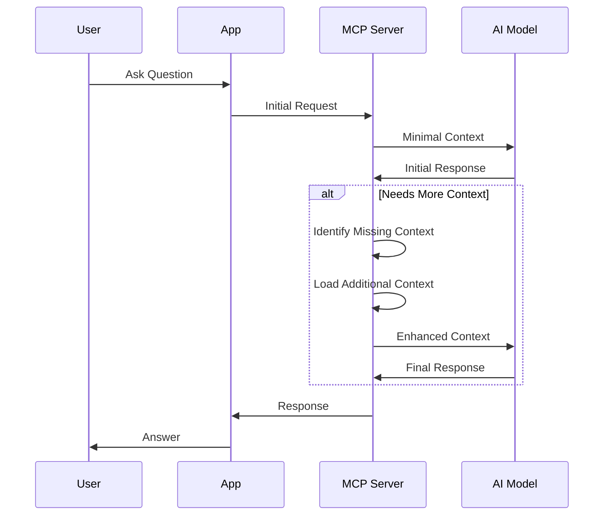
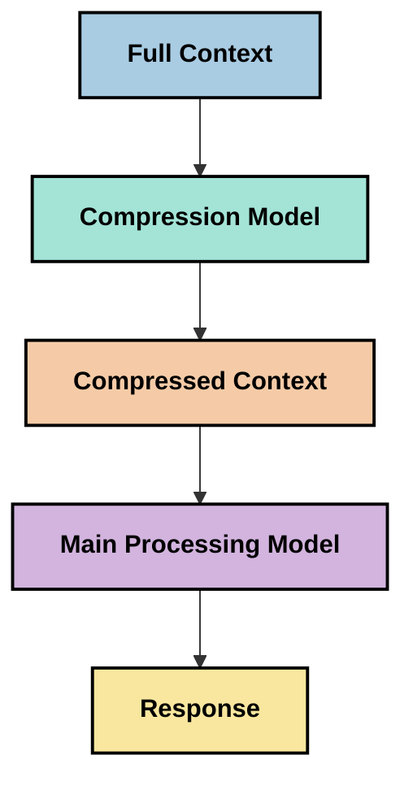

<!--
CO_OP_TRANSLATOR_METADATA:
{
  "original_hash": "5762e8e74dd99d8b7dbb31e69a82561e",
  "translation_date": "2025-07-16T22:58:39+00:00",
  "source_file": "05-AdvancedTopics/mcp-contextengineering/README.md",
  "language_code": "ja"
}
-->
# コンテキストエンジニアリング：MCPエコシステムにおける新たな概念

## 概要

コンテキストエンジニアリングは、クライアントとAIサービス間のやり取りにおいて、情報がどのように構造化され、提供され、維持されるかを探るAI分野の新しい概念です。Model Context Protocol（MCP）エコシステムが進化する中で、コンテキストを効果的に管理する方法の理解がますます重要になっています。本モジュールでは、コンテキストエンジニアリングの概念を紹介し、MCP実装における応用可能性を探ります。

## 学習目標

このモジュールを修了すると、以下ができるようになります：

- コンテキストエンジニアリングという新しい概念と、そのMCPアプリケーションにおける役割を理解する
- MCPプロトコル設計が対処するコンテキスト管理の主要な課題を特定する
- より良いコンテキスト処理によるモデル性能向上の手法を探る
- コンテキストの有効性を測定・評価する方法を検討する
- これらの新しい概念をMCPフレームワークを通じてAI体験の向上に応用する

## コンテキストエンジニアリングの紹介

コンテキストエンジニアリングは、ユーザー、アプリケーション、AIモデル間の情報の流れを意図的に設計・管理することに焦点を当てた新しい概念です。プロンプトエンジニアリングのような確立された分野とは異なり、コンテキストエンジニアリングは、AIモデルに適切な情報を適切なタイミングで提供するという独自の課題を解決しようとする実践者によってまだ定義が進められています。

大規模言語モデル（LLM）が進化するにつれて、コンテキストの重要性はますます明らかになっています。提供するコンテキストの質、関連性、構造がモデルの出力に直接影響を与えます。コンテキストエンジニアリングはこの関係性を探求し、効果的なコンテキスト管理の原則を確立しようとしています。

> 「2025年には、モデルは非常に賢くなっています。しかし、どんなに賢い人間でも、何を求められているのかというコンテキストなしには効果的に仕事をこなせません…『コンテキストエンジニアリング』はプロンプトエンジニアリングの次の段階です。動的なシステムの中でこれを自動的に行うことを意味します。」 — Walden Yan, Cognition AI

コンテキストエンジニアリングには以下のような要素が含まれるかもしれません：

1. **コンテキスト選択**：特定のタスクに関連する情報を決定する
2. **コンテキスト構造化**：モデルの理解を最大化するために情報を整理する
3. **コンテキスト提供**：情報をモデルに送る方法とタイミングを最適化する
4. **コンテキスト維持**：時間経過に伴う状態やコンテキストの変化を管理する
5. **コンテキスト評価**：コンテキストの有効性を測定し改善する

これらの焦点領域は、LLMにコンテキストを提供するための標準化された方法を提供するMCPエコシステムに特に関連しています。

## コンテキストジャーニーの視点

コンテキストエンジニアリングを視覚化する一つの方法は、情報がMCPシステム内で辿る経路を追うことです：



### コンテキストジャーニーの主要な段階：

1. **ユーザー入力**：ユーザーからの生の情報（テキスト、画像、ドキュメント）
2. **コンテキスト組み立て**：ユーザー入力をシステムコンテキスト、会話履歴、その他の取得情報と組み合わせる
3. **モデル処理**：AIモデルが組み立てられたコンテキストを処理する
4. **応答生成**：モデルが提供されたコンテキストに基づいて出力を生成する
5. **状態管理**：システムがやり取りに基づいて内部状態を更新する

この視点は、AIシステムにおけるコンテキストの動的な性質を強調し、各段階で情報をどのように管理すべきかという重要な問いを投げかけます。

## コンテキストエンジニアリングにおける新たな原則

コンテキストエンジニアリングの分野が形成される中で、実践者からいくつかの初期原則が浮かび上がってきています。これらの原則はMCP実装の選択に役立つかもしれません：

### 原則1：コンテキストは完全に共有する

コンテキストはシステムのすべてのコンポーネント間で断片化せず完全に共有されるべきです。コンテキストが分散されると、システムの一部での意思決定が他の部分と矛盾する可能性があります。



MCPアプリケーションでは、コンテキストがパイプライン全体をシームレスに流れるよう設計することが推奨されます。

### 原則2：行動には暗黙の意思決定が伴うことを認識する

モデルが取る各行動は、コンテキストの解釈に関する暗黙の意思決定を含んでいます。複数のコンポーネントが異なるコンテキストで行動すると、これらの暗黙の意思決定が衝突し、一貫性のない結果を招くことがあります。

この原則はMCPアプリケーションに以下の重要な示唆を与えます：
- 複雑なタスクは断片化されたコンテキストでの並列実行よりも直線的な処理を優先する
- すべての意思決定ポイントが同じコンテキスト情報にアクセスできるようにする
- 後のステップが前の意思決定の全コンテキストを参照できるよう設計する

### 原則3：コンテキストの深さとウィンドウ制限のバランスを取る

会話やプロセスが長くなると、コンテキストウィンドウはやがて溢れます。効果的なコンテキストエンジニアリングは、包括的なコンテキストと技術的制限の間のこの緊張を管理する方法を模索します。

検討されているアプローチ例：
- トークン使用量を減らしつつ重要な情報を保持するコンテキスト圧縮
- 現在のニーズに応じて段階的にコンテキストを読み込む方法
- 重要な意思決定や事実を保持しつつ過去のやり取りを要約する手法

## コンテキストの課題とMCPプロトコル設計

Model Context Protocol（MCP）は、コンテキスト管理の独自の課題を認識して設計されています。これらの課題を理解することで、MCPプロトコル設計の重要な側面が見えてきます：

### 課題1：コンテキストウィンドウの制限
ほとんどのAIモデルは固定サイズのコンテキストウィンドウを持ち、一度に処理できる情報量に制限があります。

**MCPの設計対応：**  
- 効率的に参照可能な構造化されたリソースベースのコンテキストをサポート  
- リソースはページングされ段階的に読み込める

### 課題2：関連性の判断
どの情報をコンテキストに含めるべきかを判断するのは難しいです。

**MCPの設計対応：**  
- 必要に応じて動的に情報を取得できる柔軟なツール群  
- 一貫したコンテキスト構成を可能にする構造化プロンプト

### 課題3：コンテキストの持続性
やり取りを跨いだ状態管理にはコンテキストの追跡が必要です。

**MCPの設計対応：**  
- 標準化されたセッション管理  
- コンテキストの進化を明確に定義したインタラクションパターン

### 課題4：マルチモーダルコンテキスト
テキスト、画像、構造化データなど異なる種類のデータは異なる扱いが必要です。

**MCPの設計対応：**  
- 多様なコンテンツタイプに対応したプロトコル設計  
- マルチモーダル情報の標準化された表現

### 課題5：セキュリティとプライバシー
コンテキストには機密情報が含まれることが多く、保護が必要です。

**MCPの設計対応：**  
- クライアントとサーバーの責任範囲を明確化  
- データ露出を最小限に抑えるローカル処理オプション

これらの課題とMCPの対応策を理解することは、より高度なコンテキストエンジニアリング技術を探求する基盤となります。

## 新たに登場するコンテキストエンジニアリング手法

コンテキストエンジニアリングの分野が発展する中で、いくつかの有望な手法が現れています。これらは確立されたベストプラクティスではなく、MCP実装の経験を積む中で進化していく考え方です。

### 1. シングルスレッドの直線的処理

コンテキストを分散させるマルチエージェント構造とは対照的に、単一スレッドで直線的に処理する方が一貫した結果を生むとする実践者もいます。これは統一されたコンテキストを維持する原則に合致します。



この方法は並列処理より効率が劣るように見えるかもしれませんが、各ステップが前の意思決定を完全に理解した上で進むため、より整合性のある信頼できる結果を生みやすいです。

### 2. コンテキストのチャンク化と優先順位付け

大きなコンテキストを扱いやすい断片に分割し、重要な部分を優先的に選択する方法。

```python
# Conceptual Example: Context Chunking and Prioritization
def process_with_chunked_context(documents, query):
    # 1. Break documents into smaller chunks
    chunks = chunk_documents(documents)
    
    # 2. Calculate relevance scores for each chunk
    scored_chunks = [(chunk, calculate_relevance(chunk, query)) for chunk in chunks]
    
    # 3. Sort chunks by relevance score
    sorted_chunks = sorted(scored_chunks, key=lambda x: x[1], reverse=True)
    
    # 4. Use the most relevant chunks as context
    context = create_context_from_chunks([chunk for chunk, score in sorted_chunks[:5]])
    
    # 5. Process with the prioritized context
    return generate_response(context, query)
```

上記の概念は、大きなドキュメントを扱いやすい断片に分け、最も関連性の高い部分だけをコンテキストとして選ぶ例を示しています。この手法はコンテキストウィンドウの制限内で大規模な知識ベースを活用するのに役立ちます。

### 3. 段階的コンテキスト読み込み

必要に応じてコンテキストを段階的に読み込む方法。



段階的読み込みは最小限のコンテキストから始め、必要に応じて拡張します。これにより、単純なクエリではトークン使用量を大幅に削減しつつ、複雑な質問にも対応可能です。

### 4. コンテキスト圧縮と要約

重要な情報を保持しつつコンテキストのサイズを削減する方法。



コンテキスト圧縮は以下に注力します：
- 冗長な情報の削除  
- 長文の要約  
- 重要な事実や詳細の抽出  
- 重要なコンテキスト要素の保持  
- トークン効率の最適化

この手法は長い会話をコンテキストウィンドウ内に収めたり、大量のドキュメントを効率的に処理したりする際に特に有用です。会話履歴の圧縮や要約に特化したモデルを使う実践者もいます。

## 探索的なコンテキストエンジニアリングの考慮点

コンテキストエンジニアリングの新しい分野を探求する際、MCP実装で考慮すべき点がいくつかあります。これらは必ずしもベストプラクティスではなく、特定のユースケースで改善をもたらす可能性のある探索領域です。

### コンテキストの目標を明確にする

複雑なコンテキスト管理を導入する前に、達成したいことをはっきりさせましょう：
- モデルが成功するために必要な具体的な情報は何か？  
- どの情報が必須で、どれが補助的か？  
- パフォーマンスの制約（レイテンシ、トークン制限、コスト）は？

### 層状コンテキストアプローチを検討する

一部の実践者は、概念的な層に分けてコンテキストを整理する方法で成功を収めています：
- **コア層**：モデルが常に必要とする必須情報  
- **状況層**：現在のやり取りに特有のコンテキスト  
- **補助層**：役立つ可能性のある追加情報  
- **フォールバック層**：必要時にのみアクセスされる情報

### 検索戦略を調査する

コンテキストの効果は情報の取得方法に大きく依存します：
- 概念的に関連する情報を見つけるためのセマンティック検索や埋め込み  
- 特定の事実を探すためのキーワード検索  
- 複数の検索方法を組み合わせたハイブリッドアプローチ  
- カテゴリ、日付、ソースに基づくメタデータフィルタリングで範囲を絞る

### コンテキストの一貫性を試す

コンテキストの構造や流れはモデルの理解に影響を与えるかもしれません：
- 関連情報をまとめて配置する  
- 一貫したフォーマットや整理方法を使う  
- 論理的または時系列的な順序を維持する  
- 矛盾する情報を避ける

### マルチエージェント構造のトレードオフを考慮する

多くのAIフレームワークで人気のあるマルチエージェント構造は、コンテキスト管理において以下のような課題があります：
- コンテキストの断片化によりエージェント間で意思決定が不整合になる  
- 並列処理が調整困難な衝突を生む可能性  
- エージェント間の通信オーバーヘッドが性能向上を相殺する  
- 一貫性を保つための複雑な状態管理が必要

多くの場合、断片化されたコンテキストを持つ複数の専門エージェントよりも、包括的なコンテキスト管理を行う単一エージェントの方が信頼性の高い結果を生みやすいです。

### 評価方法を開発する

コンテキストエンジニアリングを改善するために、成功をどう測るかを考えましょう：
- 異なるコンテキスト構造のA/Bテスト  
- トークン使用量や応答時間のモニタリング  
- ユーザー満足度やタスク完了率の追跡  
- コンテキスト戦略が失敗するケースの分析

これらの考慮点はコンテキストエンジニアリング分野で活発に探求されている領域です。分野が成熟するにつれて、より明確なパターンや実践が現れるでしょう。

## コンテキストの有効性を測る：進化するフレームワーク

コンテキストエンジニアリングが概念として登場する中で、その有効性を測る方法も模索されています。まだ確立されたフレームワークはありませんが、将来の指針となる可能性のある様々な指標が検討されています。

### 測定の可能な次元

#### 1. 入力効率の観点

- **コンテキスト対応答比率**：
- [Model Context Protocol Website](https://modelcontextprotocol.io/)
- [Model Context Protocol Specification](https://github.com/modelcontextprotocol/modelcontextprotocol)
- [MCP Documentation](https://modelcontextprotocol.io/docs)
- [MCP C# SDK](https://github.com/modelcontextprotocol/csharp-sdk)
- [MCP Python SDK](https://github.com/modelcontextprotocol/python-sdk)
- [MCP TypeScript SDK](https://github.com/modelcontextprotocol/typescript-sdk)
- [MCP Inspector](https://github.com/modelcontextprotocol/inspector) - MCPサーバーのためのビジュアルテストツール

### コンテキストエンジニアリング関連記事
- [Don't Build Multi-Agents: Principles of Context Engineering](https://cognition.ai/blog/dont-build-multi-agents) - Walden Yanによるコンテキストエンジニアリングの原則に関する洞察
- [A Practical Guide to Building Agents](https://cdn.openai.com/business-guides-and-resources/a-practical-guide-to-building-agents.pdf) - OpenAIによる効果的なエージェント設計のガイド
- [Building Effective Agents](https://www.anthropic.com/engineering/building-effective-agents) - Anthropicのエージェント開発アプローチ

### 関連研究
- [Dynamic Retrieval Augmentation for Large Language Models](https://arxiv.org/abs/2310.01487) - 動的検索手法に関する研究
- [Lost in the Middle: How Language Models Use Long Contexts](https://arxiv.org/abs/2307.03172) - コンテキスト処理パターンに関する重要な研究
- [Hierarchical Text-Conditioned Image Generation with CLIP Latents](https://arxiv.org/abs/2204.06125) - コンテキスト構造に関する洞察を含むDALL-E 2の論文
- [Exploring the Role of Context in Large Language Model Architectures](https://aclanthology.org/2023.findings-emnlp.124/) - コンテキスト処理に関する最新研究
- [Multi-Agent Collaboration: A Survey](https://arxiv.org/abs/2304.03442) - マルチエージェントシステムとその課題に関する調査研究

### 追加リソース
- [Context Window Optimization Techniques](https://learn.microsoft.com/en-us/azure/ai-services/openai/concepts/context-window)
- [Advanced RAG Techniques](https://www.microsoft.com/en-us/research/blog/retrieval-augmented-generation-rag-and-frontier-models/)
- [Semantic Kernel Documentation](https://github.com/microsoft/semantic-kernel)
- [AI Toolkit for Context Management](https://github.com/microsoft/aitoolkit)

## 次にやること
- [6. Community Contributions](../../06-CommunityContributions/README.md)

**免責事項**：  
本書類はAI翻訳サービス「[Co-op Translator](https://github.com/Azure/co-op-translator)」を使用して翻訳されました。正確性の向上に努めておりますが、自動翻訳には誤りや不正確な部分が含まれる可能性があります。原文の言語によるオリジナル文書が正式な情報源とみなされるべきです。重要な情報については、専門の人間による翻訳を推奨します。本翻訳の利用により生じたいかなる誤解や誤訳についても、当方は一切の責任を負いかねます。