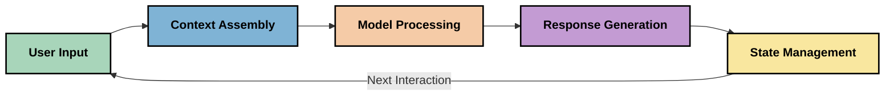
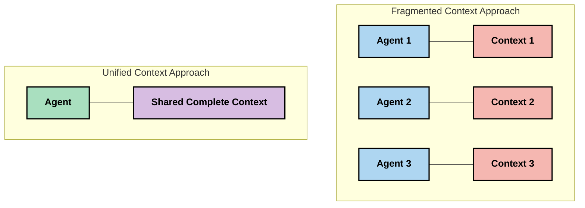
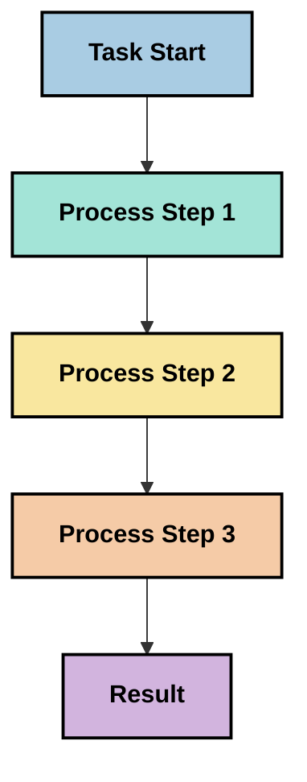
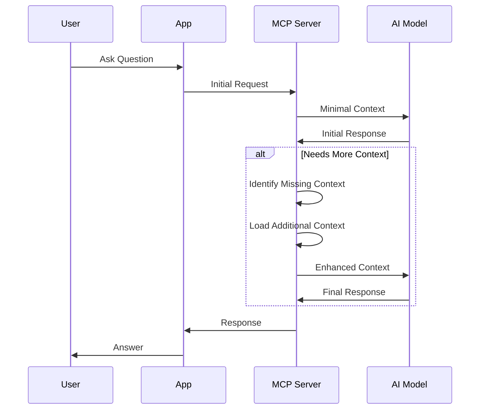
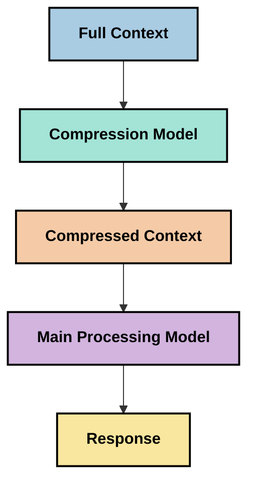

<!--
CO_OP_TRANSLATOR_METADATA:
{
  "original_hash": "fd169ca3071b81b5ee282e194bc823df",
  "translation_date": "2025-09-15T19:59:22+00:00",
  "source_file": "05-AdvancedTopics/mcp-contextengineering/README.md",
  "language_code": "ja"
}
-->
# コンテキストエンジニアリング: MCPエコシステムにおける新たな概念

## 概要

コンテキストエンジニアリングは、AI分野で新たに注目されている概念であり、クライアントとAIサービス間のやり取りにおいて情報がどのように構造化され、提供され、維持されるかを探求します。モデルコンテキストプロトコル（MCP）エコシステムが進化する中で、コンテキストを効果的に管理する方法を理解することがますます重要になっています。このモジュールでは、コンテキストエンジニアリングの概念を紹介し、MCP実装におけるその潜在的な応用を探ります。

## 学習目標

このモジュールを終了する頃には、以下のことができるようになります：

- コンテキストエンジニアリングの新たな概念とMCPアプリケーションにおけるその役割を理解する
- MCPプロトコル設計が対処するコンテキスト管理における主要な課題を特定する
- より良いコンテキスト処理を通じてモデルのパフォーマンスを向上させる技術を探る
- コンテキストの有効性を測定・評価するアプローチを検討する
- MCPフレームワークを通じてAI体験を向上させるためにこれらの新たな概念を適用する

## コンテキストエンジニアリングの導入

コンテキストエンジニアリングは、ユーザー、アプリケーション、AIモデル間の情報フローを意図的に設計・管理することに焦点を当てた新たな概念です。プロンプトエンジニアリングのような確立された分野とは異なり、コンテキストエンジニアリングはまだ実践者によって定義されつつあり、AIモデルに適切な情報を適切なタイミングで提供するという独自の課題を解決するために取り組まれています。

大規模言語モデル（LLM）が進化するにつれて、コンテキストの重要性がますます明らかになっています。提供するコンテキストの質、関連性、構造がモデルの出力に直接影響を与えます。コンテキストエンジニアリングはこの関係を探求し、効果的なコンテキスト管理の原則を開発することを目指しています。

> 「2025年には、モデルは非常に知的になります。しかし、最も賢い人間でも、何を求められているかというコンテキストなしでは効果的に仕事をすることはできません...『コンテキストエンジニアリング』はプロンプトエンジニアリングの次の段階です。これは動的なシステムで自動的にこれを行うことに関するものです。」 — Walden Yan, Cognition AI

コンテキストエンジニアリングには以下の要素が含まれる可能性があります：

1. **コンテキスト選択**: 特定のタスクに関連する情報を決定する
2. **コンテキスト構造化**: モデルの理解を最大化するために情報を整理する
3. **コンテキスト提供**: 情報をモデルに送る方法とタイミングを最適化する
4. **コンテキスト維持**: コンテキストの状態と進化を管理する
5. **コンテキスト評価**: コンテキストの有効性を測定し改善する

これらの焦点領域は、LLMにコンテキストを提供するための標準化された方法を提供するMCPエコシステムに特に関連しています。

## コンテキストの旅の視点

コンテキストエンジニアリングを視覚化する一つの方法は、MCPシステム内で情報が辿る旅を追跡することです：



### コンテキストの旅における主要な段階：

1. **ユーザー入力**: ユーザーからの生の情報（テキスト、画像、ドキュメント）
2. **コンテキスト組み立て**: ユーザー入力をシステムコンテキスト、会話履歴、その他の取得情報と組み合わせる
3. **モデル処理**: 組み立てられたコンテキストをAIモデルが処理する
4. **応答生成**: モデルが提供されたコンテキストに基づいて出力を生成する
5. **状態管理**: システムがやり取りに基づいて内部状態を更新する

この視点は、AIシステムにおけるコンテキストの動的な性質を強調し、各段階で情報を最適に管理する方法について重要な問いを投げかけます。

## コンテキストエンジニアリングにおける新たな原則

コンテキストエンジニアリングの分野が形成されるにつれて、実践者からいくつかの初期原則が浮かび上がっています。これらの原則はMCP実装の選択を情報提供する助けとなるかもしれません。

### 原則1: コンテキストを完全に共有する

コンテキストはシステムのすべてのコンポーネント間で完全に共有されるべきであり、複数のエージェントやプロセスに分断されるべきではありません。コンテキストが分散されると、システムの一部で行われた決定が他の部分で行われた決定と矛盾する可能性があります。



MCPアプリケーションでは、コンテキストがパイプライン全体をシームレスに流れるように設計することが推奨されます。

### 原則2: 行動が暗黙の決定を伴うことを認識する

モデルが取る各行動は、コンテキストを解釈する方法についての暗黙の決定を伴います。複数のコンポーネントが異なるコンテキストで動作すると、これらの暗黙の決定が矛盾し、一貫性のない結果をもたらす可能性があります。

この原則はMCPアプリケーションに重要な影響を与えます：
- 複雑なタスクの並列実行よりも、断片化されたコンテキストを避けた線形処理を優先する
- すべての意思決定ポイントが同じコンテキスト情報にアクセスできるようにする
- 後のステップが以前の決定の完全なコンテキストを確認できるようにシステムを設計する

### 原則3: コンテキストの深さとウィンドウ制限のバランスを取る

会話やプロセスが長くなるにつれて、コンテキストウィンドウが最終的に溢れます。効果的なコンテキストエンジニアリングは、包括的なコンテキストと技術的制限の間の緊張を管理するアプローチを探求します。

探求されている潜在的なアプローチには以下が含まれます：
- トークン使用量を削減しながら重要な情報を維持するコンテキスト圧縮
- 現在のニーズに関連するコンテキストの段階的なロード
- 以前のやり取りを要約し、重要な決定や事実を保持する

## コンテキストの課題とMCPプロトコル設計

モデルコンテキストプロトコル（MCP）は、コンテキスト管理の独自の課題を認識して設計されました。これらの課題を理解することで、MCPプロトコル設計の重要な側面を説明する助けとなります：

### 課題1: コンテキストウィンドウの制限
ほとんどのAIモデルには固定されたコンテキストウィンドウサイズがあり、一度に処理できる情報量が制限されています。

**MCP設計の対応策:** 
- プロトコルは効率的に参照できる構造化されたリソースベースのコンテキストをサポート
- リソースはページ分割され、段階的にロード可能

### 課題2: 関連性の判断
コンテキストに含めるべき情報の関連性を判断することは困難です。

**MCP設計の対応策:**
- 柔軟なツールにより、ニーズに基づいて動的に情報を取得可能
- 一貫したコンテキスト構成を可能にする構造化プロンプト

### 課題3: コンテキストの持続性
やり取りを通じて状態を管理するには、コンテキストを慎重に追跡する必要があります。

**MCP設計の対応策:**
- 標準化されたセッション管理
- コンテキスト進化のための明確に定義されたやり取りパターン

### 課題4: マルチモーダルコンテキスト
異なる種類のデータ（テキスト、画像、構造化データ）は異なる処理が必要です。

**MCP設計の対応策:**
- プロトコル設計はさまざまなコンテンツタイプに対応
- マルチモーダル情報の標準化された表現

### 課題5: セキュリティとプライバシー
コンテキストにはしばしば保護すべき機密情報が含まれます。

**MCP設計の対応策:**
- クライアントとサーバーの責任範囲を明確に区別
- データ露出を最小限に抑えるローカル処理オプション

これらの課題を理解し、MCPがそれにどのように対応しているかを知ることで、より高度なコンテキストエンジニアリング技術を探求する基盤が得られます。

## コンテキストエンジニアリングの新たなアプローチ

コンテキストエンジニアリングの分野が発展する中で、いくつかの有望なアプローチが浮上しています。これらは現在の考え方を反映しており、確立されたベストプラクティスではありませんが、MCP実装の経験を積むにつれて進化する可能性があります。

### 1. シングルスレッドの線形処理

コンテキストを分散するマルチエージェントアーキテクチャとは対照的に、一部の実践者はシングルスレッドの線形処理がより一貫した結果を生むことを発見しています。これは統一されたコンテキストを維持する原則と一致します。



このアプローチは並列処理よりも効率が低いように見えるかもしれませんが、各ステップが以前の決定の完全な理解に基づいて構築されるため、より一貫性のある信頼性の高い結果を生むことがよくあります。

### 2. コンテキストの分割と優先順位付け

大きなコンテキストを管理可能な部分に分割し、最も重要なものを優先する。

```python
# Conceptual Example: Context Chunking and Prioritization
def process_with_chunked_context(documents, query):
    # 1. Break documents into smaller chunks
    chunks = chunk_documents(documents)
    
    # 2. Calculate relevance scores for each chunk
    scored_chunks = [(chunk, calculate_relevance(chunk, query)) for chunk in chunks]
    
    # 3. Sort chunks by relevance score
    sorted_chunks = sorted(scored_chunks, key=lambda x: x[1], reverse=True)
    
    # 4. Use the most relevant chunks as context
    context = create_context_from_chunks([chunk for chunk, score in sorted_chunks[:5]])
    
    # 5. Process with the prioritized context
    return generate_response(context, query)
```

上記の概念は、大きなドキュメントを管理可能な部分に分割し、コンテキストに最も関連性の高い部分のみを選択する方法を示しています。このアプローチは、コンテキストウィンドウの制限内で作業しながら、大規模な知識ベースを活用するのに役立ちます。

### 3. コンテキストの段階的ロード

必要に応じてコンテキストを段階的にロードする。



段階的なコンテキストロードは、最小限のコンテキストから始め、必要に応じて拡張します。これにより、単純なクエリのトークン使用量を大幅に削減しながら、複雑な質問に対応する能力を維持できます。

### 4. コンテキストの圧縮と要約

コンテキストサイズを削減しながら重要な情報を保持する。



コンテキスト圧縮は以下に焦点を当てます：
- 冗長な情報の削除
- 長い内容の要約
- 重要な事実や詳細の抽出
- 重要なコンテキスト要素の保持
- トークン効率の最適化

このアプローチは、長い会話をコンテキストウィンドウ内で維持したり、大きなドキュメントを効率的に処理したりするのに特に価値があります。一部の実践者は、会話履歴のコンテキスト圧縮と要約専用のモデルを使用しています。

## 探索的コンテキストエンジニアリングの考慮事項

MCP実装でコンテキストエンジニアリングを探求する際には、いくつかの考慮事項を念頭に置くことが重要です。これらは規範的なベストプラクティスではなく、特定のユースケースで改善をもたらす可能性のある探索領域です。

### コンテキストの目標を考慮する

複雑なコンテキスト管理ソリューションを実装する前に、達成しようとしていることを明確にする：
- モデルが成功するために必要な具体的な情報は何か？
- 必須情報と補足情報の違いは何か？
- パフォーマンス制約（遅延、トークン制限、コスト）は何か？

### 層状コンテキストアプローチを探る

一部の実践者は、概念的な層に配置されたコンテキストで成功を収めています：
- **コア層**: モデルが常に必要とする重要な情報
- **状況層**: 現在のやり取りに特化したコンテキスト
- **補助層**: 役立つ可能性のある追加情報
- **フォールバック層**: 必要に応じてのみアクセスされる情報

### 取得戦略を調査する

コンテキストの有効性は、情報を取得する方法に依存することがよくあります：
- 概念的に関連する情報を見つけるためのセマンティック検索と埋め込み
- 特定の事実詳細を検索するためのキーワードベースの検索
- 複数の取得方法を組み合わせたハイブリッドアプローチ
- カテゴリ、日付、ソースに基づいて範囲を絞るメタデータフィルタリング

### コンテキストの一貫性を実験する

コンテキストの構造と流れがモデルの理解に影響を与える可能性があります：
- 関連する情報をグループ化する
- 一貫したフォーマットと構成を使用する
- 適切な場合は論理的または時系列的な順序を維持する
- 矛盾する情報を避ける

### マルチエージェントアーキテクチャのトレードオフを検討する

多くのAIフレームワークでマルチエージェントアーキテクチャが人気ですが、コンテキスト管理には重大な課題があります：
- コンテキストの断片化がエージェント間で矛盾した決定をもたらす可能性がある
- 並列処理が調整困難な矛盾を引き起こす可能性がある
- エージェント間の通信オーバーヘッドがパフォーマンス向上を相殺する可能性がある
- 一貫性を維持するために複雑な状態管理が必要

多くの場合、断片化されたコンテキストを持つ複数の専門エージェントよりも、包括的なコンテキスト管理を備えた単一エージェントアプローチの方が信頼性の高い結果を生む可能性があります。

### 評価方法を開発する

コンテキストエンジニアリングを時間とともに改善するために、成功を測定する方法を検討する：
- 異なるコンテキスト構造のA/Bテスト
- トークン使用量と応答時間の監視
- ユーザー満足度とタスク完了率の追跡
- コンテキスト戦略が失敗
- [Model Context Protocol Website](https://modelcontextprotocol.io/)
- [Model Context Protocol Specification](https://github.com/modelcontextprotocol/modelcontextprotocol)
- [MCP Documentation](https://modelcontextprotocol.io/docs)
- [MCP C# SDK](https://github.com/modelcontextprotocol/csharp-sdk)
- [MCP Python SDK](https://github.com/modelcontextprotocol/python-sdk)
- [MCP TypeScript SDK](https://github.com/modelcontextprotocol/typescript-sdk)
- [MCP Inspector](https://github.com/modelcontextprotocol/inspector) - MCPサーバーの視覚的テストツール

### コンテキストエンジニアリングに関する記事
- [Don't Build Multi-Agents: Principles of Context Engineering](https://cognition.ai/blog/dont-build-multi-agents) - Walden Yanによるコンテキストエンジニアリングの原則に関する洞察
- [A Practical Guide to Building Agents](https://cdn.openai.com/business-guides-and-resources/a-practical-guide-to-building-agents.pdf) - 効果的なエージェント設計に関するOpenAIのガイド
- [Building Effective Agents](https://www.anthropic.com/engineering/building-effective-agents) - エージェント開発に関するAnthropicのアプローチ

### 関連研究
- [Dynamic Retrieval Augmentation for Large Language Models](https://arxiv.org/abs/2310.01487) - 動的な検索アプローチに関する研究
- [Lost in the Middle: How Language Models Use Long Contexts](https://arxiv.org/abs/2307.03172) - コンテキスト処理パターンに関する重要な研究
- [Hierarchical Text-Conditioned Image Generation with CLIP Latents](https://arxiv.org/abs/2204.06125) - コンテキスト構造に関する洞察を含むDALL-E 2の論文
- [Exploring the Role of Context in Large Language Model Architectures](https://aclanthology.org/2023.findings-emnlp.124/) - コンテキスト処理に関する最新の研究
- [Multi-Agent Collaboration: A Survey](https://arxiv.org/abs/2304.03442) - マルチエージェントシステムとその課題に関する研究

### 追加リソース
- [Context Window Optimization Techniques](https://learn.microsoft.com/en-us/azure/ai-services/openai/concepts/context-window)
- [Advanced RAG Techniques](https://www.microsoft.com/en-us/research/blog/retrieval-augmented-generation-rag-and-frontier-models/)
- [Semantic Kernel Documentation](https://github.com/microsoft/semantic-kernel)
- [AI Toolkit for Context Management](https://github.com/microsoft/aitoolkit)

## 次のステップ

- [5.15 MCP Custom Transport](../mcp-transport/README.md)

---

**免責事項**:  
この文書は、AI翻訳サービス [Co-op Translator](https://github.com/Azure/co-op-translator) を使用して翻訳されています。正確性を追求しておりますが、自動翻訳には誤りや不正確な部分が含まれる可能性があることをご承知ください。元の言語で記載された文書が正式な情報源とみなされるべきです。重要な情報については、専門の人間による翻訳を推奨します。この翻訳の使用に起因する誤解や誤解釈について、当方は一切の責任を負いません。