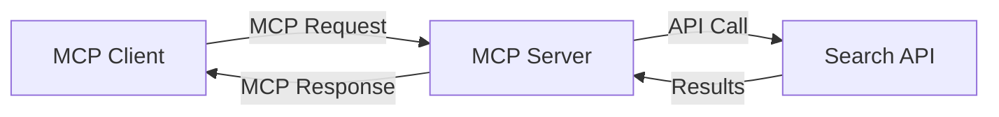
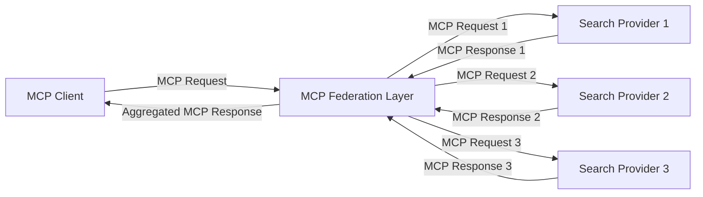
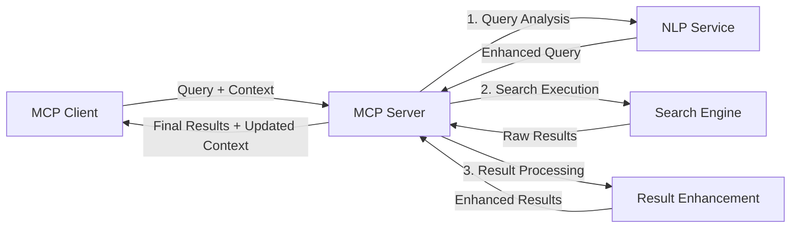

<!--
CO_OP_TRANSLATOR_METADATA:
{
  "original_hash": "333a03e51f90bdf3e6f1ba1694c73f36",
  "translation_date": "2025-07-16T21:36:34+00:00",
  "source_file": "05-AdvancedTopics/mcp-realtimesearch/README.md",
  "language_code": "ja"
}
-->
## コード例に関する免責事項

> **重要な注意**: 以下のコード例は、Model Context Protocol（MCP）とウェブ検索機能の統合を示しています。公式のMCP SDKのパターンや構造に従っていますが、教育目的のために簡略化されています。
> 
> これらの例では以下を紹介しています：
> 
> 1. **Python実装**：FastMCPサーバーの実装例で、ウェブ検索ツールを提供し外部の検索APIに接続します。この例は、[公式MCP Python SDK](https://github.com/modelcontextprotocol/python-sdk)のパターンに従い、適切なライフスパン管理、コンテキスト処理、ツール実装を示しています。サーバーは、旧来のSSEトランスポートに代わり推奨されているStreamable HTTPトランスポートを使用しています。
> 
> 2. **JavaScript実装**：TypeScript/JavaScriptでのFastMCPパターンを用いた実装例で、[公式MCP TypeScript SDK](https://github.com/modelcontextprotocol/typescript-sdk)に基づき、適切なツール定義とクライアント接続を備えた検索サーバーを作成しています。最新のセッション管理やコンテキスト保持の推奨パターンに従っています。
> 
> これらの例は、実運用には追加のエラーハンドリング、認証、特定のAPI統合コードが必要です。示されている検索APIエンドポイント（`https://api.search-service.example/search`）はプレースホルダーであり、実際の検索サービスのエンドポイントに置き換える必要があります。
> 
> 完全な実装詳細や最新の手法については、[公式MCP仕様](https://spec.modelcontextprotocol.io/)およびSDKドキュメントをご参照ください。

## コアコンセプト

### Model Context Protocol（MCP）フレームワーク

MCPは、AIモデル、アプリケーション、サービス間でコンテキストを交換するための標準化された手段を提供します。リアルタイムウェブ検索においては、一貫したマルチターン検索体験を作り出すために不可欠なフレームワークです。主な構成要素は以下の通りです：

1. **クライアント-サーバーアーキテクチャ**：MCPは検索クライアント（リクエスター）と検索サーバー（プロバイダー）を明確に分離し、柔軟な展開モデルを可能にします。

2. **JSON-RPC通信**：メッセージ交換にJSON-RPCを使用し、ウェブ技術との互換性が高く、様々なプラットフォームでの実装が容易です。

3. **コンテキスト管理**：複数のやり取りにわたる検索コンテキストの維持、更新、活用のための構造化された手法を定義しています。

4. **ツール定義**：検索機能を標準化されたツールとして公開し、明確なパラメーターと戻り値を持ちます。

5. **ストリーミング対応**：結果が段階的に到着するリアルタイム検索に不可欠なストリーミング結果をサポートします。

### ウェブ検索統合パターン

MCPをウェブ検索に統合する際には、いくつかのパターンが見られます：

#### 1. 直接検索プロバイダー統合

このパターンでは、MCPサーバーが1つまたは複数の検索APIと直接連携し、MCPリクエストをAPI固有の呼び出しに変換し、結果をMCPレスポンスとして整形します。

#### 2. コンテキスト保持型フェデレーテッド検索

このパターンは、複数のMCP対応検索プロバイダーに検索クエリを分散し、それぞれが異なるコンテンツや検索機能に特化している可能性がある中で、統一されたコンテキストを維持します。

#### 3. コンテキスト強化型検索チェーン

このパターンでは、検索プロセスを複数段階に分割し、各段階でコンテキストを強化しながら、段階的により関連性の高い結果を得ることを目指します。

### 検索コンテキストの構成要素

MCPベースのウェブ検索におけるコンテキストには通常以下が含まれます：

- **クエリ履歴**：セッション内の過去の検索クエリ
- **ユーザー設定**：言語、地域、セーフサーチ設定
- **インタラクション履歴**：クリックした結果、結果に費やした時間
- **検索パラメーター**：フィルター、ソート順などの検索修飾子
- **ドメイン知識**：検索に関連する特定分野のコンテキスト
- **時間的コンテキスト**：時間に基づく関連性要素
- **情報源の優先度**：信頼または優先する情報源

## ユースケースと応用例

### 研究および情報収集

MCPは研究ワークフローを以下のように強化します：

- 検索セッションを通じた研究コンテキストの保持
- より高度で文脈に即したクエリの実現
- 複数情報源の検索フェデレーションのサポート
- 検索結果からの知識抽出の促進

### リアルタイムニュースおよびトレンド監視

MCP対応検索はニュース監視において以下の利点を提供します：

- 新興ニュースのほぼリアルタイム発見
- 関連情報の文脈的フィルタリング
- 複数情報源にわたるトピックやエンティティの追跡
- ユーザーコンテキストに基づくパーソナライズされたニュースアラート

### AI拡張ブラウジングおよびリサーチ

MCPはAI拡張ブラウジングに新たな可能性をもたらします：

- 現在のブラウザ活動に基づく文脈的検索提案
- ウェブ検索とLLM搭載アシスタントのシームレスな統合
- 維持されたコンテキストによるマルチターン検索の洗練
- ファクトチェックや情報検証の強化

## 今後の動向と革新

### ウェブ検索におけるMCPの進化

今後、MCPは以下の課題に対応して進化すると予想されます：

- **マルチモーダル検索**：テキスト、画像、音声、動画検索をコンテキストを保持しつつ統合
- **分散型検索**：分散型およびフェデレーテッド検索エコシステムのサポート
- **検索プライバシー**: コンテキストに配慮したプライバシー保護型検索メカニズム  
- **クエリ理解**: 自然言語検索クエリの深い意味解析  

### 技術の将来的な進展

MCP検索の未来を形作る新興技術:

1. **ニューラル検索アーキテクチャ**: MCPに最適化された埋め込みベースの検索システム  
2. **パーソナライズされた検索コンテキスト**: 個々のユーザーの検索パターンを時間をかけて学習  
3. **ナレッジグラフ統合**: ドメイン固有のナレッジグラフによって強化されたコンテキスト検索  
4. **クロスモーダルコンテキスト**: 異なる検索モダリティ間でのコンテキスト維持  

## ハンズオン演習

### 演習1: 基本的なMCP検索パイプラインのセットアップ

この演習では以下を学びます:  
- 基本的なMCP検索環境の構築  
- ウェブ検索用のコンテキストハンドラーの実装  
- 検索の繰り返しにおけるコンテキスト保持のテストと検証  

### 演習2: MCP検索を用いたリサーチアシスタントの構築

以下を実現する完全なアプリケーションを作成します:  
- 自然言語の研究質問の処理  
- コンテキストに配慮したウェブ検索の実行  
- 複数の情報源からの情報の統合  
- 整理された研究結果の提示  

### 演習3: MCPによるマルチソース検索フェデレーションの実装

高度な演習内容:  
- 複数の検索エンジンへのコンテキスト対応クエリの送信  
- 結果のランキングと集約  
- 検索結果のコンテキストに基づく重複排除  
- ソース固有のメタデータの取り扱い  

## 追加リソース

- [Model Context Protocol Specification](https://spec.modelcontextprotocol.io/) - MCPの公式仕様および詳細なプロトコルドキュメント  
- [Model Context Protocol Documentation](https://modelcontextprotocol.io/) - 詳細なチュートリアルと実装ガイド  
- [MCP Python SDK](https://github.com/modelcontextprotocol/python-sdk) - MCPプロトコルの公式Python実装  
- [MCP TypeScript SDK](https://github.com/modelcontextprotocol/typescript-sdk) - MCPプロトコルの公式TypeScript実装  
- [MCP Reference Servers](https://github.com/modelcontextprotocol/servers) - MCPサーバーのリファレンス実装  
- [Bing Web Search API Documentation](https://learn.microsoft.com/en-us/bing/search-apis/bing-web-search/overview) - Microsoftのウェブ検索API  
- [Google Custom Search JSON API](https://developers.google.com/custom-search/v1/overview) - Googleのプログラム可能な検索エンジン  
- [SerpAPI Documentation](https://serpapi.com/search-api) - 検索エンジン結果ページAPI  
- [Meilisearch Documentation](https://www.meilisearch.com/docs) - オープンソースの検索エンジン  
- [Elasticsearch Documentation](https://www.elastic.co/guide/index.html) - 分散型検索および分析エンジン  
- [LangChain Documentation](https://python.langchain.com/docs/get_started/introduction) - LLMを使ったアプリケーション構築  

## 学習成果

このモジュールを修了すると、以下が可能になります:  

- リアルタイムウェブ検索の基本と課題を理解する  
- Model Context Protocol (MCP) がリアルタイムウェブ検索機能をどのように強化するか説明する  
- 人気のフレームワークやAPIを使ってMCPベースの検索ソリューションを実装する  
- MCPを用いたスケーラブルで高性能な検索アーキテクチャを設計・展開する  
- セマンティック検索、リサーチアシスタント、AI支援ブラウジングなど多様なユースケースにMCPの概念を適用する  
- MCPベースの検索技術における新興トレンドや将来の革新を評価する  

### 信頼性と安全性に関する考慮事項

MCPベースのウェブ検索ソリューションを実装する際は、MCP仕様から以下の重要な原則を忘れないでください:  

1. **ユーザーの同意とコントロール**: ユーザーはすべてのデータアクセスや操作に明示的に同意し、理解している必要があります。特に外部データソースにアクセスするウェブ検索実装では重要です。  

2. **データプライバシー**: 検索クエリや結果に機微な情報が含まれる可能性があるため、適切な取り扱いを行い、ユーザーデータを保護するアクセス制御を実装してください。  

3. **ツールの安全性**: 検索ツールは任意のコード実行を伴う可能性があるため、適切な認可と検証を実装してください。ツールの動作説明は信頼できるサーバーから取得したものでない限り信用しないでください。  

4. **明確なドキュメント**: MCP仕様の実装ガイドラインに従い、MCPベースの検索実装の機能、制限、安全性に関する明確なドキュメントを提供してください。  

5. **堅牢な同意フロー**: 特に外部ウェブリソースと連携するツールについては、使用許可前に各ツールの機能を明確に説明する堅牢な同意および認可フローを構築してください。  

MCPのセキュリティおよび信頼性に関する詳細は、[公式ドキュメント](https://modelcontextprotocol.io/specification/2025-03-26#security-and-trust-%26-safety)を参照してください。  

## 次に進むには

- [5.12 Entra ID Authentication for Model Context Protocol Servers](../mcp-security-entra/README.md)

**免責事項**：  
本書類はAI翻訳サービス「[Co-op Translator](https://github.com/Azure/co-op-translator)」を使用して翻訳されました。正確性の向上に努めておりますが、自動翻訳には誤りや不正確な部分が含まれる可能性があります。原文の言語によるオリジナル文書が正式な情報源とみなされるべきです。重要な情報については、専門の人間による翻訳を推奨します。本翻訳の利用により生じた誤解や誤訳について、当方は一切の責任を負いかねます。