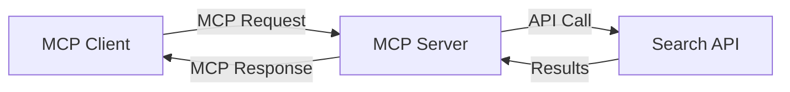
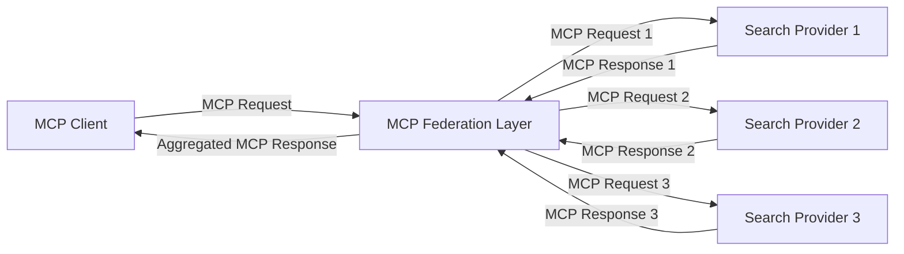
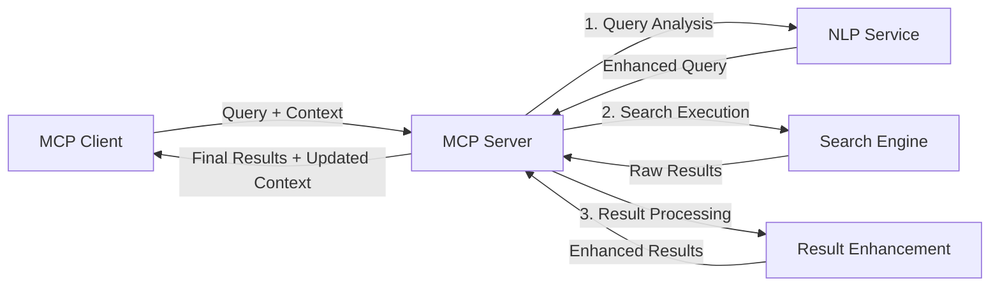

<!--
CO_OP_TRANSLATOR_METADATA:
{
  "original_hash": "eb12652eb7bd17f2193b835a344425c6",
  "translation_date": "2025-06-26T13:46:25+00:00",
  "source_file": "05-AdvancedTopics/mcp-realtimesearch/README.md",
  "language_code": "ja"
}
-->
## コード例に関する免責事項

> **重要な注意**: 以下のコード例は、Model Context Protocol（MCP）とウェブ検索機能の統合を示しています。公式のMCP SDKのパターンや構造に準拠していますが、教育目的で簡略化されています。
> 
> これらの例は以下を示しています：
> 
> 1. **Python実装**：FastMCPサーバーの実装例で、ウェブ検索ツールを提供し外部検索APIに接続します。この例は、[公式MCP Python SDK](https://github.com/modelcontextprotocol/python-sdk)のパターンに従った適切なライフスパン管理、コンテキスト処理、ツール実装を示しています。サーバーは、旧SSEトランスポートに代わる推奨のStreamable HTTPトランスポートを使用しています。
> 
> 2. **JavaScript実装**：TypeScript/JavaScriptでのFastMCPパターンを用いた実装例で、[公式MCP TypeScript SDK](https://github.com/modelcontextprotocol/typescript-sdk)に基づき、適切なツール定義とクライアント接続を備えた検索サーバーを作成します。最新のセッション管理とコンテキスト保持の推奨パターンに従っています。
> 
> これらの例は、実運用では追加のエラーハンドリング、認証、特定APIの統合コードが必要です。示された検索APIエンドポイント（`https://api.search-service.example/search`）はプレースホルダーであり、実際の検索サービスのエンドポイントに置き換える必要があります。
> 
> 完全な実装詳細や最新の手法については、[公式MCP仕様](https://spec.modelcontextprotocol.io/)およびSDKドキュメントを参照してください。

## コアコンセプト

### Model Context Protocol (MCP) フレームワーク

MCPは、AIモデル、アプリケーション、サービス間でコンテキストを標準化して交換する仕組みを提供します。リアルタイムウェブ検索において、このフレームワークは一貫性のあるマルチターン検索体験を作り出すために不可欠です。主な構成要素は以下の通りです：

1. **クライアント-サーバーアーキテクチャ**：MCPは検索クライアント（リクエスター）と検索サーバー（プロバイダー）を明確に分離し、柔軟な展開モデルを可能にします。

2. **JSON-RPC通信**：メッセージ交換にJSON-RPCを使用し、ウェブ技術との互換性が高く、さまざまなプラットフォームで実装しやすい設計です。

3. **コンテキスト管理**：複数のやりとりにわたり検索コンテキストを維持、更新、活用するための構造化された手法を定義します。

4. **ツール定義**：検索機能をパラメーターや戻り値が明確に定義された標準化されたツールとして公開します。

5. **ストリーミングサポート**：結果が段階的に到着するリアルタイム検索に不可欠なストリーミング結果のサポートがあります。

### ウェブ検索統合パターン

MCPをウェブ検索に統合する際には、いくつかのパターンが見られます：

#### 1. 直接検索プロバイダー統合

このパターンでは、MCPサーバーが一つまたは複数の検索APIと直接インターフェースし、MCPリクエストをAPI固有の呼び出しに変換し、結果をMCPレスポンス形式で返します。

#### 2. コンテキスト保持型フェデレーテッド検索

このパターンは複数のMCP対応検索プロバイダーに検索クエリを分散し、それぞれが異なるコンテンツタイプや検索機能に特化している可能性がありますが、統一されたコンテキストを維持します。

#### 3. コンテキスト強化型検索チェーン

このパターンは検索プロセスを複数段階に分割し、各段階でコンテキストを充実させ、段階的により関連性の高い結果を得る仕組みです。

### 検索コンテキストの構成要素

MCPベースのウェブ検索におけるコンテキストには通常以下が含まれます：

- **クエリ履歴**：セッション内の過去の検索クエリ
- **ユーザーの好み**：言語、地域、セーフサーチ設定など
- **インタラクション履歴**：クリックした結果や閲覧時間
- **検索パラメーター**：フィルター、ソート順、その他の検索修飾子
- **ドメイン知識**：検索に関連する専門的なコンテキスト
- **時間的コンテキスト**：時間に基づく関連度要因
- **情報源の好み**：信頼または優先する情報源

## ユースケースと応用

### 研究・情報収集

MCPは研究ワークフローを強化します：

- 検索セッション間で研究コンテキストを保持
- より高度で文脈に即したクエリを可能に
- 複数情報源の検索フェデレーションをサポート
- 検索結果からの知識抽出を促進

### リアルタイムニュース・トレンド監視

MCP対応検索はニュース監視に利点をもたらします：

- 新興ニュースのほぼリアルタイム発見
- 関連情報のコンテキストフィルタリング
- 複数情報源にわたるトピックやエンティティの追跡
- ユーザーコンテキストに基づくパーソナライズドニュースアラート

### AI拡張ブラウジング・リサーチ

MCPはAI拡張ブラウジングに新たな可能性を生み出します：

- 現在のブラウザ活動に基づく文脈的検索提案
- ウェブ検索とLLM搭載アシスタントのシームレスな統合
- 維持されたコンテキストによるマルチターン検索の洗練
- ファクトチェックや情報検証の強化

## 今後の動向と革新

### MCPのウェブ検索における進化

今後、MCPは以下の課題に対応して進化すると予想されます：

- **マルチモーダル検索**：テキスト、画像、音声、動画検索の統合とコンテキスト維持
- **分散型検索**：分散・フェデレーテッド検索エコシステムのサポート
- **検索プライバシー**：コンテキストに配慮したプライバシー保護検索機能
- **クエリ理解**：自然言語検索クエリの深い意味解析

### 技術的な潜在的進歩

MCP検索の未来を形作る新技術：

1. **ニューラル検索アーキテクチャ**：MCPに最適化された埋め込みベースの検索システム
2. **パーソナライズド検索コンテキスト**：ユーザーごとの検索パターンを時間をかけて学習
3. **ナレッジグラフ統合**：ドメイン特化のナレッジグラフによる文脈強化検索
4. **クロスモーダルコンテキスト**：異なる検索モダリティ間でのコンテキスト維持

## 実践演習

### 演習1：基本的なMCP検索パイプラインの構築

この演習では以下を学びます：
- 基本的なMCP検索環境の設定
- ウェブ検索用のコンテキストハンドラーの実装
- 検索の繰り返しにおけるコンテキスト保持のテストと検証

### 演習2：MCP検索を用いたリサーチアシスタントの構築

完全なアプリケーションを作成し：
- 自然言語の研究質問を処理
- コンテキスト対応型のウェブ検索を実行
- 複数情報源から情報を統合
- 整理された研究結果を提示

### 演習3：MCPによるマルチソース検索フェデレーションの実装

高度な演習で以下を扱います：
- コンテキスト対応型クエリの複数検索エンジンへの分配
- 結果のランキングと集約
- コンテキストに基づく重複排除
- ソース固有のメタデータ処理

## 追加リソース

- [Model Context Protocol Specification](https://spec.modelcontextprotocol.io/) - 公式MCP仕様および詳細なプロトコルドキュメント
- [Model Context Protocol Documentation](https://modelcontextprotocol.io/) - 詳細なチュートリアルと実装ガイド
- [MCP Python SDK](https://github.com/modelcontextprotocol/python-sdk) - MCPプロトコルの公式Python実装
- [MCP TypeScript SDK](https://github.com/modelcontextprotocol/typescript-sdk) - MCPプロトコルの公式TypeScript実装
- [MCP Reference Servers](https://github.com/modelcontextprotocol/servers) - MCPサーバーのリファレンス実装
- [Bing Web Search API Documentation](https://learn.microsoft.com/en-us/bing/search-apis/bing-web-search/overview) - Microsoftのウェブ検索API
- [Google Custom Search JSON API](https://developers.google.com/custom-search/v1/overview) - Googleのプログラム可能検索エンジン
- [SerpAPI Documentation](https://serpapi.com/search-api) - 検索エンジン結果ページAPI
- [Meilisearch Documentation](https://www.meilisearch.com/docs) - オープンソース検索エンジン
- [Elasticsearch Documentation](https://www.elastic.co/guide/index.html) - 分散型検索・分析エンジン
- [LangChain Documentation](https://python.langchain.com/docs/get_started/introduction) - LLMを用いたアプリケーション構築

## 学習成果

本モジュールを修了すると、以下が可能になります：

- リアルタイムウェブ検索の基本と課題を理解する
- Model Context Protocol (MCP) がリアルタイムウェブ検索機能をどのように強化するか説明できる
- 人気のフレームワークやAPIを用いてMCPベースの検索ソリューションを実装できる
- MCPを用いたスケーラブルで高性能な検索アーキテクチャを設計・展開できる
- セマンティック検索、研究支援、AI拡張ブラウジングなどのユースケースにMCP概念を適用できる
- MCPベースの検索技術における最新動向や将来の革新を評価できる

### 信頼性と安全性に関する考慮事項

MCPベースのウェブ検索ソリューションを実装する際は、MCP仕様から以下の重要な原則を遵守してください：

1. **ユーザーの同意と管理**：ユーザーはすべてのデータアクセスと操作に明示的に同意し、理解している必要があります。特に外部データソースにアクセスするウェブ検索実装では重要です。

2. **データプライバシー**：検索クエリや結果に機微な情報が含まれる可能性があるため、適切な取り扱いとアクセス制御を実装しユーザーデータを保護してください。

3. **ツールの安全性**：検索ツールは任意コード実行のリスクを伴うため、適切な認可と検証を行ってください。ツールの動作説明は信頼できるサーバーから取得されたものでない限り信用しないでください。

4. **明確なドキュメント**：MCP仕様の実装ガイドラインに従い、MCPベース検索の機能、制限、セキュリティ考慮事項について明確なドキュメントを提供してください。

5. **堅牢な同意フロー**：外部ウェブリソースと連携するツールの利用を許可する前に、その機能を明確に説明する同意および認可フローを構築してください。

MCPのセキュリティと信頼性・安全性に関する詳細は、[公式ドキュメント](https://modelcontextprotocol.io/specification/2025-03-26#security-and-trust-%26-safety)を参照してください。

## 次に進むこと

- [5.11 Model Context ProtocolサーバーのEntra ID認証](../mcp-security-entra/README.md)

**免責事項**:  
本書類はAI翻訳サービス「[Co-op Translator](https://github.com/Azure/co-op-translator)」を使用して翻訳されました。正確性の確保に努めておりますが、自動翻訳には誤りや不正確な部分が含まれる可能性があります。原文の言語によるオリジナル文書が正式な情報源とみなされるべきです。重要な情報については、専門の人間による翻訳を推奨します。本翻訳の利用により生じた誤解や誤訳について、一切の責任を負いかねますのでご了承ください。