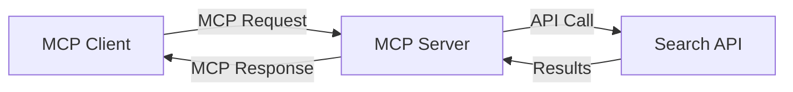
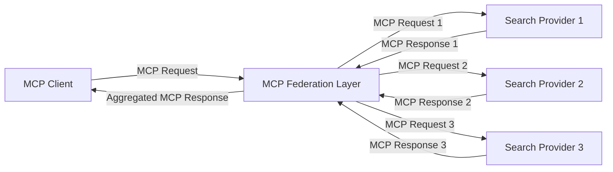
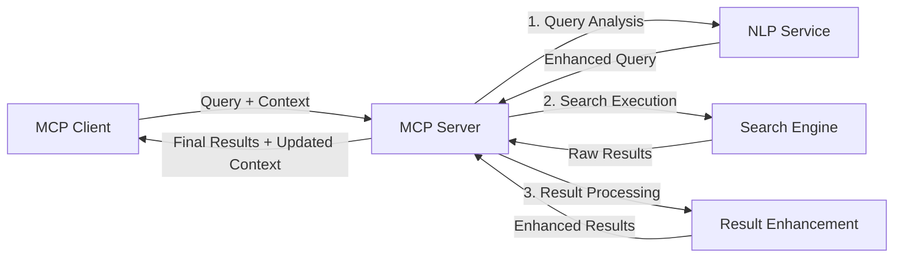

<!--
CO_OP_TRANSLATOR_METADATA:
{
  "original_hash": "16bef2c93c6a86d4ca6a8ce9e120e384",
  "translation_date": "2025-06-12T22:35:50+00:00",
  "source_file": "05-AdvancedTopics/mcp-realtimesearch/README.md",
  "language_code": "ja"
}
-->
## コード例に関する免責事項

> **重要な注意**: 以下のコード例は、Model Context Protocol（MCP）をウェブ検索機能と統合する方法を示しています。公式のMCP SDKのパターンと構造に従っていますが、教育目的で簡略化されています。
> 
> これらの例は以下を示しています：
> 
> 1. **Python実装**：FastMCPサーバーの実装例で、ウェブ検索ツールを提供し外部検索APIに接続します。この例は、[公式MCP Python SDK](https://github.com/modelcontextprotocol/python-sdk)のパターンに従い、適切なライフスパン管理、コンテキスト処理、ツール実装を示しています。サーバーは、旧来のSSEトランスポートに代わる推奨のStreamable HTTPトランスポートを使用しています。
> 
> 2. **JavaScript実装**：TypeScript/JavaScriptによるFastMCPパターンの実装で、[公式MCP TypeScript SDK](https://github.com/modelcontextprotocol/typescript-sdk)を活用し、適切なツール定義とクライアント接続を行います。最新のセッション管理とコンテキスト保持の推奨パターンに従っています。
> 
> これらの例は、実運用には追加のエラーハンドリング、認証、API統合コードが必要です。示されている検索APIエンドポイント（`https://api.search-service.example/search`）はプレースホルダーであり、実際の検索サービスのエンドポイントに置き換える必要があります。
> 
> 完全な実装詳細や最新の手法については、[公式MCP仕様](https://spec.modelcontextprotocol.io/)およびSDKドキュメントを参照してください。

## コアコンセプト

### Model Context Protocol（MCP）フレームワーク

MCPは、AIモデル、アプリケーション、サービス間でコンテキストを標準化して交換する仕組みを提供します。リアルタイムウェブ検索においては、連続した検索体験を実現するために不可欠なフレームワークです。主要な構成要素は以下の通りです：

1. **クライアント・サーバーアーキテクチャ**：MCPは検索クライアント（リクエスター）と検索サーバー（プロバイダー）を明確に分離し、柔軟な展開モデルを可能にします。

2. **JSON-RPC通信**：メッセージ交換にJSON-RPCを用い、ウェブ技術との親和性が高く、異なるプラットフォームでの実装が容易です。

3. **コンテキスト管理**：複数のやり取りにわたる検索コンテキストの維持、更新、活用のための構造化された手法を定義しています。

4. **ツール定義**：検索機能を標準化されたツールとして公開し、明確なパラメーターと戻り値を持ちます。

5. **ストリーミング対応**：結果を逐次的に受け取るリアルタイム検索に不可欠なストリーミング結果のサポートを含みます。

### ウェブ検索統合パターン

MCPをウェブ検索に統合する際、いくつかのパターンが見られます：

#### 1. 直接検索プロバイダー統合

このパターンでは、MCPサーバーが1つまたは複数の検索APIと直接連携し、MCPのリクエストをAPI固有の呼び出しに変換し、結果をMCPのレスポンス形式に整形します。

#### 2. コンテキスト保持型フェデレーテッド検索

このパターンは、複数のMCP対応検索プロバイダーに検索クエリを分散し、それぞれが異なるコンテンツタイプや検索機能に特化しながら、統一されたコンテキストを維持します。

#### 3. コンテキスト強化型検索チェーン

このパターンでは、検索処理を複数段階に分割し、各ステップでコンテキストを拡充しながら、段階的により関連性の高い結果を生成します。

### 検索コンテキストの構成要素

MCPベースのウェブ検索では、コンテキストには通常以下が含まれます：

- **クエリ履歴**：セッション内の過去の検索クエリ
- **ユーザー設定**：言語、地域、セーフサーチ設定
- **インタラクション履歴**：クリックした結果や閲覧時間
- **検索パラメーター**：フィルター、並び順、その他の検索修飾子
- **ドメイン知識**：検索に関連する専門的なコンテキスト
- **時間的コンテキスト**：時間に基づく関連性の要素
- **情報源の優先度**：信頼または優先される情報ソース

## ユースケースと応用

### 研究および情報収集

MCPは研究ワークフローを以下のように強化します：

- 検索セッション間での研究コンテキストの保持
- より高度でコンテキストに即したクエリの実現
- マルチソース検索フェデレーションのサポート
- 検索結果からの知識抽出の促進

### リアルタイムニュースとトレンド監視

MCP対応の検索はニュース監視に以下の利点をもたらします：

- 新興ニュースのほぼリアルタイム発見
- 関連情報のコンテキストに基づくフィルタリング
- 複数ソースにまたがるトピック・エンティティの追跡
- ユーザーコンテキストに基づくパーソナライズされたニュースアラート

### AI支援ブラウジングとリサーチ

MCPはAI支援ブラウジングに新たな可能性をもたらします：

- 現在のブラウザ活動に基づくコンテキスト検索提案
- LLM搭載アシスタントとのシームレスなウェブ検索統合
- 維持されたコンテキストによる多段階検索の洗練
- ファクトチェックや情報検証の強化

## 今後の動向とイノベーション

### MCPのウェブ検索における進化

将来的には、MCPは以下の課題に対応して進化すると期待されます：

- **マルチモーダル検索**：テキスト、画像、音声、動画検索のコンテキスト保持統合
- **分散型検索**：分散およびフェデレーテッド検索エコシステムのサポート
- **検索プライバシー**：コンテキスト認識型のプライバシー保護検索機構
- **クエリ理解**：自然言語検索クエリの深い意味解析

### 技術の潜在的進展

MCP検索の未来を形作る新技術：

1. **ニューラル検索アーキテクチャ**：MCPに最適化された埋め込みベースの検索システム
2. **パーソナライズされた検索コンテキスト**：ユーザーの検索パターンを時間をかけて学習
3. **ナレッジグラフ統合**：ドメイン特化型ナレッジグラフによるコンテキスト強化
4. **クロスモーダルコンテキスト**：異なる検索モダリティ間のコンテキスト維持

## ハンズオン演習

### 演習1：基本的なMCP検索パイプラインの設定

この演習では以下を学びます：
- 基本的なMCP検索環境の構築
- ウェブ検索用のコンテキストハンドラーの実装
- 検索反復におけるコンテキスト保持のテストと検証

### 演習2：MCP検索を用いたリサーチアシスタントの構築

完全なアプリケーションを作成します：
- 自然言語による研究質問の処理
- コンテキスト対応のウェブ検索実行
- 複数ソースからの情報統合
- 整理された研究結果の提示

### 演習3：MCPを用いたマルチソース検索フェデレーションの実装

高度な演習内容：
- 複数の検索エンジンへのコンテキスト対応クエリ分配
- 結果のランキングと集約
- 検索結果のコンテキストに基づく重複排除
- ソース固有メタデータの取り扱い

## 追加リソース

- [Model Context Protocol Specification](https://spec.modelcontextprotocol.io/) - MCP公式仕様および詳細なプロトコルドキュメント
- [Model Context Protocol Documentation](https://modelcontextprotocol.io/) - 詳細なチュートリアルと実装ガイド
- [MCP Python SDK](https://github.com/modelcontextprotocol/python-sdk) - MCPプロトコルの公式Python実装
- [MCP TypeScript SDK](https://github.com/modelcontextprotocol/typescript-sdk) - MCPプロトコルの公式TypeScript実装
- [MCP Reference Servers](https://github.com/modelcontextprotocol/servers) - MCPサーバーのリファレンス実装
- [Bing Web Search API Documentation](https://learn.microsoft.com/en-us/bing/search-apis/bing-web-search/overview) - Microsoftのウェブ検索API
- [Google Custom Search JSON API](https://developers.google.com/custom-search/v1/overview) - Googleのプログラム可能な検索エンジン
- [SerpAPI Documentation](https://serpapi.com/search-api) - 検索エンジン結果ページAPI
- [Meilisearch Documentation](https://www.meilisearch.com/docs) - オープンソース検索エンジン
- [Elasticsearch Documentation](https://www.elastic.co/guide/index.html) - 分散検索・分析エンジン
- [LangChain Documentation](https://python.langchain.com/docs/get_started/introduction) - LLMを用いたアプリケーション構築

## 学習成果

このモジュールを修了すると、以下が可能になります：

- リアルタイムウェブ検索の基本と課題を理解する
- Model Context Protocol（MCP）がリアルタイムウェブ検索機能をどのように強化するか説明する
- 人気のあるフレームワークやAPIを使ってMCPベースの検索ソリューションを実装する
- MCPを用いたスケーラブルで高性能な検索アーキテクチャを設計・展開する
- セマンティック検索、リサーチアシスタント、AI支援ブラウジングなど様々なユースケースにMCPコンセプトを適用する
- MCPベースの検索技術における最新動向や将来のイノベーションを評価する

### 信頼性と安全性に関する考慮事項

MCPベースのウェブ検索ソリューションを実装する際は、MCP仕様から以下の重要な原則を忘れないでください：

1. **ユーザーの同意と制御**：ユーザーはすべてのデータアクセスや操作に明示的に同意し、理解している必要があります。特に外部データソースにアクセスするウェブ検索実装では重要です。

2. **データプライバシー**：検索クエリや結果に機密情報が含まれる可能性があるため、適切な取り扱いとアクセス制御を実装し、ユーザーデータを保護してください。

3. **ツールの安全性**：検索ツールは任意のコード実行を伴う潜在的なセキュリティリスクとなるため、適切な認可と検証を行う必要があります。ツールの動作説明は信頼できるサーバーから取得しない限り信用しないでください。

4. **明確なドキュメント**：MCPベースの検索実装の機能、制限、セキュリティ考慮事項について、MCP仕様に沿った明確なドキュメントを提供してください。

5. **堅牢な同意フロー**：外部ウェブリソースと連携するツールの使用を許可する前に、その機能を明確に説明する堅牢な同意・認可フローを構築してください。

MCPのセキュリティおよび信頼性・安全性に関する詳細は、[公式ドキュメント](https://modelcontextprotocol.io/specification/2025-03-26#security-and-trust-%26-safety)をご覧ください。

## 次に進むこと

- [6. コミュニティへの貢献](../../06-CommunityContributions/README.md)

**免責事項**：  
本書類はAI翻訳サービス[Co-op Translator](https://github.com/Azure/co-op-translator)を使用して翻訳されました。正確性には努めておりますが、自動翻訳には誤りや不正確な箇所が含まれる可能性があります。原文の言語で記載された文書が正式な情報源とみなされます。重要な情報については、専門の人間による翻訳を推奨いたします。本翻訳の利用により生じた誤解や誤訳について、一切の責任を負いかねますのでご了承ください。