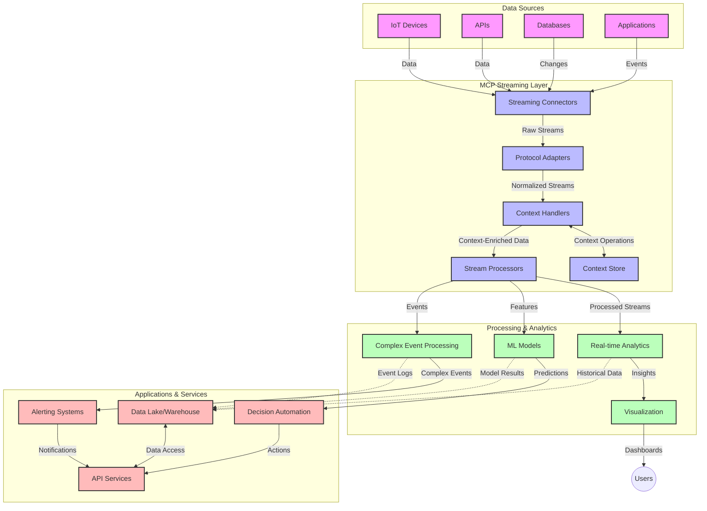

<!--
CO_OP_TRANSLATOR_METADATA:
{
  "original_hash": "195f7287638b77a549acadd96c8f981c",
  "translation_date": "2025-07-14T01:30:55+00:00",
  "source_file": "05-AdvancedTopics/mcp-realtimestreaming/README.md",
  "language_code": "ja"
}
-->
# リアルタイムデータストリーミングのためのModel Context Protocol

## 概要

リアルタイムデータストリーミングは、ビジネスやアプリケーションが即時に情報へアクセスし、迅速な意思決定を行うために不可欠な技術となっています。Model Context Protocol（MCP）は、これらのリアルタイムストリーミングプロセスを最適化し、データ処理の効率化、コンテキストの一貫性維持、システム全体のパフォーマンス向上に大きく貢献する革新的な技術です。

本モジュールでは、MCPがAIモデル、ストリーミングプラットフォーム、アプリケーション間でのコンテキスト管理を標準化することで、リアルタイムデータストリーミングをどのように変革するかを解説します。

## リアルタイムデータストリーミングの紹介

リアルタイムデータストリーミングは、データが生成されると同時に継続的に転送、処理、分析を行い、システムが新しい情報に即座に反応できる技術パラダイムです。静的なデータセットを対象とする従来のバッチ処理とは異なり、ストリーミングは動いているデータを処理し、遅延を最小限に抑えて洞察やアクションを提供します。

### リアルタイムデータストリーミングの主要概念：

- **継続的なデータフロー**：データは途切れることなくイベントやレコードの連続として処理される
- **低遅延処理**：データ生成から処理までの時間を最小化する設計
- **スケーラビリティ**：変動するデータ量や速度に対応可能なアーキテクチャ
- **フォールトトレランス**：障害に強く、データフローを途切れさせない耐障害性
- **ステートフル処理**：イベント間のコンテキストを維持し、意味のある分析を可能にする

### Model Context Protocolとリアルタイムストリーミング

Model Context Protocol（MCP）は、リアルタイムストリーミング環境における以下の重要な課題に対応します：

1. **コンテキストの連続性**：MCPは分散されたストリーミングコンポーネント間でコンテキストを維持する方法を標準化し、AIモデルや処理ノードが関連する過去情報や環境情報にアクセスできるようにします。

2. **効率的なステート管理**：構造化されたコンテキスト伝達メカニズムを提供することで、ストリーミングパイプラインのステート管理の負荷を軽減します。

3. **相互運用性**：多様なストリーミング技術とAIモデル間でコンテキスト共有の共通言語を作り、柔軟で拡張性の高いアーキテクチャを実現します。

4. **ストリーミング最適化コンテキスト**：リアルタイムの意思決定に最も関連性の高いコンテキスト要素を優先し、パフォーマンスと精度の両立を図ります。

5. **適応的処理**：MCPによる適切なコンテキスト管理により、ストリーミングシステムはデータの変化やパターンに応じて動的に処理を調整できます。

IoTセンサーネットワークから金融取引プラットフォームまで、MCPとストリーミング技術の統合は、複雑で変化する状況にリアルタイムで適切に対応できる、より高度でコンテキスト認識型の処理を可能にします。

## 学習目標

このレッスンを終える頃には、以下ができるようになります：

- リアルタイムデータストリーミングの基本と課題を理解する
- Model Context Protocol（MCP）がリアルタイムデータストリーミングをどのように強化するか説明する
- KafkaやPulsarなどの人気フレームワークを使ってMCPベースのストリーミングソリューションを実装する
- MCPを用いたフォールトトレラントで高性能なストリーミングアーキテクチャを設計・展開する
- IoT、金融取引、AI駆動の分析ユースケースにMCPの概念を適用する
- MCPベースのストリーミング技術における最新動向や将来の革新を評価する

### 定義と重要性

リアルタイムデータストリーミングは、データを継続的に生成・処理・配信し、遅延を最小限に抑えることを指します。バッチ処理のようにデータをまとめて処理するのではなく、到着したデータを逐次処理し、即時の洞察やアクションを可能にします。

リアルタイムデータストリーミングの主な特徴：

- **低遅延**：ミリ秒から数秒以内にデータを処理・分析
- **継続的なフロー**：様々なソースから途切れないデータストリーム
- **即時処理**：バッチではなく到着時にデータを分析
- **イベント駆動型アーキテクチャ**：発生したイベントに即応

### 従来のデータストリーミングの課題

従来のデータストリーミングには以下のような制約があります：

1. **コンテキストの喪失**：分散システム間でコンテキストを維持するのが困難
2. **スケーラビリティの問題**：大量かつ高速なデータに対応するのが難しい
3. **統合の複雑さ**：異なるシステム間の相互運用性の問題
4. **遅延管理**：スループットと処理時間のバランス調整
5. **データ整合性**：ストリーム全体でのデータの正確性と完全性の確保

## Model Context Protocol（MCP）について理解する

### MCPとは？

Model Context Protocol（MCP）は、AIモデルとアプリケーション間の効率的な通信を促進するための標準化されたプロトコルです。リアルタイムデータストリーミングの文脈では、以下を提供します：

- データパイプライン全体でのコンテキストの保持
- データ交換フォーマットの標準化
- 大規模データセットの伝送最適化
- モデル間およびモデルとアプリケーション間の通信強化

### 主要コンポーネントとアーキテクチャ

リアルタイムストリーミング向けMCPのアーキテクチャは以下の主要コンポーネントで構成されます：

1. **Context Handlers**：ストリーミングパイプライン全体でコンテキスト情報を管理・維持
2. **Stream Processors**：コンテキスト認識技術を用いて受信データストリームを処理
3. **Protocol Adapters**：異なるストリーミングプロトコル間でコンテキストを保持しつつ変換
4. **Context Store**：コンテキスト情報を効率的に保存・取得
5. **Streaming Connectors**：Kafka、Pulsar、Kinesisなど様々なストリーミングプラットフォームに接続



### MCPがリアルタイムデータ処理を改善する方法

MCPは従来のストリーミング課題に対して以下のように対応します：

- **コンテキストの一貫性**：パイプライン全体でデータポイント間の関係性を維持
- **伝送の最適化**：インテリジェントなコンテキスト管理によりデータ交換の冗長性を削減
- **標準化されたインターフェース**：ストリーミングコンポーネント向けに一貫したAPIを提供
- **遅延の削減**：効率的なコンテキスト処理でオーバーヘッドを最小化
- **スケーラビリティの向上**：コンテキストを維持しつつ水平スケールをサポート

## 統合と実装

リアルタイムデータストリーミングシステムは、パフォーマンスとコンテキストの一貫性を両立させるために慎重な設計と実装が必要です。Model Context Protocolは、AIモデルとストリーミング技術の統合に標準化されたアプローチを提供し、より高度でコンテキスト認識型の処理パイプラインを実現します。

### ストリーミングアーキテクチャにおけるMCP統合の概要

リアルタイムストリーミング環境でMCPを実装する際の主なポイントは以下の通りです：

1. **コンテキストのシリアライズと伝送**：MCPはストリーミングデータパケット内でコンテキスト情報を効率的にエンコードする仕組みを提供し、重要なコンテキストが処理パイプライン全体に渡って保持されるようにします。これにはストリーミング伝送に最適化された標準化されたシリアライズフォーマットが含まれます。

2. **ステートフルストリーム処理**：MCPは処理ノード間で一貫したコンテキスト表現を維持することで、より高度なステートフル処理を可能にします。これは従来ステート管理が難しかった分散ストリーミングアーキテクチャで特に有用です。

3. **イベント時間と処理時間の区別**：MCP実装は、イベントが発生した時間と処理された時間の違いを扱う一般的な課題に対応します。プロトコルはイベント時間の意味を保持する時間的コンテキストを組み込むことができます。

4. **バックプレッシャー管理**：コンテキスト処理を標準化することで、MCPはストリーミングシステムのバックプレッシャー管理を支援し、コンポーネント間で処理能力を伝達し、フローを調整可能にします。

5. **コンテキストウィンドウと集約**：MCPは時間的および関係的コンテキストの構造化された表現を提供し、より意味のあるイベントストリームの集約を可能にする高度なウィンドウ処理を促進します。

6. **Exactly-Once処理**：Exactly-onceセマンティクスが求められるストリーミングシステムでは、MCPは分散コンポーネント間で処理状態を追跡・検証するためのメタデータを組み込むことができます。

様々なストリーミング技術にわたるMCPの実装は、カスタム統合コードの必要性を減らし、データがパイプラインを流れる中で意味のあるコンテキストを維持するシステムの能力を高める統一的なコンテキスト管理アプローチを生み出します。

### さまざまなデータストリーミングフレームワークにおけるMCP

以下の例は、JSON-RPCベースのプロトコルと異なる伝送メカニズムに焦点を当てた現行のMCP仕様に準拠しています。コードはKafkaやPulsarなどのストリーミングプラットフォームを統合しつつ、MCPプロトコルとの完全な互換性を保つカスタム伝送の実装方法を示しています。

これらの例は、ストリーミングプラットフォームがMCPと連携してリアルタイムデータ処理を行い、MCPの中心であるコンテキスト認識を維持する方法を示すことを目的としています。このアプローチにより、コードサンプルは2025年6月時点のMCP仕様の現状を正確に反映しています。

MCPは以下のような人気のストリーミングフレームワークと統合可能です：

#### Apache Kafka統合

```python
import asyncio
import json
from typing import Dict, Any, Optional
from confluent_kafka import Consumer, Producer, KafkaError
from mcp.client import Client, ClientCapabilities
from mcp.core.message import JsonRpcMessage
from mcp.core.transports import Transport

# Custom transport class to bridge MCP with Kafka
class KafkaMCPTransport(Transport):
    def __init__(self, bootstrap_servers: str, input_topic: str, output_topic: str):
        self.bootstrap_servers = bootstrap_servers
        self.input_topic = input_topic
        self.output_topic = output_topic
        self.producer = Producer({'bootstrap.servers': bootstrap_servers})
        self.consumer = Consumer({
            'bootstrap.servers': bootstrap_servers,
            'group.id': 'mcp-client-group',
            'auto.offset.reset': 'earliest'
        })
        self.message_queue = asyncio.Queue()
        self.running = False
        self.consumer_task = None
        
    async def connect(self):
        """Connect to Kafka and start consuming messages"""
        self.consumer.subscribe([self.input_topic])
        self.running = True
        self.consumer_task = asyncio.create_task(self._consume_messages())
        return self
        
    async def _consume_messages(self):
        """Background task to consume messages from Kafka and queue them for processing"""
        while self.running:
            try:
                msg = self.consumer.poll(1.0)
                if msg is None:
                    await asyncio.sleep(0.1)
                    continue
                
                if msg.error():
                    if msg.error().code() == KafkaError._PARTITION_EOF:
                        continue
                    print(f"Consumer error: {msg.error()}")
                    continue
                
                # Parse the message value as JSON-RPC
                try:
                    message_str = msg.value().decode('utf-8')
                    message_data = json.loads(message_str)
                    mcp_message = JsonRpcMessage.from_dict(message_data)
                    await self.message_queue.put(mcp_message)
                except Exception as e:
                    print(f"Error parsing message: {e}")
            except Exception as e:
                print(f"Error in consumer loop: {e}")
                await asyncio.sleep(1)
    
    async def read(self) -> Optional[JsonRpcMessage]:
        """Read the next message from the queue"""
        try:
            message = await self.message_queue.get()
            return message
        except Exception as e:
            print(f"Error reading message: {e}")
            return None
    
    async def write(self, message: JsonRpcMessage) -> None:
        """Write a message to the Kafka output topic"""
        try:
            message_json = json.dumps(message.to_dict())
            self.producer.produce(
                self.output_topic,
                message_json.encode('utf-8'),
                callback=self._delivery_report
            )
            self.producer.poll(0)  # Trigger callbacks
        except Exception as e:
            print(f"Error writing message: {e}")
    
    def _delivery_report(self, err, msg):
        """Kafka producer delivery callback"""
        if err is not None:
            print(f'Message delivery failed: {err}')
        else:
            print(f'Message delivered to {msg.topic()} [{msg.partition()}]')
    
    async def close(self) -> None:
        """Close the transport"""
        self.running = False
        if self.consumer_task:
            self.consumer_task.cancel()
            try:
                await self.consumer_task
            except asyncio.CancelledError:
                pass
        self.consumer.close()
        self.producer.flush()

# Example usage of the Kafka MCP transport
async def kafka_mcp_example():
    # Create MCP client with Kafka transport
    client = Client(
        {"name": "kafka-mcp-client", "version": "1.0.0"},
        ClientCapabilities({})
    )
    
    # Create and connect the Kafka transport
    transport = KafkaMCPTransport(
        bootstrap_servers="localhost:9092",
        input_topic="mcp-responses",
        output_topic="mcp-requests"
    )
    
    await client.connect(transport)
    
    try:
        # Initialize the MCP session
        await client.initialize()
        
        # Example of executing a tool via MCP
        response = await client.execute_tool(
            "process_data",
            {
                "data": "sample data",
                "metadata": {
                    "source": "sensor-1",
                    "timestamp": "2025-06-12T10:30:00Z"
                }
            }
        )
        
        print(f"Tool execution response: {response}")
        
        # Clean shutdown
        await client.shutdown()
    finally:
        await transport.close()

# Run the example
if __name__ == "__main__":
    asyncio.run(kafka_mcp_example())
```

#### Apache Pulsar実装

```python
import asyncio
import json
import pulsar
from typing import Dict, Any, Optional
from mcp.core.message import JsonRpcMessage
from mcp.core.transports import Transport
from mcp.server import Server, ServerOptions
from mcp.server.tools import Tool, ToolExecutionContext, ToolMetadata

# Create a custom MCP transport that uses Pulsar
class PulsarMCPTransport(Transport):
    def __init__(self, service_url: str, request_topic: str, response_topic: str):
        self.service_url = service_url
        self.request_topic = request_topic
        self.response_topic = response_topic
        self.client = pulsar.Client(service_url)
        self.producer = self.client.create_producer(response_topic)
        self.consumer = self.client.subscribe(
            request_topic,
            "mcp-server-subscription",
            consumer_type=pulsar.ConsumerType.Shared
        )
        self.message_queue = asyncio.Queue()
        self.running = False
        self.consumer_task = None
    
    async def connect(self):
        """Connect to Pulsar and start consuming messages"""
        self.running = True
        self.consumer_task = asyncio.create_task(self._consume_messages())
        return self
    
    async def _consume_messages(self):
        """Background task to consume messages from Pulsar and queue them for processing"""
        while self.running:
            try:
                # Non-blocking receive with timeout
                msg = self.consumer.receive(timeout_millis=500)
                
                # Process the message
                try:
                    message_str = msg.data().decode('utf-8')
                    message_data = json.loads(message_str)
                    mcp_message = JsonRpcMessage.from_dict(message_data)
                    await self.message_queue.put(mcp_message)
                    
                    # Acknowledge the message
                    self.consumer.acknowledge(msg)
                except Exception as e:
                    print(f"Error processing message: {e}")
                    # Negative acknowledge if there was an error
                    self.consumer.negative_acknowledge(msg)
            except Exception as e:
                # Handle timeout or other exceptions
                await asyncio.sleep(0.1)
    
    async def read(self) -> Optional[JsonRpcMessage]:
        """Read the next message from the queue"""
        try:
            message = await self.message_queue.get()
            return message
        except Exception as e:
            print(f"Error reading message: {e}")
            return None
    
    async def write(self, message: JsonRpcMessage) -> None:
        """Write a message to the Pulsar output topic"""
        try:
            message_json = json.dumps(message.to_dict())
            self.producer.send(message_json.encode('utf-8'))
        except Exception as e:
            print(f"Error writing message: {e}")
    
    async def close(self) -> None:
        """Close the transport"""
        self.running = False
        if self.consumer_task:
            self.consumer_task.cancel()
            try:
                await self.consumer_task
            except asyncio.CancelledError:
                pass
        self.consumer.close()
        self.producer.close()
        self.client.close()

# Define a sample MCP tool that processes streaming data
@Tool(
    name="process_streaming_data",
    description="Process streaming data with context preservation",
    metadata=ToolMetadata(
        required_capabilities=["streaming"]
    )
)
async def process_streaming_data(
    ctx: ToolExecutionContext,
    data: str,
    source: str,
    priority: str = "medium"
) -> Dict[str, Any]:
    """
    Process streaming data while preserving context
    
    Args:
        ctx: Tool execution context
        data: The data to process
        source: The source of the data
        priority: Priority level (low, medium, high)
        
    Returns:
        Dict containing processed results and context information
    """
    # Example processing that leverages MCP context
    print(f"Processing data from {source} with priority {priority}")
    
    # Access conversation context from MCP
    conversation_id = ctx.conversation_id if hasattr(ctx, 'conversation_id') else "unknown"
    
    # Return results with enhanced context
    return {
        "processed_data": f"Processed: {data}",
        "context": {
            "conversation_id": conversation_id,
            "source": source,
            "priority": priority,
            "processing_timestamp": ctx.get_current_time_iso()
        }
    }

# Example MCP server implementation using Pulsar transport
async def run_mcp_server_with_pulsar():
    # Create MCP server
    server = Server(
        {"name": "pulsar-mcp-server", "version": "1.0.0"},
        ServerOptions(
            capabilities={"streaming": True}
        )
    )
    
    # Register our tool
    server.register_tool(process_streaming_data)
    
    # Create and connect Pulsar transport
    transport = PulsarMCPTransport(
        service_url="pulsar://localhost:6650",
        request_topic="mcp-requests",
        response_topic="mcp-responses"
    )
    
    try:
        # Start the server with the Pulsar transport
        await server.run(transport)
    finally:
        await transport.close()

# Run the server
if __name__ == "__main__":
    asyncio.run(run_mcp_server_with_pulsar())
```

### 展開のベストプラクティス

リアルタイムストリーミングにMCPを実装する際は：

1. **フォールトトレランス設計**：
   - 適切なエラーハンドリングを実装
   - 失敗メッセージ用のデッドレターキューを使用
   - 冪等性のあるプロセッサを設計

2. **パフォーマンス最適化**：
   - 適切なバッファサイズを設定
   - 適宜バッチ処理を活用
   - バックプレッシャーメカニズムを実装

3. **監視と観測**：
   - ストリーム処理のメトリクスを追跡
   - コンテキスト伝播を監視
   - 異常検知のためのアラート設定

4. **ストリームのセキュリティ確保**：
   - 機密データの暗号化を実施
   - 認証と認可を適用
   - 適切なアクセス制御を行う

### IoTおよびエッジコンピューティングにおけるMCP

MCPはIoTストリーミングを以下のように強化します：

- 処理パイプライン全体でデバイスコンテキストを保持
- 効率的なエッジからクラウドへのデータストリーミングを可能に
- IoTデータストリームのリアルタイム分析をサポート
- コンテキストを伴うデバイス間通信を促進

例：スマートシティのセンサーネットワーク  
```
Sensors → Edge Gateways → MCP Stream Processors → Real-time Analytics → Automated Responses
```

### 金融取引および高頻度取引における役割

MCPは金融データストリーミングにおいて以下の大きな利点を提供します：

- 取引判断のための超低遅延処理
- 処理全体での取引コンテキストの維持
- コンテキスト認識を伴う複雑なイベント処理のサポート
- 分散取引システム全体でのデータ整合性の確保

### AI駆動のデータ分析の強化

MCPはストリーミング分析に新たな可能性をもたらします：

- リアルタイムのモデル学習と推論
- ストリーミングデータからの継続的学習
- コンテキスト認識型の特徴抽出
- コンテキストを保持したマルチモデル推論パイプライン

## 将来の動向と革新

### リアルタイム環境におけるMCPの進化

今後、MCPは以下の課題に対応して進化すると予想されます：

- **量子コンピューティング統合**：量子ベースのストリーミングシステムへの対応準備
- **エッジネイティブ処理**：より多くのコンテキスト認識処理をエッジデバイスに移行
- **自律的ストリーム管理**：自己最適化型ストリーミングパイプライン
- **フェデレーテッドストリーミング**：プライバシーを保護しつつ分散処理を実現

### 技術の潜在的な進歩

MCPストリーミングの未来を形作る新興技術：

1. **AI最適化ストリーミングプロトコル**：AIワークロード向けに特化したカスタムプロトコル
2. **ニューロモルフィックコンピューティング統合**：脳を模倣した計算によるストリーム処理
3. **サーバーレスストリーミング**：インフラ管理不要のイベント駆動型スケーラブルストリーミング
4. **分散コンテキストストア**：グローバルに分散しつつ高い整合性を持つコンテキスト管理

## ハンズオン演習

### 演習1：基本的なMCPストリーミングパイプラインの構築

この演

**免責事項**：  
本書類はAI翻訳サービス「[Co-op Translator](https://github.com/Azure/co-op-translator)」を使用して翻訳されました。正確性の向上に努めておりますが、自動翻訳には誤りや不正確な部分が含まれる可能性があります。原文の言語によるオリジナル文書が正式な情報源とみなされるべきです。重要な情報については、専門の人間による翻訳を推奨します。本翻訳の利用により生じたいかなる誤解や誤訳についても、当方は一切の責任を負いかねます。