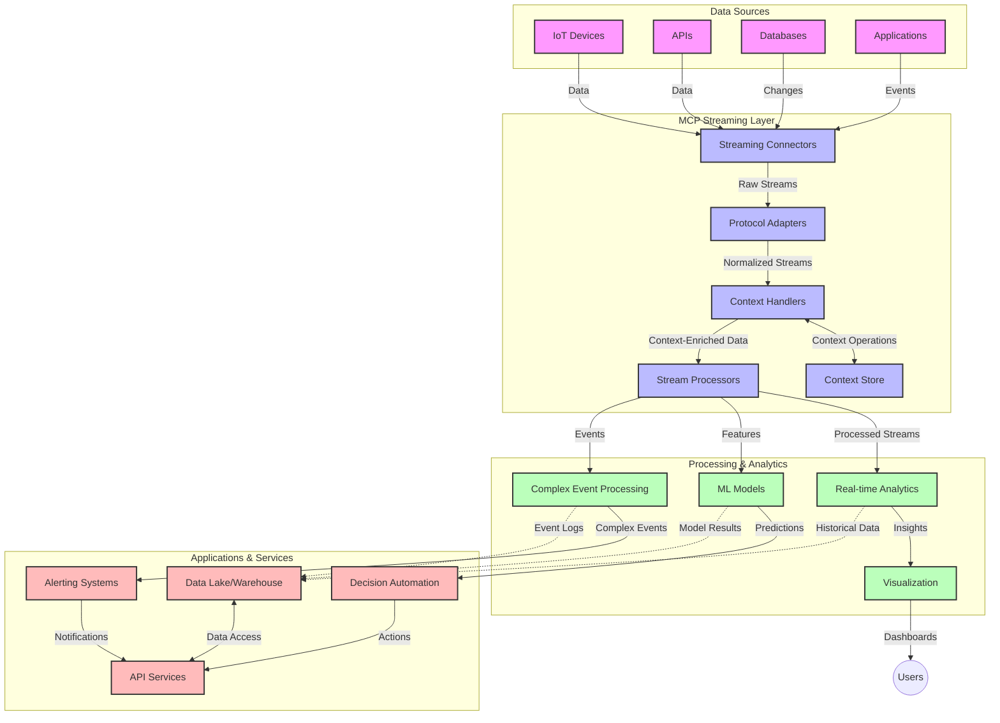

<!--
CO_OP_TRANSLATOR_METADATA:
{
  "original_hash": "68c518dbff8a3b127ed2aa934054c56c",
  "translation_date": "2025-06-11T17:03:04+00:00",
  "source_file": "05-AdvancedTopics/mcp-realtimestreaming/README.md",
  "language_code": "ja"
}
-->
# Model Context Protocolによるリアルタイムデータストリーミング

## 概要

リアルタイムデータストリーミングは、ビジネスやアプリケーションが即時の情報アクセスを必要とする現代のデータ主導社会において不可欠な技術です。Model Context Protocol（MCP）は、これらのリアルタイムストリーミングプロセスを最適化し、データ処理の効率化、コンテキストの一貫性維持、システム全体のパフォーマンス向上を実現する重要な進展をもたらします。

本モジュールでは、AIモデル、ストリーミングプラットフォーム、アプリケーション間でのコンテキスト管理を標準化することで、MCPがリアルタイムデータストリーミングをどのように変革するかを解説します。

## リアルタイムデータストリーミングの紹介

リアルタイムデータストリーミングは、データが生成されると同時に継続的に転送、処理、分析を行い、新しい情報に即座に反応できる技術パラダイムです。従来の静的なデータセットをまとめて処理するバッチ処理とは異なり、ストリーミングは動的なデータをリアルタイムで処理し、ほぼ遅延なく洞察やアクションを提供します。

### リアルタイムデータストリーミングの主要概念

- **継続的なデータフロー**：イベントやレコードが途切れることなく連続的に処理される
- **低遅延処理**：データ生成から処理までの時間を最小限に抑える設計
- **スケーラビリティ**：変動するデータ量や速度に対応可能なアーキテクチャ
- **フォールトトレランス**：障害に強く、データフローを途切れさせない仕組み
- **ステートフル処理**：イベント間のコンテキストを維持し、意味のある分析を実現

### Model Context Protocolとリアルタイムストリーミング

MCPはリアルタイムストリーミング環境における以下の重要な課題に対応します：

1. **コンテキストの連続性**：分散されたストリーミングコンポーネント間でコンテキストの維持を標準化し、AIモデルや処理ノードが関連する過去情報や環境情報にアクセス可能にします。

2. **効率的なステート管理**：構造化されたコンテキスト伝達機能により、ストリーミングパイプラインでのステート管理の負荷を軽減します。

3. **相互運用性**：多様なストリーミング技術やAIモデル間でのコンテキスト共有の共通言語を提供し、柔軟で拡張性の高いアーキテクチャを実現します。

4. **ストリーミング最適化コンテキスト**：リアルタイムの意思決定に最も関連性の高いコンテキスト要素を優先し、パフォーマンスと精度の両立を図ります。

5. **適応的処理**：MCPによる適切なコンテキスト管理で、データの変化やパターンに応じて動的に処理を調整可能にします。

IoTセンサーネットワークから金融取引プラットフォームまで、MCPの導入により、複雑かつ変化する状況にリアルタイムで適切に対応できる高度なコンテキスト対応処理が可能になります。

## 学習目標

このレッスンを終える頃には、以下ができるようになります：

- リアルタイムデータストリーミングの基本と課題を理解する
- Model Context Protocol（MCP）がリアルタイムストリーミングをどのように強化するか説明する
- KafkaやPulsarなどの主要フレームワークを使ったMCPベースのストリーミングソリューションを実装する
- MCPを用いたフォールトトレラントで高性能なストリーミングアーキテクチャを設計・展開する
- IoT、金融取引、AI駆動の分析ユースケースにMCPの概念を適用する
- MCPベースのストリーミング技術の最新動向と将来の革新を評価する


### 定義と重要性

リアルタイムデータストリーミングは、データを継続的に生成、処理、配信し、遅延を極力抑える技術です。バッチ処理のようにデータをまとめて処理するのではなく、到着したデータを逐次処理し、即時の洞察やアクションを可能にします。

リアルタイムデータストリーミングの主な特徴：

- **低遅延**：ミリ秒から秒単位での処理・分析
- **継続的なフロー**：様々なソースから途切れないデータストリーム
- **即時処理**：データ到着時に即分析し、まとめて処理しない
- **イベント駆動型アーキテクチャ**：イベント発生に即応答

### 従来のデータストリーミングの課題

従来のストリーミング手法には以下の制約があります：

1. **コンテキストの喪失**：分散システム間でコンテキストを維持するのが困難
2. **スケーラビリティの問題**：大量かつ高速なデータに対応しづらい
3. **統合の複雑さ**：異なるシステム間の相互運用性の問題
4. **遅延管理**：スループットと処理時間のバランス調整が難しい
5. **データの一貫性**：ストリーム全体でのデータ精度と完全性の確保

## Model Context Protocol（MCP）の理解

### MCPとは？

Model Context Protocol（MCP）は、AIモデルとアプリケーション間の効率的な通信を促進する標準化されたプロトコルです。リアルタイムデータストリーミングにおいては、以下の枠組みを提供します：

- データパイプライン全体でのコンテキスト保持
- データ交換フォーマットの標準化
- 大規模データセットの伝送最適化
- モデル間およびモデルとアプリケーション間の通信強化

### コアコンポーネントとアーキテクチャ

リアルタイムストリーミングにおけるMCPアーキテクチャの主な構成要素：

1. **Context Handlers**：ストリーミングパイプライン全体でコンテキスト情報を管理・維持
2. **Stream Processors**：コンテキストを活用したデータストリームの処理
3. **Protocol Adapters**：異なるストリーミングプロトコル間でコンテキストを保持しつつ変換
4. **Context Store**：効率的にコンテキスト情報を保存・取得
5. **Streaming Connectors**：Kafka、Pulsar、Kinesisなどの各種ストリーミングプラットフォームへの接続



### MCPがリアルタイムデータ処理を改善する方法

MCPは以下の点で従来のストリーミング課題を解決します：

- **コンテキストの整合性**：パイプライン全体でデータポイント間の関係性を維持
- **伝送の最適化**：インテリジェントなコンテキスト管理によりデータ交換の冗長性を削減
- **標準化されたインターフェース**：ストリーミングコンポーネント向けの一貫したAPIを提供
- **遅延削減**：効率的なコンテキスト処理でオーバーヘッドを低減
- **スケーラビリティ向上**：コンテキストを維持しながら水平スケーリングをサポート

## 統合と実装

リアルタイムデータストリーミングシステムは、パフォーマンスとコンテキストの整合性を両立させるために慎重な設計と実装が必要です。Model Context ProtocolはAIモデルとストリーミング技術を統合する標準化された手法を提供し、より高度でコンテキスト対応の処理パイプラインを実現します。

### ストリーミングアーキテクチャにおけるMCP統合の概要

リアルタイムストリーミング環境でMCPを導入する際の主なポイント：

1. **コンテキストのシリアライズと伝送**：MCPはストリーミングデータパケット内でコンテキスト情報を効率的にエンコードし、処理パイプライン全体で重要なコンテキストが追従することを保証します。ストリーミング伝送に最適化された標準化されたシリアライズ形式を含みます。

2. **ステートフルストリーム処理**：MCPは処理ノード間で一貫したコンテキスト表現を維持することで、より高度なステートフル処理を可能にします。分散ストリーミングアーキテクチャでのステート管理が特に有用です。

3. **イベントタイムと処理タイムの区別**：MCP実装はイベント発生時刻と処理時刻の違いに対応する必要があります。プロトコルはイベントタイムの意味を保持する時間的コンテキストを組み込めます。

4. **バックプレッシャー管理**：標準化されたコンテキスト処理により、ストリーミングシステム内のバックプレッシャーを管理し、コンポーネント間で処理能力を伝達し、流量調整を可能にします。

5. **コンテキストのウィンドウ処理と集約**：MCPは時間的および関係的コンテキストの構造化された表現を提供し、イベントストリーム間でより意味のある集約を実現します。

6. **Exactly-Once処理**：厳密に一度だけの処理意味論が必要なストリーミングシステムにおいて、MCPは処理メタデータを組み込み、分散コンポーネント間での処理状況の追跡と検証を支援します。

さまざまなストリーミング技術におけるMCPの実装は、コンテキスト管理の統一的なアプローチを提供し、カスタム統合コードの必要性を減らしつつ、データがパイプラインを流れる間の意味のあるコンテキスト維持能力を高めます。

### さまざまなデータストリーミングフレームワークにおけるMCP

MCPは以下の主要なストリーミングフレームワークと統合可能です：

#### Apache Kafka統合

```python
from mcp_streaming import MCPKafkaConnector

# Initialize MCP Kafka connector
connector = MCPKafkaConnector(
    bootstrap_servers='localhost:9092',
    context_preservation=True
)

# Create a context-aware consumer
consumer = connector.create_consumer('input-topic')

# Process streaming data with context
for message in consumer:
    context = message.get_context()
    data = message.get_value()
    
    # Process with context awareness
    result = process_with_context(data, context)
    
    # Produce output with preserved context
    connector.produce('output-topic', result, context=context)
```

#### Apache Pulsar実装

```python
from mcp_streaming import MCPPulsarClient

# Initialize MCP Pulsar client
client = MCPPulsarClient('pulsar://localhost:6650')

# Subscribe with context awareness
consumer = client.subscribe('input-topic', 'subscription-name', 
                           context_enabled=True)

# Process messages with context preservation
while True:
    message = consumer.receive()
    context = message.get_context()
    
    # Process with context
    result = process_with_context(message.data(), context)
    
    # Acknowledge the message
    consumer.acknowledge(message)
    
    # Send result with preserved context
    producer = client.create_producer('output-topic')
    producer.send(result, context=context)
```

### 展開のベストプラクティス

リアルタイムストリーミングにMCPを実装する際は：

1. **フォールトトレランス設計**：
   - 適切なエラーハンドリングを実装
   - 失敗したメッセージのためのデッドレターキューを使用
   - 冪等性のあるプロセッサを設計

2. **パフォーマンス最適化**：
   - 適切なバッファサイズを設定
   - 必要に応じてバッチ処理を活用
   - バックプレッシャー機構を実装

3. **監視と観測**：
   - ストリーム処理のメトリクスを追跡
   - コンテキスト伝播を監視
   - 異常検知のアラート設定

4. **ストリームのセキュリティ強化**：
   - 機密データの暗号化を実施
   - 認証と認可を適用
   - 適切なアクセス制御を行う


### IoTおよびエッジコンピューティングにおけるMCP

MCPはIoTストリーミングを以下のように強化します：

- 処理パイプライン全体でデバイスのコンテキストを保持
- 効率的なエッジからクラウドへのデータストリーミングを可能に
- IoTデータストリームのリアルタイム分析をサポート
- コンテキスト付きのデバイス間通信を促進

例：スマートシティセンサーネットワーク  
```
Sensors → Edge Gateways → MCP Stream Processors → Real-time Analytics → Automated Responses
```

### 金融取引および高頻度取引における役割

MCPは金融データストリーミングにおいて以下の大きな利点を提供します：

- 超低遅延の取引意思決定処理
- 処理全体での取引コンテキストの維持
- コンテキスト認識を伴う複雑なイベント処理のサポート
- 分散取引システム全体でのデータ一貫性の確保

### AI駆動のデータ分析の強化

MCPはストリーミング分析に新たな可能性を創出します：

- リアルタイムのモデル学習と推論
- ストリーミングデータからの継続的学習
- コンテキスト対応の特徴抽出
- コンテキストを保持したマルチモデル推論パイプライン

## 将来の動向と革新

### リアルタイム環境におけるMCPの進化

今後、MCPは以下の課題に対応し進化すると予想されます：

- **量子コンピューティング統合**：量子ベースのストリーミングシステムへの対応準備
- **エッジネイティブ処理**：より多くのコンテキスト対応処理をエッジデバイスへ移行
- **自律的ストリーム管理**：自己最適化型のストリーミングパイプライン
- **フェデレーテッドストリーミング**：プライバシーを守りつつ分散処理を実現

### 技術的な将来の進展

MCPストリーミングの未来を形作る新技術：

1. **AI最適化ストリーミングプロトコル**：AIワークロード専用に設計されたカスタムプロトコル
2. **ニューロモルフィックコンピューティング統合**：脳を模倣したコンピューティングによるストリーム処理
3. **サーバーレスストリーミング**：インフラ管理不要のイベント駆動型スケーラブルストリーミング
4. **分散コンテキストストア**：世界中に分散しつつ高い整合性を保つコンテキスト管理

## ハンズオン演習

### 演習1：基本的なMCPストリーミングパイプラインの構築

この演習では、以下を学びます：

- 基本的なMCPストリーミング環境の設定
- ストリーム処理のためのコンテキストハンドラーの実装
- コンテキスト保持のテストと検証

### 演習2：リアルタイム分析ダッシュボードの構築

以下の機能を持つアプリケーションを作成します：

- MCPを利用したストリーミングデータの取り込み
- コンテキストを維持しながらストリームを処理
- リアルタイムで結果を可視化

### 演習3：MCPを用いた複雑イベント処理の実装

高度な演習内容：

- ストリーム内のパターン検出
- 複数ストリーム間のコンテキスト相関
- コンテキストを保持した複雑イベントの生成

## 追加リソース

- [Model Context Protocol Specification](https://github.com/microsoft/model-context-protocol) - MCPの公式仕様とドキュメント
- [Apache Kafka Documentation](https://kafka.apache.org/documentation/) - Kafkaによるストリーム処理について
- [Apache Pulsar](https://pulsar.apache.org/) - 統合メッセージング＆ストリーミ

**免責事項**:  
本書類はAI翻訳サービス[Co-op Translator](https://github.com/Azure/co-op-translator)を使用して翻訳されています。正確性には努めておりますが、自動翻訳には誤りや不正確な部分が含まれる可能性があります。原文の言語によるオリジナルの文書が正式な情報源とみなされるべきです。重要な情報については、専門の人間による翻訳を推奨します。本翻訳の利用により生じたいかなる誤解や解釈の相違についても、当方は責任を負いかねます。