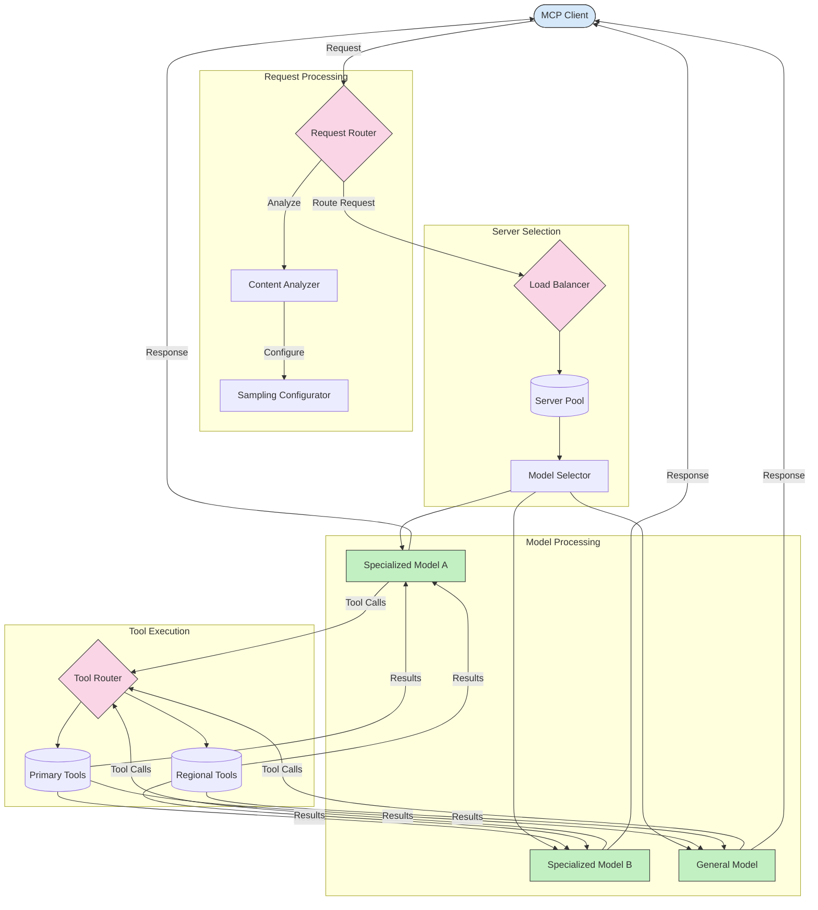

<!--
CO_OP_TRANSLATOR_METADATA:
{
  "original_hash": "af40eab7bd6ebf7e607f982a5506a5b5",
  "translation_date": "2025-07-14T02:11:02+00:00",
  "source_file": "05-AdvancedTopics/mcp-routing/README.md",
  "language_code": "ja"
}
-->
## MCPにおけるサンプリングとルーティングのアーキテクチャ

サンプリングは、Model Context Protocol（MCP）の重要な要素であり、効率的なリクエスト処理とルーティングを可能にします。これは、コンテンツタイプ、ユーザーコンテキスト、システム負荷などのさまざまな基準に基づいて、最も適切なモデルやサービスを判断するために、受信リクエストを分析することを含みます。

サンプリングとルーティングを組み合わせることで、リソースの最適利用と高可用性を実現する堅牢なアーキテクチャを構築できます。サンプリングプロセスはリクエストの分類に使用され、ルーティングはそれらを適切なモデルやサービスに振り分けます。

以下の図は、包括的なMCPアーキテクチャにおいてサンプリングとルーティングがどのように連携しているかを示しています：

## 次に進む

- [5.6 サンプリング](../mcp-sampling/README.md)

**免責事項**：  
本書類はAI翻訳サービス「[Co-op Translator](https://github.com/Azure/co-op-translator)」を使用して翻訳されました。正確性を期しておりますが、自動翻訳には誤りや不正確な部分が含まれる可能性があります。原文の言語によるオリジナル文書が正式な情報源とみなされるべきです。重要な情報については、専門の人間による翻訳を推奨します。本翻訳の利用により生じたいかなる誤解や誤訳についても、当方は責任を負いかねます。