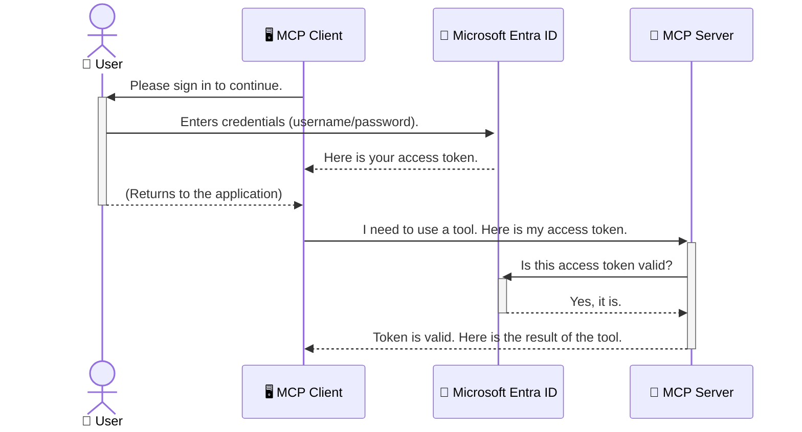

<!--
CO_OP_TRANSLATOR_METADATA:
{
  "original_hash": "9abe1d303ab126f9a8b87f03cebe5213",
  "translation_date": "2025-06-26T14:39:17+00:00",
  "source_file": "05-AdvancedTopics/mcp-security-entra/README.md",
  "language_code": "ja"
}
-->
# AIワークフローの保護：Model Context Protocolサーバー向けEntra ID認証

## はじめに
Model Context Protocol（MCP）サーバーのセキュリティは、自宅の玄関の鍵をかけるのと同じくらい重要です。MCPサーバーを開放したままにしておくと、不正アクセスによりツールやデータが危険にさらされる可能性があります。Microsoft Entra IDは、クラウドベースの強力なアイデンティティおよびアクセス管理ソリューションを提供し、認可されたユーザーやアプリケーションだけがMCPサーバーとやり取りできるようにします。このセクションでは、Entra ID認証を使ってAIワークフローを保護する方法を学びます。

## 学習目標
このセクションを終える頃には、以下ができるようになります。

- MCPサーバーのセキュリティの重要性を理解する。
- Microsoft Entra IDとOAuth 2.0認証の基本を説明できる。
- パブリッククライアントとコンフィデンシャルクライアントの違いを認識する。
- ローカル（パブリッククライアント）およびリモート（コンフィデンシャルクライアント）のMCPサーバーシナリオでEntra ID認証を実装する。
- AIワークフロー開発時にセキュリティのベストプラクティスを適用する。

# AIワークフローの保護：Model Context Protocolサーバー向けEntra ID認証

自宅の玄関の鍵をかけずに放置しないのと同様に、MCPサーバーも誰でもアクセスできる状態にしてはいけません。AIワークフローを保護することは、堅牢で信頼性が高く安全なアプリケーションを構築するために不可欠です。本章では、Microsoft Entra IDを使用してMCPサーバーを保護し、認可されたユーザーやアプリケーションのみがツールやデータにアクセスできるようにする方法を紹介します。

## MCPサーバーのセキュリティが重要な理由

あなたのMCPサーバーにメール送信や顧客データベースにアクセスするツールがあると想像してください。セキュリティが不十分なサーバーでは、誰でもそのツールを使えてしまい、不正なデータアクセスやスパム、悪意のある行為につながる恐れがあります。

認証を実装することで、サーバーへのすべてのリクエストが検証され、リクエストを行うユーザーやアプリケーションの身元が確認されます。これはAIワークフローを保護するための最初で最も重要なステップです。

## Microsoft Entra IDの概要

**Microsoft Entra ID**はクラウドベースのアイデンティティおよびアクセス管理サービスです。アプリケーションのための万能のセキュリティガードのようなものと考えてください。ユーザーの身元確認（認証）や、許可された操作の管理（認可）という複雑な処理を担います。

Entra IDを使うことで以下が可能になります：

- ユーザーの安全なサインインを実現。
- APIやサービスの保護。
- アクセスポリシーの一元管理。

MCPサーバーにおいて、Entra IDは誰がサーバーの機能にアクセスできるかを管理する信頼性の高いソリューションを提供します。

---

## 仕組みの理解：Entra ID認証の動作

Entra IDは**OAuth 2.0**などのオープンスタンダードを使って認証を処理します。詳細は複雑ですが、基本的な考え方はシンプルで、例え話で理解しやすくなります。

### OAuth 2.0のやさしい紹介：バレットキー（Valet Key）

OAuth 2.0は車のバレットサービスのようなものです。レストランに着いたとき、あなたはマスターキーをバレットに渡しません。代わりに、限られた権限しか持たない**バレットキー**を渡します。このキーは車のエンジンをかけてドアをロックできますが、トランクやグローブボックスは開けられません。

この例えでは：

- **あなた**が**ユーザー**。
- **あなたの車**が価値あるツールやデータを持つ**MCPサーバー**。
- **バレット**が**Microsoft Entra ID**。
- **駐車係**がサーバーにアクセスしようとする**MCPクライアント**（アプリケーション）。
- **バレットキー**が**アクセス トークン**。

アクセス トークンは、ユーザーがサインインした後にEntra IDからMCPクライアントに渡される安全な文字列です。クライアントはこのトークンを使ってサーバーにリクエストを送り、サーバーはトークンを検証してリクエストの正当性とクライアントの権限を確認します。これにより、パスワードなどの実際の資格情報を扱う必要がなくなります。

### 認証の流れ

実際の流れは以下のようになります：



### Microsoft Authentication Library (MSAL)の紹介

コードの説明に入る前に、例で頻繁に登場する重要なコンポーネント、**Microsoft Authentication Library (MSAL)**について説明します。

MSALはMicrosoftが開発したライブラリで、開発者が認証処理を簡単に扱えるようにします。複雑なセキュリティトークンの管理やサインイン処理、セッションの更新などを自分で書く代わりに、MSALがこれらを代行します。

MSALを使うことを強く推奨する理由は：

- **安全性**：業界標準のプロトコルやセキュリティのベストプラクティスを実装しており、脆弱性リスクを減らせる。
- **開発の簡素化**：OAuth 2.0やOpenID Connectの複雑さを抽象化し、数行のコードで堅牢な認証を実装可能。
- **メンテナンスされている**：Microsoftが継続的に更新し、新たなセキュリティ脅威やプラットフォーム変更に対応。

MSALは.NET、JavaScript/TypeScript、Python、Java、Go、iOSやAndroidなど多くの言語やフレームワークをサポートしており、テクノロジースタック全体で一貫した認証パターンを利用できます。

MSALの詳細は公式の[MSAL概要ドキュメント](https://learn.microsoft.com/entra/identity-platform/msal-overview)をご覧ください。

---

## Entra IDでMCPサーバーを保護する：ステップバイステップガイド

ここからは、ローカルMCPサーバー（`stdio`) using Entra ID. This example uses a **public client**, which is suitable for applications running on a user's machine, like a desktop app or a local development server.

### Scenario 1: Securing a Local MCP Server (with a Public Client)

In this scenario, we'll look at an MCP server that runs locally, communicates over `stdio`, and uses Entra ID to authenticate the user before allowing access to its tools. The server will have a single tool that fetches the user's profile information from the Microsoft Graph API.

#### 1. Setting Up the Application in Entra ID

Before writing any code, you need to register your application in Microsoft Entra ID. This tells Entra ID about your application and grants it permission to use the authentication service.

1. Navigate to the **[Microsoft Entra portal](https://entra.microsoft.com/)**.
2. Go to **App registrations** and click **New registration**.
3. Give your application a name (e.g., "My Local MCP Server").
4. For **Supported account types**, select **Accounts in this organizational directory only**.
5. You can leave the **Redirect URI** blank for this example.
6. Click **Register**.

Once registered, take note of the **Application (client) ID** and **Directory (tenant) ID**. You'll need these in your code.

#### 2. The Code: A Breakdown

Let's look at the key parts of the code that handle authentication. The full code for this example is available in the [Entra ID - Local - WAM](https://github.com/Azure-Samples/mcp-auth-servers/tree/main/src/entra-id-local-wam) folder of the [mcp-auth-servers GitHub repository](https://github.com/Azure-Samples/mcp-auth-servers).

**`AuthenticationService.cs`**

This class is responsible for handling the interaction with Entra ID.

- **`CreateAsync`**: This method initializes the `PublicClientApplication` from the MSAL (Microsoft Authentication Library). It's configured with your application's `clientId` and `tenantId`.
- **`WithBroker`**: This enables the use of a broker (like the Windows Web Account Manager), which provides a more secure and seamless single sign-on experience.
- **`AcquireTokenAsync`**：このメソッドはまずサイレントにトークンを取得しようとし（ユーザーが既に有効なセッションを持っていれば再度サインインは不要）、サイレント取得できない場合はインタラクティブにサインインを促します）を保護する方法を見ていきます。

```csharp
// Simplified for clarity
public static async Task<AuthenticationService> CreateAsync(ILogger<AuthenticationService> logger)
{
    var msalClient = PublicClientApplicationBuilder
        .Create(_clientId) // Your Application (client) ID
        .WithAuthority(AadAuthorityAudience.AzureAdMyOrg)
        .WithTenantId(_tenantId) // Your Directory (tenant) ID
        .WithBroker(new BrokerOptions(BrokerOptions.OperatingSystems.Windows))
        .Build();

    // ... cache registration ...

    return new AuthenticationService(logger, msalClient);
}

public async Task<string> AcquireTokenAsync()
{
    try
    {
        // Try silent authentication first
        var accounts = await _msalClient.GetAccountsAsync();
        var account = accounts.FirstOrDefault();

        AuthenticationResult? result = null;

        if (account != null)
        {
            result = await _msalClient.AcquireTokenSilent(_scopes, account).ExecuteAsync();
        }
        else
        {
            // If no account, or silent fails, go interactive
            result = await _msalClient.AcquireTokenInteractive(_scopes).ExecuteAsync();
        }

        return result.AccessToken;
    }
    catch (Exception ex)
    {
        _logger.LogError(ex, "An error occurred while acquiring the token.");
        throw; // Optionally rethrow the exception for higher-level handling
    }
}
```

**`Program.cs`**

This is where the MCP server is set up and the authentication service is integrated.

- **`AddSingleton<AuthenticationService>`**: This registers the `AuthenticationService` with the dependency injection container, so it can be used by other parts of the application (like our tool).
- **`GetUserDetailsFromGraph` tool**: This tool requires an instance of `AuthenticationService`. Before it does anything, it calls `authService.AcquireTokenAsync()`は有効なアクセストークンを取得します。認証が成功すると、そのトークンを使ってMicrosoft Graph APIを呼び出し、ユーザーの詳細情報を取得します。

```csharp
// Simplified for clarity
[McpServerTool(Name = "GetUserDetailsFromGraph")]
public static async Task<string> GetUserDetailsFromGraph(
    AuthenticationService authService)
{
    try
    {
        // This will trigger the authentication flow
        var accessToken = await authService.AcquireTokenAsync();

        // Use the token to create a GraphServiceClient
        var graphClient = new GraphServiceClient(
            new BaseBearerTokenAuthenticationProvider(new TokenProvider(authService)));

        var user = await graphClient.Me.GetAsync();

        return System.Text.Json.JsonSerializer.Serialize(user);
    }
    catch (Exception ex)
    {
        return $"Error: {ex.Message}";
    }
}
```

#### 3. 全体の流れ

1. MCPクライアントが`GetUserDetailsFromGraph` tool, the tool first calls `AcquireTokenAsync`.
2. `AcquireTokenAsync` triggers the MSAL library to check for a valid token.
3. If no token is found, MSAL, through the broker, will prompt the user to sign in with their Entra ID account.
4. Once the user signs in, Entra ID issues an access token.
5. The tool receives the token and uses it to make a secure call to the Microsoft Graph API.
6. The user's details are returned to the MCP client.

This process ensures that only authenticated users can use the tool, effectively securing your local MCP server.

### Scenario 2: Securing a Remote MCP Server (with a Confidential Client)

When your MCP server is running on a remote machine (like a cloud server) and communicates over a protocol like HTTP Streaming, the security requirements are different. In this case, you should use a **confidential client** and the **Authorization Code Flow**. This is a more secure method because the application's secrets are never exposed to the browser.

This example uses a TypeScript-based MCP server that uses Express.js to handle HTTP requests.

#### 1. Setting Up the Application in Entra ID

The setup in Entra ID is similar to the public client, but with one key difference: you need to create a **client secret**.

1. Navigate to the **[Microsoft Entra portal](https://entra.microsoft.com/)**.
2. In your app registration, go to the **Certificates & secrets** tab.
3. Click **New client secret**, give it a description, and click **Add**.
4. **Important:** Copy the secret value immediately. You will not be able to see it again.
5. You also need to configure a **Redirect URI**. Go to the **Authentication** tab, click **Add a platform**, select **Web**, and enter the redirect URI for your application (e.g., `http://localhost:3001/auth/callback`).

> **⚠️ Important Security Note:** For production applications, Microsoft strongly recommends using **secretless authentication** methods such as **Managed Identity** or **Workload Identity Federation** instead of client secrets. Client secrets pose security risks as they can be exposed or compromised. Managed identities provide a more secure approach by eliminating the need to store credentials in your code or configuration.
>
> For more information about managed identities and how to implement them, see the [Managed identities for Azure resources overview](https://learn.microsoft.com/entra/identity/managed-identities-azure-resources/overview).

#### 2. The Code: A Breakdown

This example uses a session-based approach. When the user authenticates, the server stores the access token and refresh token in a session and gives the user a session token. This session token is then used for subsequent requests. The full code for this example is available in the [Entra ID - Confidential client](https://github.com/Azure-Samples/mcp-auth-servers/tree/main/src/entra-id-cca-session) folder of the [mcp-auth-servers GitHub repository](https://github.com/Azure-Samples/mcp-auth-servers).

**`Server.ts`**

This file sets up the Express server and the MCP transport layer.

- **`requireBearerAuth`**: This is middleware that protects the `/sse` and `/message` endpoints. It checks for a valid bearer token in the `Authorization` header of the request.
- **`EntraIdServerAuthProvider`**: This is a custom class that implements the `McpServerAuthorizationProvider` interface. It's responsible for handling the OAuth 2.0 flow.
- **`/auth/callback`**を使おうとすると、これはユーザー認証後にEntra IDからのリダイレクトを処理し、認可コードをアクセストークンとリフレッシュトークンに交換するエンドポイントです。

```typescript
// Simplified for clarity
const app = express();
const { server } = createServer();
const provider = new EntraIdServerAuthProvider();

// Protect the SSE endpoint
app.get("/sse", requireBearerAuth({
  provider,
  requiredScopes: ["User.Read"]
}), async (req, res) => {
  // ... connect to the transport ...
});

// Protect the message endpoint
app.post("/message", requireBearerAuth({
  provider,
  requiredScopes: ["User.Read"]
}), async (req, res) => {
  // ... handle the message ...
});

// Handle the OAuth 2.0 callback
app.get("/auth/callback", (req, res) => {
  provider.handleCallback(req.query.code, req.query.state)
    .then(result => {
      // ... handle success or failure ...
    });
});
```

**`Tools.ts`**

This file defines the tools that the MCP server provides. The `getUserDetails`ツールは前述の例と似ていますが、セッションからアクセストークンを取得します。

```typescript
// Simplified for clarity
server.setRequestHandler(CallToolRequestSchema, async (request) => {
  const { name } = request.params;
  const context = request.params?.context as { token?: string } | undefined;
  const sessionToken = context?.token;

  if (name === ToolName.GET_USER_DETAILS) {
    if (!sessionToken) {
      throw new AuthenticationError("Authentication token is missing or invalid. Ensure the token is provided in the request context.");
    }

    // Get the Entra ID token from the session store
    const tokenData = tokenStore.getToken(sessionToken);
    const entraIdToken = tokenData.accessToken;

    const graphClient = Client.init({
      authProvider: (done) => {
        done(null, entraIdToken);
      }
    });

    const user = await graphClient.api('/me').get();

    // ... return user details ...
  }
});
```

**`auth/EntraIdServerAuthProvider.ts`**

This class handles the logic for:

- Redirecting the user to the Entra ID sign-in page.
- Exchanging the authorization code for an access token.
- Storing the tokens in the `tokenStore`.
- Refreshing the access token when it expires.

#### 3. How It All Works Together

1. When a user first tries to connect to the MCP server, the `requireBearerAuth` middleware will see that they don't have a valid session and will redirect them to the Entra ID sign-in page.
2. The user signs in with their Entra ID account.
3. Entra ID redirects the user back to the `/auth/callback` endpoint with an authorization code.
4. The server exchanges the code for an access token and a refresh token, stores them, and creates a session token which is sent to the client.
5. The client can now use this session token in the `Authorization` header for all future requests to the MCP server.
6. When the `getUserDetails`ツールが呼ばれると、セッションのトークンを使ってEntra IDのアクセストークンを取得し、Microsoft Graph APIを呼び出します。

このフローはパブリッククライアントのフローより複雑ですが、インターネットに公開されるエンドポイントにはより強力なセキュリティが必要です。リモートMCPサーバーはパブリックインターネット経由でアクセスされるため、不正アクセスや攻撃から守るために強固な対策が求められます。

## セキュリティのベストプラクティス

- **常にHTTPSを使用する**：クライアントとサーバー間の通信を暗号化し、トークンの盗聴を防ぐ。
- **ロールベースアクセス制御（RBAC）を実装する**：ユーザーが認証されているかだけでなく、何が許可されているかを確認。Entra IDでロールを定義し、MCPサーバーでチェックする。
- **監視と監査を行う**：すべての認証イベントをログに記録し、不審な活動を検知・対応できるようにする。
- **レート制限とスロットリングの対応**：Microsoft GraphなどのAPIは乱用防止のためレート制限を設けている。MCPサーバーでは指数的バックオフやリトライ処理を実装し、HTTP 429（リクエスト過多）を適切に処理する。頻繁にアクセスするデータはキャッシュしてAPIコールを減らすことも検討。
- **トークンの安全な保管**：アクセストークンやリフレッシュトークンは安全に保管する。ローカルアプリケーションではOSのセキュアストレージを利用し、サーバーアプリケーションでは暗号化ストレージやAzure Key Vaultのような安全なキー管理サービスを検討。
- **トークンの有効期限管理**：アクセストークンは有効期限があるため、リフレッシュトークンを使って自動的に更新し、ユーザーに再認証を求めずにシームレスな体験を維持する。
- **Azure API Managementの活用を検討**：MCPサーバーに直接セキュリティを組み込むことで細かな制御が可能ですが、Azure API ManagementのようなAPIゲートウェイを使うと認証・認可、レート制限、監視など多くのセキュリティ機能を自動的に処理できる。クライアントとMCPサーバーの間に置く集中管理のセキュリティレイヤーとして有効です。MCPでAPIゲートウェイを使う詳細は[Azure API Management Your Auth Gateway For MCP Servers](https://techcommunity.microsoft.com/blog/integrationsonazureblog/azure-api-management-your-auth-gateway-for-mcp-servers/4402690)を参照してください。

## まとめ

- MCPサーバーの保護はデータとツールの安全確保に不可欠。
- Microsoft Entra IDは認証・認可のための堅牢でスケーラブルなソリューションを提供。
- ローカルアプリケーションには**パブリッククライアント**を、リモートサーバーには**コンフィデンシャルクライアント**を使用。
- Webアプリケーションには最も安全な**Authorization Code Flow**を推奨。

## 演習

1. あなたが構築しようとしているMCPサーバーはローカルサーバーですか、それともリモートサーバーですか？
2. その答えに基づいて、パブリッククライアントとコンフィデンシャルクライアントのどちらを使いますか？
3. Microsoft Graphに対してどのような権限をMCPサーバーに要求させますか？

## ハンズオン演習

### 演習1：Entra IDでアプリケーションを登録する
Microsoft Entraポータルにアクセス。
MCPサーバー用の新しいアプリケーションを登録。
アプリケーション（クライアント）IDとディレクトリ（テナント）IDを控える。

### 演習2：ローカルMCPサーバーを保護する（パブリッククライアント）
MSAL（Microsoft Authentication Library）を使ってユーザー認証を統合するコード例に従う。
Microsoft Graphからユーザー詳細を取得するMCPツールを呼び出して認証フローをテスト。

### 演習3：リモートMCPサーバーを保護する（コンフィデンシャルクライアント）
Entra IDでコンフィデンシャルクライアントを登録し、クライアントシークレットを作成。
Express.jsのMCPサーバーをAuthorization Code Flowに設定。
保護されたエンドポイントをテストし、トークンベースのアクセスを確認。

### 演習4：セキュリティのベストプラクティスを適用する
ローカルまたはリモートサーバーでHTTPSを有効化。
サーバーロジックにロールベースアクセス制御（RBAC）を実装。
トークンの有効期限管理と安全なトークン保管を追加。

## 参考資料

1. **MSAL概要ドキュメント**  
   Microsoft Authentication Library（MSAL）がプラットフォーム横断で安全なトークン取得を可能にする仕組み：  
   [MSAL Overview on Microsoft Learn](https://learn.microsoft.com/en-gb/entra/msal/overview)

2. **Azure-Samples/mcp-auth-servers GitHubリポジトリ**  
   認証フローを示すMCPサーバーのリファレンス実装：  
   [Azure-Samples/mcp-auth-servers on GitHub](https://github.com/Azure-Samples/mcp-auth-servers)

3. **Azureリソース向けマネージドID概要**  
   シークレット不要で安全に認証するシステムまたはユーザー割り当てマネージドIDについて：  
   [Managed Identities Overview on Microsoft Learn](https://learn.microsoft.com/en-us/entra/identity/managed-identities-azure-resources/)

4. **Azure API Management：MCPサーバーの認証ゲートウェイ**  
   APIMをOAuth2の安全なゲートウェイとして使う詳細解説：  
   [Azure API Management Your Auth Gateway For MCP Servers](https://techcommunity.microsoft.com/blog/integrationsonazureblog/azure-api-management-your-auth-gateway-for-mcp-servers/4402690)

5. **Microsoft Graph権限リファレンス**  
   Microsoft Graphの委任権限とアプリケーション権限の包括的リスト：  
   [Microsoft Graph Permissions Reference](https://learn.microsoft.com/zh-tw/graph/permissions-reference)

## 学習成果
このセクションを終えた後、以下ができるようになります：

- MCPサーバーとAIワークフローにおいて認証がなぜ重要か説明できる。
- ローカルおよびリモートMCPサーバーシナリオでEntra ID認証を設定・構成できる。
- サーバーの展開に応じて適切なクライアントタイプ（パブリックまたはコンフィデンシャル）を選択できる。
- トークン保管やロールベース認可など、安全なコーディングプラクティスを実装できる。
- MCPサーバーとそのツールを不正アクセスから確実に保護できる。

## 次に進む

- [6. Community Contributions](../../06-CommunityContributions/README.md)

**免責事項**：  
本書類はAI翻訳サービス「[Co-op Translator](https://github.com/Azure/co-op-translator)」を使用して翻訳されました。正確性の向上に努めておりますが、自動翻訳には誤りや不正確な部分が含まれる可能性があります。原文の言語によるオリジナル文書を正本としてご参照ください。重要な情報については、専門の人間翻訳を推奨いたします。本翻訳の利用により生じたいかなる誤解や解釈の相違についても、当方は一切の責任を負いかねます。