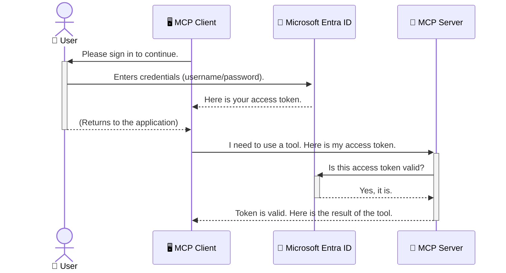

<!--
CO_OP_TRANSLATOR_METADATA:
{
  "original_hash": "6e562d7e5a77c8982da4aa8f762ad1d8",
  "translation_date": "2025-07-14T02:53:39+00:00",
  "source_file": "05-AdvancedTopics/mcp-security-entra/README.md",
  "language_code": "ja"
}
-->
# AIワークフローの保護：Model Context ProtocolサーバーのEntra ID認証

## はじめに
Model Context Protocol（MCP）サーバーのセキュリティは、自宅の玄関の鍵をかけるのと同じくらい重要です。MCPサーバーを無防備にしておくと、ツールやデータが不正アクセスにさらされ、セキュリティ侵害につながる恐れがあります。Microsoft Entra IDは、クラウドベースの強力なIDおよびアクセス管理ソリューションを提供し、認可されたユーザーやアプリケーションだけがMCPサーバーとやり取りできるようにします。このセクションでは、Entra ID認証を使ってAIワークフローを保護する方法を学びます。

## 学習目標
このセクションを終える頃には、以下ができるようになります：

- MCPサーバーのセキュリティの重要性を理解する。
- Microsoft Entra IDとOAuth 2.0認証の基本を説明できる。
- パブリッククライアントとコンフィデンシャルクライアントの違いを認識する。
- ローカル（パブリッククライアント）およびリモート（コンフィデンシャルクライアント）MCPサーバーのシナリオでEntra ID認証を実装する。
- AIワークフロー開発時にセキュリティのベストプラクティスを適用する。

## セキュリティとMCP

自宅の玄関の鍵をかけずに放置しないのと同様に、MCPサーバーも誰でもアクセスできる状態にしてはいけません。AIワークフローのセキュリティは、堅牢で信頼性の高い安全なアプリケーションを構築するために不可欠です。本章では、Microsoft Entra IDを使ってMCPサーバーを保護し、認可されたユーザーやアプリケーションだけがツールやデータにアクセスできるようにする方法を紹介します。

## MCPサーバーのセキュリティが重要な理由

MCPサーバーにメール送信や顧客データベースへのアクセスが可能なツールがあると想像してください。セキュリティが甘いサーバーでは、誰でもそのツールを使えてしまい、不正なデータアクセスやスパム、その他の悪意ある行為につながる可能性があります。

認証を実装することで、サーバーへのすべてのリクエストが検証され、リクエストを行うユーザーやアプリケーションの身元が確認されます。これがAIワークフローを保護するための最初で最も重要なステップです。

## Microsoft Entra IDの紹介

[**Microsoft Entra ID**](https://adoption.microsoft.com/microsoft-security/entra/)は、クラウドベースのIDおよびアクセス管理サービスです。アプリケーションのための万能なセキュリティガードのようなものと考えてください。ユーザーの身元確認（認証）や、許可されている操作の判定（認可）という複雑なプロセスを処理します。

Entra IDを使うことで、以下が可能になります：

- ユーザーの安全なサインインを実現。
- APIやサービスの保護。
- アクセスポリシーを一元管理。

MCPサーバーにおいては、Entra IDがサーバーの機能にアクセスできるユーザーを管理するための信頼性の高いソリューションを提供します。

---

## 仕組みの理解：Entra ID認証の動作

Entra IDは**OAuth 2.0**のようなオープンスタンダードを使って認証を処理します。詳細は複雑ですが、基本的な考え方はシンプルで、例え話で理解できます。

### OAuth 2.0のやさしい紹介：バレットキーの例え

OAuth 2.0は車のバレットサービスのようなものです。レストランに着いたとき、マスターキーを渡すのではなく、限られた権限を持つ**バレットキー**を渡します。このキーは車のエンジンをかけてドアをロックできますが、トランクやグローブボックスは開けられません。

この例えでいうと：

- **あなた**は**ユーザー**。
- **あなたの車**は価値あるツールやデータを持つ**MCPサーバー**。
- **バレット**は**Microsoft Entra ID**。
- **駐車係**は**MCPクライアント**（サーバーにアクセスしようとするアプリケーション）。
- **バレットキー**は**アクセストークン**。

アクセストークンは、ユーザーがサインインした後にEntra IDからMCPクライアントに渡される安全な文字列です。クライアントはこのトークンを使ってサーバーにリクエストを送ります。サーバーはトークンを検証し、リクエストが正当であり、クライアントに必要な権限があることを確認します。これにより、パスワードなどの実際の認証情報を扱う必要がなくなります。

### 認証の流れ

実際の流れは以下の通りです：



### Microsoft Authentication Library（MSAL）の紹介

コードに入る前に、例で使われている重要なコンポーネントを紹介します：**Microsoft Authentication Library（MSAL）**です。

MSALはMicrosoftが開発したライブラリで、認証処理を簡単にします。セキュリティトークンの管理やサインイン処理、セッションの更新などの複雑なコードを書く代わりに、MSALがそれらを代行します。

MSALを使うメリットは：

- **安全性が高い**：業界標準のプロトコルとセキュリティのベストプラクティスを実装しており、コードの脆弱性リスクを減らせます。
- **開発が簡単**：OAuth 2.0やOpenID Connectの複雑さを抽象化し、数行のコードで堅牢な認証を追加できます。
- **メンテナンスされている**：Microsoftが積極的に更新し、新たなセキュリティ脅威やプラットフォームの変化に対応しています。

MSALは.NET、JavaScript/TypeScript、Python、Java、Go、iOSやAndroidなど多くの言語やフレームワークをサポートしており、技術スタック全体で一貫した認証パターンを使えます。

MSALの詳細は公式の[MSAL概要ドキュメント](https://learn.microsoft.com/entra/identity-platform/msal-overview)をご覧ください。

---

## Entra IDでMCPサーバーを保護する：ステップバイステップガイド

ここからは、`stdio`経由で通信するローカルMCPサーバーをEntra IDで保護する方法を見ていきます。この例では、ユーザーのマシン上で動作するデスクトップアプリやローカル開発サーバーに適した**パブリッククライアント**を使います。

### シナリオ1：ローカルMCPサーバーの保護（パブリッククライアント）

このシナリオでは、ローカルで動作し`stdio`で通信するMCPサーバーが、ユーザー認証にEntra IDを使ってツールへのアクセスを制御します。サーバーにはMicrosoft Graph APIからユーザープロファイル情報を取得する単一のツールがあります。

#### 1. Entra IDでアプリケーションを登録する

コードを書く前に、Microsoft Entra IDにアプリケーションを登録し、認証サービスの利用権限を付与します。

1. **[Microsoft Entraポータル](https://entra.microsoft.com/)**にアクセス。
2. **アプリ登録**に移動し、**新規登録**をクリック。
3. アプリ名を入力（例：「My Local MCP Server」）。
4. **サポートされているアカウントの種類**は**この組織ディレクトリ内のアカウントのみ**を選択。
5. **リダイレクトURI**はこの例では空欄のままでOK。
6. **登録**をクリック。

登録後、**アプリケーション（クライアント）ID**と**ディレクトリ（テナント）ID**を控えておきます。コードで使用します。

#### 2. コードの概要

認証を扱う主要な部分を見ていきましょう。完全なコードは[mcp-auth-servers GitHubリポジトリ](https://github.com/Azure-Samples/mcp-auth-servers)の[Entra ID - Local - WAM](https://github.com/Azure-Samples/mcp-auth-servers/tree/main/src/entra-id-local-wam)フォルダーにあります。

**`AuthenticationService.cs`**

このクラスはEntra IDとのやり取りを担当します。

- **`CreateAsync`**：MSALの`PublicClientApplication`を初期化します。アプリの`clientId`と`tenantId`で設定。
- **`WithBroker`**：Windows Web Account Managerなどのブローカーを使い、より安全でシームレスなシングルサインオンを可能にします。
- **`AcquireTokenAsync`**：トークン取得の中核メソッド。まずサイレントでトークンを取得しようとし、失敗した場合はユーザーに対話的なサインインを促します。

```csharp
// Simplified for clarity
public static async Task<AuthenticationService> CreateAsync(ILogger<AuthenticationService> logger)
{
    var msalClient = PublicClientApplicationBuilder
        .Create(_clientId) // Your Application (client) ID
        .WithAuthority(AadAuthorityAudience.AzureAdMyOrg)
        .WithTenantId(_tenantId) // Your Directory (tenant) ID
        .WithBroker(new BrokerOptions(BrokerOptions.OperatingSystems.Windows))
        .Build();

    // ... cache registration ...

    return new AuthenticationService(logger, msalClient);
}

public async Task<string> AcquireTokenAsync()
{
    try
    {
        // Try silent authentication first
        var accounts = await _msalClient.GetAccountsAsync();
        var account = accounts.FirstOrDefault();

        AuthenticationResult? result = null;

        if (account != null)
        {
            result = await _msalClient.AcquireTokenSilent(_scopes, account).ExecuteAsync();
        }
        else
        {
            // If no account, or silent fails, go interactive
            result = await _msalClient.AcquireTokenInteractive(_scopes).ExecuteAsync();
        }

        return result.AccessToken;
    }
    catch (Exception ex)
    {
        _logger.LogError(ex, "An error occurred while acquiring the token.");
        throw; // Optionally rethrow the exception for higher-level handling
    }
}
```

**`Program.cs`**

ここでMCPサーバーがセットアップされ、認証サービスが統合されます。

- **`AddSingleton<AuthenticationService>`**：`AuthenticationService`を依存性注入コンテナに登録し、他の部分（ツールなど）で利用可能にします。
- **`GetUserDetailsFromGraph`ツール**：`AuthenticationService`のインスタンスを必要とし、処理の前に`authService.AcquireTokenAsync()`を呼び出して有効なアクセストークンを取得します。認証成功後、そのトークンを使ってMicrosoft Graph APIを呼び出し、ユーザー情報を取得します。

```csharp
// Simplified for clarity
[McpServerTool(Name = "GetUserDetailsFromGraph")]
public static async Task<string> GetUserDetailsFromGraph(
    AuthenticationService authService)
{
    try
    {
        // This will trigger the authentication flow
        var accessToken = await authService.AcquireTokenAsync();

        // Use the token to create a GraphServiceClient
        var graphClient = new GraphServiceClient(
            new BaseBearerTokenAuthenticationProvider(new TokenProvider(authService)));

        var user = await graphClient.Me.GetAsync();

        return System.Text.Json.JsonSerializer.Serialize(user);
    }
    catch (Exception ex)
    {
        return $"Error: {ex.Message}";
    }
}
```

#### 3. 全体の流れ

1. MCPクライアントが`GetUserDetailsFromGraph`ツールを使おうとすると、ツールはまず`AcquireTokenAsync`を呼び出します。
2. `AcquireTokenAsync`はMSALライブラリを通じて有効なトークンを探します。
3. トークンがなければ、MSALはブローカー経由でユーザーにEntra IDアカウントでのサインインを促します。
4. ユーザーがサインインすると、Entra IDはアクセストークンを発行します。
5. ツールはトークンを受け取り、それを使ってMicrosoft Graph APIに安全にアクセスします。
6. ユーザー情報がMCPクライアントに返されます。

この流れにより、認証済みユーザーだけがツールを使えるようになり、ローカルMCPサーバーが効果的に保護されます。

### シナリオ2：リモートMCPサーバーの保護（コンフィデンシャルクライアント）

MCPサーバーがリモートマシン（クラウドサーバーなど）で動作し、HTTPストリーミングのようなプロトコルで通信する場合、セキュリティ要件は異なります。この場合は**コンフィデンシャルクライアント**と**Authorization Code Flow**を使うべきです。これは、アプリケーションの秘密情報がブラウザに露出しないため、より安全な方法です。

この例では、Express.jsを使ったTypeScriptベースのMCPサーバーを扱います。

#### 1. Entra IDでアプリケーションを登録する

パブリッククライアントと似ていますが、**クライアントシークレット**を作成する点が異なります。

1. **[Microsoft Entraポータル](https://entra.microsoft.com/)**にアクセス。
2. アプリ登録の**証明書とシークレット**タブに移動。
3. **新しいクライアントシークレット**を作成し、説明を入力して**追加**をクリック。
4. **重要：** シークレット値はすぐにコピーしてください。後で再表示できません。
5. **リダイレクトURI**も設定が必要です。**認証**タブで**プラットフォームの追加**をクリックし、**Web**を選択してアプリのリダイレクトURI（例：`http://localhost:3001/auth/callback`）を入力します。

> **⚠️ 重要なセキュリティ注意事項：** 本番環境のアプリケーションでは、Microsoftはクライアントシークレットの代わりに**Managed Identity**や**Workload Identity Federation**などの**シークレットレス認証**を強く推奨しています。クライアントシークレットは漏洩や悪用のリスクがあるためです。Managed Identityはコードや設定に資格情報を保存する必要がなく、より安全な方法です。
>
> Managed Identityの詳細や実装方法については、[AzureリソースのManaged identities概要](https://learn.microsoft.com/entra/identity/managed-identities-azure-resources/overview)を参照してください。

#### 2. コードの概要

この例はセッションベースのアプローチを使います。ユーザーが認証すると、サーバーはアクセストークンとリフレッシュトークンをセッションに保存し、ユーザーにはセッショントークンを渡します。以降のリクエストはこのセッショントークンを使います。完全なコードは[mcp-auth-servers GitHubリポジトリ](https://github.com/Azure-Samples/mcp-auth-servers)の[Entra ID - Confidential client](https://github.com/Azure-Samples/mcp-auth-servers/tree/main/src/entra-id-cca-session)フォルダーにあります。

**`Server.ts`**

ExpressサーバーとMCPトランスポート層をセットアップします。

- **`requireBearerAuth`**：`/sse`と`/message`エンドポイントを保護するミドルウェア。リクエストの`Authorization`ヘッダーに有効なベアラートークンがあるかチェックします。
- **`EntraIdServerAuthProvider`**：`McpServerAuthorizationProvider`インターフェースを実装したカスタムクラス。OAuth 2.0フローを処理します。
- **`/auth/callback`**：ユーザーが認証後にEntra IDからリダイレクトされるエンドポイント。認可コードをアクセストークンとリフレッシュトークンに交換します。

```typescript
// Simplified for clarity
const app = express();
const { server } = createServer();
const provider = new EntraIdServerAuthProvider();

// Protect the SSE endpoint
app.get("/sse", requireBearerAuth({
  provider,
  requiredScopes: ["User.Read"]
}), async (req, res) => {
  // ... connect to the transport ...
});

// Protect the message endpoint
app.post("/message", requireBearerAuth({
  provider,
  requiredScopes: ["User.Read"]
}), async (req, res) => {
  // ... handle the message ...
});

// Handle the OAuth 2.0 callback
app.get("/auth/callback", (req, res) => {
  provider.handleCallback(req.query.code, req.query.state)
    .then(result => {
      // ... handle success or failure ...
    });
});
```

**`Tools.ts`**

MCPサーバーが提供するツールを定義します。`getUserDetails`ツールは前の例と似ていますが、アクセストークンをセッションから取得します。

```typescript
// Simplified for clarity
server.setRequestHandler(CallToolRequestSchema, async (request) => {
  const { name } = request.params;
  const context = request.params?.context as { token?: string } | undefined;
  const sessionToken = context?.token;

  if (name === ToolName.GET_USER_DETAILS) {
    if (!sessionToken) {
      throw new AuthenticationError("Authentication token is missing or invalid. Ensure the token is provided in the request context.");
    }

    // Get the Entra ID token from the session store
    const tokenData = tokenStore.getToken(sessionToken);
    const entraIdToken = tokenData.accessToken;

    const graphClient = Client.init({
      authProvider: (done) => {
        done(null, entraIdToken);
      }
    });

    const user = await graphClient.api('/me').get();

    // ... return user details ...
  }
});
```

**`auth/EntraIdServerAuthProvider.ts`**

このクラスは以下のロジックを担当します：

- ユーザーをEntra IDのサインインページにリダイレクト。
- 認可コードをアクセストークンに交換。
- トークンを`tokenStore`に保存。
- アクセストークンの有効期限切れ時にリフレッシュ。

#### 3. 全体の流れ

1. ユーザーが初めてMCPサーバーに接続しようとすると、`requireBearerAuth`ミドルウェアが有効なセッションがないことを検知し、Entra IDのサインインページにリダイレクトします。
2. ユーザーはEntra IDアカウントでサインインします。
3. Entra IDは認可コードを付けてユーザーを`/auth/callback`エンドポイントにリダイレクトします。
4. サーバーはコードをアクセストークンとリフレッシュトークンに交換し、それらを保存してセッショントークンを作成し、クライアントに送信します。  
5. クライアントはこのセッショントークンを `Authorization` ヘッダーに使用して、以降のすべてのMCPサーバーへのリクエストに利用できます。  
6. `getUserDetails` ツールが呼び出されると、セッショントークンを使ってEntra IDのアクセストークンを検索し、それを使ってMicrosoft Graph APIを呼び出します。

このフローはパブリッククライアントフローよりも複雑ですが、インターネットに公開されるエンドポイントには必要です。リモートのMCPサーバーはパブリックインターネット経由でアクセス可能なため、不正アクセスや攻撃から守るためにより強力なセキュリティ対策が求められます。


## Security Best Practices

- **常にHTTPSを使用する**：クライアントとサーバー間の通信を暗号化し、トークンの傍受を防ぎます。  
- **ロールベースアクセス制御（RBAC）を実装する**：ユーザーが認証されているかだけでなく、何が許可されているかを確認しましょう。Entra IDでロールを定義し、MCPサーバーでそれをチェックできます。  
- **監視と監査を行う**：すべての認証イベントをログに記録し、不審な活動を検知・対応できるようにします。  
- **レート制限とスロットリングに対応する**：Microsoft Graphや他のAPIは乱用防止のためレート制限を実施しています。MCPサーバーでは指数的バックオフとリトライロジックを実装し、HTTP 429（リクエスト過多）に対処しましょう。頻繁にアクセスされるデータはキャッシュしてAPIコールを減らすことも検討してください。  
- **トークンの安全な保管**：アクセストークンとリフレッシュトークンは安全に保管します。ローカルアプリケーションではシステムのセキュアストレージを利用し、サーバーアプリケーションでは暗号化ストレージやAzure Key Vaultのような安全なキー管理サービスを検討してください。  
- **トークンの有効期限管理**：アクセストークンは有効期限が限られています。リフレッシュトークンを使った自動更新を実装し、再認証なしでシームレスなユーザー体験を維持しましょう。  
- **Azure API Managementの利用を検討する**：MCPサーバーに直接セキュリティを実装することで細かい制御が可能ですが、Azure API ManagementのようなAPIゲートウェイは認証、認可、レート制限、監視など多くのセキュリティ課題を自動的に処理します。クライアントとMCPサーバーの間に中央集約的なセキュリティレイヤーを提供します。MCPでのAPIゲートウェイ利用の詳細は[Azure API Management Your Auth Gateway For MCP Servers](https://techcommunity.microsoft.com/blog/integrationsonazureblog/azure-api-management-your-auth-gateway-for-mcp-servers/4402690)をご覧ください。


## Key Takeaways

- MCPサーバーのセキュリティ確保は、データとツールを守るために非常に重要です。  
- Microsoft Entra IDは認証と認可のための堅牢でスケーラブルなソリューションを提供します。  
- ローカルアプリケーションには**パブリッククライアント**を、リモートサーバーには**機密クライアント**を使用しましょう。  
- **Authorization Code Flow**はウェブアプリケーションにとって最も安全な選択肢です。


## Exercise

1. あなたが構築するかもしれないMCPサーバーはローカルサーバーですか、それともリモートサーバーですか？  
2. その答えに基づいて、パブリッククライアントと機密クライアントのどちらを使いますか？  
3. Microsoft Graphに対して操作を行うために、MCPサーバーはどのような権限を要求しますか？


## Hands-on Exercises

### Exercise 1: Entra IDでアプリケーションを登録する  
Microsoft Entraポータルにアクセスします。  
MCPサーバー用の新しいアプリケーションを登録します。  
アプリケーション（クライアント）IDとディレクトリ（テナント）IDを記録します。

### Exercise 2: ローカルMCPサーバーのセキュリティ確保（パブリッククライアント）  
- MSAL（Microsoft Authentication Library）を使ったユーザー認証のコード例に従って統合します。  
- Microsoft Graphからユーザー詳細を取得するMCPツールを呼び出して認証フローをテストします。

### Exercise 3: リモートMCPサーバーのセキュリティ確保（機密クライアント）  
- Entra IDで機密クライアントを登録し、クライアントシークレットを作成します。  
- Express.jsのMCPサーバーをAuthorization Code Flowを使うように設定します。  
- 保護されたエンドポイントをテストし、トークンベースのアクセスを確認します。

### Exercise 4: セキュリティベストプラクティスの適用  
- ローカルまたはリモートサーバーでHTTPSを有効にします。  
- サーバーロジックにロールベースアクセス制御（RBAC）を実装します。  
- トークンの有効期限管理と安全なトークン保管を追加します。

## Resources

1. **MSAL Overview Documentation**  
   Microsoft Authentication Library (MSAL) がプラットフォーム横断で安全なトークン取得を可能にする仕組みを学べます：  
   [MSAL Overview on Microsoft Learn](https://learn.microsoft.com/en-gb/entra/msal/overview)

2. **Azure-Samples/mcp-auth-servers GitHub Repository**  
   認証フローを示すMCPサーバーのリファレンス実装：  
   [Azure-Samples/mcp-auth-servers on GitHub](https://github.com/Azure-Samples/mcp-auth-servers)

3. **Managed Identities for Azure Resources Overview**  
   システム割り当てまたはユーザー割り当てのマネージドIDを使ってシークレットを排除する方法：  
   [Managed Identities Overview on Microsoft Learn](https://learn.microsoft.com/en-us/entra/identity/managed-identities-azure-resources/)

4. **Azure API Management: Your Auth Gateway for MCP Servers**  
   MCPサーバー向けの安全なOAuth2ゲートウェイとしてのAPIMの活用方法：  
   [Azure API Management Your Auth Gateway For MCP Servers](https://techcommunity.microsoft.com/blog/integrationsonazureblog/azure-api-management-your-auth-gateway-for-mcp-servers/4402690)

5. **Microsoft Graph Permissions Reference**  
   Microsoft Graphの委任権限およびアプリケーション権限の包括的リスト：  
   [Microsoft Graph Permissions Reference](https://learn.microsoft.com/zh-tw/graph/permissions-reference)


## Learning Outcomes  
このセクションを終えると、以下ができるようになります：

- MCPサーバーとAIワークフローにおいて認証がなぜ重要か説明できる。  
- ローカルおよびリモートMCPサーバーのシナリオに合わせてEntra ID認証を設定・構成できる。  
- サーバーの展開形態に応じて適切なクライアントタイプ（パブリックまたは機密）を選択できる。  
- トークン保管やロールベース認可を含む安全なコーディングプラクティスを実装できる。  
- MCPサーバーとそのツールを不正アクセスから自信を持って保護できる。

## What's next 

- [5.13 Model Context Protocol (MCP) Integration with Azure AI Foundry](../mcp-foundry-agent-integration/README.md)

**免責事項**：  
本書類はAI翻訳サービス「[Co-op Translator](https://github.com/Azure/co-op-translator)」を使用して翻訳されました。正確性を期しておりますが、自動翻訳には誤りや不正確な部分が含まれる可能性があります。原文の言語によるオリジナル文書が正式な情報源とみなされるべきです。重要な情報については、専門の人間による翻訳を推奨します。本翻訳の利用により生じた誤解や誤訳について、当方は一切の責任を負いかねます。