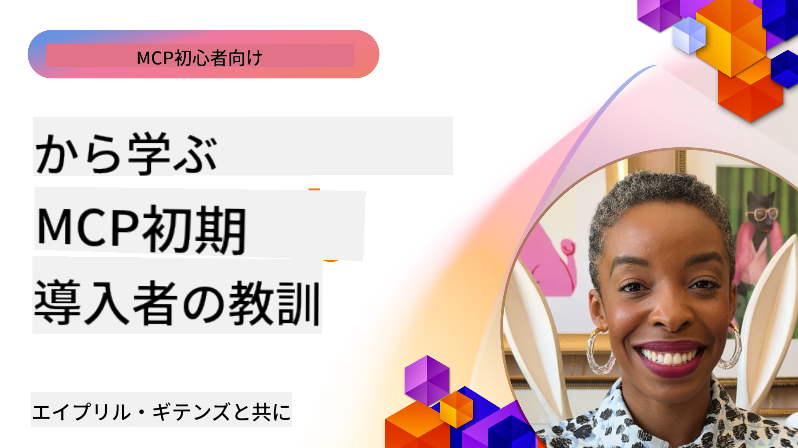

<!--
CO_OP_TRANSLATOR_METADATA:
{
  "original_hash": "41f16dac486d2086a53bc644a01cbe42",
  "translation_date": "2025-08-18T11:06:36+00:00",
  "source_file": "07-LessonsfromEarlyAdoption/README.md",
  "language_code": "ja"
}
-->
# 🌟 早期導入者から学ぶ教訓

[](https://youtu.be/jds7dSmNptE)

_(上の画像をクリックして、このレッスンの動画をご覧ください)_

## 🎯 このモジュールで学べること

このモジュールでは、実際の組織や開発者がModel Context Protocol (MCP)を活用して課題を解決し、イノベーションを推進している方法を探ります。詳細なケーススタディや実践的なプロジェクトを通じて、MCPが言語モデル、ツール、企業データを安全かつスケーラブルに統合する方法を学びます。

### 📚 MCPの実践例を見る

これらの原則が実際のツールにどのように適用されているかを知りたいですか？[**開発者の生産性を変革する10のMicrosoft MCPサーバー**](microsoft-mcp-servers.md)をご覧ください。今日から使える実際のMicrosoft MCPサーバーを紹介しています。

## 概要

このレッスンでは、早期導入者がModel Context Protocol (MCP)を活用して現実の課題を解決し、業界全体でイノベーションを推進している方法を探ります。詳細なケーススタディや実践的なプロジェクトを通じて、MCPが標準化された、安全でスケーラブルなAI統合を可能にする方法を学びます。これにより、大規模な言語モデル、ツール、企業データを統一されたフレームワークで接続できます。MCPベースのソリューションを設計・構築する実践的な経験を得るとともに、実証済みの実装パターンから学び、MCPを本番環境に展開するためのベストプラクティスを発見します。また、最新のトレンド、将来の方向性、オープンソースリソースについても取り上げ、MCP技術とその進化するエコシステムの最前線に立つための情報を提供します。

## 学習目標

- 異なる業界での実際のMCP実装を分析する
- 完全なMCPベースのアプリケーションを設計・構築する
- MCP技術の最新トレンドと将来の方向性を探る
- 実際の開発シナリオでベストプラクティスを適用する

## 実際のMCP実装

### ケーススタディ1: 企業のカスタマーサポート自動化

ある多国籍企業が、カスタマーサポートシステム全体でAIのやり取りを標準化するMCPベースのソリューションを導入しました。これにより以下が可能になりました：

- 複数のLLMプロバイダーに対する統一インターフェースの作成
- 部門間で一貫したプロンプト管理の維持
- 強力なセキュリティとコンプライアンス管理の実装
- 特定のニーズに応じたAIモデルの簡単な切り替え

**技術的実装:**

```python
# Python MCP server implementation for customer support
import logging
import asyncio
from modelcontextprotocol import create_server, ServerConfig
from modelcontextprotocol.server import MCPServer
from modelcontextprotocol.transports import create_http_transport
from modelcontextprotocol.resources import ResourceDefinition
from modelcontextprotocol.prompts import PromptDefinition
from modelcontextprotocol.tool import ToolDefinition

# Configure logging
logging.basicConfig(level=logging.INFO)

async def main():
    # Create server configuration
    config = ServerConfig(
        name="Enterprise Customer Support Server",
        version="1.0.0",
        description="MCP server for handling customer support inquiries"
    )
    
    # Initialize MCP server
    server = create_server(config)
    
    # Register knowledge base resources
    server.resources.register(
        ResourceDefinition(
            name="customer_kb",
            description="Customer knowledge base documentation"
        ),
        lambda params: get_customer_documentation(params)
    )
    
    # Register prompt templates
    server.prompts.register(
        PromptDefinition(
            name="support_template",
            description="Templates for customer support responses"
        ),
        lambda params: get_support_templates(params)
    )
    
    # Register support tools
    server.tools.register(
        ToolDefinition(
            name="ticketing",
            description="Create and update support tickets"
        ),
        handle_ticketing_operations
    )
    
    # Start server with HTTP transport
    transport = create_http_transport(port=8080)
    await server.run(transport)

if __name__ == "__main__":
    asyncio.run(main())
```

**結果:** モデルコストの30%削減、応答の一貫性の45%向上、グローバルな運用でのコンプライアンス強化。

### ケーススタディ2: 医療診断アシスタント

ある医療提供者が、複数の専門医療AIモデルを統合し、患者データの保護を確保するMCPインフラを開発しました：

- 一般医療モデルと専門医療モデル間のシームレスな切り替え
- 厳格なプライバシー管理と監査記録
- 既存の電子カルテ(EHR)システムとの統合
- 医療用語に対応した一貫したプロンプトエンジニアリング

**技術的実装:**

```csharp
// C# MCP host application implementation in healthcare application
using Microsoft.Extensions.DependencyInjection;
using ModelContextProtocol.SDK.Client;
using ModelContextProtocol.SDK.Security;
using ModelContextProtocol.SDK.Resources;

public class DiagnosticAssistant
{
    private readonly MCPHostClient _mcpClient;
    private readonly PatientContext _patientContext;
    
    public DiagnosticAssistant(PatientContext patientContext)
    {
        _patientContext = patientContext;
        
        // Configure MCP client with healthcare-specific settings
        var clientOptions = new ClientOptions
        {
            Name = "Healthcare Diagnostic Assistant",
            Version = "1.0.0",
            Security = new SecurityOptions
            {
                Encryption = EncryptionLevel.Medical,
                AuditEnabled = true
            }
        };
        
        _mcpClient = new MCPHostClientBuilder()
            .WithOptions(clientOptions)
            .WithTransport(new HttpTransport("https://healthcare-mcp.example.org"))
            .WithAuthentication(new HIPAACompliantAuthProvider())
            .Build();
    }
    
    public async Task<DiagnosticSuggestion> GetDiagnosticAssistance(
        string symptoms, string patientHistory)
    {
        // Create request with appropriate resources and tool access
        var resourceRequest = new ResourceRequest
        {
            Name = "patient_records",
            Parameters = new Dictionary<string, object>
            {
                ["patientId"] = _patientContext.PatientId,
                ["requestingProvider"] = _patientContext.ProviderId
            }
        };
        
        // Request diagnostic assistance using appropriate prompt
        var response = await _mcpClient.SendPromptRequestAsync(
            promptName: "diagnostic_assistance",
            parameters: new Dictionary<string, object>
            {
                ["symptoms"] = symptoms,
                patientHistory = patientHistory,
                relevantGuidelines = _patientContext.GetRelevantGuidelines()
            });
            
        return DiagnosticSuggestion.FromMCPResponse(response);
    }
}
```

**結果:** 医師向けの診断提案が改善され、HIPAAコンプライアンスを完全に維持しながら、システム間のコンテキスト切り替えが大幅に削減。

### ケーススタディ3: 金融サービスのリスク分析

ある金融機関が、異なる部門間でリスク分析プロセスを標準化するためにMCPを導入しました：

- 信用リスク、詐欺検出、投資リスクモデルの統一インターフェースを作成
- 厳格なアクセス制御とモデルバージョン管理を実施
- すべてのAI推奨事項の監査可能性を確保
- 多様なシステム間で一貫したデータフォーマットを維持

**技術的実装:**

```java
// Java MCP server for financial risk assessment
import org.mcp.server.*;
import org.mcp.security.*;

public class FinancialRiskMCPServer {
    public static void main(String[] args) {
        // Create MCP server with financial compliance features
        MCPServer server = new MCPServerBuilder()
            .withModelProviders(
                new ModelProvider("risk-assessment-primary", new AzureOpenAIProvider()),
                new ModelProvider("risk-assessment-audit", new LocalLlamaProvider())
            )
            .withPromptTemplateDirectory("./compliance/templates")
            .withAccessControls(new SOCCompliantAccessControl())
            .withDataEncryption(EncryptionStandard.FINANCIAL_GRADE)
            .withVersionControl(true)
            .withAuditLogging(new DatabaseAuditLogger())
            .build();
            
        server.addRequestValidator(new FinancialDataValidator());
        server.addResponseFilter(new PII_RedactionFilter());
        
        server.start(9000);
        
        System.out.println("Financial Risk MCP Server running on port 9000");
    }
}
```

**結果:** 規制コンプライアンスの向上、モデル展開サイクルの40%短縮、部門間でのリスク評価の一貫性向上。

### ケーススタディ4: Microsoft Playwright MCPサーバーによるブラウザ自動化

Microsoftは、Model Context Protocolを通じて安全で標準化されたブラウザ自動化を可能にする[Playwright MCPサーバー](https://github.com/microsoft/playwright-mcp)を開発しました。この本番対応サーバーは、AIエージェントやLLMがウェブブラウザと制御された形でやり取りできるようにし、自動ウェブテスト、データ抽出、エンドツーエンドのワークフローなどのユースケースを実現します。

> **🎯 本番対応ツール**
> 
> このケーススタディでは、今日使用可能な実際のMCPサーバーを紹介しています！Playwright MCPサーバーやその他のMicrosoft MCPサーバーについては、[**Microsoft MCPサーバーガイド**](microsoft-mcp-servers.md#8--playwright-mcp-server)をご覧ください。

**主な特徴:**
- MCPツールとしてブラウザ自動化機能（ナビゲーション、フォーム入力、スクリーンショット取得など）を提供
- 不正な操作を防ぐための厳格なアクセス制御とサンドボックス化を実装
- すべてのブラウザ操作の詳細な監査ログを提供
- Azure OpenAIやその他のLLMプロバイダーとの統合をサポート
- GitHub CopilotのCoding Agentにウェブブラウジング機能を提供

**技術的実装:**

```typescript
// TypeScript: Registering Playwright browser automation tools in an MCP server
import { createServer, ToolDefinition } from 'modelcontextprotocol';
import { launch } from 'playwright';

const server = createServer({
  name: 'Playwright MCP Server',
  version: '1.0.0',
  description: 'MCP server for browser automation using Playwright'
});

// Register a tool for navigating to a URL and capturing a screenshot
server.tools.register(
  new ToolDefinition({
    name: 'navigate_and_screenshot',
    description: 'Navigate to a URL and capture a screenshot',
    parameters: {
      url: { type: 'string', description: 'The URL to visit' }
    }
  }),
  async ({ url }) => {
    const browser = await launch();
    const page = await browser.newPage();
    await page.goto(url);
    const screenshot = await page.screenshot();
    await browser.close();
    return { screenshot };
  }
);

// Start the MCP server
server.listen(8080);
```

**結果:**

- AIエージェントやLLM向けの安全なプログラム可能なブラウザ自動化を実現
- 手動テストの労力を削減し、ウェブアプリケーションのテスト範囲を拡大
- 企業環境でのブラウザベースのツール統合のための再利用可能で拡張可能なフレームワークを提供
- GitHub Copilotのウェブブラウジング機能を強化

**参考資料:**

- [Playwright MCPサーバーGitHubリポジトリ](https://github.com/microsoft/playwright-mcp)
- [Microsoft AIと自動化ソリューション](https://azure.microsoft.com/en-us/products/ai-services/)

### ケーススタディ5: Azure MCP – エンタープライズグレードのModel Context Protocol as a Service

Azure MCP Server ([https://aka.ms/azmcp](https://aka.ms/azmcp))は、Microsoftが提供するエンタープライズグレードのModel Context Protocolのマネージド実装であり、クラウドサービスとしてスケーラブルで安全かつコンプライアンス対応のMCPサーバー機能を提供します。Azure MCPは、Azure AI、データ、セキュリティサービスと統合することで、運用負担を軽減し、AI導入を加速します。

> **🎯 本番対応ツール**
> 
> これは今日使用可能な実際のMCPサーバーです！Azure AI Foundry MCPサーバーについては、[**Microsoft MCPサーバーガイド**](microsoft-mcp-servers.md)をご覧ください。

- スケーリング、監視、セキュリティが組み込まれた完全マネージドMCPサーバーホスティング
- Azure OpenAI、Azure AI Search、その他のAzureサービスとのネイティブ統合
- Microsoft Entra IDによるエンタープライズ認証と認可
- カスタムツール、プロンプトテンプレート、リソースコネクタのサポート
- 企業のセキュリティおよび規制要件への準拠

**技術的実装:**

```yaml
# Example: Azure MCP server deployment configuration (YAML)
apiVersion: mcp.microsoft.com/v1
kind: McpServer
metadata:
  name: enterprise-mcp-server
spec:
  modelProviders:
    - name: azure-openai
      type: AzureOpenAI
      endpoint: https://<your-openai-resource>.openai.azure.com/
      apiKeySecret: <your-azure-keyvault-secret>
  tools:
    - name: document_search
      type: AzureAISearch
      endpoint: https://<your-search-resource>.search.windows.net/
      apiKeySecret: <your-azure-keyvault-secret>
  authentication:
    type: EntraID
    tenantId: <your-tenant-id>
  monitoring:
    enabled: true
    logAnalyticsWorkspace: <your-log-analytics-id>
```

**結果:**  
- エンタープライズAIプロジェクトの価値実現までの時間を短縮し、準備済みのコンプライアンス対応MCPサーバープラットフォームを提供
- LLM、ツール、企業データソースの統合を簡素化
- MCPワークロードのセキュリティ、可観測性、運用効率を向上
- Azure SDKのベストプラクティスと最新の認証パターンを活用してコード品質を改善

**参考資料:**  
- [Azure MCPドキュメント](https://aka.ms/azmcp)
- [Azure MCPサーバーGitHubリポジトリ](https://github.com/Azure/azure-mcp)
- [Azure AIサービス](https://azure.microsoft.com/en-us/products/ai-services/)
- [Microsoft MCPセンター](https://mcp.azure.com)

### ケーススタディ6: NLWeb

MCP (Model Context Protocol)は、チャットボットやAIアシスタントがツールとやり取りするための新しいプロトコルです。すべてのNLWebインスタンスはMCPサーバーでもあり、自然言語でウェブサイトに質問するためのコアメソッド「ask」をサポートしています。返される応答は、ウェブデータを記述するために広く使用されている語彙であるschema.orgを活用しています。簡単に言えば、MCPはNLWebがHttpに対するHTMLのようなものです。NLWebはプロトコル、Schema.org形式、サンプルコードを組み合わせて、サイトがこれらのエンドポイントを迅速に作成できるようにし、人間には会話型インターフェースを、機械には自然なエージェント間のやり取りを提供します。

NLWebには2つの主要なコンポーネントがあります。
- サイトと自然言語でやり取りするための非常にシンプルなプロトコルと、返される回答にjsonとschema.orgを活用する形式。REST APIのドキュメントで詳細をご覧ください。
- (1)の簡単な実装で、アイテムのリスト（製品、レシピ、観光名所、レビューなど）として抽象化できるサイトを活用します。これにより、ユーザーインターフェースウィジェットと組み合わせて、サイトがコンテンツに対する会話型インターフェースを簡単に提供できるようになります。「チャットクエリのライフサイクル」のドキュメントでこれがどのように機能するかの詳細をご覧ください。

**参考資料:**  
- [Azure MCPドキュメント](https://aka.ms/azmcp)  
- [NLWeb](https://github.com/microsoft/NlWeb)

### ケーススタディ7: Azure AI Foundry MCPサーバー – エンタープライズAIエージェント統合

Azure AI Foundry MCPサーバーは、MCPを使用してエンタープライズ環境でAIエージェントとワークフローを編成および管理する方法を示しています。MCPをAzure AI Foundryと統合することで、組織はエージェントのやり取りを標準化し、Foundryのワークフロー管理を活用し、安全でスケーラブルな展開を実現できます。

> **🎯 本番対応ツール**
> 
> これは今日使用可能な実際のMCPサーバーです！Azure AI Foundry MCPサーバーについては、[**Microsoft MCPサーバーガイド**](microsoft-mcp-servers.md#9--azure-ai-foundry-mcp-server)をご覧ください。

**主な特徴:**
- AzureのAIエコシステムへの包括的なアクセス（モデルカタログや展開管理を含む）
- RAGアプリケーション向けのAzure AI Searchによる知識インデックス化
- AIモデルの性能と品質保証の評価ツール
- Azure AI Foundry CatalogとLabsとの統合による最先端研究モデルの活用
- 本番シナリオ向けのエージェント管理と評価機能

**結果:**
- AIエージェントワークフローの迅速なプロトタイピングと堅牢な監視
- 高度なシナリオ向けのAzure AIサービスとのシームレスな統合
- エージェントパイプラインの構築、展開、監視のための統一インターフェース
- 企業向けのセキュリティ、コンプライアンス、運用効率の向上
- 複雑なエージェント駆動プロセスを管理しながらAI導入を加速

**参考資料:**
- [Azure AI Foundry MCPサーバーGitHubリポジトリ](https://github.com/azure-ai-foundry/mcp-foundry)
- [Azure AIエージェントとMCPの統合 (Microsoft Foundry Blog)](https://devblogs.microsoft.com/foundry/integrating-azure-ai-agents-mcp/)

### ケーススタディ8: Foundry MCP Playground – 実験とプロトタイピング

Foundry MCP Playgroundは、MCPサーバーとAzure AI Foundryの統合を実験するための準備済み環境を提供します。開発者は、Azure AI Foundry CatalogやLabsのリソースを使用して、AIモデルやエージェントワークフローを迅速にプロトタイプ化、テスト、評価できます。このプレイグラウンドはセットアップを簡素化し、サンプルプロジェクトを提供し、共同開発をサポートするため、複雑なインフラを必要とせずにベストプラクティスや新しいシナリオを探求することができます。アイデアの検証、実験の共有、学習の加速を目指すチームにとって特に有用です。障壁を低くすることで、MCPとAzure AI Foundryエコシステムにおけるイノベーションとコミュニティ貢献を促進します。

**参考資料:**

- [Foundry MCP Playground GitHubリポジトリ](https://github.com/azure-ai-foundry/foundry-mcp-playground)

### ケーススタディ9: Microsoft Learn Docs MCPサーバー – AI対応のドキュメントアクセス

Microsoft Learn Docs MCPサーバーは、Model Context Protocolを通じてAIアシスタントに公式Microsoftドキュメントへのリアルタイムアクセスを提供するクラウドホスト型サービスです。この本番対応サーバーは包括的なMicrosoft Learnエコシステムに接続し、すべての公式Microsoftソースを対象としたセマンティック検索を可能にします。
> **🎯 実用的なツール**  
>  
> これは今日から使える本物のMCPサーバーです！Microsoft Learn Docs MCPサーバーについては、[**Microsoft MCPサーバーガイド**](microsoft-mcp-servers.md#1--microsoft-learn-docs-mcp-server)で詳しく学んでください。
**主な特徴:**
- Microsoft公式ドキュメント、Azureドキュメント、Microsoft 365ドキュメントへのリアルタイムアクセス
- 文脈や意図を理解する高度なセマンティック検索機能
- Microsoft Learnのコンテンツが公開されるたびに常に最新情報を提供
- Microsoft Learn、Azureドキュメント、Microsoft 365ソースにわたる包括的なカバレッジ
- 記事タイトルとURL付きで最大10個の高品質なコンテンツチャンクを返却

**重要性:**
- Microsoftテクノロジーにおける「AIの知識が古い」という問題を解決
- 最新の.NET、C#、Azure、Microsoft 365機能へのアクセスをAIアシスタントに提供
- 正確なコード生成のための信頼できる一次情報を提供
- 急速に進化するMicrosoftテクノロジーを扱う開発者にとって不可欠

**成果:**
- Microsoftテクノロジーに関するAI生成コードの精度が飛躍的に向上
- 最新のドキュメントやベストプラクティスを探す時間を短縮
- 文脈に応じたドキュメント取得により開発者の生産性を向上
- IDEを離れることなく開発ワークフローにシームレスに統合

**参考資料:**
- [Microsoft Learn Docs MCP Server GitHub Repository](https://github.com/MicrosoftDocs/mcp)
- [Microsoft Learn Documentation](https://learn.microsoft.com/)

## ハンズオンプロジェクト

### プロジェクト1: マルチプロバイダーMCPサーバーの構築

**目的:** 特定の条件に基づいて複数のAIモデルプロバイダーにリクエストをルーティングできるMCPサーバーを作成する。

**要件:**

- 少なくとも3つの異なるモデルプロバイダーをサポート（例: OpenAI、Anthropic、ローカルモデル）
- リクエストメタデータに基づくルーティングメカニズムを実装
- プロバイダーの認証情報を管理する設定システムを作成
- パフォーマンスとコストを最適化するためのキャッシングを追加
- 使用状況を監視するためのシンプルなダッシュボードを構築

**実装手順:**

1. 基本的なMCPサーバーインフラをセットアップ
2. 各AIモデルサービスのプロバイダーアダプターを実装
3. リクエスト属性に基づくルーティングロジックを作成
4. 頻繁なリクエストのためのキャッシングメカニズムを追加
5. 監視ダッシュボードを開発
6. 様々なリクエストパターンでテスト

**使用技術:** Python (.NET/Java/Pythonのいずれか)、Redis（キャッシング用）、シンプルなWebフレームワーク（ダッシュボード用）

### プロジェクト2: エンタープライズプロンプト管理システム

**目的:** 組織全体でプロンプトテンプレートを管理、バージョン管理、展開するためのMCPベースのシステムを開発する。

**要件:**

- プロンプトテンプレートの集中リポジトリを作成
- バージョン管理と承認ワークフローを実装
- サンプル入力を使用したテンプレートテスト機能を構築
- ロールベースのアクセス制御を開発
- テンプレート取得と展開のためのAPIを作成

**実装手順:**

1. テンプレートストレージ用のデータベーススキーマを設計
2. テンプレートのCRUD操作用のコアAPIを作成
3. バージョン管理システムを実装
4. 承認ワークフローを構築
5. テストフレームワークを開発
6. 管理用のシンプルなWebインターフェースを作成
7. MCPサーバーと統合

**使用技術:** 好みのバックエンドフレームワーク、SQLまたはNoSQLデータベース、管理インターフェース用のフロントエンドフレームワーク

### プロジェクト3: MCPベースのコンテンツ生成プラットフォーム

**目的:** MCPを活用して、さまざまなコンテンツタイプで一貫した結果を提供するコンテンツ生成プラットフォームを構築する。

**要件:**

- 複数のコンテンツ形式をサポート（ブログ投稿、ソーシャルメディア、マーケティングコピー）
- カスタマイズオプション付きのテンプレートベースの生成を実装
- コンテンツレビューとフィードバックシステムを作成
- コンテンツのパフォーマンス指標を追跡
- コンテンツのバージョン管理と反復をサポート

**実装手順:**

1. MCPクライアントインフラをセットアップ
2. 各コンテンツタイプのテンプレートを作成
3. コンテンツ生成パイプラインを構築
4. レビューシステムを実装
5. 指標追跡システムを開発
6. テンプレート管理とコンテンツ生成用のユーザーインターフェースを作成

**使用技術:** 好みのプログラミング言語、Webフレームワーク、データベースシステム

## MCP技術の将来の方向性

### 新たなトレンド

1. **マルチモーダルMCP**
   - 画像、音声、動画モデルとのインタラクションを標準化するMCPの拡張
   - クロスモーダル推論能力の開発
   - 異なるモダリティに対応した標準化プロンプト形式

2. **フェデレーテッドMCPインフラ**
   - 組織間でリソースを共有できる分散型MCPネットワーク
   - 安全なモデル共有のための標準化プロトコル
   - プライバシー保護計算技術

3. **MCPマーケットプレイス**
   - MCPテンプレートやプラグインを共有・収益化するエコシステム
   - 品質保証と認証プロセス
   - モデルマーケットプレイスとの統合

4. **エッジコンピューティング向けMCP**
   - リソース制約のあるエッジデバイス向けのMCP標準の適応
   - 低帯域幅環境向けの最適化プロトコル
   - IoTエコシステム向けの特化型MCP実装

5. **規制フレームワーク**
   - 規制遵守のためのMCP拡張の開発
   - 標準化された監査トレイルと説明可能性インターフェース
   - 新興AIガバナンスフレームワークとの統合

### MicrosoftによるMCPソリューション

MicrosoftとAzureは、さまざまなシナリオでMCPを実装するためのオープンソースリポジトリをいくつか開発しています:

#### Microsoft組織

1. [playwright-mcp](https://github.com/microsoft/playwright-mcp) - ブラウザ自動化とテストのためのPlaywright MCPサーバー
2. [files-mcp-server](https://github.com/microsoft/files-mcp-server) - ローカルテストとコミュニティ貢献のためのOneDrive MCPサーバー実装
3. [NLWeb](https://github.com/microsoft/NlWeb) - AI Webの基盤を確立するためのオープンプロトコルと関連ツールのコレクション

#### Azure-Samples組織

1. [mcp](https://github.com/Azure-Samples/mcp) - Azure上でMCPサーバーを構築・統合するためのサンプル、ツール、リソースへのリンク
2. [mcp-auth-servers](https://github.com/Azure-Samples/mcp-auth-servers) - 現行のModel Context Protocol仕様に基づく認証を示すリファレンスMCPサーバー
3. [remote-mcp-functions](https://github.com/Azure-Samples/remote-mcp-functions) - Azure FunctionsでのリモートMCPサーバー実装のランディングページ
4. [remote-mcp-functions-python](https://github.com/Azure-Samples/remote-mcp-functions-python) - Azure Functionsを使用してPythonでカスタムリモートMCPサーバーを構築・展開するためのクイックスタートテンプレート
5. [remote-mcp-functions-dotnet](https://github.com/Azure-Samples/remote-mcp-functions-dotnet) - Azure Functionsを使用して.NET/C#でカスタムリモートMCPサーバーを構築・展開するためのクイックスタートテンプレート
6. [remote-mcp-functions-typescript](https://github.com/Azure-Samples/remote-mcp-functions-typescript) - Azure Functionsを使用してTypeScriptでカスタムリモートMCPサーバーを構築・展開するためのクイックスタートテンプレート
7. [remote-mcp-apim-functions-python](https://github.com/Azure-Samples/remote-mcp-apim-functions-python) - Azure API ManagementをAIゲートウェイとして使用し、PythonでリモートMCPサーバーを統合
8. [AI-Gateway](https://github.com/Azure-Samples/AI-Gateway) - Azure OpenAIやAI Foundryとの統合を含むAPIM ❤️ AI実験

これらのリポジトリは、さまざまなプログラミング言語やAzureサービスを使用したModel Context Protocolの実装、テンプレート、リソースを提供します。基本的なサーバー実装から認証、クラウド展開、エンタープライズ統合シナリオまで、幅広いユースケースをカバーしています。

#### MCPリソースディレクトリ

公式のMicrosoft MCPリポジトリ内の[MCPリソースディレクトリ](https://github.com/microsoft/mcp/tree/main/Resources)では、Model Context Protocolサーバーで使用できるサンプルリソース、プロンプトテンプレート、ツール定義のキュレーションされたコレクションを提供しています。このディレクトリは、再利用可能なビルディングブロックやベストプラクティスの例を提供することで、MCPの迅速な導入を支援します。

- **プロンプトテンプレート:** 一般的なAIタスクやシナリオ向けのすぐに使えるプロンプトテンプレートで、自身のMCPサーバー実装に適応可能
- **ツール定義:** 異なるMCPサーバー間でツール統合と呼び出しを標準化するためのツールスキーマとメタデータの例
- **リソースサンプル:** MCPフレームワーク内でデータソース、API、外部サービスに接続するためのリソース定義の例
- **リファレンス実装:** 実際のMCPプロジェクトでリソース、プロンプト、ツールを構造化および整理する方法を示す実践的なサンプル

これらのリソースは、開発を加速し、標準化を促進し、MCPベースのソリューションを構築・展開する際のベストプラクティスを確保します。

#### MCPリソースディレクトリ

- [MCPリソース (サンプルプロンプト、ツール、リソース定義)](https://github.com/microsoft/mcp/tree/main/Resources)

### 研究機会

- MCPフレームワーク内での効率的なプロンプト最適化技術
- マルチテナントMCP展開のためのセキュリティモデル
- 異なるMCP実装間のパフォーマンスベンチマーク
- MCPサーバーの形式的検証手法

## 結論

Model Context Protocol (MCP)は、業界全体で標準化され、安全で相互運用可能なAI統合の未来を急速に形作っています。このレッスンで紹介したケーススタディやハンズオンプロジェクトを通じて、MicrosoftやAzureを含む早期採用者が、MCPを活用して現実世界の課題を解決し、AIの採用を加速し、コンプライアンス、セキュリティ、スケーラビリティを確保している様子を学びました。MCPのモジュラーアプローチにより、組織は大規模言語モデル、ツール、エンタープライズデータを統一された監査可能なフレームワークで接続できます。MCPが進化を続ける中、コミュニティとの関わりを持ち、オープンソースリソースを探索し、ベストプラクティスを適用することが、堅牢で将来に備えたAIソリューションを構築する鍵となります。

## 追加リソース

- [MCP Foundry GitHub Repository](https://github.com/azure-ai-foundry/mcp-foundry)
- [Foundry MCP Playground](https://github.com/azure-ai-foundry/foundry-mcp-playground)
- [Integrating Azure AI Agents with MCP (Microsoft Foundry Blog)](https://devblogs.microsoft.com/foundry/integrating-azure-ai-agents-mcp/)
- [MCP GitHub Repository (Microsoft)](https://github.com/microsoft/mcp)
- [MCP Resources Directory (Sample Prompts, Tools, and Resource Definitions)](https://github.com/microsoft/mcp/tree/main/Resources)
- [MCP Community & Documentation](https://modelcontextprotocol.io/introduction)
- [Azure MCP Documentation](https://aka.ms/azmcp)
- [Playwright MCP Server GitHub Repository](https://github.com/microsoft/playwright-mcp)
- [Files MCP Server (OneDrive)](https://github.com/microsoft/files-mcp-server)
- [Azure-Samples MCP](https://github.com/Azure-Samples/mcp)
- [MCP Auth Servers (Azure-Samples)](https://github.com/Azure-Samples/mcp-auth-servers)
- [Remote MCP Functions (Azure-Samples)](https://github.com/Azure-Samples/remote-mcp-functions)
- [Remote MCP Functions Python (Azure-Samples)](https://github.com/Azure-Samples/remote-mcp-functions-python)
- [Remote MCP Functions .NET (Azure-Samples)](https://github.com/Azure-Samples/remote-mcp-functions-dotnet)
- [Remote MCP Functions TypeScript (Azure-Samples)](https://github.com/Azure-Samples/remote-mcp-functions-typescript)
- [Remote MCP APIM Functions Python (Azure-Samples)](https://github.com/Azure-Samples/remote-mcp-apim-functions-python)
- [AI-Gateway (Azure-Samples)](https://github.com/Azure-Samples/AI-Gateway)
- [Microsoft AI and Automation Solutions](https://azure.microsoft.com/en-us/products/ai-services/)

## 演習

1. ケーススタディの1つを分析し、代替の実装アプローチを提案してください。
2. プロジェクトアイデアの1つを選び、詳細な技術仕様を作成してください。
3. ケーススタディで取り上げられていない業界を調査し、MCPがその特定の課題にどのように対処できるかを概説してください。
4. 将来の方向性の1つを探求し、それをサポートする新しいMCP拡張のコンセプトを作成してください。

次: [Microsoft MCP Server](../07-LessonsfromEarlyAdoption/microsoft-mcp-servers.md)

**免責事項**:  
この文書は、AI翻訳サービス [Co-op Translator](https://github.com/Azure/co-op-translator) を使用して翻訳されています。正確性を追求しておりますが、自動翻訳には誤りや不正確な部分が含まれる可能性があります。元の言語で記載された原文が正式な情報源と見なされるべきです。重要な情報については、専門の人間による翻訳を推奨します。本翻訳の利用に起因する誤解や誤訳について、当社は一切の責任を負いません。