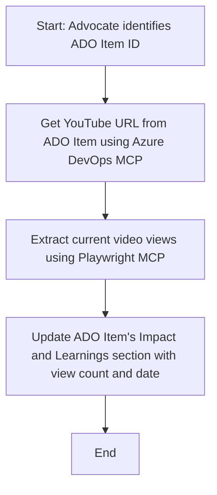

<!--
CO_OP_TRANSLATOR_METADATA:
{
  "original_hash": "14a2dfbea55ef735660a06bd6bdfe5f3",
  "translation_date": "2025-07-14T06:10:07+00:00",
  "source_file": "09-CaseStudy/UpdateADOItemsFromYT.md",
  "language_code": "ja"
}
-->
# ケーススタディ：MCPを使ってYouTubeデータからAzure DevOpsアイテムを更新する

> **免責事項:** YouTubeなどのプラットフォームからのデータを使ってAzure DevOpsアイテムを自動更新する既存のオンラインツールやレポートはすでに存在します。以下のシナリオは、MCPツールを自動化や統合タスクに活用する一例として提供しています。

## 概要

このケーススタディでは、Model Context Protocol（MCP）とそのツールを使って、YouTubeのようなオンラインプラットフォームから取得した情報でAzure DevOps（ADO）の作業アイテムを自動更新する方法の一例を示します。ここで紹介するシナリオは、これらのツールの幅広い機能の一例であり、類似の自動化ニーズに応じて応用可能です。

この例では、AdvocateがADOアイテムを使ってオンラインセッションを管理しており、各アイテムにはYouTube動画のURLが含まれています。MCPツールを活用することで、Advocateは動画の再生回数など最新の指標を繰り返しかつ自動的にADOアイテムに反映させることができます。この手法は、オンライン情報をADOや他のシステムに統合する必要がある他のケースにも応用可能です。

## シナリオ

Advocateはオンラインセッションやコミュニティ活動の影響を追跡する役割を担っています。各セッションは「DevRel」プロジェクトのADO作業アイテムとして記録され、その作業アイテムにはYouTube動画のURLを格納するフィールドがあります。セッションのリーチを正確に報告するために、Advocateは動画の現在の再生回数とその情報を取得した日付をADOアイテムに更新する必要があります。

## 使用ツール

- [Azure DevOps MCP](https://github.com/microsoft/azure-devops-mcp): MCPを通じてADO作業アイテムへのプログラム的アクセスと更新を可能にします。
- [Playwright MCP](https://github.com/microsoft/playwright-mcp): ブラウザ操作を自動化し、YouTube動画の統計情報などウェブページからライブデータを抽出します。

## ステップバイステップのワークフロー

1. **ADOアイテムの特定**: 「DevRel」プロジェクト内のADO作業アイテムID（例：1234）を指定します。
2. **YouTube URLの取得**: Azure DevOps MCPツールを使って作業アイテムからYouTubeのURLを取得します。
3. **動画再生回数の抽出**: Playwright MCPツールでYouTube URLにアクセスし、現在の再生回数を取得します。
4. **ADOアイテムの更新**: Azure DevOps MCPツールを使い、「Impact and Learnings」セクションに最新の再生回数と取得日を記録します。

## 例のプロンプト

```bash
- Work with the ADO Item ID: 1234
- The project is '2025-Awesome'
- Get the YouTube URL for the ADO item
- Use Playwright to get the current views from the YouTube video
- Update the ADO item with the current video views and the updated date of the information
```

## Mermaidフローチャート



## 技術的実装

- **MCPオーケストレーション**: MCPサーバーがワークフローを管理し、Azure DevOps MCPとPlaywright MCPの両ツールの連携を調整します。
- **自動化**: 手動での起動も可能ですが、定期的に実行するスケジュール設定もでき、ADOアイテムを常に最新に保てます。
- **拡張性**: 同様のパターンで、他のオンライン指標（例：いいね数、コメント数）や他プラットフォームのデータを使ったADOアイテムの更新にも対応可能です。

## 結果と効果

- **効率化**: Advocateの手作業を減らし、動画指標の取得と更新を自動化します。
- **正確性**: ADOアイテムがオンラインソースの最新データを反映することを保証します。
- **再現性**: 他のデータソースや指標を扱う類似シナリオでも使い回せるワークフローを提供します。

## 参考資料

- [Azure DevOps MCP](https://github.com/microsoft/azure-devops-mcp)
- [Playwright MCP](https://github.com/microsoft/playwright-mcp)
- [Model Context Protocol (MCP)](https://modelcontextprotocol.io/)

**免責事項**：  
本書類はAI翻訳サービス「[Co-op Translator](https://github.com/Azure/co-op-translator)」を使用して翻訳されました。正確性を期しておりますが、自動翻訳には誤りや不正確な部分が含まれる可能性があります。原文の言語による文書が正式な情報源とみなされるべきです。重要な情報については、専門の人間による翻訳を推奨します。本翻訳の利用により生じた誤解や誤訳について、当方は一切の責任を負いかねます。