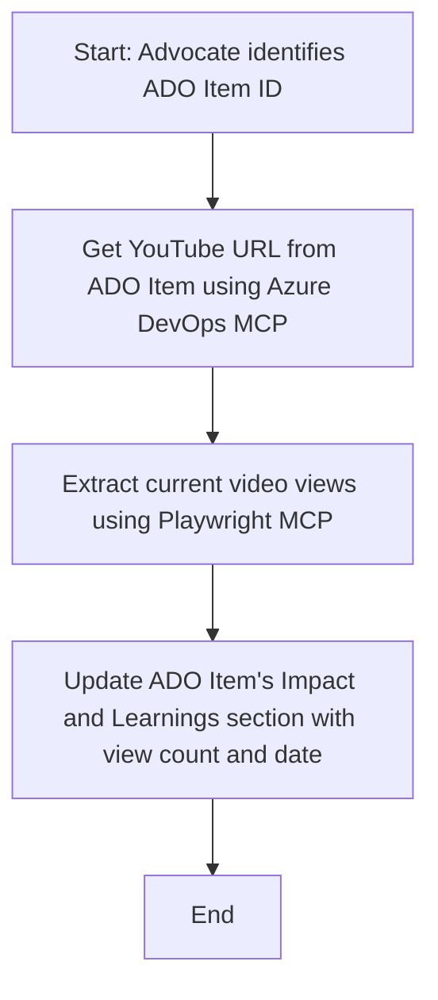

<!--
CO_OP_TRANSLATOR_METADATA:
{
  "original_hash": "14a2dfbea55ef735660a06bd6bdfe5f3",
  "translation_date": "2025-06-13T21:32:34+00:00",
  "source_file": "09-CaseStudy/UpdateADOItemsFromYT.md",
  "language_code": "ja"
}
-->
# ケーススタディ：MCPを使ったYouTubeデータからのAzure DevOpsアイテム更新

> **免責事項：** YouTubeなどのプラットフォームからのデータでAzure DevOpsアイテムを自動更新する既存のオンラインツールやレポートがあります。以下のシナリオは、MCPツールを活用した自動化・統合の一例として示すサンプルケースです。

## 概要

このケーススタディでは、Model Context Protocol（MCP）とそのツールを使って、YouTubeなどのオンラインプラットフォームから取得した情報でAzure DevOps（ADO）の作業アイテムを自動的に更新する方法の一例を紹介します。ここで示すシナリオは、これらのツールの幅広い機能の一例であり、類似した自動化ニーズに応用可能です。

例として、AdvocateはADOアイテムでオンラインセッションを管理しており、各アイテムにはYouTubeの動画URLが含まれています。MCPツールを活用することで、Advocateは最新の動画視聴数などの指標を繰り返しかつ自動的にADOアイテムに反映できます。この手法は、オンライン情報をADOや他のシステムに統合する他のケースにも応用可能です。

## シナリオ

Advocateはオンラインセッションやコミュニティ活動の影響を追跡しています。各セッションは'​DevRel'プロジェクトのADO作業アイテムとして記録され、その作業アイテムにはYouTube動画のURLフィールドがあります。セッションのリーチを正確に報告するために、Advocateは最新の動画視聴数とその取得日時をADOアイテムに更新する必要があります。

## 使用ツール

- [Azure DevOps MCP](https://github.com/microsoft/azure-devops-mcp)：MCP経由でADO作業アイテムにプログラムからアクセス・更新を可能にするツール。
- [Playwright MCP](https://github.com/microsoft/playwright-mcp)：ブラウザ操作を自動化し、YouTube動画の統計情報などライブデータを抽出するツール。

## ステップバイステップのワークフロー

1. **ADOアイテムの特定**：'DevRel'プロジェクトのADO作業アイテムID（例：1234）を指定。
2. **YouTube URLの取得**：Azure DevOps MCPツールを使って作業アイテムからYouTubeのURLを取得。
3. **動画視聴数の抽出**：Playwright MCPツールでYouTube URLにアクセスし、現在の視聴数を取得。
4. **ADOアイテムの更新**：最新の視聴数と取得日時をAzure DevOps MCPツールでADO作業アイテムの「Impact and Learnings」セクションに書き込む。

## 例のプロンプト

```bash
- Work with the ADO Item ID: 1234
- The project is '2025-Awesome'
- Get the YouTube URL for the ADO item
- Use Playwright to get the current views from the YouTube video
- Update the ADO item with the current video views and the updated date of the information
```

## Mermaidフローチャート



## 技術的実装

- **MCPオーケストレーション**：Azure DevOps MCPとPlaywright MCPツールの利用を調整するMCPサーバーがワークフローを管理。
- **自動化**：手動トリガーや定期実行が可能で、ADOアイテムの最新化を継続的に行える。
- **拡張性**：同様のパターンで他のオンライン指標（例：いいね数、コメント数）や他プラットフォームのデータ更新にも対応可能。

## 結果と効果

- **効率化**：動画指標の取得・更新作業を自動化し、Advocateの手作業を削減。
- **正確性**：オンライン情報を反映した最新のデータをADOアイテムに保持。
- **再現性**：他のデータソースや指標を扱う類似シナリオで再利用可能なワークフローを提供。

## 参考資料

- [Azure DevOps MCP](https://github.com/microsoft/azure-devops-mcp)
- [Playwright MCP](https://github.com/microsoft/playwright-mcp)
- [Model Context Protocol (MCP)](https://modelcontextprotocol.io/)

**免責事項**:  
本書類はAI翻訳サービス[Co-op Translator](https://github.com/Azure/co-op-translator)を使用して翻訳されています。正確性には努めておりますが、自動翻訳には誤りや不正確な箇所が含まれる可能性があることをご理解ください。原文の言語によるオリジナルの文書が正式な情報源とみなされます。重要な情報については、専門の人間による翻訳を推奨します。本翻訳の利用により生じた誤解や解釈の違いについて、一切の責任を負いかねます。