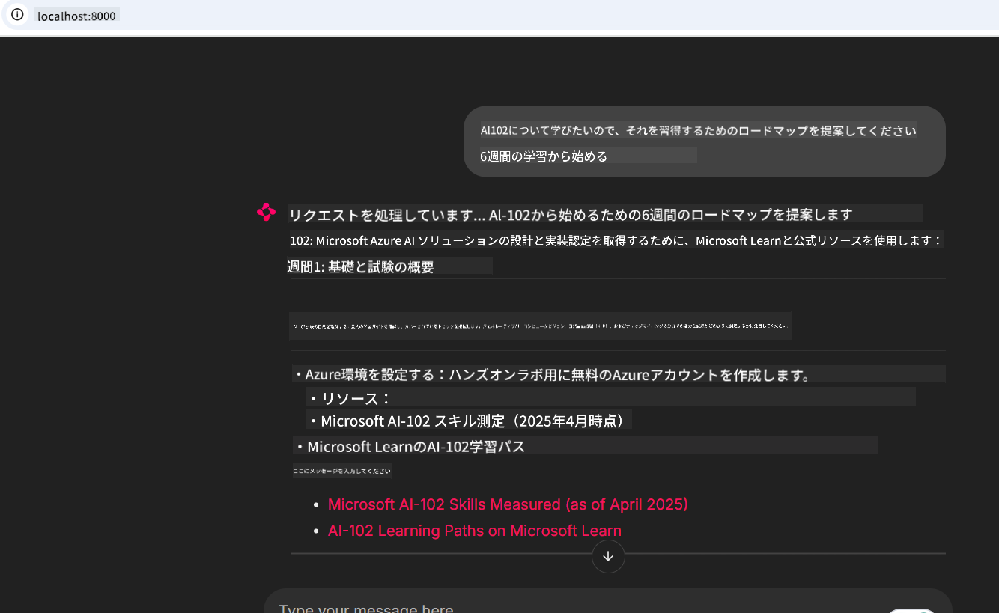
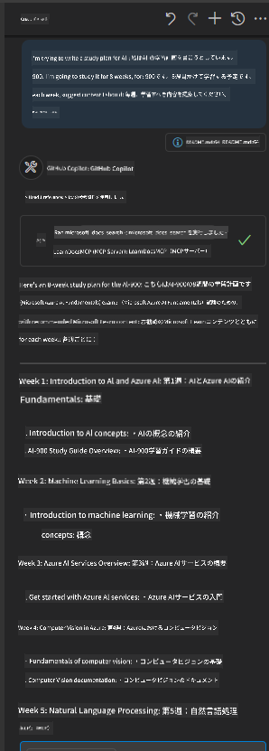

<!--
CO_OP_TRANSLATOR_METADATA:
{
  "original_hash": "4319d291c9d124ecafea52b3d04bfa0e",
  "translation_date": "2025-07-14T06:20:07+00:00",
  "source_file": "09-CaseStudy/docs-mcp/README.md",
  "language_code": "ja"
}
-->
# ケーススタディ：クライアントからMicrosoft Learn Docs MCPサーバーへの接続

コードの問題を解決しようとするとき、ドキュメントサイトやStack Overflow、検索エンジンのタブを行ったり来たりしていませんか？ドキュメント用にセカンドモニターを用意したり、IDEとブラウザを頻繁に切り替えたりしているかもしれません。もしドキュメントをワークフローの中に直接取り込めたら、つまりアプリやIDE、あるいは自分だけのカスタムツールに統合できたら、どれだけ便利でしょうか？このケーススタディでは、クライアントアプリケーションからMicrosoft Learn Docs MCPサーバーに直接接続する方法を探っていきます。

## 概要

現代の開発は単にコードを書くことだけではありません。適切な情報を適切なタイミングで見つけることが重要です。ドキュメントはあちこちにありますが、必要なときに必要な場所、つまりツールやワークフローの中にあることは稀です。ドキュメント取得をアプリケーションに直接組み込むことで、時間を節約し、コンテキストの切り替えを減らし、生産性を向上させることができます。このセクションでは、クライアントをMicrosoft Learn Docs MCPサーバーに接続し、アプリを離れることなくリアルタイムでコンテキストに応じたドキュメントにアクセスする方法を紹介します。

接続の確立、リクエストの送信、ストリーミングレスポンスの効率的な処理の流れを順を追って説明します。この方法はワークフローを効率化するだけでなく、より賢く役立つ開発者ツールを作るための扉を開きます。

## 学習目標

なぜこれを行うのか？それは、最高の開発者体験とは摩擦を取り除くことだからです。コードエディターやチャットボット、ウェブアプリがMicrosoft Learnの最新コンテンツを使って、ドキュメントの質問に即座に答えられる世界を想像してください。この章の終わりには、以下のことができるようになります：

- ドキュメント用MCPサーバーとクライアントの基本的な通信を理解する
- Microsoft Learn Docs MCPサーバーに接続するコンソールまたはウェブアプリケーションを実装する
- ストリーミングHTTPクライアントを使ってリアルタイムでドキュメントを取得する
- アプリケーション内でドキュメントレスポンスをログに記録し解釈する

これらのスキルを使って、単に反応するだけでなく、真にインタラクティブでコンテキストに応じたツールを作る方法がわかります。

## シナリオ1 - MCPによるリアルタイムドキュメント取得

このシナリオでは、クライアントをMicrosoft Learn Docs MCPサーバーに接続し、アプリを離れることなくリアルタイムでコンテキストに応じたドキュメントにアクセスする方法を紹介します。

実際にやってみましょう。あなたのタスクは、Microsoft Learn Docs MCPサーバーに接続し、`microsoft_docs_search`ツールを呼び出し、ストリーミングレスポンスをコンソールにログ出力するアプリを作成することです。

### なぜこの方法なのか？
これは、チャットボットやIDE拡張機能、ウェブダッシュボードなど、より高度な統合を構築するための基盤だからです。

このシナリオのコードと手順は、このケーススタディの[`solution`](./solution/README.md)フォルダーにあります。以下のステップで接続設定を案内します：
- 公式のMCP SDKとストリーミング対応HTTPクライアントを使って接続する
- クエリパラメーターを使って`microsoft_docs_search`ツールを呼び出し、ドキュメントを取得する
- 適切なログ記録とエラーハンドリングを実装する
- ユーザーが複数の検索クエリを入力できるインタラクティブなコンソールインターフェースを作成する

このシナリオで学べること：
- Docs MCPサーバーへの接続方法
- クエリの送信方法
- 結果の解析と表示方法

実行例は以下のようになります：

```
Prompt> What is Azure Key Vault?
Answer> Azure Key Vault is a cloud service for securely storing and accessing secrets. ...
```

以下は最小限のサンプルソリューションです。完全なコードと詳細はsolutionフォルダーにあります。

<details>
<summary>Python</summary>

```python
import asyncio
from mcp.client.streamable_http import streamablehttp_client
from mcp import ClientSession

async def main():
    async with streamablehttp_client("https://learn.microsoft.com/api/mcp") as (read_stream, write_stream, _):
        async with ClientSession(read_stream, write_stream) as session:
            await session.initialize()
            result = await session.call_tool("microsoft_docs_search", {"query": "Azure Functions best practices"})
            print(result.content)

if __name__ == "__main__":
    asyncio.run(main())
```

- 完全な実装とログ記録については[`scenario1.py`](../../../../09-CaseStudy/docs-mcp/solution/python/scenario1.py)を参照してください。
- インストールと使用方法は同じフォルダーの[`README.md`](./solution/python/README.md)に記載されています。
</details>

## シナリオ2 - MCPを使ったインタラクティブな学習プラン生成ウェブアプリ

このシナリオでは、Docs MCPをウェブ開発プロジェクトに統合する方法を学びます。目的は、ユーザーがウェブインターフェースから直接Microsoft Learnのドキュメントを検索できるようにし、アプリやサイト内で即座にドキュメントにアクセスできるようにすることです。

以下のことがわかります：
- ウェブアプリのセットアップ方法
- Docs MCPサーバーへの接続方法
- ユーザー入力の処理と結果の表示方法

実行例は以下のようになります：

```
User> I want to learn about AI102 - so suggest the roadmap to get it started from learn for 6 weeks

Assistant> Here’s a detailed 6-week roadmap to start your preparation for the AI-102: Designing and Implementing a Microsoft Azure AI Solution certification, using official Microsoft resources and focusing on exam skills areas:

---
## Week 1: Introduction & Fundamentals
- **Understand the Exam**: Review the [AI-102 exam skills outline](https://learn.microsoft.com/en-us/credentials/certifications/exams/ai-102/).
- **Set up Azure**: Sign up for a free Azure account if you don't have one.
- **Learning Path**: [Introduction to Azure AI services](https://learn.microsoft.com/en-us/training/modules/intro-to-azure-ai/)
- **Focus**: Get familiar with Azure portal, AI capabilities, and necessary tools.

....more weeks of the roadmap...

Let me know if you want module-specific recommendations or need more customized weekly tasks!
```

以下は最小限のサンプルソリューションです。完全なコードと詳細はsolutionフォルダーにあります。



<details>
<summary>Python (Chainlit)</summary>

Chainlitは会話型AIウェブアプリを構築するためのフレームワークです。MCPツールを呼び出し、リアルタイムで結果を表示するインタラクティブなチャットボットやアシスタントを簡単に作成できます。迅速なプロトタイピングやユーザーフレンドリーなインターフェースに最適です。

```python
import chainlit as cl
import requests

MCP_URL = "https://learn.microsoft.com/api/mcp"

@cl.on_message
def handle_message(message):
    query = {"question": message}
    response = requests.post(MCP_URL, json=query)
    if response.ok:
        result = response.json()
        cl.Message(content=result.get("answer", "No answer found.")).send()
    else:
        cl.Message(content="Error: " + response.text).send()
```

- 完全な実装は[`scenario2.py`](../../../../09-CaseStudy/docs-mcp/solution/python/scenario2.py)を参照してください。
- セットアップと実行方法は[`README.md`](./solution/python/README.md)に記載されています。
</details>

## シナリオ3：VS Code内でMCPサーバーを使ったエディター内ドキュメント

ブラウザのタブを切り替える代わりに、VS Code内で直接Microsoft Learn Docsを利用したい場合は、エディター内でMCPサーバーを使うことができます。これにより：

- VS Codeを離れずにドキュメントを検索・閲覧できる
- READMEやコースファイルにドキュメントの参照やリンクを直接挿入できる
- GitHub CopilotとMCPを組み合わせて、シームレスでAI支援のドキュメントワークフローを実現できる

**以下のことがわかります：**
- ワークスペースのルートに有効な`.vscode/mcp.json`ファイルを追加する方法（下記例参照）
- VS CodeのMCPパネルを開くかコマンドパレットを使ってドキュメントを検索・挿入する方法
- 作業中にマークダウンファイル内で直接ドキュメントを参照する方法
- GitHub Copilotと組み合わせてさらに生産性を高める方法

VS CodeでMCPサーバーを設定する例は以下の通りです：

```json
{
  "servers": {
    "LearnDocsMCP": {
      "url": "https://learn.microsoft.com/api/mcp"
    }
  }
}
```

</details>

> スクリーンショット付きの詳細な手順は[`README.md`](./solution/scenario3/README.md)を参照してください。



この方法は、技術コースの作成、ドキュメント執筆、頻繁に参照が必要なコード開発に最適です。

## 重要なポイント

ドキュメントをツールに直接統合することは単なる利便性ではなく、生産性を大きく変えるものです。クライアントからMicrosoft Learn Docs MCPサーバーに接続することで：

- コードとドキュメント間のコンテキスト切り替えをなくす
- 最新かつコンテキストに応じたドキュメントをリアルタイムで取得する
- より賢く、インタラクティブな開発者ツールを構築する

これらのスキルは、効率的で使いやすいソリューションを作るのに役立ちます。

## 追加リソース

理解を深めるために、以下の公式リソースを参照してください：

- [Microsoft Learn Docs MCP Server (GitHub)](https://github.com/MicrosoftDocs/mcp)
- [Get started with Azure MCP Server (mcp-python)](https://learn.microsoft.com/en-us/azure/developer/azure-mcp-server/get-started#create-the-python-app)
- [What is the Azure MCP Server?](https://learn.microsoft.com/en-us/azure/developer/azure-mcp-server/)
- [Model Context Protocol (MCP) Introduction](https://modelcontextprotocol.io/introduction)
- [Add plugins from a MCP Server (Python)](https://learn.microsoft.com/en-us/semantic-kernel/concepts/plugins/adding-mcp-plugins)

**免責事項**：  
本書類はAI翻訳サービス「[Co-op Translator](https://github.com/Azure/co-op-translator)」を使用して翻訳されました。正確性の向上に努めておりますが、自動翻訳には誤りや不正確な部分が含まれる可能性があります。原文の言語によるオリジナル文書が正式な情報源とみなされるべきです。重要な情報については、専門の人間による翻訳を推奨します。本翻訳の利用により生じたいかなる誤解や誤訳についても、当方は一切の責任を負いかねます。