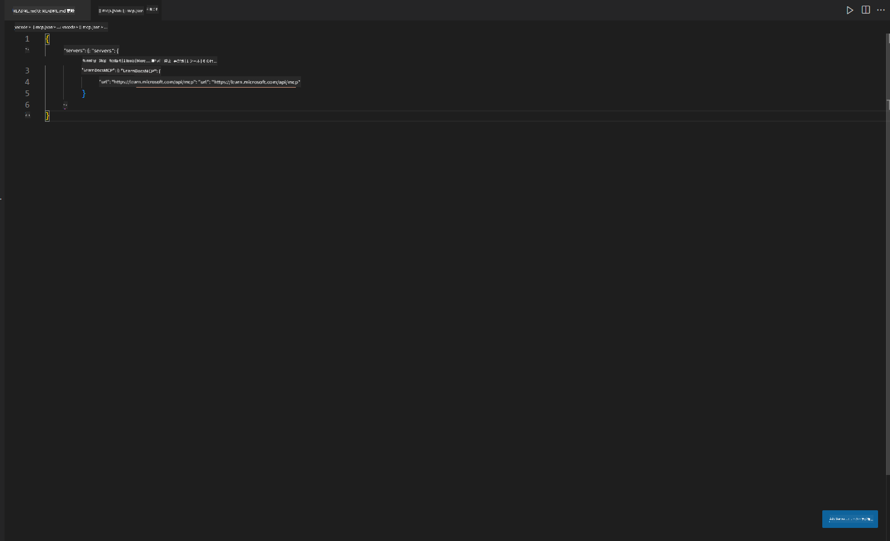
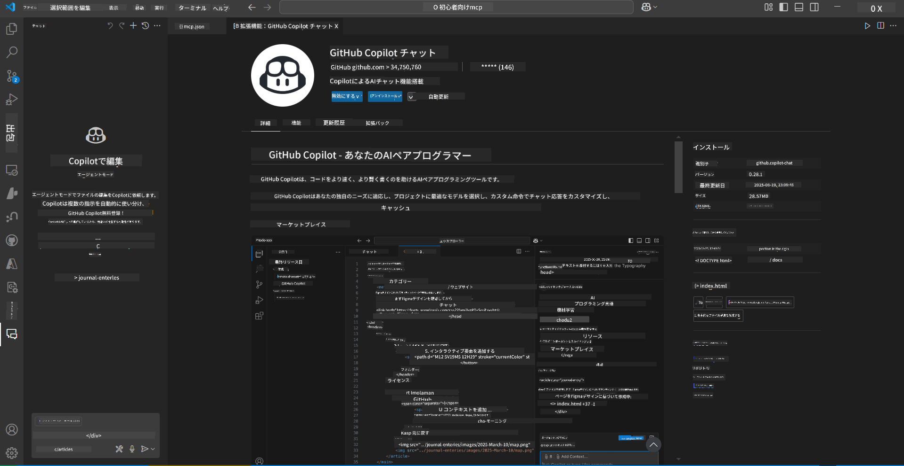
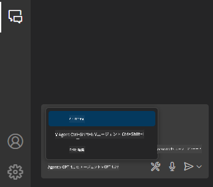
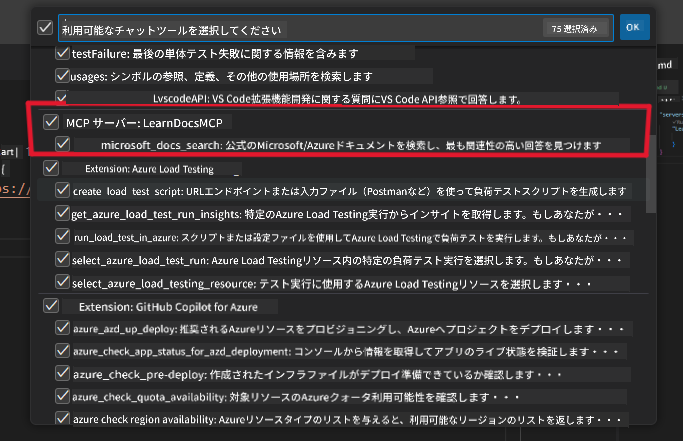
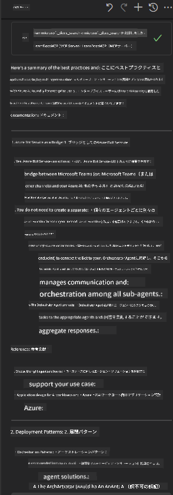

<!--
CO_OP_TRANSLATOR_METADATA:
{
  "original_hash": "db532b1ec386c9ce38c791653dc3c881",
  "translation_date": "2025-07-14T06:48:24+00:00",
  "source_file": "09-CaseStudy/docs-mcp/solution/scenario3/README.md",
  "language_code": "ja"
}
-->
# シナリオ3: VS Code内でのMCPサーバーを使ったエディター内ドキュメント

## 概要

このシナリオでは、MCPサーバーを使ってMicrosoft Learn DocsをVisual Studio Codeの環境内に直接取り込む方法を学びます。ブラウザのタブを切り替えてドキュメントを探す代わりに、エディター内で公式ドキュメントを検索・参照できます。この方法により、作業の効率化、集中力の維持、GitHub Copilotなどのツールとのシームレスな連携が可能になります。

- VS Code内でコードを書きながらドキュメントを検索・閲覧できる。
- READMEやコースファイルにドキュメントのリンクを直接挿入できる。
- GitHub CopilotとMCPを組み合わせて、AIを活用したドキュメント作成ワークフローを実現。

## 学習目標

この章の終わりまでに、VS Code内でMCPサーバーを設定・利用し、ドキュメントと開発のワークフローを向上させる方法を理解できます。具体的には以下ができるようになります。

- MCPサーバーを使ったドキュメント検索のためにワークスペースを設定する。
- VS Code内から直接ドキュメントを検索し、挿入する。
- GitHub CopilotとMCPの力を組み合わせて、より生産的でAI支援されたワークフローを実現する。

これらのスキルは、集中力を保ちつつドキュメントの質を高め、開発者や技術ライターとしての生産性を向上させます。

## ソリューション

エディター内でドキュメントにアクセスするために、MCPサーバーをVS CodeとGitHub Copilotに統合する一連の手順を実行します。このソリューションは、コース作成者、ドキュメント作成者、開発者がエディター内で集中しながらドキュメントやCopilotと連携したい場合に最適です。

- コースやプロジェクトのドキュメント作成中にREADMEへ参照リンクを素早く追加。
- Copilotでコードを生成し、MCPで関連ドキュメントを即座に検索・引用。
- エディター内で集中力を維持し、生産性を向上。

### ステップバイステップガイド

まずは以下の手順に従ってください。各ステップにはassetsフォルダーのスクリーンショットを追加して、視覚的に説明できます。

1. **MCP設定を追加する：**  
   プロジェクトのルートに `.vscode/mcp.json` ファイルを作成し、以下の設定を追加します。  
   ```json
   {
     "servers": {
       "LearnDocsMCP": {
         "url": "https://learn.microsoft.com/api/mcp"
       }
     }
   }
   ```  
   この設定はVS Codeに[`Microsoft Learn Docs MCP server`](https://github.com/MicrosoftDocs/mcp)への接続方法を指示します。  
   
   
    
2. **GitHub Copilot Chatパネルを開く：**  
   まだGitHub Copilot拡張機能をインストールしていない場合は、VS Codeの拡張機能ビューからインストールしてください。直接[Visual Studio Code Marketplace](https://marketplace.visualstudio.com/items?itemName=GitHub.copilot-chat)からダウンロード可能です。インストール後、サイドバーからCopilot Chatパネルを開きます。

   

3. **エージェントモードを有効にし、ツールを確認する：**  
   Copilot Chatパネルでエージェントモードを有効にします。

   

   エージェントモードを有効にした後、MCPサーバーが利用可能なツールとしてリストされていることを確認してください。これにより、Copilotエージェントがドキュメントサーバーにアクセスして関連情報を取得できます。  
   
   

4. **新しいチャットを開始し、エージェントに質問する：**  
   Copilot Chatパネルで新しいチャットを開き、ドキュメントに関する質問をエージェントに投げかけます。エージェントはMCPサーバーを使って関連するMicrosoft Learnのドキュメントを取得し、エディター内に表示します。

   - *「トピックXの学習計画を作成したいです。8週間で学習する予定なので、各週に取り組むべき内容を提案してください。」*

   

5. **ライブクエリ：**

   > Azure AI Foundry Discordの[#get-help](https://discord.gg/D6cRhjHWSC)セクションからのライブクエリを見てみましょう（[元のメッセージを見る](https://discord.com/channels/1113626258182504448/1385498306720829572)）：  
   
   *「Azure AI Foundryで開発したAIエージェントを使ったマルチエージェントソリューションのデプロイ方法について知りたいです。Copilot Studioチャネルのような直接的なデプロイ方法はないようです。企業ユーザーが連携して作業を行うためのデプロイ方法にはどんなものがありますか？  
   Azure Botサービスを使ってMS TeamsとAzure AI Foundryエージェントの橋渡しをする方法があると聞きましたが、Azure Botを設定してAzure Function経由でOrchestrator Agentに接続する方法は機能しますか？それともマルチエージェントソリューションの各AIエージェントごとにAzure Functionを作成してBot Frameworkでオーケストレーションする必要がありますか？他に良い提案があれば教えてください。」*

   

   エージェントは関連するドキュメントのリンクや要約を返し、それをマークダウンファイルに直接挿入したり、コードの参考資料として利用できます。

### サンプルクエリ

以下は試してみることができる例です。これらのクエリは、MCPサーバーとCopilotが連携して、VS Codeを離れずに即座にコンテキストに合ったドキュメントや参照を提供する様子を示します。

- 「Azure Functionsのトリガーの使い方を教えてください。」
- 「Azure Key Vaultの公式ドキュメントへのリンクを挿入してください。」
- 「Azureリソースのセキュリティに関するベストプラクティスは何ですか？」
- 「Azure AIサービスのクイックスタートを探してください。」

これらのクエリは、MCPサーバーとCopilotが連携して、VS Codeを離れずに即座にコンテキストに合ったドキュメントや参照を提供する様子を示します。

---

**免責事項**：  
本書類はAI翻訳サービス「[Co-op Translator](https://github.com/Azure/co-op-translator)」を使用して翻訳されました。正確性を期しておりますが、自動翻訳には誤りや不正確な部分が含まれる可能性があります。原文の言語によるオリジナル文書が正式な情報源とみなされるべきです。重要な情報については、専門の人間による翻訳を推奨します。本翻訳の利用により生じたいかなる誤解や誤訳についても、当方は責任を負いかねます。