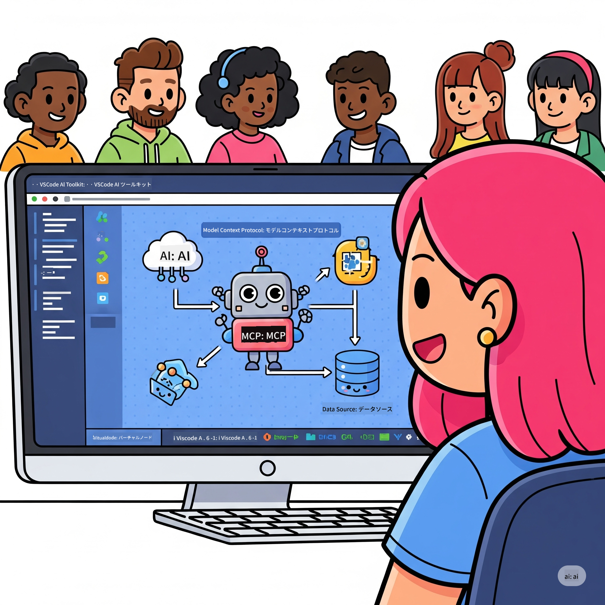

<!--
CO_OP_TRANSLATOR_METADATA:
{
  "original_hash": "787440926586cd064b0899fd1c514f52",
  "translation_date": "2025-07-14T07:02:21+00:00",
  "source_file": "10-StreamliningAIWorkflowsBuildingAnMCPServerWithAIToolkit/README.md",
  "language_code": "ja"
}
-->
# AIワークフローの効率化：AI Toolkitを使ったMCPサーバー構築

## 🎯 概要

**Model Context Protocol (MCP) ワークショップ**へようこそ！この実践的なワークショップでは、AIアプリケーション開発を革新する2つの最先端技術を組み合わせています。

- **🔗 Model Context Protocol (MCP)**：AIツールのシームレスな統合を実現するオープンスタンダード
- **🛠️ AI Toolkit for Visual Studio Code (AITK)**：Microsoftの強力なAI開発拡張機能

### 🎓 学習内容

このワークショップを終える頃には、AIモデルと実世界のツールやサービスをつなぐインテリジェントなアプリケーションの構築方法を習得します。自動テストからカスタムAPI統合まで、複雑なビジネス課題を解決する実践的なスキルを身につけましょう。

## 🏗️ 技術スタック

### 🔌 Model Context Protocol (MCP)

MCPはAIのための「USB-C」のような存在で、AIモデルを外部ツールやデータソースに接続するための共通規格です。

**✨ 主な特徴:**
- 🔄 **標準化された統合**：AIツール接続のための共通インターフェース
- 🏛️ **柔軟なアーキテクチャ**：stdio/SSEトランスポートによるローカル＆リモートサーバー対応
- 🧰 **豊富なエコシステム**：ツール、プロンプト、リソースが一つのプロトコルに集約
- 🔒 **エンタープライズ対応**：セキュリティと信頼性を標準装備

**🎯 MCPが重要な理由:**
USB-Cがケーブルの混乱を解消したように、MCPはAI統合の複雑さを解消します。ひとつのプロトコルで無限の可能性を。

### 🤖 AI Toolkit for Visual Studio Code (AITK)

Microsoftの代表的なAI開発拡張機能で、VS CodeをAI開発の強力なプラットフォームに変えます。

**🚀 主な機能:**
- 📦 **モデルカタログ**：Azure AI、GitHub、Hugging Face、Ollamaのモデルにアクセス
- ⚡ **ローカル推論**：ONNX最適化されたCPU/GPU/NPU実行
- 🏗️ **エージェントビルダー**：MCP統合によるビジュアルAIエージェント開発
- 🎭 **マルチモーダル対応**：テキスト、画像、構造化出力のサポート

**💡 開発のメリット:**
- 設定不要のモデル展開
- ビジュアルなプロンプト設計
- リアルタイムテストプレイグラウンド
- MCPサーバーとのシームレスな統合

## 📚 学習の流れ

### [🚀 モジュール1：AI Toolkitの基礎](./lab1/README.md)
**所要時間**：15分
- 🛠️ AI Toolkit for VS Codeのインストールと設定
- 🗂️ モデルカタログの探索（GitHub、ONNX、OpenAI、Anthropic、Googleの100以上のモデル）
- 🎮 インタラクティブプレイグラウンドでリアルタイムモデルテストを習得
- 🤖 Agent Builderで最初のAIエージェントを構築
- 📊 組み込みメトリクス（F1、関連性、類似度、一貫性）でモデル性能を評価
- ⚡ バッチ処理とマルチモーダル対応機能を学習

**🎯 学習成果**：AITKの機能を理解し、実用的なAIエージェントを作成できるようになる

### [🌐 モジュール2：MCPとAI Toolkitの基礎](./lab2/README.md)
**所要時間**：20分
- 🧠 Model Context Protocol (MCP)のアーキテクチャと概念を習得
- 🌐 MicrosoftのMCPサーバーエコシステムを探る
- 🤖 Playwright MCPサーバーを使ったブラウザ自動化エージェントを構築
- 🔧 MCPサーバーをAI ToolkitのAgent Builderに統合
- 📊 エージェント内でMCPツールを設定・テスト
- 🚀 MCP対応エージェントをエクスポートし、本番環境に展開

**🎯 学習成果**：MCPを活用した外部ツール連携型AIエージェントを展開できるようになる

### [🔧 モジュール3：AI Toolkitによる高度なMCP開発](./lab3/README.md)
**所要時間**：20分
- 💻 AI Toolkitを使ったカスタムMCPサーバーの作成
- 🐍 最新のMCP Python SDK（v1.9.3）の設定と利用
- 🔍 MCP Inspectorを使ったデバッグ環境の構築と活用
- 🛠️ プロフェッショナルなデバッグワークフローでWeather MCPサーバーを構築
- 🧪 Agent BuilderとInspectorの両環境でMCPサーバーをデバッグ

**🎯 学習成果**：最新ツールを使ったカスタムMCPサーバーの開発とデバッグができるようになる

### [🐙 モジュール4：実践的MCP開発 - カスタムGitHubクローンサーバー](./lab4/README.md)
**所要時間**：30分
- 🏗️ 開発ワークフロー向けの実用的なGitHubクローンMCPサーバーを構築
- 🔄 バリデーションとエラーハンドリングを備えたスマートなリポジトリクローン機能を実装
- 📁 インテリジェントなディレクトリ管理とVS Code連携を実現
- 🤖 GitHub Copilot Agent ModeをカスタムMCPツールと共に活用
- 🛡️ 本番環境対応の信頼性とクロスプラットフォーム互換性を適用

**🎯 学習成果**：実際の開発ワークフローを効率化する本番対応MCPサーバーを展開できるようになる

## 💡 実世界での応用と影響

### 🏢 エンタープライズユースケース

#### 🔄 DevOps自動化
開発ワークフローをインテリジェントな自動化で変革：
- **スマートリポジトリ管理**：AIによるコードレビューとマージ判断
- **インテリジェントCI/CD**：コード変更に基づくパイプライン最適化
- **課題トリアージ**：バグの自動分類と割り当て

#### 🧪 品質保証の革新
AI駆動の自動化でテストを強化：
- **インテリジェントテスト生成**：包括的なテストスイートを自動作成
- **ビジュアルリグレッションテスト**：AIによるUI変化検出
- **パフォーマンス監視**：問題の早期発見と解決

#### 📊 データパイプラインの知能化
より賢いデータ処理ワークフローを構築：
- **適応型ETLプロセス**：自己最適化するデータ変換
- **異常検知**：リアルタイムのデータ品質監視
- **インテリジェントルーティング**：スマートなデータフロー管理

#### 🎧 顧客体験の向上
卓越した顧客対応を実現：
- **コンテキスト対応サポート**：顧客履歴にアクセス可能なAIエージェント
- **予測的問題解決**：先回りしたカスタマーサービス
- **マルチチャネル統合**：プラットフォーム横断の統一AI体験

## 🛠️ 前提条件とセットアップ

### 💻 システム要件

| コンポーネント | 要件 | 備考 |
|-----------|-------------|-------|
| **OS** | Windows 10以上、macOS 10.15以上、Linux | いずれも最新のOSで可 |
| **Visual Studio Code** | 最新の安定版 | AITKに必須 |
| **Node.js** | v18.0以上とnpm | MCPサーバー開発用 |
| **Python** | 3.10以上 | Python製MCPサーバーは任意 |
| **メモリ** | 最低8GB RAM | ローカルモデル利用時は16GB推奨 |

### 🔧 開発環境

#### 推奨VS Code拡張機能
- **AI Toolkit** (ms-windows-ai-studio.windows-ai-studio)
- **Python** (ms-python.python)
- **Python Debugger** (ms-python.debugpy)
- **GitHub Copilot** (GitHub.copilot) - 任意だが便利

#### 任意ツール
- **uv**：最新のPythonパッケージマネージャー
- **MCP Inspector**：MCPサーバーのビジュアルデバッグツール
- **Playwright**：ウェブ自動化のサンプル用

## 🎖️ 学習成果と認定パス

### 🏆 スキル習得チェックリスト

このワークショップを修了すると、以下のスキルを習得できます。

#### 🎯 コアコンピテンシー
- [ ] **MCPプロトコルの習熟**：アーキテクチャと実装パターンの深い理解
- [ ] **AITKの熟練**：AI Toolkitを使った迅速な開発スキル
- [ ] **カスタムサーバー開発**：本番対応MCPサーバーの構築・展開・保守
- [ ] **ツール統合の達人**：既存開発ワークフローとのシームレスな連携
- [ ] **問題解決力**：学んだスキルを実際のビジネス課題に応用

#### 🔧 技術スキル
- [ ] VS CodeでのAI Toolkitセットアップと設定
- [ ] カスタムMCPサーバーの設計と実装
- [ ] GitHubモデルとMCPアーキテクチャの統合
- [ ] Playwrightを使った自動テストワークフロー構築
- [ ] 本番環境向けAIエージェントの展開
- [ ] MCPサーバーのデバッグとパフォーマンス最適化

#### 🚀 上級能力
- [ ] エンタープライズ規模のAI統合アーキテクチャ設計
- [ ] AIアプリケーションのセキュリティベストプラクティス実装
- [ ] スケーラブルなMCPサーバーアーキテクチャ設計
- [ ] 特定ドメイン向けカスタムツールチェーン作成
- [ ] AIネイティブ開発のメンター活動

## 📖 追加リソース
- [MCP仕様書](https://modelcontextprotocol.io/docs)
- [AI Toolkit GitHubリポジトリ](https://github.com/microsoft/vscode-ai-toolkit)
- [サンプルMCPサーバーコレクション](https://github.com/modelcontextprotocol/servers)
- [ベストプラクティスガイド](https://modelcontextprotocol.io/docs/best-practices)

---

**🚀 AI開発ワークフローを革新する準備はできましたか？**

MCPとAI Toolkitで、インテリジェントなアプリケーションの未来を一緒に築きましょう！

**免責事項**：  
本書類はAI翻訳サービス「[Co-op Translator](https://github.com/Azure/co-op-translator)」を使用して翻訳されました。正確性の向上に努めておりますが、自動翻訳には誤りや不正確な部分が含まれる可能性があります。原文の言語によるオリジナル文書が正式な情報源とみなされるべきです。重要な情報については、専門の人間による翻訳を推奨します。本翻訳の利用により生じたいかなる誤解や誤訳についても、当方は責任を負いかねます。