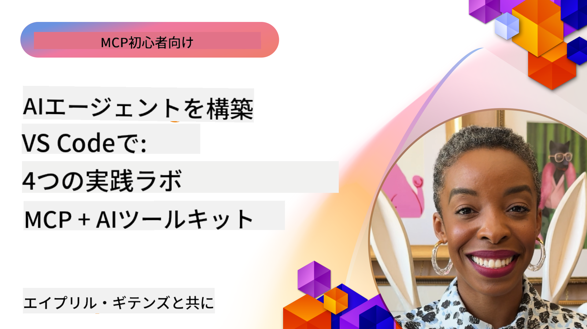

<!--
CO_OP_TRANSLATOR_METADATA:
{
  "original_hash": "1b000fd6e1b04c047578bfc5d07d54eb",
  "translation_date": "2025-07-29T00:20:44+00:00",
  "source_file": "10-StreamliningAIWorkflowsBuildingAnMCPServerWithAIToolkit/README.md",
  "language_code": "ja"
}
-->
# AIワークフローの効率化: AI Toolkitを使ったMCPサーバー構築

## 🎯 概要

_(上の画像をクリックして、このレッスンの動画をご覧ください)_

**Model Context Protocol (MCP) ワークショップ**へようこそ！この包括的なハンズオンワークショップでは、AIアプリケーション開発を革新する2つの最先端技術を組み合わせています：

- **🔗 Model Context Protocol (MCP)**: AIツール統合をシームレスにするオープンスタンダード
- **🛠️ AI Toolkit for Visual Studio Code (AITK)**: Microsoftの強力なAI開発拡張機能

### 🎓 学べること

このワークショップを終える頃には、AIモデルを現実世界のツールやサービスと結びつけるインテリジェントなアプリケーションを構築する技術を習得できます。自動テストからカスタムAPI統合まで、複雑なビジネス課題を解決する実践的なスキルを身につけます。

## 🏗️ 技術スタック

### 🔌 Model Context Protocol (MCP)

MCPは、AIのための**「USB-C」**です。AIモデルを外部ツールやデータソースに接続するためのユニバーサルスタンダードです。

**✨ 主な特徴:**

- 🔄 **標準化された統合**: AIツール接続のためのユニバーサルインターフェース
- 🏛️ **柔軟なアーキテクチャ**: stdio/SSEトランスポートを介したローカル＆リモートサーバー
- 🧰 **豊富なエコシステム**: ツール、プロンプト、リソースを1つのプロトコルで提供
- 🔒 **エンタープライズ対応**: セキュリティと信頼性を内蔵

**🎯 MCPが重要な理由:**
USB-Cがケーブルの混乱を解消したように、MCPはAI統合の複雑さを解消します。1つのプロトコルで無限の可能性を実現します。

### 🤖 AI Toolkit for Visual Studio Code (AITK)

MicrosoftのフラッグシップAI開発拡張機能で、VS CodeをAIの強力なツールに変えます。

**🚀 主な機能:**

- 📦 **モデルカタログ**: Azure AI、GitHub、Hugging Face、Ollamaからモデルにアクセス
- ⚡ **ローカル推論**: ONNX最適化によるCPU/GPU/NPU実行
- 🏗️ **エージェントビルダー**: MCP統合を活用した視覚的なAIエージェント開発
- 🎭 **マルチモーダル**: テキスト、ビジョン、構造化出力のサポート

**💡 開発のメリット:**

- 設定不要のモデルデプロイ
- 視覚的なプロンプトエンジニアリング
- リアルタイムテストプレイグラウンド
- MCPサーバーとのシームレスな統合

## 📚 学習の旅

### [🚀 モジュール1: AI Toolkitの基礎](./lab1/README.md)

**所要時間**: 15分

- 🛠️ AI ToolkitをVS Codeにインストールして設定
- 🗂️ モデルカタログを探索 (GitHub、ONNX、OpenAI、Anthropic、Googleから100以上のモデル)
- 🎮 リアルタイムモデルテストのためのインタラクティブプレイグラウンドを習得
- 🤖 Agent Builderで初めてのAIエージェントを構築
- 📊 F1、関連性、類似性、一貫性などの組み込みメトリクスでモデル性能を評価
- ⚡ バッチ処理とマルチモーダルサポート機能を学習

**🎯 学習成果**: AITKの機能を包括的に理解し、実用的なAIエージェントを作成

### [🌐 モジュール2: MCPとAI Toolkitの基礎](./lab2/README.md)

**所要時間**: 20分

- 🧠 Model Context Protocol (MCP) のアーキテクチャと概念を習得
- 🌐 MicrosoftのMCPサーバーエコシステムを探索
- 🤖 Playwright MCPサーバーを使用してブラウザ自動化エージェントを構築
- 🔧 MCPサーバーをAI Toolkit Agent Builderに統合
- 📊 MCPツールをエージェント内で設定してテスト
- 🚀 MCP対応エージェントをエクスポートして本番環境にデプロイ

**🎯 学習成果**: 外部ツールを活用したMCP強化型AIエージェントをデプロイ

### [🔧 モジュール3: AI Toolkitを使った高度なMCP開発](./lab3/README.md)

**所要時間**: 20分

- 💻 AI Toolkitを使用してカスタムMCPサーバーを作成
- 🐍 最新のMCP Python SDK (v1.9.3) を設定して使用
- 🔍 MCP Inspectorを設定してデバッグに活用
- 🛠️ プロフェッショナルなデバッグワークフローでWeather MCP Serverを構築
- 🧪 Agent BuilderとInspector環境でMCPサーバーをデバッグ

**🎯 学習成果**: 最新ツールを使用してカスタムMCPサーバーを開発およびデバッグ

### [🐙 モジュール4: 実践的なMCP開発 - カスタムGitHubクローンサーバー](./lab4/README.md)

**所要時間**: 30分

- 🏗️ 開発ワークフローのための実用的なGitHubクローンMCPサーバーを構築
- 🔄 検証とエラーハンドリングを備えたスマートなリポジトリクローンを実装
- 📁 インテリジェントなディレクトリ管理とVS Code統合を作成
- 🤖 カスタムMCPツールを使用したGitHub Copilot Agent Modeを活用
- 🛡️ 本番環境対応の信頼性とクロスプラットフォーム互換性を適用

**🎯 学習成果**: 開発ワークフローを効率化する本番対応MCPサーバーをデプロイ

## 💡 実世界での応用と影響

### 🏢 エンタープライズユースケース

#### 🔄 DevOps自動化

インテリジェントな自動化で開発ワークフローを変革：

- **スマートリポジトリ管理**: AI駆動のコードレビューとマージ決定
- **インテリジェントCI/CD**: コード変更に基づく自動パイプライン最適化
- **課題トリアージ**: 自動バグ分類と割り当て

#### 🧪 品質保証の革命

AI駆動の自動化でテストを向上：

- **インテリジェントテスト生成**: 包括的なテストスイートを自動作成
- **視覚的回帰テスト**: UI変更検出をAIで実現
- **性能監視**: 問題の予防的な特定と解決

#### 📊 データパイプラインのインテリジェンス

よりスマートなデータ処理ワークフローを構築：

- **適応型ETLプロセス**: 自己最適化するデータ変換
- **異常検出**: リアルタイムのデータ品質監視
- **インテリジェントルーティング**: スマートなデータフロー管理

#### 🎧 顧客体験の向上

卓越した顧客インタラクションを実現：

- **コンテキスト対応サポート**: 顧客履歴にアクセスするAIエージェント
- **予測的問題解決**: 先を見越したカスタマーサービス
- **マルチチャネル統合**: プラットフォーム全体で統一されたAI体験

## 🛠️ 必要条件とセットアップ

### 💻 システム要件

| コンポーネント | 要件 | 備考 |
|-----------|-------------|-------|
| **オペレーティングシステム** | Windows 10+, macOS 10.15+, Linux | 最新のOS |
| **Visual Studio Code** | 最新の安定版 | AITKに必要 |
| **Node.js** | v18.0+とnpm | MCPサーバー開発用 |
| **Python** | 3.10+ | Python MCPサーバーにオプション |
| **メモリ** | 最低8GB RAM | ローカルモデルには16GB推奨 |

### 🔧 開発環境

#### 推奨VS Code拡張機能

- **AI Toolkit** (ms-windows-ai-studio.windows-ai-studio)
- **Python** (ms-python.python)
- **Python Debugger** (ms-python.debugpy)
- **GitHub Copilot** (GitHub.copilot) - オプションだが便利

#### オプションツール

- **uv**: 最新のPythonパッケージマネージャー
- **MCP Inspector**: MCPサーバーの視覚的デバッグツール
- **Playwright**: Web自動化例用

## 🎖️ 学習成果と認定パス

### 🏆 スキル習得チェックリスト

このワークショップを完了することで、以下のスキルを習得できます：

#### 🎯 コアコンピテンシー

- [ ] **MCPプロトコルの習得**: アーキテクチャと実装パターンの深い理解
- [ ] **AITKの熟練**: AI Toolkitを使った迅速な開発の専門知識
- [ ] **カスタムサーバー開発**: MCPサーバーの構築、デプロイ、維持
- [ ] **ツール統合の卓越性**: AIを既存の開発ワークフローにシームレスに接続
- [ ] **問題解決の応用**: 学んだスキルを実際のビジネス課題に適用

#### 🔧 技術スキル

- [ ] AI ToolkitをVS Codeに設定して構成
- [ ] カスタムMCPサーバーを設計して実装
- [ ] GitHubモデルをMCPアーキテクチャに統合
- [ ] Playwrightを使った自動テストワークフローを構築
- [ ] AIエージェントを本番環境にデプロイ
- [ ] MCPサーバーの性能をデバッグして最適化

#### 🚀 高度な能力

- [ ] エンタープライズ規模のAI統合を設計
- [ ] AIアプリケーションのセキュリティベストプラクティスを実装
- [ ] スケーラブルなMCPサーバーアーキテクチャを設計
- [ ] 特定のドメイン向けのカスタムツールチェーンを作成
- [ ] AIネイティブ開発で他者を指導

## 📖 追加リソース

- [MCP仕様](https://modelcontextprotocol.io/docs)
- [AI Toolkit GitHubリポジトリ](https://github.com/microsoft/vscode-ai-toolkit)
- [MCPサーバーコレクション](https://github.com/modelcontextprotocol/servers)
- [ベストプラクティスガイド](https://modelcontextprotocol.io/docs/best-practices)

---

**🚀 AI開発ワークフローを革新する準備はできましたか？**

MCPとAI Toolkitを使って、インテリジェントアプリケーションの未来を一緒に構築しましょう！

**免責事項**:  
この文書は、AI翻訳サービス [Co-op Translator](https://github.com/Azure/co-op-translator) を使用して翻訳されています。正確性を追求しておりますが、自動翻訳には誤りや不正確な部分が含まれる可能性があることをご承知ください。元の言語で記載された文書が正式な情報源とみなされるべきです。重要な情報については、専門の人間による翻訳を推奨します。この翻訳の使用に起因する誤解や誤解釈について、当社は責任を負いません。