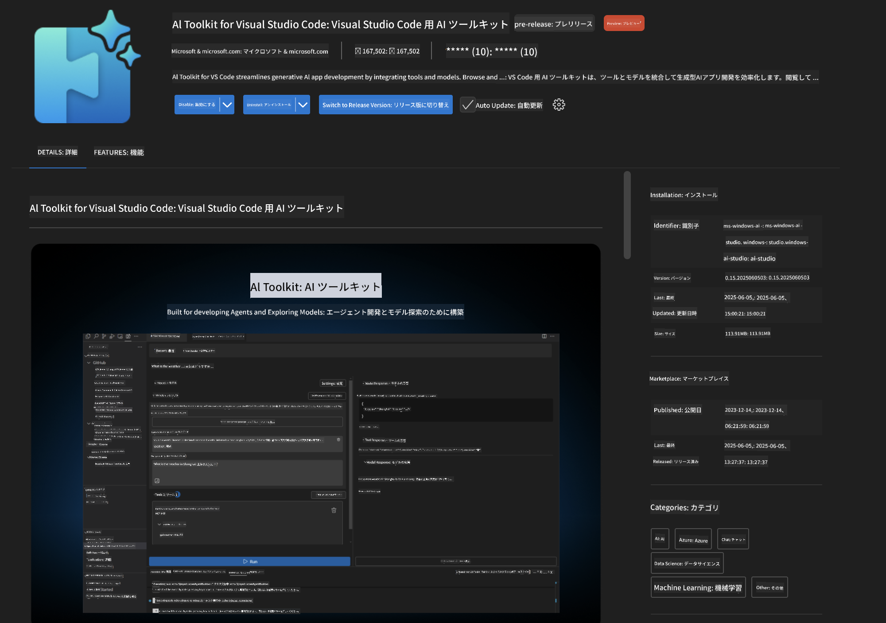
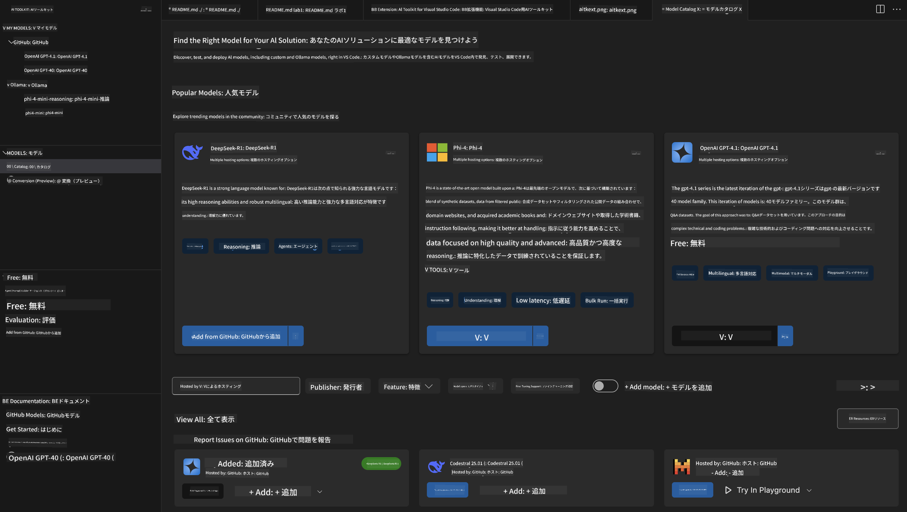
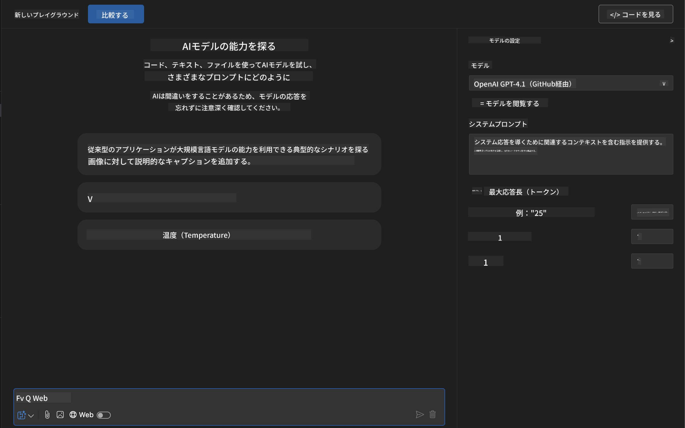
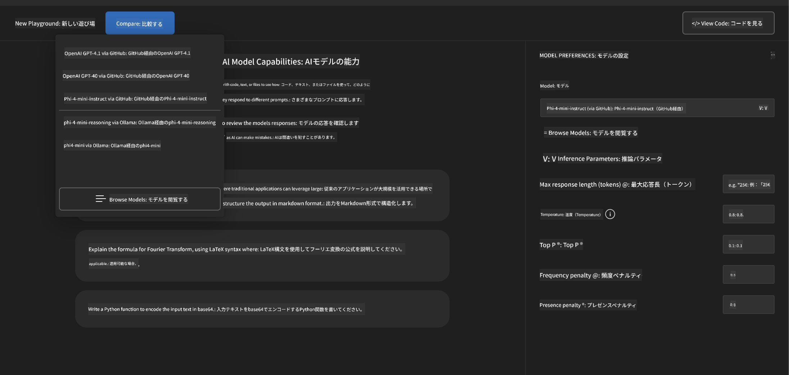
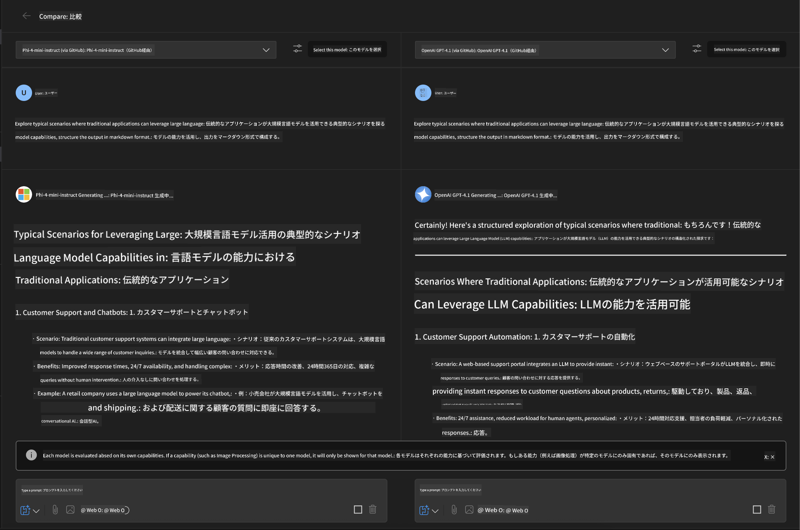
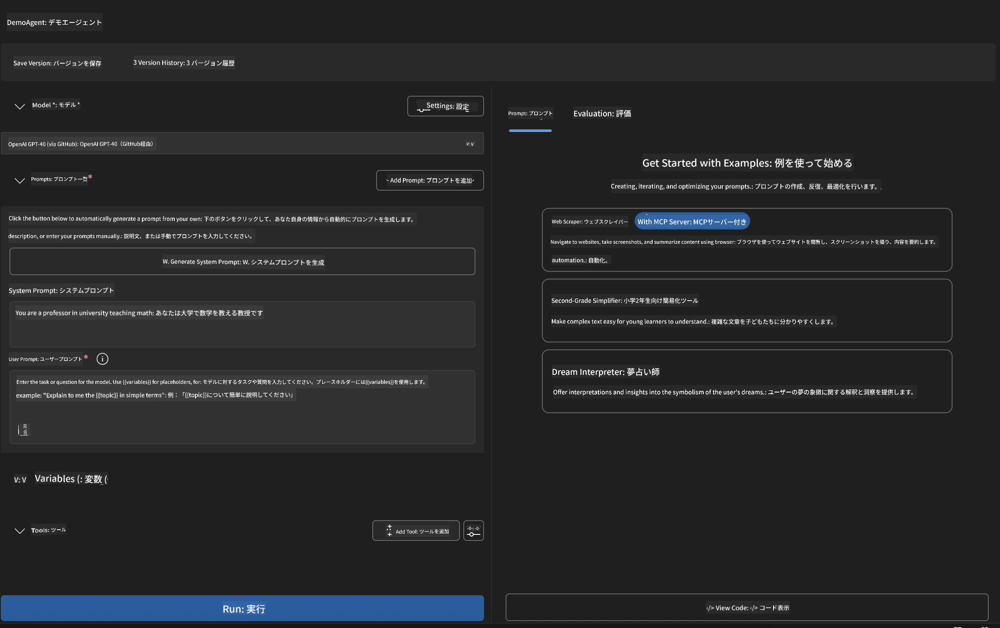
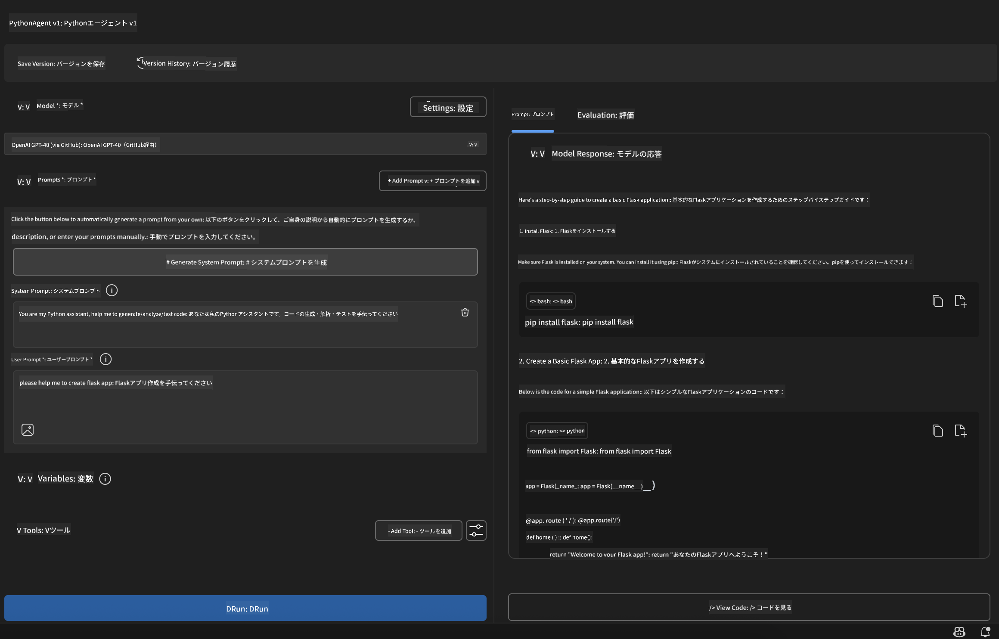

<!--
CO_OP_TRANSLATOR_METADATA:
{
  "original_hash": "2aa9dbc165e104764fa57e8a0d3f1c73",
  "translation_date": "2025-06-10T05:13:47+00:00",
  "source_file": "10-StreamliningAIWorkflowsBuildingAnMCPServerWithAIToolkit/lab1/README.md",
  "language_code": "ja"
}
-->
# 🚀 モジュール 1: AI Toolkit 基礎

[]()
[]()
[]()

## 📋 学習目標

このモジュールを終える頃には、以下ができるようになります：
- ✅ Visual Studio Code 用 AI Toolkit のインストールと設定
- ✅ モデルカタログの操作と様々なモデルソースの理解
- ✅ Playground を使ったモデルのテストと実験
- ✅ Agent Builder を使ったカスタム AI エージェントの作成
- ✅ 複数のプロバイダー間でのモデル性能比較
- ✅ プロンプトエンジニアリングのベストプラクティスの適用

## 🧠 AI Toolkit (AITK) の紹介

**Visual Studio Code 用 AI Toolkit** は、Microsoft が提供する主要な拡張機能で、VS Code を包括的な AI 開発環境に変えます。AI 研究と実践的なアプリケーション開発のギャップを埋め、あらゆるスキルレベルの開発者が生成 AI を利用できるようにします。

### 🌟 主な機能

| 機能 | 説明 | 利用シーン |
|---------|-------------|----------|
| **🗂️ モデルカタログ** | GitHub、ONNX、OpenAI、Anthropic、Google から100以上のモデルにアクセス | モデルの発見と選択 |
| **🔌 BYOM サポート** | 自分のモデル（ローカル/リモート）を統合 | カスタムモデルの展開 |
| **🎮 インタラクティブ Playground** | チャットインターフェースでリアルタイムにモデルをテスト | 迅速なプロトタイピングとテスト |
| **📎 マルチモーダル対応** | テキスト、画像、添付ファイルの処理 | 複雑な AI アプリケーション |
| **⚡ バッチ処理** | 複数のプロンプトを同時に実行 | 効率的なテストワークフロー |
| **📊 モデル評価** | 組み込みメトリクス（F1、関連度、類似度、一貫性） | パフォーマンス評価 |

### 🎯 AI Toolkit が重要な理由

- **🚀 開発の加速**：アイデアからプロトタイプまで数分で実現
- **🔄 統一されたワークフロー**：複数の AI プロバイダーを一つのインターフェースで
- **🧪 簡単な実験**：複雑な設定なしでモデル比較が可能
- **📈 本番環境対応**：プロトタイプから本番展開までスムーズに移行

## 🛠️ 前提条件とセットアップ

### 📦 AI Toolkit 拡張機能のインストール

**ステップ 1: 拡張機能マーケットプレイスにアクセス**
1. Visual Studio Code を開く
2. 拡張機能ビューに移動 (`Ctrl+Shift+X` または `Cmd+Shift+X`)
3. 「AI Toolkit」で検索

**ステップ 2: バージョンを選択**
- **🟢 リリース版**：本番利用に推奨
- **🔶 プレリリース版**：最新機能の先行利用

**ステップ 3: インストールして有効化**



### ✅ 確認チェックリスト
- [ ] VS Code サイドバーに AI Toolkit アイコンが表示されている
- [ ] 拡張機能が有効化されている
- [ ] 出力パネルにインストールエラーがない

## 🧪 ハンズオン演習 1: GitHub モデルの探索

**🎯 目的**：モデルカタログをマスターし、初めての AI モデルをテストする

### 📊 ステップ 1: モデルカタログを操作する

モデルカタログは AI エコシステムへの入り口です。複数のプロバイダーからモデルを集約し、発見や比較を容易にします。

**🔍 ナビゲーションガイド：**

AI Toolkit サイドバーの **MODELS - Catalog** をクリック



**💡 プロのコツ**：コード生成、クリエイティブライティング、分析など、用途に合った機能を持つモデルを探しましょう。

**⚠️ 注意**：GitHub ホストのモデル（GitHub Models）は無料で利用可能ですが、リクエスト数やトークンに制限があります。Azure AI やその他の外部モデルを使いたい場合は、適切な API キーや認証情報が必要です。

### 🚀 ステップ 2: 最初のモデルを追加して設定する

**モデル選択のポイント：**
- **GPT-4.1**：複雑な推論や分析に最適
- **Phi-4-mini**：軽量でシンプルなタスクに高速応答

**🔧 設定手順：**
1. カタログから **OpenAI GPT-4.1** を選択
2. **Add to My Models** をクリックしてモデルを登録
3. **Try in Playground** を選択してテスト環境を起動
4. モデルの初期化を待つ（初回は少し時間がかかる場合あり）



**⚙️ モデルパラメーターの理解：**
- **Temperature**：創造性の調整（0 = 決定論的、1 = 創造的）
- **Max Tokens**：最大応答長
- **Top-p**：核サンプリングによる応答の多様性

### 🎯 ステップ 3: Playground インターフェースを使いこなす

Playground は AI 実験のラボです。活用法は以下の通り：

**🎨 プロンプトエンジニアリングのベストプラクティス：**
1. **具体的に指示する**：明確で詳細な指示が良い結果を生む
2. **背景情報を提供する**：関連するコンテキストを含める
3. **例を使う**：モデルに期待する内容を例示する
4. **繰り返し改善する**：初期結果をもとにプロンプトを調整

**🧪 テストシナリオ：**
```markdown
# Example 1: Code Generation
"Write a Python function that calculates the factorial of a number using recursion. Include error handling and docstrings."

# Example 2: Creative Writing
"Write a professional email to a client explaining a project delay, maintaining a positive tone while being transparent about challenges."

# Example 3: Data Analysis
"Analyze this sales data and provide insights: [paste your data]. Focus on trends, anomalies, and actionable recommendations."
```


### 🏆 チャレンジ演習：モデル性能比較

**🎯 目標**：同じプロンプトで異なるモデルを比較し、それぞれの強みを理解する

**📋 手順：**
1. **Phi-4-mini** をワークスペースに追加
2. GPT-4.1 と Phi-4-mini に同じプロンプトを使う



3. 応答の質、速度、正確さを比較
4. 結果をレポートにまとめる



**💡 押さえるべきポイント：**
- LLM と SLM の使い分け
- コストと性能のバランス
- モデルごとの専門的な特徴

## 🤖 ハンズオン演習 2: Agent Builder を使ったカスタムエージェントの構築

**🎯 目的**：特定のタスクやワークフローに特化した AI エージェントを作成する

### 🏗️ ステップ 1: Agent Builder の理解

Agent Builder は AI Toolkit の真骨頂です。大規模言語モデルの力を活かしつつ、カスタム指示やパラメーター、専門知識を組み合わせた目的別の AI アシスタントを作れます。

**🧠 エージェントの構成要素：**
- **コアモデル**：基盤となる LLM（GPT-4、Groks、Phi など）
- **システムプロンプト**：エージェントの性格や振る舞いを定義
- **パラメーター**：最適なパフォーマンスのための調整設定
- **ツール統合**：外部 API や MCP サービスとの連携
- **メモリ**：会話のコンテキストやセッションの保持



### ⚙️ ステップ 2: エージェント設定の詳細

**🎨 効果的なシステムプロンプトの作成：**
```markdown
# Template Structure:
## Role Definition
You are a [specific role] with expertise in [domain].

## Capabilities
- List specific abilities
- Define scope of knowledge
- Clarify limitations

## Behavior Guidelines
- Response style (formal, casual, technical)
- Output format preferences
- Error handling approach

## Examples
Provide 2-3 examples of ideal interactions
```

*もちろん、Generate System Prompt を使って AI にプロンプト作成や最適化を手伝わせることもできます*

**🔧 パラメーター最適化：**
| パラメーター | 推奨範囲 | 利用シーン |
|-----------|------------------|----------|
| **Temperature** | 0.1-0.3 | 技術的・事実的な応答 |
| **Temperature** | 0.7-0.9 | 創造的・ブレインストーミング |
| **Max Tokens** | 500-1000 | 簡潔な回答 |
| **Max Tokens** | 2000-4000 | 詳細な説明 |

### 🐍 ステップ 3: 実践演習 - Python プログラミングエージェント

**🎯 ミッション**：Python コーディングに特化したアシスタントを作成

**📋 設定手順：**

1. **モデル選択**：**Claude 3.5 Sonnet** を選択（コードに強い）

2. **システムプロンプト設計**：
```markdown
# Python Programming Expert Agent

## Role
You are a senior Python developer with 10+ years of experience. You excel at writing clean, efficient, and well-documented Python code.

## Capabilities
- Write production-ready Python code
- Debug complex issues
- Explain code concepts clearly
- Suggest best practices and optimizations
- Provide complete working examples

## Response Format
- Always include docstrings
- Add inline comments for complex logic
- Suggest testing approaches
- Mention relevant libraries when applicable

## Code Quality Standards
- Follow PEP 8 style guidelines
- Use type hints where appropriate
- Handle exceptions gracefully
- Write readable, maintainable code
```

3. **パラメーター設定**：
   - Temperature: 0.2（安定して信頼できるコード生成向け）
   - Max Tokens: 2000（詳細な説明対応）
   - Top-p: 0.9（バランスの取れた創造性）



### 🧪 ステップ 4: Python エージェントのテスト

**テストシナリオ：**
1. **基本機能**：「素数を見つける関数を作成して」
2. **複雑なアルゴリズム**：「挿入、削除、検索メソッドを持つ二分探索木を実装して」
3. **実用課題**：「レート制限とリトライを考慮したウェブスクレイパーを作って」
4. **デバッグ**：「このコードを修正して [バグのあるコードを貼り付け]」

**🏆 合格基準：**
- ✅ エラーなくコードが実行される
- ✅ 適切なドキュメントが含まれている
- ✅ Python のベストプラクティスに従っている
- ✅ 明確な説明を提供している
- ✅ 改善案を提案できる

## 🎓 モジュール 1 総まとめと次のステップ

### 📊 知識確認

理解度をチェックしましょう：
- [ ] カタログ内のモデルの違いを説明できるか？
- [ ] カスタムエージェントを作成しテストできたか？
- [ ] 用途に応じたパラメーター最適化が理解できているか？
- [ ] 効果的なシステムプロンプトを設計できるか？

### 📚 追加リソース

- **AI Toolkit ドキュメント**：[Official Microsoft Docs](https://github.com/microsoft/vscode-ai-toolkit)
- **プロンプトエンジニアリングガイド**：[Best Practices](https://platform.openai.com/docs/guides/prompt-engineering)
- **AI Toolkit のモデル一覧**：[Models in Develpment](https://github.com/microsoft/vscode-ai-toolkit/blob/main/doc/models.md)

**🎉 おめでとうございます！** AI Toolkit の基礎を習得し、より高度な AI アプリケーションの構築に進む準備が整いました！

### 🔜 次のモジュールへ進む

さらに高度な機能を学びたい方は、**[モジュール 2: MCP with AI Toolkit Fundamentals](../lab2/README.md)** に進みましょう。ここでは：
- Model Context Protocol (MCP) を使ってエージェントを外部ツールに接続する方法
- Playwright を使ったブラウザ自動化エージェントの作成
- MCP サーバーと AI Toolkit エージェントの統合
- 外部データや機能でエージェントを強化する方法
を学びます。

**免責事項**：  
本書類はAI翻訳サービス[Co-op Translator](https://github.com/Azure/co-op-translator)を使用して翻訳されています。正確性を期しておりますが、自動翻訳には誤りや不正確な箇所が含まれる可能性があることをご承知おきください。原文の言語によるオリジナル文書が正式な情報源とみなされます。重要な情報については、専門の人間による翻訳を推奨します。本翻訳の利用により生じたいかなる誤解や解釈違いについても責任を負いかねます。