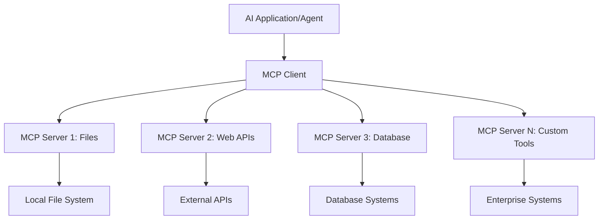
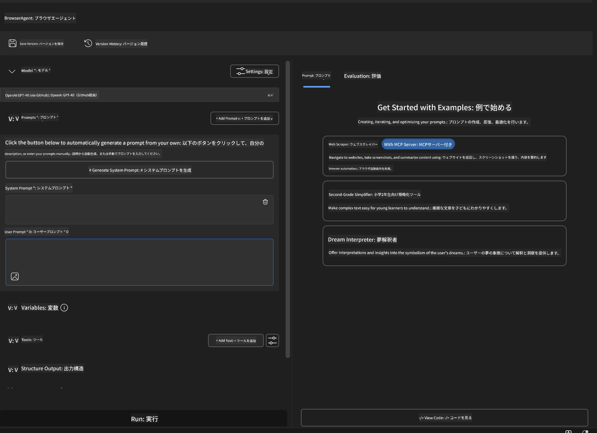
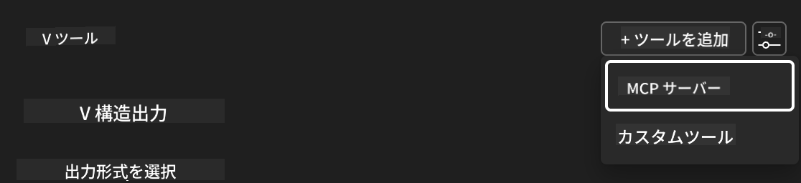
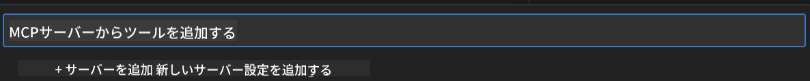
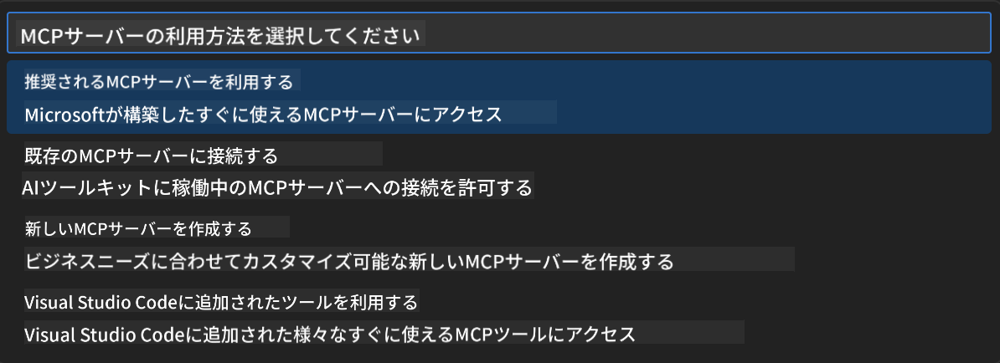
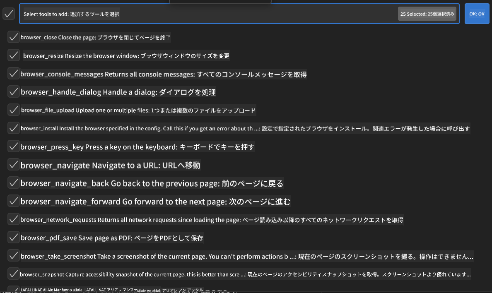
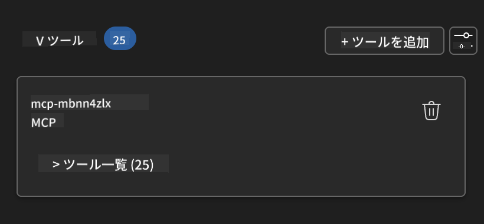
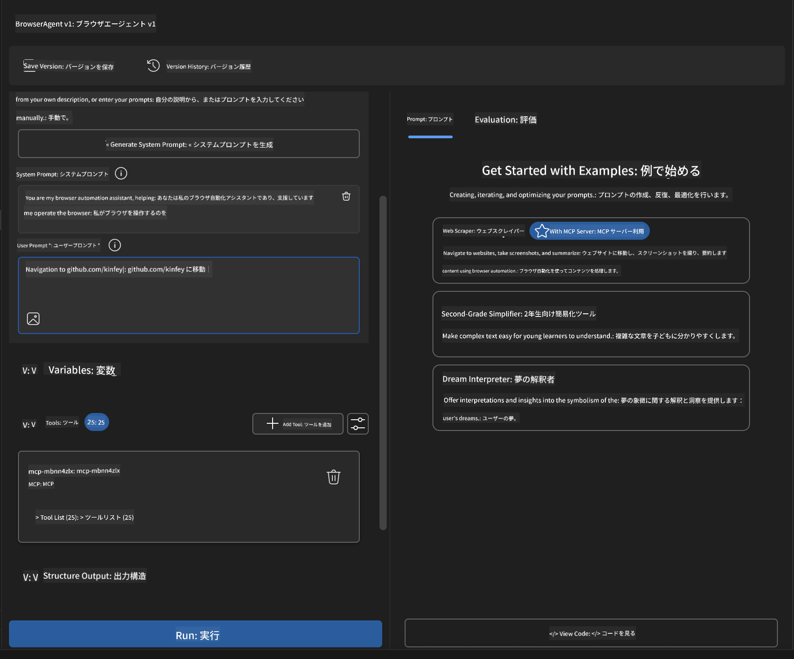
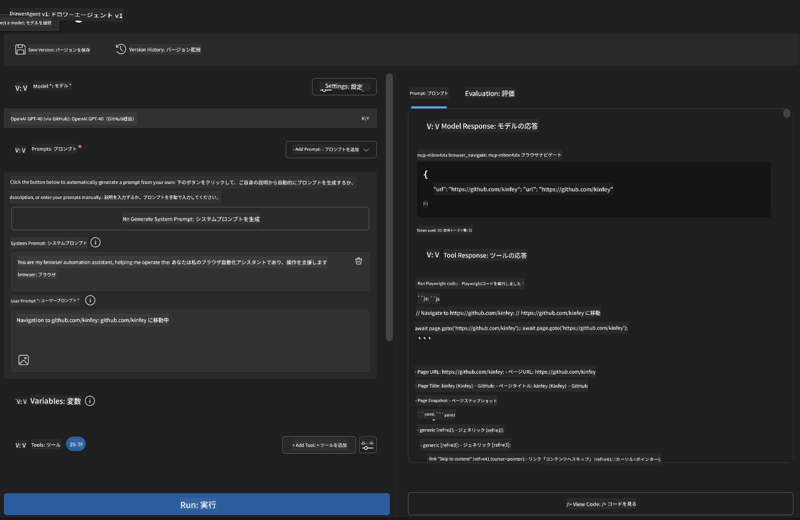
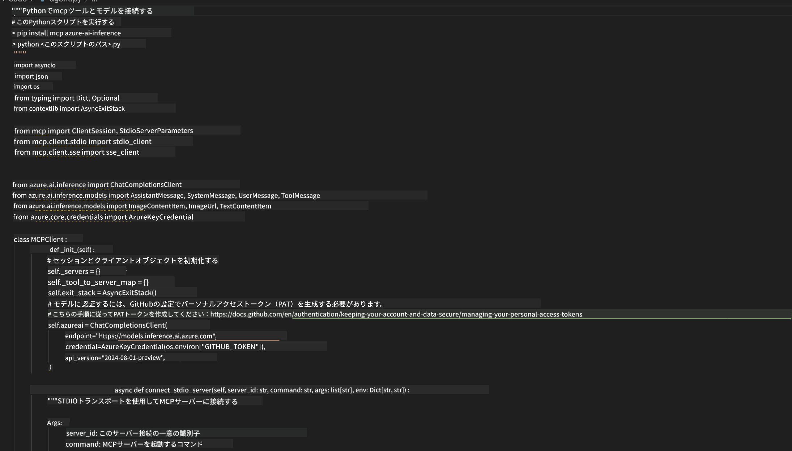

<!--
CO_OP_TRANSLATOR_METADATA:
{
  "original_hash": "a22b7dd11cd7690f99f9195877cafdc3",
  "translation_date": "2025-07-14T07:44:46+00:00",
  "source_file": "10-StreamliningAIWorkflowsBuildingAnMCPServerWithAIToolkit/lab2/README.md",
  "language_code": "ja"
}
-->
# 🌐 モジュール 2: MCP と AI Toolkit 基礎

[]()
[]()
[]()

## 📋 学習目標

このモジュールの終了時には、以下ができるようになります：
- ✅ Model Context Protocol (MCP) のアーキテクチャと利点を理解する
- ✅ Microsoft の MCP サーバーエコシステムを探る
- ✅ MCP サーバーを AI Toolkit Agent Builder と統合する
- ✅ Playwright MCP を使った実用的なブラウザ自動化エージェントを構築する
- ✅ エージェント内で MCP ツールを設定・テストする
- ✅ MCP 搭載エージェントをエクスポートし、本番環境に展開する

## 🎯 モジュール 1 の内容を踏まえて

モジュール 1 では AI Toolkit の基本を習得し、最初の Python エージェントを作成しました。ここからは、革新的な **Model Context Protocol (MCP)** を通じて外部ツールやサービスと接続し、エージェントを **パワーアップ** させます。

これは、単なる電卓からフルコンピューターへのアップグレードのようなものです。あなたの AI エージェントは以下の能力を得ます：
- 🌐 ウェブサイトの閲覧と操作
- 📁 ファイルへのアクセスと操作
- 🔧 エンタープライズシステムとの統合
- 📊 API からのリアルタイムデータ処理

## 🧠 Model Context Protocol (MCP) の理解

### 🔍 MCP とは？

Model Context Protocol (MCP) は AI アプリケーションのための **「USB-C」** のような存在です。大規模言語モデル（LLM）を外部ツール、データソース、サービスに接続する革新的なオープン標準です。USB-C がケーブルの混乱を一つの汎用コネクタで解決したように、MCP は AI 統合の複雑さを一つの標準プロトコルで解消します。

### 🎯 MCP が解決する課題

**MCP 導入前：**
- 🔧 ツールごとにカスタム統合が必要
- 🔄 ベンダーロックインによる独自ソリューション依存
- 🔒 臨時接続によるセキュリティリスク
- ⏱️ 基本統合でも数ヶ月の開発期間

**MCP 導入後：**
- ⚡ プラグアンドプレイのツール統合
- 🔄 ベンダーに依存しないアーキテクチャ
- 🛡️ セキュリティのベストプラクティスを標準搭載
- 🚀 新機能追加が数分で完了

### 🏗️ MCP アーキテクチャの詳細

MCP は **クライアント・サーバーアーキテクチャ** を採用し、安全でスケーラブルなエコシステムを構築します：



**🔧 コアコンポーネント：**

| コンポーネント | 役割 | 例 |
|-----------|------|----------|
| **MCP Hosts** | MCP サービスを利用するアプリケーション | Claude Desktop、VS Code、AI Toolkit |
| **MCP Clients** | プロトコルハンドラー（サーバーと1対1） | ホストアプリに組み込み |
| **MCP Servers** | 標準プロトコルで機能を提供 | Playwright、Files、Azure、GitHub |
| **Transport Layer** | 通信手段 | stdio、HTTP、WebSockets |

## 🏢 Microsoft の MCP サーバーエコシステム

Microsoft は実際のビジネスニーズに応えるエンタープライズグレードのサーバー群で MCP エコシステムをリードしています。

### 🌟 Microsoft MCP サーバーの紹介

#### 1. ☁️ Azure MCP Server
**🔗 リポジトリ**: [azure/azure-mcp](https://github.com/azure/azure-mcp)  
**🎯 目的**: AI 統合による包括的な Azure リソース管理

**✨ 主な特徴：**
- 宣言的インフラ構築
- リアルタイムリソース監視
- コスト最適化の提案
- セキュリティコンプライアンスチェック

**🚀 利用例：**
- AI 支援の Infrastructure-as-Code
- 自動リソーススケーリング
- クラウドコスト最適化
- DevOps ワークフロー自動化

#### 2. 📊 Microsoft Dataverse MCP
**📚 ドキュメント**: [Microsoft Dataverse Integration](https://go.microsoft.com/fwlink/?linkid=2320176)  
**🎯 目的**: ビジネスデータの自然言語インターフェース

**✨ 主な特徴：**
- 自然言語によるデータベースクエリ
- ビジネスコンテキストの理解
- カスタムプロンプトテンプレート
- エンタープライズデータガバナンス

**🚀 利用例：**
- ビジネスインテリジェンスレポート
- 顧客データ分析
- セールスパイプラインの洞察
- コンプライアンスデータクエリ

#### 3. 🌐 Playwright MCP Server
**🔗 リポジトリ**: [microsoft/playwright-mcp](https://github.com/microsoft/playwright-mcp)  
**🎯 目的**: ブラウザ自動化とウェブ操作機能

**✨ 主な特徴：**
- クロスブラウザ自動化（Chrome、Firefox、Safari）
- インテリジェントな要素検出
- スクリーンショット・PDF生成
- ネットワークトラフィック監視

**🚀 利用例：**
- 自動テストワークフロー
- ウェブスクレイピングとデータ抽出
- UI/UX 監視
- 競合分析の自動化

#### 4. 📁 Files MCP Server
**🔗 リポジトリ**: [microsoft/files-mcp-server](https://github.com/microsoft/files-mcp-server)  
**🎯 目的**: インテリジェントなファイルシステム操作

**✨ 主な特徴：**
- 宣言的ファイル管理
- コンテンツ同期
- バージョン管理統合
- メタデータ抽出

**🚀 利用例：**
- ドキュメント管理
- コードリポジトリ整理
- コンテンツ公開ワークフロー
- データパイプラインのファイル処理

#### 5. 📝 MarkItDown MCP Server
**🔗 リポジトリ**: [microsoft/markitdown](https://github.com/microsoft/markitdown)  
**🎯 目的**: 高度な Markdown 処理と操作

**✨ 主な特徴：**
- リッチな Markdown パース
- フォーマット変換（MD ↔ HTML ↔ PDF）
- コンテンツ構造解析
- テンプレート処理

**🚀 利用例：**
- 技術文書ワークフロー
- コンテンツ管理システム
- レポート生成
- ナレッジベース自動化

#### 6. 📈 Clarity MCP Server
**📦 パッケージ**: [@microsoft/clarity-mcp-server](https://www.npmjs.com/package/@microsoft/clarity-mcp-server)  
**🎯 目的**: ウェブ解析とユーザー行動の洞察

**✨ 主な特徴：**
- ヒートマップデータ解析
- ユーザーセッション録画
- パフォーマンス指標
- コンバージョンファネル分析

**🚀 利用例：**
- ウェブサイト最適化
- ユーザー体験調査
- A/B テスト分析
- ビジネスインテリジェンスダッシュボード

### 🌍 コミュニティエコシステム

Microsoft のサーバーに加え、MCP エコシステムには以下も含まれます：
- **🐙 GitHub MCP**：リポジトリ管理とコード解析
- **🗄️ データベース MCP**：PostgreSQL、MySQL、MongoDB 統合
- **☁️ クラウドプロバイダー MCP**：AWS、GCP、Digital Ocean ツール
- **📧 コミュニケーション MCP**：Slack、Teams、メール統合

## 🛠️ ハンズオンラボ：ブラウザ自動化エージェントの構築

**🎯 プロジェクト目標**：Playwright MCP サーバーを使い、ウェブサイトをナビゲートし情報を抽出、複雑なウェブ操作を行うインテリジェントなブラウザ自動化エージェントを作成する。

### 🚀 フェーズ 1：エージェント基盤のセットアップ

#### ステップ 1: エージェントの初期化
1. **AI Toolkit Agent Builder を開く**
2. **新規エージェント作成** 以下の設定で：
   - **名前**：`BrowserAgent`
   - **モデル**：GPT-4o を選択



### 🔧 フェーズ 2：MCP 統合ワークフロー

#### ステップ 3: MCP サーバー統合の追加
1. **Agent Builder のツールセクションに移動**
2. **「Add Tool」をクリック** して統合メニューを開く
3. **「MCP Server」を選択**



**🔍 ツールタイプの理解：**
- **Built-in Tools**：事前設定済みの AI Toolkit 機能
- **MCP Servers**：外部サービス統合
- **Custom APIs**：独自サービスエンドポイント
- **Function Calling**：モデルの関数直接呼び出し

#### ステップ 4: MCP サーバーの選択
1. **「MCP Server」オプションを選択して続行**


2. **MCP カタログを閲覧し利用可能な統合を探す**


### 🎮 フェーズ 3：Playwright MCP の設定

#### ステップ 5: Playwright の選択と設定
1. **「Use Featured MCP Servers」をクリックし Microsoft の認定サーバーにアクセス**
2. **リストから「Playwright」を選択**
3. **デフォルトの MCP ID を受け入れるか環境に合わせてカスタマイズ**


#### ステップ 6: Playwright 機能の有効化
**🔑 重要なステップ**：最大限の機能を得るために Playwright の全メソッドを選択



**🛠️ 必須 Playwright ツール：**
- **ナビゲーション**：`goto`, `goBack`, `goForward`, `reload`
- **操作**：`click`, `fill`, `press`, `hover`, `drag`
- **抽出**：`textContent`, `innerHTML`, `getAttribute`
- **検証**：`isVisible`, `isEnabled`, `waitForSelector`
- **キャプチャ**：`screenshot`, `pdf`, `video`
- **ネットワーク**：`setExtraHTTPHeaders`, `route`, `waitForResponse`

#### ステップ 7: 統合の成功確認
**✅ 成功の目安：**
- すべてのツールが Agent Builder のインターフェースに表示される
- 統合パネルにエラーメッセージがない
- Playwright サーバーのステータスが「Connected」と表示される



**🔧 よくある問題の対処法：**
- **接続失敗**：インターネット接続とファイアウォール設定を確認
- **ツールが表示されない**：セットアップ時に全機能が選択されているか確認
- **権限エラー**：VS Code に必要なシステム権限があるか確認

### 🎯 フェーズ 4：高度なプロンプト設計

#### ステップ 8: インテリジェントなシステムプロンプトの設計
Playwright の全機能を活用する洗練されたプロンプトを作成：

```markdown
# Web Automation Expert System Prompt

## Core Identity
You are an advanced web automation specialist with deep expertise in browser automation, web scraping, and user experience analysis. You have access to Playwright tools for comprehensive browser control.

## Capabilities & Approach
### Navigation Strategy
- Always start with screenshots to understand page layout
- Use semantic selectors (text content, labels) when possible
- Implement wait strategies for dynamic content
- Handle single-page applications (SPAs) effectively

### Error Handling
- Retry failed operations with exponential backoff
- Provide clear error descriptions and solutions
- Suggest alternative approaches when primary methods fail
- Always capture diagnostic screenshots on errors

### Data Extraction
- Extract structured data in JSON format when possible
- Provide confidence scores for extracted information
- Validate data completeness and accuracy
- Handle pagination and infinite scroll scenarios

### Reporting
- Include step-by-step execution logs
- Provide before/after screenshots for verification
- Suggest optimizations and alternative approaches
- Document any limitations or edge cases encountered

## Ethical Guidelines
- Respect robots.txt and rate limiting
- Avoid overloading target servers
- Only extract publicly available information
- Follow website terms of service
```

#### ステップ 9: 動的なユーザープロンプトの作成
さまざまな機能を示すプロンプトを設計：

**🌐 ウェブ解析の例：**
```markdown
Navigate to github.com/kinfey and provide a comprehensive analysis including:
1. Repository structure and organization
2. Recent activity and contribution patterns  
3. Documentation quality assessment
4. Technology stack identification
5. Community engagement metrics
6. Notable projects and their purposes

Include screenshots at key steps and provide actionable insights.
```



### 🚀 フェーズ 5：実行とテスト

#### ステップ 10: 最初の自動化を実行
1. **「Run」をクリックして自動化シーケンスを開始**
2. **リアルタイム実行を監視**：
   - Chrome ブラウザが自動起動
   - エージェントがターゲットサイトに移動
   - 主要なステップごとにスクリーンショットを取得
   - 分析結果がリアルタイムでストリームされる


#### ステップ 11: 結果と洞察の分析
Agent Builder のインターフェースで詳細な分析結果を確認：



### 🌟 フェーズ 6：高度な機能と展開

#### ステップ 12: エクスポートと本番展開
Agent Builder は複数の展開オプションをサポート：



## 🎓 モジュール 2 のまとめと次のステップ

### 🏆 達成したスキル：MCP 統合マスター

**✅ 習得内容：**
- [ ] MCP のアーキテクチャと利点の理解
- [ ] Microsoft の MCP サーバーエコシステムの活用
- [ ] Playwright MCP と AI Toolkit の統合
- [ ] 高度なブラウザ自動化エージェントの構築
- [ ] ウェブ自動化のための高度なプロンプト設計

### 📚 追加リソース

- **🔗 MCP 仕様**： [公式プロトコルドキュメント](https://modelcontextprotocol.io/)
- **🛠️ Playwright API**： [完全なメソッドリファレンス](https://playwright.dev/docs/api/class-playwright)
- **🏢 Microsoft MCP サーバー**： [エンタープライズ統合ガイド](https://github.com/microsoft/mcp-servers)
- **🌍 コミュニティ例**： [MCP サーバーギャラリー](https://github.com/modelcontextprotocol/servers)

**🎉 おめでとうございます！** MCP 統合をマスターし、外部ツール機能を備えた本番対応の AI エージェントを構築できるようになりました！

### 🔜 次のモジュールへ進む

MCP スキルをさらに高めたいですか？次の **[モジュール 3: AI Toolkit を使った高度な MCP 開発](../lab3/README.md)** では、以下を学びます：
- 独自のカスタム MCP サーバーの作成
- 最新の MCP Python SDK の設定と利用
- MCP Inspector を使ったデバッグ
- 高度な MCP サーバー開発ワークフローの習得
- ゼロからWeather MCPサーバーを構築する

**免責事項**：  
本書類はAI翻訳サービス「[Co-op Translator](https://github.com/Azure/co-op-translator)」を使用して翻訳されました。正確性の向上に努めておりますが、自動翻訳には誤りや不正確な部分が含まれる可能性があります。原文の言語によるオリジナル文書が正式な情報源とみなされるべきです。重要な情報については、専門の人間による翻訳を推奨します。本翻訳の利用により生じたいかなる誤解や誤訳についても、当方は一切の責任を負いかねます。