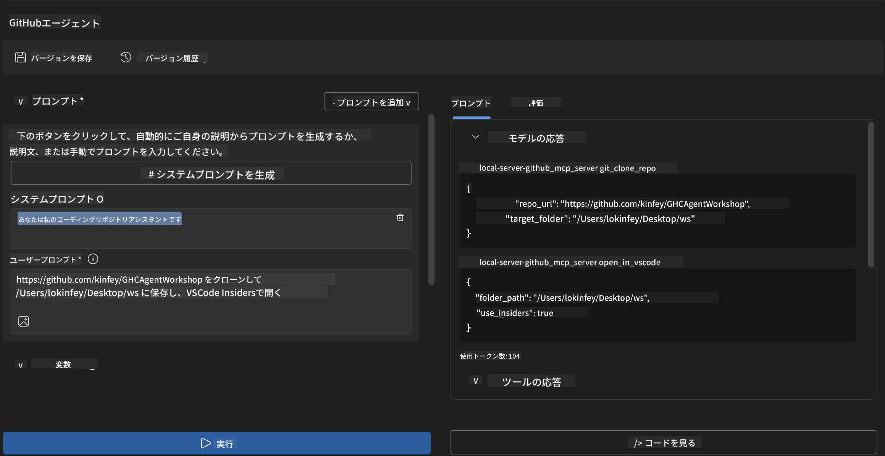
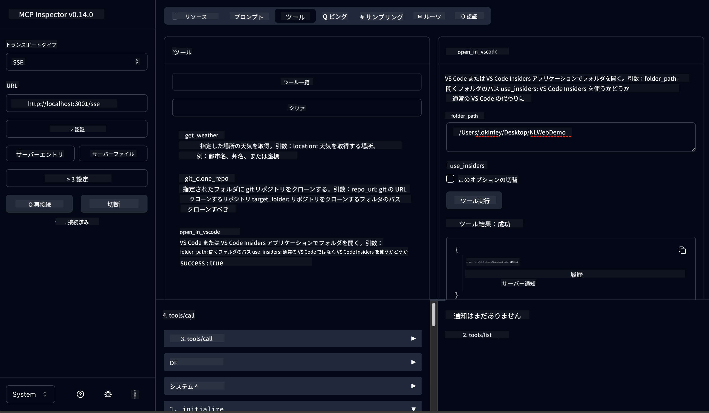

<!--
CO_OP_TRANSLATOR_METADATA:
{
  "original_hash": "f83bc722dc758efffd68667d6a1db470",
  "translation_date": "2025-07-14T08:38:17+00:00",
  "source_file": "10-StreamliningAIWorkflowsBuildingAnMCPServerWithAIToolkit/lab4/README.md",
  "language_code": "ja"
}
-->
# 🐙 モジュール4: 実践的MCP開発 - カスタムGitHubクローンサーバー


> **⚡ クイックスタート:** たった30分で、GitHubリポジトリのクローン作成とVS Code連携を自動化する本番対応のMCPサーバーを構築しましょう！

## 🎯 学習目標

このラボを終える頃には、以下ができるようになります：

- ✅ 実際の開発ワークフローに対応したカスタムMCPサーバーの作成
- ✅ MCPを通じたGitHubリポジトリのクローン機能の実装
- ✅ カスタムMCPサーバーとVS CodeおよびAgent Builderの統合
- ✅ GitHub Copilot Agent ModeをカスタムMCPツールで活用
- ✅ 本番環境でのカスタムMCPサーバーのテストとデプロイ

## 📋 前提条件

- ラボ1〜3（MCPの基礎と高度な開発）の完了
- GitHub Copilotのサブスクリプション（[無料登録可能](https://github.com/github-copilot/signup)）
- AI ToolkitおよびGitHub Copilot拡張機能が入ったVS Code
- Git CLIのインストールと設定済み

## 🏗️ プロジェクト概要

### **実践的な開発課題**
開発者として、GitHubからリポジトリをクローンし、VS CodeやVS Code Insidersで開く作業は頻繁に行います。この手動の流れは以下の通りです：
1. ターミナルやコマンドプロンプトを開く
2. 目的のディレクトリに移動する
3. `git clone` コマンドを実行する
4. クローンしたディレクトリでVS Codeを開く

**このMCPソリューションは、これらを一つの賢いコマンドにまとめます！**

### **作成するもの**
**GitHub Clone MCPサーバー** (`git_mcp_server`) は以下を提供します：

| 機能 | 説明 | 利点 |
|---------|-------------|---------|
| 🔄 **スマートなリポジトリクローン** | GitHubリポジトリを検証付きでクローン | 自動エラーチェック |
| 📁 **インテリジェントなディレクトリ管理** | ディレクトリの存在確認と安全な作成 | 上書き防止 |
| 🚀 **クロスプラットフォームのVS Code連携** | VS Code/Insidersでプロジェクトを開く | スムーズなワークフロー移行 |
| 🛡️ **堅牢なエラーハンドリング** | ネットワーク、権限、パスの問題を処理 | 本番環境対応の信頼性 |

---

## 📖 ステップバイステップ実装

### ステップ1: Agent BuilderでGitHubエージェントを作成

1. AI Toolkit拡張機能から**Agent Builderを起動**
2. 以下の設定で**新しいエージェントを作成**：
   ```
   Agent Name: GitHubAgent
   ```

3. **カスタムMCPサーバーを初期化：**
   - **Tools** → **Add Tool** → **MCP Server**へ移動
   - **「Create A new MCP Server」**を選択
   - 最大限の柔軟性のため**Pythonテンプレート**を選択
   - **サーバー名:** `git_mcp_server`

### ステップ2: GitHub Copilot Agent Modeの設定

1. VS CodeでGitHub Copilotを開く（Ctrl/Cmd + Shift + P → 「GitHub Copilot: Open」）
2. Copilotインターフェースで**Agent Modelを選択**
3. 高度な推論能力のため**Claude 3.7モデルを選択**
4. ツールアクセスのため**MCP連携を有効化**

> **💡 プロのヒント:** Claude 3.7は開発ワークフローやエラーハンドリングパターンの理解に優れています。

### ステップ3: MCPサーバーのコア機能を実装

**GitHub Copilot Agent Modeで以下の詳細プロンプトを使用：**

```
Create two MCP tools with the following comprehensive requirements:

🔧 TOOL A: clone_repository
Requirements:
- Clone any GitHub repository to a specified local folder
- Return the absolute path of the successfully cloned project
- Implement comprehensive validation:
  ✓ Check if target directory already exists (return error if exists)
  ✓ Validate GitHub URL format (https://github.com/user/repo)
  ✓ Verify git command availability (prompt installation if missing)
  ✓ Handle network connectivity issues
  ✓ Provide clear error messages for all failure scenarios

🚀 TOOL B: open_in_vscode
Requirements:
- Open specified folder in VS Code or VS Code Insiders
- Cross-platform compatibility (Windows/Linux/macOS)
- Use direct application launch (not terminal commands)
- Auto-detect available VS Code installations
- Handle cases where VS Code is not installed
- Provide user-friendly error messages

Additional Requirements:
- Follow MCP 1.9.3 best practices
- Include proper type hints and documentation
- Implement logging for debugging purposes
- Add input validation for all parameters
- Include comprehensive error handling
```

### ステップ4: MCPサーバーのテスト

#### 4a. Agent Builderでのテスト

1. Agent Builderのデバッグ構成を起動
2. 以下のシステムプロンプトでエージェントを設定：

```
SYSTEM_PROMPT:
You are my intelligent coding repository assistant. You help developers efficiently clone GitHub repositories and set up their development environment. Always provide clear feedback about operations and handle errors gracefully.
```

3. 実際のユーザーシナリオでテスト：

```
USER_PROMPT EXAMPLES:

Scenario : Basic Clone and Open
"Clone {Your GitHub Repo link such as https://github.com/kinfey/GHCAgentWorkshop
 } and save to {The global path you specify}, then open it with VS Code Insiders"
```



**期待される結果：**
- ✅ パス確認付きで正常にクローンできる
- ✅ 自動的にVS Codeが起動する
- ✅ 無効なケースで明確なエラーメッセージが表示される
- ✅ エッジケースも適切に処理される

#### 4b. MCP Inspectorでのテスト



---

**🎉 おめでとうございます！** 実践的で本番対応可能なMCPサーバーを無事に作成できました。あなたのカスタムGitHubクローンサーバーは、開発者の生産性を自動化・向上させるMCPの力を示しています。

### 🏆 達成したこと：
- ✅ **MCP開発者** - カスタムMCPサーバーを作成
- ✅ **ワークフロー自動化者** - 開発プロセスを効率化  
- ✅ **統合エキスパート** - 複数の開発ツールを連携
- ✅ **本番対応** - デプロイ可能なソリューションを構築

---

## 🎓 ワークショップ完了：Model Context Protocolとの旅

**ワークショップ参加者の皆さまへ、**

Model Context Protocolワークショップの4つのモジュールをすべて修了おめでとうございます！AI Toolkitの基本から始まり、実際の開発課題を解決する本番対応のMCPサーバー構築まで、長い道のりを歩んできました。

### 🚀 学習の振り返り：

**[モジュール1](../lab1/README.md)**：AI Toolkitの基礎、モデルテスト、最初のAIエージェント作成を学習。

**[モジュール2](../lab2/README.md)**：MCPアーキテクチャを理解し、Playwright MCPを統合、初のブラウザ自動化エージェントを構築。

**[モジュール3](../lab3/README.md)**：カスタムMCPサーバー開発に進み、Weather MCPサーバーとデバッグツールを習得。

**[モジュール4](../lab4/README.md)**：実践的なGitHubリポジトリワークフロー自動化ツールを作成。

### 🌟 習得したスキル：

- ✅ **AI Toolkitエコシステム**：モデル、エージェント、統合パターン
- ✅ **MCPアーキテクチャ**：クライアント・サーバ設計、通信プロトコル、セキュリティ
- ✅ **開発ツール**：Playground、Inspectorから本番デプロイまで
- ✅ **カスタム開発**：MCPサーバーの構築、テスト、デプロイ
- ✅ **実践的応用**：AIを活用した実際のワークフロー課題の解決

### 🔮 次のステップ：

1. **自分だけのMCPサーバーを構築**：独自のワークフロー自動化に挑戦
2. **MCPコミュニティに参加**：作品を共有し、他者から学ぶ
3. **高度な統合を探求**：MCPサーバーを企業システムに接続
4. **オープンソースに貢献**：MCPツールやドキュメントの改善に協力

このワークショップはあくまで始まりです。Model Context Protocolのエコシステムは急速に進化しており、あなたはAI駆動の開発ツールの最前線に立つ準備ができています。

**ご参加と学習への熱意に感謝します！**

このワークショップが、あなたの開発におけるAIツールの活用方法を変えるきっかけとなることを願っています。

**楽しいコーディングを！**

---

**免責事項**：  
本書類はAI翻訳サービス「[Co-op Translator](https://github.com/Azure/co-op-translator)」を使用して翻訳されました。正確性を期しておりますが、自動翻訳には誤りや不正確な部分が含まれる可能性があります。原文の言語によるオリジナル文書が正式な情報源とみなされるべきです。重要な情報については、専門の人間による翻訳を推奨します。本翻訳の利用により生じた誤解や誤訳について、当方は一切の責任を負いかねます。