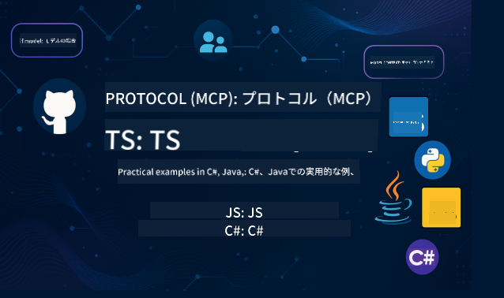

<!--
CO_OP_TRANSLATOR_METADATA:
{
  "original_hash": "a3b97186cd9162b9fe9b90261e63e32d",
  "translation_date": "2025-06-13T13:56:49+00:00",
  "source_file": "README.md",
  "language_code": "ja"
}
-->
 

これらのリソースを使い始めるには、以下の手順に従ってください：
1. **リポジトリをフォークする**: クリック 
2. **リポジトリをクローンする**:   `git clone https://github.com/microsoft/mcp-for-beginners.git`
3. [**Azure AI Foundry Discordに参加して、専門家や他の開発者と交流しましょう**](https://discord.com/invite/ByRwuEEgH4)

### 🌐 多言語対応

#### GitHub Actionでサポート（自動化され、常に最新）
[フランス語](../fr/README.md) | [スペイン語](../es/README.md) | [ドイツ語](../de/README.md) | [ロシア語](../ru/README.md) | [アラビア語](../ar/README.md) | [ペルシャ語 (ファルシ)](../fa/README.md) | [ウルドゥー語](../ur/README.md) | [中国語（簡体字）](../zh/README.md) | [中国語（繁体字、マカオ）](../mo/README.md) | [中国語（繁体字、香港）](../hk/README.md) | [中国語（繁体字、台湾）](../tw/README.md) | [日本語](./README.md) | [韓国語](../ko/README.md) | [ヒンディー語](../hi/README.md) | [ベンガル語](../bn/README.md) | [マラーティー語](../mr/README.md) | [ネパール語](../ne/README.md) | [パンジャブ語（グルムキー）](../pa/README.md) | [ポルトガル語（ポルトガル）](../pt/README.md) | [ポルトガル語（ブラジル）](../br/README.md) | [イタリア語](../it/README.md) | [ポーランド語](../pl/README.md) | [トルコ語](../tr/README.md) | [ギリシャ語](../el/README.md) | [タイ語](../th/README.md) | [スウェーデン語](../sv/README.md) | [デンマーク語](../da/README.md) | [ノルウェー語](../no/README.md) | [フィンランド語](../fi/README.md) | [オランダ語](../nl/README.md) | [ヘブライ語](../he/README.md) | [ベトナム語](../vi/README.md) | [インドネシア語](../id/README.md) | [マレー語](../ms/README.md) | [タガログ語（フィリピン）](../tl/README.md) | [スワヒリ語](../sw/README.md) | [ハンガリー語](../hu/README.md) | [チェコ語](../cs/README.md) | [スロバキア語](../sk/README.md) | [ルーマニア語](../ro/README.md) | [ブルガリア語](../bg/README.md) | [セルビア語（キリル）](../sr/README.md) | [クロアチア語](../hr/README.md) | [スロベニア語](../sl/README.md)左から右へ出力してください。
# 🚀 Model Context Protocol (MCP) 初心者向けカリキュラム

## **C#, Java, JavaScript, Python, TypeScriptで学ぶMCPの実践コード例**

## 🧠 Model Context Protocolカリキュラムの概要

**Model Context Protocol (MCP)** は、AIモデルとクライアントアプリケーション間のやり取りを標準化するために設計された最先端のフレームワークです。このオープンソースのカリキュラムは、C#, Java, JavaScript, TypeScript, Pythonといった主要なプログラミング言語での実践的なコード例や実際のユースケースを通じて、体系的な学習パスを提供します。

AI開発者、システムアーキテクト、ソフトウェアエンジニアのいずれであっても、このガイドはMCPの基本から実装戦略までをマスターするための包括的なリソースです。

## 🔗 公式MCPリソース

- 📘 [MCPドキュメント](https://modelcontextprotocol.io/) – 詳細なチュートリアルとユーザーガイド  
- 📜 [MCP仕様書](https://spec.modelcontextprotocol.io/) – プロトコルの構造と技術的リファレンス  
- 🧑‍💻 [MCP GitHubリポジトリ](https://github.com/modelcontextprotocol) – オープンソースのSDK、ツール、コードサンプル  

## 🧭 MCPカリキュラム全体構成

| Ch | タイトル | 説明 | リンク |
|--|--|--|--|
| 00 | **MCP入門** | Model Context Protocolの概要とAIパイプラインにおける重要性、MCPとは何か、標準化の意義、実用的なユースケースと利点 | [入門](./00-Introduction/README.md) |
| 01 | **コアコンセプトの解説** | MCPのコアコンセプトを詳しく解説、クライアント・サーバーアーキテクチャ、主要なプロトコル要素、メッセージングパターンについて | [コアコンセプト](./01-CoreConcepts/README.md) |
| 02 | **MCPのセキュリティ** | MCPベースのシステムにおけるセキュリティ脅威の特定、実装を安全にするための技術とベストプラクティス | [セキュリティ](./02-Security/README.md) |
| 03 | **MCPの始め方** | 環境構築と設定、基本的なMCPサーバーとクライアントの作成、既存アプリケーションへのMCP統合 | [始め方](./03-GettingStarted/README.md) |
| 3.1 | **最初のサーバー** | MCPプロトコルを使った基本的なサーバーのセットアップ、サーバーとクライアントのやり取りの理解、サーバーのテスト | [最初のサーバー](./03-GettingStarted/01-first-server/README.md) |
| 3.2 | **最初のクライアント**  | MCPプロトコルを使った基本的なクライアントのセットアップ、クライアントとサーバーのやり取りの理解、クライアントのテスト | [最初のクライアント](./03-GettingStarted/02-client/README.md) |
| 3.3 | **LLMを使ったクライアント**  | MCPプロトコルで大規模言語モデル（LLM）を利用するクライアントのセットアップ | [LLMクライアント](./03-GettingStarted/03-llm-client/README.md) |
| 3.4 | **Visual Studio Codeでサーバーを利用する** | Visual Studio Codeを設定してMCPプロトコルを使ったサーバーを利用する方法 | [VS Codeでサーバーを利用](./03-GettingStarted/04-vscode/README.md) |
| 3.5 | **SSEを使ったサーバーの作成** | SSEを使ってサーバーをインターネットに公開する方法。このセクションでSSEを使ったサーバー作成を学びます | [SSEでサーバー作成](./03-GettingStarted/05-sse-server/README.md) |
| 3.6 | **HTTPストリーミング** | クライアントとMCPサーバー間でリアルタイムデータ転送を実現するHTTPストリーミングの実装方法 | [HTTPストリーミング](./03-GettingStarted/06-http-streaming/README.md) |
| 3.7 | **AIツールキットの活用** | AIツールキットはAIとMCPのワークフロー管理に役立つ優れたツールです | [AIツールキットの活用](./03-GettingStarted/07-aitk/README.md) |
| 3.8 | **サーバーのテスト** | テストは開発プロセスの重要な部分です。さまざまなツールを使ったテスト方法を学びます | [サーバーテスト](./03-GettingStarted/08-testing/README.md) |
| 3.9 | **サーバーのデプロイ** | ローカル開発から本番環境への移行方法。このセクションでサーバーの開発とデプロイを学びます | [サーバーデプロイ](./03-GettingStarted/09-deployment/README.md) |
| 04 | **実践的な実装** | 各言語のSDK利用、デバッグ、テスト、検証、再利用可能なプロンプトテンプレートやワークフローの作成 | [実践的実装](./04-PracticalImplementation/README.md) |
| 05 | **MCPの高度なトピック** | マルチモーダルAIワークフローと拡張性、安全なスケーリング戦略、エンタープライズ環境におけるMCP | [高度なトピック](./05-AdvancedTopics/README.md) |
| 5.1 | **AzureとのMCP統合** | Azureとの統合例を紹介 | [Azure統合](./05-AdvancedTopics/mcp-integration/README.md) |
| 5.2 | **マルチモダリティ** | 画像など異なるモダリティの扱い方を解説 | [マルチモダリティ](./05-AdvancedTopics/mcp-multi-modality/README.md) |
| 5.3 | **MCP OAuth2デモ** | MCPを使ったOAuth2の最小限Spring Bootアプリ。認証・リソースサーバーとして動作し、安全なトークン発行、保護されたエンドポイント、Azure Container Appsへのデプロイ、API管理連携を実演 | [OAuth2デモ](./05-AdvancedTopics/mcp-oauth2-demo/README.md) |
| 5.4 | **ルートコンテキスト** | ルートコンテキストについて詳しく学び、実装方法を解説 | [ルートコンテキスト](./05-AdvancedTopics/mcp-root-contexts/README.md) |
| 5.5 | **ルーティング** | さまざまなルーティングの種類を学ぶ | [ルーティング](./05-AdvancedTopics/mcp-routing/README.md) |
| 5.6 | **サンプリング** | サンプリングの使い方を学ぶ | [サンプリング](./05-AdvancedTopics/mcp-sampling/README.md) |
| 5.7 | **スケーリング** | MCPサーバーのスケーリング方法、水平・垂直スケーリング戦略、リソース最適化、パフォーマンスチューニングについて | [スケーリング](./05-AdvancedTopics/mcp-scaling/README.md) |
| 5.8 | **セキュリティ** | MCPサーバーのセキュリティ対策、認証・認可、データ保護戦略 | [セキュリティ](./05-AdvancedTopics/mcp-security/README.md) |
| 5.9 | **Web Search MCP** | SerpAPIと連携したPython MCPサーバー・クライアント。リアルタイムのウェブ、ニュース、商品検索、Q&Aを実演。マルチツールオーケストレーション、外部API連携、堅牢なエラーハンドリングを紹介 | [Web Search MCP](./05-AdvancedTopics/web-search-mcp/README.md) |
| 5.10 | **リアルタイムストリーミング** | 今日のデータ駆動型社会で不可欠なリアルタイムデータストリーミング。ビジネスやアプリケーションが即時情報アクセスで迅速な意思決定を行うための手法 | [リアルタイムストリーミング](./05-AdvancedTopics/mcp-realtimestreaming/README.md) |
| 5.11 | **リアルタイムウェブ検索** | MCPがAIモデル、検索エンジン、アプリケーション間でのコンテキスト管理を標準化し、リアルタイムウェブ検索を変革する方法 | [リアルタイムウェブ検索](./05-AdvancedTopics/mcp-realtimesearch/README.md) |
| 06 | **コミュニティへの貢献** | コードやドキュメントの貢献方法、GitHubでの協力、コミュニティ主導の改善とフィードバック | [コミュニティ貢献](./06-CommunityContributions/README.md) |
| 07 | **早期導入からの洞察** | 実際の導入事例と効果的だった点、MCPベースのソリューションの構築と展開、トレンドと今後のロードマップ | [Insights](./07-LessonsFromEarlyAdoption/README.md) |
| 08 | **MCPのベストプラクティス** | パフォーマンスチューニングと最適化、フォールトトレラントなMCPシステム設計、テストとレジリエンス戦略 | [Best Practices](./08-BestPractices/README.md) |
| 09 | **MCPケーススタディ** | MCPソリューションアーキテクチャの詳細解説、展開ブループリントと統合のヒント、注釈付き図解とプロジェクトウォークスルー | [Case Studies](./09-CaseStudy/README.md) |
| 10 | **AIワークフローの効率化：AI Toolkitを使ったMCPサーバー構築** | MCPとMicrosoftのAI Toolkit for VS Codeを組み合わせた実践的ワークショップ。基本、カスタムサーバー開発、運用展開戦略をカバーするモジュールを通じて、AIモデルと実世界のツールをつなぐインテリジェントなアプリケーション構築を学びます。 | [Hands On Lab](./10-StreamliningAIWorkflowsBuildingAnMCPServerWithAIToolkit/README.md) |

## サンプルプロジェクト

### 🧮 MCP計算機サンプルプロジェクト：

  
<strong>言語別コード実装を探る</strong>

  - [C# MCPサーバー例](./03-GettingStarted/samples/csharp/README.md)
  - [Java MCP計算機](./03-GettingStarted/samples/java/calculator/README.md)
  - [JavaScript MCPデモ](./03-GettingStarted/samples/javascript/README.md)
  - [Python MCPサーバー](../../03-GettingStarted/samples/python/mcp_calculator_server.py)
  - [TypeScript MCP例](./03-GettingStarted/samples/typescript/README.md)

### 💡 MCP高度計算機プロジェクト：

  
<strong>高度なサンプルを探る</strong>

  - [高度なC#サンプル](./04-PracticalImplementation/samples/csharp/README.md)
  - [Javaコンテナアプリ例](./04-PracticalImplementation/samples/java/containerapp/README.md)
  - [JavaScript高度サンプル](./04-PracticalImplementation/samples/javascript/README.md)
  - [Python複雑実装](../../04-PracticalImplementation/samples/python/mcp_sample.py)
  - [TypeScriptコンテナサンプル](./04-PracticalImplementation/samples/typescript/README.md)

## 🎯 MCP学習の前提条件

このカリキュラムを最大限に活用するには、以下が望ましいです：

- C#、Java、またはPythonの基本知識
- クライアントサーバーモデルとAPIの理解
- （任意）機械学習の基礎知識

## 📚 学習ガイド

効果的にリポジトリを活用できるよう、包括的な[学習ガイド](./study_guide.md)を用意しています。内容は以下を含みます：

- すべてのトピックを示したビジュアルカリキュラムマップ
- 各リポジトリセクションの詳細な内訳
- サンプルプロジェクトの活用方法
- スキルレベル別の推奨学習パス
- 学習を補完する追加リソース

## 🛠️ このカリキュラムの効果的な使い方

各レッスンには以下が含まれます：

1. MCPの概念をわかりやすく解説  
2. 複数言語によるライブコード例  
3. 実際のMCPアプリケーション構築の演習  
4. 上級者向けの追加リソース  

## 📜 ライセンス情報

本コンテンツは**MITライセンス**の下で提供されています。利用条件は[LICENSE](../../LICENSE)をご覧ください。

## 🤝 コントリビューションガイドライン

本プロジェクトは貢献と提案を歓迎します。ほとんどの貢献には、あなたが権利を有し、実際に当社に貢献の使用権を付与することを宣言するContributor License Agreement（CLA）への同意が必要です。詳細は <https://cla.opensource.microsoft.com> をご覧ください。

プルリクエストを送信すると、CLAボットが自動的にCLAの提出が必要かを判定し、PRに適切な装飾（ステータスチェックやコメントなど）を行います。ボットの指示に従うだけで手続きは完了します。CLAは当社のCLAを使用するすべてのリポジトリで一度だけ必要です。

本プロジェクトは[Microsoft Open Source Code of Conduct](https://opensource.microsoft.com/codeofconduct/)を採用しています。詳細は[Code of Conduct FAQ](https://opensource.microsoft.com/codeofconduct/faq/)をご覧いただくか、ご質問があれば[opencode@microsoft.com](mailto:opencode@microsoft.com)までご連絡ください。

## 🎒 その他のコース
当チームでは他にもコースを提供しています。ぜひご覧ください：

- [AI Agents For Beginners](https://github.com/microsoft/ai-agents-for-beginners?WT.mc_id=academic-105485-koreyst)
- [.NETで学ぶ初心者向け生成AI](https://github.com/microsoft/Generative-AI-for-beginners-dotnet?WT.mc_id=academic-105485-koreyst)
- [JavaScriptで学ぶ初心者向け生成AI](https://github.com/microsoft/generative-ai-with-javascript?WT.mc_id=academic-105485-koreyst)
- [初心者向け生成AI](https://github.com/microsoft/generative-ai-for-beginners?WT.mc_id=academic-105485-koreyst)
- [ML for Beginners](https://aka.ms/ml-beginners?WT.mc_id=academic-105485-koreyst)
- [Data Science for Beginners](https://aka.ms/datascience-beginners?WT.mc_id=academic-105485-koreyst)
- [AI for Beginners](https://aka.ms/ai-beginners?WT.mc_id=academic-105485-koreyst)
- [Cybersecurity for Beginners](https://github.com/microsoft/Security-101??WT.mc_id=academic-96948-sayoung)
- [Web Dev for Beginners](https://aka.ms/webdev-beginners?WT.mc_id=academic-105485-koreyst)
- [IoT for Beginners](https://aka.ms/iot-beginners?WT.mc_id=academic-105485-koreyst)
- [XR Development for Beginners](https://github.com/microsoft/xr-development-for-beginners?WT.mc_id=academic-105485-koreyst)
- [AIペアプログラミングのためのGitHub Copilotマスターガイド](https://aka.ms/GitHubCopilotAI?WT.mc_id=academic-105485-koreyst)
- [C#/.NET開発者のためのGitHub Copilotマスターガイド](https://github.com/microsoft/mastering-github-copilot-for-dotnet-csharp-developers?WT.mc_id=academic-105485-koreyst)
- [自分だけのCopilotアドベンチャーを選ぼう](https://github.com/microsoft/CopilotAdventures?WT.mc_id=academic-105485-koreyst)

## ™️ 商標に関する注意

本プロジェクトには、プロジェクト、製品、またはサービスの商標やロゴが含まれている場合があります。Microsoftの商標やロゴの正当な使用は、[Microsoftの商標およびブランドガイドライン](https://www.microsoft.com/legal/intellectualproperty/trademarks/usage/general)に従う必要があります。
本プロジェクトの改変版でMicrosoftの商標やロゴを使用する場合、混乱を招いたりMicrosoftの後援を示唆したりしてはなりません。
第三者の商標やロゴの使用は、それら第三者のポリシーに従う必要があります。

**免責事項**：  
本書類はAI翻訳サービス「Co-op Translator」（https://github.com/Azure/co-op-translator）を使用して翻訳されています。正確性を期しておりますが、自動翻訳には誤りや不正確な部分が含まれる可能性があることをご了承ください。原文の言語で記載されたオリジナル文書が正式な情報源とみなされます。重要な情報については、専門の人間による翻訳を推奨します。本翻訳の使用により生じたいかなる誤解や誤訳についても、一切の責任を負いかねます。