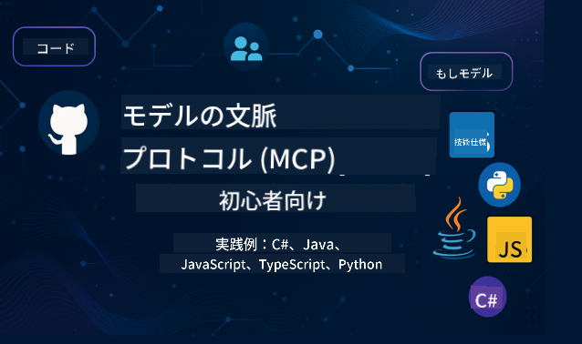

<!--
CO_OP_TRANSLATOR_METADATA:
{
  "original_hash": "2a21391378c12ecfef50f866329dfde0",
  "translation_date": "2025-05-17T05:07:16+00:00",
  "source_file": "README.md",
  "language_code": "ja"
}
-->

これらのリソースを使い始めるには以下の手順を実行してください：
1. **リポジトリをフォークする**: クリック 
2. **リポジトリをクローンする**:   `git clone https://github.com/microsoft/mcp-for-beginners.git`
3. [**Microsoft Azure AI Foundry Discordに参加して、専門家や他の開発者と交流する**](https://discord.com/invite/ByRwuEEgH4)

### 🌐 多言語サポート

#### GitHub Actionによるサポート（自動化され常に最新）
[フランス語](../fr/README.md) | [スペイン語](../es/README.md) | [ドイツ語](../de/README.md) | [ロシア語](../ru/README.md) | [アラビア語](../ar/README.md) | [ペルシャ語 (ファルシー)](../fa/README.md) | [ウルドゥー語](../ur/README.md) | [中国語 (簡体字)](../zh/README.md) | [中国語 (繁体字, マカオ)](../mo/README.md) | [中国語 (繁体字, 香港)](../hk/README.md) | [中国語 (繁体字, 台湾)](../tw/README.md) | [日本語](./README.md) | [韓国語](../ko/README.md) | [ヒンディー語](../hi/README.md) | [ベンガル語](../bn/README.md) | [マラーティー語](../mr/README.md) | [ネパール語](../ne/README.md) | [パンジャブ語 (グルムキー)](../pa/README.md) | [ポルトガル語 (ポルトガル)](../pt/README.md) | [ポルトガル語 (ブラジル)](../br/README.md) | [イタリア語](../it/README.md) | [ポーランド語](../pl/README.md) | [トルコ語](../tr/README.md) | [ギリシャ語](../el/README.md) | [タイ語](../th/README.md) | [スウェーデン語](../sv/README.md) | [デンマーク語](../da/README.md) | [ノルウェー語](../no/README.md) | [フィンランド語](../fi/README.md) | [オランダ語](../nl/README.md) | [ヘブライ語](../he/README.md) | [ベトナム語](../vi/README.md) | [インドネシア語](../id/README.md) | [マレー語](../ms/README.md) | [タガログ語 (フィリピン)](../tl/README.md) | [スワヒリ語](../sw/README.md) | [ハンガリー語](../hu/README.md) | [チェコ語](../cs/README.md) | [スロバキア語](../sk/README.md) | [ルーマニア語](../ro/README.md) | [ブルガリア語](../bg/README.md) | [セルビア語 (キリル文字)](../sr/README.md) | [クロアチア語](../hr/README.md) | [スロベニア語](../sl/README.md)
# 🚀 初心者のためのモデルコンテキストプロトコル (MCP) カリキュラムの究極ガイド

## **C#、Java、JavaScript、Python、TypeScriptでのハンズオンコード例でMCPを学ぶ**

## 🧠 モデルコンテキストプロトコルカリキュラムの概要

**モデルコンテキストプロトコル (MCP)** は、AIモデルとクライアントアプリケーション間のやり取りを標準化するために設計された最先端のフレームワークです。このオープンソースカリキュラムは、C#、Java、JavaScript、TypeScript、Pythonを含む人気のあるプログラミング言語での実践的なコーディング例と実世界のユースケースを含む構造化された学習パスを提供します。

AI開発者、システムアーキテクト、ソフトウェアエンジニアのいずれであっても、このガイドはMCPの基本と実装戦略を習得するための包括的なリソースです。

## 🔗 公式MCPリソース

- 📘 [MCPドキュメント](https://modelcontextprotocol.io/) – 詳細なチュートリアルとユーザーガイド  
- 📜 [MCP仕様](https://spec.modelcontextprotocol.io/) – プロトコルアーキテクチャと技術的リファレンス  
- 🧑‍💻 [MCP GitHubリポジトリ](https://github.com/modelcontextprotocol) – オープンソースのSDK、ツール、コードサンプル  

## 🧭 完全なMCPカリキュラムの構造

### 📌 [MCPの紹介](./00-Introduction/README.md)

- モデルコンテキストプロトコルとは？
- AIパイプラインにおける標準化の重要性
- MCPの実践的なユースケースと利点

### 🧩 [コアコンセプトの解説](./01-CoreConcepts/README.md)

- MCPにおけるクライアント-サーバーアーキテクチャの理解
- キープロトコルコンポーネント：リクエスト、レスポンス、スキーマ
- MCPのメッセージングとデータ交換パターン

### 🔐 [MCPのセキュリティ](./02-Security/readme.md)

- MCPベースのシステムにおけるセキュリティ脅威の特定
- 実装を保護するための技術とベストプラクティス

### 🚀 [MCPの始め方](./03-GettingStarted/README.md)

- 環境設定と構成
- 基本的なMCPサーバーとクライアントの作成
- 既存のアプリケーションとのMCP統合

#### 🧮 MCP電卓サンプルプロジェクト:

  
<strong>言語別のコード実装を探る</strong>

  - [C# MCPサーバー例](./03-GettingStarted/samples/csharp/README.md)
  - [Java MCP電卓](./03-GettingStarted/samples/java/calculator/README.md)
  - [JavaScript MCPデモ](./03-GettingStarted/samples/javascript/README.md)
  - [Python MCPサーバー](../../03-GettingStarted/samples/python/mcp_calculator_server.py)
  - [TypeScript MCP例](./03-GettingStarted/samples/typescript/README.md)

### 🛠️ [実践的な実装](./04-PracticalImplementation/README.md)

- 異なる言語でのSDKの使用
- デバッグ、テスト、検証
- 再利用可能なプロンプトテンプレートとワークフローの作成

#### 💡 MCP高度な電卓プロジェクト:

  
<strong>高度なサンプルを探る</strong>

  - [高度なC#サンプル](./04-PracticalImplementation/samples/csharp/README.md)
  - [Javaコンテナアプリ例](./04-PracticalImplementation/samples/java/containerapp/README.md)
  - [JavaScript高度なサンプル](./04-PracticalImplementation/samples/javascript/README.md)
  - [Python複雑な実装](../../04-PracticalImplementation/samples/python/mcp_sample.py)
  - [TypeScriptコンテナサンプル](./04-PracticalImplementation/samples/typescript/README.md)

### 🎓 [MCPの高度なトピック](./05-AdvancedTopics/README.md)

- マルチモーダルAIワークフローと拡張性
- セキュアなスケーリング戦略
- エンタープライズエコシステムにおけるMCP

### 🌍 [コミュニティの貢献](./06-CommunityContributions/README.md)

- コードとドキュメントの貢献方法
- GitHubを通じたコラボレーション
- コミュニティ主導の改善とフィードバック

### 📈 [早期採用からの洞察](./07-CaseStudies/README.md)

- 実世界の実装とその成功
- MCPベースのソリューションの構築と展開
- トレンドと将来のロードマップ

### 📏 [MCPのベストプラクティス](./08-BestPractices/README.md)

- パフォーマンスのチューニングと最適化
- フォールトトレラントなMCPシステムの設計
- テストとレジリエンス戦略

### 📊 [MCPケーススタディ](./09-CaseStudy/Readme.md)

- MCPソリューションアーキテクチャの詳細分析
- デプロイメントのブループリントと統合のヒント
- 注釈付きの図とプロジェクトのウォークスルー

## 🎯 MCPを学ぶための前提条件

このカリキュラムを最大限に活用するためには、以下の知識が必要です：

- C#、Java、またはPythonの基本的な知識
- クライアント-サーバーモデルとAPIの理解
- （オプション）機械学習の概念に対する親しみ

## 🛠️ このカリキュラムを効果的に利用する方法

このガイドの各レッスンには以下が含まれています：

1. MCPコンセプトの明確な説明  
2. 複数の言語でのライブコード例  
3. 実際のMCPアプリケーションを構築するための演習  
4. 上級者向けの追加リソース  

## 📜 ライセンス情報

このコンテンツは**MITライセンス**の下でライセンスされています。利用規約については、[LICENSE](../../LICENSE)をご覧ください。

## 🤝 貢献ガイドライン

このプロジェクトは貢献と提案を歓迎します。ほとんどの貢献には、貢献者ライセンス契約 (CLA) に同意し、貢献を使用する権利を私たちに与えることを宣言する必要があります。詳細については、<https://cla.opensource.microsoft.com>をご覧ください。

プルリクエストを送信すると、CLAボットが自動的にCLAを提供する必要があるかどうかを判断し、適切にPRを装飾します（例：ステータスチェック、コメント）。ボットの指示に従ってください。CLAは、すべてのリポジトリで一度だけ行う必要があります。

このプロジェクトは[Microsoft Open Source Code of Conduct](https://opensource.microsoft.com/codeofconduct/)を採用しています。詳細については、[Code of Conduct FAQ](https://opensource.microsoft.com/codeofconduct/faq/)をご覧いただくか、[opencode@microsoft.com](mailto:opencode@microsoft.com)までご連絡ください。

## ™️ 商標に関する注意

このプロジェクトには、プロジェクト、製品、またはサービスの商標またはロゴが含まれている場合があります。Microsoftの商標またはロゴの使用は、[Microsoft's Trademark & Brand Guidelines](https://www.microsoft.com/legal/intellectualproperty/trademarks/usage/general)に従う必要があります。このプロジェクトの変更されたバージョンでMicrosoftの商標またはロゴを使用することは、混乱を招くものであってはならず、Microsoftのスポンサーシップを暗示するものであってはなりません。第三者の商標またはロゴの使用は、その第三者のポリシーに従います。

**免責事項**:
この文書はAI翻訳サービス[Co-op Translator](https://github.com/Azure/co-op-translator)を使用して翻訳されています。正確性を期しておりますが、自動翻訳には誤りや不正確さが含まれる可能性がありますのでご注意ください。元の言語での原文を信頼できる情報源とするべきです。重要な情報については、専門の人間による翻訳をお勧めします。この翻訳の使用に起因する誤解や誤解釈について、当社は責任を負いません。