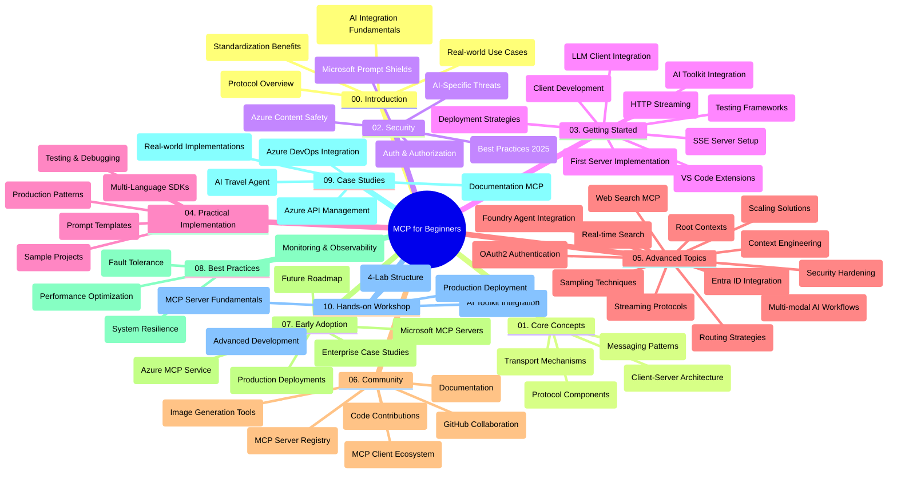

<!--
CO_OP_TRANSLATOR_METADATA:
{
  "original_hash": "e2c6ed897fa98fa08e0146101776c7ff",
  "translation_date": "2025-07-18T09:25:14+00:00",
  "source_file": "study_guide.md",
  "language_code": "ja"
}
-->
# 初心者向けモデルコンテキストプロトコル（MCP）学習ガイド

この学習ガイドは、「初心者向けモデルコンテキストプロトコル（MCP）」カリキュラムのリポジトリ構成と内容の概要を提供します。このガイドを使ってリポジトリを効率的にナビゲートし、利用可能なリソースを最大限に活用してください。

## リポジトリ概要

モデルコンテキストプロトコル（MCP）は、AIモデルとクライアントアプリケーション間のやり取りを標準化するフレームワークです。もともとはAnthropicによって作成されましたが、現在は公式GitHub組織を通じて広範なMCPコミュニティによって管理されています。このリポジトリは、AI開発者、システムアーキテクト、ソフトウェアエンジニア向けに、C#、Java、JavaScript、Python、TypeScriptでの実践的なコード例を含む包括的なカリキュラムを提供します。

## ビジュアルカリキュラムマップ

## リポジトリ構成

リポジトリはMCPのさまざまな側面に焦点を当てた10の主要セクションに分かれています：

1. **イントロダクション (00-Introduction/)**
   - モデルコンテキストプロトコルの概要
   - AIパイプラインにおける標準化の重要性
   - 実用的なユースケースと利点

2. **コアコンセプト (01-CoreConcepts/)**
   - クライアント・サーバーアーキテクチャ
   - 主要なプロトコルコンポーネント
   - MCPにおけるメッセージングパターン

3. **セキュリティ (02-Security/)**
   - MCPベースのシステムにおけるセキュリティ脅威
   - 実装を安全に保つためのベストプラクティス
   - 認証と認可の戦略
   - **包括的なセキュリティドキュメント**：
     - MCPセキュリティベストプラクティス2025
     - Azureコンテンツセーフティ実装ガイド
     - MCPセキュリティコントロールと技術
     - MCPベストプラクティスクイックリファレンス
   - **重要なセキュリティトピック**：
     - プロンプトインジェクションとツールポイズニング攻撃
     - セッションハイジャックと混乱代理問題
     - トークンパススルーの脆弱性
     - 過剰な権限とアクセス制御
     - AIコンポーネントのサプライチェーンセキュリティ
     - Microsoft Prompt Shieldsの統合

4. **はじめに (03-GettingStarted/)**
   - 環境設定と構成
   - 基本的なMCPサーバーとクライアントの作成
   - 既存アプリケーションとの統合
   - 以下のセクションを含む：
     - 最初のサーバー実装
     - クライアント開発
     - LLMクライアント統合
     - VS Code統合
     - Server-Sent Events (SSE)サーバー
     - HTTPストリーミング
     - AIツールキット統合
     - テスト戦略
     - デプロイガイドライン

5. **実践的な実装 (04-PracticalImplementation/)**
   - 複数のプログラミング言語でのSDK利用
   - デバッグ、テスト、検証手法
   - 再利用可能なプロンプトテンプレートとワークフローの作成
   - 実装例を含むサンプルプロジェクト

6. **高度なトピック (05-AdvancedTopics/)**
   - コンテキストエンジニアリング技術
   - Foundryエージェント統合
   - マルチモーダルAIワークフロー
   - OAuth2認証デモ
   - リアルタイム検索機能
   - リアルタイムストリーミング
   - ルートコンテキストの実装
   - ルーティング戦略
   - サンプリング技術
   - スケーリング手法
   - セキュリティ考慮事項
   - Entra IDセキュリティ統合
   - Web検索統合

7. **コミュニティ貢献 (06-CommunityContributions/)**
   - コードやドキュメントへの貢献方法
   - GitHubを通じたコラボレーション
   - コミュニティ主導の改善とフィードバック
   - さまざまなMCPクライアントの利用（Claude Desktop、Cline、VSCode）
   - 画像生成を含む人気のMCPサーバーとの連携

8. **早期導入からの教訓 (07-LessonsfromEarlyAdoption/)**
   - 実際の導入事例と成功ストーリー
   - MCPベースのソリューションの構築と展開
   - トレンドと今後のロードマップ
   - **Microsoft MCPサーバーガイド**：以下を含む10の本番対応Microsoft MCPサーバーの包括的ガイド
     - Microsoft Learn Docs MCPサーバー
     - Azure MCPサーバー（15以上の専門コネクター）
     - GitHub MCPサーバー
     - Azure DevOps MCPサーバー
     - MarkItDown MCPサーバー
     - SQL Server MCPサーバー
     - Playwright MCPサーバー
     - Dev Box MCPサーバー
     - Azure AI Foundry MCPサーバー
     - Microsoft 365 Agents Toolkit MCPサーバー

9. **ベストプラクティス (08-BestPractices/)**
   - パフォーマンスチューニングと最適化
   - フォールトトレラントなMCPシステム設計
   - テストとレジリエンス戦略

10. **ケーススタディ (09-CaseStudy/)**
    - Azure API Management統合サンプル
    - 旅行代理店実装サンプル
    - Azure DevOpsとYouTubeアップデートの統合
    - ドキュメントMCP実装例
    - 詳細なドキュメント付き実装例

11. **ハンズオンワークショップ (10-StreamliningAIWorkflowsBuildingAnMCPServerWithAIToolkit/)**
    - MCPとAIツールキットを組み合わせた包括的なハンズオンワークショップ
    - AIモデルと実世界のツールをつなぐインテリジェントアプリケーションの構築
    - 基礎、カスタムサーバー開発、本番展開戦略をカバーする実践モジュール
    - **ラボ構成**：
      - ラボ1：MCPサーバー基礎
      - ラボ2：高度なMCPサーバー開発
      - ラボ3：AIツールキット統合
      - ラボ4：本番展開とスケーリング
    - ステップバイステップの指示によるラボ形式の学習

## 追加リソース

リポジトリには以下のサポートリソースが含まれています：

- **Imagesフォルダー**：カリキュラム全体で使用される図やイラスト
- **翻訳**：ドキュメントの多言語対応と自動翻訳
- **公式MCPリソース**：
  - [MCP Documentation](https://modelcontextprotocol.io/)
  - [MCP Specification](https://spec.modelcontextprotocol.io/)
  - [MCP GitHub Repository](https://github.com/modelcontextprotocol)

## このリポジトリの使い方

1. **順序立てた学習**：章を順番に（00から10まで）進めて体系的に学習しましょう。
2. **言語別のフォーカス**：特定のプログラミング言語に興味がある場合は、サンプルディレクトリで該当言語の実装を探してください。
3. **実践的な実装**：「はじめに」セクションから環境をセットアップし、最初のMCPサーバーとクライアントを作成しましょう。
4. **高度な内容の探求**：基本が理解できたら、高度なトピックに進んで知識を深めてください。
5. **コミュニティ参加**：GitHubのディスカッションやDiscordチャンネルを通じてMCPコミュニティに参加し、専門家や他の開発者と交流しましょう。

## MCPクライアントとツール

カリキュラムではさまざまなMCPクライアントとツールを紹介しています：

1. **公式クライアント**：
   - Visual Studio Code
   - Visual Studio Code内のMCP
   - Claude Desktop
   - VSCode内のClaude
   - Claude API

2. **コミュニティクライアント**：
   - Cline（ターミナルベース）
   - Cursor（コードエディタ）
   - ChatMCP
   - Windsurf

3. **MCP管理ツール**：
   - MCP CLI
   - MCP Manager
   - MCP Linker
   - MCP Router

## 人気のMCPサーバー

リポジトリでは以下のようなMCPサーバーを紹介しています：

1. **公式Microsoft MCPサーバー**：
   - Microsoft Learn Docs MCPサーバー
   - Azure MCPサーバー（15以上の専門コネクター）
   - GitHub MCPサーバー
   - Azure DevOps MCPサーバー
   - MarkItDown MCPサーバー
   - SQL Server MCPサーバー
   - Playwright MCPサーバー
   - Dev Box MCPサーバー
   - Azure AI Foundry MCPサーバー
   - Microsoft 365 Agents Toolkit MCPサーバー

2. **公式リファレンスサーバー**：
   - Filesystem
   - Fetch
   - Memory
   - Sequential Thinking

3. **画像生成**：
   - Azure OpenAI DALL-E 3
   - Stable Diffusion WebUI
   - Replicate

4. **開発ツール**：
   - Git MCP
   - Terminal Control
   - Code Assistant

5. **専門サーバー**：
   - Salesforce
   - Microsoft Teams
   - Jira & Confluence

## 貢献について

このリポジトリはコミュニティからの貢献を歓迎しています。MCPエコシステムに効果的に貢献する方法については、コミュニティ貢献セクションを参照してください。

## 変更履歴

| 日付 | 変更内容 |
|------|---------|
| 2025年7月18日 | - Microsoft MCPサーバーガイドを含むリポジトリ構成の更新 - 10の本番対応Microsoft MCPサーバーの包括的リストを追加 - 人気のMCPサーバーセクションに公式Microsoft MCPサーバーを追加 - ケーススタディセクションに実際のファイル例を追加 - ハンズオンワークショップのラボ構成詳細を追加 |
| 2025年7月16日 | - 現在の内容を反映したリポジトリ構成の更新 - MCPクライアントとツールセクションを追加 - 人気のMCPサーバーセクションを追加 - 現在のトピックをすべて含むビジュアルカリキュラムマップを更新 - すべての専門分野を含む高度なトピックセクションを強化 - ケーススタディを実際の例に更新 - MCPの起源がAnthropicによることを明確化 |
| 2025年6月11日 | - 学習ガイドの初版作成 - ビジュアルカリキュラムマップを追加 - リポジトリ構成の概要を記載 - サンプルプロジェクトと追加リソースを含む |

---

*この学習ガイドは2025年7月18日に更新され、その時点でのリポジトリの概要を提供しています。リポジトリの内容はこの日付以降に更新される可能性があります。*

**免責事項**：  
本書類はAI翻訳サービス「[Co-op Translator](https://github.com/Azure/co-op-translator)」を使用して翻訳されました。正確性を期しておりますが、自動翻訳には誤りや不正確な部分が含まれる可能性があります。原文の言語による文書が正式な情報源とみなされるべきです。重要な情報については、専門の人間による翻訳を推奨します。本翻訳の利用により生じた誤解や誤訳について、当方は一切の責任を負いかねます。