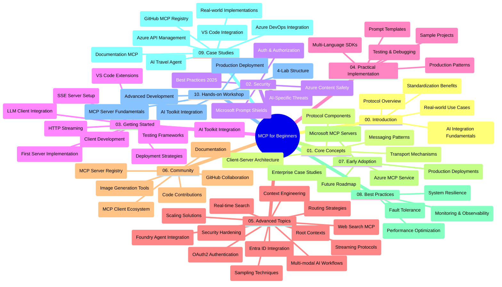

<!--
CO_OP_TRANSLATOR_METADATA:
{
  "original_hash": "719117a0a5f34ade7b5dfb61ee06fb13",
  "translation_date": "2025-09-26T17:55:55+00:00",
  "source_file": "study_guide.md",
  "language_code": "ja"
}
-->
# 初心者向け Model Context Protocol (MCP) - 学習ガイド

この学習ガイドは、「初心者向け Model Context Protocol (MCP)」カリキュラムのリポジトリ構造と内容の概要を提供します。このガイドを活用してリポジトリを効率的にナビゲートし、利用可能なリソースを最大限に活用してください。

## リポジトリ概要

Model Context Protocol (MCP) は、AIモデルとクライアントアプリケーション間のやり取りを標準化するフレームワークです。もともとAnthropicによって作成されたMCPは、現在公式GitHub組織を通じて広範なMCPコミュニティによって維持されています。このリポジトリは、C#、Java、JavaScript、Python、TypeScriptでの実践的なコード例を含む包括的なカリキュラムを提供し、AI開発者、システムアーキテクト、ソフトウェアエンジニア向けに設計されています。

## ビジュアルカリキュラムマップ

## リポジトリ構造

リポジトリはMCPの異なる側面に焦点を当てた10の主要セクションに分かれています：

1. **イントロダクション (00-Introduction/)**
   - Model Context Protocol の概要
   - AIパイプラインにおける標準化の重要性
   - 実用的なユースケースと利点

2. **コアコンセプト (01-CoreConcepts/)**
   - クライアント-サーバーアーキテクチャ
   - プロトコルの主要コンポーネント
   - MCPにおけるメッセージングパターン

3. **セキュリティ (02-Security/)**
   - MCPベースのシステムにおけるセキュリティ脅威
   - 実装を保護するためのベストプラクティス
   - 認証と認可の戦略
   - **包括的なセキュリティドキュメント**:
     - MCPセキュリティベストプラクティス2025
     - Azureコンテンツセーフティ実装ガイド
     - MCPセキュリティコントロールと技術
     - MCPベストプラクティス簡易リファレンス
   - **主要なセキュリティトピック**:
     - プロンプトインジェクションとツールポイズニング攻撃
     - セッションハイジャックと混乱した代理問題
     - トークンパススルーの脆弱性
     - 過剰な権限とアクセス制御
     - AIコンポーネントのサプライチェーンセキュリティ
     - Microsoft Prompt Shields の統合

4. **はじめに (03-GettingStarted/)**
   - 環境設定と構成
   - 基本的なMCPサーバーとクライアントの作成
   - 既存アプリケーションとの統合
   - 以下のセクションを含む：
     - 初めてのサーバー実装
     - クライアント開発
     - LLMクライアント統合
     - VS Code統合
     - Server-Sent Events (SSE) サーバー
     - HTTPストリーミング
     - AIツールキット統合
     - テスト戦略
     - デプロイメントガイドライン

5. **実践的な実装 (04-PracticalImplementation/)**
   - 異なるプログラミング言語でのSDKの使用
   - デバッグ、テスト、検証技術
   - 再利用可能なプロンプトテンプレートとワークフローの作成
   - 実装例を含むサンプルプロジェクト

6. **高度なトピック (05-AdvancedTopics/)**
   - コンテキストエンジニアリング技術
   - Foundryエージェント統合
   - マルチモーダルAIワークフロー
   - OAuth2認証デモ
   - リアルタイム検索機能
   - リアルタイムストリーミング
   - ルートコンテキストの実装
   - ルーティング戦略
   - サンプリング技術
   - スケーリングアプローチ
   - セキュリティの考慮事項
   - Entra IDセキュリティ統合
   - Web検索統合

7. **コミュニティ貢献 (06-CommunityContributions/)**
   - コードとドキュメントの貢献方法
   - GitHubを通じたコラボレーション
   - コミュニティ主導の改善とフィードバック
   - 様々なMCPクライアントの使用 (Claude Desktop、Cline、VSCode)
   - 画像生成を含む人気のMCPサーバーとの作業

8. **初期採用からの教訓 (07-LessonsfromEarlyAdoption/)**
   - 実際の実装と成功事例
   - MCPベースのソリューションの構築と展開
   - トレンドと将来のロードマップ
   - **Microsoft MCP Servers Guide**: 以下を含む10のプロダクション対応Microsoft MCPサーバーの包括的なガイド：
     - Microsoft Learn Docs MCP Server
     - Azure MCP Server (15以上の専門コネクタ)
     - GitHub MCP Server
     - Azure DevOps MCP Server
     - MarkItDown MCP Server
     - SQL Server MCP Server
     - Playwright MCP Server
     - Dev Box MCP Server
     - Azure AI Foundry MCP Server
     - Microsoft 365 Agents Toolkit MCP Server

9. **ベストプラクティス (08-BestPractices/)**
   - パフォーマンスチューニングと最適化
   - 耐障害性のあるMCPシステムの設計
   - テストと回復力戦略

10. **ケーススタディ (09-CaseStudy/)**
    - **7つの包括的なケーススタディ**が示すMCPの多様なシナリオでの汎用性：
    - **Azure AI旅行代理店**: Azure OpenAIとAI検索を用いたマルチエージェントオーケストレーション
    - **Azure DevOps統合**: YouTubeデータ更新を自動化するワークフロープロセス
    - **リアルタイムドキュメント取得**: ストリーミングHTTPを使用したPythonコンソールクライアント
    - **インタラクティブ学習計画ジェネレーター**: 会話型AIを備えたChainlitウェブアプリ
    - **エディター内ドキュメント**: GitHub Copilotワークフローを備えたVS Code統合
    - **Azure API管理**: MCPサーバー作成を伴うエンタープライズAPI統合
    - **GitHub MCP Registry**: エコシステム開発とエージェント統合プラットフォーム
    - エンタープライズ統合、開発者の生産性、エコシステム開発にまたがる実装例

11. **ハンズオンワークショップ (10-StreamliningAIWorkflowsBuildingAnMCPServerWithAIToolkit/)**
    - MCPとAIツールキットを組み合わせた包括的なハンズオンワークショップ
    - AIモデルと現実世界のツールを橋渡しするインテリジェントアプリケーションの構築
    - 基礎、カスタムサーバー開発、プロダクション展開戦略をカバーする実践的モジュール
    - **ラボ構造**:
      - ラボ1: MCPサーバーの基礎
      - ラボ2: 高度なMCPサーバー開発
      - ラボ3: AIツールキット統合
      - ラボ4: プロダクション展開とスケーリング
    - ステップバイステップの指示を伴うラボベースの学習アプローチ

## 追加リソース

リポジトリには以下のサポートリソースが含まれています：

- **Imagesフォルダ**: カリキュラム全体で使用される図やイラストを含む
- **翻訳**: ドキュメントの自動翻訳による多言語サポート
- **公式MCPリソース**:
  - [MCP Documentation](https://modelcontextprotocol.io/)
  - [MCP Specification](https://spec.modelcontextprotocol.io/)
  - [MCP GitHub Repository](https://github.com/modelcontextprotocol)

## このリポジトリの使い方

1. **順序学習**: 構造化された学習体験のために、章を順番に追ってください (00から10まで)。
2. **言語特化型学習**: 特定のプログラミング言語に興味がある場合は、好みの言語での実装を含むサンプルディレクトリを探索してください。
3. **実践的な実装**: 「はじめに」セクションから始めて環境を設定し、最初のMCPサーバーとクライアントを作成してください。
4. **高度な探求**: 基本を習得したら、高度なトピックに進んで知識を広げてください。
5. **コミュニティ参加**: GitHubディスカッションやDiscordチャンネルを通じてMCPコミュニティに参加し、専門家や他の開発者とつながりましょう。

## MCPクライアントとツール

カリキュラムでは様々なMCPクライアントとツールを取り上げています：

1. **公式クライアント**:
   - Visual Studio Code
   - MCP in Visual Studio Code
   - Claude Desktop
   - Claude in VSCode
   - Claude API

2. **コミュニティクライアント**:
   - Cline (ターミナルベース)
   - Cursor (コードエディター)
   - ChatMCP
   - Windsurf

3. **MCP管理ツール**:
   - MCP CLI
   - MCP Manager
   - MCP Linker
   - MCP Router

## 人気のMCPサーバー

リポジトリでは様々なMCPサーバーを紹介しています：

1. **公式Microsoft MCPサーバー**:
   - Microsoft Learn Docs MCP Server
   - Azure MCP Server (15以上の専門コネクタ)
   - GitHub MCP Server
   - Azure DevOps MCP Server
   - MarkItDown MCP Server
   - SQL Server MCP Server
   - Playwright MCP Server
   - Dev Box MCP Server
   - Azure AI Foundry MCP Server
   - Microsoft 365 Agents Toolkit MCP Server

2. **公式リファレンスサーバー**:
   - Filesystem
   - Fetch
   - Memory
   - Sequential Thinking

3. **画像生成**:
   - Azure OpenAI DALL-E 3
   - Stable Diffusion WebUI
   - Replicate

4. **開発ツール**:
   - Git MCP
   - Terminal Control
   - Code Assistant

5. **専門サーバー**:
   - Salesforce
   - Microsoft Teams
   - Jira & Confluence

## 貢献

このリポジトリはコミュニティからの貢献を歓迎します。MCPエコシステムに効果的に貢献する方法については、コミュニティ貢献セクションを参照してください。

## 変更履歴

| 日付 | 変更内容 |
|------|---------|
| 2025年9月26日 | - GitHub MCP Registryケーススタディを09-CaseStudyセクションに追加 - ケーススタディを7つの包括的なケーススタディに更新 - ケーススタディの説明を具体的な実装詳細で強化 - ビジュアルカリキュラムマップをGitHub MCP Registryを含むよう更新 - エコシステム開発に焦点を当てた学習ガイド構造を改訂 |
| 2025年7月18日 | - リポジトリ構造をMicrosoft MCP Servers Guideを含むよう更新 - 10のプロダクション対応Microsoft MCPサーバーの包括的リストを追加 - 人気のMCPサーバーセクションを公式Microsoft MCPサーバーで強化 - ケーススタディセクションを実際のファイル例で更新 - ハンズオンワークショップのラボ構造詳細を追加 |
| 2025年7月16日 | - 現在の内容を反映するようリポジトリ構造を更新 - MCPクライアントとツールセクションを追加 - 人気のMCPサーバーセクションを追加 - 現在のトピックを含むビジュアルカリキュラムマップを更新 - 高度なトピックセクションをすべての専門分野で強化 - ケーススタディを実際の例で更新 - MCPの起源をAnthropicによる作成として明確化 |
| 2025年6月11日 | - 学習ガイドの初期作成 - ビジュアルカリキュラムマップを追加 - リポジトリ構造を概説 - サンプルプロジェクトと追加リソースを含む |

---

*この学習ガイドは2025年9月26日に更新され、その日付時点でのリポジトリの概要を提供します。その後、リポジトリ内容が更新される可能性があります。*

---

