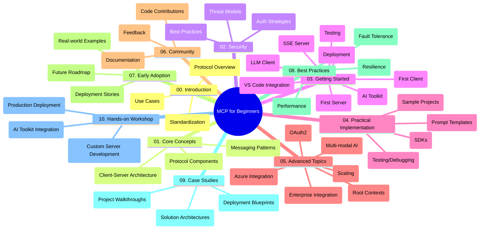

<!--
CO_OP_TRANSLATOR_METADATA:
{
  "original_hash": "a607d4febc94caee9a12b77795f7fc9a",
  "translation_date": "2025-07-13T15:11:35+00:00",
  "source_file": "study_guide.md",
  "language_code": "ja"
}
-->
# Model Context Protocol (MCP) for Beginners - 学習ガイド

この学習ガイドは、「Model Context Protocol (MCP) for Beginners」カリキュラムのリポジトリ構成と内容の概要を提供します。このガイドを使ってリポジトリを効率的にナビゲートし、利用可能なリソースを最大限に活用してください。

## リポジトリ概要

Model Context Protocol (MCP) は、AIモデルとクライアントアプリケーション間のやり取りを標準化するフレームワークです。このリポジトリは、AI開発者、システムアーキテクト、ソフトウェアエンジニア向けに、C#、Java、JavaScript、Python、TypeScriptでの実践的なコード例を含む包括的なカリキュラムを提供します。

## ビジュアルカリキュラムマップ

## リポジトリ構成

リポジトリはMCPのさまざまな側面に焦点を当てた10の主要セクションに分かれています：

1. **Introduction (00-Introduction/)**
   - Model Context Protocolの概要
   - AIパイプラインにおける標準化の重要性
   - 実用的なユースケースと利点

2. **Core Concepts (01-CoreConcepts/)**
   - クライアント・サーバーアーキテクチャ
   - プロトコルの主要コンポーネント
   - MCPにおけるメッセージングパターン

3. **Security (02-Security/)**
   - MCPベースのシステムにおけるセキュリティ脅威
   - 実装を安全に保つためのベストプラクティス
   - 認証と認可の戦略

4. **Getting Started (03-GettingStarted/)**
   - 環境設定と構成
   - 基本的なMCPサーバーとクライアントの作成
   - 既存アプリケーションとの統合
   - 初めてのサーバー、初めてのクライアント、LLMクライアント、VS Code統合、SSEサーバー、AIツールキット、テスト、デプロイメントのサブセクション

5. **Practical Implementation (04-PracticalImplementation/)**
   - 各種プログラミング言語でのSDK利用
   - デバッグ、テスト、検証手法
   - 再利用可能なプロンプトテンプレートとワークフローの作成
   - 実装例を含むサンプルプロジェクト

6. **Advanced Topics (05-AdvancedTopics/)**
   - マルチモーダルAIワークフローと拡張性
   - セキュアなスケーリング戦略
   - エンタープライズエコシステムにおけるMCP
   - Azure統合、マルチモダリティ、OAuth2、ルートコンテキスト、ルーティング、サンプリング、スケーリング、セキュリティ、ウェブ検索統合、ストリーミングなどの専門的トピック

7. **Community Contributions (06-CommunityContributions/)**
   - コードやドキュメントへの貢献方法
   - GitHubを通じたコラボレーション
   - コミュニティ主導の改善とフィードバック

8. **Lessons from Early Adoption (07-LessonsfromEarlyAdoption/)**
   - 実際の導入事例と成功ストーリー
   - MCPベースのソリューションの構築と展開
   - トレンドと今後のロードマップ

9. **Best Practices (08-BestPractices/)**
   - パフォーマンスチューニングと最適化
   - 障害に強いMCPシステムの設計
   - テストとレジリエンス戦略

10. **Case Studies (09-CaseStudy/)**
    - MCPソリューションアーキテクチャの詳細解析
    - 展開設計図と統合のヒント
    - 注釈付き図解とプロジェクトウォークスルー

11. **Hands-on Workshop (10-StreamliningAIWorkflowsBuildingAnMCPServerWithAIToolkit/)**
    - MCPとMicrosoftのAIツールキットを組み合わせた実践的ワークショップ
    - AIモデルと実世界のツールをつなぐインテリジェントアプリケーションの構築
    - 基礎、カスタムサーバー開発、プロダクション展開戦略をカバーする実践モジュール

## サンプルプロジェクト

このリポジトリには、さまざまなプログラミング言語でのMCP実装を示す複数のサンプルプロジェクトが含まれています：

### 基本的なMCP電卓サンプル
- C# MCPサーバー例
- Java MCP電卓
- JavaScript MCPデモ
- Python MCPサーバー
- TypeScript MCP例

### 高度なMCP電卓プロジェクト
- 高度なC#サンプル
- Javaコンテナアプリ例
- JavaScript高度サンプル
- Python複雑実装
- TypeScriptコンテナサンプル

## 追加リソース

リポジトリには以下のサポートリソースも含まれています：

- **Imagesフォルダー**：カリキュラム全体で使用される図やイラスト
- **翻訳**：ドキュメントの多言語対応と自動翻訳
- **公式MCPリソース**：
  - [MCP Documentation](https://modelcontextprotocol.io/)
  - [MCP Specification](https://spec.modelcontextprotocol.io/)
  - [MCP GitHub Repository](https://github.com/modelcontextprotocol)

## このリポジトリの使い方

1. **順序立てた学習**：章を順番に（00から10まで）進めて体系的に学習しましょう。
2. **言語別のフォーカス**：特定のプログラミング言語に興味がある場合は、サンプルディレクトリで該当言語の実装を探してください。
3. **実践的な実装**：「Getting Started」セクションから始めて環境を整え、最初のMCPサーバーとクライアントを作成しましょう。
4. **高度な内容の探求**：基本を理解したら、高度なトピックに進んで知識を深めてください。
5. **コミュニティ参加**：[Azure AI Foundry Discord](https://discord.com/invite/ByRwuEEgH4)に参加して、専門家や他の開発者と交流しましょう。

## 貢献について

このリポジトリはコミュニティからの貢献を歓迎しています。貢献方法についてはCommunity Contributionsセクションを参照してください。

---

*この学習ガイドは2025年6月11日に作成され、その時点でのリポジトリの概要を示しています。リポジトリの内容はそれ以降に更新されている可能性があります。*

**免責事項**：  
本書類はAI翻訳サービス「[Co-op Translator](https://github.com/Azure/co-op-translator)」を使用して翻訳されました。正確性を期しておりますが、自動翻訳には誤りや不正確な部分が含まれる可能性があります。原文の言語によるオリジナル文書が正式な情報源とみなされるべきです。重要な情報については、専門の人間による翻訳を推奨します。本翻訳の利用により生じたいかなる誤解や誤訳についても、当方は責任を負いかねます。