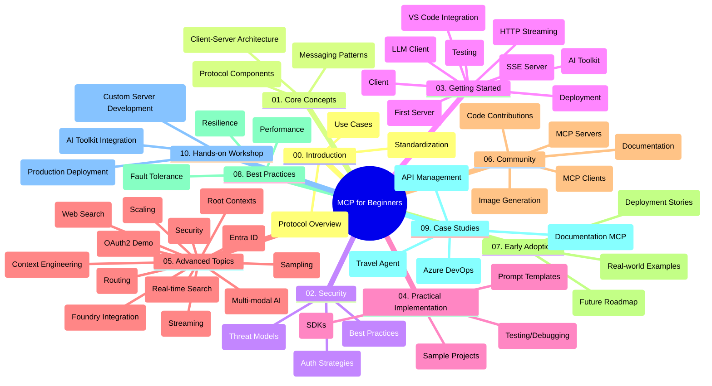

<!--
CO_OP_TRANSLATOR_METADATA:
{
  "original_hash": "77bfab7090f987a5b9fe078f50dbda13",
  "translation_date": "2025-07-16T21:30:00+00:00",
  "source_file": "study_guide.md",
  "language_code": "ja"
}
-->
# Model Context Protocol (MCP) for Beginners - 学習ガイド

この学習ガイドは、「Model Context Protocol (MCP) for Beginners」カリキュラムのリポジトリ構成と内容の概要を提供します。このガイドを使ってリポジトリを効率的にナビゲートし、利用可能なリソースを最大限に活用してください。

## リポジトリ概要

Model Context Protocol (MCP) は、AIモデルとクライアントアプリケーション間のやり取りを標準化するフレームワークです。もともとはAnthropicによって作成されましたが、現在は公式GitHub組織を通じて広範なMCPコミュニティによって管理されています。このリポジトリは、AI開発者、システムアーキテクト、ソフトウェアエンジニア向けに、C#、Java、JavaScript、Python、TypeScriptでの実践的なコード例を含む包括的なカリキュラムを提供します。

## ビジュアルカリキュラムマップ

## リポジトリ構成

リポジトリはMCPのさまざまな側面に焦点を当てた10の主要セクションに分かれています：

1. **Introduction (00-Introduction/)**
   - Model Context Protocolの概要
   - AIパイプラインにおける標準化の重要性
   - 実用的なユースケースと利点

2. **Core Concepts (01-CoreConcepts/)**
   - クライアント・サーバーアーキテクチャ
   - 主要なプロトコルコンポーネント
   - MCPにおけるメッセージングパターン

3. **Security (02-Security/)**
   - MCPベースのシステムにおけるセキュリティ脅威
   - 実装を安全に保つためのベストプラクティス
   - 認証と認可の戦略

4. **Getting Started (03-GettingStarted/)**
   - 環境設定と構成
   - 基本的なMCPサーバーとクライアントの作成
   - 既存アプリケーションとの統合
   - 以下のセクションを含む：
     - 最初のサーバー実装
     - クライアント開発
     - LLMクライアント統合
     - VS Code統合
     - Server-Sent Events (SSE) サーバー
     - HTTPストリーミング
     - AI Toolkit統合
     - テスト戦略
     - デプロイガイドライン

5. **Practical Implementation (04-PracticalImplementation/)**
   - 複数のプログラミング言語でのSDK利用
   - デバッグ、テスト、検証手法
   - 再利用可能なプロンプトテンプレートとワークフローの作成
   - 実装例を含むサンプルプロジェクト

6. **Advanced Topics (05-AdvancedTopics/)**
   - コンテキストエンジニアリング技術
   - Foundryエージェント統合
   - マルチモーダルAIワークフロー
   - OAuth2認証デモ
   - リアルタイム検索機能
   - リアルタイムストリーミング
   - ルートコンテキストの実装
   - ルーティング戦略
   - サンプリング技術
   - スケーリング手法
   - セキュリティ考慮事項
   - Entra IDセキュリティ統合
   - Web検索統合

7. **Community Contributions (06-CommunityContributions/)**
   - コードやドキュメントへの貢献方法
   - GitHubを通じたコラボレーション
   - コミュニティ主導の改善とフィードバック
   - さまざまなMCPクライアントの利用（Claude Desktop、Cline、VSCode）
   - 画像生成を含む人気のMCPサーバーとの連携

8. **Lessons from Early Adoption (07-LessonsfromEarlyAdoption/)**
   - 実際の導入事例と成功ストーリー
   - MCPベースのソリューションの構築と展開
   - トレンドと今後のロードマップ

9. **Best Practices (08-BestPractices/)**
   - パフォーマンスチューニングと最適化
   - フォールトトレラントなMCPシステム設計
   - テストとレジリエンス戦略

10. **Case Studies (09-CaseStudy/)**
    - ケーススタディ：Azure API Management統合
    - ケーススタディ：旅行代理店の実装
    - ケーススタディ：Azure DevOpsとYouTubeの統合
    - 詳細なドキュメント付き実装例

11. **Hands-on Workshop (10-StreamliningAIWorkflowsBuildingAnMCPServerWithAIToolkit/)**
    - MCPとAI Toolkitを組み合わせた包括的なハンズオンワークショップ
    - AIモデルと実世界のツールをつなぐインテリジェントアプリケーションの構築
    - 基礎、カスタムサーバー開発、プロダクション展開戦略をカバーする実践モジュール
    - ステップバイステップのラボ形式学習

## 追加リソース

リポジトリには以下のサポートリソースが含まれています：

- **Imagesフォルダー**：カリキュラム全体で使用される図やイラスト
- **翻訳**：ドキュメントの多言語対応と自動翻訳
- **公式MCPリソース**：
  - [MCP Documentation](https://modelcontextprotocol.io/)
  - [MCP Specification](https://spec.modelcontextprotocol.io/)
  - [MCP GitHub Repository](https://github.com/modelcontextprotocol)

## このリポジトリの使い方

1. **順序立てた学習**：章を順番に（00から10まで）進めて体系的に学習しましょう。
2. **言語別のフォーカス**：特定のプログラミング言語に興味がある場合は、samplesディレクトリで該当言語の実装を探してください。
3. **実践的な実装**：「Getting Started」セクションから始めて環境を整え、最初のMCPサーバーとクライアントを作成しましょう。
4. **高度な内容の探求**：基本を理解したら、Advanced Topicsに進んで知識を深めてください。
5. **コミュニティ参加**：GitHubのディスカッションやDiscordチャンネルを通じてMCPコミュニティに参加し、専門家や他の開発者と交流しましょう。

## MCPクライアントとツール

カリキュラムでは以下のMCPクライアントとツールを扱います：

1. **公式クライアント**：
   - Claude Desktop
   - VSCode内のClaude
   - Claude API

2. **コミュニティクライアント**：
   - Cline（ターミナルベース）
   - Cursor（コードエディタ）
   - ChatMCP
   - Windsurf

3. **MCP管理ツール**：
   - MCP CLI
   - MCP Manager
   - MCP Linker
   - MCP Router

## 人気のMCPサーバー

リポジトリでは以下のMCPサーバーを紹介しています：

1. **公式リファレンスサーバー**：
   - Filesystem
   - Fetch
   - Memory
   - Sequential Thinking

2. **画像生成**：
   - Azure OpenAI DALL-E 3
   - Stable Diffusion WebUI
   - Replicate

3. **開発ツール**：
   - Git MCP
   - Terminal Control
   - Code Assistant

4. **専門サーバー**：
   - Salesforce
   - Microsoft Teams
   - Jira & Confluence

## 貢献について

このリポジトリはコミュニティからの貢献を歓迎しています。MCPエコシステムに効果的に貢献する方法については、Community Contributionsセクションを参照してください。

## 変更履歴

| 日付 | 変更内容 |
|------|---------|
| 2025年7月16日 | - 現在の内容に合わせてリポジトリ構成を更新 - MCPクライアントとツールのセクションを追加 - 人気のMCPサーバーセクションを追加 - すべてのトピックを含むビジュアルカリキュラムマップを更新 - 専門分野を網羅したAdvanced Topicsセクションを強化 - 実例を反映したCase Studiesを更新 - MCPの起源がAnthropicによるものであることを明確化 |
| 2025年6月11日 | - 学習ガイドの初版作成 - ビジュアルカリキュラムマップを追加 - リポジトリ構成の概要を記載 - サンプルプロジェクトと追加リソースを含む |

---

*この学習ガイドは2025年7月16日に更新され、その時点でのリポジトリ概要を提供しています。リポジトリの内容はそれ以降に更新される可能性があります。*

**免責事項**：  
本書類はAI翻訳サービス「[Co-op Translator](https://github.com/Azure/co-op-translator)」を使用して翻訳されました。正確性の向上に努めておりますが、自動翻訳には誤りや不正確な部分が含まれる可能性があります。原文の言語によるオリジナル文書が正式な情報源とみなされるべきです。重要な情報については、専門の人間による翻訳を推奨します。本翻訳の利用により生じたいかなる誤解や誤訳についても、当方は一切の責任を負いかねます。