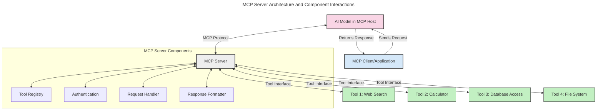
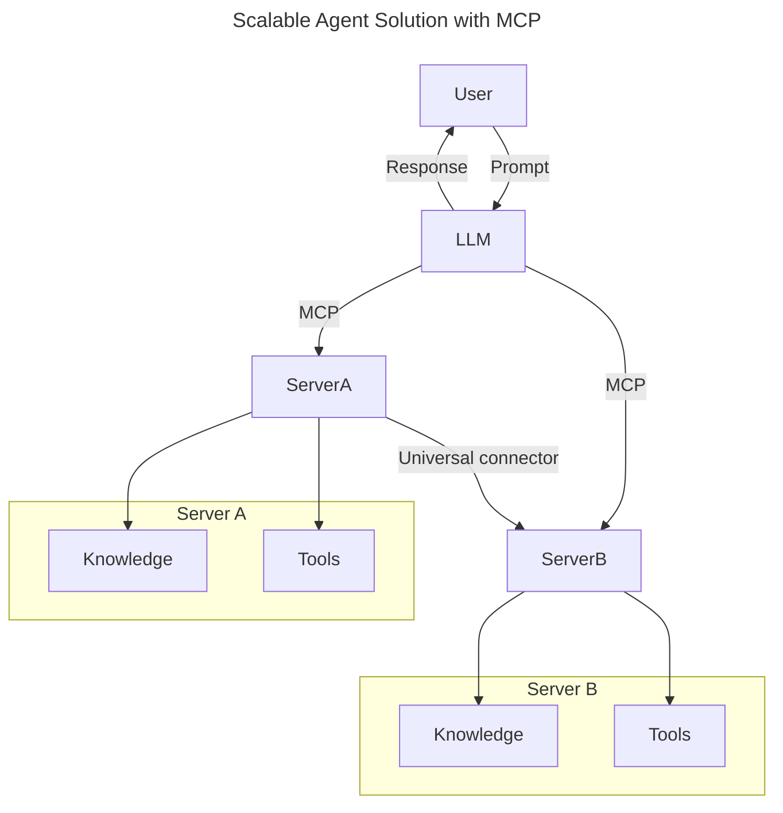
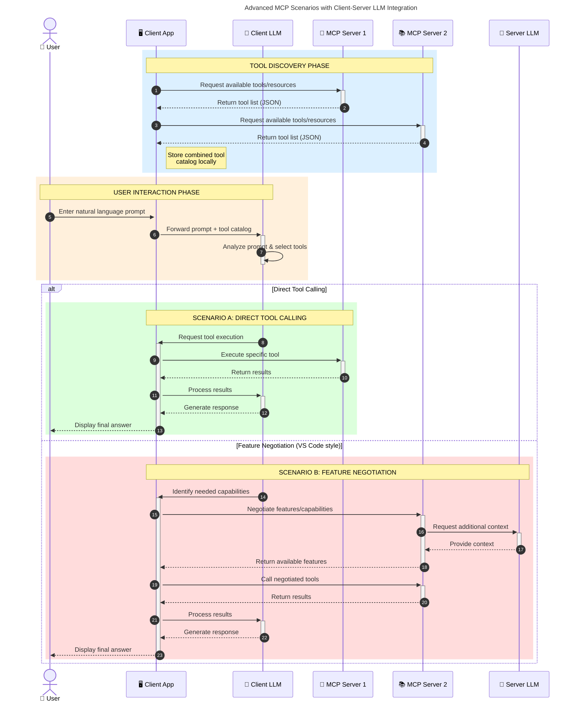

<!--
CO_OP_TRANSLATOR_METADATA:
{
  "original_hash": "1446979020432f512c883848d7eca144",
  "translation_date": "2025-05-29T21:43:59+00:00",
  "source_file": "00-Introduction/README.md",
  "language_code": "ko"
}
-->
# Model Context Protocol (MCP) 소개: 확장 가능한 AI 애플리케이션에 왜 중요한가

생성형 AI 애플리케이션은 자연어 프롬프트를 통해 사용자와 상호작용할 수 있어 큰 진전을 이뤘습니다. 하지만 시간이 지날수록 더 많은 기능과 자원을 쉽게 통합하고, 여러 모델을 동시에 지원하며, 다양한 모델 특성을 관리할 수 있도록 확장 가능한 구조를 갖추는 것이 중요해집니다. 즉, 생성형 AI 앱은 처음에는 간단하지만, 성장하고 복잡해질수록 아키텍처를 정의하고 일관된 방식으로 앱을 구축하기 위한 표준에 의존해야 합니다. 여기서 MCP가 역할을 하여 체계화하고 표준을 제공합니다.

---

## **🔍 Model Context Protocol (MCP)란?**

**Model Context Protocol (MCP)**은 대형 언어 모델(LLM)이 외부 도구, API, 데이터 소스와 원활하게 상호작용할 수 있도록 하는 **개방형 표준 인터페이스**입니다. 훈련 데이터 이상의 기능을 AI 모델에 제공하는 일관된 아키텍처를 통해 더 똑똑하고 확장 가능하며 반응성 높은 AI 시스템을 가능하게 합니다.

---

## **🎯 AI에서 표준화가 중요한 이유**

생성형 AI 애플리케이션이 복잡해짐에 따라 **확장성, 확장 가능성, 유지보수성**을 보장하는 표준 도입이 필수적입니다. MCP는 다음과 같은 문제를 해결합니다:

- 모델-도구 통합의 통일성 제공
- 취약하고 일회성인 맞춤형 솔루션 감소
- 하나의 생태계 내에서 여러 모델 공존 허용

---

## **📚 학습 목표**

이 글을 읽고 나면 다음을 할 수 있습니다:

- **Model Context Protocol (MCP)** 정의 및 활용 사례 이해
- MCP가 모델과 도구 간 통신을 표준화하는 방식 이해
- MCP 아키텍처의 핵심 구성 요소 파악
- 기업 및 개발 환경에서 MCP의 실제 적용 사례 탐색

---

## **💡 MCP가 게임 체인저인 이유**

### **🔗 MCP가 AI 상호작용의 단편화를 해결하다**

MCP 이전에는 모델과 도구 통합 시:

- 도구-모델별 맞춤 코드 필요
- 공급사별 비표준 API 사용
- 업데이트 시 잦은 호환성 문제 발생
- 도구가 많아질수록 확장성 저하

### **✅ MCP 표준화의 장점**

| **장점**                 | **설명**                                                                |
|--------------------------|------------------------------------------------------------------------|
| 상호운용성               | LLM이 다양한 공급사의 도구와 원활히 작동                               |
| 일관성                   | 플랫폼과 도구 전반에 걸쳐 균일한 동작 보장                            |
| 재사용성                 | 한 번 구축한 도구를 여러 프로젝트와 시스템에서 활용 가능               |
| 개발 가속화              | 표준화된 플러그 앤 플레이 인터페이스로 개발 시간 단축                  |

---

## **🧱 MCP 아키텍처 개요**

MCP는 **클라이언트-서버 모델**을 따르며:

- **MCP Hosts**가 AI 모델을 실행
- **MCP Clients**가 요청을 시작
- **MCP Servers**가 컨텍스트, 도구, 기능을 제공

### **핵심 구성 요소:**

- **Resources** – 모델에 제공되는 정적 또는 동적 데이터  
- **Prompts** – 사전 정의된 생성 흐름  
- **Tools** – 검색, 계산 등 실행 가능한 함수  
- **Sampling** – 재귀적 상호작용을 통한 에이전트 행동

---

## MCP 서버 작동 방식

MCP 서버는 다음과 같이 작동합니다:

- **요청 흐름**:  
    1. MCP Client가 MCP Host에서 실행 중인 AI 모델에 요청을 보냄  
    2. AI 모델이 외부 도구나 데이터가 필요함을 인식  
    3. 모델이 표준화된 프로토콜을 통해 MCP Server와 통신

- **MCP 서버 기능**:  
    - 도구 레지스트리: 사용 가능한 도구와 기능 목록 관리  
    - 인증: 도구 접근 권한 검증  
    - 요청 처리기: 모델로부터 들어오는 도구 요청 처리  
    - 응답 포매터: 도구 결과를 모델이 이해할 수 있는 형식으로 변환

- **도구 실행**:  
    - 서버가 적절한 외부 도구로 요청 전달  
    - 도구가 검색, 계산, 데이터베이스 질의 등 특화 기능 수행  
    - 결과를 일관된 형식으로 모델에 반환

- **응답 완료**:  
    - AI 모델이 도구 출력을 응답에 통합  
    - 최종 응답을 클라이언트 애플리케이션에 전송

## 👨‍💻 MCP 서버 구축 방법 (예제 포함)

MCP 서버는 LLM 기능을 데이터와 기능으로 확장할 수 있게 해줍니다.

직접 시도해보고 싶다면, 여러 언어로 작성된 간단한 MCP 서버 예제를 참고하세요:

- **Python 예제**: https://github.com/modelcontextprotocol/python-sdk

- **TypeScript 예제**: https://github.com/modelcontextprotocol/typescript-sdk

- **Java 예제**: https://github.com/modelcontextprotocol/java-sdk

- **C#/.NET 예제**: https://github.com/modelcontextprotocol/csharp-sdk

## 🌍 MCP의 실제 활용 사례

MCP는 AI 기능 확장을 통해 다양한 애플리케이션을 지원합니다:

| **애플리케이션**            | **설명**                                                              |
|-----------------------------|----------------------------------------------------------------------|
| 기업 데이터 통합            | LLM을 데이터베이스, CRM, 내부 도구와 연결                            |
| 에이전트 AI 시스템          | 도구 접근과 의사결정 워크플로우를 갖춘 자율 에이전트 구현             |
| 다중 모달 애플리케이션      | 텍스트, 이미지, 오디오 도구를 하나의 통합 AI 앱에서 결합             |
| 실시간 데이터 통합          | 실시간 데이터를 AI 상호작용에 반영하여 더 정확하고 최신의 결과 제공  |

### 🧠 MCP = AI 상호작용을 위한 범용 표준

Model Context Protocol(MCP)은 USB-C가 기기 간 물리적 연결을 표준화한 것처럼 AI 상호작용의 범용 표준 역할을 합니다. AI 세계에서 MCP는 모델(클라이언트)이 외부 도구와 데이터 제공자(서버)와 원활히 통합할 수 있는 일관된 인터페이스를 제공합니다. 덕분에 각 API나 데이터 소스마다 다양한 맞춤형 프로토콜을 만들 필요가 없습니다.

MCP 호환 도구(즉, MCP 서버)는 통일된 표준을 따릅니다. 이 서버들은 제공하는 도구나 작업을 나열하고, AI 에이전트가 요청하면 해당 작업을 실행합니다. MCP를 지원하는 AI 에이전트 플랫폼은 서버에서 사용 가능한 도구를 발견하고 표준 프로토콜을 통해 호출할 수 있습니다.

### 💡 지식 접근성 향상

도구 제공 외에도 MCP는 지식 접근을 용이하게 합니다. 애플리케이션이 LLM에 다양한 데이터 소스와 연결된 컨텍스트를 제공할 수 있게 해줍니다. 예를 들어, MCP 서버는 회사 문서 저장소를 나타내어 에이전트가 필요한 정보를 요청 시 검색할 수 있습니다. 또 다른 서버는 이메일 발송이나 기록 업데이트 같은 특정 작업을 수행할 수 있습니다. 에이전트 관점에서는 이 모든 것이 사용할 수 있는 도구이며, 일부는 데이터(지식 컨텍스트)를 반환하고, 다른 일부는 작업을 실행합니다. MCP는 이 둘을 효율적으로 관리합니다.

에이전트가 MCP 서버에 연결하면 표준 형식을 통해 서버의 사용 가능한 기능과 접근 가능한 데이터를 자동으로 학습합니다. 이 표준화 덕분에 도구 가용성이 동적으로 변할 수 있습니다. 예를 들어, 새 MCP 서버를 에이전트 시스템에 추가하면 별도의 에이전트 명령어 수정 없이도 즉시 기능을 사용할 수 있습니다.

이 통합 흐름은 머메이드 다이어그램에 나타난 것처럼, 서버가 도구와 지식을 모두 제공하여 시스템 간 원활한 협업을 보장합니다.

### 👉 예시: 확장 가능한 에이전트 솔루션

### 🔄 클라이언트 측 LLM 통합을 통한 고급 MCP 시나리오

기본 MCP 아키텍처를 넘어, 클라이언트와 서버 모두에 LLM이 포함되어 더 정교한 상호작용이 가능한 고급 시나리오도 있습니다:

## 🔐 MCP의 실질적 이점

MCP 사용 시 얻을 수 있는 주요 이점은 다음과 같습니다:

- **최신성**: 모델이 훈련 데이터 외 최신 정보에 접근 가능  
- **기능 확장**: 훈련되지 않은 작업에 특화된 도구 활용 가능  
- **환각 감소**: 외부 데이터 소스로 사실 기반 강화  
- **프라이버시 보호**: 민감한 데이터가 프롬프트에 포함되지 않고 안전한 환경 내 유지

## 📌 핵심 정리

MCP 사용 시 기억할 주요 사항:

- **MCP**는 AI 모델과 도구 및 데이터 간 상호작용을 표준화  
- **확장성, 일관성, 상호운용성** 촉진  
- 개발 시간 단축, 신뢰성 향상, 모델 기능 확장 지원  
- 클라이언트-서버 아키텍처로 유연하고 확장 가능한 AI 애플리케이션 구현 가능

## 🧠 연습 문제

만들고 싶은 AI 애플리케이션을 생각해 보세요.

- 어떤 **외부 도구나 데이터**가 기능 향상에 도움이 될까요?  
- MCP가 통합을 어떻게 **더 쉽고 신뢰성 있게** 만들 수 있을까요?

## 추가 자료

- [MCP GitHub 저장소](https://github.com/modelcontextprotocol)

## 다음 단계

다음: [1장: 핵심 개념](/01-CoreConcepts/README.md)

**면책 조항**:  
이 문서는 AI 번역 서비스 [Co-op Translator](https://github.com/Azure/co-op-translator)를 사용하여 번역되었습니다. 정확성을 위해 최선을 다하고 있으나, 자동 번역에는 오류나 부정확한 부분이 있을 수 있음을 양지해 주시기 바랍니다. 원본 문서는 해당 언어의 원문이 권위 있는 자료로 간주되어야 합니다. 중요한 정보의 경우 전문적인 인간 번역을 권장합니다. 본 번역의 사용으로 인해 발생하는 오해나 잘못된 해석에 대해 당사는 책임을 지지 않습니다.