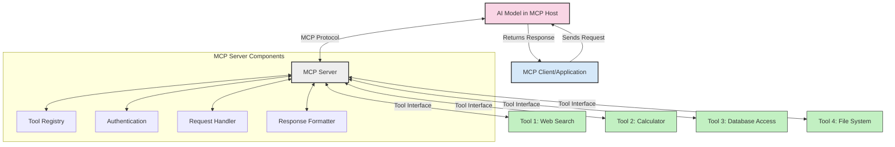
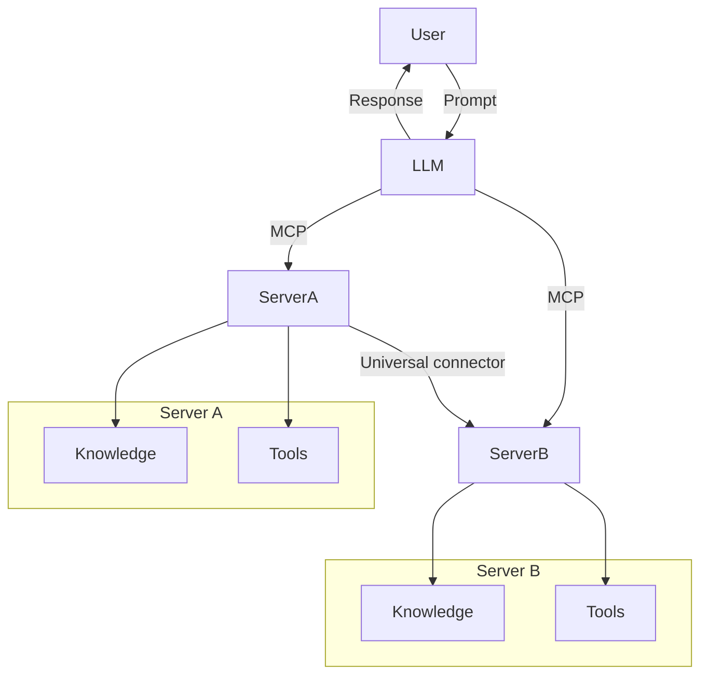

<!--
CO_OP_TRANSLATOR_METADATA:
{
  "original_hash": "02301140adbd807ecf0f17720fa307bc",
  "translation_date": "2025-05-16T14:32:56+00:00",
  "source_file": "00-Introduction/README.md",
  "language_code": "ko"
}
-->
# 모델 컨텍스트 프로토콜(MCP) 소개: 확장 가능한 AI 애플리케이션에 왜 중요한가

생성 AI 애플리케이션은 사용자가 자연어 프롬프트를 통해 앱과 상호작용할 수 있게 해주는 큰 진전입니다. 하지만 이런 앱에 더 많은 시간과 자원이 투자될수록, 기능과 리소스를 쉽게 통합하고 확장 가능하며 여러 모델과 그 복잡성을 지원할 수 있도록 만드는 것이 중요합니다. 즉, 생성 AI 앱은 처음 시작할 때는 쉽지만, 규모가 커지고 복잡해질수록 아키텍처를 정의해야 하며, 일관된 방식으로 앱을 구축하기 위해 표준에 의존할 필요가 있습니다. 바로 이 지점에서 MCP가 조직화와 표준 제공 역할을 합니다.

---

## **🔍 모델 컨텍스트 프로토콜(MCP)이란?**

**모델 컨텍스트 프로토콜(MCP)**은 대형 언어 모델(LLM)이 외부 도구, API, 데이터 소스와 원활하게 상호작용할 수 있도록 하는 **개방형 표준화된 인터페이스**입니다. MCP는 AI 모델의 기능을 학습 데이터 그 이상으로 확장할 수 있는 일관된 아키텍처를 제공하여 더 스마트하고 확장 가능하며 반응성이 뛰어난 AI 시스템을 가능하게 합니다.

---

## **🎯 AI에서 표준화가 중요한 이유**

생성 AI 애플리케이션이 점점 복잡해짐에 따라, **확장성, 확장 가능성, 유지보수성**을 보장하는 표준을 채택하는 것이 필수적입니다. MCP는 다음과 같은 문제를 해결합니다:

- 모델과 도구 통합의 통일성 확보
- 취약하고 일회성인 맞춤형 솔루션 감소
- 하나의 생태계 내에서 여러 모델 공존 허용

---

## **📚 학습 목표**

이 글을 읽고 나면 다음을 할 수 있습니다:

- **모델 컨텍스트 프로토콜(MCP)**과 활용 사례 정의
- MCP가 모델과 도구 간 통신을 어떻게 표준화하는지 이해
- MCP 아키텍처의 핵심 구성 요소 식별
- 기업 및 개발 환경에서 MCP의 실제 적용 사례 탐색

---

## **💡 모델 컨텍스트 프로토콜(MCP)이 게임 체인저인 이유**

### **🔗 MCP는 AI 상호작용의 단편화를 해결한다**

MCP 이전에는 모델과 도구 통합 시:

- 도구-모델 쌍마다 맞춤 코드 필요
- 벤더별 비표준 API 사용
- 업데이트 시 자주 동작 중단 발생
- 도구가 많아질수록 확장성 저하

### **✅ MCP 표준화의 이점**

| **이점**               | **설명**                                                                       |
|------------------------|--------------------------------------------------------------------------------|
| 상호운용성             | LLM이 다양한 벤더의 도구와 원활하게 작동                                     |
| 일관성                 | 플랫폼과 도구 전반에 걸쳐 균일한 동작                                        |
| 재사용성               | 한 번 구축한 도구를 여러 프로젝트와 시스템에서 활용 가능                      |
| 개발 가속화            | 표준화된 플러그 앤 플레이 인터페이스로 개발 시간 단축                        |

---

## **🧱 MCP 아키텍처 개요**

MCP는 **클라이언트-서버 모델**을 따릅니다:

- **MCP Hosts**는 AI 모델을 실행
- **MCP Clients**는 요청을 시작
- **MCP Servers**는 컨텍스트, 도구, 기능을 제공

### **주요 구성 요소:**

- **Resources** – 모델에 제공되는 정적 또는 동적 데이터  
- **Prompts** – 안내된 생성 작업을 위한 사전 정의된 워크플로우  
- **Tools** – 검색, 계산 등 실행 가능한 기능  
- **Sampling** – 재귀적 상호작용을 통한 에이전트 행동

---

## MCP 서버 작동 방식

MCP 서버는 다음과 같이 동작합니다:

- **요청 흐름**:  
    1. MCP Client가 MCP Host에서 실행 중인 AI 모델에 요청을 보냄  
    2. AI 모델은 외부 도구나 데이터가 필요할 때를 식별  
    3. 모델은 표준화된 프로토콜을 사용해 MCP 서버와 통신  

- **MCP 서버 기능**:  
    - 도구 등록소: 사용 가능한 도구와 기능 목록 유지  
    - 인증: 도구 접근 권한 검증  
    - 요청 처리기: 모델로부터 들어오는 도구 요청 처리  
    - 응답 포맷터: 도구 출력을 모델이 이해할 수 있는 형식으로 구성  

- **도구 실행**:  
    - 서버가 요청을 적절한 외부 도구로 전달  
    - 도구는 검색, 계산, 데이터베이스 쿼리 등 전문 기능 수행  
    - 결과는 일관된 형식으로 모델에 반환  

- **응답 완료**:  
    - AI 모델이 도구 출력을 응답에 통합  
    - 최종 응답이 클라이언트 애플리케이션에 전달됨  

## 👨‍💻 MCP 서버 구축 방법 (예제 포함)

MCP 서버는 LLM 기능을 데이터와 기능으로 확장할 수 있게 합니다.

직접 시도해보고 싶다면, 다양한 언어로 작성된 간단한 MCP 서버 예제가 있습니다:

- **Python 예제**: https://github.com/modelcontextprotocol/python-sdk

- **TypeScript 예제**: https://github.com/modelcontextprotocol/typescript-sdk

- **Java 예제**: https://github.com/modelcontextprotocol/java-sdk

- **C#/.NET 예제**: https://github.com/modelcontextprotocol/csharp-sdk

## 🌍 MCP의 실제 활용 사례

MCP는 AI 기능을 확장하여 다양한 애플리케이션을 가능하게 합니다:

| **애플리케이션**           | **설명**                                                                        |
|----------------------------|---------------------------------------------------------------------------------|
| 엔터프라이즈 데이터 통합    | LLM을 데이터베이스, CRM, 내부 도구와 연결                                       |
| 에이전트 AI 시스템          | 도구 접근과 의사결정 워크플로우가 가능한 자율 에이전트 구현                      |
| 멀티모달 애플리케이션       | 텍스트, 이미지, 오디오 도구를 하나의 통합 AI 앱 내에서 결합                      |
| 실시간 데이터 통합          | 실시간 데이터를 AI 상호작용에 반영해 더 정확하고 최신 결과 제공                  |

### 🧠 MCP = AI 상호작용을 위한 범용 표준

모델 컨텍스트 프로토콜(MCP)은 USB-C가 디바이스의 물리적 연결을 표준화한 것처럼 AI 상호작용을 위한 범용 표준 역할을 합니다. AI 세계에서 MCP는 모델(클라이언트)이 외부 도구 및 데이터 제공자(서버)와 원활하게 통합할 수 있는 일관된 인터페이스를 제공합니다. 덕분에 API나 데이터 소스마다 별도의 맞춤 프로토콜을 만들 필요가 없습니다.

MCP 호환 도구(즉, MCP 서버)는 통일된 표준을 따릅니다. 이 서버들은 제공하는 도구나 작업을 목록화하고 AI 에이전트가 요청할 때 해당 작업을 실행합니다. MCP를 지원하는 AI 에이전트 플랫폼은 서버에서 사용 가능한 도구를 발견하고 표준 프로토콜을 통해 호출할 수 있습니다.

### 💡 지식 접근성 제공

도구 제공뿐 아니라, MCP는 지식 접근도 지원합니다. MCP는 다양한 데이터 소스와 연결해 LLM에 컨텍스트를 제공합니다. 예를 들어, MCP 서버가 회사의 문서 저장소를 대표해 에이전트가 필요한 정보를 요청 시 검색할 수 있게 합니다. 다른 서버는 이메일 발송이나 기록 업데이트 같은 특정 작업을 처리할 수 있습니다. 에이전트 입장에서는 이런 것들이 단지 사용할 수 있는 도구일 뿐입니다—일부 도구는 데이터(지식 컨텍스트)를 반환하고, 다른 도구는 작업을 수행합니다. MCP는 이 두 가지를 효율적으로 관리합니다.

에이전트가 MCP 서버에 연결하면, 표준 형식을 통해 서버가 제공하는 기능과 접근 가능한 데이터를 자동으로 학습합니다. 이 표준화 덕분에 도구 가용성이 동적으로 변할 수 있습니다. 예를 들어, 새로운 MCP 서버를 에이전트 시스템에 추가하면, 별도의 에이전트 지침 수정 없이도 즉시 그 기능을 사용할 수 있습니다.

이 간소화된 통합은 머메이드 다이어그램에 나타난 흐름과 일치하며, 서버가 도구와 지식을 제공해 시스템 간 원활한 협업을 보장합니다.

### 👉 예시: 확장 가능한 에이전트 솔루션

## 🔐 MCP의 실용적 이점

MCP 사용의 실용적 이점은 다음과 같습니다:

- **최신성**: 모델이 학습 데이터 외 최신 정보를 접근 가능  
- **기능 확장**: 훈련되지 않은 작업도 특화 도구를 활용해 수행 가능  
- **환각 감소**: 외부 데이터 소스가 사실 기반을 제공  
- **개인정보 보호**: 민감한 데이터가 프롬프트에 포함되지 않고 안전한 환경에 유지

## 📌 주요 요점

MCP 사용 시 기억해야 할 핵심 내용:

- **MCP**는 AI 모델과 도구, 데이터 간 상호작용을 표준화  
- **확장성, 일관성, 상호운용성** 촉진  
- MCP는 **개발 시간 단축, 신뢰성 향상, 모델 기능 확장**에 도움  
- 클라이언트-서버 아키텍처는 **유연하고 확장 가능한 AI 애플리케이션** 구현 가능

## 🧠 연습 문제

만들고 싶은 AI 애플리케이션에 대해 생각해보세요.

- 어떤 **외부 도구나 데이터**가 기능을 강화할 수 있을까요?  
- MCP가 통합을 어떻게 **더 쉽고 안정적으로** 만들 수 있을까요?

## 추가 자료

- [MCP GitHub 저장소](https://github.com/modelcontextprotocol)

## 다음 단계

다음: [Chapter 1: Core Concepts](/01-CoreConcepts/README.md)

**면책 조항**:  
이 문서는 AI 번역 서비스 [Co-op Translator](https://github.com/Azure/co-op-translator)를 사용하여 번역되었습니다. 정확성을 위해 최선을 다하고 있으나, 자동 번역은 오류나 부정확성이 포함될 수 있음을 양지해 주시기 바랍니다. 원본 문서는 해당 언어의 원문이 권위 있는 자료로 간주되어야 합니다. 중요한 정보의 경우, 전문적인 인간 번역을 권장합니다. 본 번역 사용으로 인한 오해나 잘못된 해석에 대해서는 당사가 책임지지 않습니다.