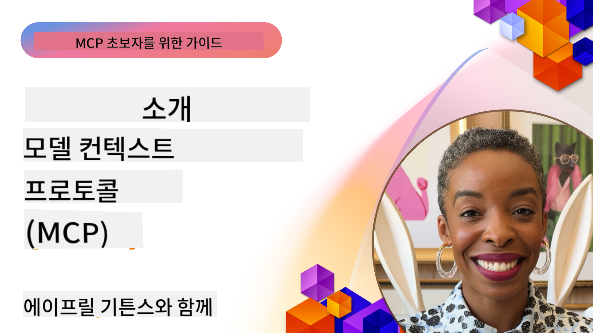
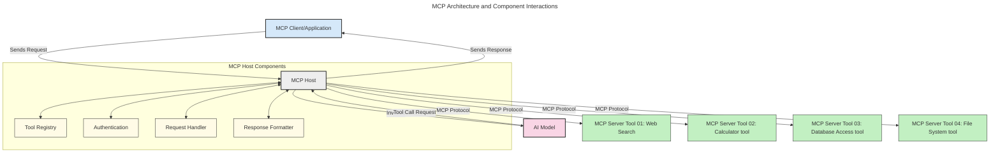
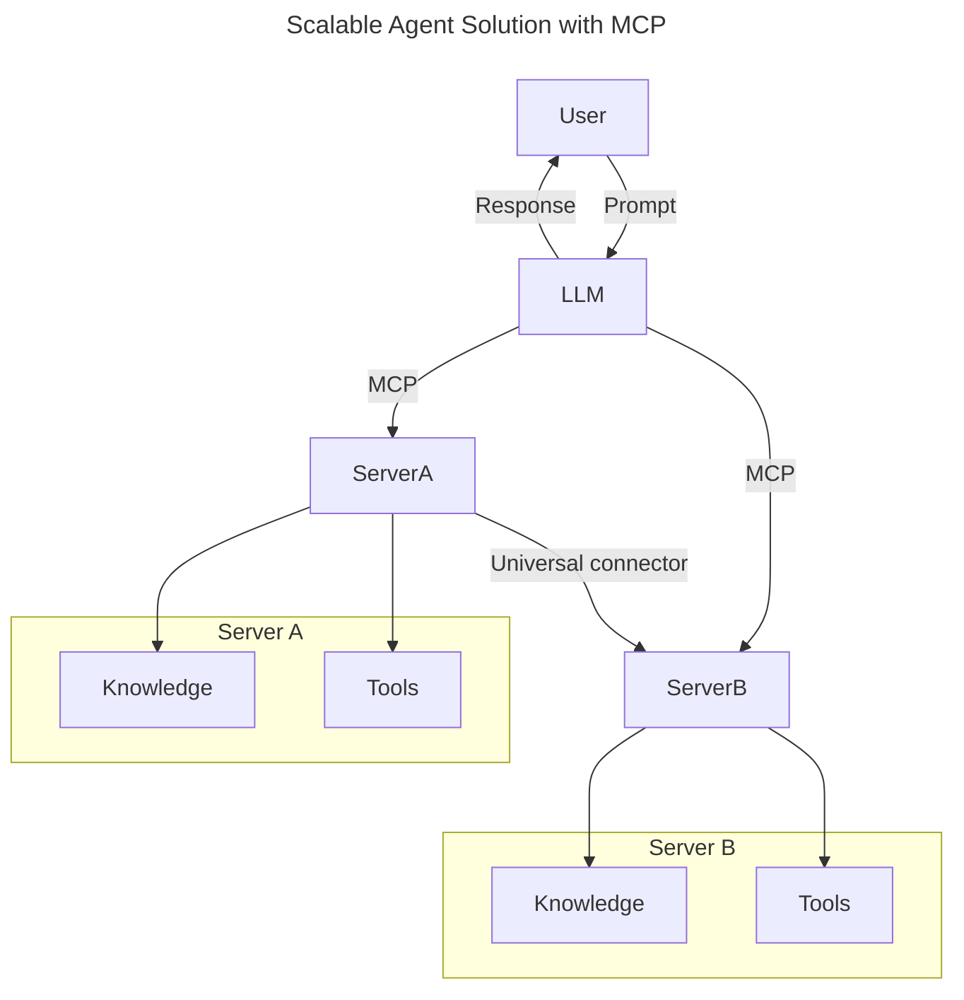
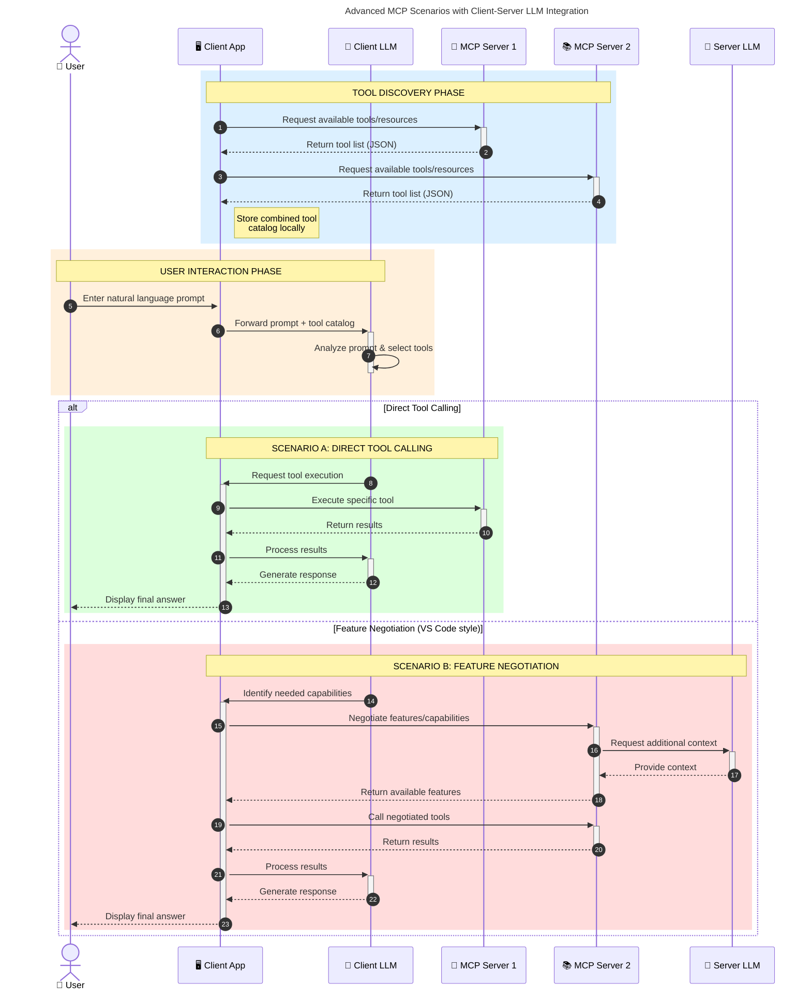

<!--
CO_OP_TRANSLATOR_METADATA:
{
  "original_hash": "0df1ee78a6dd8300f3a040ca5b411c2e",
  "translation_date": "2025-08-12T07:51:32+00:00",
  "source_file": "00-Introduction/README.md",
  "language_code": "ko"
}
-->
# 모델 컨텍스트 프로토콜(MCP) 소개: 확장 가능한 AI 애플리케이션을 위한 중요성

_(위 이미지를 클릭하면 이 강의의 동영상을 볼 수 있습니다)_

생성형 AI 애플리케이션은 자연어 프롬프트를 사용해 사용자와 상호작용할 수 있도록 하여 큰 진전을 이루었습니다. 하지만 이러한 앱에 더 많은 시간과 자원을 투자할수록 기능과 리소스를 쉽게 통합하고 확장 가능하며, 여러 모델을 지원하고 다양한 모델의 복잡성을 처리할 수 있도록 설계해야 합니다. 간단히 말해, 생성형 AI 앱을 처음 구축하는 것은 쉽지만, 앱이 성장하고 복잡해질수록 아키텍처를 정의하고 일관된 방식으로 앱을 구축하기 위한 표준이 필요하게 됩니다. 바로 이때 MCP가 등장하여 구조를 정리하고 표준을 제공합니다.

---

## **🔍 모델 컨텍스트 프로토콜(MCP)이란 무엇인가?**

**모델 컨텍스트 프로토콜(MCP)**은 **개방형 표준화 인터페이스**로, 대규모 언어 모델(LLM)이 외부 도구, API, 데이터 소스와 원활하게 상호작용할 수 있도록 합니다. MCP는 일관된 아키텍처를 제공하여 AI 모델이 학습 데이터 이상의 기능을 발휘할 수 있도록 하며, 더 스마트하고 확장 가능하며 반응성이 뛰어난 AI 시스템을 가능하게 합니다.

---

## **🎯 AI에서 표준화가 중요한 이유**

생성형 AI 애플리케이션이 점점 더 복잡해짐에 따라 **확장성, 확장 가능성, 유지 관리 용이성**을 보장하고 **벤더 종속을 피하기** 위한 표준을 채택하는 것이 필수적입니다. MCP는 다음과 같은 방식으로 이러한 요구를 충족합니다:

- 모델-도구 통합을 통합
- 취약하고 일회성인 맞춤 솔루션 감소
- 여러 벤더의 모델이 하나의 생태계에서 공존 가능

**Note:** MCP는 개방형 표준으로 홍보되지만, IEEE, IETF, W3C, ISO 또는 기타 표준 기구를 통해 MCP를 표준화할 계획은 없습니다.

---

## **📚 학습 목표**

이 글을 읽고 나면 다음을 할 수 있습니다:

- **모델 컨텍스트 프로토콜(MCP)**과 그 사용 사례 정의
- MCP가 모델-도구 간 통신을 표준화하는 방법 이해
- MCP 아키텍처의 핵심 구성 요소 식별
- 기업 및 개발 환경에서 MCP의 실제 응용 사례 탐구

---

## **💡 모델 컨텍스트 프로토콜(MCP)이 혁신적인 이유**

### **🔗 MCP는 AI 상호작용의 단편화를 해결합니다**

MCP 이전에는 모델과 도구를 통합하려면:

- 도구-모델 쌍마다 맞춤 코드 작성
- 각 벤더마다 비표준 API 사용
- 업데이트로 인해 자주 중단
- 더 많은 도구를 추가할 때 확장성 부족

### **✅ MCP 표준화의 이점**

| **이점**                  | **설명**                                                                        |
|--------------------------|--------------------------------------------------------------------------------|
| 상호운용성               | LLM이 다양한 벤더의 도구와 원활하게 작동                                       |
| 일관성                  | 플랫폼과 도구 전반에서 일관된 동작                                              |
| 재사용성                | 한 번 구축된 도구를 여러 프로젝트와 시스템에서 사용 가능                        |
| 개발 속도 향상           | 표준화된 플러그 앤 플레이 인터페이스를 사용하여 개발 시간 단축                  |

---

## **🧱 MCP 아키텍처 개요**

MCP는 **클라이언트-서버 모델**을 따르며:

- **MCP 호스트**는 AI 모델을 실행
- **MCP 클라이언트**는 요청을 시작
- **MCP 서버**는 컨텍스트, 도구 및 기능을 제공

### **핵심 구성 요소:**

- **리소스** – 모델을 위한 정적 또는 동적 데이터  
- **프롬프트** – 안내 생성 워크플로  
- **도구** – 검색, 계산과 같은 실행 가능한 기능  
- **샘플링** – 재귀적 상호작용을 통한 에이전트 행동  

---

## MCP 서버의 작동 방식

MCP 서버는 다음과 같은 방식으로 작동합니다:

- **요청 흐름**:
    1. 최종 사용자 또는 그를 대신하는 소프트웨어가 요청을 시작합니다.
    2. **MCP 클라이언트**가 요청을 **MCP 호스트**로 보내며, 이는 AI 모델 런타임을 관리합니다.
    3. **AI 모델**은 사용자 프롬프트를 받고 외부 도구나 데이터에 접근하기 위해 하나 이상의 도구 호출을 요청할 수 있습니다.
    4. **MCP 호스트**는 모델이 직접적으로가 아니라 표준화된 프로토콜을 사용하여 적절한 **MCP 서버**와 통신합니다.
- **MCP 호스트 기능**:
    - **도구 레지스트리**: 사용 가능한 도구와 그 기능의 카탈로그 유지
    - **인증**: 도구 접근 권한 확인
    - **요청 처리기**: 모델에서 들어오는 도구 요청 처리
    - **응답 포맷터**: 모델이 이해할 수 있는 형식으로 도구 출력 구조화
- **MCP 서버 실행**:
    - **MCP 호스트**는 도구 호출을 하나 이상의 **MCP 서버**로 라우팅하며, 각 서버는 검색, 계산, 데이터베이스 쿼리와 같은 전문 기능을 제공합니다.
    - **MCP 서버**는 각각의 작업을 수행하고 결과를 **MCP 호스트**에 일관된 형식으로 반환합니다.
    - **MCP 호스트**는 결과를 포맷팅하여 **AI 모델**에 전달합니다.
- **응답 완료**:
    - **AI 모델**은 도구 출력을 최종 응답에 통합합니다.
    - **MCP 호스트**는 이 응답을 **MCP 클라이언트**로 보내며, 이는 최종 사용자 또는 호출 소프트웨어에 전달합니다.

## 👨‍💻 MCP 서버 구축 방법 (예제 포함)

MCP 서버는 데이터를 제공하고 기능을 확장하여 LLM의 능력을 확장할 수 있습니다.

직접 시도해보고 싶으신가요? 다음은 다양한 언어/스택에서 간단한 MCP 서버를 생성하는 예제를 포함한 SDK입니다:

- **Python SDK**: https://github.com/modelcontextprotocol/python-sdk

- **TypeScript SDK**: https://github.com/modelcontextprotocol/typescript-sdk

- **Java SDK**: https://github.com/modelcontextprotocol/java-sdk

- **C#/.NET SDK**: https://github.com/modelcontextprotocol/csharp-sdk

---

## 🌍 MCP의 실제 응용 사례

MCP는 AI의 능력을 확장하여 다양한 애플리케이션을 가능하게 합니다:

| **애플리케이션**            | **설명**                                                                        |
|----------------------------|--------------------------------------------------------------------------------|
| 기업 데이터 통합           | LLM을 데이터베이스, CRM 또는 내부 도구와 연결                                  |
| 에이전트형 AI 시스템       | 도구 접근 및 의사결정 워크플로를 갖춘 자율 에이전트 활성화                     |
| 멀티모달 애플리케이션       | 텍스트, 이미지, 오디오 도구를 단일 통합 AI 앱 내에서 결합                     |
| 실시간 데이터 통합         | AI 상호작용에 실시간 데이터를 제공하여 더 정확하고 최신 결과 도출              |

### 🧠 MCP = AI 상호작용을 위한 범용 표준

모델 컨텍스트 프로토콜(MCP)은 USB-C가 장치의 물리적 연결을 표준화한 것처럼 AI 상호작용을 위한 범용 표준 역할을 합니다. AI 세계에서 MCP는 일관된 인터페이스를 제공하여 모델(클라이언트)이 외부 도구와 데이터 제공자(서버)와 원활하게 통합되도록 합니다. 이를 통해 각 API나 데이터 소스마다 다양한 맞춤 프로토콜이 필요하지 않게 됩니다.

MCP 하에서 MCP 호환 도구(즉, MCP 서버)는 통합 표준을 따릅니다. 이러한 서버는 제공하는 도구나 작업을 나열하고 AI 에이전트가 요청할 때 해당 작업을 실행할 수 있습니다. MCP를 지원하는 AI 에이전트 플랫폼은 서버에서 사용 가능한 도구를 발견하고 이 표준 프로토콜을 통해 이를 호출할 수 있습니다.

### 💡 지식 접근성 촉진

MCP는 도구 제공뿐만 아니라 지식 접근성도 촉진합니다. 이를 통해 애플리케이션이 대규모 언어 모델(LLM)에 컨텍스트를 제공할 수 있도록 다양한 데이터 소스와 연결합니다. 예를 들어, MCP 서버는 회사의 문서 저장소를 나타내어 에이전트가 필요할 때 관련 정보를 검색할 수 있도록 할 수 있습니다. 또 다른 서버는 이메일 전송이나 기록 업데이트와 같은 특정 작업을 처리할 수 있습니다. 에이전트 관점에서 보면, 이러한 작업은 단순히 사용할 수 있는 도구일 뿐이며, 일부 도구는 데이터를 반환(지식 컨텍스트)하고 다른 도구는 작업을 수행합니다. MCP는 이 두 가지를 효율적으로 관리합니다.

에이전트가 MCP 서버에 연결하면 표준 형식을 통해 서버의 사용 가능한 기능과 접근 가능한 데이터를 자동으로 학습합니다. 이 표준화는 동적 도구 가용성을 가능하게 합니다. 예를 들어, 에이전트 시스템에 새로운 MCP 서버를 추가하면 추가적인 에이전트 지침의 커스터마이징 없이 즉시 해당 기능을 사용할 수 있습니다.

이 통합된 흐름은 아래 다이어그램에 나타난 바와 같이 서버가 도구와 지식을 제공하여 시스템 간 원활한 협업을 보장합니다.

### 👉 예제: 확장 가능한 에이전트 솔루션

### 🔄 클라이언트 측 LLM 통합을 활용한 고급 MCP 시나리오

기본 MCP 아키텍처를 넘어, 클라이언트와 서버 모두 LLM을 포함하여 더 정교한 상호작용을 가능하게 하는 고급 시나리오가 있습니다. 아래 다이어그램에서 **클라이언트 앱**은 사용자가 LLM을 통해 MCP 도구를 사용할 수 있는 IDE일 수 있습니다:

---

## 🔐 MCP의 실질적인 이점

MCP를 사용함으로써 얻을 수 있는 실질적인 이점은 다음과 같습니다:

- **최신성**: 모델이 학습 데이터 외의 최신 정보를 접근 가능
- **기능 확장**: 모델이 학습되지 않은 작업을 수행할 수 있는 전문 도구 활용
- **환각 감소**: 외부 데이터 소스가 사실적 근거 제공
- **프라이버시**: 민감한 데이터가 프롬프트에 포함되지 않고 안전한 환경 내에 유지

---

## 📌 주요 요점

MCP 사용의 주요 요점은 다음과 같습니다:

- **MCP**는 AI 모델이 도구와 데이터를 상호작용하는 방식을 표준화
- **확장성, 일관성, 상호운용성**을 촉진
- MCP는 **개발 시간 단축, 신뢰성 향상, 모델 기능 확장**에 도움
- 클라이언트-서버 아키텍처는 **유연하고 확장 가능한 AI 애플리케이션**을 가능하게 함

---

## 🧠 연습 문제

구축하고 싶은 AI 애플리케이션에 대해 생각해보세요.

- 어떤 **외부 도구나 데이터**가 애플리케이션의 기능을 향상시킬 수 있을까요?
- MCP가 통합을 **더 간단하고 신뢰성 있게** 만드는 방법은 무엇일까요?

---

## 추가 자료

- [MCP GitHub Repository](https://github.com/modelcontextprotocol)

---

## 다음 단계

다음: [1장: 핵심 개념](../01-CoreConcepts/README.md)

**면책 조항**:  
이 문서는 AI 번역 서비스 [Co-op Translator](https://github.com/Azure/co-op-translator)를 사용하여 번역되었습니다. 정확성을 위해 최선을 다하고 있으나, 자동 번역에는 오류나 부정확성이 포함될 수 있습니다. 원본 문서를 해당 언어로 작성된 상태에서 권위 있는 자료로 간주해야 합니다. 중요한 정보의 경우, 전문적인 인간 번역을 권장합니다. 이 번역 사용으로 인해 발생하는 오해나 잘못된 해석에 대해 당사는 책임을 지지 않습니다.