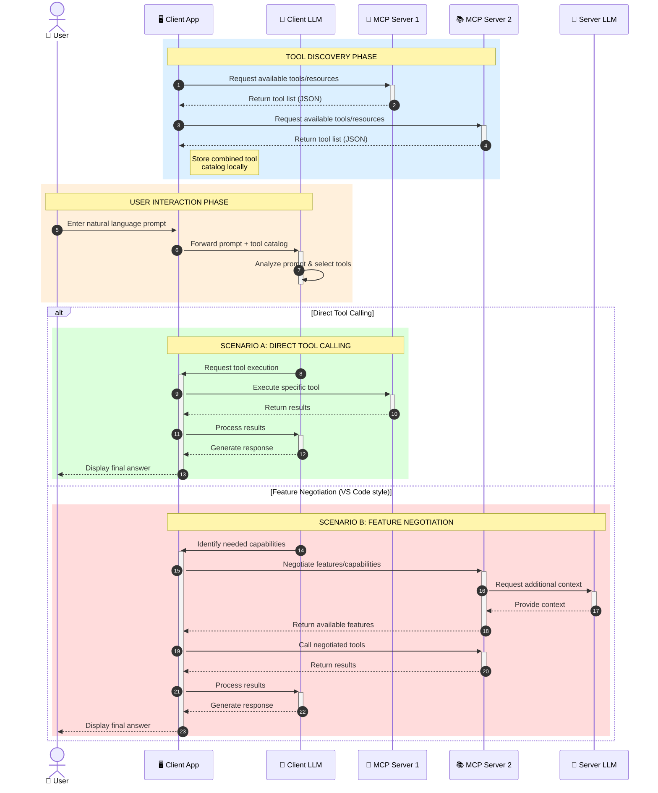

<!--
CO_OP_TRANSLATOR_METADATA:
{
  "original_hash": "25a94c681cf43612ff394d8cf78a74de",
  "translation_date": "2025-05-27T15:58:52+00:00",
  "source_file": "00-Introduction/README.md",
  "language_code": "ko"
}
-->
# Model Context Protocol (MCP) 소개: 확장 가능한 AI 애플리케이션에 왜 중요한가

생성 AI 애플리케이션은 사용자가 자연어 프롬프트로 앱과 상호작용할 수 있다는 점에서 큰 진전입니다. 하지만 이러한 앱에 더 많은 시간과 자원을 투자할수록, 기능과 리소스를 쉽게 통합하고 확장할 수 있도록, 여러 모델을 동시에 지원하며 다양한 모델 특성을 다룰 수 있는 구조가 필요합니다. 즉, 생성 AI 앱은 처음에는 쉽게 만들 수 있지만, 규모가 커지고 복잡해질수록 아키텍처를 정의하고 일관된 방식으로 앱을 구축하기 위해 표준에 의존해야 합니다. 바로 이 점에서 MCP가 체계적인 표준을 제공해 역할을 합니다.

---

## **🔍 Model Context Protocol (MCP)란?**

**Model Context Protocol (MCP)**은 대형 언어 모델(LLM)이 외부 도구, API, 데이터 소스와 원활하게 상호작용할 수 있도록 하는 **개방형 표준화된 인터페이스**입니다. MCP는 AI 모델이 학습 데이터 외부의 기능을 확장할 수 있도록 일관된 아키텍처를 제공하여, 더 똑똑하고 확장 가능하며 반응성이 뛰어난 AI 시스템을 구현할 수 있게 합니다.

---

## **🎯 AI에서 표준화가 중요한 이유**

생성 AI 애플리케이션이 점점 복잡해짐에 따라, **확장성, 확장 가능성, 유지보수성**을 보장하는 표준 도입이 필수적입니다. MCP는 다음과 같은 요구를 충족합니다:

- 모델-도구 통합의 통일성 확보
- 일회성 맞춤형 솔루션 감소
- 하나의 생태계에서 여러 모델 공존 허용

---

## **📚 학습 목표**

이 글을 읽고 나면 다음을 할 수 있습니다:

- **Model Context Protocol (MCP)** 정의와 활용 사례 이해
- MCP가 모델과 도구 간 통신을 어떻게 표준화하는지 파악
- MCP 아키텍처의 핵심 구성 요소 식별
- 엔터프라이즈 및 개발 환경에서 MCP의 실제 적용 사례 탐색

---

## **💡 MCP가 게임 체인저인 이유**

### **🔗 MCP가 AI 상호작용의 단편화를 해결하다**

MCP 이전에는 모델과 도구를 통합하려면 다음이 필요했습니다:

- 도구-모델 쌍마다 맞춤 코드 작성
- 공급사별 비표준 API 사용
- 업데이트 시 잦은 연동 중단 발생
- 도구가 많아질수록 확장성 저하

### **✅ MCP 표준화의 장점**

| **장점**                 | **설명**                                                                   |
|--------------------------|----------------------------------------------------------------------------|
| 상호운용성               | LLM이 다양한 공급사의 도구와 원활하게 작동                                 |
| 일관성                   | 플랫폼과 도구 전반에 걸쳐 균일한 동작 보장                                |
| 재사용성                 | 한 번 구축한 도구를 여러 프로젝트와 시스템에서 재활용 가능                |
| 개발 가속화              | 표준화된 플러그 앤 플레이 인터페이스로 개발 시간 단축                    |

---

## **🧱 MCP 아키텍처 개요**

MCP는 **클라이언트-서버 모델**을 따르며:

- **MCP Hosts**는 AI 모델을 실행
- **MCP Clients**는 요청을 시작
- **MCP Servers**는 컨텍스트, 도구, 기능을 제공

### **핵심 구성 요소:**

- **Resources** – 모델에 제공되는 정적 또는 동적 데이터  
- **Prompts** – 안내된 생성 워크플로우를 위한 사전 정의된 프롬프트  
- **Tools** – 검색, 계산 등 실행 가능한 함수  
- **Sampling** – 재귀적 상호작용을 통한 에이전트 행동

---

## MCP 서버 작동 방식

MCP 서버는 다음과 같이 작동합니다:

- **요청 흐름**:  
    1. MCP Client가 MCP Host에서 실행 중인 AI 모델에 요청을 보냄  
    2. AI 모델이 외부 도구나 데이터가 필요할 때 인지  
    3. 모델이 표준화된 프로토콜을 사용해 MCP Server와 통신  

- **MCP 서버 기능**:  
    - 도구 등록부: 사용 가능한 도구와 기능 목록 관리  
    - 인증: 도구 접근 권한 확인  
    - 요청 처리기: 모델로부터 들어오는 도구 요청 처리  
    - 응답 포매터: 모델이 이해할 수 있는 형식으로 도구 출력 구성  

- **도구 실행**:  
    - 서버가 적절한 외부 도구로 요청 라우팅  
    - 도구는 검색, 계산, 데이터베이스 쿼리 등 특화 기능 수행  
    - 결과는 일관된 형식으로 모델에 반환  

- **응답 완료**:  
    - AI 모델이 도구 출력을 응답에 통합  
    - 최종 응답을 클라이언트 애플리케이션에 전달  

## 👨‍💻 MCP 서버 구축 방법 (예제 포함)

MCP 서버는 LLM 기능을 확장해 데이터와 기능을 제공합니다.

직접 시도해보고 싶다면, 여러 언어로 작성된 간단한 MCP 서버 예제를 참고하세요:

- **Python 예제**: https://github.com/modelcontextprotocol/python-sdk

- **TypeScript 예제**: https://github.com/modelcontextprotocol/typescript-sdk

- **Java 예제**: https://github.com/modelcontextprotocol/java-sdk

- **C#/.NET 예제**: https://github.com/modelcontextprotocol/csharp-sdk

## 🌍 MCP의 실제 활용 사례

MCP는 AI 기능 확장을 통해 다양한 애플리케이션에 활용됩니다:

| **애플리케이션**             | **설명**                                                                |
|------------------------------|------------------------------------------------------------------------|
| 엔터프라이즈 데이터 통합      | LLM을 데이터베이스, CRM, 내부 도구와 연결                              |
| 에이전트 AI 시스템           | 도구 접근 및 의사결정 워크플로우를 갖춘 자율 에이전트 지원             |
| 멀티모달 애플리케이션        | 텍스트, 이미지, 오디오 도구를 하나의 통합 AI 앱 내에서 결합            |
| 실시간 데이터 통합           | 최신 데이터를 AI 상호작용에 반영해 더 정확하고 최신 결과 제공          |

### 🧠 MCP = AI 상호작용을 위한 범용 표준

Model Context Protocol(MCP)은 USB-C가 기기 간 물리적 연결을 표준화한 것처럼 AI 상호작용을 위한 범용 표준 역할을 합니다. AI 세계에서 MCP는 모델(클라이언트)이 외부 도구와 데이터 제공자(서버)와 원활히 통합할 수 있도록 일관된 인터페이스를 제공합니다. 이를 통해 각 API나 데이터 소스마다 다양한 맞춤 프로토콜이 필요 없게 됩니다.

MCP 호환 도구(즉, MCP 서버)는 통합된 표준을 따릅니다. 이 서버들은 제공 가능한 도구나 작업을 목록화하고, AI 에이전트가 요청할 때 해당 작업을 실행합니다. MCP를 지원하는 AI 에이전트 플랫폼은 서버에서 사용 가능한 도구를 찾아내고 이 표준 프로토콜을 통해 호출할 수 있습니다.

### 💡 지식 접근성 향상

도구 제공 외에도 MCP는 지식 접근성을 촉진합니다. 다양한 데이터 소스와 연결해 LLM에 컨텍스트를 제공합니다. 예를 들어, MCP 서버는 회사 문서 저장소 역할을 하며, 에이전트가 필요할 때 관련 정보를 가져올 수 있습니다. 또 다른 서버는 이메일 전송이나 기록 업데이트 같은 특정 작업을 처리할 수 있습니다. 에이전트 입장에서는 이 모든 것이 사용할 수 있는 도구이며, 일부 도구는 데이터를 반환(지식 컨텍스트)하고, 다른 도구는 작업을 수행합니다. MCP는 이 둘을 효율적으로 관리합니다.

에이전트가 MCP 서버에 연결하면, 표준 형식을 통해 서버가 제공하는 기능과 접근 가능한 데이터를 자동으로 학습합니다. 이 표준화 덕분에 도구 가용성이 동적으로 변할 수 있습니다. 예를 들어, 에이전트 시스템에 새 MCP 서버를 추가하면 별도의 에이전트 명령어 수정 없이 즉시 해당 기능을 사용할 수 있습니다.

이러한 간소화된 통합은 mermaid 다이어그램에서 보여주는 흐름과 일치하며, 서버가 도구와 지식을 모두 제공해 시스템 간 원활한 협업을 보장합니다.

### 👉 예시: 확장 가능한 에이전트 솔루션

### 🔄 클라이언트 측 LLM 통합을 통한 고급 MCP 시나리오

기본 MCP 아키텍처를 넘어, 클라이언트와 서버 모두 LLM을 포함하는 고급 시나리오도 있습니다. 이를 통해 더 정교한 상호작용이 가능합니다:

## 🔐 MCP의 실용적 이점

MCP 사용의 실질적 이점은 다음과 같습니다:

- **최신성**: 모델이 학습 데이터 외 최신 정보에 접근 가능  
- **기능 확장**: 학습되지 않은 작업을 위한 특화 도구 활용 가능  
- **환각 감소**: 외부 데이터 소스가 사실적 근거 제공  
- **개인정보 보호**: 민감 데이터가 프롬프트에 포함되지 않고 안전한 환경에 유지  

## 📌 핵심 요약

MCP 사용 시 주요 내용은 다음과 같습니다:

- **MCP**는 AI 모델과 도구, 데이터 간 상호작용 방식을 표준화  
- **확장성, 일관성, 상호운용성** 촉진  
- 개발 시간 단축, 신뢰성 향상, 모델 기능 확장에 기여  
- 클라이언트-서버 아키텍처로 유연하고 확장 가능한 AI 애플리케이션 지원  

## 🧠 연습 문제

만들고 싶은 AI 애플리케이션을 생각해보세요.

- 어떤 **외부 도구나 데이터**가 기능을 향상시킬 수 있을까요?  
- MCP가 통합을 어떻게 **더 쉽고 신뢰성 있게** 만들어 줄까요?  

## 추가 자료

- [MCP GitHub Repository](https://github.com/modelcontextprotocol)

## 다음 단계

다음: [Chapter 1: Core Concepts](/01-CoreConcepts/README.md)

**면책 조항**:  
이 문서는 AI 번역 서비스 [Co-op Translator](https://github.com/Azure/co-op-translator)를 사용하여 번역되었습니다. 정확성을 위해 최선을 다하고 있으나, 자동 번역에는 오류나 부정확한 내용이 포함될 수 있음을 유의해 주시기 바랍니다. 원본 문서의 원어 버전이 권위 있는 출처로 간주되어야 합니다. 중요한 정보의 경우 전문적인 인간 번역을 권장합니다. 본 번역 사용으로 인해 발생하는 오해나 잘못된 해석에 대해서는 당사가 책임지지 않습니다.