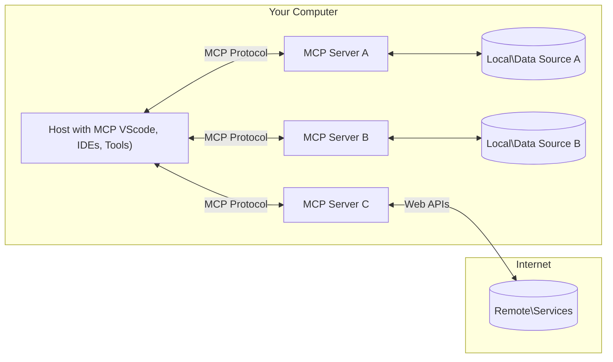

<!--
CO_OP_TRANSLATOR_METADATA:
{
  "original_hash": "355b12a5970c5c9e6db0bee970c751ba",
  "translation_date": "2025-07-13T15:51:55+00:00",
  "source_file": "01-CoreConcepts/README.md",
  "language_code": "ko"
}
-->
# 📖 MCP 핵심 개념: AI 통합을 위한 모델 컨텍스트 프로토콜 마스터하기

[Model Context Protocol (MCP)](https://github.com/modelcontextprotocol)은 대형 언어 모델(LLM)과 외부 도구, 애플리케이션, 데이터 소스 간의 통신을 최적화하는 강력하고 표준화된 프레임워크입니다. 이 SEO 최적화 가이드는 MCP의 핵심 개념을 단계별로 설명하여 클라이언트-서버 아키텍처, 주요 구성 요소, 통신 메커니즘, 구현 모범 사례를 확실히 이해할 수 있도록 도와줍니다.

## 개요

이 강의에서는 Model Context Protocol (MCP) 생태계를 구성하는 기본 아키텍처와 구성 요소를 살펴봅니다. MCP 상호작용을 가능하게 하는 클라이언트-서버 아키텍처, 주요 구성 요소, 통신 메커니즘에 대해 배웁니다.

## 👩‍🎓 주요 학습 목표

이 강의를 마치면 다음을 할 수 있습니다:

- MCP 클라이언트-서버 아키텍처 이해하기
- Hosts, Clients, Servers의 역할과 책임 파악하기
- MCP를 유연한 통합 계층으로 만드는 핵심 기능 분석하기
- MCP 생태계 내 정보 흐름 학습하기
- .NET, Java, Python, JavaScript 코드 예제를 통해 실용적인 인사이트 얻기

## 🔎 MCP 아키텍처: 심층 분석

MCP 생태계는 클라이언트-서버 모델을 기반으로 구축되어 있습니다. 이 모듈식 구조는 AI 애플리케이션이 도구, 데이터베이스, API, 컨텍스트 리소스와 효율적으로 상호작용할 수 있게 합니다. 아키텍처를 핵심 구성 요소로 나누어 살펴보겠습니다.

MCP는 기본적으로 호스트 애플리케이션이 여러 서버에 연결할 수 있는 클라이언트-서버 아키텍처를 따릅니다:



- **MCP Hosts**: VSCode, Claude Desktop, IDE, 또는 MCP를 통해 데이터에 접근하려는 AI 도구 같은 프로그램
- **MCP Clients**: 서버와 1:1 연결을 유지하는 프로토콜 클라이언트
- **MCP Servers**: 표준화된 Model Context Protocol을 통해 특정 기능을 제공하는 경량 프로그램
- **로컬 데이터 소스**: MCP 서버가 안전하게 접근할 수 있는 컴퓨터 내 파일, 데이터베이스, 서비스
- **원격 서비스**: MCP 서버가 API를 통해 인터넷 상에서 연결할 수 있는 외부 시스템

MCP 프로토콜은 계속 발전하는 표준이며 최신 업데이트는 [프로토콜 명세](https://modelcontextprotocol.io/specification/2025-06-18/)에서 확인할 수 있습니다.

### 1. Hosts

Model Context Protocol (MCP)에서 Hosts는 사용자가 프로토콜과 상호작용하는 주요 인터페이스 역할을 합니다. Hosts는 MCP 서버와 연결을 시작하여 데이터, 도구, 프롬프트에 접근하는 애플리케이션이나 환경입니다. 예를 들어 Visual Studio Code 같은 통합 개발 환경(IDE), Claude Desktop 같은 AI 도구, 특정 작업을 위해 맞춤 제작된 에이전트 등이 있습니다.

**Hosts**는 LLM 애플리케이션으로서 다음을 수행합니다:

- AI 모델을 실행하거나 상호작용하여 응답 생성
- MCP 서버와 연결 시작
- 대화 흐름과 사용자 인터페이스 관리
- 권한 및 보안 제어
- 데이터 공유 및 도구 실행에 대한 사용자 동의 처리

### 2. Clients

Clients는 Hosts와 MCP 서버 간 상호작용을 원활하게 하는 필수 구성 요소입니다. Clients는 중개자 역할을 하여 Hosts가 MCP 서버가 제공하는 기능을 활용할 수 있도록 합니다. MCP 아키텍처 내에서 원활한 통신과 효율적인 데이터 교환을 보장하는 중요한 역할을 합니다.

**Clients**는 호스트 애플리케이션 내의 연결자입니다. 이들은:

- 프롬프트/명령과 함께 서버에 요청 전송
- 서버와 기능 협상 수행
- 모델로부터의 도구 실행 요청 관리
- 사용자에게 응답 처리 및 표시

### 3. Servers

Servers는 MCP 클라이언트의 요청을 처리하고 적절한 응답을 제공하는 역할을 합니다. 데이터 검색, 도구 실행, 프롬프트 생성 등 다양한 작업을 관리합니다. 서버는 클라이언트와 Hosts 간 통신이 효율적이고 신뢰성 있게 이루어지도록 하며 상호작용 과정의 무결성을 유지합니다.

**Servers**는 컨텍스트와 기능을 제공하는 서비스입니다. 이들은:

- 사용 가능한 기능(리소스, 프롬프트, 도구) 등록
- 클라이언트로부터 도구 호출 수신 및 실행
- 모델 응답을 향상시키기 위한 컨텍스트 정보 제공
- 결과를 클라이언트에 반환
- 필요 시 상호작용 간 상태 유지

서버는 누구나 개발할 수 있으며, 특화된 기능으로 모델의 역량을 확장할 수 있습니다.

### 4. 서버 기능

Model Context Protocol (MCP)의 서버는 클라이언트, 호스트, 언어 모델 간 풍부한 상호작용을 가능하게 하는 기본 빌딩 블록을 제공합니다. 이 기능들은 구조화된 컨텍스트, 도구, 프롬프트를 제공하여 MCP의 역량을 강화하도록 설계되었습니다.

MCP 서버는 다음과 같은 기능을 제공할 수 있습니다:

#### 📑 리소스

MCP에서 리소스는 사용자나 AI 모델이 활용할 수 있는 다양한 유형의 컨텍스트와 데이터를 포함합니다. 여기에는 다음이 포함됩니다:

- **컨텍스트 데이터**: 사용자나 AI 모델이 의사결정과 작업 수행에 활용할 수 있는 정보와 맥락
- **지식 베이스 및 문서 저장소**: 기사, 매뉴얼, 연구 논문 등 구조화 및 비구조화된 데이터 모음으로 유용한 인사이트 제공
- **로컬 파일 및 데이터베이스**: 장치 내 또는 데이터베이스에 저장된 데이터로 처리 및 분석에 사용 가능
- **API 및 웹 서비스**: 다양한 온라인 리소스 및 도구와 통합할 수 있는 외부 인터페이스 및 서비스

리소스 예시는 데이터베이스 스키마나 다음과 같이 접근 가능한 파일일 수 있습니다:

```text
file://log.txt
database://schema
```

### 🤖 프롬프트

MCP의 프롬프트는 사용자 워크플로우를 간소화하고 커뮤니케이션을 향상시키기 위해 설계된 다양한 사전 정의된 템플릿과 상호작용 패턴을 포함합니다. 여기에는 다음이 포함됩니다:

- **템플릿화된 메시지 및 워크플로우**: 특정 작업과 상호작용을 안내하는 사전 구조화된 메시지와 프로세스
- **사전 정의된 상호작용 패턴**: 일관되고 효율적인 커뮤니케이션을 위한 표준화된 행동 및 응답 시퀀스
- **특화된 대화 템플릿**: 특정 유형의 대화에 맞게 맞춤화된 템플릿으로 관련성 있고 맥락에 적합한 상호작용 보장

프롬프트 템플릿 예시는 다음과 같습니다:

```markdown
Generate a product slogan based on the following {{product}} with the following {{keywords}}
```

#### ⛏️ 도구

MCP의 도구는 AI 모델이 특정 작업을 수행하기 위해 실행할 수 있는 함수입니다. 이 도구들은 구조화되고 신뢰할 수 있는 작업을 제공하여 AI 모델의 기능을 확장하도록 설계되었습니다. 주요 특징은 다음과 같습니다:

- **AI 모델이 실행할 수 있는 함수**: 도구는 AI 모델이 호출하여 다양한 작업을 수행할 수 있는 실행 가능한 함수입니다.
- **고유한 이름과 설명**: 각 도구는 목적과 기능을 설명하는 고유한 이름과 상세 설명을 가집니다.
- **매개변수와 출력**: 도구는 특정 매개변수를 받고 구조화된 출력을 반환하여 일관되고 예측 가능한 결과를 보장합니다.
- **독립적인 기능**: 웹 검색, 계산, 데이터베이스 쿼리 등 독립적인 기능 수행

도구 예시는 다음과 같습니다:

```typescript
server.tool(
  "GetProducts",
  {
    pageSize: z.string().optional(),
    pageCount: z.string().optional()
  }, () => {
    // return results from API
  }
)
```

## 클라이언트 기능

MCP에서 클라이언트는 서버에 여러 핵심 기능을 제공하여 프로토콜 내 전반적인 기능과 상호작용을 향상시킵니다. 그중 하나가 샘플링입니다.

### 👉 샘플링

- **서버 주도 에이전트 행동**: 클라이언트는 서버가 특정 행동이나 작업을 자율적으로 시작할 수 있도록 지원하여 시스템의 동적 역량을 강화합니다.
- **재귀적 LLM 상호작용**: 이 기능은 대형 언어 모델(LLM)과의 재귀적 상호작용을 가능하게 하여 더 복잡하고 반복적인 작업 처리를 지원합니다.
- **추가 모델 완성 요청**: 서버는 모델에 추가 완성을 요청할 수 있어 응답이 더 완전하고 맥락에 적합하도록 합니다.

## MCP 내 정보 흐름

Model Context Protocol (MCP)은 호스트, 클라이언트, 서버, 모델 간 정보의 구조화된 흐름을 정의합니다. 이 흐름을 이해하면 사용자 요청이 어떻게 처리되고 외부 도구 및 데이터가 모델 응답에 통합되는지 명확해집니다.

- **호스트가 연결 시작**  
  IDE나 채팅 인터페이스 같은 호스트 애플리케이션이 일반적으로 STDIO, WebSocket 또는 지원되는 다른 전송 방식을 통해 MCP 서버에 연결을 설정합니다.

- **기능 협상**  
  호스트에 내장된 클라이언트와 서버가 지원하는 기능, 도구, 리소스, 프로토콜 버전에 대해 정보를 교환합니다. 이를 통해 양측이 세션에서 사용할 수 있는 기능을 이해합니다.

- **사용자 요청**  
  사용자가 호스트와 상호작용(예: 프롬프트나 명령 입력)합니다. 호스트는 이 입력을 수집하여 클라이언트에 전달합니다.

- **리소스 또는 도구 사용**  
  - 클라이언트는 모델의 이해를 풍부하게 하기 위해 서버에 추가 컨텍스트나 리소스(파일, 데이터베이스 항목, 지식 베이스 문서 등)를 요청할 수 있습니다.
  - 모델이 도구 사용이 필요하다고 판단하면(예: 데이터 조회, 계산 수행, API 호출) 클라이언트는 도구 이름과 매개변수를 명시하여 서버에 도구 호출 요청을 보냅니다.

- **서버 실행**  
  서버는 리소스 또는 도구 요청을 받아 필요한 작업(함수 실행, 데이터베이스 쿼리, 파일 조회 등)을 수행하고 결과를 구조화된 형식으로 클라이언트에 반환합니다.

- **응답 생성**  
  클라이언트는 서버의 응답(리소스 데이터, 도구 출력 등)을 현재 모델 상호작용에 통합합니다. 모델은 이 정보를 활용해 포괄적이고 맥락에 적합한 응답을 생성합니다.

- **결과 표시**  
  호스트는 클라이언트로부터 최종 출력을 받아 사용자에게 보여줍니다. 여기에는 모델이 생성한 텍스트와 도구 실행 또는 리소스 조회 결과가 포함될 수 있습니다.

이 흐름 덕분에 MCP는 모델과 외부 도구 및 데이터 소스를 원활하게 연결하여 고급, 상호작용적이며 컨텍스트 인지 AI 애플리케이션을 지원합니다.

## 프로토콜 세부사항

MCP(Model Context Protocol)는 [JSON-RPC 2.0](https://www.jsonrpc.org/) 위에 구축되어 호스트, 클라이언트, 서버 간 통신을 위한 표준화되고 언어에 구애받지 않는 메시지 형식을 제공합니다. 이 기반은 다양한 플랫폼과 프로그래밍 언어 간 신뢰성 있고 구조화된 확장 가능한 상호작용을 가능하게 합니다.

### 주요 프로토콜 기능

MCP는 도구 호출, 리소스 접근, 프롬프트 관리를 위한 추가 규약을 JSON-RPC 2.0에 확장합니다. STDIO, WebSocket, SSE 등 여러 전송 계층을 지원하며, 구성 요소 간 안전하고 확장 가능하며 언어 독립적인 통신을 가능하게 합니다.

#### 🧢 기본 프로토콜

- **JSON-RPC 메시지 형식**: 모든 요청과 응답은 JSON-RPC 2.0 명세를 따르며, 메서드 호출, 매개변수, 결과, 오류 처리를 일관된 구조로 보장합니다.
- **상태 유지 연결**: MCP 세션은 여러 요청에 걸쳐 상태를 유지하여 지속적인 대화, 컨텍스트 누적, 리소스 관리를 지원합니다.
- **기능 협상**: 연결 설정 시 클라이언트와 서버가 지원하는 기능, 프로토콜 버전, 사용 가능한 도구 및 리소스에 대해 정보를 교환합니다. 이를 통해 양측이 서로의 역량을 이해하고 적응할 수 있습니다.

#### ➕ 추가 유틸리티

MCP가 제공하는 추가 유틸리티와 프로토콜 확장 기능은 개발자 경험을 향상시키고 고급 시나리오를 지원합니다:

- **구성 옵션**: 도구 권한, 리소스 접근, 모델 설정 등 세션 매개변수를 동적으로 구성할 수 있어 각 상호작용에 맞춤화 가능
- **진행 상황 추적**: 장시간 실행 작업이 진행 상황 업데이트를 보고할 수 있어 반응형 UI와 향상된 사용자 경험 제공
- **요청 취소**: 클라이언트가 진행 중인 요청을 취소할 수 있어 불필요하거나 지연되는 작업을 중단 가능
- **오류 보고**: 표준화된 오류 메시지와 코드로 문제 진단, 실패 처리, 사용자 및 개발자에게 실행 가능한 피드백 제공
- **로깅**: 클라이언트와 서버 모두 감사, 디버깅, 프로토콜 상호작용 모니터링을 위한 구조화된 로그를 생성 가능

이러한 프로토콜 기능을 활용해 MCP는 언어 모델과 외부 도구 및 데이터 소스 간 견고하고 안전하며 유연한 통신을 보장합니다.

### 🔐 보안 고려사항

MCP 구현체는 안전하고 신뢰할 수 있는 상호작용을 위해 다음 주요 보안 원칙을 준수해야 합니다:

- **사용자 동의 및 제어**: 데이터 접근이나 작업 수행 전에 사용자의 명시적 동의를 받아야 합니다. 사용자는 어떤 데이터가 공유되고 어떤 작업이 승인되는지 명확히 제어할 수 있어야 하며, 이를 검토하고 승인할 수 있는 직관적인 UI가 제공되어야 합니다.

- **데이터 프라이버시**: 사용자 데이터는 명시적 동의가 있을 때만 노출되어야 하며 적절한 접근 제어로 보호되어야 합니다. MCP 구현체는 무단 데이터 전송을 방지하고 모든 상호작용에서 프라이버시가 유지되도록 해야 합니다.

- **도구 안전성**: 도구 호출 전 반드시 명시적 사용자 동의가 필요합니다. 사용자는 각 도구의 기능을 명확히 이해해야 하며, 의도치 않거나 위험한 도구 실행을 방지하기 위한 강력한 보안 경계가 적용되어야 합니다.

이 원칙들을 준수함으로써 MCP는 모든 프로토콜 상호작용에서 사용자 신뢰, 프라이버시, 안전을 보장합니다.

## 코드 예제: 주요 구성 요소

아래는 여러 인기 프로그래밍 언어로 작성된 MCP 서버 주요 구성 요소 및 도구 구현 예제입니다.

### .NET 예제: 도구가 포함된 간단한 MCP 서버 만들기

다음은 .NET에서 도구를 정의하고 등록하며 요청을 처리하고 Model Context Protocol을 사용해 서버를 연결하는 방법을 보여주는 실용적인 코드 예제입니다.

```csharp
using System;
using System.Threading.Tasks;
using ModelContextProtocol.Server;
using ModelContextProtocol.Server.Transport;
using ModelContextProtocol.Server.Tools;

public class WeatherServer
{
    public static async Task Main(string[] args)
    {
        // Create an MCP server
        var server = new McpServer(
            name: "Weather MCP Server",
            version: "1.0.0"
        );
        
        // Register our custom weather tool
        server.AddTool<string, WeatherData>("weatherTool", 
            description: "Gets current weather for a location",
            execute: async (location) => {
                // Call weather API (simplified)
                var weatherData = await GetWeatherDataAsync(location);
                return weatherData;
            });
        
        // Connect the server using stdio transport
        var transport = new StdioServerTransport();
        await server.ConnectAsync(transport);
        
        Console.WriteLine("Weather MCP Server started");
        
        // Keep the server running until process is terminated
        await Task.Delay(-1);
    }
    
    private static async Task<WeatherData> GetWeatherDataAsync(string location)
    {
        // This would normally call a weather API
        // Simplified for demonstration
        await Task.Delay(100); // Simulate API call
        return new WeatherData { 
            Temperature = 72.5,
            Conditions = "Sunny",
            Location = location
        };
    }
}

public class WeatherData
{
    public double Temperature { get; set; }
    public string Conditions { get; set; }
    public string Location { get; set; }
}
```

### Java 예제: MCP 서버 구성 요소

이 예제는 위 .NET 예제와 동일한 MCP 서버 및 도구 등록을 Java로 구현한 것입니다.

```java
import io.modelcontextprotocol.server.McpServer;
import io.modelcontextprotocol.server.McpToolDefinition;
import io.modelcontextprotocol.server.transport.StdioServerTransport;
import io.modelcontextprotocol.server.tool.ToolExecutionContext;
import io.modelcontextprotocol.server.tool.ToolResponse;

public class WeatherMcpServer {
    public static void main(String[] args) throws Exception {
        // Create an MCP server
        McpServer server = McpServer.builder()
            .name("Weather MCP Server")
            .version("1.0.0")
            .build();
            
        // Register a weather tool
        server.registerTool(McpToolDefinition.builder("weatherTool")
            .description("Gets current weather for a location")
            .parameter("location", String.class)
            .execute((ToolExecutionContext ctx) -> {
                String location = ctx.getParameter("location", String.class);
                
                // Get weather data (simplified)
                WeatherData data = getWeatherData(location);
                
                // Return formatted response
                return ToolResponse.content(
                    String.format("Temperature: %.1f°F, Conditions: %s, Location: %s", 
                    data.getTemperature(), 
                    data.getConditions(), 
                    data.getLocation())
                );
            })
            .build());
        
        // Connect the server using stdio transport
        try (StdioServerTransport transport = new StdioServerTransport()) {
            server.connect(transport);
            System.out.println("Weather MCP Server started");
            // Keep server running until process is terminated
            Thread.currentThread().join();
        }
    }
    
    private static WeatherData getWeatherData(String location) {
        // Implementation would call a weather API
        // Simplified for example purposes
        return new WeatherData(72.5, "Sunny", location);
    }
}

class WeatherData {
    private double temperature;
    private String conditions;
    private String location;
    
    public WeatherData(double temperature, String conditions, String location) {
        this.temperature = temperature;
        this.conditions = conditions;
        this.location = location;
    }
    
    public double getTemperature() {
        return temperature;
    }
    
    public String getConditions() {
        return conditions;
    }
    
    public String getLocation() {
        return location;
    }
}
```

### Python 예제: MCP 서버 구축

이 예제에서는 Python으로 MCP 서버를 구축하는 방법과 두 가지 다른 도구 생성 방식을 보여줍니다.

```python
#!/usr/bin/env python3
import asyncio
from mcp.server.fastmcp import FastMCP
from mcp.server.transports.stdio import serve_stdio

# Create a FastMCP server
mcp = FastMCP(
    name="Weather MCP Server",
    version="1.0.0"
)

@mcp.tool()
def get_weather(location: str) -> dict:
    """Gets current weather for a location."""
    # This would normally call a weather API
    # Simplified for demonstration
    return {
        "temperature": 72.5,
        "conditions": "Sunny",
        "location": location
    }

# Alternative approach using a class
class WeatherTools:
    @mcp.tool()
    def forecast(self, location: str, days: int = 1) -> dict:
        """Gets weather forecast for a location for the specified number of days."""
        # This would normally call a weather API forecast endpoint
        # Simplified for demonstration
        return {
            "location": location,
            "forecast": [
                {"day": i+1, "temperature": 70 + i, "conditions": "Partly Cloudy"}
                for i in range(days)
            ]
        }

# Instantiate the class to register its tools
weather_tools = WeatherTools()

# Start the server using stdio transport
if __name__ == "__main__":
    asyncio.run(serve_stdio(mcp))
```

### JavaScript 예제: MCP 서버 생성

이 예제는 JavaScript로 MCP 서버를 생성하고 두 개의 날씨 관련 도구를 등록하는 방법을 보여줍니다.

```javascript
// Using the official Model Context Protocol SDK
import { McpServer } from "@modelcontextprotocol/sdk/server/mcp.js";
import { StdioServerTransport } from "@modelcontextprotocol/sdk/server/stdio.js";
import { z } from "zod"; // For parameter validation

// Create an MCP server
const server = new McpServer({
  name: "Weather MCP Server",
  version: "1.0.0"
});

// Define a weather tool
server.tool(
  "weatherTool",
  {
    location: z.string().describe("The location to get weather for")
  },
  async ({ location }) => {
    // This would normally call a weather API
    // Simplified for demonstration
    const weatherData = await getWeatherData(location);
    
    return {
      content: [
        { 
          type: "text", 
          text: `Temperature: ${weatherData.temperature}°F, Conditions: ${weatherData.conditions}, Location: ${weatherData.location}` 
        }
      ]
    };
  }
);

// Define a forecast tool
server.tool(
  "forecastTool",
  {
    location: z.string(),
    days: z.number().default(3).describe("Number of days for forecast")
  },
  async ({ location, days }) => {
    // This would normally call a weather API
    // Simplified for demonstration
    const forecast = await getForecastData(location, days);
    
    return {
      content: [
        { 
          type: "text", 
          text: `${days}-day forecast for ${location}: ${JSON.stringify(forecast)}` 
        }
      ]
    };
  }
);

// Helper functions
async function getWeatherData(location) {
  // Simulate API call
  return {
    temperature: 72.5,
    conditions: "Sunny",
    location: location
  };
}

async function getForecastData(location, days) {
  // Simulate API call
  return Array.from({ length: days }, (_, i) => ({
    day: i + 1,
    temperature: 70 + Math.floor(Math.random() * 10),
    conditions: i % 2 === 0 ? "Sunny" : "Partly Cloudy"
  }));
}

// Connect the server using stdio transport
const transport = new StdioServerTransport();
server.connect(transport).catch(console.error);

console.log("Weather MCP Server started");
```

이 JavaScript 예제는 서버에 연결하고 프롬프트를 보내며 도구 호출을 포함한 응답을 처리하는 MCP 클라이언트 생성 방법을 시연합니다.

## 보안 및 권한 관리
MCP는 프로토콜 전반에 걸쳐 보안 및 권한 관리를 위한 여러 내장 개념과 메커니즘을 포함하고 있습니다:

1. **도구 권한 제어**:  
  클라이언트는 세션 중 모델이 사용할 수 있는 도구를 지정할 수 있습니다. 이를 통해 명시적으로 허가된 도구만 접근 가능하게 하여 의도치 않거나 위험한 작업의 가능성을 줄입니다. 권한은 사용자 선호도, 조직 정책 또는 상호작용의 맥락에 따라 동적으로 설정할 수 있습니다.

2. **인증**:  
  서버는 도구, 리소스 또는 민감한 작업에 접근하기 전에 인증을 요구할 수 있습니다. 이는 API 키, OAuth 토큰 또는 기타 인증 방식을 포함할 수 있습니다. 적절한 인증은 신뢰할 수 있는 클라이언트와 사용자만 서버 측 기능을 호출할 수 있도록 보장합니다.

3. **검증**:  
  모든 도구 호출에 대해 매개변수 검증이 적용됩니다. 각 도구는 매개변수의 예상 타입, 형식 및 제약 조건을 정의하며, 서버는 들어오는 요청을 이에 맞게 검증합니다. 이를 통해 잘못되거나 악의적인 입력이 도구 구현에 도달하는 것을 방지하고 작업의 무결성을 유지합니다.

4. **속도 제한**:  
  남용을 방지하고 서버 자원의 공정한 사용을 보장하기 위해 MCP 서버는 도구 호출 및 리소스 접근에 대해 속도 제한을 적용할 수 있습니다. 속도 제한은 사용자별, 세션별 또는 전역적으로 적용 가능하며, 서비스 거부 공격이나 과도한 자원 소비로부터 보호합니다.

이러한 메커니즘을 결합하여 MCP는 언어 모델을 외부 도구 및 데이터 소스와 안전하게 통합할 수 있는 기반을 제공하며, 사용자와 개발자에게 접근 및 사용에 대한 세밀한 제어 권한을 부여합니다.

## 프로토콜 메시지

MCP 통신은 클라이언트, 서버, 모델 간의 명확하고 신뢰할 수 있는 상호작용을 위해 구조화된 JSON 메시지를 사용합니다. 주요 메시지 유형은 다음과 같습니다:

- **클라이언트 요청**  
  클라이언트에서 서버로 전송되며, 일반적으로 다음을 포함합니다:  
  - 사용자의 프롬프트 또는 명령  
  - 맥락을 위한 대화 기록  
  - 도구 구성 및 권한  
  - 추가 메타데이터 또는 세션 정보

- **모델 응답**  
  모델(클라이언트를 통해)에서 반환되며, 다음을 포함합니다:  
  - 프롬프트와 맥락에 기반한 생성된 텍스트 또는 완성 결과  
  - 모델이 도구 호출이 필요하다고 판단할 경우 선택적 도구 호출 지침  
  - 필요에 따라 리소스 참조 또는 추가 맥락

- **도구 요청**  
  도구 실행이 필요할 때 클라이언트에서 서버로 전송됩니다. 이 메시지는 다음을 포함합니다:  
  - 호출할 도구 이름  
  - 도구의 스키마에 따라 검증된 매개변수  
  - 요청 추적을 위한 맥락 정보 또는 식별자

- **도구 응답**  
  도구 실행 후 서버에서 반환되며, 다음을 제공합니다:  
  - 도구 실행 결과(구조화된 데이터 또는 콘텐츠)  
  - 도구 호출 실패 시 오류 또는 상태 정보  
  - 선택적으로 실행 관련 추가 메타데이터 또는 로그

이러한 구조화된 메시지는 MCP 워크플로우의 각 단계를 명확하고 추적 가능하며 확장 가능하게 하여, 다중 턴 대화, 도구 연쇄, 견고한 오류 처리와 같은 고급 시나리오를 지원합니다.

## 주요 내용 정리

- MCP는 클라이언트-서버 아키텍처를 사용하여 모델과 외부 기능을 연결합니다  
- 생태계는 클라이언트, 호스트, 서버, 도구, 데이터 소스로 구성됩니다  
- 통신은 STDIO, SSE 또는 WebSockets를 통해 이루어질 수 있습니다  
- 도구는 모델에 노출되는 기본 기능 단위입니다  
- 구조화된 통신 프로토콜은 일관된 상호작용을 보장합니다

## 연습 문제

자신의 분야에서 유용할 간단한 MCP 도구를 설계해 보세요. 다음을 정의하세요:  
1. 도구 이름  
2. 받을 매개변수  
3. 반환할 출력  
4. 모델이 이 도구를 사용해 사용자 문제를 어떻게 해결할지

---

## 다음 단계

다음: [Chapter 2: Security](../02-Security/README.md)

**면책 조항**:  
이 문서는 AI 번역 서비스 [Co-op Translator](https://github.com/Azure/co-op-translator)를 사용하여 번역되었습니다. 정확성을 위해 최선을 다하고 있으나, 자동 번역에는 오류나 부정확한 부분이 있을 수 있음을 유의해 주시기 바랍니다. 원문은 해당 언어의 원본 문서가 권위 있는 출처로 간주되어야 합니다. 중요한 정보의 경우 전문적인 인간 번역을 권장합니다. 본 번역 사용으로 인해 발생하는 오해나 잘못된 해석에 대해 당사는 책임을 지지 않습니다.