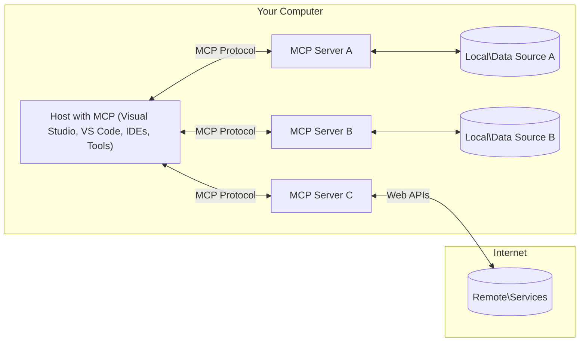

<!--
CO_OP_TRANSLATOR_METADATA:
{
  "original_hash": "904b59de1de9264801242d90a42cdd9d",
  "translation_date": "2025-09-05T10:33:58+00:00",
  "source_file": "01-CoreConcepts/README.md",
  "language_code": "ko"
}
-->
# MCP 핵심 개념: AI 통합을 위한 모델 컨텍스트 프로토콜 마스터하기

[](https://youtu.be/earDzWGtE84)

_(위 이미지를 클릭하면 이 강의의 동영상을 볼 수 있습니다)_

[Model Context Protocol (MCP)](https://github.com/modelcontextprotocol)는 대형 언어 모델(LLMs)과 외부 도구, 애플리케이션, 데이터 소스 간의 통신을 최적화하는 강력하고 표준화된 프레임워크입니다.  
이 가이드는 MCP의 핵심 개념을 안내합니다. 클라이언트-서버 아키텍처, 주요 구성 요소, 통신 메커니즘, 구현 모범 사례에 대해 배우게 됩니다.

- **명시적 사용자 동의**: 모든 데이터 접근 및 작업은 실행 전에 명시적인 사용자 승인을 필요로 합니다. 사용자는 어떤 데이터가 접근되고 어떤 작업이 수행될지 명확히 이해해야 하며, 권한과 승인에 대한 세부적인 제어를 가져야 합니다.

- **데이터 개인정보 보호**: 사용자 데이터는 명시적인 동의가 있을 때만 노출되며, 상호작용 전체 주기 동안 강력한 접근 제어로 보호되어야 합니다. 구현은 무단 데이터 전송을 방지하고 엄격한 개인정보 보호 경계를 유지해야 합니다.

- **도구 실행 안전성**: 모든 도구 호출은 도구의 기능, 매개변수, 잠재적 영향을 명확히 이해한 상태에서 명시적인 사용자 동의를 필요로 합니다. 의도하지 않은, 안전하지 않은, 또는 악의적인 도구 실행을 방지하기 위해 강력한 보안 경계를 유지해야 합니다.

- **전송 계층 보안**: 모든 통신 채널은 적절한 암호화 및 인증 메커니즘을 사용해야 합니다. 원격 연결은 안전한 전송 프로토콜과 적절한 자격 증명 관리를 구현해야 합니다.

#### 구현 지침:

- **권한 관리**: 서버, 도구, 리소스 접근을 제어할 수 있는 세부적인 권한 시스템을 구현하세요  
- **인증 및 승인**: 안전한 인증 방법(OAuth, API 키)을 사용하고 적절한 토큰 관리 및 만료를 설정하세요  
- **입력 검증**: 정의된 스키마에 따라 모든 매개변수와 데이터 입력을 검증하여 삽입 공격을 방지하세요  
- **감사 로그**: 보안 모니터링 및 규정 준수를 위해 모든 작업의 포괄적인 로그를 유지하세요  

## 개요

이 강의에서는 모델 컨텍스트 프로토콜(MCP) 생태계를 구성하는 기본 아키텍처와 구성 요소를 탐구합니다. MCP 상호작용을 가능하게 하는 클라이언트-서버 아키텍처, 주요 구성 요소, 통신 메커니즘에 대해 배우게 됩니다.

## 주요 학습 목표

이 강의를 마치면 다음을 이해할 수 있습니다:

- MCP 클라이언트-서버 아키텍처를 이해합니다.  
- Hosts, Clients, Servers의 역할과 책임을 식별합니다.  
- MCP를 유연한 통합 계층으로 만드는 핵심 기능을 분석합니다.  
- MCP 생태계 내 정보 흐름을 학습합니다.  
- .NET, Java, Python, JavaScript의 코드 예제를 통해 실용적인 통찰을 얻습니다.  

## MCP 아키텍처: 심층 분석

MCP 생태계는 클라이언트-서버 모델을 기반으로 구축되었습니다. 이 모듈형 구조는 AI 애플리케이션이 도구, 데이터베이스, API, 컨텍스트 리소스와 효율적으로 상호작용할 수 있도록 합니다. 이 아키텍처를 핵심 구성 요소로 나누어 살펴보겠습니다.

MCP는 기본적으로 클라이언트-서버 아키텍처를 따르며, 호스트 애플리케이션이 여러 서버에 연결할 수 있습니다:



- **MCP Hosts**: VSCode, Claude Desktop, IDE 또는 MCP를 통해 데이터를 접근하려는 AI 도구  
- **MCP Clients**: 서버와 1:1 연결을 유지하는 프로토콜 클라이언트  
- **MCP Servers**: 표준화된 모델 컨텍스트 프로토콜을 통해 특정 기능을 노출하는 경량 프로그램  
- **로컬 데이터 소스**: MCP 서버가 안전하게 접근할 수 있는 컴퓨터의 파일, 데이터베이스, 서비스  
- **원격 서비스**: MCP 서버가 API를 통해 연결할 수 있는 인터넷상의 외부 시스템  

MCP 프로토콜은 날짜 기반 버전 관리(YYYY-MM-DD 형식)를 사용하는 진화하는 표준입니다. 현재 프로토콜 버전은 **2025-06-18**입니다. [프로토콜 사양](https://modelcontextprotocol.io/specification/2025-06-18/)의 최신 업데이트를 확인할 수 있습니다.

### 1. Hosts

모델 컨텍스트 프로토콜(MCP)에서 **Hosts**는 사용자가 프로토콜과 상호작용하는 주요 인터페이스 역할을 하는 AI 애플리케이션입니다. Hosts는 여러 MCP 서버에 대한 연결을 관리하고 각 서버 연결에 대해 전용 MCP 클라이언트를 생성합니다. Hosts의 예는 다음과 같습니다:

- **AI 애플리케이션**: Claude Desktop, Visual Studio Code, Claude Code  
- **개발 환경**: MCP 통합이 포함된 IDE 및 코드 편집기  
- **맞춤형 애플리케이션**: 특정 목적을 위해 제작된 AI 에이전트 및 도구  

**Hosts**는 AI 모델 상호작용을 조정하는 애플리케이션입니다. 이들은 다음을 수행합니다:

- **AI 모델 조정**: LLM을 실행하거나 상호작용하여 응답을 생성하고 AI 워크플로를 조정  
- **클라이언트 연결 관리**: 각 MCP 서버 연결에 대해 하나의 MCP 클라이언트를 생성 및 유지  
- **사용자 인터페이스 제어**: 대화 흐름, 사용자 상호작용, 응답 표시를 처리  
- **보안 강화**: 권한, 보안 제한, 인증을 제어  
- **사용자 동의 처리**: 데이터 공유 및 도구 실행에 대한 사용자 승인을 관리  

### 2. Clients

**Clients**는 Hosts와 MCP 서버 간의 전용 1:1 연결을 유지하는 필수 구성 요소입니다. 각 MCP 클라이언트는 특정 MCP 서버에 연결하기 위해 Host에 의해 인스턴스화되며, 조직적이고 안전한 통신 채널을 보장합니다. 여러 클라이언트를 통해 Hosts는 여러 서버에 동시에 연결할 수 있습니다.

**Clients**는 호스트 애플리케이션 내의 연결 구성 요소입니다. 이들은 다음을 수행합니다:

- **프로토콜 통신**: 프롬프트와 지침을 포함한 JSON-RPC 2.0 요청을 서버에 전송  
- **기능 협상**: 초기화 중 서버와 지원되는 기능 및 프로토콜 버전을 협상  
- **도구 실행**: 모델의 도구 실행 요청을 관리하고 응답을 처리  
- **실시간 업데이트**: 서버로부터 알림 및 실시간 업데이트를 처리  
- **응답 처리**: 서버 응답을 사용자에게 표시하기 위해 처리 및 형식화  

### 3. Servers

**Servers**는 MCP 클라이언트에 컨텍스트, 도구, 기능을 제공하는 프로그램입니다. 이들은 로컬(Host와 동일한 기기) 또는 원격(외부 플랫폼)에서 실행될 수 있으며, 클라이언트 요청을 처리하고 구조화된 응답을 제공합니다. Servers는 표준화된 모델 컨텍스트 프로토콜을 통해 특정 기능을 노출합니다.

**Servers**는 컨텍스트와 기능을 제공하는 서비스입니다. 이들은 다음을 수행합니다:

- **기능 등록**: 사용 가능한 기본 요소(리소스, 프롬프트, 도구)를 클라이언트에 등록 및 노출  
- **요청 처리**: 클라이언트로부터 도구 호출, 리소스 요청, 프롬프트 요청을 수신 및 실행  
- **컨텍스트 제공**: 모델 응답을 향상시키기 위해 컨텍스트 정보와 데이터를 제공  
- **상태 관리**: 세션 상태를 유지하고 필요한 경우 상태 기반 상호작용을 처리  
- **실시간 알림**: 연결된 클라이언트에 기능 변경 및 업데이트에 대한 알림 전송  

Servers는 모델 기능을 확장하기 위해 누구나 개발할 수 있으며, 로컬 및 원격 배포 시나리오를 지원합니다.

### 4. Server Primitives

모델 컨텍스트 프로토콜(MCP)의 Servers는 클라이언트, Hosts, 언어 모델 간의 풍부한 상호작용을 정의하는 세 가지 핵심 **기본 요소**를 제공합니다. 이러한 기본 요소는 프로토콜을 통해 제공되는 컨텍스트 정보와 작업 유형을 명시합니다.

MCP 서버는 다음 세 가지 핵심 기본 요소를 조합하여 노출할 수 있습니다:

#### Resources

**Resources**는 AI 애플리케이션에 컨텍스트 정보를 제공하는 데이터 소스입니다. 이는 모델의 이해와 의사 결정을 향상시키는 정적 또는 동적 콘텐츠를 나타냅니다:

- **컨텍스트 데이터**: AI 모델 소비를 위한 구조화된 정보와 컨텍스트  
- **지식 기반**: 문서 저장소, 기사, 매뉴얼, 연구 논문  
- **로컬 데이터 소스**: 파일, 데이터베이스, 로컬 시스템 정보  
- **외부 데이터**: API 응답, 웹 서비스, 원격 시스템 데이터  
- **동적 콘텐츠**: 외부 조건에 따라 업데이트되는 실시간 데이터  

Resources는 URI로 식별되며 `resources/list`를 통해 검색되고 `resources/read` 메서드를 통해 검색됩니다:

```text
file://documents/project-spec.md
database://production/users/schema
api://weather/current
```

#### Prompts

**Prompts**는 언어 모델과의 상호작용을 구조화하는 데 도움을 주는 재사용 가능한 템플릿입니다. 이는 표준화된 상호작용 패턴과 템플릿 워크플로를 제공합니다:

- **템플릿 기반 상호작용**: 사전 구조화된 메시지와 대화 시작  
- **워크플로 템플릿**: 일반적인 작업 및 상호작용을 위한 표준화된 시퀀스  
- **Few-shot 예제**: 모델 지침을 위한 예제 기반 템플릿  
- **시스템 프롬프트**: 모델 행동과 컨텍스트를 정의하는 기본 프롬프트  
- **동적 템플릿**: 특정 컨텍스트에 맞게 조정되는 매개변수화된 프롬프트  

Prompts는 변수 대체를 지원하며 `prompts/list`를 통해 검색되고 `prompts/get`으로 검색됩니다:

```markdown
Generate a {{task_type}} for {{product}} targeting {{audience}} with the following requirements: {{requirements}}
```

#### Tools

**Tools**는 AI 모델이 특정 작업을 수행하기 위해 호출할 수 있는 실행 가능한 함수입니다. 이는 MCP 생태계의 "동사"를 나타내며, 모델이 외부 시스템과 상호작용할 수 있도록 합니다:

- **실행 가능한 함수**: 특정 매개변수를 사용하여 모델이 호출할 수 있는 개별 작업  
- **외부 시스템 통합**: API 호출, 데이터베이스 쿼리, 파일 작업, 계산  
- **고유한 정체성**: 각 도구는 고유한 이름, 설명, 매개변수 스키마를 가짐  
- **구조화된 입출력**: 도구는 검증된 매개변수를 수락하고 구조화된, 유형화된 응답을 반환  
- **작업 기능**: 모델이 실제 작업을 수행하고 실시간 데이터를 검색할 수 있도록 지원  

Tools는 매개변수 검증을 위한 JSON Schema로 정의되며 `tools/list`를 통해 검색되고 `tools/call`을 통해 실행됩니다:

```typescript
server.tool(
  "search_products", 
  {
    query: z.string().describe("Search query for products"),
    category: z.string().optional().describe("Product category filter"),
    max_results: z.number().default(10).describe("Maximum results to return")
  }, 
  async (params) => {
    // Execute search and return structured results
    return await productService.search(params);
  }
);
```

## Client Primitives

모델 컨텍스트 프로토콜(MCP)에서 **Clients**는 서버가 호스트 애플리케이션에서 추가 기능을 요청할 수 있도록 하는 기본 요소를 노출할 수 있습니다. 이러한 클라이언트 측 기본 요소는 서버가 AI 모델 기능과 사용자 상호작용에 접근할 수 있는 더 풍부하고 상호작용적인 구현을 가능하게 합니다.

### Sampling

**Sampling**은 서버가 클라이언트의 AI 애플리케이션에서 언어 모델 완성을 요청할 수 있도록 합니다. 이 기본 요소는 서버가 자체 모델 종속성을 포함하지 않고도 LLM 기능에 접근할 수 있도록 합니다:

- **모델 독립적 접근**: 서버는 LLM SDK를 포함하거나 모델 접근을 관리하지 않고도 완성을 요청할 수 있음  
- **서버 주도 AI**: 서버가 클라이언트의 AI 모델을 사용하여 자율적으로 콘텐츠 생성 가능  
- **재귀적 LLM 상호작용**: 서버가 처리에 AI 지원이 필요한 복잡한 시나리오 지원  
- **동적 콘텐츠 생성**: 서버가 호스트의 모델을 사용하여 컨텍스트 응답 생성 가능  

Sampling은 `sampling/complete` 메서드를 통해 시작되며, 서버가 클라이언트에 완성 요청을 보냅니다.

### Elicitation  

**Elicitation**은 서버가 클라이언트 인터페이스를 통해 사용자로부터 추가 정보 또는 확인을 요청할 수 있도록 합니다:

- **사용자 입력 요청**: 서버가 도구 실행에 필요한 추가 정보를 요청 가능  
- **확인 대화창**: 민감하거나 영향력이 큰 작업에 대해 사용자 승인을 요청  
- **상호작용 워크플로**: 서버가 단계별 사용자 상호작용 생성 가능  
- **동적 매개변수 수집**: 도구 실행 중 누락되거나 선택적인 매개변수를 수집  

Elicitation 요청은 `elicitation/request` 메서드를 사용하여 클라이언트 인터페이스를 통해 사용자 입력을 수집합니다.

### Logging

**Logging**은 서버가 디버깅, 모니터링, 운영 가시성을 위해 구조화된 로그 메시지를 클라이언트에 보낼 수 있도록 합니다:

- **디버깅 지원**: 서버가 디버깅을 위한 상세 실행 로그 제공 가능  
- **운영 모니터링**: 클라이언트에 상태 업데이트 및 성능 지표 전송  
- **오류 보고**: 상세 오류 컨텍스트 및 진단 정보 제공  
- **감사 추적**: 서버 작업 및 결정의 포괄적인 로그 생성  

Logging 메시지는 서버 작업에 대한 투명성을 제공하고 디버깅을 용이하게 하기 위해 클라이언트에 전송됩니다.

## MCP의 정보 흐름

모델 컨텍스트 프로토콜(MCP)은 Hosts, Clients, Servers, Models 간의 구조화된 정보 흐름을 정의합니다. 이 흐름을 이해하면 사용자 요청이 처리되는 방식과 외부 도구 및 데이터가 모델 응답에 통합되는 방식을 명확히 할 수 있습니다.

- **Host가 연결을 시작**  
  Host 애플리케이션(예: IDE 또는 채팅 인터페이스)은 STDIO, WebSocket 또는 지원되는 다른 전송 방식을 통해 MCP 서버에 연결을 설정합니다.

- **기능 협상**  
  클라이언트(Host에 내장)와 서버는 세션 동안 사용할 수 있는 기능, 도구, 리소스, 프로토콜 버전에 대한 정보를 교환합니다. 이를 통해 양측은 세션에서 사용할 수 있는 기능을 이해합니다.

- **사용자 요청**  
  사용자가 Host와 상호작용(예: 프롬프트 또는 명령 입력)합니다. Host는 이 입력을 수집하여 클라이언트에 전달합니다.

- **리소스 또는 도구 사용**  
  - 클라이언트는 모델의 이해를 풍부하게 하기 위해 서버에서 추가 컨텍스트 또는 리소스를 요청할 수 있습니다(예: 파일, 데이터베이스 항목, 지식 기반 기사).  
  - 모델이 도구가 필요하다고 판단하면(예: 데이터를 가져오거나 계산을 수행하거나 API를 호출하기 위해), 클라이언트는 도구 이름과 매개변수를 지정하여 서버에 도구 호출 요청을 보냅니다.

- **서버 실행**  
  서버는 리소스 또는 도구 요청을 수신하고 필요한 작업(예: 함수 실행, 데이터베이스 쿼리, 파일 검색)을 수행한 후 구조화된 형식으로 결과를 클라이언트에 반환합니다.

- **응답 생성**  
  클라이언트는 서버의 응답(리소스 데이터, 도구 출력 등)을 진행 중인 모델 상호작용에 통합합니다. 모델은 이 정보를 사용하여 포괄적이고 컨텍스트에 적합한 응답을 생성합니다.

- **결과 표시**  
  Host는 클라이언트로부터 최종 출력을 수신하고 이를 사용자에게 표시합니다. 여기에는 모델이 생성한 텍스트와 도구 실행 또는 리소스 조회 결과가 포함될 수 있습니다.

이 흐름은 MCP가 모델을 외부 도구 및 데이터 소스와 원활하게 연결함으로써 고급, 상호작용적, 컨텍스트 인식 AI 애플리케이션을 지원할 수 있도록 합니다.

## 프로토콜 아키텍처 및 계층

MCP는 완전한 통신 프레임워크를 제공하기 위해 함께 작동하는 두 가지 별개의 아키텍처 계층으로 구성됩니다:

### 데이터 계층

**데이터 계층**은 **JSON-RPC 2.0**을 기반으로 MCP 프로토콜의 핵심을 구현합니다. 이 계층은 메시지 구조, 의미론, 상호작용 패턴을 정의합니다:

#### 핵심 구성 요소:
- **JSON-RPC 2.0 프로토콜**: 모든 통신은 메서드 호출, 응답, 알림을 위한 표준화된 JSON-RPC 2.0 메시지 형식을 사용합니다.
- **수명 주기 관리**: 클라이언트와 서버 간의 연결 초기화, 기능 협상, 세션 종료를 처리합니다.
- **서버 기본 기능**: 서버가 도구, 리소스, 프롬프트를 통해 핵심 기능을 제공할 수 있도록 지원합니다.
- **클라이언트 기본 기능**: 서버가 LLM 샘플링 요청, 사용자 입력 유도, 로그 메시지 전송을 수행할 수 있도록 지원합니다.
- **실시간 알림**: 폴링 없이 비동기 알림을 통해 동적 업데이트를 지원합니다.

#### 주요 기능:

- **프로토콜 버전 협상**: 호환성을 보장하기 위해 날짜 기반 버전 관리(YYYY-MM-DD)를 사용합니다.
- **기능 탐색**: 초기화 중 클라이언트와 서버가 지원하는 기능 정보를 교환합니다.
- **상태 유지 세션**: 여러 상호작용에서 연결 상태를 유지하여 컨텍스트 연속성을 제공합니다.

### 전송 계층

**전송 계층**은 MCP 참가자 간의 통신 채널, 메시지 프레이밍, 인증을 관리합니다:

#### 지원되는 전송 메커니즘:

1. **STDIO 전송**:
   - 표준 입력/출력 스트림을 사용하여 직접 프로세스 간 통신을 수행합니다.
   - 네트워크 오버헤드 없이 동일한 기기에서 로컬 프로세스에 최적화되어 있습니다.
   - 로컬 MCP 서버 구현에 일반적으로 사용됩니다.

2. **스트리밍 가능한 HTTP 전송**:
   - 클라이언트에서 서버로의 메시지에 HTTP POST를 사용합니다.  
   - 서버에서 클라이언트로의 스트리밍을 위해 선택적으로 Server-Sent Events(SSE)를 지원합니다.
   - 네트워크를 통한 원격 서버 통신을 가능하게 합니다.
   - 표준 HTTP 인증(베어러 토큰, API 키, 사용자 정의 헤더)을 지원합니다.
   - MCP는 안전한 토큰 기반 인증을 위해 OAuth를 권장합니다.

#### 전송 추상화:

전송 계층은 데이터 계층의 통신 세부 정보를 추상화하여 모든 전송 메커니즘에서 동일한 JSON-RPC 2.0 메시지 형식을 사용할 수 있도록 합니다. 이 추상화는 애플리케이션이 로컬 서버와 원격 서버 간을 원활하게 전환할 수 있도록 합니다.

### 보안 고려사항

MCP 구현은 모든 프로토콜 작업에서 안전하고 신뢰할 수 있으며 보안이 유지되는 상호작용을 보장하기 위해 몇 가지 중요한 보안 원칙을 준수해야 합니다:

- **사용자 동의 및 제어**: 데이터를 액세스하거나 작업을 수행하기 전에 사용자는 명시적인 동의를 제공해야 합니다. 사용자는 공유되는 데이터와 승인된 작업에 대해 명확한 제어권을 가져야 하며, 활동을 검토하고 승인할 수 있는 직관적인 사용자 인터페이스가 지원되어야 합니다.

- **데이터 프라이버시**: 사용자 데이터는 명시적인 동의가 있을 때만 노출되어야 하며 적절한 액세스 제어를 통해 보호되어야 합니다. MCP 구현은 무단 데이터 전송을 방지하고 모든 상호작용에서 프라이버시가 유지되도록 보장해야 합니다.

- **도구 안전성**: 도구를 호출하기 전에 명시적인 사용자 동의가 필요합니다. 사용자는 각 도구의 기능을 명확히 이해해야 하며, 의도하지 않은 도구 실행이나 안전하지 않은 도구 실행을 방지하기 위해 강력한 보안 경계가 적용되어야 합니다.

이러한 보안 원칙을 따름으로써 MCP는 모든 프로토콜 상호작용에서 사용자 신뢰, 프라이버시, 안전성을 유지하면서 강력한 AI 통합을 가능하게 합니다.

## 코드 예제: 주요 구성 요소

다음은 여러 인기 있는 프로그래밍 언어로 MCP 서버 구성 요소와 도구를 구현하는 방법을 보여주는 코드 예제입니다.

### .NET 예제: 도구를 포함한 간단한 MCP 서버 생성

다음은 사용자 정의 도구를 정의하고 등록하며 요청을 처리하고 Model Context Protocol을 사용하여 서버를 연결하는 방법을 보여주는 실용적인 .NET 코드 예제입니다.

```csharp
using System;
using System.Threading.Tasks;
using ModelContextProtocol.Server;
using ModelContextProtocol.Server.Transport;
using ModelContextProtocol.Server.Tools;

public class WeatherServer
{
    public static async Task Main(string[] args)
    {
        // Create an MCP server
        var server = new McpServer(
            name: "Weather MCP Server",
            version: "1.0.0"
        );
        
        // Register our custom weather tool
        server.AddTool<string, WeatherData>("weatherTool", 
            description: "Gets current weather for a location",
            execute: async (location) => {
                // Call weather API (simplified)
                var weatherData = await GetWeatherDataAsync(location);
                return weatherData;
            });
        
        // Connect the server using stdio transport
        var transport = new StdioServerTransport();
        await server.ConnectAsync(transport);
        
        Console.WriteLine("Weather MCP Server started");
        
        // Keep the server running until process is terminated
        await Task.Delay(-1);
    }
    
    private static async Task<WeatherData> GetWeatherDataAsync(string location)
    {
        // This would normally call a weather API
        // Simplified for demonstration
        await Task.Delay(100); // Simulate API call
        return new WeatherData { 
            Temperature = 72.5,
            Conditions = "Sunny",
            Location = location
        };
    }
}

public class WeatherData
{
    public double Temperature { get; set; }
    public string Conditions { get; set; }
    public string Location { get; set; }
}
```

### Java 예제: MCP 서버 구성 요소

이 예제는 위의 .NET 예제와 동일한 MCP 서버 및 도구 등록을 Java로 구현한 것입니다.

```java
import io.modelcontextprotocol.server.McpServer;
import io.modelcontextprotocol.server.McpToolDefinition;
import io.modelcontextprotocol.server.transport.StdioServerTransport;
import io.modelcontextprotocol.server.tool.ToolExecutionContext;
import io.modelcontextprotocol.server.tool.ToolResponse;

public class WeatherMcpServer {
    public static void main(String[] args) throws Exception {
        // Create an MCP server
        McpServer server = McpServer.builder()
            .name("Weather MCP Server")
            .version("1.0.0")
            .build();
            
        // Register a weather tool
        server.registerTool(McpToolDefinition.builder("weatherTool")
            .description("Gets current weather for a location")
            .parameter("location", String.class)
            .execute((ToolExecutionContext ctx) -> {
                String location = ctx.getParameter("location", String.class);
                
                // Get weather data (simplified)
                WeatherData data = getWeatherData(location);
                
                // Return formatted response
                return ToolResponse.content(
                    String.format("Temperature: %.1f°F, Conditions: %s, Location: %s", 
                    data.getTemperature(), 
                    data.getConditions(), 
                    data.getLocation())
                );
            })
            .build());
        
        // Connect the server using stdio transport
        try (StdioServerTransport transport = new StdioServerTransport()) {
            server.connect(transport);
            System.out.println("Weather MCP Server started");
            // Keep server running until process is terminated
            Thread.currentThread().join();
        }
    }
    
    private static WeatherData getWeatherData(String location) {
        // Implementation would call a weather API
        // Simplified for example purposes
        return new WeatherData(72.5, "Sunny", location);
    }
}

class WeatherData {
    private double temperature;
    private String conditions;
    private String location;
    
    public WeatherData(double temperature, String conditions, String location) {
        this.temperature = temperature;
        this.conditions = conditions;
        this.location = location;
    }
    
    public double getTemperature() {
        return temperature;
    }
    
    public String getConditions() {
        return conditions;
    }
    
    public String getLocation() {
        return location;
    }
}
```

### Python 예제: MCP 서버 구축

이 예제는 fastmcp를 사용하므로 먼저 설치해야 합니다:

```python
pip install fastmcp
```  
코드 샘플:

```python
#!/usr/bin/env python3
import asyncio
from fastmcp import FastMCP
from fastmcp.transports.stdio import serve_stdio

# Create a FastMCP server
mcp = FastMCP(
    name="Weather MCP Server",
    version="1.0.0"
)

@mcp.tool()
def get_weather(location: str) -> dict:
    """Gets current weather for a location."""
    return {
        "temperature": 72.5,
        "conditions": "Sunny",
        "location": location
    }

# Alternative approach using a class
class WeatherTools:
    @mcp.tool()
    def forecast(self, location: str, days: int = 1) -> dict:
        """Gets weather forecast for a location for the specified number of days."""
        return {
            "location": location,
            "forecast": [
                {"day": i+1, "temperature": 70 + i, "conditions": "Partly Cloudy"}
                for i in range(days)
            ]
        }

# Register class tools
weather_tools = WeatherTools()

# Start the server
if __name__ == "__main__":
    asyncio.run(serve_stdio(mcp))
```

### JavaScript 예제: MCP 서버 생성

이 예제는 JavaScript에서 MCP 서버를 생성하고 두 개의 날씨 관련 도구를 등록하는 방법을 보여줍니다.

```javascript
// Using the official Model Context Protocol SDK
import { McpServer } from "@modelcontextprotocol/sdk/server/mcp.js";
import { StdioServerTransport } from "@modelcontextprotocol/sdk/server/stdio.js";
import { z } from "zod"; // For parameter validation

// Create an MCP server
const server = new McpServer({
  name: "Weather MCP Server",
  version: "1.0.0"
});

// Define a weather tool
server.tool(
  "weatherTool",
  {
    location: z.string().describe("The location to get weather for")
  },
  async ({ location }) => {
    // This would normally call a weather API
    // Simplified for demonstration
    const weatherData = await getWeatherData(location);
    
    return {
      content: [
        { 
          type: "text", 
          text: `Temperature: ${weatherData.temperature}°F, Conditions: ${weatherData.conditions}, Location: ${weatherData.location}` 
        }
      ]
    };
  }
);

// Define a forecast tool
server.tool(
  "forecastTool",
  {
    location: z.string(),
    days: z.number().default(3).describe("Number of days for forecast")
  },
  async ({ location, days }) => {
    // This would normally call a weather API
    // Simplified for demonstration
    const forecast = await getForecastData(location, days);
    
    return {
      content: [
        { 
          type: "text", 
          text: `${days}-day forecast for ${location}: ${JSON.stringify(forecast)}` 
        }
      ]
    };
  }
);

// Helper functions
async function getWeatherData(location) {
  // Simulate API call
  return {
    temperature: 72.5,
    conditions: "Sunny",
    location: location
  };
}

async function getForecastData(location, days) {
  // Simulate API call
  return Array.from({ length: days }, (_, i) => ({
    day: i + 1,
    temperature: 70 + Math.floor(Math.random() * 10),
    conditions: i % 2 === 0 ? "Sunny" : "Partly Cloudy"
  }));
}

// Connect the server using stdio transport
const transport = new StdioServerTransport();
server.connect(transport).catch(console.error);

console.log("Weather MCP Server started");
```

이 JavaScript 예제는 서버에 연결하고 프롬프트를 전송하며 도구 호출을 포함한 응답을 처리하는 MCP 클라이언트를 생성하는 방법을 보여줍니다.

## 보안 및 인증

MCP는 프로토콜 전반에서 보안 및 인증을 관리하기 위한 여러 내장 개념과 메커니즘을 포함합니다:

1. **도구 권한 제어**:  
   클라이언트는 세션 중 모델이 사용할 수 있는 도구를 지정할 수 있습니다. 이를 통해 명시적으로 승인된 도구만 접근 가능하도록 하여 의도하지 않은 작업이나 안전하지 않은 작업의 위험을 줄일 수 있습니다. 권한은 사용자 선호도, 조직 정책, 상호작용 컨텍스트에 따라 동적으로 구성할 수 있습니다.

2. **인증**:  
   서버는 도구, 리소스 또는 민감한 작업에 대한 액세스를 허용하기 전에 인증을 요구할 수 있습니다. 여기에는 API 키, OAuth 토큰 또는 기타 인증 방식이 포함될 수 있습니다. 적절한 인증은 신뢰할 수 있는 클라이언트와 사용자만 서버 측 기능을 호출할 수 있도록 보장합니다.

3. **유효성 검사**:  
   모든 도구 호출에 대해 매개변수 유효성 검사가 적용됩니다. 각 도구는 매개변수의 예상 유형, 형식, 제약 조건을 정의하며, 서버는 들어오는 요청을 이에 따라 검증합니다. 이를 통해 잘못된 입력이나 악의적인 입력이 도구 구현에 도달하는 것을 방지하고 작업의 무결성을 유지합니다.

4. **속도 제한**:  
   서버 리소스의 남용을 방지하고 공정한 사용을 보장하기 위해 MCP 서버는 도구 호출 및 리소스 액세스에 대해 속도 제한을 구현할 수 있습니다. 속도 제한은 사용자별, 세션별 또는 전역적으로 적용될 수 있으며 서비스 거부 공격이나 과도한 리소스 소비를 방지하는 데 도움을 줍니다.

이러한 메커니즘을 결합함으로써 MCP는 언어 모델을 외부 도구 및 데이터 소스와 통합하기 위한 안전한 기반을 제공하며, 사용자와 개발자에게 액세스 및 사용에 대한 세밀한 제어를 제공합니다.

## 프로토콜 메시지 및 통신 흐름

MCP 통신은 호스트, 클라이언트, 서버 간의 명확하고 신뢰할 수 있는 상호작용을 촉진하기 위해 구조화된 **JSON-RPC 2.0** 메시지를 사용합니다. 프로토콜은 다양한 작업 유형에 대해 특정 메시지 패턴을 정의합니다:

### 핵심 메시지 유형:

#### **초기화 메시지**
- **`initialize` 요청**: 연결을 설정하고 프로토콜 버전 및 기능을 협상합니다.
- **`initialize` 응답**: 지원되는 기능 및 서버 정보를 확인합니다.  
- **`notifications/initialized`**: 초기화가 완료되었으며 세션이 준비되었음을 알립니다.

#### **탐색 메시지**
- **`tools/list` 요청**: 서버에서 사용 가능한 도구를 탐색합니다.
- **`resources/list` 요청**: 사용 가능한 리소스(데이터 소스)를 나열합니다.
- **`prompts/list` 요청**: 사용 가능한 프롬프트 템플릿을 검색합니다.

#### **실행 메시지**  
- **`tools/call` 요청**: 제공된 매개변수로 특정 도구를 실행합니다.
- **`resources/read` 요청**: 특정 리소스에서 콘텐츠를 검색합니다.
- **`prompts/get` 요청**: 선택적 매개변수와 함께 프롬프트 템플릿을 가져옵니다.

#### **클라이언트 측 메시지**
- **`sampling/complete` 요청**: 서버가 클라이언트로부터 LLM 완료를 요청합니다.
- **`elicitation/request`**: 서버가 클라이언트 인터페이스를 통해 사용자 입력을 요청합니다.
- **로그 메시지**: 서버가 클라이언트에 구조화된 로그 메시지를 전송합니다.

#### **알림 메시지**
- **`notifications/tools/list_changed`**: 서버가 도구 변경 사항을 클라이언트에 알립니다.
- **`notifications/resources/list_changed`**: 서버가 리소스 변경 사항을 클라이언트에 알립니다.  
- **`notifications/prompts/list_changed`**: 서버가 프롬프트 변경 사항을 클라이언트에 알립니다.

### 메시지 구조:

모든 MCP 메시지는 JSON-RPC 2.0 형식을 따르며:
- **요청 메시지**: `id`, `method`, 선택적 `params`를 포함합니다.
- **응답 메시지**: `id`와 `result` 또는 `error`를 포함합니다.  
- **알림 메시지**: `method`와 선택적 `params`를 포함하며(`id` 없음, 응답 없음) 기대됩니다.

이 구조화된 통신은 실시간 업데이트, 도구 체이닝, 강력한 오류 처리를 지원하는 고급 시나리오를 가능하게 하며 신뢰할 수 있고 확장 가능한 상호작용을 보장합니다.

## 주요 요점

- **아키텍처**: MCP는 호스트가 여러 클라이언트 연결을 관리하는 클라이언트-서버 아키텍처를 사용합니다.
- **참여자**: 생태계에는 호스트(AI 애플리케이션), 클라이언트(프로토콜 커넥터), 서버(기능 제공자)가 포함됩니다.
- **전송 메커니즘**: STDIO(로컬) 및 스트리밍 가능한 HTTP와 선택적 SSE(원격)를 지원합니다.
- **핵심 기본 기능**: 서버는 도구(실행 가능한 함수), 리소스(데이터 소스), 프롬프트(템플릿)를 제공합니다.
- **클라이언트 기본 기능**: 서버는 클라이언트로부터 샘플링(LLM 완료), 유도(사용자 입력), 로깅을 요청할 수 있습니다.
- **프로토콜 기반**: JSON-RPC 2.0을 기반으로 하며 날짜 기반 버전 관리(현재: 2025-06-18)를 사용합니다.
- **실시간 기능**: 동적 업데이트 및 실시간 동기화를 위한 알림을 지원합니다.
- **보안 우선**: 명시적인 사용자 동의, 데이터 프라이버시 보호, 안전한 전송이 핵심 요구사항입니다.

## 연습

자신의 도메인에서 유용할 간단한 MCP 도구를 설계하세요. 정의할 내용:
1. 도구 이름
2. 수락할 매개변수
3. 반환할 출력
4. 모델이 이 도구를 사용하여 사용자 문제를 해결하는 방법

---

## 다음 단계

다음: [2장: 보안](../02-Security/README.md)

---

**면책 조항**:  
이 문서는 AI 번역 서비스 [Co-op Translator](https://github.com/Azure/co-op-translator)를 사용하여 번역되었습니다. 정확성을 위해 최선을 다하고 있지만, 자동 번역에는 오류나 부정확성이 포함될 수 있습니다. 원본 문서의 원어 버전이 권위 있는 출처로 간주되어야 합니다. 중요한 정보의 경우, 전문적인 인간 번역을 권장합니다. 이 번역 사용으로 인해 발생하는 오해나 잘못된 해석에 대해 책임을 지지 않습니다.