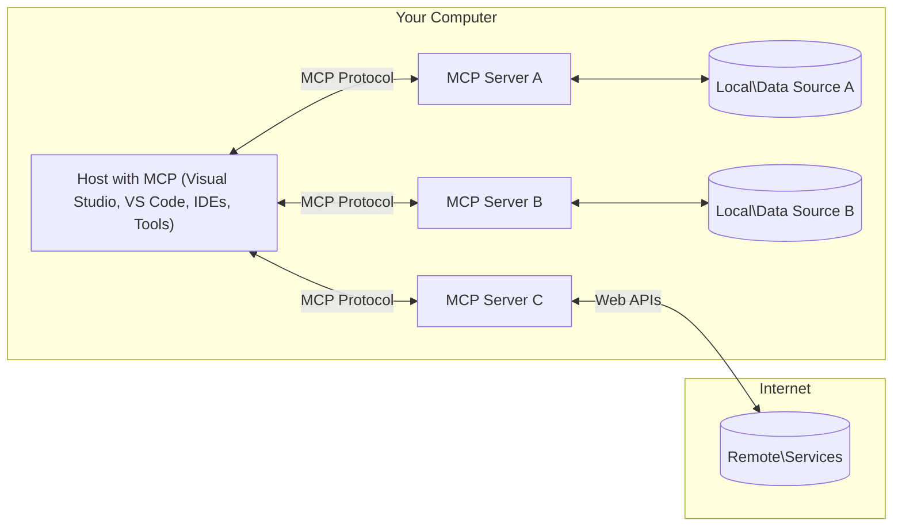

<!--
CO_OP_TRANSLATOR_METADATA:
{
  "original_hash": "11010ad254e48628bb6a457be2211640",
  "translation_date": "2025-08-12T07:49:38+00:00",
  "source_file": "01-CoreConcepts/README.md",
  "language_code": "ko"
}
-->
# 📖 MCP 핵심 개념: AI 통합을 위한 모델 컨텍스트 프로토콜 마스터하기

[](https://youtu.be/earDzWGtE84)

_(위 이미지를 클릭하면 이 강의의 영상을 볼 수 있습니다)_

[Model Context Protocol (MCP)](https://github.com/modelcontextprotocol)은 대규모 언어 모델(LLM)과 외부 도구, 애플리케이션, 데이터 소스 간의 통신을 최적화하는 강력하고 표준화된 프레임워크입니다. 이 가이드는 MCP의 핵심 개념을 안내하며, 클라이언트-서버 아키텍처, 주요 구성 요소, 통신 메커니즘, 구현 모범 사례를 이해할 수 있도록 도와줍니다.

## 개요

이 강의에서는 Model Context Protocol (MCP) 생태계를 구성하는 기본 아키텍처와 구성 요소를 탐구합니다. MCP 상호작용을 가능하게 하는 클라이언트-서버 아키텍처, 주요 구성 요소, 통신 메커니즘에 대해 배우게 됩니다.

## 👩‍🎓 주요 학습 목표

이 강의를 마치면 다음을 이해할 수 있습니다:

- MCP 클라이언트-서버 아키텍처를 이해합니다.
- Hosts, Clients, Servers의 역할과 책임을 식별합니다.
- MCP를 유연한 통합 계층으로 만드는 핵심 기능을 분석합니다.
- MCP 생태계 내에서 정보가 흐르는 방식을 학습합니다.
- .NET, Java, Python, JavaScript의 코드 예제를 통해 실질적인 통찰을 얻습니다.

## 🔎 MCP 아키텍처: 심층 분석

MCP 생태계는 클라이언트-서버 모델을 기반으로 구축되었습니다. 이 모듈식 구조는 AI 애플리케이션이 도구, 데이터베이스, API, 컨텍스트 리소스와 효율적으로 상호작용할 수 있도록 합니다. 이 아키텍처를 핵심 구성 요소로 나누어 살펴보겠습니다.

MCP는 기본적으로 클라이언트-서버 아키텍처를 따르며, 호스트 애플리케이션이 여러 서버에 연결할 수 있습니다:



- **MCP Hosts**: VSCode, Claude Desktop, IDE, 또는 MCP를 통해 데이터를 액세스하려는 AI 도구와 같은 프로그램
- **MCP Clients**: 서버와 1:1 연결을 유지하는 프로토콜 클라이언트
- **MCP Servers**: 표준화된 Model Context Protocol을 통해 특정 기능을 제공하는 경량 프로그램
- **로컬 데이터 소스**: MCP 서버가 안전하게 액세스할 수 있는 컴퓨터의 파일, 데이터베이스, 서비스
- **원격 서비스**: MCP 서버가 API를 통해 연결할 수 있는 인터넷상의 외부 시스템

MCP 프로토콜은 발전 중인 표준입니다. 최신 [프로토콜 사양](https://modelcontextprotocol.io/specification/2025-06-18/)을 확인할 수 있습니다.

### 1. Hosts

Model Context Protocol (MCP)에서 Hosts는 사용자가 프로토콜과 상호작용하는 주요 인터페이스로 중요한 역할을 합니다. Hosts는 MCP 서버와 연결을 시작하여 데이터, 도구, 프롬프트에 액세스하는 애플리케이션 또는 환경입니다. 예로는 Visual Studio Code와 같은 통합 개발 환경(IDE), Claude Desktop과 같은 AI 도구, 특정 작업을 위해 설계된 맞춤형 에이전트가 있습니다.

**Hosts**는 LLM과 연결을 시작하는 애플리케이션입니다. 이들은:

- AI 모델을 실행하거나 상호작용하여 응답을 생성합니다.
- MCP 서버와 연결을 시작합니다.
- 대화 흐름과 사용자 인터페이스를 관리합니다.
- 권한 및 보안 제약을 제어합니다.
- 데이터 공유 및 도구 실행에 대한 사용자 동의를 처리합니다.

### 2. Clients

Clients는 Hosts와 MCP 서버 간의 상호작용을 촉진하는 필수 구성 요소입니다. Clients는 Hosts가 MCP 서버가 제공하는 기능을 액세스하고 활용할 수 있도록 중개자 역할을 합니다. 이들은 MCP 아키텍처 내에서 원활한 통신과 효율적인 데이터 교환을 보장하는 데 중요한 역할을 합니다.

**Clients**는 호스트 애플리케이션 내의 커넥터입니다. 이들은:

- 프롬프트/명령과 함께 서버에 요청을 보냅니다.
- 서버와 기능을 협상합니다.
- 모델의 도구 실행 요청을 관리합니다.
- 사용자에게 응답을 처리하고 표시합니다.

### 3. Servers

Servers는 MCP 클라이언트의 요청을 처리하고 적절한 응답을 제공합니다. 대부분의 경우, 서버는 LLM에 특정 기능을 제공하는 도구 역할을 합니다. 이들은 데이터 검색, 도구 실행, 프롬프트 생성과 같은 다양한 작업을 관리합니다. Servers는 클라이언트와 Hosts 간의 통신이 효율적이고 신뢰할 수 있도록 보장하며, 상호작용 과정의 무결성을 유지합니다.

**Servers**는 컨텍스트와 기능을 제공하는 서비스입니다. 이들은:

- 사용 가능한 기능(리소스, 프롬프트, 도구)을 등록합니다.
- 클라이언트로부터 도구 호출을 수신하고 실행합니다.
- 모델 응답을 향상시키기 위해 컨텍스트 정보를 제공합니다.
- 클라이언트에 출력을 반환합니다.
- 필요할 경우 상호작용 간 상태를 유지합니다.

서버는 모델 기능을 확장하기 위해 누구나 개발할 수 있습니다.

### 4. 서버 기능

Model Context Protocol (MCP)의 서버는 클라이언트, 호스트, 언어 모델 간의 풍부한 상호작용을 가능하게 하는 기본 빌딩 블록을 제공합니다. 이러한 기능은 구조화된 컨텍스트, 도구, 프롬프트를 제공함으로써 MCP의 기능을 향상시키도록 설계되었습니다.

MCP 서버는 다음과 같은 기능을 제공할 수 있습니다:

#### 📑 리소스

MCP의 리소스는 사용자가나 AI 모델이 활용할 수 있는 다양한 유형의 컨텍스트와 데이터를 포함합니다. 여기에는 다음이 포함됩니다:

- **컨텍스추얼 데이터**: 의사결정 및 작업 실행을 위해 사용자가나 AI 모델이 활용할 수 있는 정보와 컨텍스트
- **지식 베이스 및 문서 저장소**: 기사, 매뉴얼, 연구 논문과 같은 구조화된 데이터 및 비구조화된 데이터 모음
- **로컬 파일 및 데이터베이스**: 장치나 데이터베이스에 로컬로 저장된 데이터로, 처리 및 분석을 위해 액세스 가능
- **API 및 웹 서비스**: 다양한 온라인 리소스 및 도구와의 통합을 가능하게 하는 외부 인터페이스 및 서비스

리소스의 예로는 다음과 같이 액세스할 수 있는 데이터베이스 스키마나 파일이 있습니다:

```text
file://log.txt
database://schema
```

### 🤖 프롬프트

MCP의 프롬프트는 사용자 워크플로를 간소화하고 커뮤니케이션을 향상시키기 위해 설계된 다양한 사전 정의된 템플릿과 상호작용 패턴을 포함합니다. 여기에는 다음이 포함됩니다:

- **템플릿 메시지 및 워크플로**: 특정 작업 및 상호작용을 안내하는 사전 구조화된 메시지 및 프로세스
- **사전 정의된 상호작용 패턴**: 일관되고 효율적인 커뮤니케이션을 촉진하는 표준화된 작업 및 응답 시퀀스
- **특화된 대화 템플릿**: 특정 유형의 대화에 맞게 조정된 맞춤형 템플릿으로, 관련성과 컨텍스트에 적합한 상호작용 보장

프롬프트 템플릿의 예는 다음과 같습니다:

```markdown
Generate a product slogan based on the following {{product}} with the following {{keywords}}
```

#### ⛏️ 도구

MCP의 도구는 AI 모델이 특정 작업을 수행하기 위해 실행할 수 있는 기능입니다. 이러한 도구는 구조적이고 신뢰할 수 있는 작업을 제공함으로써 AI 모델의 기능을 향상시키도록 설계되었습니다. 주요 측면은 다음과 같습니다:

- **AI 모델이 실행할 수 있는 함수**: 도구는 다양한 작업을 수행하기 위해 AI 모델이 호출할 수 있는 실행 가능한 함수입니다.
- **고유 이름 및 설명**: 각 도구는 고유한 이름과 목적 및 기능을 설명하는 상세한 설명을 가지고 있습니다.
- **매개변수 및 출력**: 도구는 특정 매개변수를 수락하고 구조화된 출력을 반환하여 일관되고 예측 가능한 결과를 보장합니다.
- **개별 기능**: 도구는 웹 검색, 계산, 데이터베이스 쿼리와 같은 개별 기능을 수행합니다.

도구의 예는 다음과 같습니다:

```typescript
server.tool(
  "GetProducts",
  {
    pageSize: z.string().optional(),
    pageCount: z.string().optional()
  }, () => {
    // return results from API
  }
)
```

## 클라이언트 기능

Model Context Protocol (MCP)에서 클라이언트는 서버에 여러 주요 기능을 제공하여 프로토콜 내에서 전반적인 기능과 상호작용을 향상시킵니다. 주목할 만한 기능 중 하나는 샘플링(Sampling)입니다.

### 👉 샘플링

- **서버 주도적 에이전트 행동**: 클라이언트는 서버가 특정 작업이나 행동을 자율적으로 시작할 수 있도록 하여 시스템의 동적 기능을 향상시킵니다.
- **재귀적 LLM 상호작용**: 이 기능은 대규모 언어 모델(LLM)과의 재귀적 상호작용을 가능하게 하여 더 복잡하고 반복적인 작업 처리를 지원합니다.
- **추가 모델 완성 요청**: 서버는 모델로부터 추가적인 완성을 요청할 수 있어 응답이 철저하고 컨텍스트에 적합하도록 보장합니다.

## MCP의 정보 흐름

Model Context Protocol (MCP)은 호스트, 클라이언트, 서버, 모델 간의 구조화된 정보 흐름을 정의합니다. 이 흐름을 이해하면 사용자 요청이 처리되는 방식과 외부 도구 및 데이터가 모델 응답에 통합되는 방식을 명확히 할 수 있습니다.

- **호스트가 연결을 시작**  
  호스트 애플리케이션(예: IDE 또는 채팅 인터페이스)은 STDIO, WebSocket 또는 기타 지원되는 전송 방식을 통해 MCP 서버에 연결을 설정합니다.

- **기능 협상**  
  클라이언트(호스트에 내장)와 서버는 지원되는 기능, 도구, 리소스, 프로토콜 버전에 대한 정보를 교환합니다. 이를 통해 세션에서 사용할 수 있는 기능을 양측이 이해할 수 있습니다.

- **사용자 요청**  
  사용자가 호스트와 상호작용(예: 프롬프트 또는 명령 입력)합니다. 호스트는 이 입력을 수집하여 클라이언트에 전달합니다.

- **리소스 또는 도구 사용**  
  - 클라이언트는 모델의 이해를 풍부하게 하기 위해 서버에서 추가 컨텍스트나 리소스를 요청할 수 있습니다(예: 파일, 데이터베이스 항목, 지식 베이스 기사).
  - 모델이 도구가 필요하다고 판단하면(예: 데이터 검색, 계산 수행, API 호출), 클라이언트는 도구 이름과 매개변수를 지정하여 서버에 도구 호출 요청을 보냅니다.

- **서버 실행**  
  서버는 리소스 또는 도구 요청을 수신하고 필요한 작업(예: 함수 실행, 데이터베이스 쿼리, 파일 검색)을 실행한 후 구조화된 형식으로 결과를 클라이언트에 반환합니다.

- **응답 생성**  
  클라이언트는 서버의 응답(리소스 데이터, 도구 출력 등)을 진행 중인 모델 상호작용에 통합합니다. 모델은 이 정보를 사용하여 포괄적이고 컨텍스트에 적합한 응답을 생성합니다.

- **결과 표시**  
  호스트는 클라이언트로부터 최종 출력을 수신하고 이를 사용자에게 표시합니다. 여기에는 모델이 생성한 텍스트와 도구 실행 또는 리소스 조회 결과가 포함될 수 있습니다.

이 흐름은 MCP가 모델과 외부 도구 및 데이터 소스를 원활하게 연결하여 고급, 상호작용적, 컨텍스트 인식 AI 애플리케이션을 지원할 수 있도록 합니다.

## 프로토콜 세부사항

MCP(Model Context Protocol)는 [JSON-RPC 2.0](https://www.jsonrpc.org/)을 기반으로 구축되어, 호스트, 클라이언트, 서버 간의 통신을 위한 표준화되고 언어에 구애받지 않는 메시지 형식을 제공합니다. 이 기반은 다양한 플랫폼과 프로그래밍 언어 간의 신뢰할 수 있고 구조화된 확장 가능한 상호작용을 가능하게 합니다.

### 주요 프로토콜 기능

MCP는 JSON-RPC 2.0을 확장하여 도구 호출, 리소스 액세스, 프롬프트 관리를 위한 추가 규칙을 제공합니다. STDIO, WebSocket, SSE와 같은 여러 전송 계층을 지원하며, 구성 요소 간의 안전하고 확장 가능하며 언어에 구애받지 않는 통신을 가능하게 합니다.

#### 🧢 기본 프로토콜

- **JSON-RPC 메시지 형식**: 모든 요청 및 응답은 JSON-RPC 2.0 사양을 사용하여 메서드 호출, 매개변수, 결과, 오류 처리를 위한 일관된 구조를 보장합니다.
- **상태 유지 연결**: MCP 세션은 여러 요청에 걸쳐 상태를 유지하여 진행 중인 대화, 컨텍스트 축적, 리소스 관리를 지원합니다.
- **기능 협상**: 연결 설정 중 클라이언트와 서버는 지원되는 기능, 프로토콜 버전, 사용 가능한 도구 및 리소스에 대한 정보를 교환합니다. 이를 통해 양측이 서로의 기능을 이해하고 적응할 수 있습니다.

#### ➕ 추가 유틸리티

아래는 개발자 경험을 향상시키고 고급 시나리오를 가능하게 하기 위해 MCP가 제공하는 추가 유틸리티 및 프로토콜 확장입니다:

- **구성 옵션**: MCP는 각 상호작용에 맞게 도구 권한, 리소스 액세스, 모델 설정과 같은 세션 매개변수를 동적으로 구성할 수 있습니다.
- **진행 상황 추적**: 장시간 실행되는 작업은 진행 상황 업데이트를 보고하여 복잡한 작업 중 응답성 있는 사용자 인터페이스와 더 나은 사용자 경험을 제공합니다.
- **요청 취소**: 클라이언트는 진행 중인 요청을 취소할 수 있어 더 이상 필요하지 않거나 너무 오래 걸리는 작업을 중단할 수 있습니다.
- **오류 보고**: 표준화된 오류 메시지 및 코드는 문제를 진단하고, 실패를 우아하게 처리하며, 사용자와 개발자에게 실행 가능한 피드백을 제공합니다.
- **로깅**: 클라이언트와 서버는 감사, 디버깅, 프로토콜 상호작용 모니터링을 위한 구조화된 로그를 생성할 수 있습니다.

이러한 프로토콜 기능을 활용하여 MCP는 언어 모델과 외부 도구 또는 데이터 소스 간의 강력하고 안전하며 유연한 통신을 보장합니다.

### 🔐 보안 고려사항

MCP 구현은 안전하고 신뢰할 수 있는 상호작용을 보장하기 위해 몇 가지 주요 보안 원칙을 준수해야 합니다:

- **사용자 동의 및 제어**: 데이터에 액세스하거나 작업을 수행하기 전에 사용자의 명시적인 동의를 받아야 합니다. 사용자는 공유되는 데이터와 승인된 작업을 명확히 제어할 수 있어야 하며, 활동을 검토하고 승인할 수 있는 직관적인 사용자 인터페이스가 지원되어야 합니다.

- **데이터 프라이버시**: 사용자 데이터는 명시적인 동의가 있을 때만 노출되어야 하며, 적절한 액세스 제어를 통해 보호되어야 합니다. MCP 구현은 무단 데이터 전송을 방지하고 모든 상호작용에서 프라이버시가 유지되도록 보장해야 합니다.

- **도구 안전성**: 도구를 호출하기 전에 명시적인 사용자 동의가 필요합니다. 사용자는 각 도구의 기능을 명확히 이해해야 하며, 의도하지 않거나 안전하지 않은 도구 실행을 방지하기 위해 강력한 보안 경계가 시행되어야 합니다.

이러한 원칙을 따르면 MCP는 모든 프로토콜 상호작용에서 사용자 신뢰, 프라이버시, 안전을 유지할 수 있습니다.

## 코드 예제: 주요 구성 요소

아래는 주요 MCP 서버 구성 요소와 도구를 구현하는 방법을 보여주는 여러 인기 프로그래밍 언어의 코드 예제입니다.

### .NET 예제: 도구가 포함된 간단한 MCP 서버 생성

다음은 사용자 정의 도구를 정의하고 등록하며, Model Context Protocol을 사용하여 서버를 연결하는 방법을 보여주는 실용적인 .NET 코드 예제입니다.

```csharp
using System;
using System.Threading.Tasks;
using ModelContextProtocol.Server;
using ModelContextProtocol.Server.Transport;
using ModelContextProtocol.Server.Tools;

public class WeatherServer
{
    public static async Task Main(string[] args)
    {
        // Create an MCP server
        var server = new McpServer(
            name: "Weather MCP Server",
            version: "1.0.0"
        );
        
        // Register our custom weather tool
        server.AddTool<string, WeatherData>("weatherTool", 
            description: "Gets current weather for a location",
            execute: async (location) => {
                // Call weather API (simplified)
                var weatherData = await GetWeatherDataAsync(location);
                return weatherData;
            });
        
        // Connect the server using stdio transport
        var transport = new StdioServerTransport();
        await server.ConnectAsync(transport);
        
        Console.WriteLine("Weather MCP Server started");
        
        // Keep the server running until process is terminated
        await Task.Delay(-1);
    }
    
    private static async Task<WeatherData> GetWeatherDataAsync(string location)
    {
        // This would normally call a weather API
        // Simplified for demonstration
        await Task.Delay(100); // Simulate API call
        return new WeatherData { 
            Temperature = 72.5,
            Conditions = "Sunny",
            Location = location
        };
    }
}

public class WeatherData
{
    public double Temperature { get; set; }
    public string Conditions { get; set; }
    public string Location { get; set; }
}
```

### Java 예제: MCP 서버 구성 요소

이 예제는 위의 .NET 예제와 동일한 MCP 서버 및 도구 등록을 Java로 구현한 것입니다.

```java
import io.modelcontextprotocol.server.McpServer;
import io.modelcontextprotocol.server.McpToolDefinition;
import io.modelcontextprotocol.server.transport.StdioServerTransport;
import io.modelcontextprotocol.server.tool.ToolExecutionContext;
import io.modelcontextprotocol.server.tool.ToolResponse;

public class WeatherMcpServer {
    public static void main(String[] args) throws Exception {
        // Create an MCP server
        McpServer server = McpServer.builder()
            .name("Weather MCP Server")
            .version("1.0.0")
            .build();
            
        // Register a weather tool
        server.registerTool(McpToolDefinition.builder("weatherTool")
            .description("Gets current weather for a location")
            .parameter("location", String.class)
            .execute((ToolExecutionContext ctx) -> {
                String location = ctx.getParameter("location", String.class);
                
                // Get weather data (simplified)
                WeatherData data = getWeatherData(location);
                
                // Return formatted response
                return ToolResponse.content(
                    String.format("Temperature: %.1f°F, Conditions: %s, Location: %s", 
                    data.getTemperature(), 
                    data.getConditions(), 
                    data.getLocation())
                );
            })
            .build());
        
        // Connect the server using stdio transport
        try (StdioServerTransport transport = new StdioServerTransport()) {
            server.connect(transport);
            System.out.println("Weather MCP Server started");
            // Keep server running until process is terminated
            Thread.currentThread().join();
        }
    }
    
    private static WeatherData getWeatherData(String location) {
        // Implementation would call a weather API
        // Simplified for example purposes
        return new WeatherData(72.5, "Sunny", location);
    }
}

class WeatherData {
    private double temperature;
    private String conditions;
    private String location;
    
    public WeatherData(double temperature, String conditions, String location) {
        this.temperature = temperature;
        this.conditions = conditions;
        this.location = location;
    }
    
    public double getTemperature() {
        return temperature;
    }
    
    public String getConditions() {
        return conditions;
    }
    
    public String getLocation() {
        return location;
    }
}
```

### Python 예제: MCP 서버 구축

이 예제에서는 Python으로 MCP 서버를 구축하는 방법을 보여줍니다. 또한 도구를 생성하는 두 가지 방법을 보여줍니다.

```python
#!/usr/bin/env python3
import asyncio
from mcp.server.fastmcp import FastMCP
from mcp.server.transports.stdio import serve_stdio

# Create a FastMCP server
mcp = FastMCP(
    name="Weather MCP Server",
    version="1.0.0"
)

@mcp.tool()
def get_weather(location: str) -> dict:
    """Gets current weather for a location."""
    # This would normally call a weather API
    # Simplified for demonstration
    return {
        "temperature": 72.5,
        "conditions": "Sunny",
        "location": location
    }

# Alternative approach using a class
class WeatherTools:
    @mcp.tool()
    def forecast(self, location: str, days: int = 1) -> dict:
        """Gets weather forecast for a location for the specified number of days."""
        # This would normally call a weather API forecast endpoint
        # Simplified for demonstration
        return {
            "location": location,
            "forecast": [
                {"day": i+1, "temperature": 70 + i, "conditions": "Partly Cloudy"}
                for i in range(days)
            ]
        }

# Instantiate the class to register its tools
weather_tools = WeatherTools()

# Start the server using stdio transport
if __name__ == "__main__":
    asyncio.run(serve_stdio(mcp))
```

### JavaScript 예제: MCP 서버 생성
이 예제는 JavaScript에서 MCP 서버를 생성하고 두 가지 날씨 관련 도구를 등록하는 방법을 보여줍니다.

```javascript
// Using the official Model Context Protocol SDK
import { McpServer } from "@modelcontextprotocol/sdk/server/mcp.js";
import { StdioServerTransport } from "@modelcontextprotocol/sdk/server/stdio.js";
import { z } from "zod"; // For parameter validation

// Create an MCP server
const server = new McpServer({
  name: "Weather MCP Server",
  version: "1.0.0"
});

// Define a weather tool
server.tool(
  "weatherTool",
  {
    location: z.string().describe("The location to get weather for")
  },
  async ({ location }) => {
    // This would normally call a weather API
    // Simplified for demonstration
    const weatherData = await getWeatherData(location);
    
    return {
      content: [
        { 
          type: "text", 
          text: `Temperature: ${weatherData.temperature}°F, Conditions: ${weatherData.conditions}, Location: ${weatherData.location}` 
        }
      ]
    };
  }
);

// Define a forecast tool
server.tool(
  "forecastTool",
  {
    location: z.string(),
    days: z.number().default(3).describe("Number of days for forecast")
  },
  async ({ location, days }) => {
    // This would normally call a weather API
    // Simplified for demonstration
    const forecast = await getForecastData(location, days);
    
    return {
      content: [
        { 
          type: "text", 
          text: `${days}-day forecast for ${location}: ${JSON.stringify(forecast)}` 
        }
      ]
    };
  }
);

// Helper functions
async function getWeatherData(location) {
  // Simulate API call
  return {
    temperature: 72.5,
    conditions: "Sunny",
    location: location
  };
}

async function getForecastData(location, days) {
  // Simulate API call
  return Array.from({ length: days }, (_, i) => ({
    day: i + 1,
    temperature: 70 + Math.floor(Math.random() * 10),
    conditions: i % 2 === 0 ? "Sunny" : "Partly Cloudy"
  }));
}

// Connect the server using stdio transport
const transport = new StdioServerTransport();
server.connect(transport).catch(console.error);

console.log("Weather MCP Server started");
```

이 JavaScript 예제는 MCP 클라이언트를 생성하여 서버에 연결하고, 프롬프트를 전송하며, 응답을 처리하는 과정을 포함하여 호출된 도구를 처리하는 방법을 설명합니다.

## 보안 및 권한 관리

MCP는 프로토콜 전반에서 보안과 권한 관리를 위한 여러 내장 개념과 메커니즘을 포함하고 있습니다:

1. **도구 권한 제어**:  
   클라이언트는 세션 동안 모델이 사용할 수 있는 도구를 지정할 수 있습니다. 이를 통해 명시적으로 허가된 도구만 접근 가능하도록 하여 의도하지 않은 또는 안전하지 않은 작업의 위험을 줄일 수 있습니다. 권한은 사용자 선호도, 조직 정책, 또는 상호작용의 맥락에 따라 동적으로 구성될 수 있습니다.

2. **인증**:  
   서버는 도구, 리소스, 또는 민감한 작업에 접근하기 전에 인증을 요구할 수 있습니다. 여기에는 API 키, OAuth 토큰, 또는 기타 인증 방식이 포함될 수 있습니다. 적절한 인증은 신뢰할 수 있는 클라이언트와 사용자만 서버 측 기능을 호출할 수 있도록 보장합니다.

3. **유효성 검사**:  
   모든 도구 호출에 대해 매개변수 유효성 검사가 시행됩니다. 각 도구는 매개변수의 예상 유형, 형식, 제약 조건을 정의하며, 서버는 들어오는 요청을 이에 따라 검증합니다. 이를 통해 잘못된 또는 악의적인 입력이 도구 구현에 도달하는 것을 방지하고 작업의 무결성을 유지할 수 있습니다.

4. **속도 제한**:  
   남용을 방지하고 서버 리소스의 공정한 사용을 보장하기 위해 MCP 서버는 도구 호출 및 리소스 접근에 대해 속도 제한을 구현할 수 있습니다. 속도 제한은 사용자별, 세션별, 또는 전역적으로 적용될 수 있으며, 서비스 거부 공격이나 과도한 리소스 소비를 방지하는 데 도움을 줍니다.

이러한 메커니즘을 결합함으로써 MCP는 외부 도구 및 데이터 소스와 언어 모델을 통합하기 위한 안전한 기반을 제공하며, 사용자와 개발자에게 접근 및 사용에 대한 세밀한 제어를 제공합니다.

## 프로토콜 메시지

MCP 통신은 클라이언트, 서버, 모델 간의 명확하고 신뢰할 수 있는 상호작용을 촉진하기 위해 구조화된 JSON 메시지를 사용합니다. 주요 메시지 유형은 다음과 같습니다:

- **클라이언트 요청**  
  클라이언트에서 서버로 전송되며 일반적으로 다음을 포함합니다:
  - 사용자의 프롬프트 또는 명령
  - 맥락을 위한 대화 기록
  - 도구 구성 및 권한
  - 추가 메타데이터 또는 세션 정보

- **모델 응답**  
  모델(클라이언트를 통해)에서 반환되며 다음을 포함합니다:
  - 프롬프트와 맥락을 기반으로 생성된 텍스트 또는 완료
  - 모델이 도구를 호출해야 한다고 판단한 경우 선택적 도구 호출 지침
  - 필요에 따라 리소스 또는 추가 맥락에 대한 참조

- **도구 요청**  
  도구를 실행해야 할 때 클라이언트에서 서버로 전송됩니다. 이 메시지는 다음을 포함합니다:
  - 호출할 도구의 이름
  - 도구가 요구하는 매개변수(도구의 스키마에 따라 검증됨)
  - 요청 추적을 위한 맥락 정보 또는 식별자

- **도구 응답**  
  도구 실행 후 서버에서 반환됩니다. 이 메시지는 다음을 제공합니다:
  - 도구 실행 결과(구조화된 데이터 또는 콘텐츠)
  - 도구 호출 실패 시 오류 또는 상태 정보
  - 선택적으로 실행과 관련된 추가 메타데이터 또는 로그

이러한 구조화된 메시지는 MCP 워크플로의 각 단계를 명확하고 추적 가능하며 확장 가능하게 만들어, 다중 턴 대화, 도구 체이닝, 강력한 오류 처리를 지원합니다.

## 주요 요점

- MCP는 클라이언트-서버 아키텍처를 사용하여 모델과 외부 기능을 연결합니다.
- 생태계는 클라이언트, 호스트, 서버, 도구, 데이터 소스로 구성됩니다.
- 통신은 STDIO, SSE, 또는 WebSockets를 통해 이루어질 수 있습니다.
- 도구는 모델에 노출된 기능의 기본 단위입니다.
- 구조화된 통신 프로토콜은 일관된 상호작용을 보장합니다.

## 연습

당신의 도메인에서 유용할 간단한 MCP 도구를 설계하세요. 다음을 정의하세요:
1. 도구의 이름
2. 도구가 수락할 매개변수
3. 도구가 반환할 출력
4. 모델이 이 도구를 사용하여 사용자 문제를 해결하는 방법

---

## 다음 단계

다음: [2장: 보안](../02-Security/README.md)

**면책 조항**:  
이 문서는 AI 번역 서비스 [Co-op Translator](https://github.com/Azure/co-op-translator)를 사용하여 번역되었습니다. 정확성을 위해 최선을 다하고 있으나, 자동 번역에는 오류나 부정확성이 포함될 수 있습니다. 원본 문서를 해당 언어로 작성된 상태에서 권위 있는 자료로 간주해야 합니다. 중요한 정보의 경우, 전문적인 인간 번역을 권장합니다. 이 번역 사용으로 인해 발생하는 오해나 잘못된 해석에 대해 당사는 책임을 지지 않습니다.