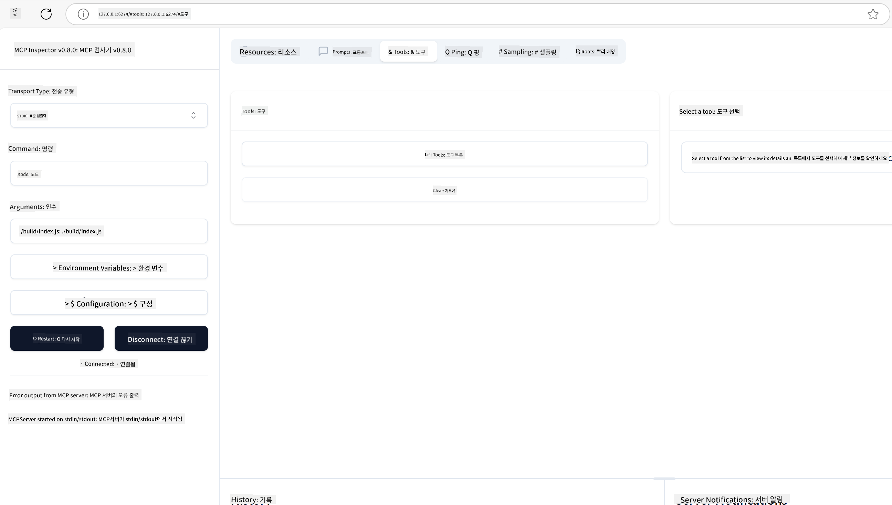
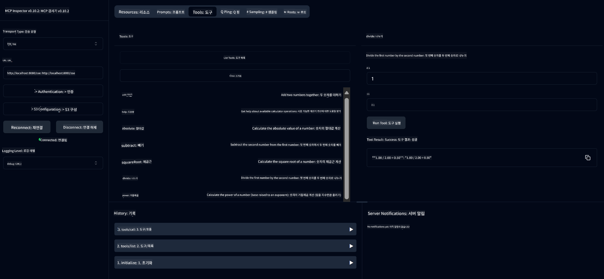
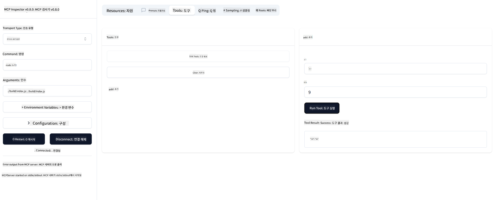

<!--
CO_OP_TRANSLATOR_METADATA:
{
  "original_hash": "ee93d6093964ea579dbdc20b4d643e9b",
  "translation_date": "2025-08-12T21:27:54+00:00",
  "source_file": "03-GettingStarted/01-first-server/README.md",
  "language_code": "ko"
}
-->
# MCP 시작하기

Model Context Protocol (MCP)와 함께 첫걸음을 내딛는 것을 환영합니다! MCP가 처음이든, 더 깊이 이해하고자 하든, 이 가이드는 필수적인 설정 및 개발 과정을 안내합니다. MCP가 AI 모델과 애플리케이션 간의 원활한 통합을 어떻게 가능하게 하는지 알아보고, MCP 기반 솔루션을 구축하고 테스트할 환경을 빠르게 준비하는 방법을 배울 수 있습니다.

> TLDR; AI 앱을 개발할 때, LLM(대규모 언어 모델)에 도구와 기타 리소스를 추가하여 LLM의 지식을 확장할 수 있다는 것을 알고 있을 것입니다. 그러나 이러한 도구와 리소스를 서버에 배치하면, LLM이 있든 없든 모든 클라이언트가 앱과 서버 기능을 사용할 수 있습니다.

## 개요

이 레슨은 MCP 환경을 설정하고 첫 MCP 애플리케이션을 구축하는 데 필요한 실질적인 지침을 제공합니다. 필요한 도구와 프레임워크를 설정하고, 기본 MCP 서버를 구축하며, 호스트 애플리케이션을 생성하고 구현을 테스트하는 방법을 배우게 됩니다.

Model Context Protocol (MCP)은 애플리케이션이 LLM에 컨텍스트를 제공하는 방식을 표준화하는 오픈 프로토콜입니다. MCP를 AI 애플리케이션의 USB-C 포트라고 생각해보세요. 이는 AI 모델을 다양한 데이터 소스와 도구에 연결하는 표준화된 방법을 제공합니다.

## 학습 목표

이 레슨을 마치면 다음을 수행할 수 있습니다:

- C#, Java, Python, TypeScript, Rust에서 MCP 개발 환경 설정
- 사용자 정의 기능(리소스, 프롬프트, 도구)을 갖춘 기본 MCP 서버 구축 및 배포
- MCP 서버에 연결하는 호스트 애플리케이션 생성
- MCP 구현 테스트 및 디버깅

## MCP 환경 설정

MCP 작업을 시작하기 전에 개발 환경을 준비하고 기본 워크플로를 이해하는 것이 중요합니다. 이 섹션에서는 MCP를 원활하게 시작할 수 있도록 초기 설정 단계를 안내합니다.

### 사전 준비 사항

MCP 개발에 착수하기 전에 다음을 준비하세요:

- **개발 환경**: 선택한 언어(C#, Java, Python, TypeScript, Rust)에 맞는 환경
- **IDE/에디터**: Visual Studio, Visual Studio Code, IntelliJ, Eclipse, PyCharm 또는 최신 코드 에디터
- **패키지 관리자**: NuGet, Maven/Gradle, pip, npm/yarn, Cargo
- **API 키**: 호스트 애플리케이션에서 사용할 AI 서비스용

## 기본 MCP 서버 구조

MCP 서버는 일반적으로 다음을 포함합니다:

- **서버 설정**: 포트, 인증 및 기타 설정 구성
- **리소스**: LLM에 제공되는 데이터와 컨텍스트
- **도구**: 모델이 호출할 수 있는 기능
- **프롬프트**: 텍스트 생성 또는 구조화를 위한 템플릿

다음은 TypeScript로 작성된 간단한 예제입니다:

```typescript
import { McpServer, ResourceTemplate } from "@modelcontextprotocol/sdk/server/mcp.js";
import { StdioServerTransport } from "@modelcontextprotocol/sdk/server/stdio.js";
import { z } from "zod";

// Create an MCP server
const server = new McpServer({
  name: "Demo",
  version: "1.0.0"
});

// Add an addition tool
server.tool("add",
  { a: z.number(), b: z.number() },
  async ({ a, b }) => ({
    content: [{ type: "text", text: String(a + b) }]
  })
);

// Add a dynamic greeting resource
server.resource(
  "file",
  // The 'list' parameter controls how the resource lists available files. Setting it to undefined disables listing for this resource.
  new ResourceTemplate("file://{path}", { list: undefined }),
  async (uri, { path }) => ({
    contents: [{
      uri: uri.href,
      text: `File, ${path}!`
    }]
// Add a file resource that reads the file contents
server.resource(
  "file",
  new ResourceTemplate("file://{path}", { list: undefined }),
  async (uri, { path }) => {
    let text;
    try {
      text = await fs.readFile(path, "utf8");
    } catch (err) {
      text = `Error reading file: ${err.message}`;
    }
    return {
      contents: [{
        uri: uri.href,
        text
      }]
    };
  }
);

server.prompt(
  "review-code",
  { code: z.string() },
  ({ code }) => ({
    messages: [{
      role: "user",
      content: {
        type: "text",
        text: `Please review this code:\n\n${code}`
      }
    }]
  })
);

// Start receiving messages on stdin and sending messages on stdout
const transport = new StdioServerTransport();
await server.connect(transport);
```

위 코드에서 우리는:

- MCP TypeScript SDK에서 필요한 클래스를 가져옵니다.
- 새로운 MCP 서버 인스턴스를 생성하고 설정합니다.
- 핸들러 함수가 포함된 사용자 정의 도구(`calculator`)를 등록합니다.
- 들어오는 MCP 요청을 수신하도록 서버를 시작합니다.

## 테스트 및 디버깅

MCP 서버를 테스트하기 전에 사용 가능한 도구와 디버깅을 위한 모범 사례를 이해하는 것이 중요합니다. 효과적인 테스트는 서버가 예상대로 작동하도록 보장하며, 문제를 신속하게 식별하고 해결하는 데 도움을 줍니다. 다음 섹션에서는 MCP 구현을 검증하기 위한 권장 접근 방식을 설명합니다.

MCP는 서버를 테스트하고 디버깅하는 데 도움이 되는 도구를 제공합니다:

- **Inspector 도구**: 이 그래픽 인터페이스를 사용하여 서버에 연결하고 도구, 프롬프트 및 리소스를 테스트할 수 있습니다.
- **curl**: curl과 같은 명령줄 도구를 사용하거나 HTTP 명령을 생성하고 실행할 수 있는 다른 클라이언트를 통해 서버에 연결할 수 있습니다.

### MCP Inspector 사용하기

[MCP Inspector](https://github.com/modelcontextprotocol/inspector)는 다음을 도와주는 시각적 테스트 도구입니다:

1. **서버 기능 탐색**: 사용 가능한 리소스, 도구 및 프롬프트를 자동으로 감지
2. **도구 실행 테스트**: 다양한 매개변수를 시도하고 실시간으로 응답 확인
3. **서버 메타데이터 보기**: 서버 정보, 스키마 및 설정 검사

```bash
# ex TypeScript, installing and running MCP Inspector
npx @modelcontextprotocol/inspector node build/index.js
```

위 명령을 실행하면 MCP Inspector가 브라우저에서 로컬 웹 인터페이스를 시작합니다. 등록된 MCP 서버, 사용 가능한 도구, 리소스 및 프롬프트를 표시하는 대시보드를 볼 수 있습니다. 이 인터페이스를 통해 도구 실행을 상호작용적으로 테스트하고, 서버 메타데이터를 검사하며, 실시간 응답을 확인할 수 있어 MCP 서버 구현을 검증하고 디버깅하기가 더 쉬워집니다.

다음은 인터페이스의 스크린샷 예시입니다:



## 일반적인 설정 문제 및 해결 방법

| 문제 | 가능한 해결 방법 |
|------|------------------|
| 연결 거부 | 서버가 실행 중인지와 포트가 올바른지 확인 |
| 도구 실행 오류 | 매개변수 검증 및 오류 처리 검토 |
| 인증 실패 | API 키와 권한 확인 |
| 스키마 검증 오류 | 매개변수가 정의된 스키마와 일치하는지 확인 |
| 서버 시작 실패 | 포트 충돌 또는 누락된 종속성 확인 |
| CORS 오류 | 교차 출처 요청을 위한 적절한 CORS 헤더 구성 |
| 인증 문제 | 토큰 유효성과 권한 확인 |

## 로컬 개발

로컬 개발 및 테스트를 위해 MCP 서버를 직접 머신에서 실행할 수 있습니다:

1. **서버 프로세스 시작**: MCP 서버 애플리케이션 실행
2. **네트워킹 구성**: 서버가 예상 포트에서 접근 가능하도록 설정
3. **클라이언트 연결**: `http://localhost:3000`과 같은 로컬 연결 URL 사용

```bash
# Example: Running a TypeScript MCP server locally
npm run start
# Server running at http://localhost:3000
```

## 첫 MCP 서버 구축하기

이전 레슨에서 [핵심 개념](/01-CoreConcepts/README.md)을 다뤘으니, 이제 그 지식을 활용할 때입니다.

### 서버가 할 수 있는 일

코드를 작성하기 전에 서버가 할 수 있는 일을 다시 상기해봅시다:

MCP 서버는 예를 들어:

- 로컬 파일 및 데이터베이스에 접근
- 원격 API에 연결
- 계산 수행
- 다른 도구 및 서비스와 통합
- 상호작용을 위한 사용자 인터페이스 제공

좋습니다. 이제 무엇을 할 수 있는지 알았으니 코딩을 시작해봅시다.

## 연습: 서버 생성하기

서버를 생성하려면 다음 단계를 따라야 합니다:

- MCP SDK 설치
- 프로젝트 생성 및 프로젝트 구조 설정
- 서버 코드 작성
- 서버 테스트

### -1- 프로젝트 생성

#### TypeScript

```sh
# Create project directory and initialize npm project
mkdir calculator-server
cd calculator-server
npm init -y
```

#### Python

```sh
# Create project dir
mkdir calculator-server
cd calculator-server
# Open the folder in Visual Studio Code - Skip this if you are using a different IDE
code .
```

#### .NET

```sh
dotnet new console -n McpCalculatorServer
cd McpCalculatorServer
```

#### Java

Java의 경우 Spring Boot 프로젝트를 생성합니다:

```bash
curl https://start.spring.io/starter.zip \
  -d dependencies=web \
  -d javaVersion=21 \
  -d type=maven-project \
  -d groupId=com.example \
  -d artifactId=calculator-server \
  -d name=McpServer \
  -d packageName=com.microsoft.mcp.sample.server \
  -o calculator-server.zip
```

압축 파일을 추출합니다:

```bash
unzip calculator-server.zip -d calculator-server
cd calculator-server
# optional remove the unused test
rm -rf src/test/java
```

다음 전체 구성을 *pom.xml* 파일에 추가합니다:

```xml
<?xml version="1.0" encoding="UTF-8"?>
<project xmlns="http://maven.apache.org/POM/4.0.0"
    xmlns:xsi="http://www.w3.org/2001/XMLSchema-instance"
    xsi:schemaLocation="http://maven.apache.org/POM/4.0.0 http://maven.apache.org/xsd/maven-4.0.0.xsd">
    <modelVersion>4.0.0</modelVersion>
    
    <!-- Spring Boot parent for dependency management -->
    <parent>
        <groupId>org.springframework.boot</groupId>
        <artifactId>spring-boot-starter-parent</artifactId>
        <version>3.5.0</version>
        <relativePath />
    </parent>

    <!-- Project coordinates -->
    <groupId>com.example</groupId>
    <artifactId>calculator-server</artifactId>
    <version>0.0.1-SNAPSHOT</version>
    <name>Calculator Server</name>
    <description>Basic calculator MCP service for beginners</description>

    <!-- Properties -->
    <properties>
        <java.version>21</java.version>
        <maven.compiler.source>21</maven.compiler.source>
        <maven.compiler.target>21</maven.compiler.target>
    </properties>

    <!-- Spring AI BOM for version management -->
    <dependencyManagement>
        <dependencies>
            <dependency>
                <groupId>org.springframework.ai</groupId>
                <artifactId>spring-ai-bom</artifactId>
                <version>1.0.0-SNAPSHOT</version>
                <type>pom</type>
                <scope>import</scope>
            </dependency>
        </dependencies>
    </dependencyManagement>

    <!-- Dependencies -->
    <dependencies>
        <dependency>
            <groupId>org.springframework.ai</groupId>
            <artifactId>spring-ai-starter-mcp-server-webflux</artifactId>
        </dependency>
        <dependency>
            <groupId>org.springframework.boot</groupId>
            <artifactId>spring-boot-starter-actuator</artifactId>
        </dependency>
        <dependency>
         <groupId>org.springframework.boot</groupId>
         <artifactId>spring-boot-starter-test</artifactId>
         <scope>test</scope>
      </dependency>
    </dependencies>

    <!-- Build configuration -->
    <build>
        <plugins>
            <plugin>
                <groupId>org.springframework.boot</groupId>
                <artifactId>spring-boot-maven-plugin</artifactId>
            </plugin>
            <plugin>
                <groupId>org.apache.maven.plugins</groupId>
                <artifactId>maven-compiler-plugin</artifactId>
                <configuration>
                    <release>21</release>
                </configuration>
            </plugin>
        </plugins>
    </build>

    <!-- Repositories for Spring AI snapshots -->
    <repositories>
        <repository>
            <id>spring-milestones</id>
            <name>Spring Milestones</name>
            <url>https://repo.spring.io/milestone</url>
            <snapshots>
                <enabled>false</enabled>
            </snapshots>
        </repository>
        <repository>
            <id>spring-snapshots</id>
            <name>Spring Snapshots</name>
            <url>https://repo.spring.io/snapshot</url>
            <releases>
                <enabled>false</enabled>
            </releases>
        </repository>
    </repositories>
</project>
```

#### Rust

```sh
mkdir calculator-server
cd calculator-server
cargo init
```

### -2- 종속성 추가

프로젝트를 생성했으니 이제 종속성을 추가해봅시다:

#### TypeScript

```sh
# If not already installed, install TypeScript globally
npm install typescript -g

# Install the MCP SDK and Zod for schema validation
npm install @modelcontextprotocol/sdk zod
npm install -D @types/node typescript
```

#### Python

```sh
# Create a virtual env and install dependencies
python -m venv venv
venv\Scripts\activate
pip install "mcp[cli]"
```

#### Java

```bash
cd calculator-server
./mvnw clean install -DskipTests
```

#### Rust

```sh
cargo add rmcp --features server,transport-io
cargo add serde
cargo add tokio --features rt-multi-thread
```

### -3- 프로젝트 파일 생성

#### TypeScript

*package.json* 파일을 열고 다음 내용을 추가하여 서버를 빌드하고 실행할 수 있도록 합니다:

```json
{
  "name": "calculator-server",
  "version": "1.0.0",
  "main": "index.js",
  "type": "module",
  "scripts": {
    "start": "tsc && node ./build/index.js",
    "build": "tsc && node ./build/index.js"
  },
  "keywords": [],
  "author": "",
  "license": "ISC",
  "description": "A simple calculator server using Model Context Protocol",
  "dependencies": {
    "@modelcontextprotocol/sdk": "^1.16.0",
    "zod": "^3.25.76"
  },
  "devDependencies": {
    "@types/node": "^24.0.14",
    "typescript": "^5.8.3"
  }
}
```

*tsconfig.json* 파일을 생성하고 다음 내용을 추가합니다:

```json
{
  "compilerOptions": {
    "target": "ES2022",
    "module": "Node16",
    "moduleResolution": "Node16",
    "outDir": "./build",
    "rootDir": "./src",
    "strict": true,
    "esModuleInterop": true,
    "skipLibCheck": true,
    "forceConsistentCasingInFileNames": true
  },
  "include": ["src/**/*"],
  "exclude": ["node_modules"]
}
```

소스 코드 디렉토리를 생성합니다:

```sh
mkdir src
touch src/index.ts
```

#### Python

*server.py* 파일을 생성합니다:

```sh
touch server.py
```

#### .NET

필요한 NuGet 패키지를 설치합니다:

```sh
dotnet add package ModelContextProtocol --prerelease
dotnet add package Microsoft.Extensions.Hosting
```

#### Java

Java Spring Boot 프로젝트의 경우 프로젝트 구조가 자동으로 생성됩니다.

#### Rust

Rust의 경우 `cargo init`을 실행하면 기본적으로 *src/main.rs* 파일이 생성됩니다. 해당 파일을 열고 기본 코드를 삭제합니다.

### -4- 서버 코드 작성

#### TypeScript

*index.ts* 파일을 생성하고 다음 코드를 추가합니다:

```typescript
import { McpServer, ResourceTemplate } from "@modelcontextprotocol/sdk/server/mcp.js";
import { StdioServerTransport } from "@modelcontextprotocol/sdk/server/stdio.js";
import { z } from "zod";
 
// Create an MCP server
const server = new McpServer({
  name: "Calculator MCP Server",
  version: "1.0.0"
});
```

이제 서버가 생성되었지만, 아직 많은 기능이 없습니다. 이를 개선해봅시다.

#### Python

```python
# server.py
from mcp.server.fastmcp import FastMCP

# Create an MCP server
mcp = FastMCP("Demo")
```

#### .NET

```csharp
using Microsoft.Extensions.DependencyInjection;
using Microsoft.Extensions.Hosting;
using Microsoft.Extensions.Logging;
using ModelContextProtocol.Server;
using System.ComponentModel;

var builder = Host.CreateApplicationBuilder(args);
builder.Logging.AddConsole(consoleLogOptions =>
{
    // Configure all logs to go to stderr
    consoleLogOptions.LogToStandardErrorThreshold = LogLevel.Trace;
});

builder.Services
    .AddMcpServer()
    .WithStdioServerTransport()
    .WithToolsFromAssembly();
await builder.Build().RunAsync();

// add features
```

#### Java

Java의 경우 핵심 서버 구성 요소를 생성합니다. 먼저 메인 애플리케이션 클래스를 수정합니다:

*src/main/java/com/microsoft/mcp/sample/server/McpServerApplication.java*:

```java
package com.microsoft.mcp.sample.server;

import org.springframework.ai.tool.ToolCallbackProvider;
import org.springframework.ai.tool.method.MethodToolCallbackProvider;
import org.springframework.boot.SpringApplication;
import org.springframework.boot.autoconfigure.SpringBootApplication;
import org.springframework.context.annotation.Bean;
import com.microsoft.mcp.sample.server.service.CalculatorService;

@SpringBootApplication
public class McpServerApplication {

    public static void main(String[] args) {
        SpringApplication.run(McpServerApplication.class, args);
    }
    
    @Bean
    public ToolCallbackProvider calculatorTools(CalculatorService calculator) {
        return MethodToolCallbackProvider.builder().toolObjects(calculator).build();
    }
}
```

계산기 서비스 생성: *src/main/java/com/microsoft/mcp/sample/server/service/CalculatorService.java*:

```java
package com.microsoft.mcp.sample.server.service;

import org.springframework.ai.tool.annotation.Tool;
import org.springframework.stereotype.Service;

/**
 * Service for basic calculator operations.
 * This service provides simple calculator functionality through MCP.
 */
@Service
public class CalculatorService {

    /**
     * Add two numbers
     * @param a The first number
     * @param b The second number
     * @return The sum of the two numbers
     */
    @Tool(description = "Add two numbers together")
    public String add(double a, double b) {
        double result = a + b;
        return formatResult(a, "+", b, result);
    }

    /**
     * Subtract one number from another
     * @param a The number to subtract from
     * @param b The number to subtract
     * @return The result of the subtraction
     */
    @Tool(description = "Subtract the second number from the first number")
    public String subtract(double a, double b) {
        double result = a - b;
        return formatResult(a, "-", b, result);
    }

    /**
     * Multiply two numbers
     * @param a The first number
     * @param b The second number
     * @return The product of the two numbers
     */
    @Tool(description = "Multiply two numbers together")
    public String multiply(double a, double b) {
        double result = a * b;
        return formatResult(a, "*", b, result);
    }

    /**
     * Divide one number by another
     * @param a The numerator
     * @param b The denominator
     * @return The result of the division
     */
    @Tool(description = "Divide the first number by the second number")
    public String divide(double a, double b) {
        if (b == 0) {
            return "Error: Cannot divide by zero";
        }
        double result = a / b;
        return formatResult(a, "/", b, result);
    }

    /**
     * Calculate the power of a number
     * @param base The base number
     * @param exponent The exponent
     * @return The result of raising the base to the exponent
     */
    @Tool(description = "Calculate the power of a number (base raised to an exponent)")
    public String power(double base, double exponent) {
        double result = Math.pow(base, exponent);
        return formatResult(base, "^", exponent, result);
    }

    /**
     * Calculate the square root of a number
     * @param number The number to find the square root of
     * @return The square root of the number
     */
    @Tool(description = "Calculate the square root of a number")
    public String squareRoot(double number) {
        if (number < 0) {
            return "Error: Cannot calculate square root of a negative number";
        }
        double result = Math.sqrt(number);
        return String.format("√%.2f = %.2f", number, result);
    }

    /**
     * Calculate the modulus (remainder) of division
     * @param a The dividend
     * @param b The divisor
     * @return The remainder of the division
     */
    @Tool(description = "Calculate the remainder when one number is divided by another")
    public String modulus(double a, double b) {
        if (b == 0) {
            return "Error: Cannot divide by zero";
        }
        double result = a % b;
        return formatResult(a, "%", b, result);
    }

    /**
     * Calculate the absolute value of a number
     * @param number The number to find the absolute value of
     * @return The absolute value of the number
     */
    @Tool(description = "Calculate the absolute value of a number")
    public String absolute(double number) {
        double result = Math.abs(number);
        return String.format("|%.2f| = %.2f", number, result);
    }

    /**
     * Get help about available calculator operations
     * @return Information about available operations
     */
    @Tool(description = "Get help about available calculator operations")
    public String help() {
        return "Basic Calculator MCP Service\n\n" +
               "Available operations:\n" +
               "1. add(a, b) - Adds two numbers\n" +
               "2. subtract(a, b) - Subtracts the second number from the first\n" +
               "3. multiply(a, b) - Multiplies two numbers\n" +
               "4. divide(a, b) - Divides the first number by the second\n" +
               "5. power(base, exponent) - Raises a number to a power\n" +
               "6. squareRoot(number) - Calculates the square root\n" + 
               "7. modulus(a, b) - Calculates the remainder of division\n" +
               "8. absolute(number) - Calculates the absolute value\n\n" +
               "Example usage: add(5, 3) will return 5 + 3 = 8";
    }

    /**
     * Format the result of a calculation
     */
    private String formatResult(double a, String operator, double b, double result) {
        return String.format("%.2f %s %.2f = %.2f", a, operator, b, result);
    }
}
```

**프로덕션 준비 서비스용 선택적 구성 요소:**

시작 구성 생성: *src/main/java/com/microsoft/mcp/sample/server/config/StartupConfig.java*:

```java
package com.microsoft.mcp.sample.server.config;

import org.springframework.boot.CommandLineRunner;
import org.springframework.context.annotation.Bean;
import org.springframework.context.annotation.Configuration;

@Configuration
public class StartupConfig {
    
    @Bean
    public CommandLineRunner startupInfo() {
        return args -> {
            System.out.println("\n" + "=".repeat(60));
            System.out.println("Calculator MCP Server is starting...");
            System.out.println("SSE endpoint: http://localhost:8080/sse");
            System.out.println("Health check: http://localhost:8080/actuator/health");
            System.out.println("=".repeat(60) + "\n");
        };
    }
}
```

헬스 컨트롤러 생성: *src/main/java/com/microsoft/mcp/sample/server/controller/HealthController.java*:

```java
package com.microsoft.mcp.sample.server.controller;

import org.springframework.http.ResponseEntity;
import org.springframework.web.bind.annotation.GetMapping;
import org.springframework.web.bind.annotation.RestController;
import java.time.LocalDateTime;
import java.util.HashMap;
import java.util.Map;

@RestController
public class HealthController {
    
    @GetMapping("/health")
    public ResponseEntity<Map<String, Object>> healthCheck() {
        Map<String, Object> response = new HashMap<>();
        response.put("status", "UP");
        response.put("timestamp", LocalDateTime.now().toString());
        response.put("service", "Calculator MCP Server");
        return ResponseEntity.ok(response);
    }
}
```

예외 처리기 생성: *src/main/java/com/microsoft/mcp/sample/server/exception/GlobalExceptionHandler.java*:

```java
package com.microsoft.mcp.sample.server.exception;

import org.springframework.http.HttpStatus;
import org.springframework.http.ResponseEntity;
import org.springframework.web.bind.annotation.ExceptionHandler;
import org.springframework.web.bind.annotation.RestControllerAdvice;

@RestControllerAdvice
public class GlobalExceptionHandler {

    @ExceptionHandler(IllegalArgumentException.class)
    public ResponseEntity<ErrorResponse> handleIllegalArgumentException(IllegalArgumentException ex) {
        ErrorResponse error = new ErrorResponse(
            "Invalid_Input", 
            "Invalid input parameter: " + ex.getMessage());
        return new ResponseEntity<>(error, HttpStatus.BAD_REQUEST);
    }

    public static class ErrorResponse {
        private String code;
        private String message;

        public ErrorResponse(String code, String message) {
            this.code = code;
            this.message = message;
        }

        // Getters
        public String getCode() { return code; }
        public String getMessage() { return message; }
    }
}
```

커스텀 배너 생성: *src/main/resources/banner.txt*:

```text
_____      _            _       _             
 / ____|    | |          | |     | |            
| |     __ _| | ___ _   _| | __ _| |_ ___  _ __ 
| |    / _` | |/ __| | | | |/ _` | __/ _ \| '__|
| |___| (_| | | (__| |_| | | (_| | || (_) | |   
 \_____\__,_|_|\___|\__,_|_|\__,_|\__\___/|_|   
                                                
Calculator MCP Server v1.0
Spring Boot MCP Application
```

#### Rust

*src/main.rs* 파일 상단에 다음 코드를 추가합니다. 이는 MCP 서버에 필요한 라이브러리와 모듈을 가져옵니다.

```rust
use rmcp::{
    handler::server::{router::tool::ToolRouter, tool::Parameters},
    model::{ServerCapabilities, ServerInfo},
    schemars, tool, tool_handler, tool_router,
    transport::stdio,
    ServerHandler, ServiceExt,
};
use std::error::Error;
```

계산기 요청을 나타내는 구조체를 생성합니다:

```rust
#[derive(Debug, serde::Deserialize, schemars::JsonSchema)]
pub struct CalculatorRequest {
    pub a: f64,
    pub b: f64,
}
```

다음으로, 계산기 서버를 나타내는 구조체를 생성합니다. 이 구조체는 도구 라우터를 보유하며 도구를 등록하는 데 사용됩니다.

```rust
#[derive(Debug, Clone)]
pub struct Calculator {
    tool_router: ToolRouter<Self>,
}
```

이제 `Calculator` 구조체를 구현하여 서버 인스턴스를 생성하고 서버 핸들러를 구현하여 서버 정보를 제공합니다.

```rust
#[tool_router]
impl Calculator {
    pub fn new() -> Self {
        Self {
            tool_router: Self::tool_router(),
        }
    }
}

#[tool_handler]
impl ServerHandler for Calculator {
    fn get_info(&self) -> ServerInfo {
        ServerInfo {
            instructions: Some("A simple calculator tool".into()),
            capabilities: ServerCapabilities::builder().enable_tools().build(),
            ..Default::default()
        }
    }
}
```

마지막으로, 서버를 시작하는 메인 함수를 구현해야 합니다. 이 함수는 `Calculator` 구조체의 인스턴스를 생성하고 표준 입력/출력을 통해 제공됩니다.

```rust
#[tokio::main]
async fn main() -> Result<(), Box<dyn Error>> {
    let service = Calculator::new().serve(stdio()).await?;
    service.waiting().await?;
    Ok(())
}
```

이제 서버가 기본 정보를 제공하도록 설정되었습니다. 다음으로, 덧셈을 수행하는 도구를 추가합니다.

### -5- 도구 및 리소스 추가

도구와 리소스를 추가하려면 다음 코드를 추가합니다:

#### TypeScript

```typescript
server.tool(
  "add",
  { a: z.number(), b: z.number() },
  async ({ a, b }) => ({
    content: [{ type: "text", text: String(a + b) }]
  })
);

server.resource(
  "greeting",
  new ResourceTemplate("greeting://{name}", { list: undefined }),
  async (uri, { name }) => ({
    contents: [{
      uri: uri.href,
      text: `Hello, ${name}!`
    }]
  })
);
```

도구는 매개변수 `a`와 `b`를 받아 다음과 같은 형태의 응답을 생성하는 함수를 실행합니다:

```typescript
{
  contents: [{
    type: "text", content: "some content"
  }]
}
```

리소스는 "greeting"이라는 문자열을 통해 접근되며 매개변수 `name`을 받아 도구와 유사한 응답을 생성합니다:

```typescript
{
  uri: "<href>",
  text: "a text"
}
```

#### Python

```python
# Add an addition tool
@mcp.tool()
def add(a: int, b: int) -> int:
    """Add two numbers"""
    return a + b


# Add a dynamic greeting resource
@mcp.resource("greeting://{name}")
def get_greeting(name: str) -> str:
    """Get a personalized greeting"""
    return f"Hello, {name}!"
```

위 코드에서 우리는:

- 매개변수 `a`와 `p`를 받는 정수형 도구 `add`를 정의했습니다.
- 매개변수 `name`을 받는 리소스 `greeting`을 생성했습니다.

#### .NET

Program.cs 파일에 다음을 추가합니다:

```csharp
[McpServerToolType]
public static class CalculatorTool
{
    [McpServerTool, Description("Adds two numbers")]
    public static string Add(int a, int b) => $"Sum {a + b}";
}
```

#### Java

도구는 이전 단계에서 이미 생성되었습니다.

#### Rust

`impl Calculator` 블록 내부에 새 도구를 추가합니다:

```rust
#[tool(description = "Adds a and b")]
async fn add(
    &self,
    Parameters(CalculatorRequest { a, b }): Parameters<CalculatorRequest>,
) -> String {
    (a + b).to_string()
}
```

### -6- 최종 코드

서버를 시작할 수 있도록 마지막 코드를 추가합니다:

#### TypeScript

```typescript
// Start receiving messages on stdin and sending messages on stdout
const transport = new StdioServerTransport();
await server.connect(transport);
```

전체 코드는 다음과 같습니다:

```typescript
// index.ts
import { McpServer, ResourceTemplate } from "@modelcontextprotocol/sdk/server/mcp.js";
import { StdioServerTransport } from "@modelcontextprotocol/sdk/server/stdio.js";
import { z } from "zod";

// Create an MCP server
const server = new McpServer({
  name: "Calculator MCP Server",
  version: "1.0.0"
});

// Add an addition tool
server.tool(
  "add",
  { a: z.number(), b: z.number() },
  async ({ a, b }) => ({
    content: [{ type: "text", text: String(a + b) }]
  })
);

// Add a dynamic greeting resource
server.resource(
  "greeting",
  new ResourceTemplate("greeting://{name}", { list: undefined }),
  async (uri, { name }) => ({
    contents: [{
      uri: uri.href,
      text: `Hello, ${name}!`
    }]
  })
);

// Start receiving messages on stdin and sending messages on stdout
const transport = new StdioServerTransport();
server.connect(transport);
```

#### Python

```python
# server.py
from mcp.server.fastmcp import FastMCP

# Create an MCP server
mcp = FastMCP("Demo")


# Add an addition tool
@mcp.tool()
def add(a: int, b: int) -> int:
    """Add two numbers"""
    return a + b


# Add a dynamic greeting resource
@mcp.resource("greeting://{name}")
def get_greeting(name: str) -> str:
    """Get a personalized greeting"""
    return f"Hello, {name}!"

# Main execution block - this is required to run the server
if __name__ == "__main__":
    mcp.run()
```

#### .NET

다음 내용을 포함하는 Program.cs 파일을 생성합니다:

```csharp
using Microsoft.Extensions.DependencyInjection;
using Microsoft.Extensions.Hosting;
using Microsoft.Extensions.Logging;
using ModelContextProtocol.Server;
using System.ComponentModel;

var builder = Host.CreateApplicationBuilder(args);
builder.Logging.AddConsole(consoleLogOptions =>
{
    // Configure all logs to go to stderr
    consoleLogOptions.LogToStandardErrorThreshold = LogLevel.Trace;
});

builder.Services
    .AddMcpServer()
    .WithStdioServerTransport()
    .WithToolsFromAssembly();
await builder.Build().RunAsync();

[McpServerToolType]
public static class CalculatorTool
{
    [McpServerTool, Description("Adds two numbers")]
    public static string Add(int a, int b) => $"Sum {a + b}";
}
```

#### Java

완성된 메인 애플리케이션 클래스는 다음과 같습니다:

```java
// McpServerApplication.java
package com.microsoft.mcp.sample.server;

import org.springframework.ai.tool.ToolCallbackProvider;
import org.springframework.ai.tool.method.MethodToolCallbackProvider;
import org.springframework.boot.SpringApplication;
import org.springframework.boot.autoconfigure.SpringBootApplication;
import org.springframework.context.annotation.Bean;
import com.microsoft.mcp.sample.server.service.CalculatorService;

@SpringBootApplication
public class McpServerApplication {

    public static void main(String[] args) {
        SpringApplication.run(McpServerApplication.class, args);
    }
    
    @Bean
    public ToolCallbackProvider calculatorTools(CalculatorService calculator) {
        return MethodToolCallbackProvider.builder().toolObjects(calculator).build();
    }
}
```

#### Rust

Rust 서버의 최종 코드는 다음과 같습니다:

```rust
use rmcp::{
    ServerHandler, ServiceExt,
    handler::server::{router::tool::ToolRouter, tool::Parameters},
    model::{ServerCapabilities, ServerInfo},
    schemars, tool, tool_handler, tool_router,
    transport::stdio,
};
use std::error::Error;

#[derive(Debug, serde::Deserialize, schemars::JsonSchema)]
pub struct CalculatorRequest {
    pub a: f64,
    pub b: f64,
}

#[derive(Debug, Clone)]
pub struct Calculator {
    tool_router: ToolRouter<Self>,
}

#[tool_router]
impl Calculator {
    pub fn new() -> Self {
        Self {
            tool_router: Self::tool_router(),
        }
    }
    
    #[tool(description = "Adds a and b")]
    async fn add(
        &self,
        Parameters(CalculatorRequest { a, b }): Parameters<CalculatorRequest>,
    ) -> String {
        (a + b).to_string()
    }
}

#[tool_handler]
impl ServerHandler for Calculator {
    fn get_info(&self) -> ServerInfo {
        ServerInfo {
            instructions: Some("A simple calculator tool".into()),
            capabilities: ServerCapabilities::builder().enable_tools().build(),
            ..Default::default()
        }
    }
}

#[tokio::main]
async fn main() -> Result<(), Box<dyn Error>> {
    let service = Calculator::new().serve(stdio()).await?;
    service.waiting().await?;
    Ok(())
}
```

### -7- 서버 테스트

다음 명령으로 서버를 시작합니다:

#### TypeScript

```sh
npm run build
```

#### Python

```sh
mcp run server.py
```

> MCP Inspector를 사용하려면 `mcp dev server.py`를 사용하세요. 이는 Inspector를 자동으로 실행하고 필요한 프록시 세션 토큰을 제공합니다. `mcp run server.py`를 사용하는 경우 Inspector를 수동으로 시작하고 연결을 구성해야 합니다.

#### .NET

프로젝트 디렉토리에 있는지 확인하세요:

```sh
cd McpCalculatorServer
dotnet run
```

#### Java

```bash
./mvnw clean install -DskipTests
java -jar target/calculator-server-0.0.1-SNAPSHOT.jar
```

#### Rust

서버를 포맷하고 실행하려면 다음 명령을 실행하세요:

```sh
cargo fmt
cargo run
```

### -8- Inspector를 사용하여 실행

Inspector는 서버를 시작하고 상호작용할 수 있는 훌륭한 도구로, 서버가 제대로 작동하는지 테스트할 수 있습니다. 이를 시작해봅시다:

> [!NOTE]
> "command" 필드의 내용은 특정 런타임으로 서버를 실행하는 명령을 포함하므로 다를 수 있습니다.

#### TypeScript

```sh
npx @modelcontextprotocol/inspector node build/index.js
```

또는 *package.json*에 다음과 같이 추가하세요: `"inspector": "npx @modelcontextprotocol/inspector node build/index.js"` 그런 다음 `npm run inspector`를 실행합니다.

Python은 Node.js 도구인 inspector를 래핑합니다. 해당 도구를 다음과 같이 호출할 수 있습니다:

```sh
mcp dev server.py
```

그러나 모든 메서드를 구현하지 않으므로 아래와 같이 Node.js 도구를 직접 실행하는 것이 좋습니다:

```sh
npx @modelcontextprotocol/inspector mcp run server.py
```

스크립트를 실행하는 명령과 인수를 구성할 수 있는 도구나 IDE를 사용하는 경우, `Command` 필드에 `python`을 설정하고 `Arguments`에 `server.py`를 설정하세요. 이렇게 하면 스크립트가 올바르게 실행됩니다.

#### .NET

프로젝트 디렉토리에 있는지 확인하세요:

```sh
cd McpCalculatorServer
npx @modelcontextprotocol/inspector dotnet run
```

#### Java

계산기 서버가 실행 중인지 확인하세요.
Inspector를 실행합니다:

```cmd
npx @modelcontextprotocol/inspector
```

Inspector 웹 인터페이스에서:

1. "SSE"를 전송 유형으로 선택
2. URL을 `http://localhost:8080/sse`로 설정
3. "Connect"를 클릭


**서버에 연결되었습니다**  
**Java 서버 테스트 섹션이 완료되었습니다**

다음 섹션에서는 서버와 상호작용하는 방법에 대해 다룹니다.

다음과 같은 사용자 인터페이스를 볼 수 있어야 합니다:


1. "Connect" 버튼을 선택하여 서버에 연결하세요.  
   서버에 연결되면 다음 화면이 나타납니다:

   

2. "Tools"와 "listTools"를 선택하세요. "Add"가 표시될 것입니다. "Add"를 선택하고 매개변수 값을 입력하세요.

   "add" 도구의 결과로 다음과 같은 응답을 볼 수 있습니다:

   

축하합니다! 첫 번째 서버를 생성하고 실행하는 데 성공했습니다!

#### Rust

MCP Inspector CLI를 사용하여 Rust 서버를 실행하려면 다음 명령어를 사용하세요:

```sh
npx @modelcontextprotocol/inspector cargo run --cli --method tools/call --tool-name add --tool-arg a=1 b=2
```

### 공식 SDK

MCP는 여러 언어에 대한 공식 SDK를 제공합니다:

- [C# SDK](https://github.com/modelcontextprotocol/csharp-sdk) - Microsoft와 협력하여 유지 관리
- [Java SDK](https://github.com/modelcontextprotocol/java-sdk) - Spring AI와 협력하여 유지 관리
- [TypeScript SDK](https://github.com/modelcontextprotocol/typescript-sdk) - 공식 TypeScript 구현
- [Python SDK](https://github.com/modelcontextprotocol/python-sdk) - 공식 Python 구현
- [Kotlin SDK](https://github.com/modelcontextprotocol/kotlin-sdk) - 공식 Kotlin 구현
- [Swift SDK](https://github.com/modelcontextprotocol/swift-sdk) - Loopwork AI와 협력하여 유지 관리
- [Rust SDK](https://github.com/modelcontextprotocol/rust-sdk) - 공식 Rust 구현

## 주요 요점

- MCP 개발 환경 설정은 언어별 SDK를 통해 간단하게 진행할 수 있습니다.
- MCP 서버를 구축하려면 명확한 스키마로 도구를 생성하고 등록해야 합니다.
- 신뢰할 수 있는 MCP 구현을 위해 테스트와 디버깅은 필수적입니다.

## 샘플

- [Java 계산기](../samples/java/calculator/README.md)
- [.Net 계산기](../../../../03-GettingStarted/samples/csharp)
- [JavaScript 계산기](../samples/javascript/README.md)
- [TypeScript 계산기](../samples/typescript/README.md)
- [Python 계산기](../../../../03-GettingStarted/samples/python)
- [Rust 계산기](../../../../03-GettingStarted/samples/rust)

## 과제

선택한 도구로 간단한 MCP 서버를 생성하세요:

1. 선호하는 언어(.NET, Java, Python, TypeScript, 또는 Rust)로 도구를 구현하세요.  
2. 입력 매개변수와 반환 값을 정의하세요.  
3. Inspector 도구를 실행하여 서버가 의도한 대로 작동하는지 확인하세요.  
4. 다양한 입력값으로 구현을 테스트하세요.

## 솔루션

[Solution](./solution/README.md)

## 추가 자료

- [Azure에서 Model Context Protocol을 사용하여 에이전트 빌드하기](https://learn.microsoft.com/azure/developer/ai/intro-agents-mcp)
- [Azure Container Apps를 사용한 원격 MCP (Node.js/TypeScript/JavaScript)](https://learn.microsoft.com/samples/azure-samples/mcp-container-ts/mcp-container-ts/)
- [.NET OpenAI MCP 에이전트](https://learn.microsoft.com/samples/azure-samples/openai-mcp-agent-dotnet/openai-mcp-agent-dotnet/)

## 다음 단계

다음: [MCP 클라이언트 시작하기](../02-client/README.md)

**면책 조항**:  
이 문서는 AI 번역 서비스 [Co-op Translator](https://github.com/Azure/co-op-translator)를 사용하여 번역되었습니다. 정확성을 위해 최선을 다하고 있지만, 자동 번역에는 오류나 부정확성이 포함될 수 있습니다. 원본 문서의 원어 버전을 권위 있는 출처로 간주해야 합니다. 중요한 정보에 대해서는 전문적인 인간 번역을 권장합니다. 이 번역 사용으로 인해 발생하는 오해나 잘못된 해석에 대해 책임을 지지 않습니다.