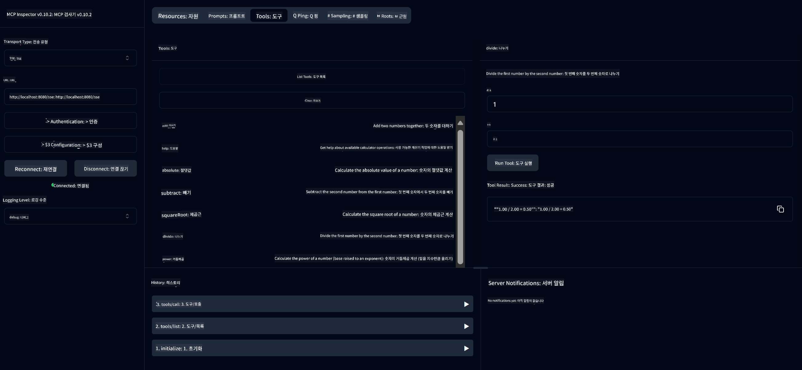

<!--
CO_OP_TRANSLATOR_METADATA:
{
  "original_hash": "ed9cab32cc67c12d8969b407aa47100a",
  "translation_date": "2025-06-11T09:30:20+00:00",
  "source_file": "03-GettingStarted/01-first-server/solution/java/README.md",
  "language_code": "ko"
}
-->
# Basic Calculator MCP Service

이 서비스는 Spring Boot와 WebFlux 전송을 사용하여 Model Context Protocol(MCP)을 통해 기본 계산기 기능을 제공합니다. MCP 구현을 배우는 초보자를 위한 간단한 예제로 설계되었습니다.

자세한 내용은 [MCP Server Boot Starter](https://docs.spring.io/spring-ai/reference/api/mcp/mcp-server-boot-starter-docs.html) 참조 문서를 확인하세요.


## 서비스 사용법

이 서비스는 MCP 프로토콜을 통해 다음 API 엔드포인트를 제공합니다:

- `add(a, b)`: 두 숫자를 더하기
- `subtract(a, b)`: 첫 번째 숫자에서 두 번째 숫자 빼기
- `multiply(a, b)`: 두 숫자 곱하기
- `divide(a, b)`: 첫 번째 숫자를 두 번째 숫자로 나누기 (0 검사 포함)
- `power(base, exponent)`: 숫자의 거듭제곱 계산
- `squareRoot(number)`: 제곱근 계산 (음수 검사 포함)
- `modulus(a, b)`: 나눗셈 후 나머지 계산
- `absolute(number)`: 절댓값 계산

## 의존성

프로젝트에 필요한 주요 의존성은 다음과 같습니다:

```xml
<dependency>
    <groupId>org.springframework.ai</groupId>
    <artifactId>spring-ai-starter-mcp-server-webflux</artifactId>
</dependency>
```

## 프로젝트 빌드

Maven을 사용하여 프로젝트를 빌드하세요:
```bash
./mvnw clean install -DskipTests
```

## 서버 실행

### Java 사용

```bash
java -jar target/calculator-server-0.0.1-SNAPSHOT.jar
```

### MCP Inspector 사용

MCP Inspector는 MCP 서비스와 상호작용할 수 있는 유용한 도구입니다. 이 계산기 서비스와 함께 사용하려면:

1. **새 터미널 창에서 MCP Inspector를 설치하고 실행하세요**:
   ```bash
   npx @modelcontextprotocol/inspector
   ```

2. **앱에서 표시된 URL을 클릭하여 웹 UI에 접속하세요** (보통 http://localhost:6274)

3. **연결 설정**:
   - 전송 유형을 "SSE"로 설정
   - 실행 중인 서버의 SSE 엔드포인트 URL을 입력: `http://localhost:8080/sse`
   - "Connect" 클릭

4. **도구 사용**:
   - "List Tools"를 클릭하여 사용 가능한 계산기 작업 목록 확인
   - 도구를 선택한 후 "Run Tool"을 클릭하여 작업 실행



**면책 조항**:  
이 문서는 AI 번역 서비스 [Co-op Translator](https://github.com/Azure/co-op-translator)를 사용하여 번역되었습니다. 정확성을 위해 최선을 다하고 있으나, 자동 번역에는 오류나 부정확한 부분이 있을 수 있음을 유의해 주시기 바랍니다. 원본 문서는 해당 언어의 원문이 권위 있는 출처로 간주되어야 합니다. 중요한 정보의 경우에는 전문적인 인간 번역을 권장합니다. 본 번역의 사용으로 인해 발생하는 오해나 잘못된 해석에 대해 당사는 책임을 지지 않습니다.