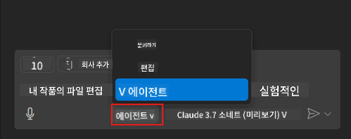
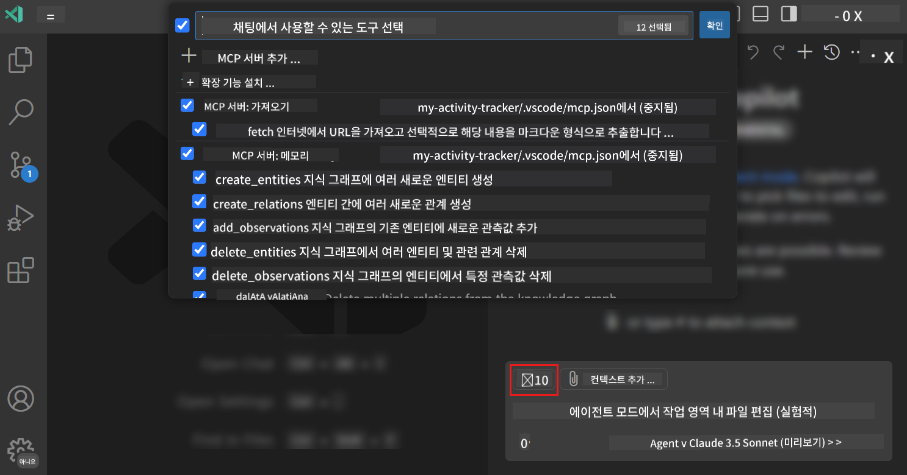
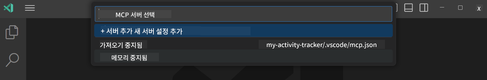
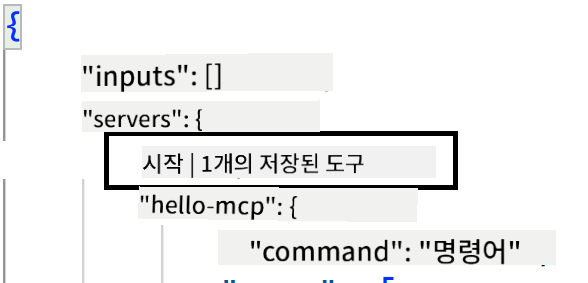
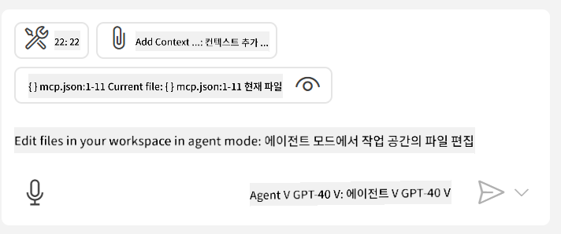
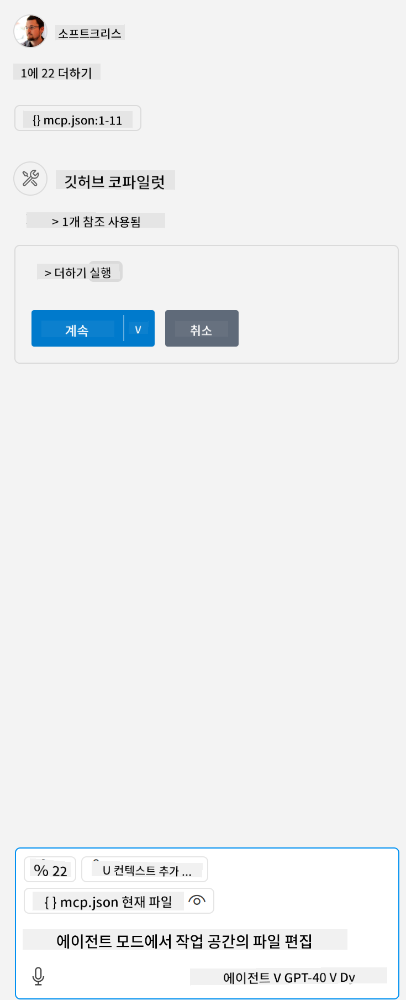

<!--
CO_OP_TRANSLATOR_METADATA:
{
  "original_hash": "d940b5e0af75e3a3a4d1c3179120d1d9",
  "translation_date": "2025-08-26T17:24:34+00:00",
  "source_file": "03-GettingStarted/04-vscode/README.md",
  "language_code": "ko"
}
-->
# GitHub Copilot 에이전트 모드에서 서버 사용하기

Visual Studio Code와 GitHub Copilot은 클라이언트 역할을 하며 MCP 서버를 사용할 수 있습니다. 왜 이런 기능이 필요할까요? MCP 서버의 모든 기능을 IDE 내에서 사용할 수 있다는 뜻입니다. 예를 들어 GitHub의 MCP 서버를 추가하면 터미널에서 특정 명령어를 입력하는 대신 프롬프트를 통해 GitHub을 제어할 수 있습니다. 또는 개발자 경험을 개선할 수 있는 모든 것을 자연어로 제어할 수 있다고 상상해 보세요. 이제 이 기능의 장점을 이해할 수 있겠죠?

## 개요

이 강의에서는 Visual Studio Code와 GitHub Copilot의 에이전트 모드를 사용하여 MCP 서버를 클라이언트로 활용하는 방법을 다룹니다.

## 학습 목표

이 강의를 마치면 다음을 할 수 있습니다:

- Visual Studio Code를 통해 MCP 서버를 사용할 수 있습니다.
- GitHub Copilot을 통해 도구와 같은 기능을 실행할 수 있습니다.
- Visual Studio Code를 설정하여 MCP 서버를 찾고 관리할 수 있습니다.

## 사용법

MCP 서버를 제어하는 방법은 두 가지가 있습니다:

- 사용자 인터페이스: 이 방법은 이후 챕터에서 다룹니다.
- 터미널: `code` 실행 파일을 사용하여 터미널에서 제어할 수 있습니다.

  사용자 프로필에 MCP 서버를 추가하려면 `--add-mcp` 명령줄 옵션을 사용하고 JSON 서버 설정을 다음 형식으로 제공하세요: {\"name\":\"server-name\",\"command\":...}.

  ```
  code --add-mcp "{\"name\":\"my-server\",\"command\": \"uvx\",\"args\": [\"mcp-server-fetch\"]}"
  ```

### 스크린샷





다음 섹션에서 시각적 인터페이스를 사용하는 방법에 대해 더 알아보겠습니다.

## 접근 방식

다음은 고수준에서 접근해야 할 방법입니다:

- MCP 서버를 찾기 위한 파일을 설정합니다.
- 서버를 시작하거나 연결하여 서버의 기능을 나열합니다.
- GitHub Copilot 채팅 인터페이스를 통해 해당 기능을 사용합니다.

좋습니다, 이제 흐름을 이해했으니 Visual Studio Code를 통해 MCP 서버를 사용하는 연습을 해봅시다.

## 연습: 서버 사용하기

이 연습에서는 Visual Studio Code를 설정하여 MCP 서버를 찾아 GitHub Copilot 채팅 인터페이스에서 사용할 수 있도록 합니다.

### -0- 사전 단계: MCP 서버 검색 활성화

MCP 서버 검색을 활성화해야 할 수도 있습니다.

1. Visual Studio Code에서 `파일 -> 기본 설정 -> 설정`으로 이동합니다.

1. "MCP"를 검색하고 settings.json 파일에서 `chat.mcp.discovery.enabled`를 활성화합니다.

### -1- 설정 파일 생성

프로젝트 루트에 설정 파일을 생성하세요. MCP.json이라는 파일을 생성하고 .vscode 폴더에 배치해야 합니다. 다음과 같이 보일 것입니다:

```text
.vscode
|-- mcp.json
```

다음으로 서버 항목을 추가하는 방법을 알아봅시다.

### -2- 서버 설정

*mcp.json*에 다음 내용을 추가하세요:

```json
{
    "inputs": [],
    "servers": {
       "hello-mcp": {
           "command": "node",
           "args": [
               "build/index.js"
           ]
       }
    }
}
```

위의 예는 Node.js로 작성된 서버를 시작하는 간단한 예입니다. 다른 런타임의 경우 `command`와 `args`를 사용하여 서버를 시작하는 적절한 명령을 지정하세요.

### -3- 서버 시작

항목을 추가했으니 이제 서버를 시작해봅시다:

1. *mcp.json*에서 항목을 찾아 "재생" 아이콘을 확인하세요:

    

1. "재생" 아이콘을 클릭하면 GitHub Copilot 채팅의 도구 아이콘에 사용 가능한 도구 수가 증가하는 것을 볼 수 있습니다. 해당 도구 아이콘을 클릭하면 등록된 도구 목록이 표시됩니다. 각 도구를 체크하거나 체크 해제하여 GitHub Copilot이 이를 컨텍스트로 사용할지 여부를 결정할 수 있습니다:

  

1. 도구를 실행하려면 도구 설명과 일치하는 프롬프트를 입력하세요. 예를 들어 "22에 1을 더해줘"와 같은 프롬프트를 입력합니다:

  

  응답으로 23이 표시될 것입니다.

## 과제

*mcp.json* 파일에 서버 항목을 추가하고 서버를 시작/중지할 수 있는지 확인하세요. GitHub Copilot 채팅 인터페이스를 통해 서버의 도구와 통신할 수 있는지도 확인하세요.

## 솔루션

[솔루션](./solution/README.md)

## 주요 내용

이 챕터의 주요 내용은 다음과 같습니다:

- Visual Studio Code는 여러 MCP 서버와 그 도구를 사용할 수 있는 훌륭한 클라이언트입니다.
- GitHub Copilot 채팅 인터페이스는 서버와 상호작용하는 방법입니다.
- API 키와 같은 입력을 사용자에게 요청하여 *mcp.json* 파일에서 서버 항목을 설정할 때 MCP 서버에 전달할 수 있습니다.

## 샘플

- [Java 계산기](../samples/java/calculator/README.md)
- [.Net 계산기](../../../../03-GettingStarted/samples/csharp)
- [JavaScript 계산기](../samples/javascript/README.md)
- [TypeScript 계산기](../samples/typescript/README.md)
- [Python 계산기](../../../../03-GettingStarted/samples/python)

## 추가 자료

- [Visual Studio 문서](https://code.visualstudio.com/docs/copilot/chat/mcp-servers)

## 다음 단계

- 다음: [Stdio 서버 생성하기](../05-stdio-server/README.md)

---

**면책 조항**:  
이 문서는 AI 번역 서비스 [Co-op Translator](https://github.com/Azure/co-op-translator)를 사용하여 번역되었습니다. 정확성을 위해 최선을 다하고 있지만, 자동 번역에는 오류나 부정확성이 포함될 수 있습니다. 원본 문서의 원어 버전을 권위 있는 출처로 간주해야 합니다. 중요한 정보의 경우, 전문적인 인간 번역을 권장합니다. 이 번역 사용으로 인해 발생하는 오해나 잘못된 해석에 대해 책임을 지지 않습니다.