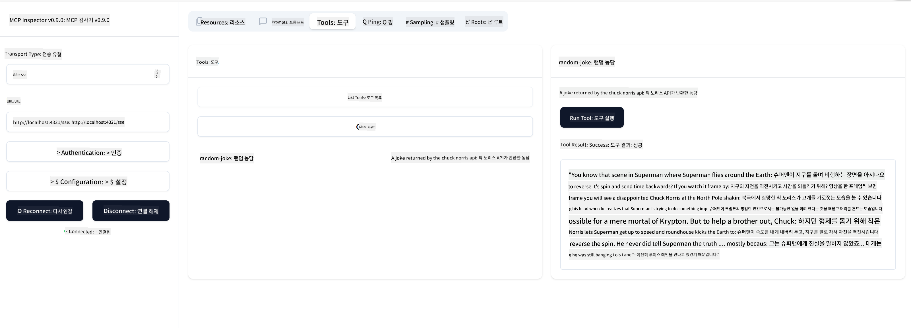

<!--
CO_OP_TRANSLATOR_METADATA:
{
  "original_hash": "d90ca3d326c48fab2ac0ebd3a9876f59",
  "translation_date": "2025-07-13T19:51:46+00:00",
  "source_file": "03-GettingStarted/05-sse-server/README.md",
  "language_code": "ko"
}
-->
이제 SSE에 대해 조금 더 알게 되었으니, 다음으로 SSE 서버를 만들어 봅시다.

## 연습: SSE 서버 만들기

서버를 만들 때 두 가지를 염두에 두어야 합니다:

- 연결과 메시지를 위한 엔드포인트를 노출하기 위해 웹 서버를 사용해야 합니다.
- stdio를 사용할 때처럼 도구, 리소스, 프롬프트를 사용해 서버를 구축합니다.

### -1- 서버 인스턴스 생성하기

서버를 만들 때는 stdio와 같은 타입을 사용하지만, 전송 방식으로는 SSE를 선택해야 합니다.

---

다음으로 필요한 라우트를 추가해 봅시다.

### -2- 라우트 추가하기

연결과 들어오는 메시지를 처리하는 라우트를 추가합니다:

---

다음으로 서버에 기능을 추가해 봅시다.

### -3- 서버 기능 추가하기

SSE에 특화된 부분을 정의했으니, 이제 도구, 프롬프트, 리소스 같은 서버 기능을 추가합니다.

---

전체 코드는 다음과 같아야 합니다:

---

좋아요, SSE를 사용하는 서버가 준비되었습니다. 이제 실행해 봅시다.

## 연습: Inspector로 SSE 서버 디버깅하기

Inspector는 이전 수업 [처음 서버 만들기](/03-GettingStarted/01-first-server/README.md)에서 본 훌륭한 도구입니다. 여기서도 Inspector를 사용할 수 있는지 확인해 봅시다:

### -1- Inspector 실행하기

Inspector를 실행하려면 먼저 SSE 서버가 실행 중이어야 하므로, 다음과 같이 서버를 실행합니다:

1. 서버 실행하기

---

1. Inspector 실행하기

    > [!NOTE]
    > 서버가 실행 중인 터미널과는 별도의 터미널 창에서 실행하세요. 또한 아래 명령어는 서버가 실행 중인 URL에 맞게 조정해야 합니다.

    ```sh
    npx @modelcontextprotocol/inspector --cli http://localhost:8000/sse --method tools/list
    ```

    Inspector 실행 방법은 모든 런타임에서 동일합니다. 서버 경로나 서버 시작 명령어 대신 서버가 실행 중인 URL과 `/sse` 경로를 지정하는 점에 주목하세요.

### -2- 도구 사용해 보기

드롭리스트에서 SSE를 선택하고, 서버가 실행 중인 URL(예: http://localhost:4321/sse)을 입력한 후 "Connect" 버튼을 클릭합니다. 이전과 같이 도구 목록을 불러오고, 도구를 선택한 뒤 입력값을 제공하세요. 아래와 같은 결과를 볼 수 있을 것입니다:



좋습니다, Inspector를 잘 사용할 수 있네요. 이제 Visual Studio Code에서 어떻게 작업할 수 있는지 살펴봅시다.

## 과제

서버에 더 많은 기능을 추가해 보세요. 예를 들어 [이 페이지](https://api.chucknorris.io/)를 참고해 API를 호출하는 도구를 추가할 수 있습니다. 서버가 어떻게 생겼으면 좋을지 직접 결정해 보세요. 즐겁게 작업하세요 :)

## 해답

[해답](./solution/README.md) 작동하는 코드가 포함된 가능한 해답입니다.

## 주요 내용 정리

이번 장의 주요 내용은 다음과 같습니다:

- SSE는 stdio 다음으로 지원되는 두 번째 전송 방식입니다.
- SSE를 지원하려면 웹 프레임워크를 사용해 들어오는 연결과 메시지를 관리해야 합니다.
- Inspector와 Visual Studio Code 모두 stdio 서버처럼 SSE 서버를 사용할 수 있습니다. 다만 stdio와 SSE 간에 약간의 차이가 있습니다. SSE는 서버를 별도로 실행한 후 Inspector 도구를 실행해야 하며, Inspector 도구에서는 URL을 지정해야 한다는 점이 다릅니다.

## 샘플

- [Java 계산기](../samples/java/calculator/README.md)
- [.Net 계산기](../../../../03-GettingStarted/samples/csharp)
- [JavaScript 계산기](../samples/javascript/README.md)
- [TypeScript 계산기](../samples/typescript/README.md)
- [Python 계산기](../../../../03-GettingStarted/samples/python)

## 추가 자료

- [SSE](https://developer.mozilla.org/en-US/docs/Web/API/Server-sent_events)

## 다음 단계

- 다음: [MCP를 이용한 HTTP 스트리밍 (스트리밍 가능한 HTTP)](../06-http-streaming/README.md)

**면책 조항**:  
이 문서는 AI 번역 서비스 [Co-op Translator](https://github.com/Azure/co-op-translator)를 사용하여 번역되었습니다. 정확성을 위해 최선을 다하고 있으나, 자동 번역에는 오류나 부정확한 부분이 있을 수 있음을 유의하시기 바랍니다. 원문은 해당 언어의 원본 문서가 권위 있는 출처로 간주되어야 합니다. 중요한 정보의 경우 전문적인 인간 번역을 권장합니다. 본 번역 사용으로 인해 발생하는 오해나 잘못된 해석에 대해 당사는 책임을 지지 않습니다.