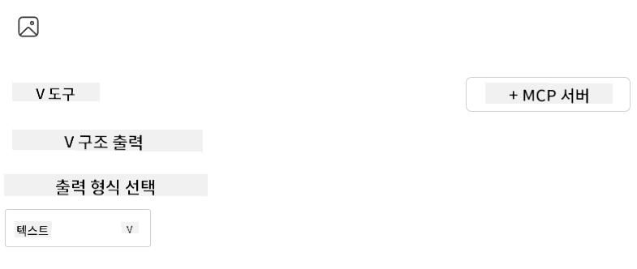

<!--
CO_OP_TRANSLATOR_METADATA:
{
  "original_hash": "a3cbadbf632058aa59a523ac659aa1df",
  "translation_date": "2025-05-16T15:29:55+00:00",
  "source_file": "03-GettingStarted/06-aitk/README.md",
  "language_code": "ko"
}
-->
# Visual Studio Code용 AI Toolkit 확장 프로그램에서 서버 사용하기

AI 에이전트를 만들 때 단순히 똑똑한 응답을 생성하는 것뿐만 아니라, 에이전트가 실제로 행동할 수 있는 능력을 부여하는 것이 중요합니다. 바로 이 부분에서 Model Context Protocol(MCP)이 역할을 합니다. MCP는 에이전트가 외부 도구와 서비스를 일관된 방식으로 쉽게 사용할 수 있도록 해줍니다. 마치 에이전트를 실제로 쓸 수 있는 도구 상자에 연결하는 것과 같습니다.

예를 들어, 에이전트를 계산기 MCP 서버에 연결하면 “47 곱하기 89는 얼마야?” 같은 질문만 받아도 수학 연산을 수행할 수 있습니다. 별도로 로직을 하드코딩하거나 맞춤형 API를 만들 필요가 없습니다.

## 개요

이 강의에서는 Visual Studio Code의 [AI Toolkit](https://aka.ms/AIToolkit) 확장 프로그램을 사용해 계산기 MCP 서버를 에이전트에 연결하는 방법을 다룹니다. 이를 통해 에이전트가 덧셈, 뺄셈, 곱셈, 나눗셈 같은 수학 연산을 자연어로 수행할 수 있게 됩니다.

AI Toolkit은 Visual Studio Code용 강력한 확장 프로그램으로, 에이전트 개발 과정을 간소화합니다. AI 엔지니어는 로컬 또는 클라우드에서 생성형 AI 모델을 개발하고 테스트하며 AI 애플리케이션을 쉽게 구축할 수 있습니다. 이 확장 프로그램은 현재 대부분의 주요 생성형 모델을 지원합니다.

*참고*: AI Toolkit은 현재 Python과 TypeScript를 지원합니다.

## 학습 목표

이 강의를 마치면 다음을 할 수 있습니다:

- AI Toolkit을 통해 MCP 서버를 사용하기
- 에이전트 설정을 구성해 MCP 서버가 제공하는 도구를 탐색하고 활용하도록 만들기
- 자연어를 통해 MCP 도구를 활용하기

## 접근 방법

전체적인 접근 방법은 다음과 같습니다:

- 에이전트를 생성하고 시스템 프롬프트를 정의하기
- 계산기 도구가 포함된 MCP 서버 만들기
- Agent Builder를 MCP 서버에 연결하기
- 자연어를 통해 에이전트의 도구 호출 테스트하기

이제 흐름을 이해했으니 MCP를 통해 외부 도구를 활용하는 AI 에이전트를 구성해 기능을 확장해봅시다!

## 사전 준비물

- [Visual Studio Code](https://code.visualstudio.com/)
- [Visual Studio Code용 AI Toolkit](https://aka.ms/AIToolkit)

## 실습: 서버 사용하기

이번 실습에서는 Visual Studio Code 내 AI Toolkit을 사용해 MCP 서버의 도구를 가진 AI 에이전트를 만들고 실행하며 개선해 봅니다.

### -0- 사전 단계: OpenAI GPT-4o 모델을 My Models에 추가하기

이번 실습에서는 **GPT-4o** 모델을 사용합니다. 에이전트를 생성하기 전에 **My Models**에 해당 모델을 추가해야 합니다.


1. **Activity Bar**에서 **AI Toolkit** 확장 프로그램을 엽니다.
1. **Catalog** 섹션에서 **Models**를 선택하면 **Model Catalog**가 새 편집기 탭에서 열립니다.
1. **Model Catalog** 검색창에 **OpenAI GPT-4o**를 입력합니다.
1. **+ Add** 버튼을 클릭해 해당 모델을 **My Models** 목록에 추가합니다. 반드시 **GitHub에서 호스팅되는** 모델을 선택했는지 확인하세요.
1. **Activity Bar**에서 **OpenAI GPT-4o** 모델이 목록에 나타나는지 확인합니다.

### -1- 에이전트 생성하기

**Agent (Prompt) Builder**를 사용하면 AI 기반 에이전트를 직접 만들고 맞춤화할 수 있습니다. 이 단계에서는 새 에이전트를 만들고 대화를 담당할 모델을 할당합니다.


1. **Activity Bar**에서 **AI Toolkit** 확장 프로그램을 엽니다.
1. **Tools** 섹션에서 **Agent (Prompt) Builder**를 선택합니다. 새 편집기 탭에서 **Agent (Prompt) Builder**가 열립니다.
1. **+ New Builder** 버튼을 클릭합니다. 그러면 **Command Palette**를 통해 설정 마법사가 실행됩니다.
1. 이름을 **Calculator Agent**로 입력하고 **Enter**를 누릅니다.
1. **Agent (Prompt) Builder**에서 **Model** 필드에 **OpenAI GPT-4o (via GitHub)** 모델을 선택합니다.

### -2- 에이전트용 시스템 프롬프트 만들기

에이전트의 뼈대를 만든 후에는 성격과 목적을 정의할 차례입니다. 이번 단계에서는 **Generate system prompt** 기능을 사용해 계산기 에이전트가 수행할 동작을 설명하는 시스템 프롬프트를 모델이 작성하도록 합니다.


1. **Prompts** 섹션에서 **Generate system prompt** 버튼을 클릭합니다. 이 버튼은 AI를 활용해 시스템 프롬프트를 생성하는 프롬프트 빌더를 엽니다.
1. **Generate a prompt** 창에 다음을 입력합니다: `You are a helpful and efficient math assistant. When given a problem involving basic arithmetic, you respond with the correct result.`
1. **Generate** 버튼을 클릭합니다. 우측 하단에 시스템 프롬프트 생성 중임을 알리는 알림이 나타납니다. 생성이 완료되면 **Agent (Prompt) Builder**의 **System prompt** 필드에 프롬프트가 표시됩니다.
1. **System prompt**를 검토하고 필요하면 수정합니다.

### -3- MCP 서버 만들기

이제 에이전트의 시스템 프롬프트가 정의되어 행동과 응답 방향이 정해졌으니, 실제 기능을 부여할 차례입니다. 이번 단계에서는 덧셈, 뺄셈, 곱셈, 나눗셈 계산을 수행할 수 있는 계산기 MCP 서버를 만듭니다. 이 서버는 자연어 프롬프트에 따라 실시간으로 수학 연산을 수행하도록 에이전트를 지원합니다.



AI Toolkit은 MCP 서버를 쉽게 만들 수 있도록 템플릿을 제공합니다. 여기서는 Python 템플릿을 사용해 계산기 MCP 서버를 만듭니다.

*참고*: AI Toolkit은 현재 Python과 TypeScript를 지원합니다.

1. **Agent (Prompt) Builder**의 **Tools** 섹션에서 **+ MCP Server** 버튼을 클릭합니다. **Command Palette**를 통해 설정 마법사가 실행됩니다.
1. **+ Add Server**를 선택합니다.
1. **Create a New MCP Server**를 선택합니다.
1. 템플릿으로 **python-weather**를 선택합니다.
1. MCP 서버 템플릿을 저장할 위치로 **Default folder**를 선택합니다.
1. 서버 이름을 **Calculator**로 입력합니다.
1. 새 Visual Studio Code 창이 열리면 **Yes, I trust the authors**를 선택합니다.
1. 터미널(**Terminal** > **New Terminal**)에서 가상 환경을 만듭니다: `python -m venv .venv`
1. 터미널에서 가상 환경을 활성화합니다:
    1. Windows - `.venv\Scripts\activate`
    1. macOS/Linux - `source venv/bin/activate`
1. 터미널에서 필요한 의존성을 설치합니다: `pip install -e .[dev]`
1. **Activity Bar**의 **Explorer** 뷰에서 **src** 디렉터리를 확장하고 **server.py** 파일을 열어 편집기로 엽니다.
1. **server.py** 파일의 코드를 다음 내용으로 교체하고 저장합니다:

    ```python
    """
    Sample MCP Calculator Server implementation in Python.

    
    This module demonstrates how to create a simple MCP server with calculator tools
    that can perform basic arithmetic operations (add, subtract, multiply, divide).
    """
    
    from mcp.server.fastmcp import FastMCP
    
    server = FastMCP("calculator")
    
    @server.tool()
    def add(a: float, b: float) -> float:
        """Add two numbers together and return the result."""
        return a + b
    
    @server.tool()
    def subtract(a: float, b: float) -> float:
        """Subtract b from a and return the result."""
        return a - b
    
    @server.tool()
    def multiply(a: float, b: float) -> float:
        """Multiply two numbers together and return the result."""
        return a * b
    
    @server.tool()
    def divide(a: float, b: float) -> float:
        """
        Divide a by b and return the result.
        
        Raises:
            ValueError: If b is zero
        """
        if b == 0:
            raise ValueError("Cannot divide by zero")
        return a / b
    ```

### -4- 계산기 MCP 서버와 함께 에이전트 실행하기

에이전트에 도구가 추가되었으니 이제 사용해 볼 차례입니다! 이번 단계에서는 에이전트에 프롬프트를 제출해 계산기 MCP 서버의 적절한 도구를 활용하는지 테스트하고 검증합니다.


계산기 MCP 서버는 로컬 개발 머신에서 **Agent Builder**를 MCP 클라이언트로 사용해 실행합니다.

1. `F5` to start debugging the MCP server. The **Agent (Prompt) Builder** will open in a new editor tab. The status of the server is visible in the terminal.
1. In the **User prompt** field of the **Agent (Prompt) Builder**, enter the following prompt: `I bought 3 items priced at $25 each, and then used a $20 discount. How much did I pay?`
1. Click the **Run** button to generate the agent's response.
1. Review the agent output. The model should conclude that you paid **$55**.
1. Here's a breakdown of what should occur:
    - The agent selects the **multiply** and **substract** tools to aid in the calculation.
    - The respective `a` and `b` values are assigned for the **multiply** tool.
    - The respective `a` and `b` 값이 **subtract** 도구에 할당됩니다.
    - 각 도구에서 반환한 응답은 해당 **Tool Response**에 표시됩니다.
    - 모델의 최종 출력은 **Model Response**에 표시됩니다.
1. 추가 프롬프트를 제출해 에이전트를 더 테스트할 수 있습니다. **User prompt** 필드에 들어가 기존 프롬프트를 수정하면 됩니다.
1. 테스트가 끝나면 터미널에서 **CTRL/CMD+C**를 눌러 서버를 중지합니다.

## 과제

**server.py** 파일에 새로운 도구 항목을 추가해 보세요 (예: 숫자의 제곱근을 반환하는 도구). 새 도구(또는 기존 도구)를 활용하도록 에이전트가 동작할 수 있는 추가 프롬프트를 제출해 보세요. 새 도구가 반영되도록 서버를 반드시 재시작해야 합니다.

## 해답

[Solution](./solution/README.md)

## 주요 내용 정리

이번 챕터의 핵심 내용은 다음과 같습니다:

- AI Toolkit 확장 프로그램은 MCP 서버와 도구를 손쉽게 사용할 수 있는 훌륭한 클라이언트입니다.
- MCP 서버에 새 도구를 추가해 에이전트의 기능을 확장할 수 있습니다.
- AI Toolkit은 Python MCP 서버 템플릿 등 맞춤형 도구 생성을 간소화하는 템플릿을 제공합니다.

## 추가 자료

- [AI Toolkit 문서](https://aka.ms/AIToolkit/doc)

## 다음 단계

다음: [Lesson 4 Practical Implementation](/04-PracticalImplementation/README.md)

**면책 조항**:  
이 문서는 AI 번역 서비스 [Co-op Translator](https://github.com/Azure/co-op-translator)를 사용하여 번역되었습니다. 정확성을 위해 노력하고 있으나, 자동 번역에는 오류나 부정확한 부분이 있을 수 있음을 유의해 주시기 바랍니다. 원본 문서의 원어 버전이 권위 있는 출처로 간주되어야 합니다. 중요한 정보의 경우 전문적인 인간 번역을 권장합니다. 본 번역 사용으로 인한 오해나 잘못된 해석에 대해 당사는 책임을 지지 않습니다.