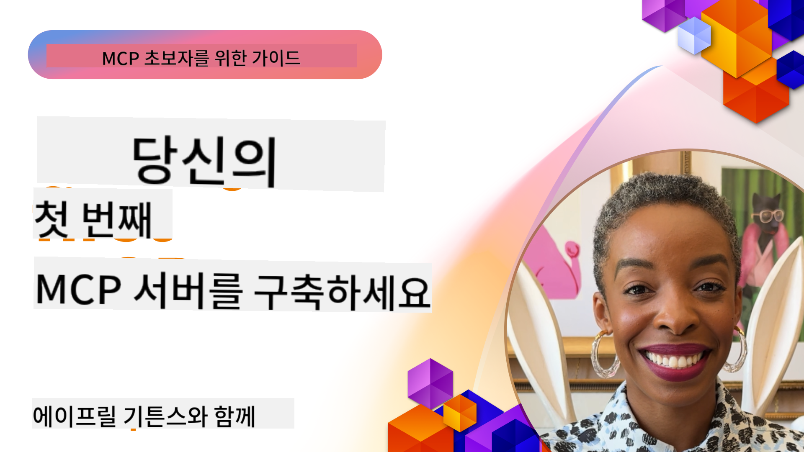

<!--
CO_OP_TRANSLATOR_METADATA:
{
  "original_hash": "1197b6dbde36773e04a5ae826557fdb9",
  "translation_date": "2025-08-26T17:24:15+00:00",
  "source_file": "03-GettingStarted/README.md",
  "language_code": "ko"
}
-->
## 시작하기  

_(위 이미지를 클릭하면 이 강의의 영상을 볼 수 있습니다)_

이 섹션은 여러 강의로 구성되어 있습니다:

- **1 첫 번째 서버**: 첫 번째 강의에서는 첫 서버를 생성하고 검사 도구를 사용해 서버를 테스트하고 디버그하는 방법을 배웁니다. [강의로 이동](01-first-server/README.md)

- **2 클라이언트**: 이 강의에서는 서버에 연결할 수 있는 클라이언트를 작성하는 방법을 배웁니다. [강의로 이동](02-client/README.md)

- **3 LLM을 활용한 클라이언트**: 클라이언트를 작성하는 더 나은 방법은 LLM을 추가하여 서버와 "협상"할 수 있도록 만드는 것입니다. [강의로 이동](03-llm-client/README.md)

- **4 Visual Studio Code에서 GitHub Copilot Agent 모드로 서버 실행**: 여기서는 Visual Studio Code에서 MCP 서버를 실행하는 방법을 살펴봅니다. [강의로 이동](04-vscode/README.md)

- **5 stdio Transport Server**: 현재 사양에서 MCP 서버와 클라이언트 간의 통신을 위한 권장 표준인 stdio transport를 사용하여 안전한 하위 프로세스 기반 통신을 제공합니다. [강의로 이동](05-stdio-server/README.md)

- **6 MCP를 활용한 HTTP 스트리밍 (Streamable HTTP)**: 현대적인 HTTP 스트리밍, 진행 알림, 그리고 Streamable HTTP를 사용하여 확장 가능하고 실시간 MCP 서버와 클라이언트를 구현하는 방법을 배웁니다. [강의로 이동](06-http-streaming/README.md)

- **7 VSCode용 AI Toolkit 활용**: MCP 클라이언트와 서버를 소비하고 테스트하는 방법을 배웁니다. [강의로 이동](07-aitk/README.md)

- **8 테스트**: 이 강의에서는 서버와 클라이언트를 다양한 방식으로 테스트하는 방법에 중점을 둡니다. [강의로 이동](08-testing/README.md)

- **9 배포**: 이 장에서는 MCP 솔루션을 배포하는 다양한 방법을 살펴봅니다. [강의로 이동](09-deployment/README.md)

Model Context Protocol (MCP)은 애플리케이션이 LLM에 컨텍스트를 제공하는 방식을 표준화하는 오픈 프로토콜입니다. MCP를 AI 애플리케이션의 USB-C 포트로 생각해보세요. 이는 AI 모델을 다양한 데이터 소스와 도구에 연결하는 표준화된 방법을 제공합니다.

## 학습 목표

이 강의를 마치면 다음을 할 수 있습니다:

- C#, Java, Python, TypeScript, JavaScript에서 MCP 개발 환경 설정
- 사용자 정의 기능(리소스, 프롬프트, 도구)을 포함한 기본 MCP 서버 구축 및 배포
- MCP 서버에 연결하는 호스트 애플리케이션 생성
- MCP 구현 테스트 및 디버그
- 일반적인 설정 문제와 해결 방법 이해
- MCP 구현을 인기 있는 LLM 서비스에 연결

## MCP 환경 설정

MCP 작업을 시작하기 전에 개발 환경을 준비하고 기본 워크플로를 이해하는 것이 중요합니다. 이 섹션에서는 MCP를 원활하게 시작할 수 있도록 초기 설정 단계를 안내합니다.

### 사전 준비 사항

MCP 개발에 들어가기 전에 다음을 준비하세요:

- **개발 환경**: 선택한 언어(C#, Java, Python, TypeScript, JavaScript)에 맞는 환경
- **IDE/편집기**: Visual Studio, Visual Studio Code, IntelliJ, Eclipse, PyCharm 또는 최신 코드 편집기
- **패키지 관리자**: NuGet, Maven/Gradle, pip, npm/yarn
- **API 키**: 호스트 애플리케이션에서 사용할 AI 서비스용

### 공식 SDK

다음 장에서는 Python, TypeScript, Java, .NET을 사용하여 솔루션을 구축하는 방법을 볼 수 있습니다. 아래는 공식적으로 지원되는 SDK 목록입니다.

MCP는 여러 언어에 대한 공식 SDK를 제공합니다:
- [C# SDK](https://github.com/modelcontextprotocol/csharp-sdk) - Microsoft와 협력하여 유지 관리
- [Java SDK](https://github.com/modelcontextprotocol/java-sdk) - Spring AI와 협력하여 유지 관리
- [TypeScript SDK](https://github.com/modelcontextprotocol/typescript-sdk) - 공식 TypeScript 구현
- [Python SDK](https://github.com/modelcontextprotocol/python-sdk) - 공식 Python 구현
- [Kotlin SDK](https://github.com/modelcontextprotocol/kotlin-sdk) - 공식 Kotlin 구현
- [Swift SDK](https://github.com/modelcontextprotocol/swift-sdk) - Loopwork AI와 협력하여 유지 관리
- [Rust SDK](https://github.com/modelcontextprotocol/rust-sdk) - 공식 Rust 구현

## 주요 요점

- MCP 개발 환경 설정은 언어별 SDK를 사용하면 간단합니다.
- MCP 서버 구축은 명확한 스키마로 도구를 생성하고 등록하는 과정을 포함합니다.
- MCP 클라이언트는 서버와 모델에 연결하여 확장된 기능을 활용합니다.
- 신뢰할 수 있는 MCP 구현을 위해 테스트와 디버그는 필수입니다.
- 배포 옵션은 로컬 개발부터 클라우드 기반 솔루션까지 다양합니다.

## 연습하기

이 섹션의 모든 장에서 볼 수 있는 연습 문제를 보완하는 샘플 세트가 준비되어 있습니다. 각 장에는 자체 연습 문제와 과제가 포함되어 있습니다.

- [Java 계산기](./samples/java/calculator/README.md)
- [.Net 계산기](../../../03-GettingStarted/samples/csharp)
- [JavaScript 계산기](./samples/javascript/README.md)
- [TypeScript 계산기](./samples/typescript/README.md)
- [Python 계산기](../../../03-GettingStarted/samples/python)

## 추가 자료

- [Azure에서 Model Context Protocol을 사용하여 에이전트 구축하기](https://learn.microsoft.com/azure/developer/ai/intro-agents-mcp)
- [Azure Container Apps를 활용한 원격 MCP (Node.js/TypeScript/JavaScript)](https://learn.microsoft.com/samples/azure-samples/mcp-container-ts/mcp-container-ts/)
- [.NET OpenAI MCP 에이전트](https://learn.microsoft.com/samples/azure-samples/openai-mcp-agent-dotnet/openai-mcp-agent-dotnet/)

## 다음 단계

다음: [첫 MCP 서버 생성하기](01-first-server/README.md)

---

**면책 조항**:  
이 문서는 AI 번역 서비스 [Co-op Translator](https://github.com/Azure/co-op-translator)를 사용하여 번역되었습니다. 정확성을 위해 최선을 다하고 있지만, 자동 번역에는 오류나 부정확성이 포함될 수 있습니다. 원본 문서의 원어 버전을 권위 있는 출처로 간주해야 합니다. 중요한 정보의 경우, 전문적인 인간 번역을 권장합니다. 이 번역 사용으로 인해 발생하는 오해나 잘못된 해석에 대해 책임을 지지 않습니다.