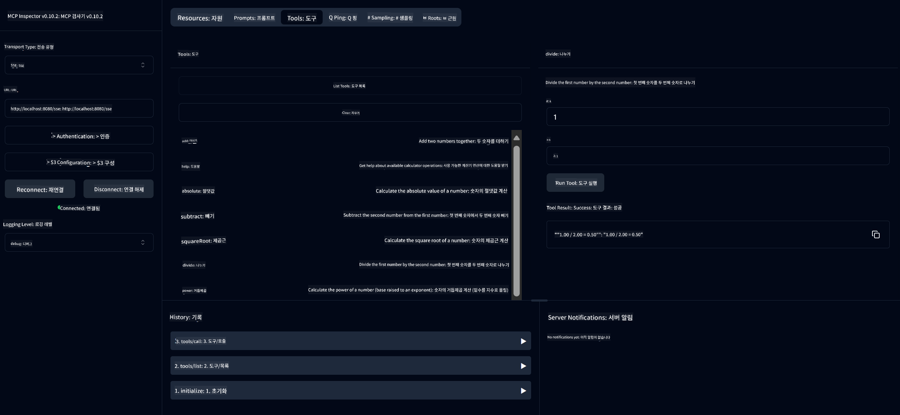

<!--
CO_OP_TRANSLATOR_METADATA:
{
  "original_hash": "13231e9951b68efd9df8c56bd5cdb27e",
  "translation_date": "2025-07-13T22:23:34+00:00",
  "source_file": "03-GettingStarted/samples/java/calculator/README.md",
  "language_code": "ko"
}
-->
# Basic Calculator MCP Service

이 서비스는 Spring Boot와 WebFlux 전송을 사용하여 Model Context Protocol(MCP)을 통해 기본 계산기 연산을 제공합니다. MCP 구현을 배우는 초보자를 위한 간단한 예제로 설계되었습니다.

자세한 내용은 [MCP Server Boot Starter](https://docs.spring.io/spring-ai/reference/api/mcp/mcp-server-boot-starter-docs.html) 참조 문서를 확인하세요.

## 개요

이 서비스는 다음을 보여줍니다:
- SSE(Server-Sent Events) 지원
- Spring AI의 `@Tool` 애노테이션을 통한 자동 도구 등록
- 기본 계산기 기능:
  - 덧셈, 뺄셈, 곱셈, 나눗셈
  - 거듭제곱 계산과 제곱근
  - 나머지 연산과 절댓값
  - 연산 설명을 위한 도움말 기능

## 기능

이 계산기 서비스는 다음과 같은 기능을 제공합니다:

1. **기본 산술 연산**:
   - 두 수의 덧셈
   - 한 수에서 다른 수를 뺌
   - 두 수의 곱셈
   - 한 수를 다른 수로 나눔 (0으로 나누기 검사 포함)

2. **고급 연산**:
   - 거듭제곱 계산 (밑을 지수만큼 올림)
   - 제곱근 계산 (음수 검사 포함)
   - 나머지(모듈로) 계산
   - 절댓값 계산

3. **도움말 시스템**:
   - 사용 가능한 모든 연산을 설명하는 내장 도움말 기능

## 서비스 사용법

이 서비스는 MCP 프로토콜을 통해 다음 API 엔드포인트를 제공합니다:

- `add(a, b)`: 두 수를 더함
- `subtract(a, b)`: 두 번째 수를 첫 번째 수에서 뺌
- `multiply(a, b)`: 두 수를 곱함
- `divide(a, b)`: 첫 번째 수를 두 번째 수로 나눔 (0 검사 포함)
- `power(base, exponent)`: 거듭제곱 계산
- `squareRoot(number)`: 제곱근 계산 (음수 검사 포함)
- `modulus(a, b)`: 나눗셈 후 나머지 계산
- `absolute(number)`: 절댓값 계산
- `help()`: 사용 가능한 연산에 대한 정보 제공

## 테스트 클라이언트

`com.microsoft.mcp.sample.client` 패키지에 간단한 테스트 클라이언트가 포함되어 있습니다. `SampleCalculatorClient` 클래스는 계산기 서비스의 사용 가능한 연산을 시연합니다.

## LangChain4j 클라이언트 사용법

프로젝트에는 `com.microsoft.mcp.sample.client.LangChain4jClient`에 LangChain4j 예제 클라이언트가 포함되어 있어 계산기 서비스를 LangChain4j 및 GitHub 모델과 통합하는 방법을 보여줍니다.

### 사전 준비 사항

1. **GitHub 토큰 설정**:
   
   GitHub의 AI 모델(phi-4 등)을 사용하려면 GitHub 개인 액세스 토큰이 필요합니다:

   a. GitHub 계정 설정으로 이동: https://github.com/settings/tokens
   
   b. "Generate new token" → "Generate new token (classic)" 클릭
   
   c. 토큰에 설명 이름 지정
   
   d. 다음 권한 선택:
      - `repo` (비공개 저장소 전체 제어)
      - `read:org` (조직 및 팀 멤버십, 조직 프로젝트 읽기)
      - `gist` (Gist 생성)
      - `user:email` (사용자 이메일 주소 접근(읽기 전용))
   
   e. "Generate token" 클릭 후 새 토큰 복사
   
   f. 환경 변수로 설정:
      
      Windows에서:
      ```
      set GITHUB_TOKEN=your-github-token
      ```
      
      macOS/Linux에서:
      ```bash
      export GITHUB_TOKEN=your-github-token
      ```

   g. 지속적인 설정을 위해 시스템 환경 변수에 추가

2. LangChain4j GitHub 의존성을 프로젝트에 추가 (pom.xml에 이미 포함됨):
   ```xml
   <dependency>
       <groupId>dev.langchain4j</groupId>
       <artifactId>langchain4j-github</artifactId>
       <version>${langchain4j.version}</version>
   </dependency>
   ```

3. 계산기 서버가 `localhost:8080`에서 실행 중인지 확인

### LangChain4j 클라이언트 실행

이 예제는 다음을 보여줍니다:
- SSE 전송을 통해 계산기 MCP 서버에 연결
- LangChain4j를 사용해 계산기 연산을 활용하는 챗봇 생성
- GitHub AI 모델(phi-4 모델 사용)과 통합

클라이언트는 다음 샘플 쿼리를 보내 기능을 시연합니다:
1. 두 수의 합 계산
2. 수의 제곱근 계산
3. 사용 가능한 계산기 연산에 대한 도움말 정보 요청

예제를 실행하고 콘솔 출력을 확인하여 AI 모델이 계산기 도구를 어떻게 활용하는지 확인하세요.

### GitHub 모델 구성

LangChain4j 클라이언트는 다음 설정으로 GitHub의 phi-4 모델을 사용하도록 구성되어 있습니다:

```java
ChatLanguageModel model = GitHubChatModel.builder()
    .apiKey(System.getenv("GITHUB_TOKEN"))
    .timeout(Duration.ofSeconds(60))
    .modelName("phi-4")
    .logRequests(true)
    .logResponses(true)
    .build();
```

다른 GitHub 모델을 사용하려면 `modelName` 매개변수를 지원되는 다른 모델 이름(예: "claude-3-haiku-20240307", "llama-3-70b-8192" 등)으로 변경하면 됩니다.

## 의존성

프로젝트에 필요한 주요 의존성은 다음과 같습니다:

```xml
<!-- For MCP Server -->
<dependency>
    <groupId>org.springframework.ai</groupId>
    <artifactId>spring-ai-starter-mcp-server-webflux</artifactId>
</dependency>

<!-- For LangChain4j integration -->
<dependency>
    <groupId>dev.langchain4j</groupId>
    <artifactId>langchain4j-mcp</artifactId>
    <version>${langchain4j.version}</version>
</dependency>

<!-- For GitHub models support -->
<dependency>
    <groupId>dev.langchain4j</groupId>
    <artifactId>langchain4j-github</artifactId>
    <version>${langchain4j.version}</version>
</dependency>
```

## 프로젝트 빌드

Maven을 사용하여 프로젝트를 빌드하세요:
```bash
./mvnw clean install -DskipTests
```

## 서버 실행

### Java 사용

```bash
java -jar target/calculator-server-0.0.1-SNAPSHOT.jar
```

### MCP Inspector 사용

MCP Inspector는 MCP 서비스와 상호작용할 수 있는 유용한 도구입니다. 이 계산기 서비스와 함께 사용하려면:

1. **MCP Inspector 설치 및 실행** (새 터미널 창에서):
   ```bash
   npx @modelcontextprotocol/inspector
   ```

2. **웹 UI 접속**: 앱에서 표시하는 URL(보통 http://localhost:6274)을 클릭

3. **연결 설정**:
   - 전송 유형을 "SSE"로 설정
   - 실행 중인 서버의 SSE 엔드포인트 URL을 `http://localhost:8080/sse`로 설정
   - "Connect" 클릭

4. **도구 사용**:
   - "List Tools" 클릭하여 사용 가능한 계산기 연산 확인
   - 도구 선택 후 "Run Tool" 클릭하여 연산 실행



### Docker 사용

프로젝트에는 컨테이너 배포를 위한 Dockerfile이 포함되어 있습니다:

1. **Docker 이미지 빌드**:
   ```bash
   docker build -t calculator-mcp-service .
   ```

2. **Docker 컨테이너 실행**:
   ```bash
   docker run -p 8080:8080 calculator-mcp-service
   ```

이 작업은:
- Maven 3.9.9와 Eclipse Temurin 24 JDK를 사용하는 다단계 Docker 이미지 빌드
- 최적화된 컨테이너 이미지 생성
- 포트 8080 노출
- 컨테이너 내에서 MCP 계산기 서비스 시작

컨테이너가 실행되면 `http://localhost:8080`에서 서비스에 접속할 수 있습니다.

## 문제 해결

### GitHub 토큰 관련 일반 문제

1. **토큰 권한 문제**: 403 Forbidden 오류가 발생하면, 사전 준비 사항에 명시된 권한이 올바르게 설정되었는지 확인하세요.

2. **토큰 미설정**: "No API key found" 오류가 발생하면 GITHUB_TOKEN 환경 변수가 제대로 설정되었는지 확인하세요.

3. **요청 제한 초과**: GitHub API는 요청 제한이 있습니다. 429 상태 코드 오류가 발생하면 잠시 기다렸다가 다시 시도하세요.

4. **토큰 만료**: GitHub 토큰은 만료될 수 있습니다. 인증 오류가 발생하면 새 토큰을 생성하고 환경 변수를 업데이트하세요.

추가 도움이 필요하면 [LangChain4j 문서](https://github.com/langchain4j/langchain4j) 또는 [GitHub API 문서](https://docs.github.com/en/rest)를 참고하세요.

**면책 조항**:  
이 문서는 AI 번역 서비스 [Co-op Translator](https://github.com/Azure/co-op-translator)를 사용하여 번역되었습니다. 정확성을 위해 최선을 다하고 있으나, 자동 번역에는 오류나 부정확한 부분이 있을 수 있음을 유의해 주시기 바랍니다. 원문은 해당 언어의 원본 문서가 권위 있는 출처로 간주되어야 합니다. 중요한 정보의 경우 전문적인 인간 번역을 권장합니다. 본 번역 사용으로 인해 발생하는 오해나 잘못된 해석에 대해 당사는 책임을 지지 않습니다.