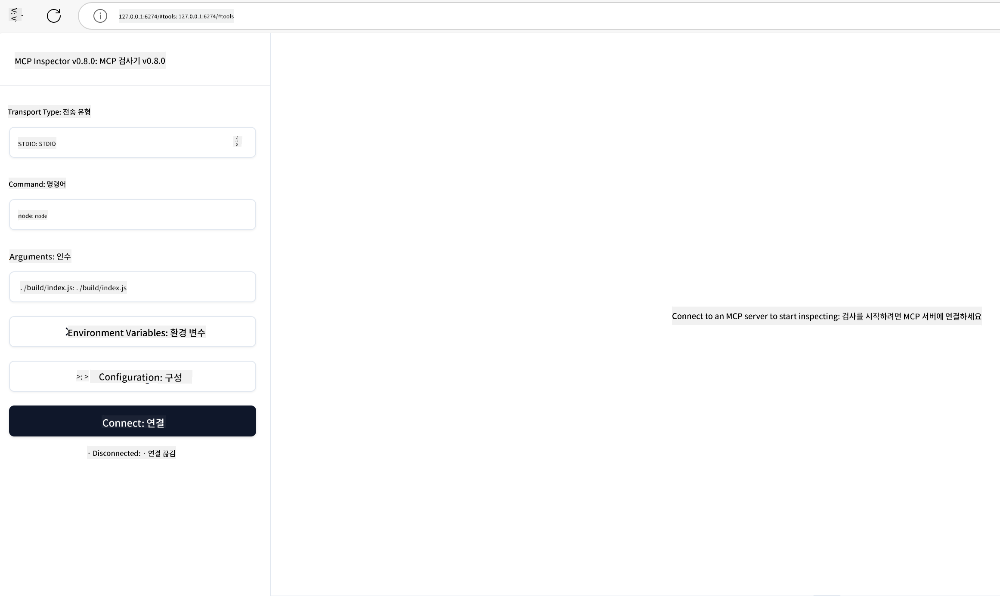

<!--
CO_OP_TRANSLATOR_METADATA:
{
  "original_hash": "83efa75a69bc831277263a6f1ae53669",
  "translation_date": "2025-08-11T10:35:35+00:00",
  "source_file": "04-PracticalImplementation/README.md",
  "language_code": "ko"
}
-->
# 실전 구현

[](https://youtu.be/vCN9-mKBDfQ)

_(위 이미지를 클릭하면 이 강의의 영상을 볼 수 있습니다)_

실전 구현은 Model Context Protocol(MCP)의 강력함을 실제로 체감할 수 있는 단계입니다. MCP의 이론과 아키텍처를 이해하는 것도 중요하지만, 이러한 개념을 실제 문제를 해결하는 솔루션으로 구축, 테스트, 배포할 때 진정한 가치가 드러납니다. 이 장에서는 개념적 지식과 실질적인 개발 간의 간극을 메우며, MCP 기반 애플리케이션을 실현하는 과정을 안내합니다.

지능형 비서를 개발하거나, AI를 비즈니스 워크플로에 통합하거나, 데이터 처리를 위한 맞춤형 도구를 구축하든 MCP는 유연한 기반을 제공합니다. 언어에 구애받지 않는 설계와 인기 있는 프로그래밍 언어를 위한 공식 SDK 덕분에 다양한 개발자가 쉽게 접근할 수 있습니다. 이러한 SDK를 활용하면 다양한 플랫폼과 환경에서 솔루션을 빠르게 프로토타입화하고, 반복하며, 확장할 수 있습니다.

다음 섹션에서는 C#, Spring 기반 Java, TypeScript, JavaScript, Python에서 MCP를 구현하는 실전 예제, 샘플 코드, 배포 전략을 다룹니다. 또한 MCP 서버를 디버깅하고 테스트하는 방법, API를 관리하는 방법, Azure를 사용해 클라우드에 솔루션을 배포하는 방법도 배울 수 있습니다. 이러한 실습 자료는 학습 속도를 높이고, 견고하고 실전 준비가 된 MCP 애플리케이션을 자신 있게 구축할 수 있도록 돕기 위해 설계되었습니다.

## 개요

이 강의는 여러 프로그래밍 언어에서 MCP를 구현하는 실질적인 측면에 초점을 맞춥니다. C#, Spring 기반 Java, TypeScript, JavaScript, Python에서 MCP SDK를 사용하는 방법, MCP 서버를 디버깅하고 테스트하는 방법, 재사용 가능한 리소스, 프롬프트, 도구를 만드는 방법을 탐구합니다.

## 학습 목표

이 강의를 마치면 다음을 할 수 있습니다:

- 다양한 프로그래밍 언어에서 공식 SDK를 사용해 MCP 솔루션 구현
- MCP 서버를 체계적으로 디버깅하고 테스트
- 서버 기능(리소스, 프롬프트, 도구) 생성 및 활용
- 복잡한 작업을 위한 효과적인 MCP 워크플로 설계
- 성능과 신뢰성을 최적화한 MCP 구현

## 공식 SDK 리소스

Model Context Protocol은 여러 언어를 위한 공식 SDK를 제공합니다:

- [C# SDK](https://github.com/modelcontextprotocol/csharp-sdk)
- [Spring 기반 Java SDK](https://github.com/modelcontextprotocol/java-sdk) **참고:** [Project Reactor](https://projectreactor.io)에 대한 의존성이 필요합니다. ([토론 이슈 246](https://github.com/orgs/modelcontextprotocol/discussions/246) 참조)
- [TypeScript SDK](https://github.com/modelcontextprotocol/typescript-sdk)
- [Python SDK](https://github.com/modelcontextprotocol/python-sdk)
- [Kotlin SDK](https://github.com/modelcontextprotocol/kotlin-sdk)

## MCP SDK 활용

이 섹션에서는 여러 프로그래밍 언어에서 MCP를 구현하는 실전 예제를 제공합니다. `samples` 디렉터리에서 언어별로 정리된 샘플 코드를 확인할 수 있습니다.

### 제공되는 샘플

저장소에는 다음 언어로 된 [샘플 구현](../../../04-PracticalImplementation/samples)이 포함되어 있습니다:

- [C#](./samples/csharp/README.md)
- [Spring 기반 Java](./samples/java/containerapp/README.md)
- [TypeScript](./samples/typescript/README.md)
- [JavaScript](./samples/javascript/README.md)
- [Python](./samples/python/README.md)

각 샘플은 해당 언어와 생태계에 맞는 주요 MCP 개념과 구현 패턴을 보여줍니다.

## 핵심 서버 기능

MCP 서버는 다음 기능 중 하나 이상을 구현할 수 있습니다:

### 리소스

리소스는 사용자나 AI 모델이 사용할 수 있는 컨텍스트와 데이터를 제공합니다:

- 문서 저장소
- 지식 베이스
- 구조화된 데이터 소스
- 파일 시스템

### 프롬프트

프롬프트는 사용자에게 템플릿화된 메시지와 워크플로를 제공합니다:

- 사전 정의된 대화 템플릿
- 안내형 상호작용 패턴
- 특화된 대화 구조

### 도구

도구는 AI 모델이 실행할 수 있는 기능입니다:

- 데이터 처리 유틸리티
- 외부 API 통합
- 계산 기능
- 검색 기능

## 샘플 구현: C# 구현

공식 C# SDK 저장소에는 MCP의 다양한 측면을 보여주는 여러 샘플 구현이 포함되어 있습니다:

- **기본 MCP 클라이언트**: MCP 클라이언트를 생성하고 도구를 호출하는 간단한 예제
- **기본 MCP 서버**: 기본 도구 등록이 포함된 최소 서버 구현
- **고급 MCP 서버**: 도구 등록, 인증, 오류 처리가 포함된 완전한 서버
- **ASP.NET 통합**: ASP.NET Core와의 통합을 보여주는 예제
- **도구 구현 패턴**: 다양한 복잡성 수준의 도구 구현 패턴

C# MCP SDK는 미리보기 상태이며 API가 변경될 수 있습니다. SDK가 발전함에 따라 이 블로그도 지속적으로 업데이트될 예정입니다.

### 주요 기능

- [C# MCP Nuget ModelContextProtocol](https://www.nuget.org/packages/ModelContextProtocol)
- [첫 MCP 서버 구축](https://devblogs.microsoft.com/dotnet/build-a-model-context-protocol-mcp-server-in-csharp/)

완전한 C# 구현 샘플은 [공식 C# SDK 샘플 저장소](https://github.com/modelcontextprotocol/csharp-sdk)에서 확인할 수 있습니다.

## 샘플 구현: Spring 기반 Java 구현

Spring 기반 Java SDK는 엔터프라이즈급 기능을 갖춘 강력한 MCP 구현 옵션을 제공합니다.

### 주요 기능

- Spring Framework 통합
- 강력한 타입 안정성
- 리액티브 프로그래밍 지원
- 포괄적인 오류 처리

완전한 Spring 기반 Java 구현 샘플은 샘플 디렉터리의 [Java with Spring 샘플](samples/java/containerapp/README.md)을 참조하세요.

## 샘플 구현: JavaScript 구현

JavaScript SDK는 가볍고 유연한 MCP 구현 접근 방식을 제공합니다.

### 주요 기능

- Node.js 및 브라우저 지원
- Promise 기반 API
- Express 및 기타 프레임워크와의 쉬운 통합
- 스트리밍을 위한 WebSocket 지원

완전한 JavaScript 구현 샘플은 샘플 디렉터리의 [JavaScript 샘플](samples/javascript/README.md)을 참조하세요.

## 샘플 구현: Python 구현

Python SDK는 뛰어난 머신러닝 프레임워크 통합을 제공하는 Pythonic한 MCP 구현 방식을 제공합니다.

### 주요 기능

- asyncio를 활용한 Async/await 지원
- FastAPI 통합
- 간단한 도구 등록
- 인기 있는 머신러닝 라이브러리와의 네이티브 통합

완전한 Python 구현 샘플은 샘플 디렉터리의 [Python 샘플](samples/python/README.md)을 참조하세요.

## API 관리

Azure API Management는 MCP 서버를 보호하는 데 적합한 솔루션입니다. Azure API Management 인스턴스를 MCP 서버 앞에 배치하여 다음과 같은 기능을 처리할 수 있습니다:

- 속도 제한
- 토큰 관리
- 모니터링
- 부하 분산
- 보안

### Azure 샘플

다음은 Azure API Management를 사용해 MCP 서버를 보호하는 샘플입니다: [Azure API Management와 함께 MCP 서버 생성](https://github.com/Azure-Samples/remote-mcp-apim-functions-python).

아래 이미지는 인증 흐름을 보여줍니다:


위 이미지에서 다음이 이루어집니다:

- Microsoft Entra를 사용한 인증/인가
- Azure API Management가 게이트웨이 역할을 하며 트래픽을 관리
- Azure Monitor가 모든 요청을 기록하여 추가 분석 가능

#### 인증 흐름

인증 흐름을 자세히 살펴보겠습니다:


#### MCP 인증 사양

[MCP 인증 사양](https://modelcontextprotocol.io/specification/2025-03-26/basic/authorization#2-10-third-party-authorization-flow)에 대해 자세히 알아보세요.

## Azure에 원격 MCP 서버 배포

다음 단계를 통해 앞서 언급한 샘플을 배포해 봅시다:

1. 저장소 복제

    ```bash
    git clone https://github.com/Azure-Samples/remote-mcp-apim-functions-python.git
    cd remote-mcp-apim-functions-python
    ```

1. `Microsoft.App` 리소스 공급자를 등록합니다.

   - Azure CLI를 사용하는 경우 `az provider register --namespace Microsoft.App --wait`를 실행하세요.
   - Azure PowerShell을 사용하는 경우 `Register-AzResourceProvider -ProviderNamespace Microsoft.App`를 실행하세요. 그런 다음 `(Get-AzResourceProvider -ProviderNamespace Microsoft.App).RegistrationState`를 실행해 등록이 완료되었는지 확인하세요.

1. [azd](https://aka.ms/azd) 명령을 실행하여 API 관리 서비스, 함수 앱(코드 포함), 기타 필요한 Azure 리소스를 프로비저닝합니다.

    ```shell
    azd up
    ```

    이 명령은 모든 클라우드 리소스를 Azure에 배포합니다.

### MCP Inspector로 서버 테스트

1. **새 터미널 창**에서 MCP Inspector를 설치하고 실행합니다.

    ```shell
    npx @modelcontextprotocol/inspector
    ```

    다음과 유사한 인터페이스가 표시됩니다:

    

1. 표시된 URL(예: [http://127.0.0.1:6274/#resources](http://127.0.0.1:6274/#resources))에서 MCP Inspector 웹 앱을 로드합니다.
1. 전송 유형을 `SSE`로 설정합니다.
1. `azd up` 실행 후 표시된 API Management SSE 엔드포인트 URL을 설정하고 **연결**합니다:

    ```shell
    https://<apim-servicename-from-azd-output>.azure-api.net/mcp/sse
    ```

1. **도구 목록**을 확인하고 도구를 선택한 후 **도구 실행**을 클릭합니다.

모든 단계가 성공적으로 완료되었다면 MCP 서버에 연결되었으며 도구를 호출할 수 있습니다.

## Azure용 MCP 서버

[Remote-mcp-functions](https://github.com/Azure-Samples/remote-mcp-functions-dotnet): 이 저장소 세트는 Python, C# .NET, Node/TypeScript를 사용해 Azure Functions로 사용자 지정 원격 MCP 서버를 구축하고 배포하기 위한 빠른 시작 템플릿입니다.

샘플은 다음을 포함한 완전한 솔루션을 제공합니다:

- 로컬에서 빌드 및 실행: 로컬 머신에서 MCP 서버를 개발하고 디버깅
- Azure에 배포: 간단한 `azd up` 명령으로 클라우드에 쉽게 배포
- 클라이언트에서 연결: VS Code의 Copilot 에이전트 모드 및 MCP Inspector 도구를 포함한 다양한 클라이언트에서 MCP 서버에 연결

### 주요 기능

- 설계 단계에서 보안: 키와 HTTPS를 사용해 MCP 서버 보호
- 인증 옵션: 내장 인증 및/또는 API 관리 사용을 통한 OAuth 지원
- 네트워크 격리: Azure Virtual Networks(VNET)를 사용한 네트워크 격리 지원
- 서버리스 아키텍처: 확장 가능하고 이벤트 기반 실행을 위한 Azure Functions 활용
- 로컬 개발: 포괄적인 로컬 개발 및 디버깅 지원
- 간단한 배포: Azure로의 간소화된 배포 프로세스

저장소에는 프로덕션 준비가 된 MCP 서버 구현을 빠르게 시작하는 데 필요한 모든 구성 파일, 소스 코드, 인프라 정의가 포함되어 있습니다.

- [Azure Remote MCP Functions Python](https://github.com/Azure-Samples/remote-mcp-functions-python) - Python을 사용한 Azure Functions 기반 MCP 구현 샘플
- [Azure Remote MCP Functions .NET](https://github.com/Azure-Samples/remote-mcp-functions-dotnet) - C# .NET을 사용한 Azure Functions 기반 MCP 구현 샘플
- [Azure Remote MCP Functions Node/Typescript](https://github.com/Azure-Samples/remote-mcp-functions-typescript) - Node/TypeScript를 사용한 Azure Functions 기반 MCP 구현 샘플

## 주요 요점

- MCP SDK는 강력한 MCP 솔루션을 구현하기 위한 언어별 도구를 제공합니다.
- 디버깅 및 테스트 과정은 신뢰할 수 있는 MCP 애플리케이션을 위해 필수적입니다.
- 재사용 가능한 프롬프트 템플릿은 일관된 AI 상호작용을 가능하게 합니다.
- 잘 설계된 워크플로는 여러 도구를 사용해 복잡한 작업을 조율할 수 있습니다.
- MCP 솔루션 구현 시 보안, 성능, 오류 처리를 고려해야 합니다.

## 연습 문제

자신의 도메인에서 실제 문제를 해결할 수 있는 실질적인 MCP 워크플로를 설계하세요:

1. 이 문제를 해결하는 데 유용할 3~4개의 도구를 식별합니다.
2. 이러한 도구가 상호작용하는 워크플로 다이어그램을 작성합니다.
3. 선호하는 언어를 사용해 도구 중 하나의 기본 버전을 구현합니다.
4. 모델이 도구를 효과적으로 사용할 수 있도록 돕는 프롬프트 템플릿을 작성합니다.

## 추가 자료

---

다음: [고급 주제](../05-AdvancedTopics/README.md)

**면책 조항**:  
이 문서는 AI 번역 서비스 [Co-op Translator](https://github.com/Azure/co-op-translator)를 사용하여 번역되었습니다. 정확성을 위해 최선을 다하고 있지만, 자동 번역에는 오류나 부정확성이 포함될 수 있습니다. 원본 문서를 해당 언어로 작성된 상태에서 권위 있는 자료로 간주해야 합니다. 중요한 정보의 경우, 전문적인 인간 번역을 권장합니다. 이 번역 사용으로 인해 발생하는 오해나 잘못된 해석에 대해 당사는 책임을 지지 않습니다.