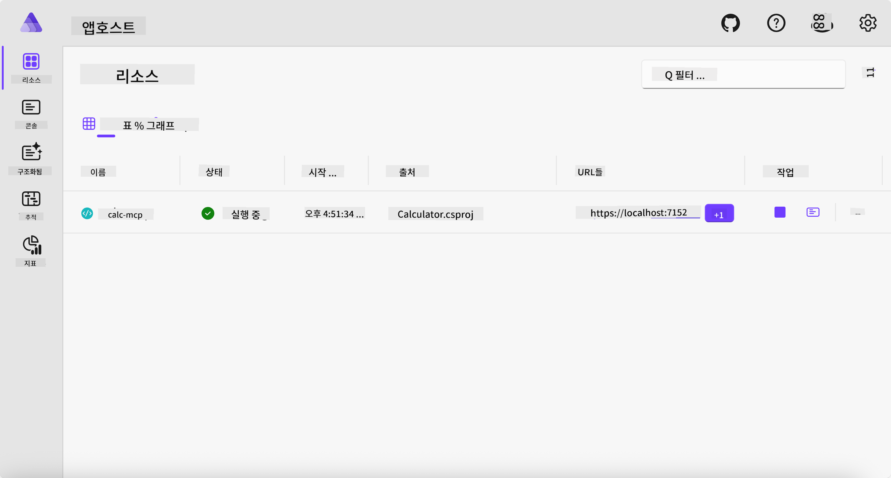
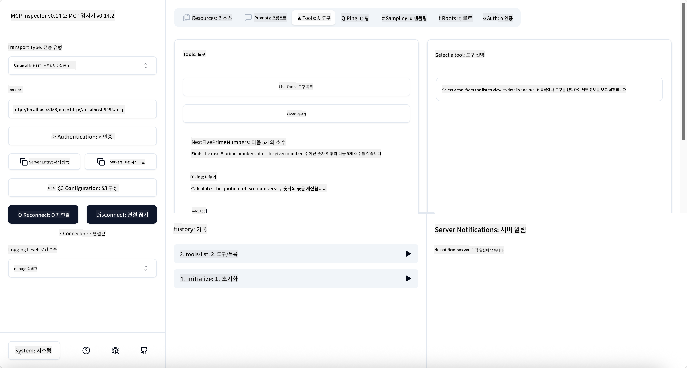

<!--
CO_OP_TRANSLATOR_METADATA:
{
  "original_hash": "0bc7bd48f55f1565f1d95ccb2c16f728",
  "translation_date": "2025-07-13T23:05:04+00:00",
  "source_file": "04-PracticalImplementation/samples/csharp/README.md",
  "language_code": "ko"
}
-->
# 샘플

이전 예제에서는 `stdio` 타입을 사용하는 로컬 .NET 프로젝트와 컨테이너에서 서버를 로컬로 실행하는 방법을 보여주었습니다. 이는 많은 상황에서 좋은 해결책입니다. 하지만 서버를 클라우드 환경처럼 원격에서 실행하는 것도 유용할 수 있습니다. 이럴 때 `http` 타입이 필요합니다.

`04-PracticalImplementation` 폴더의 솔루션을 보면 이전 예제보다 훨씬 복잡해 보일 수 있습니다. 하지만 실제로는 그렇지 않습니다. `src/Calculator` 프로젝트를 자세히 살펴보면 이전 예제와 거의 동일한 코드임을 알 수 있습니다. 유일한 차이점은 HTTP 요청을 처리하기 위해 다른 라이브러리인 `ModelContextProtocol.AspNetCore`를 사용한다는 점과, `IsPrime` 메서드를 private으로 변경하여 코드 내에 private 메서드를 가질 수 있음을 보여준다는 점입니다. 나머지 코드는 이전과 동일합니다.

다른 프로젝트들은 [.NET Aspire](https://learn.microsoft.com/dotnet/aspire/get-started/aspire-overview)에서 가져온 것입니다. 솔루션에 .NET Aspire를 포함하면 개발 및 테스트 과정에서 개발자 경험이 향상되고 관찰 가능성도 좋아집니다. 서버 실행에 필수는 아니지만 솔루션에 포함하는 것이 좋은 습관입니다.

## 서버를 로컬에서 시작하기

1. VS Code(C# DevKit 확장 기능 포함)에서 `04-PracticalImplementation/samples/csharp` 디렉터리로 이동합니다.
1. 다음 명령어를 실행하여 서버를 시작합니다:

   ```bash
    dotnet watch run --project ./src/AppHost
   ```

1. 웹 브라우저가 .NET Aspire 대시보드를 열면 `http` URL을 확인하세요. 보통 `http://localhost:5058/`와 비슷할 것입니다.

   

## MCP Inspector로 Streamable HTTP 테스트하기

Node.js 22.7.5 이상이 설치되어 있다면 MCP Inspector를 사용해 서버를 테스트할 수 있습니다.

서버를 시작한 후 터미널에서 다음 명령어를 실행하세요:

```bash
npx @modelcontextprotocol/inspector http://localhost:5058
```



- Transport 타입으로 `Streamable HTTP`를 선택합니다.
- Url 필드에 앞서 확인한 서버 URL을 입력하고 `/mcp`를 덧붙입니다. `http` (https 아님) 형식이어야 하며, 예를 들어 `http://localhost:5058/mcp`와 같습니다.
- Connect 버튼을 클릭합니다.

Inspector의 좋은 점은 현재 진행 중인 상황을 잘 보여준다는 것입니다.

- 사용 가능한 도구 목록을 불러와 보세요.
- 몇 가지 도구를 사용해 보세요. 이전과 동일하게 작동할 것입니다.

## VS Code에서 GitHub Copilot Chat으로 MCP 서버 테스트하기

GitHub Copilot Chat에서 Streamable HTTP 전송을 사용하려면, 이전에 만든 `calc-mcp` 서버 구성을 다음과 같이 변경하세요:

```jsonc
// .vscode/mcp.json
{
  "servers": {
    "calc-mcp": {
      "type": "http",
      "url": "http://localhost:5058/mcp"
    }
  }
}
```

몇 가지 테스트를 해보세요:

- "6780 이후의 소수 3개"를 요청해 보세요. Copilot이 새 도구 `NextFivePrimeNumbers`를 사용해 처음 3개의 소수만 반환하는 것을 확인할 수 있습니다.
- "111 이후의 소수 7개"를 요청해 보세요. 어떤 결과가 나오는지 확인해 보세요.
- "John이 사탕 24개를 가지고 있고 3명의 아이들에게 모두 나누어 주려고 합니다. 각 아이가 몇 개씩 받나요?"를 물어보세요. 어떤 결과가 나오는지 확인해 보세요.

## 서버를 Azure에 배포하기

더 많은 사용자가 서버를 이용할 수 있도록 Azure에 배포해 봅시다.

터미널에서 `04-PracticalImplementation/samples/csharp` 폴더로 이동한 후 다음 명령어를 실행하세요:

```bash
azd up
```

배포가 완료되면 다음과 같은 메시지를 볼 수 있습니다:


URL을 복사하여 MCP Inspector와 GitHub Copilot Chat에서 사용하세요.

```jsonc
// .vscode/mcp.json
{
  "servers": {
    "calc-mcp": {
      "type": "http",
      "url": "https://calc-mcp.gentleriver-3977fbcf.australiaeast.azurecontainerapps.io/mcp"
    }
  }
}
```

## 다음은?

우리는 다양한 전송 타입과 테스트 도구를 시도해 보았고, MCP 서버를 Azure에 배포했습니다. 그렇다면 서버가 사설 리소스에 접근해야 한다면 어떻게 할까요? 예를 들어 데이터베이스나 사설 API 같은 경우 말이죠. 다음 장에서는 서버의 보안을 어떻게 강화할 수 있는지 살펴보겠습니다.

**면책 조항**:  
이 문서는 AI 번역 서비스 [Co-op Translator](https://github.com/Azure/co-op-translator)를 사용하여 번역되었습니다. 정확성을 위해 노력하고 있으나, 자동 번역에는 오류나 부정확한 부분이 있을 수 있음을 유의해 주시기 바랍니다. 원문 문서가 권위 있는 출처로 간주되어야 합니다. 중요한 정보의 경우 전문적인 인간 번역을 권장합니다. 본 번역 사용으로 인해 발생하는 오해나 잘못된 해석에 대해 당사는 책임을 지지 않습니다.