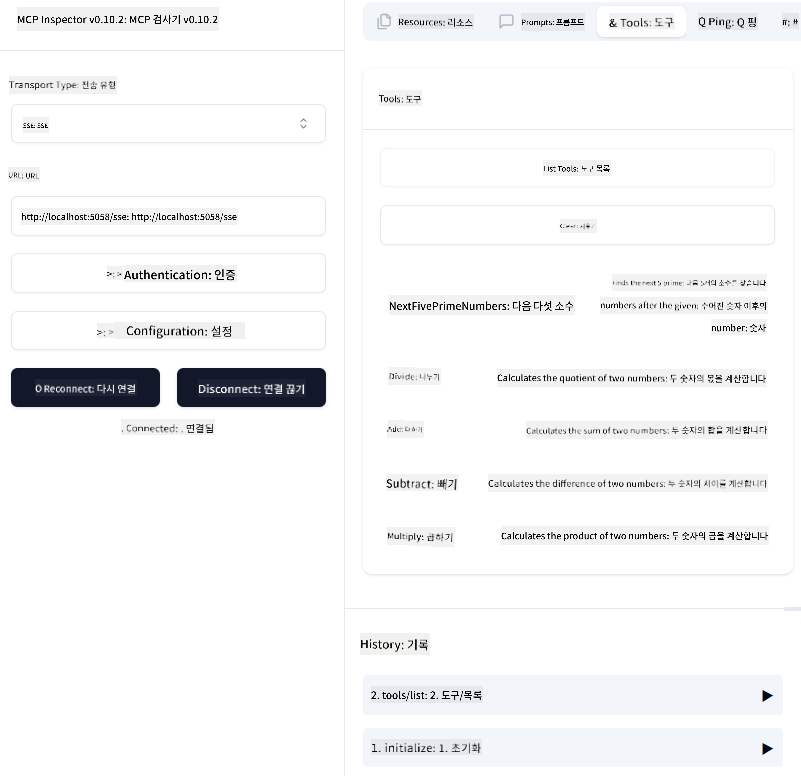
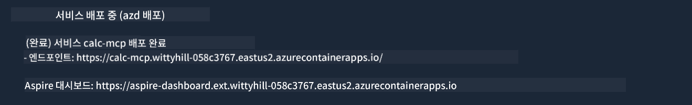

<!--
CO_OP_TRANSLATOR_METADATA:
{
  "original_hash": "5020a3e1a1c7f30c00f9e37f1fa208e3",
  "translation_date": "2025-05-16T15:41:10+00:00",
  "source_file": "04-PracticalImplementation/samples/csharp/README.md",
  "language_code": "ko"
}
-->
# Sample

이전 예제에서는 로컬 .NET 프로젝트를 `sdio` 타입과 함께 사용하는 방법과 컨테이너에서 서버를 로컬로 실행하는 방법을 보여줍니다. 많은 상황에서 좋은 해결책입니다. 하지만 클라우드 환경처럼 원격에서 서버를 실행하는 것도 유용할 수 있습니다. 이럴 때 `http` 타입이 필요합니다.

`04-PracticalImplementation` 폴더의 솔루션을 보면 이전 것보다 훨씬 복잡해 보일 수 있습니다. 하지만 실제로는 그렇지 않습니다. `src/mcpserver/mcpserver.csproj` 프로젝트를 자세히 보면 이전 예제와 거의 동일한 코드임을 알 수 있습니다. 유일한 차이점은 HTTP 요청을 처리하기 위해 다른 라이브러리 `ModelContextProtocol.AspNetCore`를 사용하고, `IsPrime` 메서드를 private으로 바꿔서 코드 내에 private 메서드도 사용할 수 있음을 보여준다는 점입니다. 나머지 코드는 이전과 같습니다.

다른 프로젝트들은 [.NET Aspire](https://learn.microsoft.com/dotnet/aspire/get-started/aspire-overview)에서 가져온 것입니다. 솔루션에 .NET Aspire를 포함하면 개발 및 테스트 경험이 향상되고 관찰 가능성도 좋아집니다. 서버 실행에 필수는 아니지만 솔루션에 포함하는 것이 좋은 관행입니다.

## 로컬에서 서버 시작하기

1. VS Code(C# DevKit 확장 기능 포함)에서 솔루션 `04-PracticalImplementation\samples\csharp\src\Calculator-chap4.sln`을 엽니다.
2. `F5`를 눌러 서버를 시작합니다. 그러면 .NET Aspire 대시보드가 포함된 웹 브라우저가 열릴 것입니다.

또는

1. 터미널에서 `04-PracticalImplementation\samples\csharp\src` 폴더로 이동합니다.
2. 다음 명령어를 실행하여 서버를 시작합니다:
   ```bash
    dotnet run --project .\AppHost
   ```

3. 대시보드에서 `http` URL을 확인합니다. `http://localhost:5058/`.

## Test `SSE` 형태로 ModelContext Protocol Inspector와 함께 표시됩니다.

Node.js 22.7.5 이상이 설치되어 있다면 ModelContext Protocol Inspector를 사용해 서버를 테스트할 수 있습니다.

서버를 시작한 후 터미널에서 다음 명령어를 실행하세요:

```bash
npx @modelcontextprotocol/inspector@latest
```



- `SSE` as the Transport type. SSE stand for Server-Sent Events. 
- In the Url field, enter the URL of the server noted earlier,and append `/sse`를 선택하세요. `http`이어야 하며, 이전에 생성한 `https`) something like `http://localhost:5058/sse`.
- select the Connect button.

A nice thing about the Inspector is that it provide a nice visibility on what is happening.

- Try listing the availables tools
- Try some of them, it should works just like before.


## Test `SSE` with Github Copilot Chat in VS Code

To use the `SSE` transport with Github Copilot Chat, change the configuration of the `mcp-calc` 서버와 비슷하게 보여야 합니다:

```json
"mcp-calc": {
    "type": "sse",
    "url": "http://localhost:5058/sse"
}
```

테스트를 해보세요:
- 6780 이후의 첫 3개의 소수를 요청해 보세요. Copilot이 새로운 도구 `NextFivePrimeNumbers`를 사용해 첫 3개의 소수만 반환하는 것을 확인할 수 있습니다.
- 111 이후의 첫 7개의 소수를 요청해 어떤 일이 일어나는지 확인해 보세요.


# 서버를 Azure에 배포하기

더 많은 사용자가 서버를 이용할 수 있도록 Azure에 서버를 배포해 봅시다.

터미널에서 `04-PracticalImplementation\samples\csharp\src` 폴더로 이동한 후 다음 명령어를 실행하세요:

```bash
azd init
```

이 명령어는 Azure 리소스 구성과 Infrastructure as Code(IaC)를 저장할 몇몇 파일을 로컬에 생성합니다.

그 다음, 서버를 Azure에 배포하기 위해 다음 명령어를 실행하세요:

```bash
azd up
```

배포가 완료되면 다음과 같은 메시지를 볼 수 있습니다:



Aspire 대시보드로 이동해 `HTTP` URL을 확인하고, MCP Inspector와 Github Copilot Chat에서 사용하세요.


## 다음은?

우리는 다양한 전송 타입과 테스트 도구를 시도해보고 MCP 서버를 Azure에 배포했습니다. 그렇다면 서버가 데이터베이스나 비공개 API 같은 프라이빗 리소스에 접근해야 한다면 어떻게 할까요? 다음 장에서는 서버 보안을 어떻게 강화할 수 있는지 살펴보겠습니다.

**면책 조항**:  
이 문서는 AI 번역 서비스 [Co-op Translator](https://github.com/Azure/co-op-translator)를 사용하여 번역되었습니다. 정확성을 위해 노력하고 있으나, 자동 번역에는 오류나 부정확한 부분이 있을 수 있음을 유의하시기 바랍니다. 원본 문서의 원어가 권위 있는 출처로 간주되어야 합니다. 중요한 정보의 경우, 전문 인간 번역을 권장합니다. 본 번역 사용으로 인한 오해나 잘못된 해석에 대해서는 당사가 책임지지 않습니다.