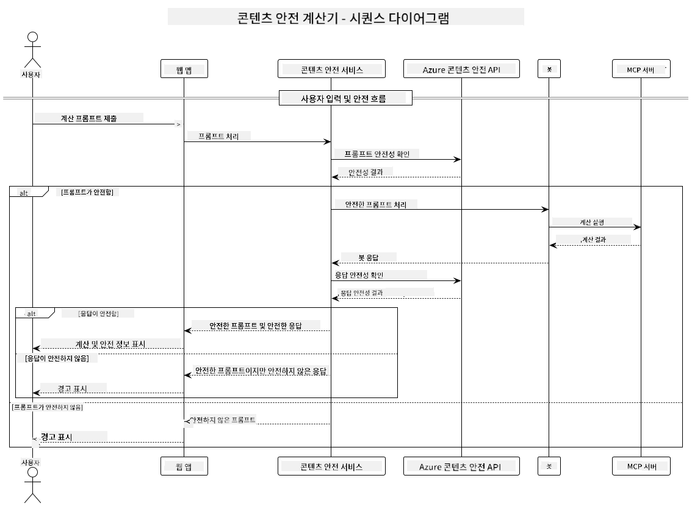

<!--
CO_OP_TRANSLATOR_METADATA:
{
  "original_hash": "e5ea5e7582f70008ea9bec3b3820f20a",
  "translation_date": "2025-05-16T15:38:51+00:00",
  "source_file": "04-PracticalImplementation/samples/java/containerapp/README.md",
  "language_code": "ko"
}
-->
## 시스템 아키텍처

이 프로젝트는 사용자 프롬프트를 Model Context Protocol (MCP)을 통해 계산기 서비스로 전달하기 전에 콘텐츠 안전성 검사를 수행하는 웹 애플리케이션을 보여줍니다.



### 작동 원리

1. **사용자 입력**: 사용자가 웹 인터페이스에 계산 프롬프트를 입력합니다.
2. **콘텐츠 안전성 검사 (입력)**: 프롬프트는 Azure Content Safety API로 분석됩니다.
3. **안전성 판단 (입력)**:
   - 모든 카테고리에서 심각도 < 2일 경우 안전한 콘텐츠로 간주되어 계산기로 진행합니다.
   - 잠재적으로 유해한 콘텐츠로 표시되면 프로세스가 중단되고 경고를 반환합니다.
4. **계산기 통합**: 안전한 콘텐츠는 LangChain4j에서 처리되며, MCP 계산기 서버와 통신합니다.
5. **콘텐츠 안전성 검사 (출력)**: 봇의 응답은 Azure Content Safety API로 분석됩니다.
6. **안전성 판단 (출력)**:
   - 봇 응답이 안전하면 사용자에게 표시됩니다.
   - 잠재적으로 유해한 응답으로 표시되면 경고 메시지로 대체됩니다.
7. **응답**: 안전한 경우 결과와 두 번의 안전성 분석 결과가 사용자에게 표시됩니다.

## Model Context Protocol (MCP)를 이용한 계산기 서비스 사용법

이 프로젝트는 LangChain4j에서 Model Context Protocol (MCP)을 사용해 계산기 MCP 서비스를 호출하는 방법을 보여줍니다. 구현은 포트 8080에서 실행되는 로컬 MCP 서버를 사용하여 계산 작업을 제공합니다.

### Azure Content Safety 서비스 설정

콘텐츠 안전성 기능을 사용하기 전에 Azure Content Safety 서비스 리소스를 생성해야 합니다:

1. [Azure Portal](https://portal.azure.com)에 로그인합니다.
2. "리소스 만들기"를 클릭하고 "Content Safety"를 검색합니다.
3. "Content Safety"를 선택한 후 "만들기"를 클릭합니다.
4. 리소스에 고유한 이름을 입력합니다.
5. 구독과 리소스 그룹을 선택하거나 새로 만듭니다.
6. 지원되는 지역을 선택합니다 ([지역 가용성](https://azure.microsoft.com/en-us/global-infrastructure/services/?products=cognitive-services)에서 확인).
7. 적절한 요금제를 선택합니다.
8. "만들기"를 클릭하여 리소스를 배포합니다.
9. 배포가 완료되면 "리소스로 이동"을 클릭합니다.
10. 왼쪽 메뉴에서 "리소스 관리" 아래의 "키 및 엔드포인트"를 선택합니다.
11. 키 중 하나와 엔드포인트 URL을 복사하여 다음 단계에서 사용합니다.

### 환경 변수 설정

GitHub 모델 인증을 위해 `GITHUB_TOKEN` 환경 변수를 설정합니다:
```sh
export GITHUB_TOKEN=<your_github_token>
```

콘텐츠 안전성 기능을 위해 다음을 설정합니다:
```sh
export CONTENT_SAFETY_ENDPOINT=<your_content_safety_endpoint>
export CONTENT_SAFETY_KEY=<your_content_safety_key>
```

이 환경 변수들은 애플리케이션이 Azure Content Safety 서비스와 인증하는 데 사용됩니다. 설정하지 않으면 데모 목적으로 플레이스홀더 값을 사용하지만 콘텐츠 안전성 기능은 제대로 작동하지 않습니다.

### 계산기 MCP 서버 시작

클라이언트를 실행하기 전에 localhost:8080에서 SSE 모드로 계산기 MCP 서버를 시작해야 합니다.

## 프로젝트 설명

이 프로젝트는 LangChain4j와 Model Context Protocol (MCP)을 통합하여 계산기 서비스를 호출하는 방법을 보여줍니다. 주요 특징은 다음과 같습니다:

- MCP를 사용해 기본 수학 연산을 위한 계산기 서비스에 연결
- 사용자 프롬프트와 봇 응답에 대한 이중 콘텐츠 안전성 검사
- LangChain4j를 통한 GitHub의 gpt-4.1-nano 모델 통합
- MCP 전송을 위한 Server-Sent Events (SSE) 사용

## 콘텐츠 안전성 통합

이 프로젝트는 사용자 입력과 시스템 응답 모두에서 유해한 콘텐츠가 없도록 포괄적인 콘텐츠 안전성 기능을 포함합니다:

1. **입력 검사**: 모든 사용자 프롬프트는 혐오 발언, 폭력, 자해, 성적 콘텐츠 등 유해 콘텐츠 카테고리로 분석됩니다.
2. **출력 검사**: 검열되지 않은 모델을 사용할 때도, 시스템은 생성된 모든 응답을 동일한 콘텐츠 안전성 필터로 검사한 후 사용자에게 보여줍니다.

이중 검사 방식을 통해 어떤 AI 모델을 사용하더라도 시스템이 안전하게 유지되며, 사용자와 AI 생성 결과 모두를 유해 콘텐츠로부터 보호합니다.

## 웹 클라이언트

애플리케이션에는 사용자가 Content Safety Calculator 시스템과 상호작용할 수 있는 사용자 친화적인 웹 인터페이스가 포함되어 있습니다:

### 웹 인터페이스 기능

- 계산 프롬프트 입력을 위한 간단하고 직관적인 폼
- 이중 콘텐츠 안전성 검증 (입력 및 출력)
- 프롬프트와 응답 안전성에 대한 실시간 피드백
- 쉽게 이해할 수 있는 색상 구분 안전성 표시기
- 다양한 기기에서 작동하는 깔끔하고 반응형 디자인
- 사용자를 위한 안전한 예제 프롬프트 제공

### 웹 클라이언트 사용법

1. 애플리케이션을 시작합니다:
   ```sh
   mvn spring-boot:run
   ```

2. 브라우저를 열고 `http://localhost:8087`로 이동합니다.

3. 제공된 텍스트 영역에 계산 프롬프트를 입력합니다 (예: "Calculate the sum of 24.5 and 17.3").

4. "Submit"을 클릭하여 요청을 처리합니다.

5. 결과를 확인합니다. 결과에는 다음이 포함됩니다:
   - 프롬프트에 대한 콘텐츠 안전성 분석
   - (프롬프트가 안전할 경우) 계산된 결과
   - 봇 응답에 대한 콘텐츠 안전성 분석
   - 입력 또는 출력이 플래그된 경우 경고 메시지

웹 클라이언트는 두 번의 콘텐츠 안전성 확인 과정을 자동으로 처리하여 어떤 AI 모델을 사용하든 모든 상호작용이 안전하고 적절하게 이루어지도록 보장합니다.

**면책 조항**:  
이 문서는 AI 번역 서비스 [Co-op Translator](https://github.com/Azure/co-op-translator)를 사용하여 번역되었습니다. 정확성을 위해 최선을 다하고 있으나, 자동 번역에는 오류나 부정확성이 포함될 수 있음을 유의해 주시기 바랍니다. 원문 문서가 권위 있는 출처로 간주되어야 합니다. 중요한 정보의 경우 전문적인 인간 번역을 권장합니다. 본 번역 사용으로 인한 오해나 잘못된 해석에 대해 당사는 책임을 지지 않습니다.