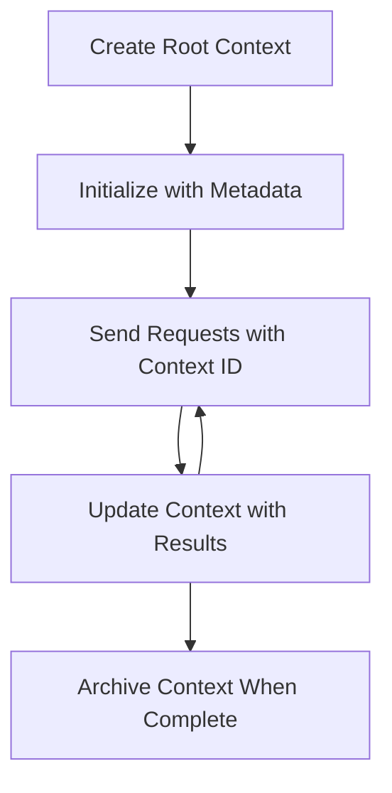
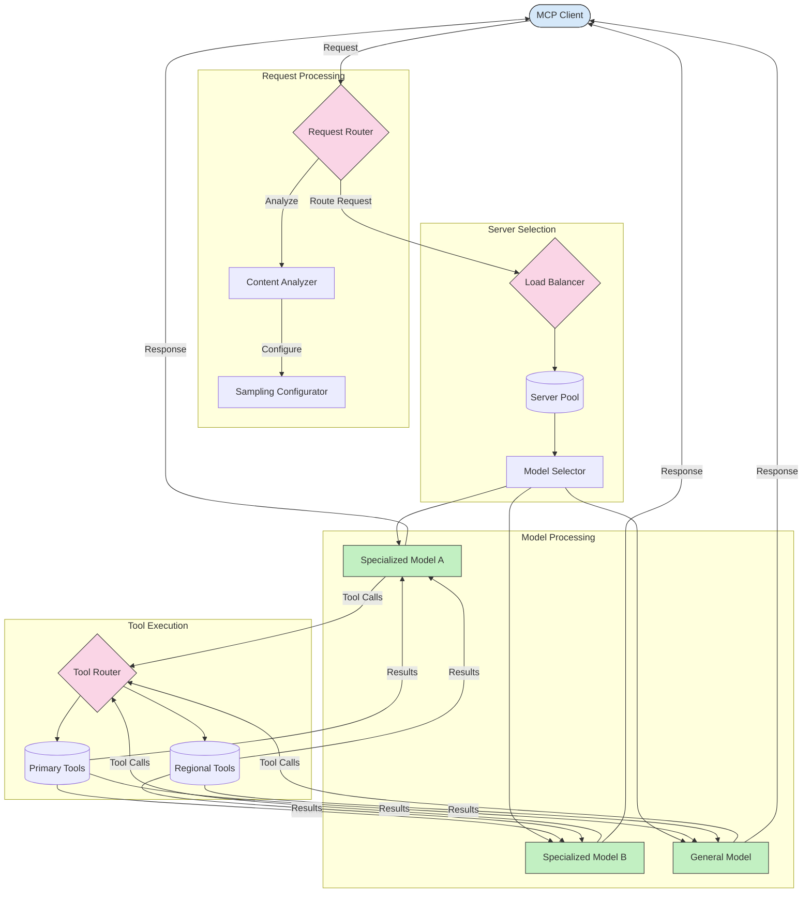

<!--
CO_OP_TRANSLATOR_METADATA:
{
  "original_hash": "a1c6fd414ab8b2efe382e85d4f276afa",
  "translation_date": "2025-06-02T12:08:58+00:00",
  "source_file": "05-AdvancedTopics/README.md",
  "language_code": "ko"
}
-->
# Advanced Topics in MCP

## 개요

이 강의에서는 Model Context Protocol 구현의 고급 개념을 다룹니다. 멀티모달 통합, 확장성, 보안 모범 사례, 엔터프라이즈 통합에 중점을 두며, 복잡한 요구사항을 처리할 수 있는 프로덕션 수준의 MCP 애플리케이션 구축에 필수적인 내용입니다.

## 학습 목표

이 강의를 마치면 다음을 수행할 수 있습니다:
- MCP 프레임워크 내에서 멀티모달 기능 구현
- 높은 수요 상황에 대응할 수 있는 확장 가능한 MCP 아키텍처 설계
- MCP 보안 원칙에 부합하는 보안 모범 사례 적용
- MCP와 엔터프라이즈 AI 시스템 및 프레임워크 통합
- 프로덕션 환경에서 성능과 안정성 최적화

## 샘플 프로젝트

| 링크 | 제목 | 설명 |
|------|-------|-------------|
| [mcp-oauth2-demo](../../../05-AdvancedTopics/mcp-oauth2-demo) | MCP OAuth2 Demo | MCP를 활용한 OAuth2를 보여주는 최소한의 Spring Boot 앱으로, Authorization 및 Resource Server 역할을 모두 수행합니다. 안전한 토큰 발급, 보호된 엔드포인트, Azure Container Apps 배포, API Management 통합을 시연합니다. |
| [web-search-mcp](../../../05-AdvancedTopics/web-search-mcp) | Web Search MCP | SerpAPI와 연동하는 Python MCP 서버 및 클라이언트로, 실시간 웹, 뉴스, 상품 검색과 Q&A를 지원합니다. 멀티툴 오케스트레이션, 외부 API 통합, 견고한 오류 처리 기능을 보여줍니다. |

## 추가 참고 자료

최신 MCP 고급 주제에 대한 정보는 다음을 참고하세요:
- [MCP Documentation](https://modelcontextprotocol.io/)
- [MCP Specification](https://spec.modelcontextprotocol.io/)
- [GitHub Repository](https://github.com/modelcontextprotocol)

## 멀티모달 통합

MCP는 텍스트 기반 상호작용뿐 아니라 이미지, 오디오 등 다양한 데이터 유형을 다룰 수 있는 멀티모달 기능도 지원합니다.

### 멀티모달 지원 아키텍처

멀티모달 MCP 구현은 일반적으로 다음 요소를 포함합니다:

1. **모달별 파서**: 다양한 미디어 유형을 모델이 처리할 수 있는 형식으로 변환하는 구성요소
2. **모달별 도구**: 특정 모달리티(예: 이미지 분석, 오디오 처리)를 다루기 위한 특화 도구
3. **통합 컨텍스트 관리**: 여러 모달리티 간 컨텍스트를 유지하는 시스템
4. **응답 생성**: 여러 모달리티를 포함할 수 있는 응답 생성 기능

### C# 멀티모달 예제: 이미지 분석

```csharp
using ModelContextProtocol.SDK.Server;
using ModelContextProtocol.SDK.Server.Tools;
using ModelContextProtocol.SDK.Server.Content;
using System.Text.Json;
using System.IO;
using System.Threading.Tasks;
using System.Collections.Generic;

namespace MultiModalMcpExample
{
    // Tool for image analysis
    public class ImageAnalysisTool : ITool
    {
        private readonly IImageAnalysisService _imageService;
        
        public ImageAnalysisTool(IImageAnalysisService imageService)
        {
            _imageService = imageService;
        }
        
        public string Name => "imageAnalysis";
        public string Description => "Analyzes image content and extracts information";
          public ToolDefinition GetDefinition()
        {
            return new ToolDefinition
            {
                Name = Name,
                Description = Description,
                Parameters = new Dictionary<string, ParameterDefinition>
                {
                    ["imageUrl"] = new ParameterDefinition
                    {
                        Type = ParameterType.String,
                        Description = "URL to the image to analyze" 
                    },
                    ["analysisType"] = new ParameterDefinition
                    {
                        Type = ParameterType.String,
                        Description = "Type of analysis to perform",
                        Enum = new[] { "general", "objects", "text", "faces" },
                        Default = "general"
                    }
                },
                Required = new[] { "imageUrl" }
            };
        }
        
        public async Task<ToolResponse> ExecuteAsync(IDictionary<string, object> parameters)
        {
            // Extract parameters
            string imageUrl = parameters["imageUrl"].ToString();
            string analysisType = parameters.ContainsKey("analysisType") 
                ? parameters["analysisType"].ToString() 
                : "general";
              // Download or access the image
            byte[] imageData = await DownloadImageAsync(imageUrl);
            
            // Analyze based on the requested analysis type
            var analysisResult = analysisType switch
            {
                "objects" => await _imageService.DetectObjectsAsync(imageData),                "text" => await _imageService.RecognizeTextAsync(imageData),
                "faces" => await _imageService.DetectFacesAsync(imageData),
                _ => await _imageService.AnalyzeGeneralAsync(imageData) // Default general analysis
            };
            
            // Return structured result as a ToolResponse
            // Format follows the MCP specification for content structure
            var content = new List<ContentItem>
            {
                new ContentItem
                {
                    Type = ContentType.Text,
                    Text = JsonSerializer.Serialize(analysisResult)
                }
            };
            
            return new ToolResponse
            {
                Content = content,
                IsError = false
            };
        }
        
        private async Task<byte[]> DownloadImageAsync(string url)
        {
            using var httpClient = new HttpClient();
            return await httpClient.GetByteArrayAsync(url);
        }
    }
    
    // Multi-modal MCP server with image and text processing
    public class MultiModalMcpServer
    {
        public static async Task Main(string[] args)
        {
            // Create an MCP server
            var server = new McpServer(
                name: "Multi-Modal MCP Server",
                version: "1.0.0"
            );
            
            // Configure server for multi-modal support
            var serverOptions = new McpServerOptions
            {
                MaxRequestSize = 10 * 1024 * 1024, // 10MB for larger payloads like images
                SupportedContentTypes = new[]
                {
                    "image/jpeg",
                    "image/png",
                    "text/plain",
                    "application/json"
                }
            };
            
            // Create image analysis service
            var imageService = new ComputerVisionService();
            
            // Register image analysis tools
            server.AddTool(new ImageAnalysisTool(imageService));
            
            // Register a text-to-image tool
            services.AddMcpTool<TextAnalysisTool>();
            services.AddMcpTool<ImageAnalysisTool>();
            services.AddMcpTool<DocumentGenerationTool>(); // Tool that can generate documents with text and images
        }
    }
}
```

### Java 멀티모달 예제: 오디오 처리

```java
package com.example.mcp.multimodal;

import com.mcp.server.McpServer;
import com.mcp.tools.Tool;
import com.mcp.tools.ToolRequest;
import com.mcp.tools.ToolResponse;
import com.mcp.tools.ToolExecutionException;
import com.example.audio.AudioProcessor;

import java.util.Base64;
import java.util.HashMap;
import java.util.Map;

// Audio transcription tool
public class AudioTranscriptionTool implements Tool {
    private final AudioProcessor audioProcessor;
    
    public AudioTranscriptionTool(AudioProcessor audioProcessor) {
        this.audioProcessor = audioProcessor;
    }
    
    @Override
    public String getName() {
        return "audioTranscription";
    }
    
    @Override
    public String getDescription() {
        return "Transcribes speech from audio files to text";
    }
    
    @Override
    public Object getSchema() {
        Map<String, Object> schema = new HashMap<>();
        schema.put("type", "object");
        
        Map<String, Object> properties = new HashMap<>();
        
        Map<String, Object> audioUrl = new HashMap<>();
        audioUrl.put("type", "string");
        audioUrl.put("description", "URL to the audio file to transcribe");
        
        Map<String, Object> audioData = new HashMap<>();
        audioData.put("type", "string");
        audioData.put("description", "Base64-encoded audio data (alternative to URL)");
        
        Map<String, Object> language = new HashMap<>();
        language.put("type", "string");
        language.put("description", "Language code (e.g., 'en-US', 'es-ES')");
        language.put("default", "en-US");
        
        properties.put("audioUrl", audioUrl);
        properties.put("audioData", audioData);
        properties.put("language", language);
        
        schema.put("properties", properties);
        schema.put("required", Arrays.asList("audioUrl"));
        
        return schema;
    }
    
    @Override
    public ToolResponse execute(ToolRequest request) {
        try {
            byte[] audioData;
            String language = request.getParameters().has("language") ? 
                request.getParameters().get("language").asText() : "en-US";
                
            // Get audio either from URL or direct data
            if (request.getParameters().has("audioUrl")) {
                String audioUrl = request.getParameters().get("audioUrl").asText();
                audioData = downloadAudio(audioUrl);
            } else if (request.getParameters().has("audioData")) {
                String base64Audio = request.getParameters().get("audioData").asText();
                audioData = Base64.getDecoder().decode(base64Audio);
            } else {
                throw new ToolExecutionException("Either audioUrl or audioData must be provided");
            }
            
            // Process audio and transcribe
            Map<String, Object> transcriptionResult = audioProcessor.transcribe(audioData, language);
            
            // Return transcription result
            return new ToolResponse.Builder()
                .setResult(transcriptionResult)
                .build();
        } catch (Exception ex) {
            throw new ToolExecutionException("Audio transcription failed: " + ex.getMessage(), ex);
        }
    }
    
    private byte[] downloadAudio(String url) {
        // Implementation for downloading audio from URL
        // ...
        return new byte[0]; // Placeholder
    }
}

// Main application with audio and other modalities
public class MultiModalApplication {
    public static void main(String[] args) {
        // Configure services
        AudioProcessor audioProcessor = new AudioProcessor();
        ImageProcessor imageProcessor = new ImageProcessor();
        
        // Create and configure server
        McpServer server = new McpServer.Builder()
            .setName("Multi-Modal MCP Server")
            .setVersion("1.0.0")
            .setPort(5000)
            .setMaxRequestSize(20 * 1024 * 1024) // 20MB for audio/video content
            .build();
            
        // Register multi-modal tools
        server.registerTool(new AudioTranscriptionTool(audioProcessor));
        server.registerTool(new ImageAnalysisTool(imageProcessor));
        server.registerTool(new VideoProcessingTool());
        
        // Start server
        server.start();
        System.out.println("Multi-Modal MCP Server started on port 5000");
    }
}
```

### Python 멀티모달 예제: 멀티모달 응답 생성

```python
from mcp_server import McpServer
from mcp_tools import Tool, ToolRequest, ToolResponse, ToolExecutionException
import base64
from PIL import Image
import io
import requests
import json
from typing import Dict, Any, List, Optional

# Image generation tool
class ImageGenerationTool(Tool):
    def get_name(self):
        return "imageGeneration"
        
    def get_description(self):
        return "Generates images based on text descriptions"
    
    def get_schema(self):
        return {
            "type": "object",
            "properties": {
                "prompt": {
                    "type": "string", 
                    "description": "Text description of the image to generate"
                },
                "style": {
                    "type": "string",
                    "enum": ["realistic", "artistic", "cartoon", "sketch"],
                    "default": "realistic"
                },
                "width": {
                    "type": "integer",
                    "default": 512
                },
                "height": {
                    "type": "integer",
                    "default": 512
                }
            },
            "required": ["prompt"]
        }
    
    async def execute_async(self, request: ToolRequest) -> ToolResponse:
        try:
            # Extract parameters
            prompt = request.parameters.get("prompt")
            style = request.parameters.get("style", "realistic")
            width = request.parameters.get("width", 512)
            height = request.parameters.get("height", 512)
            
            # Generate image using external service (example implementation)
            image_data = await self._generate_image(prompt, style, width, height)
            
            # Convert image to base64 for response
            buffered = io.BytesIO()
            image_data.save(buffered, format="PNG")
            img_str = base64.b64encode(buffered.getvalue()).decode()
            
            # Return result with both the image and metadata
            return ToolResponse(
                result={
                    "imageBase64": img_str,
                    "format": "image/png",
                    "width": width,
                    "height": height,
                    "generationPrompt": prompt,
                    "style": style
                }
            )
        except Exception as e:
            raise ToolExecutionException(f"Image generation failed: {str(e)}")
    
    async def _generate_image(self, prompt: str, style: str, width: int, height: int) -> Image.Image:
        """
        This would call an actual image generation API
        Simplified placeholder implementation
        """
        # Return a placeholder image or call actual image generation API
        # For this example, we'll create a simple colored image
        image = Image.new('RGB', (width, height), color=(73, 109, 137))
        return image

# Multi-modal response handler
class MultiModalResponseHandler:
    """Handler for creating responses that combine text, images, and other modalities"""
    
    def __init__(self, mcp_client):
        self.client = mcp_client
    
    async def create_multi_modal_response(self, 
                                         text_content: str, 
                                         generate_images: bool = False,
                                         image_prompts: Optional[List[str]] = None) -> Dict[str, Any]:
        """
        Creates a response that may include generated images alongside text
        """
        response = {
            "text": text_content,
            "images": []
        }
        
        # Generate images if requested
        if generate_images and image_prompts:
            for prompt in image_prompts:
                image_result = await self.client.execute_tool(
                    "imageGeneration",
                    {
                        "prompt": prompt,
                        "style": "realistic",
                        "width": 512,
                        "height": 512
                    }
                )
                
                response["images"].append({
                    "imageData": image_result.result["imageBase64"],
                    "format": image_result.result["format"],
                    "prompt": prompt
                })
        
        return response

# Main application
async def main():
    # Create server
    server = McpServer(
        name="Multi-Modal MCP Server",
        version="1.0.0",
        port=5000
    )
    
    # Register multi-modal tools
    server.register_tool(ImageGenerationTool())
    server.register_tool(AudioAnalysisTool())
    server.register_tool(VideoFrameExtractionTool())
    
    # Start server
    await server.start()
    print("Multi-Modal MCP Server running on port 5000")

if __name__ == "__main__":
    import asyncio
    asyncio.run(main())
```

## MCP 루트 컨텍스트

루트 컨텍스트는 Model Context Protocol의 핵심 개념으로, 여러 요청과 세션에 걸쳐 대화 기록과 공유 상태를 유지하는 영속적 계층을 제공합니다.

### 루트 컨텍스트 이해하기

루트 컨텍스트는 관련된 상호작용 일련의 기록과 상태를 담는 컨테이너 역할을 합니다. 이를 통해 다음을 가능하게 합니다:

- **대화 지속성**: 일관된 다중 턴 대화 유지
- **메모리 관리**: 상호작용 간 정보 저장 및 조회
- **상태 관리**: 복잡한 워크플로우 진행 상황 추적
- **컨텍스트 공유**: 여러 클라이언트가 동일 대화 상태에 접근 가능

MCP에서 루트 컨텍스트의 주요 특징은 다음과 같습니다:

- 각 루트 컨텍스트는 고유 식별자를 가짐
- 대화 기록, 사용자 선호도, 기타 메타데이터 포함 가능
- 필요에 따라 생성, 접근, 보관 가능
- 세밀한 접근 제어 및 권한 관리 지원

### 루트 컨텍스트 생명주기



### .NET 예제: 루트 컨텍스트 다루기

```csharp
// .NET Example: Root Context Management
using Microsoft.Mcp.Client;
using System;
using System.Threading.Tasks;
using System.Collections.Generic;

public class RootContextExample
{
    private readonly IMcpClient _client;
    private readonly IRootContextManager _contextManager;
    
    public RootContextExample(IMcpClient client, IRootContextManager contextManager)
    {
        _client = client;
        _contextManager = contextManager;
    }
    
    public async Task DemonstrateRootContextAsync()
    {
        // Create a new root context
        var contextResult = await _contextManager.CreateRootContextAsync(new RootContextCreateOptions
        {
            Name = "Customer Support Session",
            Metadata = new Dictionary<string, string>
            {
                ["CustomerName"] = "Acme Corporation",
                ["PriorityLevel"] = "High",
                ["Domain"] = "Cloud Services"
            }
        });
        
        string contextId = contextResult.ContextId;
        Console.WriteLine($"Created root context with ID: {contextId}");
        
        // First interaction using the context
        var response1 = await _client.SendPromptAsync(
            "I'm having issues scaling my web service deployment in the cloud.", 
            new SendPromptOptions { RootContextId = contextId }
        );
        
        Console.WriteLine($"First response: {response1.GeneratedText}");
        
        // Second interaction - the model will have access to the previous conversation
        var response2 = await _client.SendPromptAsync(
            "Yes, we're using containerized deployments with Kubernetes.", 
            new SendPromptOptions { RootContextId = contextId }
        );
        
        Console.WriteLine($"Second response: {response2.GeneratedText}");
        
        // Add metadata to the context based on conversation
        await _contextManager.UpdateContextMetadataAsync(contextId, new Dictionary<string, string>
        {
            ["TechnicalEnvironment"] = "Kubernetes",
            ["IssueType"] = "Scaling"
        });
        
        // Get context information
        var contextInfo = await _contextManager.GetRootContextInfoAsync(contextId);
        
        Console.WriteLine("Context Information:");
        Console.WriteLine($"- Name: {contextInfo.Name}");
        Console.WriteLine($"- Created: {contextInfo.CreatedAt}");
        Console.WriteLine($"- Messages: {contextInfo.MessageCount}");
        
        // When the conversation is complete, archive the context
        await _contextManager.ArchiveRootContextAsync(contextId);
        Console.WriteLine($"Archived context {contextId}");
    }
}
```

### Java 예제: 루트 컨텍스트 구현

```java
// Java Example: Root Context Implementation
package com.example.mcp.contexts;

import com.mcp.client.McpClient;
import com.mcp.client.ContextManager;
import com.mcp.models.RootContext;
import com.mcp.models.McpResponse;

import java.util.HashMap;
import java.util.Map;
import java.util.UUID;

public class RootContextsDemo {
    private final McpClient client;
    private final ContextManager contextManager;
    
    public RootContextsDemo(String serverUrl) {
        this.client = new McpClient.Builder()
            .setServerUrl(serverUrl)
            .build();
            
        this.contextManager = new ContextManager(client);
    }
    
    public void demonstrateRootContext() throws Exception {
        // Create context metadata
        Map<String, String> metadata = new HashMap<>();
        metadata.put("projectName", "Financial Analysis");
        metadata.put("userRole", "Financial Analyst");
        metadata.put("dataSource", "Q1 2025 Financial Reports");
        
        // Create a new root context
        RootContext context = contextManager.createRootContext("Financial Analysis Session", metadata);
        String contextId = context.getId();
        
        System.out.println("Created context: " + contextId);
        
        // First interaction
        McpResponse response1 = client.sendPrompt(
            "Analyze the trends in Q1 financial data for our technology division",
            contextId
        );
        
        System.out.println("First response: " + response1.getGeneratedText());
        
        // Update context with important information gained from response
        contextManager.addContextMetadata(contextId, 
            Map.of("identifiedTrend", "Increasing cloud infrastructure costs"));
        
        // Second interaction - using the same context
        McpResponse response2 = client.sendPrompt(
            "What's driving the increase in cloud infrastructure costs?",
            contextId
        );
        
        System.out.println("Second response: " + response2.getGeneratedText());
        
        // Generate a summary of the analysis session
        McpResponse summaryResponse = client.sendPrompt(
            "Summarize our analysis of the technology division financials in 3-5 key points",
            contextId
        );
        
        // Store the summary in context metadata
        contextManager.addContextMetadata(contextId, 
            Map.of("analysisSummary", summaryResponse.getGeneratedText()));
            
        // Get updated context information
        RootContext updatedContext = contextManager.getRootContext(contextId);
        
        System.out.println("Context Information:");
        System.out.println("- Created: " + updatedContext.getCreatedAt());
        System.out.println("- Last Updated: " + updatedContext.getLastUpdatedAt());
        System.out.println("- Analysis Summary: " + 
            updatedContext.getMetadata().get("analysisSummary"));
            
        // Archive context when done
        contextManager.archiveContext(contextId);
        System.out.println("Context archived");
    }
}
```

### JavaScript 예제: 루트 컨텍스트 관리

```javascript
// JavaScript Example: Managing MCP Root Contexts
const { McpClient, RootContextManager } = require('@mcp/client');

class ContextSession {
  constructor(serverUrl, apiKey = null) {
    // Initialize the MCP client
    this.client = new McpClient({
      serverUrl,
      apiKey
    });
    
    // Initialize context manager
    this.contextManager = new RootContextManager(this.client);
  }
  
  /**
   * Create a new conversation context
   * @param {string} sessionName - Name of the conversation session
   * @param {Object} metadata - Additional metadata for the context
   * @returns {Promise<string>} - Context ID
   */
  async createConversationContext(sessionName, metadata = {}) {
    try {
      const contextResult = await this.contextManager.createRootContext({
        name: sessionName,
        metadata: {
          ...metadata,
          createdAt: new Date().toISOString(),
          status: 'active'
        }
      });
      
      console.log(`Created root context '${sessionName}' with ID: ${contextResult.id}`);
      return contextResult.id;
    } catch (error) {
      console.error('Error creating root context:', error);
      throw error;
    }
  }
  
  /**
   * Send a message in an existing context
   * @param {string} contextId - The root context ID
   * @param {string} message - The user's message
   * @param {Object} options - Additional options
   * @returns {Promise<Object>} - Response data
   */
  async sendMessage(contextId, message, options = {}) {
    try {
      // Send the message using the specified context
      const response = await this.client.sendPrompt(message, {
        rootContextId: contextId,
        temperature: options.temperature || 0.7,
        allowedTools: options.allowedTools || []
      });
      
      // Optionally store important insights from the conversation
      if (options.storeInsights) {
        await this.storeConversationInsights(contextId, message, response.generatedText);
      }
      
      return {
        message: response.generatedText,
        toolCalls: response.toolCalls || [],
        contextId
      };
    } catch (error) {
      console.error(`Error sending message in context ${contextId}:`, error);
      throw error;
    }
  }
  
  /**
   * Store important insights from a conversation
   * @param {string} contextId - The root context ID
   * @param {string} userMessage - User's message
   * @param {string} aiResponse - AI's response
   */
  async storeConversationInsights(contextId, userMessage, aiResponse) {
    try {
      // Extract potential insights (in a real app, this would be more sophisticated)
      const combinedText = userMessage + "\n" + aiResponse;
      
      // Simple heuristic to identify potential insights
      const insightWords = ["important", "key point", "remember", "significant", "crucial"];
      
      const potentialInsights = combinedText
        .split(".")
        .filter(sentence => 
          insightWords.some(word => sentence.toLowerCase().includes(word))
        )
        .map(sentence => sentence.trim())
        .filter(sentence => sentence.length > 10);
      
      // Store insights in context metadata
      if (potentialInsights.length > 0) {
        const insights = {};
        potentialInsights.forEach((insight, index) => {
          insights[`insight_${Date.now()}_${index}`] = insight;
        });
        
        await this.contextManager.updateContextMetadata(contextId, insights);
        console.log(`Stored ${potentialInsights.length} insights in context ${contextId}`);
      }
    } catch (error) {
      console.warn('Error storing conversation insights:', error);
      // Non-critical error, so just log warning
    }
  }
  
  /**
   * Get summary information about a context
   * @param {string} contextId - The root context ID
   * @returns {Promise<Object>} - Context information
   */
  async getContextInfo(contextId) {
    try {
      const contextInfo = await this.contextManager.getContextInfo(contextId);
      
      return {
        id: contextInfo.id,
        name: contextInfo.name,
        created: new Date(contextInfo.createdAt).toLocaleString(),
        lastUpdated: new Date(contextInfo.lastUpdatedAt).toLocaleString(),
        messageCount: contextInfo.messageCount,
        metadata: contextInfo.metadata,
        status: contextInfo.status
      };
    } catch (error) {
      console.error(`Error getting context info for ${contextId}:`, error);
      throw error;
    }
  }
  
  /**
   * Generate a summary of the conversation in a context
   * @param {string} contextId - The root context ID
   * @returns {Promise<string>} - Generated summary
   */
  async generateContextSummary(contextId) {
    try {
      // Ask the model to generate a summary of the conversation so far
      const response = await this.client.sendPrompt(
        "Please summarize our conversation so far in 3-4 sentences, highlighting the main points discussed.",
        { rootContextId: contextId, temperature: 0.3 }
      );
      
      // Store the summary in context metadata
      await this.contextManager.updateContextMetadata(contextId, {
        conversationSummary: response.generatedText,
        summarizedAt: new Date().toISOString()
      });
      
      return response.generatedText;
    } catch (error) {
      console.error(`Error generating context summary for ${contextId}:`, error);
      throw error;
    }
  }
  
  /**
   * Archive a context when it's no longer needed
   * @param {string} contextId - The root context ID
   * @returns {Promise<Object>} - Result of the archive operation
   */
  async archiveContext(contextId) {
    try {
      // Generate a final summary before archiving
      const summary = await this.generateContextSummary(contextId);
      
      // Archive the context
      await this.contextManager.archiveContext(contextId);
      
      return {
        status: "archived",
        contextId,
        summary
      };
    } catch (error) {
      console.error(`Error archiving context ${contextId}:`, error);
      throw error;
    }
  }
}

// Example usage
async function demonstrateContextSession() {
  const session = new ContextSession('https://mcp-server-example.com');
  
  try {
    // Create a new context for a product support conversation
    const contextId = await session.createConversationContext(
      'Product Support - Database Performance',
      {
        customer: 'Globex Corporation',
        product: 'Enterprise Database',
        severity: 'Medium',
        supportAgent: 'AI Assistant'
      }
    );
    
    // First message in the conversation
    const response1 = await session.sendMessage(
      contextId,
      "I'm experiencing slow query performance on our database cluster after the latest update.",
      { storeInsights: true }
    );
    console.log('Response 1:', response1.message);
    
    // Follow-up message in the same context
    const response2 = await session.sendMessage(
      contextId,
      "Yes, we've already checked the indexes and they seem to be properly configured.",
      { storeInsights: true }
    );
    console.log('Response 2:', response2.message);
    
    // Get information about the context
    const contextInfo = await session.getContextInfo(contextId);
    console.log('Context Information:', contextInfo);
    
    // Generate and display conversation summary
    const summary = await session.generateContextSummary(contextId);
    console.log('Conversation Summary:', summary);
    
    // Archive the context when done
    const archiveResult = await session.archiveContext(contextId);
    console.log('Archive Result:', archiveResult);
    
  } catch (error) {
    console.error('Error in context session demonstration:', error);
  }
}

demonstrateContextSession();
```

### Python 예제: 다중 턴 지원을 위한 루트 컨텍스트

```python
# Python Example: Root Context for Multi-Turn Assistance
import asyncio
from datetime import datetime
from mcp_client import McpClient, RootContextManager

class AssistantSession:
    def __init__(self, server_url, api_key=None):
        self.client = McpClient(server_url=server_url, api_key=api_key)
        self.context_manager = RootContextManager(self.client)
    
    async def create_session(self, name, user_info=None):
        """Create a new root context for an assistant session"""
        metadata = {
            "session_type": "assistant",
            "created_at": datetime.now().isoformat(),
        }
        
        # Add user information if provided
        if user_info:
            metadata.update({f"user_{k}": v for k, v in user_info.items()})
            
        # Create the root context
        context = await self.context_manager.create_root_context(name, metadata)
        return context.id
    
    async def send_message(self, context_id, message, tools=None):
        """Send a message within a root context"""
        # Create options with context ID
        options = {
            "root_context_id": context_id
        }
        
        # Add tools if specified
        if tools:
            options["allowed_tools"] = tools
        
        # Send the prompt within the context
        response = await self.client.send_prompt(message, options)
        
        # Update context metadata with conversation progress
        await self.context_manager.update_context_metadata(
            context_id,
            {
                f"message_{datetime.now().timestamp()}": message[:50] + "...",
                "last_interaction": datetime.now().isoformat()
            }
        )
        
        return response
    
    async def get_conversation_history(self, context_id):
        """Retrieve conversation history from a context"""
        context_info = await self.context_manager.get_context_info(context_id)
        messages = await self.client.get_context_messages(context_id)
        
        return {
            "context_info": context_info,
            "messages": messages
        }
    
    async def end_session(self, context_id):
        """End an assistant session by archiving the context"""
        # Generate a summary prompt first
        summary_response = await self.client.send_prompt(
            "Please summarize our conversation and any key points or decisions made.",
            {"root_context_id": context_id}
        )
        
        # Store summary in metadata
        await self.context_manager.update_context_metadata(
            context_id,
            {
                "summary": summary_response.generated_text,
                "ended_at": datetime.now().isoformat(),
                "status": "completed"
            }
        )
        
        # Archive the context
        await self.context_manager.archive_context(context_id)
        
        return {
            "status": "completed",
            "summary": summary_response.generated_text
        }

# Example usage
async def demo_assistant_session():
    assistant = AssistantSession("https://mcp-server-example.com")
    
    # Create session
    context_id = await assistant.create_session(
        "Technical Support Session",
        {"name": "Alex", "technical_level": "advanced", "product": "Cloud Services"}
    )
    print(f"Created session with context ID: {context_id}")
    
    # First interaction
    response1 = await assistant.send_message(
        context_id, 
        "I'm having trouble with the auto-scaling feature in your cloud platform.",
        ["documentation_search", "diagnostic_tool"]
    )
    print(f"Response 1: {response1.generated_text}")
    
    # Second interaction in the same context
    response2 = await assistant.send_message(
        context_id,
        "Yes, I've already checked the configuration settings you mentioned, but it's still not working."
    )
    print(f"Response 2: {response2.generated_text}")
    
    # Get history
    history = await assistant.get_conversation_history(context_id)
    print(f"Session has {len(history['messages'])} messages")
    
    # End session
    end_result = await assistant.end_session(context_id)
    print(f"Session ended with summary: {end_result['summary']}")

if __name__ == "__main__":
    asyncio.run(demo_assistant_session())
```

### 루트 컨텍스트 모범 사례

1. **목적에 맞는 컨텍스트 생성**: 대화 목적이나 도메인별로 별도의 루트 컨텍스트를 만들어 명확성 유지
2. **만료 정책 설정**: 오래된 컨텍스트를 보관하거나 삭제하는 정책을 구현해 저장소 관리 및 데이터 보존 규정 준수
3. **관련 메타데이터 저장**: 대화에 중요한 정보를 담는 메타데이터 활용
4. **컨텍스트 ID 일관성 유지**: 생성된 컨텍스트 ID를 모든 관련 요청에 일관되게 사용해 연속성 유지
5. **요약 생성**: 컨텍스트가 커질 경우 핵심 정보를 담은 요약을 만들어 크기 관리
6. **접근 제어 구현**: 다중 사용자 시스템에서 대화 컨텍스트의 프라이버시와 보안을 위한 적절한 접근 권한 설정
7. **컨텍스트 제한 대응**: 컨텍스트 크기 제한을 인지하고 긴 대화에 대한 처리 전략 마련
8. **완료 시 보관**: 대화가 끝나면 컨텍스트를 보관해 자원 확보 및 대화 기록 유지

## Model Context Protocol의 샘플링

샘플링 전략은 MCP 구현에서 모델 응답 최적화에 매우 중요합니다. 적절한 샘플링 설정은 응답 품질과 성능을 크게 향상시킬 수 있습니다. MCP는 무작위성, 창의성, 일관성에 영향을 주는 특정 매개변수를 통해 텍스트 생성 방식을 표준화합니다.

### 샘플링 매개변수 개요

MCP는 클라이언트 요청에서 설정 가능한 다음과 같은 샘플링 매개변수를 정의합니다:

| 매개변수 | 설명 | 일반 범위 |
|-----------|-------------|---------------|
| `temperature` | Controls randomness in token selection | 0.0 - 2.0 |
| `top_p` | Nucleus sampling - limits tokens to top cumulative probability | 0.0 - 1.0 |
| `top_k` | Limits token selection to top K options | 1 - 100 |
| `presence_penalty` | Penalizes tokens based on their presence in the text so far | -2.0 - 2.0 |
| `frequency_penalty` | Penalizes tokens based on their frequency in the text so far | -2.0 - 2.0 |
| `seed` | Specific random seed for reproducible results | Integer value |
| `max_tokens` | Maximum number of tokens to generate | Integer value |
| `stop_sequences` | 생성 중 만나면 텍스트 생성을 중단하는 사용자 지정 시퀀스 | 문자열 배열 |

### 온도 및 Top-K/Top-P 샘플링

샘플링 매개변수를 조정하면 결정적 출력과 창의적 출력을 적절히 조합해 언어 모델의 동작을 세밀하게 조절할 수 있습니다.

```csharp
// .NET Example: Configuring sampling parameters in MCP
public class SamplingExample
{
    public async Task RunWithSamplingAsync()
    {
        // Create MCP client with sampling configuration
        var client = new McpClient("https://mcp-server-url.com");
        
        // Create request with specific sampling parameters
        var request = new McpRequest
        {
            Prompt = "Generate creative ideas for a mobile app",
            SamplingParameters = new SamplingParameters
            {
                Temperature = 0.8f,     // Higher temperature for more creative outputs
                TopP = 0.95f,           // Nucleus sampling parameter
                TopK = 40,              // Limit token selection to top K options
                FrequencyPenalty = 0.5f, // Reduce repetition
                PresencePenalty = 0.2f   // Encourage diversity
            },
            AllowedTools = new[] { "ideaGenerator", "marketAnalyzer" }
        };
        
        // Send request using specific sampling configuration
        var response = await client.SendRequestAsync(request);
        
        // Output results
        Console.WriteLine($"Generated with Temperature={request.SamplingParameters.Temperature}:");
        Console.WriteLine(response.GeneratedText);
    }
}
```

```javascript
// JavaScript Example: Temperature and Top-P sampling configuration
const { McpClient } = require('@mcp/client');

async function demonstrateSampling() {
  // Initialize the MCP client
  const client = new McpClient({
    serverUrl: 'https://mcp-server-example.com',
    apiKey: process.env.MCP_API_KEY
  });
  
  // Configure request with different sampling parameters
  const creativeSampling = {
    temperature: 0.9,    // Higher temperature = more randomness/creativity
    topP: 0.92,          // Consider tokens with top 92% probability mass
    frequencyPenalty: 0.6, // Reduce repetition of token sequences
    presencePenalty: 0.4   // Penalize tokens that have appeared in the text so far
  };
  
  const factualSampling = {
    temperature: 0.2,    // Lower temperature = more deterministic/factual
    topP: 0.85,          // Slightly more focused token selection
    frequencyPenalty: 0.2, // Minimal repetition penalty
    presencePenalty: 0.1   // Minimal presence penalty
  };
  
  try {
    // Send two requests with different sampling configurations
    const creativeResponse = await client.sendPrompt(
      "Generate innovative ideas for sustainable urban transportation",
      {
        allowedTools: ['ideaGenerator', 'environmentalImpactTool'],
        ...creativeSampling
      }
    );
    
    const factualResponse = await client.sendPrompt(
      "Explain how electric vehicles impact carbon emissions",
      {
        allowedTools: ['factChecker', 'dataAnalysisTool'],
        ...factualSampling
      }
    );
    
    console.log('Creative Response (temperature=0.9):');
    console.log(creativeResponse.generatedText);
    
    console.log('\nFactual Response (temperature=0.2):');
    console.log(factualResponse.generatedText);
    
  } catch (error) {
    console.error('Error demonstrating sampling:', error);
  }
}

demonstrateSampling();
```

### 결정적 샘플링

일관된 출력을 요구하는 애플리케이션에서는 결정적 샘플링으로 재현 가능한 결과를 보장합니다.

```java
// Java Example: Deterministic responses with fixed seed
public class DeterministicSamplingExample {
    public void demonstrateDeterministicResponses() {
        McpClient client = new McpClient.Builder()
            .setServerUrl("https://mcp-server-example.com")
            .build();
            
        long fixedSeed = 12345; // Using a fixed seed for deterministic results
        
        // First request with fixed seed
        McpRequest request1 = new McpRequest.Builder()
            .setPrompt("Generate a random number between 1 and 100")
            .setSeed(fixedSeed)
            .setTemperature(0.0) // Zero temperature for maximum determinism
            .build();
            
        // Second request with the same seed
        McpRequest request2 = new McpRequest.Builder()
            .setPrompt("Generate a random number between 1 and 100")
            .setSeed(fixedSeed)
            .setTemperature(0.0)
            .build();
        
        // Execute both requests
        McpResponse response1 = client.sendRequest(request1);
        McpResponse response2 = client.sendRequest(request2);
        
        // Responses should be identical due to same seed and temperature=0
        System.out.println("Response 1: " + response1.getGeneratedText());
        System.out.println("Response 2: " + response2.getGeneratedText());
        System.out.println("Are responses identical: " + 
            response1.getGeneratedText().equals(response2.getGeneratedText()));
    }
}
```

```javascript
// JavaScript Example: Deterministic responses with seed control
const { McpClient } = require('@mcp/client');

async function deterministicSampling() {
  const client = new McpClient({
    serverUrl: 'https://mcp-server-example.com'
  });
  
  const fixedSeed = 12345;
  const prompt = "Generate a random password with 8 characters";
  
  try {
    // First request with fixed seed
    const response1 = await client.sendPrompt(prompt, {
      seed: fixedSeed,
      temperature: 0.0  // Zero temperature for maximum determinism
    });
    
    // Second request with same seed and temperature
    const response2 = await client.sendPrompt(prompt, {
      seed: fixedSeed,
      temperature: 0.0
    });
    
    // Third request with different seed but same temperature
    const response3 = await client.sendPrompt(prompt, {
      seed: 67890,
      temperature: 0.0
    });
    
    console.log('Response 1:', response1.generatedText);
    console.log('Response 2:', response2.generatedText);
    console.log('Response 3:', response3.generatedText);
    console.log('Responses 1 and 2 match:', response1.generatedText === response2.generatedText);
    console.log('Responses 1 and 3 match:', response1.generatedText === response3.generatedText);
    
  } catch (error) {
    console.error('Error in deterministic sampling demo:', error);
  }
}

deterministicSampling();
```

### 동적 샘플링 구성

지능형 샘플링은 요청의 맥락과 요구사항에 따라 매개변수를 자동으로 조정합니다.

```python
# Python Example: Dynamic sampling based on request context
class DynamicSamplingService:
    def __init__(self, mcp_client):
        self.client = mcp_client
        
    async def generate_with_adaptive_sampling(self, prompt, task_type, user_preferences=None):
        """Uses different sampling strategies based on task type and user preferences"""
        
        # Define sampling presets for different task types
        sampling_presets = {
            "creative": {"temperature": 0.9, "top_p": 0.95, "frequency_penalty": 0.7},
            "factual": {"temperature": 0.2, "top_p": 0.85, "frequency_penalty": 0.2},
            "code": {"temperature": 0.3, "top_p": 0.9, "frequency_penalty": 0.5},
            "analytical": {"temperature": 0.4, "top_p": 0.92, "frequency_penalty": 0.3}
        }
        
        # Select base preset
        sampling_params = sampling_presets.get(task_type, sampling_presets["factual"])
        
        # Adjust based on user preferences if provided
        if user_preferences:
            if "creativity_level" in user_preferences:
                # Scale temperature based on creativity preference (1-10)
                creativity = min(max(user_preferences["creativity_level"], 1), 10) / 10
                sampling_params["temperature"] = 0.1 + (0.9 * creativity)
            
            if "diversity" in user_preferences:
                # Adjust top_p based on desired response diversity
                diversity = min(max(user_preferences["diversity"], 1), 10) / 10
                sampling_params["top_p"] = 0.6 + (0.39 * diversity)
        
        # Create and send request with custom sampling parameters
        response = await self.client.send_request(
            prompt=prompt,
            temperature=sampling_params["temperature"],
            top_p=sampling_params["top_p"],
            frequency_penalty=sampling_params["frequency_penalty"]
        )
        
        # Return response with sampling metadata for transparency
        return {
            "text": response.generated_text,
            "applied_sampling": sampling_params,
            "task_type": task_type
        }
```

```javascript
// JavaScript Example: Dynamic sampling configuration based on user context
class AdaptiveSamplingManager {
  constructor(mcpClient) {
    this.client = mcpClient;
    
    // Define base sampling profiles
    this.samplingProfiles = {
      creative: { temperature: 0.85, topP: 0.94, frequencyPenalty: 0.7, presencePenalty: 0.5 },
      factual: { temperature: 0.2, topP: 0.85, frequencyPenalty: 0.3, presencePenalty: 0.1 },
      code: { temperature: 0.25, topP: 0.9, frequencyPenalty: 0.4, presencePenalty: 0.3 },
      conversational: { temperature: 0.7, topP: 0.9, frequencyPenalty: 0.6, presencePenalty: 0.4 }
    };
    
    // Track historical performance
    this.performanceHistory = [];
  }
  
  // Detect task type from prompt
  detectTaskType(prompt, context = {}) {
    const promptLower = prompt.toLowerCase();
    
    // Simple heuristic detection - could be enhanced with ML classification
    if (context.taskType) return context.taskType;
    
    if (promptLower.includes('code') || 
        promptLower.includes('function') || 
        promptLower.includes('program')) {
      return 'code';
    }
    
    if (promptLower.includes('explain') || 
        promptLower.includes('what is') || 
        promptLower.includes('how does')) {
      return 'factual';
    }
    
    if (promptLower.includes('creative') || 
        promptLower.includes('imagine') || 
        promptLower.includes('story')) {
      return 'creative';
    }
    
    // Default to conversational if no clear type is detected
    return 'conversational';
  }
  
  // Calculate sampling parameters based on context and user preferences
  getSamplingParameters(prompt, context = {}) {
    // Detect the type of task
    const taskType = this.detectTaskType(prompt, context);
    
    // Get base profile
    let params = {...this.samplingProfiles[taskType]};
    
    // Adjust based on user preferences
    if (context.userPreferences) {
      const { creativity, precision, consistency } = context.userPreferences;
      
      if (creativity !== undefined) {
        // Scale from 1-10 to appropriate temperature range
        params.temperature = 0.1 + (creativity * 0.09); // 0.1-1.0
      }
      
      if (precision !== undefined) {
        // Higher precision means lower topP (more focused selection)
        params.topP = 1.0 - (precision * 0.05); // 0.5-1.0
      }
      
      if (consistency !== undefined) {
        // Higher consistency means lower penalties
        params.frequencyPenalty = 0.1 + ((10 - consistency) * 0.08); // 0.1-0.9
      }
    }
    
    // Apply learned adjustments from performance history
    this.applyLearnedAdjustments(params, taskType);
    
    return params;
  }
  
  applyLearnedAdjustments(params, taskType) {
    // Simple adaptive logic - could be enhanced with more sophisticated algorithms
    const relevantHistory = this.performanceHistory
      .filter(entry => entry.taskType === taskType)
      .slice(-5); // Only consider recent history
    
    if (relevantHistory.length > 0) {
      // Calculate average performance scores
      const avgScore = relevantHistory.reduce((sum, entry) => sum + entry.score, 0) / relevantHistory.length;
      
      // If performance is below threshold, adjust parameters
      if (avgScore < 0.7) {
        // Slight adjustment toward safer values
        params.temperature = Math.max(params.temperature * 0.9, 0.1);
        params.topP = Math.max(params.topP * 0.95, 0.5);
      }
    }
  }
  
  recordPerformance(prompt, samplingParams, response, score) {
    // Record performance for future adjustments
    this.performanceHistory.push({
      timestamp: Date.now(),
      taskType: this.detectTaskType(prompt),
      samplingParams,
      responseLength: response.generatedText.length,
      score // 0-1 rating of response quality
    });
    
    // Limit history size
    if (this.performanceHistory.length > 100) {
      this.performanceHistory.shift();
    }
  }
  
  async generateResponse(prompt, context = {}) {
    // Get optimized sampling parameters
    const samplingParams = this.getSamplingParameters(prompt, context);
    
    // Send request with optimized parameters
    const response = await this.client.sendPrompt(prompt, {
      ...samplingParams,
      allowedTools: context.allowedTools || []
    });
    
    // If user provides feedback, record it for future optimization
    if (context.recordPerformance) {
      this.recordPerformance(prompt, samplingParams, response, context.feedbackScore || 0.5);
    }
    
    return {
      response,
      appliedSamplingParams: samplingParams,
      detectedTaskType: this.detectTaskType(prompt, context)
    };
  }
}

// Example usage
async function demonstrateAdaptiveSampling() {
  const client = new McpClient({
    serverUrl: 'https://mcp-server-example.com'
  });
  
  const samplingManager = new AdaptiveSamplingManager(client);
  
  try {
    // Creative task with custom user preferences
    const creativeResult = await samplingManager.generateResponse(
      "Write a short poem about artificial intelligence",
      {
        userPreferences: {
          creativity: 9,  // High creativity (1-10)
          consistency: 3  // Low consistency (1-10)
        }
      }
    );
    
    console.log('Creative Task:');
    console.log(`Detected type: ${creativeResult.detectedTaskType}`);
    console.log('Applied sampling:', creativeResult.appliedSamplingParams);
    console.log(creativeResult.response.generatedText);
    
    // Code generation task
    const codeResult = await samplingManager.generateResponse(
      "Write a JavaScript function to calculate the Fibonacci sequence",
      {
        userPreferences: {
          creativity: 2,  // Low creativity
          precision: 8,   // High precision
          consistency: 9  // High consistency
        }
      }
    );
    
    console.log('\nCode Task:');
    console.log(`Detected type: ${codeResult.detectedTaskType}`);
    console.log('Applied sampling:', codeResult.appliedSamplingParams);
    console.log(codeResult.response.generatedText);
    
  } catch (error) {
    console.error('Error in adaptive sampling demo:', error);
  }
}

demonstrateAdaptiveSampling();
```

## Model Context Protocol의 라우팅

라우팅은 MCP 생태계 내에서 요청을 적절한 모델, 도구 또는 서비스로 전달하는 데 필수적입니다.

### 콘텐츠 기반 라우팅

콘텐츠 기반 라우팅은 요청 내용을 분석해 특화된 서비스로 전달합니다.

```csharp
// .NET Example: Content-based routing in MCP
public class ContentBasedRouter
{
    private readonly Dictionary<string, McpClient> _specializedClients;
    private readonly RoutingClassifier _classifier;
    
    public ContentBasedRouter()
    {
        // Initialize specialized clients for different domains
        _specializedClients = new Dictionary<string, McpClient>
        {
            ["code"] = new McpClient("https://code-specialized-mcp.com"),
            ["creative"] = new McpClient("https://creative-specialized-mcp.com"),
            ["scientific"] = new McpClient("https://scientific-specialized-mcp.com"),
            ["general"] = new McpClient("https://general-mcp.com")
        };
        
        // Initialize content classifier
        _classifier = new RoutingClassifier();
    }
    
    public async Task<McpResponse> RouteAndProcessAsync(string prompt, IDictionary<string, object> parameters = null)
    {
        // Classify the prompt to determine the best specialized service
        string category = await _classifier.ClassifyPromptAsync(prompt);
        
        // Get the appropriate client or fall back to general
        var client = _specializedClients.ContainsKey(category) 
            ? _specializedClients[category] 
            : _specializedClients["general"];
            
        Console.WriteLine($"Routing request to {category} specialized service");
        
        // Send request to the selected service
        return await client.SendPromptAsync(prompt, parameters);
    }
    
    // Simple classifier for routing decisions
    private class RoutingClassifier
    {
        public Task<string> ClassifyPromptAsync(string prompt)
        {
            prompt = prompt.ToLowerInvariant();
            
            if (prompt.Contains("code") || prompt.Contains("function") || 
                prompt.Contains("program") || prompt.Contains("algorithm"))
            {
                return Task.FromResult("code");
            }
            
            if (prompt.Contains("story") || prompt.Contains("creative") || 
                prompt.Contains("imagine") || prompt.Contains("design"))
            {
                return Task.FromResult("creative");
            }
            
            if (prompt.Contains("science") || prompt.Contains("research") || 
                prompt.Contains("analyze") || prompt.Contains("study"))
            {
                return Task.FromResult("scientific");
            }
            
            return Task.FromResult("general");
        }
    }
}
```

### 지능형 부하 분산

부하 분산은 자원 활용을 최적화하고 MCP 서비스의 고가용성을 보장합니다.

```java
// Java Example: Intelligent load balancing for MCP servers
public class McpLoadBalancer {
    private final List<McpServerNode> serverNodes;
    private final LoadBalancingStrategy strategy;
    
    public McpLoadBalancer(List<McpServerNode> nodes, LoadBalancingStrategy strategy) {
        this.serverNodes = new ArrayList<>(nodes);
        this.strategy = strategy;
    }
    
    public McpResponse processRequest(McpRequest request) {
        // Select the best server based on strategy
        McpServerNode selectedNode = strategy.selectNode(serverNodes, request);
        
        try {
            // Route the request to the selected node
            return selectedNode.processRequest(request);
        } catch (Exception e) {
            // Handle failure - implement retry or fallback logic
            System.err.println("Error processing request on node " + selectedNode.getId() + ": " + e.getMessage());
            
            // Mark node as potentially unhealthy
            selectedNode.recordFailure();
            
            // Try next best node as fallback
            List<McpServerNode> remainingNodes = new ArrayList<>(serverNodes);
            remainingNodes.remove(selectedNode);
            
            if (!remainingNodes.isEmpty()) {
                McpServerNode fallbackNode = strategy.selectNode(remainingNodes, request);
                return fallbackNode.processRequest(request);
            } else {
                throw new RuntimeException("All MCP server nodes failed to process the request");
            }
        }
    }
    
    // Node health check task
    public void startHealthChecks(Duration interval) {
        ScheduledExecutorService scheduler = Executors.newScheduledThreadPool(1);
        scheduler.scheduleAtFixedRate(() -> {
            for (McpServerNode node : serverNodes) {
                try {
                    boolean isHealthy = node.checkHealth();
                    System.out.println("Node " + node.getId() + " health status: " + 
                                      (isHealthy ? "HEALTHY" : "UNHEALTHY"));
                } catch (Exception e) {
                    System.err.println("Health check failed for node " + node.getId());
                    node.setHealthy(false);
                }
            }
        }, 0, interval.toMillis(), TimeUnit.MILLISECONDS);
    }
    
    // Interface for load balancing strategies
    public interface LoadBalancingStrategy {
        McpServerNode selectNode(List<McpServerNode> nodes, McpRequest request);
    }
    
    // Round-robin strategy
    public static class RoundRobinStrategy implements LoadBalancingStrategy {
        private AtomicInteger counter = new AtomicInteger(0);
        
        @Override
        public McpServerNode selectNode(List<McpServerNode> nodes, McpRequest request) {
            List<McpServerNode> healthyNodes = nodes.stream()
                .filter(McpServerNode::isHealthy)
                .collect(Collectors.toList());
            
            if (healthyNodes.isEmpty()) {
                throw new RuntimeException("No healthy nodes available");
            }
            
            int index = counter.getAndIncrement() % healthyNodes.size();
            return healthyNodes.get(index);
        }
    }
    
    // Weighted response time strategy
    public static class ResponseTimeStrategy implements LoadBalancingStrategy {
        @Override
        public McpServerNode selectNode(List<McpServerNode> nodes, McpRequest request) {
            return nodes.stream()
                .filter(McpServerNode::isHealthy)
                .min(Comparator.comparing(McpServerNode::getAverageResponseTime))
                .orElseThrow(() -> new RuntimeException("No healthy nodes available"));
        }
    }
    
    // Content-aware strategy
    public static class ContentAwareStrategy implements LoadBalancingStrategy {
        @Override
        public McpServerNode selectNode(List<McpServerNode> nodes, McpRequest request) {
            // Determine request characteristics
            boolean isCodeRequest = request.getPrompt().contains("code") || 
                                   request.getAllowedTools().contains("codeInterpreter");
            
            boolean isCreativeRequest = request.getPrompt().contains("creative") || 
                                       request.getPrompt().contains("story");
            
            // Find specialized nodes
            Optional<McpServerNode> specializedNode = nodes.stream()
                .filter(McpServerNode::isHealthy)
                .filter(node -> {
                    if (isCodeRequest && node.getSpecialization().equals("code")) {
                        return true;
                    }
                    if (isCreativeRequest && node.getSpecialization().equals("creative")) {
                        return true;
                    }
                    return false;
                })
                .findFirst();
            
            // Return specialized node or least loaded node
            return specializedNode.orElse(
                nodes.stream()
                    .filter(McpServerNode::isHealthy)
                    .min(Comparator.comparing(McpServerNode::getCurrentLoad))
                    .orElseThrow(() -> new RuntimeException("No healthy nodes available"))
            );
        }
    }
}
```

### 동적 도구 라우팅

도구 호출이 상황에 가장 적합한 서비스로 전달되도록 합니다.

```python
# Python Example: Dynamic tool routing based on request analysis
class McpToolRouter:
    def __init__(self):
        # Register available tool endpoints
        self.tool_endpoints = {
            "weatherTool": "https://weather-service.example.com/api",
            "calculatorTool": "https://calculator-service.example.com/compute",
            "databaseTool": "https://database-service.example.com/query",
            "searchTool": "https://search-service.example.com/search"
        }
        
        # Regional endpoints for global distribution
        self.regional_endpoints = {
            "us": {
                "weatherTool": "https://us-west.weather-service.example.com/api",
                "searchTool": "https://us.search-service.example.com/search"
            },
            "europe": {
                "weatherTool": "https://eu.weather-service.example.com/api",
                "searchTool": "https://eu.search-service.example.com/search"
            },
            "asia": {
                "weatherTool": "https://asia.weather-service.example.com/api",
                "searchTool": "https://asia.search-service.example.com/search"
            }
        }
        
        # Tool versioning support
        self.tool_versions = {
            "weatherTool": {
                "default": "v2",
                "v1": "https://weather-service.example.com/api/v1",
                "v2": "https://weather-service.example.com/api/v2",
                "beta": "https://weather-service.example.com/api/beta"
            }
        }
    
    async def route_tool_request(self, tool_name, parameters, user_context=None):
        """Route a tool request to the appropriate endpoint based on context"""
        endpoint = self._select_endpoint(tool_name, parameters, user_context)
        
        if not endpoint:
            raise ValueError(f"No endpoint available for tool: {tool_name}")
        
        # Perform the actual request to the selected endpoint
        return await self._execute_tool_request(endpoint, tool_name, parameters)
    
    def _select_endpoint(self, tool_name, parameters, user_context=None):
        """Select the most appropriate endpoint based on context"""
        # Base endpoint from registry
        if tool_name not in self.tool_endpoints:
            return None
            
        base_endpoint = self.tool_endpoints[tool_name]
        
        # Check if we need to use a specific tool version
        if tool_name in self.tool_versions:
            version_info = self.tool_versions[tool_name]
            
            # Use specified version or default
            requested_version = parameters.get("_version", version_info["default"])
            if requested_version in version_info:
                base_endpoint = version_info[requested_version]
        
        # Check for regional routing if user region is known
        if user_context and "region" in user_context:
            user_region = user_context["region"]
            
            if user_region in self.regional_endpoints:
                regional_tools = self.regional_endpoints[user_region]
                
                if tool_name in regional_tools:
                    # Use region-specific endpoint
                    return regional_tools[tool_name]
        
        # Check for data residency requirements
        if user_context and "data_residency" in user_context:
            # This would implement logic to ensure data remains in specified jurisdiction
            pass
        
        # Check for latency-based routing
        if user_context and "latency_sensitive" in user_context and user_context["latency_sensitive"]:
            # This would implement logic to select lowest-latency endpoint
            pass
            
        return base_endpoint
        
    async def _execute_tool_request(self, endpoint, tool_name, parameters):
        """Execute the actual tool request to the selected endpoint"""
        try:
            async with aiohttp.ClientSession() as session:
                async with session.post(
                    endpoint,
                    json={"toolName": tool_name, "parameters": parameters},
                    headers={"Content-Type": "application/json"}
                ) as response:
                    if response.status == 200:
                        result = await response.json()
                        return result
                    else:
                        error_text = await response.text()
                        raise Exception(f"Tool execution failed: {error_text}")
        except Exception as e:
            # Implement retry logic or fallback strategy
            print(f"Error executing tool {tool_name} at {endpoint}: {str(e)}")
            raise
```

### MCP 내 샘플링 및 라우팅 아키텍처

아래 다이어그램은 샘플링과 라우팅이 어떻게 함께 작동하는지 보여줍니다:



## 확장성 및 고성능 MCP

엔터프라이즈 배포를 위해 MCP 구현은 대량의 요청을 최소 지연으로 처리해야 하는 경우가 많습니다.

### 확장성 전략

#### 수평 확장

```csharp
// ASP.NET Core MCP load balancing configuration
public class McpLoadBalancedStartup
{
    public void ConfigureServices(IServiceCollection services)
    {
        // Configure distributed cache for session state
        services.AddStackExchangeRedisCache(options =>
        {
            options.Configuration = Configuration.GetConnectionString("RedisConnection");
            options.InstanceName = "MCP_";
        });
        
        // Configure MCP with distributed caching
        services.AddMcpServer(options =>
        {
            options.ServerName = "Scalable MCP Server";
            options.ServerVersion = "1.0.0";
            options.EnableDistributedCaching = true;
            options.CacheExpirationMinutes = 60;
        });
        
        // Register tools
        services.AddMcpTool<HighPerformanceTool>();
    }
}
```

#### 수직 확장 및 자원 최적화

```java
// Java MCP server with resource optimization
public class OptimizedMcpServer {
    public static McpServer createOptimizedServer() {
        // Configure thread pool for optimal performance
        int processors = Runtime.getRuntime().availableProcessors();
        int optimalThreads = processors * 2; // Common heuristic for I/O-bound tasks
        
        ExecutorService executorService = new ThreadPoolExecutor(
            processors,       // Core pool size
            optimalThreads,   // Maximum pool size 
            60L,              // Keep-alive time
            TimeUnit.SECONDS,
            new ArrayBlockingQueue<>(1000), // Request queue size
            new ThreadPoolExecutor.CallerRunsPolicy() // Backpressure strategy
        );
        
        // Configure and build MCP server with resource constraints
        return new McpServer.Builder()
            .setName("High-Performance MCP Server")
            .setVersion("1.0.0")
            .setPort(5000)
            .setExecutor(executorService)
            .setMaxRequestSize(1024 * 1024) // 1MB
            .setMaxConcurrentRequests(100)
            .setRequestTimeoutMs(5000) // 5 seconds
            .build();
    }
}
```

#### 분산 아키텍처

```python
# Python MCP server in distributed architecture
from mcp_server import AsyncMcpServer
import asyncio
import aioredis
import uuid

class DistributedMcpServer:
    def __init__(self, node_id=None):
        self.node_id = node_id or str(uuid.uuid4())
        self.redis = None
        self.server = None
    
    async def initialize(self):
        # Connect to Redis for coordination
        self.redis = await aioredis.create_redis_pool("redis://redis-master:6379")
        
        # Register this node with the cluster
        await self.redis.sadd("mcp:nodes", self.node_id)
        await self.redis.hset(f"mcp:node:{self.node_id}", "status", "starting")
        
        # Create the MCP server
        self.server = AsyncMcpServer(
            name=f"MCP Node {self.node_id[:8]}",
            version="1.0.0",
            port=5000,
            max_concurrent_requests=50
        )
        
        # Register tools - each node might specialize in certain tools
        self.register_tools()
        
        # Start heartbeat mechanism
        asyncio.create_task(self._heartbeat())
        
        # Start server
        await self.server.start()
        
        # Update node status
        await self.redis.hset(f"mcp:node:{self.node_id}", "status", "running")
        print(f"MCP Node {self.node_id[:8]} running on port 5000")
    
    def register_tools(self):
        # Register common tools across all nodes
        self.server.register_tool(CommonTool1())
        self.server.register_tool(CommonTool2())
        
        # Register specialized tools for this node (could be based on node_id or config)
        if int(self.node_id[-1], 16) % 3 == 0:  # Simple way to distribute specialized tools
            self.server.register_tool(SpecializedTool1())
        elif int(self.node_id[-1], 16) % 3 == 1:
            self.server.register_tool(SpecializedTool2())
        else:
            self.server.register_tool(SpecializedTool3())
    
    async def _heartbeat(self):
        """Periodic heartbeat to indicate node health"""
        while True:
            try:
                await self.redis.hset(
                    f"mcp:node:{self.node_id}", 
                    mapping={
                        "lastHeartbeat": int(time.time()),
                        "load": len(self.server.active_requests),
                        "maxLoad": self.server.max_concurrent_requests
                    }
                )
                await asyncio.sleep(5)  # Heartbeat every 5 seconds
            except Exception as e:
                print(f"Heartbeat error: {e}")
                await asyncio.sleep(1)
    
    async def shutdown(self):
        await self.redis.hset(f"mcp:node:{self.node_id}", "status", "stopping")
        await self.server.stop()
        await self.redis.srem("mcp:nodes", self.node_id)
        await self.redis.delete(f"mcp:node:{self.node_id}")
        self.redis.close()
        await self.redis.wait_closed()
```

## 보안 모범 사례

보안은 특히 엔터프라이즈 환경에서 MCP 구현에 매우 중요합니다.

### 인증 및 권한 부여

#### .NET Identity 통합

```csharp
public class SecureMcpStartup
{
    public void ConfigureServices(IServiceCollection services)
    {
        // Add ASP.NET Core Identity
        services.AddIdentity<ApplicationUser, IdentityRole>()
            .AddEntityFrameworkStores<ApplicationDbContext>()
            .AddDefaultTokenProviders();
        
        // Configure JWT authentication
        services.AddAuthentication(options =>
        {
            options.DefaultAuthenticateScheme = JwtBearerDefaults.AuthenticationScheme;
            options.DefaultChallengeScheme = JwtBearerDefaults.AuthenticationScheme;
        })
        .AddJwtBearer(options =>
        {
            options.TokenValidationParameters = new TokenValidationParameters
            {
                ValidateIssuer = true,
                ValidateAudience = true,
                ValidateLifetime = true,
                ValidateIssuerSigningKey = true,
                ValidIssuer = Configuration["Jwt:Issuer"],
                ValidAudience = Configuration["Jwt:Audience"],
                IssuerSigningKey = new SymmetricSecurityKey(
                    Encoding.UTF8.GetBytes(Configuration["Jwt:Key"]))
            };
        });
        
        // Add authorization policies
        services.AddAuthorization(options =>
        {
            options.AddPolicy("CanUseAdminTools", policy =>
                policy.RequireRole("Admin"));
                
            options.AddPolicy("CanUseBasicTools", policy =>
                policy.RequireAuthenticatedUser());
        });
        
        // Configure MCP server with security
        services.AddMcpServer(options =>
        {
            options.ServerName = "Secure MCP Server";
            options.ServerVersion = "1.0.0";
            options.RequireAuthentication = true;
        });
        
        // Register tools with authorization requirements
        services.AddMcpTool<BasicTool>(options => 
            options.RequirePolicy("CanUseBasicTools"));
            
        services.AddMcpTool<AdminTool>(options => 
            options.RequirePolicy("CanUseAdminTools"));
    }
    
    public void Configure(IApplicationBuilder app)
    {
        // Use authentication and authorization
        app.UseAuthentication();
        app.UseAuthorization();
        
        // Use MCP server middleware
        app.UseMcpServer();
    }
}
```

#### Java Spring Security 통합

```java
@Configuration
@EnableWebSecurity
public class SecurityConfig extends WebSecurityConfigurerAdapter {

    @Override
    protected void configure(HttpSecurity http) throws Exception {
        http
            .csrf().disable()
            .authorizeRequests()
                .antMatchers("/mcp/discovery").permitAll() // Allow tool discovery
                .antMatchers("/mcp/tools/**").hasAnyRole("USER", "ADMIN") // Require authentication for tools
                .antMatchers("/mcp/admin/**").hasRole("ADMIN") // Admin-only endpoints
                .anyRequest().authenticated()
            .and()
            .oauth2ResourceServer().jwt();
    }
    
    @Bean
    public McpSecurityInterceptor mcpSecurityInterceptor() {
        return new McpSecurityInterceptor();
    }
}

// MCP Security Interceptor for tool authorization
public class McpSecurityInterceptor implements ToolExecutionInterceptor {
    @Autowired
    private JwtDecoder jwtDecoder;
    
    @Override
    public void beforeToolExecution(ToolRequest request, Authentication authentication) {
        String toolName = request.getToolName();
        
        // Check if user has permissions for this tool
        if (toolName.startsWith("admin") && !authentication.getAuthorities().contains("ROLE_ADMIN")) {
            throw new AccessDeniedException("You don't have permission to use this tool");
        }
        
        // Additional security checks based on tool or parameters
        if ("sensitiveDataAccess".equals(toolName)) {
            validateDataAccessPermissions(request, authentication);
        }
    }
    
    private void validateDataAccessPermissions(ToolRequest request, Authentication auth) {
        // Implementation to check fine-grained data access permissions
    }
}
```

### 데이터 보호 및 프라이버시

#### Python 데이터 보호 예제

```python
from mcp_server import McpServer
from mcp_tools import Tool, ToolRequest, ToolResponse
from cryptography.fernet import Fernet
import os
import json
from functools import wraps

# PII Detector - identifies and protects sensitive information
class PiiDetector:
    def __init__(self):
        # Load patterns for different types of PII
        with open("pii_patterns.json", "r") as f:
            self.patterns = json.load(f)
    
    def scan_text(self, text):
        """Scans text for PII and returns detected PII types"""
        detected_pii = []
        # Implementation to detect PII using regex or ML models
        return detected_pii
    
    def scan_parameters(self, parameters):
        """Scans request parameters for PII"""
        detected_pii = []
        for key, value in parameters.items():
            if isinstance(value, str):
                pii_in_value = self.scan_text(value)
                if pii_in_value:
                    detected_pii.append((key, pii_in_value))
        return detected_pii

# Encryption Service for protecting sensitive data
class EncryptionService:
    def __init__(self, key_path=None):
        if key_path and os.path.exists(key_path):
            with open(key_path, "rb") as key_file:
                self.key = key_file.read()
        else:
            self.key = Fernet.generate_key()
            if key_path:
                with open(key_path, "wb") as key_file:
                    key_file.write(self.key)
        
        self.cipher = Fernet(self.key)
    
    def encrypt(self, data):
        """Encrypt data"""
        if isinstance(data, str):
            return self.cipher.encrypt(data.encode()).decode()
        else:
            return self.cipher.encrypt(json.dumps(data).encode()).decode()
    
    def decrypt(self, encrypted_data):
        """Decrypt data"""
        if encrypted_data is None:
            return None
        
        decrypted = self.cipher.decrypt(encrypted_data.encode())
        try:
            return json.loads(decrypted)
        except:
            return decrypted.decode()

# Security decorator for tools
def secure_tool(requires_encryption=False, log_access=True):
    def decorator(cls):
        original_execute = cls.execute_async if hasattr(cls, 'execute_async') else cls.execute
        
        @wraps(original_execute)
        async def secure_execute(self, request):
            # Check for PII in request
            pii_detector = PiiDetector()
            pii_found = pii_detector.scan_parameters(request.parameters)
            
            # Log access if required
            if log_access:
                tool_name = self.get_name()
                user_id = request.context.get("user_id", "anonymous")
                log_entry = {
                    "timestamp": datetime.now().isoformat(),
                    "tool": tool_name,
                    "user": user_id,
                    "contains_pii": bool(pii_found),
                    "parameters": {k: "***" for k in request.parameters.keys()}  # Don't log actual values
                }
                logging.info(f"Tool access: {json.dumps(log_entry)}")
            
            # Handle detected PII
            if pii_found:
                # Either encrypt sensitive data or reject the request
                if requires_encryption:
                    encryption_service = EncryptionService("keys/tool_key.key")
                    for param_name, pii_types in pii_found:
                        # Encrypt the sensitive parameter
                        request.parameters[param_name] = encryption_service.encrypt(
                            request.parameters[param_name]
                        )
                else:
                    # If encryption not available but PII found, you might reject the request
                    raise ToolExecutionException(
                        "Request contains sensitive data that cannot be processed securely"
                    )
            
            # Execute the original method
            return await original_execute(self, request)
        
        # Replace the execute method
        if hasattr(cls, 'execute_async'):
            cls.execute_async = secure_execute
        else:
            cls.execute = secure_execute
        return cls
    
    return decorator

# Example of a secure tool with the decorator
@secure_tool(requires_encryption=True, log_access=True)
class SecureCustomerDataTool(Tool):
    def get_name(self):
        return "customerData"
    
    def get_description(self):
        return "Accesses customer data securely"
    
    def get_schema(self):
        # Schema definition
        return {}
    
    async def execute_async(self, request):
        # Implementation would access customer data securely
        # Since we used the decorator, PII is already detected and encrypted
        return ToolResponse(result={"status": "success"})
```

## 엔터프라이즈 통합

MCP를 Azure OpenAI, Microsoft AI Foundry와 같은 엔터프라이즈 시스템과 통합합니다.

### Azure OpenAI 통합

```csharp
// .NET Azure OpenAI Integration
using Microsoft.Mcp.Client;
using Azure.AI.OpenAI;
using Microsoft.Extensions.Configuration;
using System.Threading.Tasks;

namespace EnterpriseIntegration
{
    public class AzureOpenAiMcpClient
    {
        private readonly string _endpoint;
        private readonly string _apiKey;
        private readonly string _deploymentName;
        
        public AzureOpenAiMcpClient(IConfiguration config)
        {
            _endpoint = config["AzureOpenAI:Endpoint"];
            _apiKey = config["AzureOpenAI:ApiKey"];
            _deploymentName = config["AzureOpenAI:DeploymentName"];
        }
        
        public async Task<string> GetCompletionWithToolsAsync(string prompt, params string[] allowedTools)
        {
            // Create OpenAI client
            var client = new OpenAIClient(new Uri(_endpoint), new AzureKeyCredential(_apiKey));
            
            // Create completion options with tools
            var completionOptions = new ChatCompletionsOptions
            {
                DeploymentName = _deploymentName,
                Messages = { new ChatMessage(ChatRole.User, prompt) },
                Temperature = 0.7f,
                MaxTokens = 800
            };
            
            // Add tool definitions
            foreach (var tool in allowedTools)
            {
                completionOptions.Tools.Add(new ChatCompletionsFunctionToolDefinition
                {
                    Name = tool,
                    // In a real implementation, you'd add the tool schema here
                });
            }
            
            // Get completion response
            var response = await client.GetChatCompletionsAsync(completionOptions);
            
            // Handle tool calls in the response
            foreach (var toolCall in response.Value.Choices[0].Message.ToolCalls)
            {
                // Implementation to handle Azure OpenAI tool calls with MCP
                // ...
            }
            
            return response.Value.Choices[0].Message.Content;
        }
    }
}
```

### Microsoft AI Foundry 통합

```java
// Java AI Foundry Agent Integration
package com.example.mcp.enterprise;

import com.microsoft.aifoundry.AgentClient;
import com.microsoft.aifoundry.AgentToolResponse;
import com.microsoft.aifoundry.models.AgentRequest;
import com.microsoft.aifoundry.models.AgentResponse;
import com.mcp.client.McpClient;
import com.mcp.tools.ToolRequest;
import com.mcp.tools.ToolResponse;

public class AIFoundryMcpBridge {
    private final AgentClient agentClient;
    private final McpClient mcpClient;
    
    public AIFoundryMcpBridge(String aiFoundryEndpoint, String mcpServerUrl) {
        this.agentClient = new AgentClient(aiFoundryEndpoint);
        this.mcpClient = new McpClient.Builder()
            .setServerUrl(mcpServerUrl)
            .build();
    }
    
    public AgentResponse processAgentRequest(AgentRequest request) {
        // Process the AI Foundry Agent request
        AgentResponse initialResponse = agentClient.processRequest(request);
        
        // Check if the agent requested to use tools
        if (initialResponse.getToolCalls() != null && !initialResponse.getToolCalls().isEmpty()) {
            // For each tool call, route it to the appropriate MCP tool
            for (AgentToolCall toolCall : initialResponse.getToolCalls()) {
                String toolName = toolCall.getName();
                Map<String, Object> parameters = toolCall.getArguments();
                
                // Execute the tool using MCP
                ToolResponse mcpResponse = mcpClient.executeTool(toolName, parameters);
                
                // Create tool response for AI Foundry
                AgentToolResponse toolResponse = new AgentToolResponse(
                    toolCall.getId(),
                    mcpResponse.getResult()
                );
                
                // Submit tool response back to the agent
                initialResponse = agentClient.submitToolResponse(
                    request.getConversationId(), 
                    toolResponse
                );
            }
        }
        
        return initialResponse;
    }
}
```

### Python 엔터프라이즈 통합 예제

```python
# Python Azure AI Integration
from mcp_client import McpClient
from azure.ai.ml import MLClient
from azure.identity import DefaultAzureCredential
from azure.ai.ml.entities import Environment, AmlCompute
import os
import asyncio

class EnterpriseAiIntegration:
    def __init__(self, mcp_server_url, subscription_id, resource_group, workspace_name):
        # Set up MCP client
        self.mcp_client = McpClient(server_url=mcp_server_url)
        
        # Set up Azure ML client
        self.credential = DefaultAzureCredential()
        self.ml_client = MLClient(
            self.credential,
            subscription_id,
            resource_group,
            workspace_name
        )
    
    async def execute_ml_pipeline(self, pipeline_name, input_data):
        """Executes an ML pipeline in Azure ML"""
        # First process the input data using MCP tools
        processed_data = await self.mcp_client.execute_tool(
            "dataPreprocessor",
            {
                "data": input_data,
                "operations": ["normalize", "clean", "transform"]
            }
        )
        
        # Submit the pipeline to Azure ML
        pipeline_job = self.ml_client.jobs.create_or_update(
            entity={
                "name": pipeline_name,
                "display_name": f"MCP-triggered {pipeline_name}",
                "experiment_name": "mcp-integration",
                "inputs": {
                    "processed_data": processed_data.result
                }
            }
        )
        
        # Return job information
        return {
            "job_id": pipeline_job.id,
            "status": pipeline_job.status,
            "creation_time": pipeline_job.creation_context.created_at
        }
    
    async def register_ml_model_as_tool(self, model_name, model_version="latest"):
        """Registers an Azure ML model as an MCP tool"""
        # Get model details
        if model_version == "latest":
            model = self.ml_client.models.get(name=model_name, label="latest")
        else:
            model = self.ml_client.models.get(name=model_name, version=model_version)
        
        # Create deployment environment
        env = Environment(
            name="mcp-model-env",
            conda_file="./environments/inference-env.yml"
        )
        
        # Set up compute
        compute = self.ml_client.compute.get("mcp-inference")
        
        # Deploy model as online endpoint
        deployment = self.ml_client.online_deployments.create_or_update(
            endpoint_name=f"mcp-{model_name}",
            deployment={
                "name": f"mcp-{model_name}-deployment",
                "model": model.id,
                "environment": env,
                "compute": compute,
                "scale_settings": {
                    "scale_type": "auto",
                    "min_instances": 1,
                    "max_instances": 3
                }
            }
        )
        
        # Create MCP tool schema based on model schema
        tool_schema = {
            "type": "object",
            "properties": {},
            "required": []
        }
        
        # Add input properties based on model schema
        for input_name, input_spec in model.signature.inputs.items():
            tool_schema["properties"][input_name] = {
                "type": self._map_ml_type_to_json_type(input_spec.type)
            }
            tool_schema["required"].append(input_name)
        
        # Register as MCP tool
        # In a real implementation, you would create a tool that calls the endpoint
        return {
            "model_name": model_name,
            "model_version": model.version,
            "endpoint": deployment.endpoint_uri,
            "tool_schema": tool_schema
        }
    
    def _map_ml_type_to_json_type(self, ml_type):
        """Maps ML data types to JSON schema types"""
        mapping = {
            "float": "number",
            "int": "integer",
            "bool": "boolean",
            "str": "string",
            "object": "object",
            "array": "array"
        }
        return mapping.get(ml_type, "string")
```

## 핵심 요점

- 멀티모달 MCP 구현은 텍스트 처리 이상의 AI 역량을 확장합니다
- 확장성은 엔터프라이즈 배포에 필수적이며 수평 및 수직 확장으로 대응할 수 있습니다
- 포괄적인 보안 조치로 데이터 보호와 적절한 접근 제어를 보장합니다
- Azure OpenAI, Microsoft AI Foundry 등 플랫폼과의 통합으로 MCP 기능을 강화합니다
- 고급 MCP 구현은 최적화된 아키텍처와 신중한 자원 관리의 이점을 누립니다

## 연습 과제

특정 사용 사례를 위한 엔터프라이즈급 MCP 구현을 설계하세요:

1. 사용 사례에 필요한 멀티모달 요구사항 식별
2. 민감한 데이터를 보호하기 위한 보안 통제 계획
3. 다양한 부하를 처리할 수 있는 확장 가능한 아키텍처 설계
4. 엔터프라이즈 AI 시스템과의 통합 지점 계획
5. 잠재적 성능 병목 현상과 대응 전략 문서화

## 추가 자료

- [Azure OpenAI Documentation](https://learn.microsoft.com/en-us/azure/ai-services/openai/)
- [Microsoft AI Foundry Documentation](https://learn.microsoft.com/en-us/ai-services/)

---

## 다음 단계

- [5.1 MCP OAuth2 Demo](./mcp-oauth2-demo/README.md)

**면책 조항**:  
이 문서는 AI 번역 서비스 [Co-op Translator](https://github.com/Azure/co-op-translator)를 사용하여 번역되었습니다. 정확성을 위해 노력하고 있으나, 자동 번역에는 오류나 부정확성이 있을 수 있음을 유의해 주시기 바랍니다. 원문 문서가 권위 있는 출처로 간주되어야 합니다. 중요한 정보의 경우 전문적인 인간 번역을 권장합니다. 본 번역 사용으로 인해 발생하는 오해나 잘못된 해석에 대해 당사는 책임을 지지 않습니다.