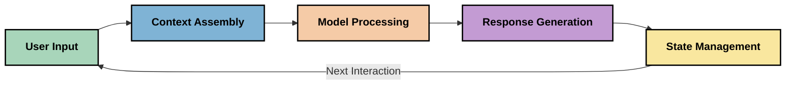
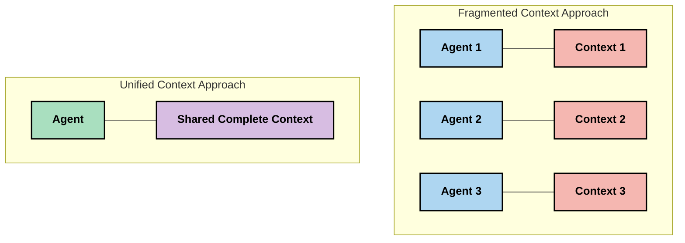
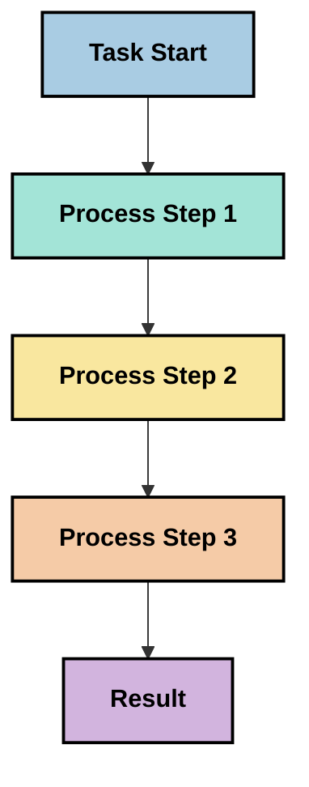
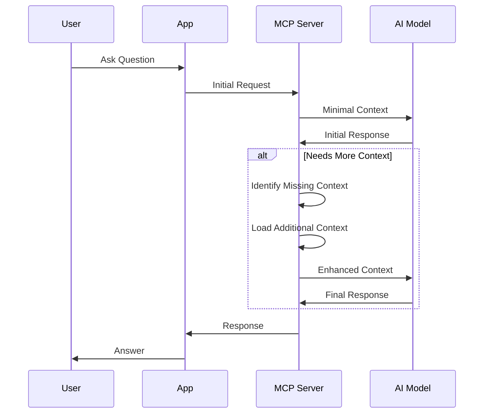
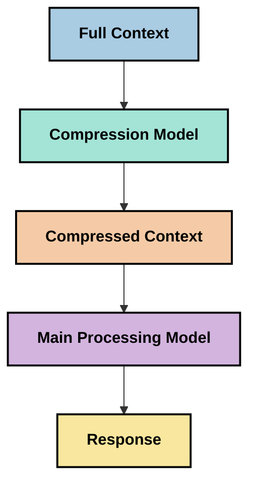

<!--
CO_OP_TRANSLATOR_METADATA:
{
  "original_hash": "fd169ca3071b81b5ee282e194bc823df",
  "translation_date": "2025-09-15T20:01:21+00:00",
  "source_file": "05-AdvancedTopics/mcp-contextengineering/README.md",
  "language_code": "ko"
}
-->
# 컨텍스트 엔지니어링: MCP 생태계에서 떠오르는 개념

## 개요

컨텍스트 엔지니어링은 AI 분야에서 새롭게 떠오르는 개념으로, 클라이언트와 AI 서비스 간의 상호작용에서 정보가 어떻게 구조화되고 전달되며 유지되는지를 탐구합니다. 모델 컨텍스트 프로토콜(MCP) 생태계가 발전함에 따라, 컨텍스트를 효과적으로 관리하는 방법을 이해하는 것이 점점 더 중요해지고 있습니다. 이 모듈은 컨텍스트 엔지니어링의 개념을 소개하고 MCP 구현에서의 잠재적 응용을 탐구합니다.

## 학습 목표

이 모듈을 완료하면 다음을 수행할 수 있습니다:

- 컨텍스트 엔지니어링의 개념과 MCP 응용에서의 잠재적 역할을 이해하기
- MCP 프로토콜 설계가 해결하는 컨텍스트 관리의 주요 과제를 식별하기
- 더 나은 컨텍스트 처리를 통해 모델 성능을 향상시키는 기술 탐구하기
- 컨텍스트 효과성을 측정하고 평가하는 접근법 고려하기
- MCP 프레임워크를 통해 AI 경험을 개선하기 위해 이러한 새로운 개념 적용하기

## 컨텍스트 엔지니어링 소개

컨텍스트 엔지니어링은 사용자, 애플리케이션, AI 모델 간의 정보 흐름을 의도적으로 설계하고 관리하는 데 초점을 맞춘 새로운 개념입니다. 프롬프트 엔지니어링과 같은 기존 분야와 달리, 컨텍스트 엔지니어링은 AI 모델에 적시에 적절한 정보를 제공하는 독특한 과제를 해결하려는 실무자들에 의해 아직 정의되고 있는 단계입니다.

대규모 언어 모델(LLM)이 발전함에 따라 컨텍스트의 중요성이 점점 더 명확해지고 있습니다. 우리가 제공하는 컨텍스트의 품질, 관련성, 구조는 모델 출력에 직접적인 영향을 미칩니다. 컨텍스트 엔지니어링은 이 관계를 탐구하고 효과적인 컨텍스트 관리를 위한 원칙을 개발하려고 합니다.

> "2025년에는 모델들이 매우 지능적입니다. 하지만 가장 똑똑한 사람이라도 자신이 해야 할 일을 이해하는 컨텍스트 없이는 효과적으로 일을 수행할 수 없습니다... '컨텍스트 엔지니어링'은 프롬프트 엔지니어링의 다음 단계입니다. 이는 동적 시스템에서 이를 자동으로 수행하는 것입니다." — Walden Yan, Cognition AI

컨텍스트 엔지니어링은 다음을 포함할 수 있습니다:

1. **컨텍스트 선택**: 특정 작업에 적합한 정보를 결정하기
2. **컨텍스트 구조화**: 모델 이해를 극대화하기 위해 정보를 조직화하기
3. **컨텍스트 전달**: 정보가 모델에 전달되는 방식과 시점을 최적화하기
4. **컨텍스트 유지**: 시간에 따라 컨텍스트의 상태와 진화를 관리하기
5. **컨텍스트 평가**: 컨텍스트의 효과성을 측정하고 개선하기

이러한 초점 영역은 특히 LLM에 컨텍스트를 제공하는 표준화된 방법을 제공하는 MCP 생태계와 관련이 있습니다.

## 컨텍스트 여정 관점

컨텍스트 엔지니어링을 시각화하는 한 가지 방법은 MCP 시스템을 통해 정보가 이동하는 여정을 추적하는 것입니다:



### 컨텍스트 여정의 주요 단계:

1. **사용자 입력**: 사용자로부터의 원시 정보(텍스트, 이미지, 문서)
2. **컨텍스트 조립**: 사용자 입력을 시스템 컨텍스트, 대화 기록 및 기타 검색된 정보와 결합하기
3. **모델 처리**: AI 모델이 조립된 컨텍스트를 처리하기
4. **응답 생성**: 모델이 제공된 컨텍스트를 기반으로 출력 생성하기
5. **상태 관리**: 시스템이 상호작용을 기반으로 내부 상태를 업데이트하기

이 관점은 AI 시스템에서 컨텍스트의 역동적인 특성을 강조하며 각 단계에서 정보를 최적으로 관리하는 방법에 대한 중요한 질문을 제기합니다.

## 컨텍스트 엔지니어링의 떠오르는 원칙

컨텍스트 엔지니어링 분야가 형성됨에 따라 실무자들로부터 몇 가지 초기 원칙이 나타나고 있습니다. 이러한 원칙은 MCP 구현 선택에 정보를 제공하는 데 도움이 될 수 있습니다.

### 원칙 1: 컨텍스트를 완전히 공유하기

컨텍스트는 시스템의 모든 구성 요소 간에 완전히 공유되어야 하며, 여러 에이전트나 프로세스에 분산되지 않아야 합니다. 컨텍스트가 분산되면 시스템의 한 부분에서 내린 결정이 다른 곳에서 내린 결정과 충돌할 수 있습니다.



MCP 응용에서는 컨텍스트가 여러 부분으로 나뉘는 대신 전체 파이프라인을 통해 원활하게 흐르도록 설계하는 것이 좋습니다.

### 원칙 2: 행동이 암묵적 결정을 포함한다는 점을 인식하기

모델이 취하는 각 행동은 컨텍스트를 해석하는 방법에 대한 암묵적 결정을 포함합니다. 여러 구성 요소가 서로 다른 컨텍스트에서 작동하면 이러한 암묵적 결정이 충돌하여 일관되지 않은 결과를 초래할 수 있습니다.

이 원칙은 MCP 응용에 중요한 영향을 미칩니다:
- 복잡한 작업의 병렬 실행 대신 선형 처리를 선호하기
- 모든 의사 결정 지점이 동일한 컨텍스트 정보를 사용할 수 있도록 보장하기
- 후속 단계가 이전 결정의 전체 컨텍스트를 볼 수 있도록 시스템 설계하기

### 원칙 3: 컨텍스트 깊이와 윈도우 제한 간의 균형 유지하기

대화와 프로세스가 길어질수록 컨텍스트 윈도우가 결국 넘쳐납니다. 효과적인 컨텍스트 엔지니어링은 포괄적인 컨텍스트와 기술적 제한 간의 긴장을 관리하는 접근법을 탐구합니다.

탐구 중인 잠재적 접근법은 다음을 포함합니다:
- 토큰 사용을 줄이면서 필수 정보를 유지하는 컨텍스트 압축
- 현재 필요에 따라 관련성을 기준으로 컨텍스트를 점진적으로 로드하기
- 이전 상호작용을 요약하면서 주요 결정과 사실을 보존하기

## 컨텍스트 과제와 MCP 프로토콜 설계

모델 컨텍스트 프로토콜(MCP)은 컨텍스트 관리의 독특한 과제를 인식하여 설계되었습니다. 이러한 과제를 이해하면 MCP 프로토콜 설계의 주요 측면을 설명하는 데 도움이 됩니다:

### 과제 1: 컨텍스트 윈도우 제한
대부분의 AI 모델은 고정된 컨텍스트 윈도우 크기를 가지며, 한 번에 처리할 수 있는 정보의 양이 제한됩니다.

**MCP 설계 응답:** 
- 프로토콜은 효율적으로 참조할 수 있는 구조화된 리소스 기반 컨텍스트를 지원합니다.
- 리소스는 페이지로 나뉘어 점진적으로 로드될 수 있습니다.

### 과제 2: 관련성 결정
컨텍스트에 포함할 정보 중 가장 관련성이 높은 것을 결정하는 것은 어렵습니다.

**MCP 설계 응답:**
- 필요에 따라 정보를 동적으로 검색할 수 있는 유연한 도구 제공
- 일관된 컨텍스트 조직을 가능하게 하는 구조화된 프롬프트 제공

### 과제 3: 컨텍스트 지속성
상호작용 간 상태를 관리하려면 컨텍스트를 신중하게 추적해야 합니다.

**MCP 설계 응답:**
- 표준화된 세션 관리
- 컨텍스트 진화를 위한 명확히 정의된 상호작용 패턴

### 과제 4: 멀티모달 컨텍스트
텍스트, 이미지, 구조화된 데이터와 같은 다양한 유형의 데이터는 서로 다른 처리가 필요합니다.

**MCP 설계 응답:**
- 다양한 콘텐츠 유형을 수용하는 프로토콜 설계
- 멀티모달 정보를 표준화된 방식으로 표현

### 과제 5: 보안 및 개인정보 보호
컨텍스트는 종종 보호해야 할 민감한 정보를 포함합니다.

**MCP 설계 응답:**
- 클라이언트와 서버 간 책임의 명확한 경계 설정
- 데이터 노출을 최소화하기 위한 로컬 처리 옵션 제공

이러한 과제를 이해하고 MCP가 이를 해결하는 방법을 알면 더 발전된 컨텍스트 엔지니어링 기술을 탐구할 수 있는 기반을 제공합니다.

## 떠오르는 컨텍스트 엔지니어링 접근법

컨텍스트 엔지니어링 분야가 발전함에 따라 몇 가지 유망한 접근법이 나타나고 있습니다. 이는 현재의 사고를 반영하며, 확립된 모범 사례가 아니라 MCP 구현 경험이 축적됨에 따라 진화할 가능성이 있습니다.

### 1. 단일 스레드 선형 처리

컨텍스트를 분산하는 멀티 에이전트 아키텍처와는 달리, 일부 실무자들은 단일 스레드 선형 처리가 더 일관된 결과를 생성한다고 보고 있습니다. 이는 통합된 컨텍스트를 유지하는 원칙과 일치합니다.



이 접근법은 병렬 처리보다 덜 효율적으로 보일 수 있지만, 각 단계가 이전 결정의 완전한 이해를 기반으로 구축되기 때문에 더 일관되고 신뢰할 수 있는 결과를 생성하는 경우가 많습니다.

### 2. 컨텍스트 청킹 및 우선순위 설정

큰 컨텍스트를 관리 가능한 조각으로 나누고 가장 중요한 부분에 우선순위를 부여하기.

```python
# Conceptual Example: Context Chunking and Prioritization
def process_with_chunked_context(documents, query):
    # 1. Break documents into smaller chunks
    chunks = chunk_documents(documents)
    
    # 2. Calculate relevance scores for each chunk
    scored_chunks = [(chunk, calculate_relevance(chunk, query)) for chunk in chunks]
    
    # 3. Sort chunks by relevance score
    sorted_chunks = sorted(scored_chunks, key=lambda x: x[1], reverse=True)
    
    # 4. Use the most relevant chunks as context
    context = create_context_from_chunks([chunk for chunk, score in sorted_chunks[:5]])
    
    # 5. Process with the prioritized context
    return generate_response(context, query)
```

위 개념은 큰 문서를 관리 가능한 조각으로 나누고 컨텍스트에 가장 관련성이 높은 부분만 선택하는 방법을 보여줍니다. 이 접근법은 컨텍스트 윈도우 제한 내에서 작업하면서도 대규모 지식 기반을 활용하는 데 도움이 될 수 있습니다.

### 3. 점진적 컨텍스트 로딩

컨텍스트를 한 번에 모두 로드하지 않고 필요에 따라 점진적으로 로드하기.



점진적 컨텍스트 로딩은 최소한의 컨텍스트로 시작하여 필요할 때만 확장합니다. 이는 간단한 쿼리에 대해 토큰 사용을 크게 줄이면서 복잡한 질문을 처리할 수 있는 능력을 유지할 수 있습니다.

### 4. 컨텍스트 압축 및 요약

필수 정보를 보존하면서 컨텍스트 크기를 줄이기.



컨텍스트 압축은 다음에 초점을 맞춥니다:
- 중복 정보 제거
- 긴 콘텐츠 요약
- 주요 사실과 세부 사항 추출
- 중요한 컨텍스트 요소 보존
- 토큰 효율성을 최적화

이 접근법은 긴 대화를 컨텍스트 윈도우 내에서 유지하거나 대규모 문서를 효율적으로 처리하는 데 특히 유용할 수 있습니다. 일부 실무자들은 대화 기록의 컨텍스트 압축 및 요약을 위해 전문화된 모델을 사용하고 있습니다.

## 탐구적 컨텍스트 엔지니어링 고려사항

MCP 구현에서 컨텍스트 엔지니어링의 새로운 분야를 탐구할 때, 특정 사용 사례에서 개선을 가져올 수 있는 몇 가지 고려사항을 염두에 두는 것이 좋습니다. 이는 규범적인 모범 사례가 아니라 탐구 영역으로, 개선 가능성을 제시합니다.

### 컨텍스트 목표를 고려하기

복잡한 컨텍스트 관리 솔루션을 구현하기 전에 달성하려는 목표를 명확히 표현하십시오:
- 모델이 성공하기 위해 필요한 특정 정보는 무엇인가?
- 필수 정보와 보조 정보는 무엇인가?
- 성능 제약(지연 시간, 토큰 제한, 비용)은 무엇인가?

### 계층화된 컨텍스트 접근법 탐구하기

일부 실무자들은 개념적 계층으로 배열된 컨텍스트에서 성공을 찾고 있습니다:
- **핵심 계층**: 모델이 항상 필요로 하는 필수 정보
- **상황 계층**: 현재 상호작용에 특정한 컨텍스트
- **지원 계층**: 도움이 될 수 있는 추가 정보
- **백업 계층**: 필요할 때만 접근하는 정보

### 검색 전략 조사하기

컨텍스트의 효과는 정보를 검색하는 방법에 따라 달라질 수 있습니다:
- 개념적으로 관련성이 높은 정보를 찾기 위한 의미적 검색 및 임베딩
- 특정 사실적 세부 정보를 위한 키워드 기반 검색
- 여러 검색 방법을 결합한 하이브리드 접근법
- 범주, 날짜 또는 출처를 기준으로 범위를 좁히기 위한 메타데이터 필터링

### 컨텍스트 일관성 실험하기

컨텍스트의 구조와 흐름은 모델 이해에 영향을 미칠 수 있습니다:
- 관련 정보를 함께 그룹화하기
- 일관된 형식과 조직 사용하기
- 적절한 경우 논리적 또는 연대기적 순서를 유지하기
- 모순된 정보 피하기

### 멀티 에이전트 아키텍처의 트레이드오프 평가하기

멀티 에이전트 아키텍처는 많은 AI 프레임워크에서 인기가 있지만, 컨텍스트 관리에 상당한 과제를 수반합니다:
- 컨텍스트 분산은 에이전트 간의 결정 불일치를 초래할 수 있습니다.
- 병렬 처리는 조정하기 어려운 충돌을 초래할 수 있습니다.
- 에이전트 간의 통신 오버헤드는 성능 이점을 상쇄할 수 있습니다.
- 일관성을 유지하기 위해 복잡한 상태 관리가 필요합니다.

많은 경우, 단일 에이전트 접근법과 포괄적인 컨텍스트 관리가 분산된 컨텍스트를 가진 여러 전문 에이전트보다 더 신뢰할 수 있는 결과를 생성할 수 있습니다.

### 평가 방법 개발하기

시간이 지남에 따라 컨텍스트 엔지니어링을 개선하려면 성공을 측정할 방법을 고려하십시오:
- 다양한 컨텍스트 구조를 A/B 테스트하기
- 토큰 사용 및 응답 시간 모니터링하기
- 사용자 만족도 및 작업 완료율 추적하기
- 컨텍스트 전략이 실패하는 시점과 이유 분석하기

이러한 고려사항은 컨텍스트 엔지니어링 공간에서의 적극적인 탐구 영역을 나타냅니다. 분야가 성숙해지면 더 명확한 패턴과 관행이 나타날 가능성이 높습니다.

## 컨텍스트 효과성 측정: 진화하는 프레임워크

컨텍스트 엔지니어링이 개념으로 떠오르면서 실무자들은 효과성을 측정할 방법을 탐구하기 시작했습니다. 아직 확립된 프레임워크는 없지만, 미래 작업을 안내할 수 있는 다양한 지표가 고려되고 있습니다.

### 잠재적 측정 차원

#### 1. 입력 효율성 고려사항

- **컨텍스트 대 응답 비율**: 응답 크기에 비해 얼마나 많은 컨텍스트가 필요한가?
- **토큰 활용도**: 제공된 컨텍스트 토큰 중 응답에 영향을 미치는 비율은 얼마인가?
- **컨텍스트 축소**: 원시 정보를 얼마나 효과적으로 압축할 수 있는가?

#### 2. 성능 고려사항

- **지연 시간 영향**: 컨텍스트 관리가 응답 시간에 어떤 영향을 미치는가?
- **토큰 경제성**: 토큰 사용을 효과적으로 최적화하고 있는가?
- **검색 정확도**: 검색된 정보의 관련성은 얼마나 높은가?
- **자원 활용도**: 필요한 계산 자원은 무엇인가?

#### 3. 품질 고려사항

- **응답 관련성**: 응답이 쿼리를 얼마나 잘 해결하는가?
- **사실적 정확성**: 컨텍스트 관리가 사실적 정확성을 개선하는가?
- **일관성**: 유사한 쿼리에서 응답이 일관적인가?
- **환각률**: 더 나은 컨텍스트가 모델 환각을 줄이는가?

#### 4. 사용자 경험 고려사항

- **후속 요청 비율**: 사용자가 얼마나 자주 명확성을 요구하는가?
- **작업 완료율**: 사용자가 목표를 성공적으로 달성하는가?
- **만족도 지표**: 사용자가 경험을 어떻게 평가하는가?

### 측정에 대한 탐구적 접근법

MCP 구현에서 컨텍스트 엔지니어링을 실험할 때, 다음 탐구적 접근법을 고려하십시오:

1. **기준 비교**: 간단한 컨텍스트 접근법으로 기준을 설정한 후 더 정교한 방법을 테스트하기

2. **점진적 변화**: 컨텍스트 관리의 한 측면만 변경하여 그 효과를 분리하기

3. **사용자 중심 평가**: 정량적 지표와 사용자 피드백을 결합하기

4. **실패 분석**: 컨텍스트 전략이 실패하는 사례를 조사하여 잠재적 개선 사항 이해하기

5. **다차원 평가**: 효율성, 품질, 사용자 경험 간의 트레이드오프 고려하기

이 실험적이고 다각적인 측정 접근법은 컨텍스트 엔지니어링의 떠오르는 특성과 일치합니다.

## 마무리 생각

컨텍스트 엔지니어링은 MCP 응용을 효과적으로 구현하는 데 중심이 될 수 있는 새로운 탐구 영역입니다. 시스템을 통해 정보가 흐르는 방식을 신중히 고려함으로써 더 효율적이고 정확하며 사용자에게 가치 있는 AI 경험을 창출할 수 있습니다.

이 모듈에서 설명한 기술과 접근법은 이 공간에서 초기 사고를 나타내며, 확립된 관행이 아닙니다. 컨텍스트 엔지니어링은 AI 능력이 발전하고 우리의 이해가 깊어짐에 따라 더 정의된 학문으로 발전할 수 있습니다. 현재로서는 신중한 측정과 실험이 가장 생산적인 접근법으로 보입니다.

## 잠재적 미래 방향

컨텍스트 엔
- [Model Context Protocol Website](https://modelcontextprotocol.io/)
- [Model Context Protocol Specification](https://github.com/modelcontextprotocol/modelcontextprotocol)
- [MCP Documentation](https://modelcontextprotocol.io/docs)
- [MCP C# SDK](https://github.com/modelcontextprotocol/csharp-sdk)
- [MCP Python SDK](https://github.com/modelcontextprotocol/python-sdk)
- [MCP TypeScript SDK](https://github.com/modelcontextprotocol/typescript-sdk)
- [MCP Inspector](https://github.com/modelcontextprotocol/inspector) - MCP 서버를 위한 시각적 테스트 도구

### 컨텍스트 엔지니어링 관련 글
- [Don't Build Multi-Agents: Principles of Context Engineering](https://cognition.ai/blog/dont-build-multi-agents) - 컨텍스트 엔지니어링 원칙에 대한 Walden Yan의 통찰
- [A Practical Guide to Building Agents](https://cdn.openai.com/business-guides-and-resources/a-practical-guide-to-building-agents.pdf) - 효과적인 에이전트 설계에 대한 OpenAI의 가이드
- [Building Effective Agents](https://www.anthropic.com/engineering/building-effective-agents) - 에이전트 개발에 대한 Anthropic의 접근법

### 관련 연구
- [Dynamic Retrieval Augmentation for Large Language Models](https://arxiv.org/abs/2310.01487) - 동적 검색 접근법에 대한 연구
- [Lost in the Middle: How Language Models Use Long Contexts](https://arxiv.org/abs/2307.03172) - 컨텍스트 처리 패턴에 대한 중요한 연구
- [Hierarchical Text-Conditioned Image Generation with CLIP Latents](https://arxiv.org/abs/2204.06125) - 컨텍스트 구조화에 대한 통찰을 제공하는 DALL-E 2 논문
- [Exploring the Role of Context in Large Language Model Architectures](https://aclanthology.org/2023.findings-emnlp.124/) - 컨텍스트 처리에 대한 최신 연구
- [Multi-Agent Collaboration: A Survey](https://arxiv.org/abs/2304.03442) - 다중 에이전트 시스템과 그 도전에 대한 연구

### 추가 자료
- [Context Window Optimization Techniques](https://learn.microsoft.com/en-us/azure/ai-services/openai/concepts/context-window)
- [Advanced RAG Techniques](https://www.microsoft.com/en-us/research/blog/retrieval-augmented-generation-rag-and-frontier-models/)
- [Semantic Kernel Documentation](https://github.com/microsoft/semantic-kernel)
- [AI Toolkit for Context Management](https://github.com/microsoft/aitoolkit)

## 다음 단계

- [5.15 MCP Custom Transport](../mcp-transport/README.md)

---

**면책 조항**:  
이 문서는 AI 번역 서비스 [Co-op Translator](https://github.com/Azure/co-op-translator)를 사용하여 번역되었습니다. 정확성을 위해 최선을 다하고 있으나, 자동 번역에는 오류나 부정확한 내용이 포함될 수 있습니다. 원본 문서의 원어 버전이 권위 있는 출처로 간주되어야 합니다. 중요한 정보의 경우, 전문적인 인간 번역을 권장합니다. 이 번역 사용으로 인해 발생하는 오해나 잘못된 해석에 대해 당사는 책임을 지지 않습니다.