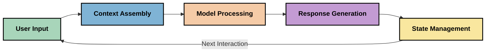
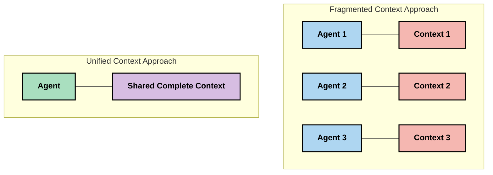
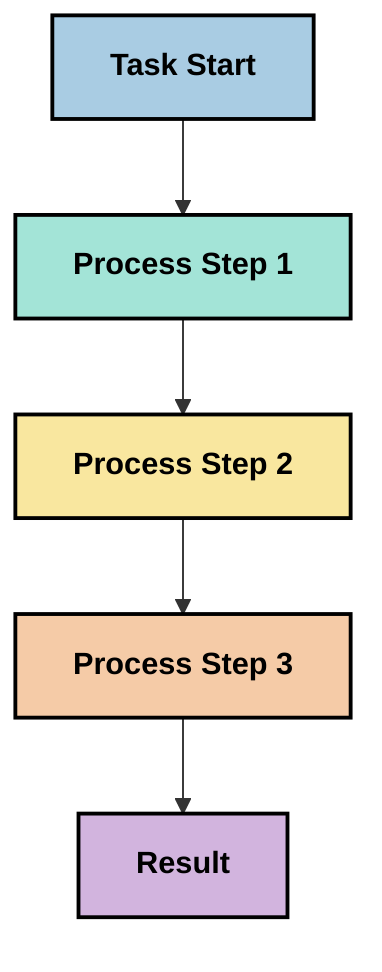
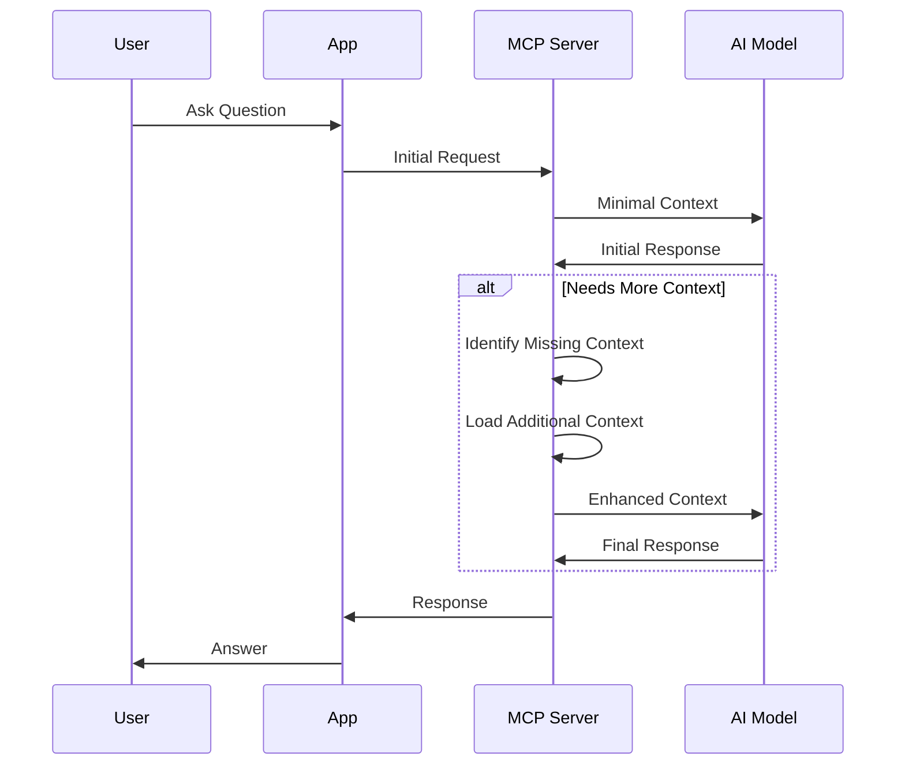
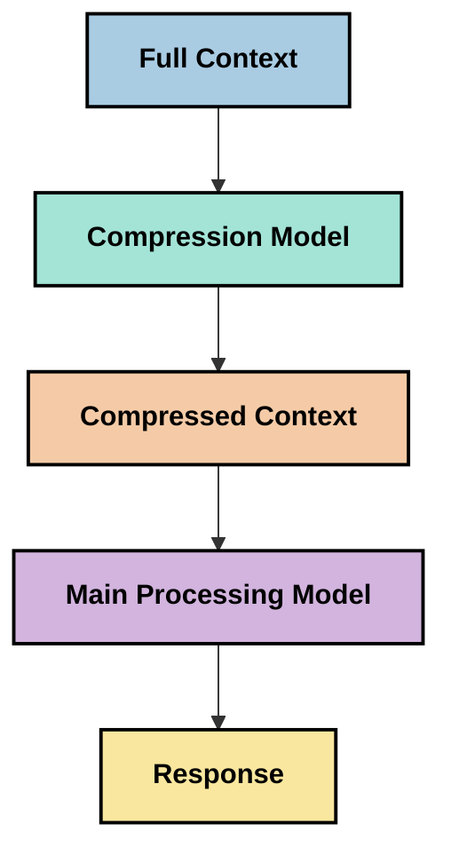

<!--
CO_OP_TRANSLATOR_METADATA:
{
  "original_hash": "5762e8e74dd99d8b7dbb31e69a82561e",
  "translation_date": "2025-07-16T22:59:11+00:00",
  "source_file": "05-AdvancedTopics/mcp-contextengineering/README.md",
  "language_code": "ko"
}
-->
# Context Engineering: MCP 생태계에서 떠오르는 개념

## 개요

Context engineering은 AI 분야에서 떠오르는 개념으로, 클라이언트와 AI 서비스 간 상호작용에서 정보가 어떻게 구조화되고 전달되며 유지되는지를 탐구합니다. Model Context Protocol(MCP) 생태계가 발전함에 따라, 효과적인 컨텍스트 관리 방법을 이해하는 것이 점점 더 중요해지고 있습니다. 이 모듈에서는 컨텍스트 엔지니어링 개념을 소개하고 MCP 구현에서의 잠재적 활용 방안을 살펴봅니다.

## 학습 목표

이 모듈을 마치면 다음을 할 수 있습니다:

- 컨텍스트 엔지니어링이라는 새로운 개념과 MCP 애플리케이션에서의 역할 이해
- MCP 프로토콜 설계가 해결하는 컨텍스트 관리의 주요 과제 파악
- 더 나은 컨텍스트 처리를 통한 모델 성능 향상 기법 탐색
- 컨텍스트 효과성을 측정하고 평가하는 방법 고려
- MCP 프레임워크를 통해 AI 경험을 개선하는 데 이 개념 적용

## 컨텍스트 엔지니어링 소개

컨텍스트 엔지니어링은 사용자, 애플리케이션, AI 모델 간 정보 흐름을 의도적으로 설계하고 관리하는 데 초점을 맞춘 새로운 개념입니다. 프롬프트 엔지니어링과 같은 기존 분야와 달리, 컨텍스트 엔지니어링은 AI 모델에 적절한 정보를 적시에 제공하는 고유한 문제를 해결하기 위해 실무자들이 정의해 나가고 있습니다.

대형 언어 모델(LLM)이 발전하면서 컨텍스트의 중요성은 더욱 명확해졌습니다. 우리가 제공하는 컨텍스트의 품질, 적합성, 구조가 모델 출력에 직접적인 영향을 미치기 때문입니다. 컨텍스트 엔지니어링은 이 관계를 탐구하고 효과적인 컨텍스트 관리를 위한 원칙을 개발하고자 합니다.

> "2025년에는 모델들이 매우 지능적입니다. 하지만 가장 똑똑한 사람도 자신이 해야 할 일을 이해하는 컨텍스트 없이는 효과적으로 일할 수 없습니다... '컨텍스트 엔지니어링'은 프롬프트 엔지니어링의 다음 단계입니다. 동적인 시스템에서 이를 자동으로 수행하는 것입니다." — Walden Yan, Cognition AI

컨텍스트 엔지니어링은 다음을 포함할 수 있습니다:

1. **컨텍스트 선택**: 특정 작업에 적합한 정보를 결정
2. **컨텍스트 구조화**: 모델 이해도를 극대화하도록 정보 조직
3. **컨텍스트 전달**: 정보가 모델에 전달되는 방식과 시기 최적화
4. **컨텍스트 유지**: 시간에 따른 상태 및 컨텍스트 변화 관리
5. **컨텍스트 평가**: 컨텍스트 효과성 측정 및 개선

이러한 영역은 LLM에 컨텍스트를 제공하는 표준화된 방식을 제공하는 MCP 생태계와 특히 관련이 깊습니다.

## 컨텍스트 여정 관점

컨텍스트 엔지니어링을 시각화하는 한 방법은 MCP 시스템 내에서 정보가 이동하는 경로를 추적하는 것입니다:



### 컨텍스트 여정의 주요 단계:

1. **사용자 입력**: 사용자로부터 받은 원시 정보(텍스트, 이미지, 문서)
2. **컨텍스트 조립**: 사용자 입력과 시스템 컨텍스트, 대화 기록, 기타 검색된 정보 결합
3. **모델 처리**: AI 모델이 조립된 컨텍스트를 처리
4. **응답 생성**: 제공된 컨텍스트를 바탕으로 모델이 출력 생성
5. **상태 관리**: 상호작용에 따라 시스템 내부 상태 업데이트

이 관점은 AI 시스템에서 컨텍스트가 동적으로 변화함을 보여주며, 각 단계에서 정보를 어떻게 최적으로 관리할지에 대한 중요한 질문을 제기합니다.

## 컨텍스트 엔지니어링의 초기 원칙

컨텍스트 엔지니어링 분야가 형성되면서 실무자들 사이에서 몇 가지 초기 원칙이 나타나고 있습니다. 이 원칙들은 MCP 구현 선택에 도움이 될 수 있습니다:

### 원칙 1: 컨텍스트를 완전하게 공유하라

컨텍스트는 시스템 내 모든 구성 요소 간에 완전하게 공유되어야 하며, 여러 에이전트나 프로세스에 분산되어서는 안 됩니다. 컨텍스트가 분산되면 시스템의 한 부분에서 내린 결정이 다른 부분과 충돌할 수 있습니다.



MCP 애플리케이션에서는 컨텍스트가 파이프라인 전체를 원활하게 흐르도록 설계하는 것이 중요합니다.

### 원칙 2: 행동에는 암묵적 결정이 포함되어 있음을 인식하라

모델이 수행하는 각 행동은 컨텍스트를 해석하는 암묵적 결정을 내포합니다. 여러 구성 요소가 서로 다른 컨텍스트에 따라 행동하면 이러한 암묵적 결정이 충돌하여 일관성 없는 결과가 발생할 수 있습니다.

이 원칙은 MCP 애플리케이션에 다음과 같은 시사점을 줍니다:
- 분산된 컨텍스트를 가진 병렬 실행보다 복잡한 작업은 선형 처리 선호
- 모든 의사결정 지점이 동일한 컨텍스트 정보에 접근 가능하도록 보장
- 후속 단계가 이전 결정의 전체 컨텍스트를 볼 수 있도록 시스템 설계

### 원칙 3: 컨텍스트 깊이와 윈도우 제한 간 균형 유지

대화와 프로세스가 길어질수록 컨텍스트 윈도우가 넘치게 됩니다. 효과적인 컨텍스트 엔지니어링은 포괄적인 컨텍스트와 기술적 한계 사이의 균형을 관리하는 방법을 탐구합니다.

탐색 중인 접근법에는 다음이 포함됩니다:
- 토큰 사용량을 줄이면서 핵심 정보를 유지하는 컨텍스트 압축
- 현재 필요에 따라 점진적으로 컨텍스트 로딩
- 주요 결정과 사실을 보존하면서 이전 상호작용 요약

## 컨텍스트 과제와 MCP 프로토콜 설계

Model Context Protocol(MCP)은 컨텍스트 관리의 고유한 과제를 인식하고 설계되었습니다. 이러한 과제를 이해하면 MCP 프로토콜 설계의 핵심 측면을 이해하는 데 도움이 됩니다:

### 과제 1: 컨텍스트 윈도우 제한

대부분 AI 모델은 고정된 컨텍스트 윈도우 크기를 가지며, 한 번에 처리할 수 있는 정보량이 제한됩니다.

**MCP 설계 대응:**  
- 효율적으로 참조할 수 있는 구조화된 리소스 기반 컨텍스트 지원  
- 리소스 페이지네이션 및 점진적 로딩 가능

### 과제 2: 관련성 판단

컨텍스트에 포함할 가장 관련성 높은 정보를 결정하는 것이 어렵습니다.

**MCP 설계 대응:**  
- 필요에 따라 동적으로 정보를 검색할 수 있는 유연한 도구 제공  
- 일관된 컨텍스트 구성을 위한 구조화된 프롬프트 지원

### 과제 3: 컨텍스트 지속성

상호작용 간 상태를 관리하려면 컨텍스트를 신중히 추적해야 합니다.

**MCP 설계 대응:**  
- 표준화된 세션 관리  
- 컨텍스트 진화를 위한 명확한 상호작용 패턴 정의

### 과제 4: 멀티모달 컨텍스트

텍스트, 이미지, 구조화된 데이터 등 다양한 유형의 데이터를 다르게 처리해야 합니다.

**MCP 설계 대응:**  
- 다양한 콘텐츠 유형을 수용하는 프로토콜 설계  
- 멀티모달 정보의 표준화된 표현

### 과제 5: 보안 및 개인정보 보호

컨텍스트에는 종종 민감한 정보가 포함되어 있어 보호가 필요합니다.

**MCP 설계 대응:**  
- 클라이언트와 서버 책임 간 명확한 경계 설정  
- 데이터 노출 최소화를 위한 로컬 처리 옵션 제공

이러한 과제와 MCP가 이를 해결하는 방식을 이해하면 더 발전된 컨텍스트 엔지니어링 기법을 탐구하는 기반이 됩니다.

## 떠오르는 컨텍스트 엔지니어링 접근법

컨텍스트 엔지니어링 분야가 발전하면서 몇 가지 유망한 접근법이 나타나고 있습니다. 이들은 확립된 최선의 관행이라기보다는 현재의 사고를 반영하며, MCP 구현 경험이 쌓이면서 진화할 것입니다.

### 1. 단일 스레드 선형 처리

컨텍스트를 분산하는 다중 에이전트 아키텍처와 달리, 일부 실무자들은 단일 스레드 선형 처리가 더 일관된 결과를 낸다는 것을 발견했습니다. 이는 통합된 컨텍스트 유지 원칙과 일치합니다.



이 접근법은 병렬 처리보다 비효율적으로 보일 수 있지만, 각 단계가 이전 결정에 대한 완전한 이해를 바탕으로 진행되기 때문에 더 일관되고 신뢰할 수 있는 결과를 자주 만들어냅니다.

### 2. 컨텍스트 청킹 및 우선순위 지정

큰 컨텍스트를 관리 가능한 조각으로 나누고 가장 중요한 부분을 우선 선택하는 방법입니다.

```python
# Conceptual Example: Context Chunking and Prioritization
def process_with_chunked_context(documents, query):
    # 1. Break documents into smaller chunks
    chunks = chunk_documents(documents)
    
    # 2. Calculate relevance scores for each chunk
    scored_chunks = [(chunk, calculate_relevance(chunk, query)) for chunk in chunks]
    
    # 3. Sort chunks by relevance score
    sorted_chunks = sorted(scored_chunks, key=lambda x: x[1], reverse=True)
    
    # 4. Use the most relevant chunks as context
    context = create_context_from_chunks([chunk for chunk, score in sorted_chunks[:5]])
    
    # 5. Process with the prioritized context
    return generate_response(context, query)
```

위 개념은 큰 문서를 관리 가능한 조각으로 나누고, 컨텍스트에 가장 관련성 높은 부분만 선택하는 방식을 보여줍니다. 이 방법은 컨텍스트 윈도우 제한 내에서 대규모 지식 기반을 활용하는 데 도움이 됩니다.

### 3. 점진적 컨텍스트 로딩

한꺼번에 모든 컨텍스트를 로드하는 대신 필요에 따라 점진적으로 로드하는 방법입니다.



점진적 컨텍스트 로딩은 최소한의 컨텍스트로 시작해 필요할 때만 확장합니다. 이는 간단한 쿼리에 대해 토큰 사용량을 크게 줄이면서도 복잡한 질문을 처리할 수 있는 능력을 유지합니다.

### 4. 컨텍스트 압축 및 요약

핵심 정보를 유지하면서 컨텍스트 크기를 줄이는 방법입니다.



컨텍스트 압축은 다음에 중점을 둡니다:  
- 중복 정보 제거  
- 긴 내용 요약  
- 주요 사실과 세부사항 추출  
- 중요한 컨텍스트 요소 보존  
- 토큰 효율성 최적화

이 방법은 긴 대화를 컨텍스트 윈도우 내에 유지하거나 대용량 문서를 효율적으로 처리하는 데 특히 유용합니다. 일부 실무자들은 대화 기록의 컨텍스트 압축과 요약을 위해 특화된 모델을 사용하기도 합니다.

## 탐색적 컨텍스트 엔지니어링 고려사항

컨텍스트 엔지니어링 분야를 탐색하면서 MCP 구현 시 염두에 두면 좋은 몇 가지 고려사항이 있습니다. 이는 권장되는 최선의 관행이 아니라, 특정 사용 사례에서 개선을 가져올 수 있는 탐색 영역입니다.

### 컨텍스트 목표 명확히 하기

복잡한 컨텍스트 관리 솔루션을 구현하기 전에 달성하려는 목표를 명확히 하세요:  
- 모델이 성공하기 위해 필요한 구체적 정보는 무엇인가?  
- 필수 정보와 보조 정보는 어떻게 구분되는가?  
- 성능 제약(지연 시간, 토큰 한도, 비용)은 무엇인가?

### 계층화된 컨텍스트 접근법 탐색

일부 실무자들은 개념적 계층으로 구성된 컨텍스트에서 성공을 거두고 있습니다:  
- **핵심 계층**: 모델이 항상 필요로 하는 필수 정보  
- **상황 계층**: 현재 상호작용에 특화된 컨텍스트  
- **지원 계층**: 도움이 될 수 있는 추가 정보  
- **대체 계층**: 필요할 때만 접근하는 정보

### 검색 전략 조사

컨텍스트의 효과는 정보를 어떻게 검색하느냐에 크게 좌우됩니다:  
- 개념적으로 관련된 정보를 찾기 위한 의미 기반 검색 및 임베딩  
- 특정 사실 정보를 위한 키워드 기반 검색  
- 여러 검색 방법을 결합한 하이브리드 접근  
- 카테고리, 날짜, 출처별 메타데이터 필터링으로 범위 좁히기

### 컨텍스트 일관성 실험

컨텍스트의 구조와 흐름이 모델 이해도에 영향을 줄 수 있습니다:  
- 관련 정보를 함께 그룹화  
- 일관된 형식과 조직 사용  
- 적절한 경우 논리적 또는 시간 순서 유지  
- 모순되는 정보 피하기

### 다중 에이전트 아키텍처의 장단점 평가

다중 에이전트 아키텍처는 많은 AI 프레임워크에서 인기가 있지만, 컨텍스트 관리에는 상당한 도전 과제가 있습니다:  
- 컨텍스트 분산으로 인해 에이전트 간 결정 불일치 발생 가능  
- 병렬 처리 시 조정하기 어려운 충돌 발생 가능  
- 에이전트 간 통신 오버헤드가 성능 이득 상쇄 가능  
- 일관성 유지를 위한 복잡한 상태 관리 필요

많은 경우, 단일 에이전트 접근법이 분산된 컨텍스트를 가진 여러 전문 에이전트보다 더 신뢰할 수 있는 결과를 낼 수 있습니다.

### 평가 방법 개발

컨텍스트 엔지니어링을 개선하려면 성공을 어떻게 측정할지 고려하세요:  
- 다양한 컨텍스트 구조에 대한 A/B 테스트  
- 토큰 사용량과 응답 시간 모니터링  
- 사용자 만족도 및 작업 완료율 추적  
- 컨텍스트 전략 실패 시점과 원인 분석

이러한 고려사항은 컨텍스트 엔지니어링 분야에서 활발히 탐구되고 있는 영역입니다. 분야가 성숙해지면서 더 명확한 패턴과 관행이 나타날 것입니다.

## 컨텍스트 효과성 측정: 진화하는 프레임워크

컨텍스트 엔지니어링이 개념으로 자리잡으면서, 실무자들은 그 효과를 어떻게 측정할지 탐구하기 시작했습니다. 아직 확립된 프레임워크는 없지만, 미래 연구를 안내할 수 있는 다양한 지표가 고려되고 있습니다.

### 잠재적 측정 차원

#### 1. 입력 효율성 고려사항

- **컨텍스트 대 응답 비율**: 응답 크기에 비해 얼마나 많은 컨텍스트가 필요한가?  
- **토큰 활용도**: 제공된 컨텍스트 토큰 중 응답에 영향을 준 비율은?  
- **컨텍스트 축소**: 원시 정보를 얼마나 효과적으로 압축할 수 있는가?

#### 2. 성능 고려사항

- **지연 시간 영향**: 컨텍스트 관리가 응답 시간에 미치는 영향  
- **토큰 경제성**: 토큰 사용을 얼마나 최적화하고 있는가?  
- **검색 정확도**: 검색된 정보의 관련성  
- **자원 활용도**: 필요한 계산 자원

#### 3. 품질 고려사항

- **응답 적합성**: 응답이 질문에 얼마나 잘 부합하는가?  
- **사실 정확성**: 컨텍스트 관리가 사실 정확도를 향상시키는가?  
- **일관성**: 유사한 질문에 대해 응답이 일관적인가?  
- **환각 발생률**: 더 나은 컨텍스트가 모델 환각을 줄이는가?

#### 4. 사용자 경험 고려사항

- **후속 질문 비율**: 사용자가 얼마나 자주 추가 설명을 요청하는가?  
- **작업 완료율**: 사용자가 목표를 성공적으로 달성하는가?  
- **만족도 지표**: 사용자가 경험을 어떻게 평가하는가?

### 탐색적 측정 접근법

MCP 구현에서 컨텍스트 엔지니어링을 실험할 때 다음과 같은 탐색적 접근법을 고려하세요:

1. **기본선 비교**: 복잡한 방법을 시도하기 전에 단순한 컨텍스트 접근법으로 기본선을 설정  
2. **점진적 변경**: 한 번에 한 가지 요소만 변경하여 효과 분리  
3. **사용자 중심 평가**: 정량적 지표와 정성적 사용자 피드백 결합  
4. **실패 분석**: 컨텍스트 전략 실패 사례를 분석하여 개선점 도출  
5. **다차원 평가**: 효율성, 품질, 사용자 경험 간 균형 고려

이러한 실험적이고 다면적인 측정 접근법은 컨텍스트 엔지니어링의 발전 단계와 잘 맞습니다.

## 마무리 생각

컨텍스트 엔지니어링은 효과적인 MCP 애플리케이션에 중심이 될 수 있는 떠오르는 탐구 분야입니다. 시스템 내 정보 흐름을 신중히 고려함으로써 더 효율적이고 정확하며 사용자에게 가치 있는 AI 경험을 만들 수 있습니다.

이 모듈에서 소개한 기법과 접근법은 이 분야의 초기 사고를 반영한 것이며, 확립된 관행은 아닙니다. AI 역량이 발전하고 이해가 깊어짐에 따라 컨텍스트 엔지니어링은 더 명확한 학문 분야로 발전할 수 있습니다. 현재로서는 실험과 신중한 측정이 가장 생산적인 접근법으로 보입니다.

## 향후 가능성 있는 방향

컨텍스트 엔지니어링 분야는 아직 초기 단계지만, 다음과 같은 유망한 방향이 나타나고 있습니다:

- 컨텍스트 엔지니어링 원칙이 모델 성능, 효율성, 사용자 경험, 신뢰성에 큰 영향을 미칠 수 있음  
- 포괄적 컨텍스트 관리를 갖춘 단일 스레드 접근법이 많은 경우 다중 에이전트 아키텍처보다 우수할 수 있음  
- 특화된 컨텍스트 압축 모델이 AI 파이프라인의 표준 구성 요소가 될 가능성  
- 컨텍스트 완전성과 토큰 제한 간 긴장이 컨텍스트 처리 혁신을 촉진할 것  
- 모델이 효율적이고 인간과 유사한 소통 능력을 갖추면서 진
- [Model Context Protocol 웹사이트](https://modelcontextprotocol.io/)
- [Model Context Protocol 명세서](https://github.com/modelcontextprotocol/modelcontextprotocol)
- [MCP 문서](https://modelcontextprotocol.io/docs)
- [MCP C# SDK](https://github.com/modelcontextprotocol/csharp-sdk)
- [MCP Python SDK](https://github.com/modelcontextprotocol/python-sdk)
- [MCP TypeScript SDK](https://github.com/modelcontextprotocol/typescript-sdk)
- [MCP Inspector](https://github.com/modelcontextprotocol/inspector) - MCP 서버용 시각적 테스트 도구

### 컨텍스트 엔지니어링 관련 글
- [멀티 에이전트 구축하지 마세요: 컨텍스트 엔지니어링 원칙](https://cognition.ai/blog/dont-build-multi-agents) - Walden Yan의 컨텍스트 엔지니어링 원칙에 대한 통찰
- [에이전트 구축 실용 가이드](https://cdn.openai.com/business-guides-and-resources/a-practical-guide-to-building-agents.pdf) - OpenAI의 효과적인 에이전트 설계 가이드
- [효과적인 에이전트 구축](https://www.anthropic.com/engineering/building-effective-agents) - Anthropic의 에이전트 개발 접근법

### 관련 연구
- [대형 언어 모델을 위한 동적 검색 증강](https://arxiv.org/abs/2310.01487) - 동적 검색 기법에 관한 연구
- [중간에서 길을 잃다: 언어 모델이 긴 컨텍스트를 사용하는 방식](https://arxiv.org/abs/2307.03172) - 컨텍스트 처리 패턴에 관한 중요한 연구
- [CLIP 잠재공간을 활용한 계층적 텍스트 조건 이미지 생성](https://arxiv.org/abs/2204.06125) - DALL-E 2 논문, 컨텍스트 구조에 대한 통찰 제공
- [대형 언어 모델 아키텍처에서 컨텍스트의 역할 탐구](https://aclanthology.org/2023.findings-emnlp.124/) - 최근 컨텍스트 처리 연구
- [멀티 에이전트 협업: 개요](https://arxiv.org/abs/2304.03442) - 멀티 에이전트 시스템과 그 도전에 관한 연구

### 추가 자료
- [컨텍스트 윈도우 최적화 기법](https://learn.microsoft.com/en-us/azure/ai-services/openai/concepts/context-window)
- [고급 RAG 기법](https://www.microsoft.com/en-us/research/blog/retrieval-augmented-generation-rag-and-frontier-models/)
- [Semantic Kernel 문서](https://github.com/microsoft/semantic-kernel)
- [컨텍스트 관리를 위한 AI 툴킷](https://github.com/microsoft/aitoolkit)

## 다음 단계
- [6. 커뮤니티 기여](../../06-CommunityContributions/README.md)

**면책 조항**:  
이 문서는 AI 번역 서비스 [Co-op Translator](https://github.com/Azure/co-op-translator)를 사용하여 번역되었습니다. 정확성을 위해 최선을 다하고 있으나, 자동 번역에는 오류나 부정확한 부분이 있을 수 있음을 유의하시기 바랍니다. 원문은 해당 언어의 원본 문서가 권위 있는 출처로 간주되어야 합니다. 중요한 정보의 경우 전문적인 인간 번역을 권장합니다. 본 번역의 사용으로 인해 발생하는 오해나 잘못된 해석에 대해 당사는 책임을 지지 않습니다.