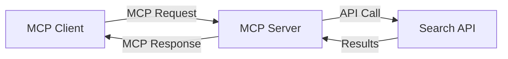
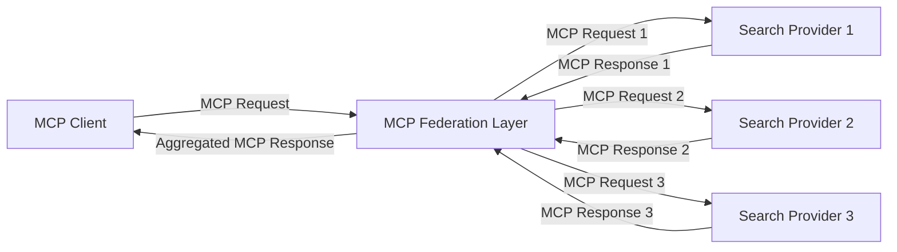
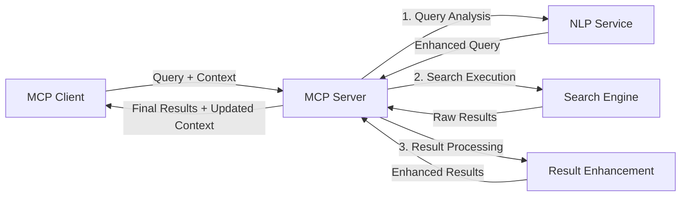

<!--
CO_OP_TRANSLATOR_METADATA:
{
  "original_hash": "333a03e51f90bdf3e6f1ba1694c73f36",
  "translation_date": "2025-07-16T21:48:09+00:00",
  "source_file": "05-AdvancedTopics/mcp-realtimesearch/README.md",
  "language_code": "ko"
}
-->
## 코드 예제 면책 조항

> **중요 참고**: 아래 코드 예제는 Model Context Protocol(MCP)과 웹 검색 기능의 통합을 보여줍니다. 공식 MCP SDK의 패턴과 구조를 따르지만 교육 목적으로 단순화되어 있습니다.
> 
> 이 예제들은 다음을 보여줍니다:
> 
> 1. **파이썬 구현**: FastMCP 서버 구현으로, 웹 검색 도구를 제공하고 외부 검색 API에 연결합니다. 이 예제는 [공식 MCP Python SDK](https://github.com/modelcontextprotocol/python-sdk)의 패턴을 따라 적절한 수명 주기 관리, 컨텍스트 처리, 도구 구현을 시연합니다. 서버는 프로덕션 배포에서 이전 SSE 전송 방식을 대체한 권장 Streamable HTTP 전송을 사용합니다.
> 
> 2. **자바스크립트 구현**: [공식 MCP TypeScript SDK](https://github.com/modelcontextprotocol/typescript-sdk)의 FastMCP 패턴을 활용한 TypeScript/JavaScript 구현으로, 적절한 도구 정의와 클라이언트 연결을 갖춘 검색 서버를 만듭니다. 최신 권장 세션 관리 및 컨텍스트 보존 패턴을 따릅니다.
> 
> 이 예제들은 프로덕션 환경에서는 추가적인 오류 처리, 인증, 특정 API 통합 코드가 필요합니다. 예시로 사용된 검색 API 엔드포인트(`https://api.search-service.example/search`)는 자리 표시자이며 실제 검색 서비스 엔드포인트로 교체해야 합니다.
> 
> 완전한 구현 세부사항과 최신 접근법은 [공식 MCP 명세](https://spec.modelcontextprotocol.io/)와 SDK 문서를 참고하시기 바랍니다.

## 핵심 개념

### Model Context Protocol (MCP) 프레임워크

MCP는 AI 모델, 애플리케이션, 서비스 간에 컨텍스트를 교환하기 위한 표준화된 방식을 제공합니다. 실시간 웹 검색에서는 일관된 다중 턴 검색 경험을 만드는 데 필수적입니다. 주요 구성 요소는 다음과 같습니다:

1. **클라이언트-서버 아키텍처**: MCP는 검색 클라이언트(요청자)와 검색 서버(제공자)를 명확히 분리하여 유연한 배포 모델을 지원합니다.

2. **JSON-RPC 통신**: 프로토콜은 JSON-RPC를 사용해 메시지를 교환하며, 웹 기술과 호환되고 다양한 플랫폼에서 쉽게 구현할 수 있습니다.

3. **컨텍스트 관리**: MCP는 여러 상호작용에 걸쳐 검색 컨텍스트를 유지, 업데이트, 활용하는 구조화된 방법을 정의합니다.

4. **도구 정의**: 검색 기능을 명확한 매개변수와 반환값을 가진 표준화된 도구로 노출합니다.

5. **스트리밍 지원**: 결과가 점진적으로 도착하는 실시간 검색에 필수적인 스트리밍 결과를 지원합니다.

### 웹 검색 통합 패턴

MCP를 웹 검색에 통합할 때 다음과 같은 패턴이 나타납니다:

#### 1. 직접 검색 제공자 통합

이 패턴에서는 MCP 서버가 하나 이상의 검색 API와 직접 인터페이스하며, MCP 요청을 API별 호출로 변환하고 결과를 MCP 응답 형식으로 포맷합니다.

#### 2. 컨텍스트 보존을 통한 연합 검색

이 패턴은 여러 MCP 호환 검색 제공자에 검색 쿼리를 분산시키며, 각 제공자는 서로 다른 콘텐츠 유형이나 검색 기능에 특화될 수 있고, 통합된 컨텍스트를 유지합니다.

#### 3. 컨텍스트 강화 검색 체인

이 패턴은 검색 프로세스를 여러 단계로 나누고 각 단계에서 컨텍스트를 풍부하게 하여 점진적으로 더 관련성 높은 결과를 도출합니다.

### 검색 컨텍스트 구성 요소

MCP 기반 웹 검색에서 컨텍스트는 일반적으로 다음을 포함합니다:

- **쿼리 기록**: 세션 내 이전 검색 쿼리
- **사용자 선호도**: 언어, 지역, 안전 검색 설정
- **상호작용 기록**: 클릭한 결과, 결과에 머문 시간
- **검색 매개변수**: 필터, 정렬 순서 등 검색 수정자
- **도메인 지식**: 검색과 관련된 주제별 컨텍스트
- **시간적 컨텍스트**: 시간 기반 관련성 요소
- **출처 선호도**: 신뢰하거나 선호하는 정보 출처

## 사용 사례 및 응용

### 연구 및 정보 수집

MCP는 연구 워크플로우를 다음과 같이 향상시킵니다:

- 검색 세션 전반에 걸친 연구 컨텍스트 보존
- 더 정교하고 컨텍스트에 맞는 쿼리 지원
- 다중 출처 검색 연합 지원
- 검색 결과에서 지식 추출 촉진

### 실시간 뉴스 및 트렌드 모니터링

MCP 기반 검색은 뉴스 모니터링에 다음과 같은 이점을 제공합니다:

- 거의 실시간으로 떠오르는 뉴스 발견
- 관련 정보의 컨텍스트 필터링
- 여러 출처에 걸친 주제 및 엔터티 추적
- 사용자 컨텍스트 기반 개인화된 뉴스 알림

### AI 보조 브라우징 및 연구

MCP는 AI 보조 브라우징에 새로운 가능성을 만듭니다:

- 현재 브라우저 활동에 기반한 컨텍스트 검색 제안
- LLM 기반 어시스턴트와 웹 검색의 원활한 통합
- 유지되는 컨텍스트로 다중 턴 검색 정제
- 향상된 사실 확인 및 정보 검증

## 미래 동향 및 혁신

### 웹 검색에서 MCP의 진화

앞으로 MCP는 다음을 다룰 것으로 기대됩니다:

- **멀티모달 검색**: 텍스트, 이미지, 오디오, 비디오 검색을 컨텍스트 보존과 통합
- **분산 검색**: 분산형 및 연합 검색 생태계 지원
- **검색 프라이버시**: 상황 인식 기반의 개인정보 보호 검색 메커니즘  
- **쿼리 이해**: 자연어 검색 쿼리의 심층 의미 분석  

### 기술의 잠재적 발전 방향

미래의 MCP 검색을 형성할 신기술들:

1. **신경망 검색 아키텍처**: MCP에 최적화된 임베딩 기반 검색 시스템  
2. **개인화된 검색 컨텍스트**: 개별 사용자의 검색 패턴을 시간에 따라 학습  
3. **지식 그래프 통합**: 도메인별 지식 그래프를 활용한 맥락 기반 검색 강화  
4. **교차 모달 컨텍스트**: 다양한 검색 모달리티 간 컨텍스트 유지  

## 실습 과제

### 과제 1: 기본 MCP 검색 파이프라인 설정하기

이 과제에서는 다음을 배우게 됩니다:  
- 기본 MCP 검색 환경 구성  
- 웹 검색을 위한 컨텍스트 핸들러 구현  
- 검색 반복 과정에서 컨텍스트 보존 테스트 및 검증  

### 과제 2: MCP 검색을 활용한 연구 보조 도구 만들기

다음 기능을 갖춘 완전한 애플리케이션을 만드세요:  
- 자연어 연구 질문 처리  
- 상황 인식 기반 웹 검색 수행  
- 여러 출처의 정보 종합  
- 체계적으로 정리된 연구 결과 제공  

### 과제 3: MCP를 이용한 다중 출처 검색 연합 구현

고급 과제로 다음 내용을 다룹니다:  
- 여러 검색 엔진에 상황 인식 쿼리 분배  
- 결과 순위 매기기 및 통합  
- 검색 결과의 맥락 중복 제거  
- 출처별 메타데이터 처리  

## 추가 자료

- [Model Context Protocol Specification](https://spec.modelcontextprotocol.io/) - 공식 MCP 사양 및 상세 프로토콜 문서  
- [Model Context Protocol Documentation](https://modelcontextprotocol.io/) - 상세 튜토리얼 및 구현 가이드  
- [MCP Python SDK](https://github.com/modelcontextprotocol/python-sdk) - MCP 프로토콜 공식 Python 구현체  
- [MCP TypeScript SDK](https://github.com/modelcontextprotocol/typescript-sdk) - MCP 프로토콜 공식 TypeScript 구현체  
- [MCP Reference Servers](https://github.com/modelcontextprotocol/servers) - MCP 서버 참조 구현체  
- [Bing Web Search API Documentation](https://learn.microsoft.com/en-us/bing/search-apis/bing-web-search/overview) - 마이크로소프트 웹 검색 API  
- [Google Custom Search JSON API](https://developers.google.com/custom-search/v1/overview) - 구글 맞춤 검색 엔진  
- [SerpAPI Documentation](https://serpapi.com/search-api) - 검색 엔진 결과 페이지 API  
- [Meilisearch Documentation](https://www.meilisearch.com/docs) - 오픈소스 검색 엔진  
- [Elasticsearch Documentation](https://www.elastic.co/guide/index.html) - 분산 검색 및 분석 엔진  
- [LangChain Documentation](https://python.langchain.com/docs/get_started/introduction) - LLM 기반 애플리케이션 구축  

## 학습 성과

이 모듈을 완료하면 다음을 할 수 있습니다:  

- 실시간 웹 검색의 기본 개념과 도전 과제 이해  
- Model Context Protocol(MCP)이 실시간 웹 검색 기능을 어떻게 향상시키는지 설명  
- 인기 있는 프레임워크와 API를 사용해 MCP 기반 검색 솔루션 구현  
- MCP를 활용한 확장 가능하고 고성능 검색 아키텍처 설계 및 배포  
- 의미 기반 검색, 연구 보조, AI 보조 브라우징 등 다양한 사용 사례에 MCP 개념 적용  
- MCP 기반 검색 기술의 최신 동향과 미래 혁신 평가  

### 신뢰 및 안전 고려사항

MCP 기반 웹 검색 솔루션을 구현할 때 MCP 사양에서 제시하는 다음 중요한 원칙을 기억하세요:  

1. **사용자 동의 및 통제**: 사용자는 모든 데이터 접근 및 작업에 대해 명확히 동의하고 이해해야 합니다. 특히 외부 데이터 소스에 접근하는 웹 검색 구현에서 중요합니다.  

2. **데이터 프라이버시**: 민감한 정보가 포함될 수 있는 검색 쿼리와 결과를 적절히 처리하고, 사용자 데이터를 보호하기 위한 접근 제어를 구현해야 합니다.  

3. **도구 안전성**: 검색 도구는 임의 코드 실행을 통해 보안 위험이 될 수 있으므로 적절한 권한 부여와 검증을 수행해야 합니다. 도구 동작 설명은 신뢰할 수 있는 서버에서 제공된 경우가 아니면 신뢰하지 않아야 합니다.  

4. **명확한 문서화**: MCP 사양의 구현 지침에 따라 MCP 기반 검색 구현의 기능, 한계, 보안 고려사항에 대해 명확한 문서를 제공해야 합니다.  

5. **견고한 동의 절차**: 외부 웹 리소스와 상호작용하는 도구 사용 전, 각 도구가 수행하는 작업을 명확히 설명하는 견고한 동의 및 권한 부여 절차를 구축해야 합니다.  

MCP 보안 및 신뢰 관련 자세한 내용은 [공식 문서](https://modelcontextprotocol.io/specification/2025-03-26#security-and-trust-%26-safety)를 참고하세요.  

## 다음 단계

- [5.12 Entra ID Authentication for Model Context Protocol Servers](../mcp-security-entra/README.md)

**면책 조항**:  
이 문서는 AI 번역 서비스 [Co-op Translator](https://github.com/Azure/co-op-translator)를 사용하여 번역되었습니다. 정확성을 위해 최선을 다하고 있으나, 자동 번역에는 오류나 부정확한 부분이 있을 수 있음을 유의하시기 바랍니다. 원문은 해당 언어의 원본 문서가 권위 있는 출처로 간주되어야 합니다. 중요한 정보의 경우 전문적인 인간 번역을 권장합니다. 본 번역 사용으로 인해 발생하는 오해나 잘못된 해석에 대해 당사는 책임을 지지 않습니다.